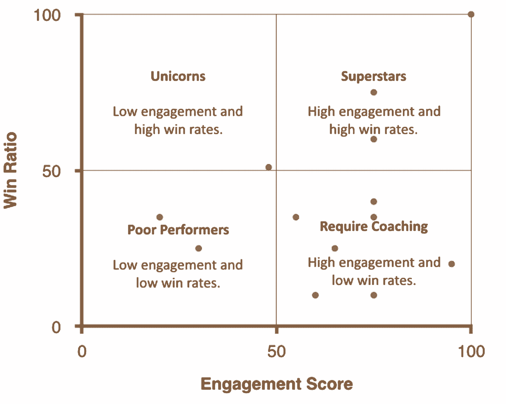

# 正确销售运营的公司变革魔法

> 原文：<https://review.firstround.com/the-company-changing-magic-of-sales-operations-done-right>

今年早些时候，当唐·奥特沃斯 第一次加入 **[Datahug](http://www.datahug.com "null")** 时，销售团队分散在旧金山、纽约和伦敦之间。他们独立运作，彼此隔离。最重要的是，他们不能像需要的那样快速地相互学习和协作。正如奥特沃斯自己所说，“没有什么可以替代一群人坐在一个房间里交流产品、市场和销售经验。”当他加入时，他有机会通过从基础开始重建公司的销售引擎来实现这一愿景。

当时，首席执行官 **[雷·史密斯](https://www.linkedin.com/in/raycsmith "null")** 的任务是创建一个可重复和可扩展的销售流程，内置指标显示团队是否在正确的轨道上。当他被介绍给 Otvos 时，他正在寻找这个系统的架构师，当时 ot vos 是 App Annie 的一名经验丰富的销售运营主管(已经是 Datahug 的客户)。虽然史密斯有知道自己在做什么的销售人员，但他需要有人给他们共同的目标和策略。

情况并非总是如此。一开始，Datahug 很快与一个骨干团队达成了数笔六位数的交易。“所有这些人都在说，‘你做到了，雷！“我们一夜暴富！”但一个月后，我们意识到交易不会一直落在我们头上。我们没有考虑到可重复性——我认为这是很多创业公司都会犯的错误。"

作为 Datahug 的用户，Otvos 在 Dreamforce 2014 年秋季参观该公司办公室时就已经喜欢上了这款产品。到二月份，他作为内部销售和销售运营副总裁领导着销售团队。从那以后，他们的衡量标准、目标和结果都发生了巨大的变化。**很少看到一次招聘就能带来如此重大的变化，但奥特沃斯和他以运营为中心的理念——在史密斯的支持下——确实改变了公司的前景。**在这里，他分享了他所知道的，他所进行的实验，几乎每个初创公司都可以获得的唾手可得的果实，以及如何采用全新的简化销售方法。

# 选择合适的建筑师

“你会看到初创公司一直陷入这种模式——他们雇佣一群独狼，每个人都有自己的才华，拥有自己的一套技能，”史密斯说。“你真正想要的是招募一支努力工作的团队，他们可以在寻找交易的同时一起建立一个系统。你不能让一群人只在这里和那里做几笔大买卖。这是不可持续的。在绝大多数情况下，您需要为扩大客户群的中端市场行动进行招聘。这是人们会相信并投资的增长。”

在很长一段时间里，Datahug 遵循独狼模式，他们不愿意创建一个全面的销售流程。奥特沃斯说:“我刚来的时候，什么系统都没有。“我真的不得不介入并说，‘好吧，让我从头开始构建它，我们会让它工作的。"

使他获得成功的首要因素是什么？他自己已经是一名经验丰富的销售人员。在 App Annie 之前，他曾为 [Yammer](http://www.yammer.com "null") 运营销售业务，在他任职的三年时间里，该公司的年销售额从 40 万美元增长到 8000 万美元。在 2010 年加入 Yammer 之前，他是 MuleSoft 的区域客户经理，Nevis 的内部销售总监，在此之前，他是几家不同规模和产品的公司的代表。

“你看到进入销售运营部门的人有这种二分法。奥特沃斯说:“他们中的一半人都有很强的金融分析背景。“另一半来自直接销售。我认为你想要后者——一个实际上已经在地面上走来走去，完成客户经理角色的人。你更有可能获得与你的个性和技能相匹配的可靠的销售运作。我知道销售开发代表经历的痛苦，这很有帮助。我知道客户经理经历的痛苦。这种同理心帮助很大，尤其是当我正在进行过程改变的时候。我清楚地知道人们会受到怎样的影响，所以我可以事先和他们谈一谈，把事情平息下来。”

谈到流程变更时，Otvos 毫不留情。首先，他制定了一条规则，销售开发代表每天至少需要制作一个产品演示。“我知道我可以要求他们这么做，因为我自己做销售已经很久了，”他说。“每当我告诉团队任何事情时，让他们知道我是凭经验说话，这很重要。而不仅仅是做出冰冷、超然的数据驱动型决策。”

# 获胜团队的简介

关于建立成功的销售团队，有几个屡试不爽的原则。首先，派出一支年轻、充满渴望的球队有巨大的优势。奥特沃斯说:“你可能想从寻找刚从大学毕业、非常渴望在初创公司工作的人开始。“让他们对你的公司感到兴奋，他们将是你业务第一线的最佳人选，打电话和参加会议。”

那不是他们给你的唯一优势。随着时间的推移，他们会产生更多关于你如何管理和组织团队的反馈。“处于职业生涯早期的人更有动力去找他们的经理寻求帮助或问一堆问题。这给了你关于人们在做什么和他们担心什么的数据点。他们也更容易接受首席执行官走过来问他们这样的问题，“你在电话里听到了什么？”人们对你说了些什么？你从更高级的销售人员那里得不到同等水平的反馈。这就是为什么我不会从高级雇员开始。你真的需要有一个坚实的，高接触反馈回路，以找到你最有效的销售策略。"

**建立这种类型的团队需要每个人都在同一个地方。**作为公司的领导，你希望能够四处走动，与团队中的每个人交谈，了解他们对谈话进展的看法，以及你需要做出的任何调整。它还能在销售同事之间建立更紧密的联系。当你的团队需要更多的资深成员时，这给了你一个更好的从内部提升的机会。他们已经了解了这些人和他们的门道，如果他们看到你帮助人们推进他们的事业，他们会更加忠诚。

当 Datahug 销售团队分布在三个城市时，每个人最终都感到孤立无援。几乎不可能得到反馈。史密斯说，人们更关注自己的生产力和薪酬，而不是帮助整个团队。“如果你有一个早期雇员团队，所有人都在一个中心位置，这使你能够走进一个房间，询问每个人他们从客户那里听到了什么，他们都会很兴奋地加入进来，给你提供真正有价值的信息。”

# 重塑你的薪酬计划

销售报酬总是很复杂，而且常常因公司而异。大多数薪酬计划都与结果挂钩:如果一个销售代表能让 *X* 发生，他们就会得到相应的报酬。奥特沃斯说，但这不是思考这个问题的最佳方式。

你总是想根据你的销售代表实际能控制的东西来给他们报酬。

销售代表不可能真正控制一个季度的销售或收入。他们本可以每周工作 100 小时，但仍有交易失败——这令人泄气，而且无助于促进公平文化。

奥特沃斯说:“你要尽可能地将人们的薪酬与‘会议安排’或‘演示’等实际活动联系起来。”。“当你在一家初创公司时，很难计算出你的配额应该是多少——通常没有先例，所以你在那里抛出一个数字，如果有人达到了 100%的配额，你仍然不知道他们是否是一个好代表。你不知道什么是好，任何人都可能偶尔走运。”

早期销售团队更有可能通过收集和分析活动数据来显示谁是优质销售代表，而不是关注配额。配额百分比在早期阶段几乎没有意义。**关注成交率等指标。**一个销售代表的盘子里有多少交易导致了成交？现在，看看这个数字与他们接触潜在客户的比率和频率相比如何。如果有人与潜在客户有很多良好的互动，但他们的成交率很低，这并不意味着他们是一个坏代表。这意味着他们需要帮助。

奥特沃斯说:“在我以前的工作中，有一些成交率低的销售代表被立即列入了绩效改进计划。“这不对。你可能会看到他们实际上正在做大量的工作，但仍未达成交易。一点点不会改变任何事情。”

**在 Datahug，他创建了一个象限系统，并根据销售代表的参与度和成交率绘制销售代表图，以此来追踪这些怀疑:**

“当你把每个人都描绘出来时，很明显，参与度高、亲密度高的人在工作中表现出色。想办法留住他们，因为他们是你的明星，”他说。“还有一些销售代表的成交率和参与度都很低。那些是你真正糟糕的代表，那些是需要被列入改进计划的人。没有低参与度和高成交率这样的事情，所以留给你的是高参与度，低成交率。”

当他调查谁属于最后一个象限时，很明显他们是需要更多培训的销售代表，无论是在他们的方法还是产品方面。因此，Datahug 实际上投资于最终进入这一类别的人——它致力于提供他们所需的培训和资源，以缩小与潜在客户互动和让他们签署交易之间的差距。所有这些人都在两三个月内赶上并进入了“超级明星”象限。

“这对我们来说是非常值得的，因为它提高了全体员工的士气，并为我们节省了替换他们所需的大量时间和成本，”Otvos 说。“你不能仅仅依靠一个指标来告诉你什么对你的员工有用，什么没用。他们值得你深入挖掘，看看所有的相关性。这才是销售运营的真正目的。”

最好的销售运营领导者是那些不怕得出与其他高管团队不同的结论的人。

“当你以创业的速度前进时，用不同的方式分割你的数据需要相当大的勇气，”史密斯说。

# 强制明智地使用时间

当 Otvos 刚开始在 Datahug 工作时，他制定了一个要求:每个销售代表每天都要开一次会议。团队震惊了——这远远超出了他们所做的，他们告诉他这是不可能的——这当然也让他震惊了。“他们都像是在说，‘我不可能让这件事发生！’围绕它有巨大的焦虑。但事实是，对于一个高效的创业公司销售团队来说，每天一次会议是相当标准的。"

奥特沃斯没有告诉他们振作起来，去解决这个问题，而是和团队的个别成员坐在一起，问他们:“告诉我你今天要做什么。”当他们告诉他时，他看到他们每天都花时间研究潜在客户，追踪联系人，将他们输入 Salesforce 等。—很大程度上也是为了内部销售线索。几乎没有时间和精力去培养对外销售线索。

当我们试图提高标准时，人们都吓坏了，但我有责任告诉并展示给他们每一个人，“这就是为什么你们能够做到。”

在 App Annie，Otvos 做的关键事情之一是向一名专注的初级雇员支付每小时 15 美元，让他坐在角落里，搜索 LinkedIn，并将线索和研究输入 Salesforce。通过这样做，他为十几个销售代表取消了这些任务，这些销售代表在那段时间能够更有效率。

奥特沃斯说:“很多公司将这类工作外包出去，有时是离岸外包，但我喜欢对正在做的事情进行很好的监督。”。“此外，你雇来做琐碎的数据充实工作的人也有可能成为一名出色的未来销售人员。也许他们现在还没有能力，但通过近距离工作，他们可以通过偷听别人打电话来学习，另外，他们的研究让他们接触到潜在客户的名字、头衔、你要找的公司类型——如果你把他们提升到销售开发职位并最终提升到 AE 职位，他们将需要很多背景知识。”

一旦 Datahug 雇佣了他们需要的销售管理人员，所有的销售代表就可以每天安排一次会议。而且他们做的时候没有感到压力过大或过度劳累。

“这给整个销售团队带来了全面的连锁反应，”首席执行官雷·史密斯说。“当唐第一次制定每天一次会议的规则时，每个人都在担心他们的薪水。仅仅几个星期后，他们都在说这对他们的委员会有多棒。这是一个立竿见影的巨大收获，每个人都兴奋地更加努力地工作，达到更积极的目标。”

现在，当 Datahug 销售代表开始工作时，他们将启动 Salesforce，并看到当天已经为他们策划的销售线索列表。这是一个巨大的优势，与他们正在做的事情形成了巨大的反差——首先要多花半天时间来追踪这些线索。当奥特沃斯第一次制定这条规则时，他确保强调了这些会议中达成的所有交易。当人们看到他们的额外工作是如何认真地推动针时，这使他们更加热情。

# 投资合适的工具

有才华的销售运营领导将进入任何角色，并立即审核当前使用的工具，评估更好的选择。“根据工具产生的数据检查每一个工具，以及如何使用这些数据来改善你的销售过程，”Otvos 说。“你不只是想要吐出数据的东西。您需要工具来提升您的数据，并向您展示哪些地方需要修复，哪些地方可以提高效率，等等。”

找到一个促进协作的工具非常重要(Otvos 是 Yammer 的粉丝，因为他是该公司的前员工)。需要为团队和个人提供一个展示和分析数据、输入反馈、讨论指标、定性表达他们遇到的问题或他们从潜在客户那里听到的异议的地方。无论您选择哪种协作工具，它都应该可供整个公司的每个人使用。除了销售和营销，工程师和产品经理应该能够登录，看到发生了什么，并提供他们自己的假设或解决方案。

奥特沃斯说:“如果你有一个全面的、可搜索的信息库，当你带来新人时，你就有了巨大的优势。”“假设您有了一个新的销售代表，他们收到了一个潜在客户的问题或异议。你可以告诉他们查一下之前发生的事情。它在数据库里，里面可能也有一些关于如何处理它的建议。”

无论你使用什么工具，都需要让你团队中的每个人都能畅所欲言、无拘无束并分享他们所知道的。

在 App Annie，Otvos 和他的团队使用 Yammer 在世界各地的不同办公室分享经验。每个人都遇到类似的产品问题，并分享他们的个人经验，直到正确的答案成立。从早期开始就拥有这样的工具是您可以为未来规模所做的最有力的事情之一。

除了协作工具之外，您还需要被动自动化代表工作的机制。一些工具可以安排在特定时间发送电子邮件，因此您不必手动发送所有电子邮件。其他工具会自动完成常见表单。诸如此类的事情节省了大量的时间，并帮助销售代表避免了上下文切换，这对于销售效率来说是非常昂贵的。

电子邮件模板就是最好的例子。你肯定希望销售代表专注于使他们的信件尽可能个人化，但是模板使他们所有的工作更加简单和快速。奥特沃斯说:“考虑所有你可以自动化的事情，这样人们就有更多的空闲时间打电话了。”“通常，我会看到有些团队的销售代表花半天时间寻找潜在客户，又花四分之一的时间处理电子邮件。相反，他们应该每天打 50 到 60 个电话，然后使用模板和自动发送功能通过电子邮件跟进。”

**大多数创业公司都忽略了他们手中最有价值的工具，一个不花钱的工具:来自他们自己用户的数据和分析。**

“在 Yammer，我们真的受益于分析团队中专门分析销售数据的人，他们向我们的团队展示了用户的情况，”Otvos 说。“从销售运营的角度来看，这太棒了。他们能够向我们展示注册该产品的顶级公司和个人，这基本上建立了我们第二天要打电话给谁的名单。”这需要工程或分析团队人员的投资，但他表示这非常值得。

销售运营主管和分析用户行为的人之间的直接沟通非常有价值。“我们可以一起浏览数据，找出我们需要在流程中改变的地方，”他说。“销售开发代表应该给谁打电话？客户成功团队应该为续订担心谁？你的分析人员可能会说，“嘿，这是你的顶级用户，这是那些不常使用该工具的用户。”这是一个危险信号。你可以跟进这些客户，确保他们满意，或者提供其他东西来吸引他们。这种数据应该以可访问、透明的方式在您的公司中流动。"

# 健康交流的第一件事

“你对失败的反应应该尽可能透明，”史密斯说。“当人们看到有人失败，然后看到我们的反应不是解雇他们，而是为他们提供改进所需的帮助时，每个人都被赋予了权力。每个人都觉得提问和承认错误更舒服。这也是组织最终变得更好的原因——当人们觉得他们可以主动寻求帮助而不会显得软弱。我们现在有如此多的例子，当他们仍然有机会成功的时候，他们举起双手寻求帮助。出于某种原因，这在销售文化中更加真实和困难。”

他将此归因于这样一个事实，即销售薪酬是高度可变的，并受到同事成就的影响。关键是不要让竞争态度降低透明度。

“这真的可以归结为教练的价值。史密斯说:“你让每个人的成就越透明，就越清楚有一个上升期，总有学习的机会，你周围的每个人并不是在你奋斗的时候一直都在赢。“我们都被困住了。我们都会犯错。当事情发生时，很多人试图隐瞒。他们压力很大。他们变得更加没有生产力，没有人知道如何帮助他们。”

我和任何人之间最大的问题就是他们不寻求帮助。

奥特沃斯说，保持透明度的一个重要部分是彻底沟通你为什么要迭代或改变流程。“当你改变系统的工作方式时，许多人可能会认为他们失败了或者做得不够。你可以用一个非常好的、清晰的解释来避免这种压力。你也想让人们坚定地相信改变会让他们更加成功。不要错过这样做的机会。你会惊讶地发现，消除你可能都不知道存在的恐惧有多么重要。”

# 总是打破东西

不管你修复了多少东西，你总是需要寻找下一个坏掉的东西(或者效率低下的，视情况而定)。

“当我到达 Datahug 时，销售代表们没有开足够多的会议。这是首先需要解决的问题，”奥特沃斯说。“但现在他们开了很多会。那么现在什么坏了？啊，现在我们为 AEs 有太多的会议。我们需要雇用更多的工程师。当我们这样做的时候，漏斗里会有更多的东西。然后，我们将查看漏斗中的所有破损。东西卡在哪里了？我们怎么解决它。你只是不断地试图找出在你的周期中还有哪些地方被打破了。一直迭代到你有可重复性的地方。如果你真的成功了，那么你将面临的问题是达成太多交易，为客户成功创造更多工作机会！”

Datahug 在权衡免费试用的价值时利用了这种心态。

Otvos 说:“在每次演示之前，我们总是会为潜在客户提供免费试用，但我们很快发现，您必须投入大量时间进行试用，尤其是在您为每一个潜在客户都进行试用的情况下。”。“特别是随着销售代表开始召开更多的会议，我们制作了更多的演示和测试，直到我们说，‘好吧，我们不能再这样了。让我们中断这部分流程。"

经过更仔细的观察，他们意识到客户的规模是有影响的。对于某些行业中规模较大的公司来说，提供试用是一种成功的技巧。“我们最终制定了一个规则:‘如果一家公司属于 X 规模范围，并且处于 Y 行业，让我们投资一个试验。如果没有，就没有审判。我们节省了大量时间，并能够在真正重要的地方专注于提供更好的试用体验。“这只是一个例子，说明修复流程中的一个环节会导致整个流程出现问题。不要让自己不知所措。沿着这条线移动，一次修复一个。当你完成后，你可能需要重新开始，让事情变得更好。

“现在我们知道，一定数量的电话和电子邮件会变成一定数量的会议。这些会议将产生一定数量的演示，其中一些将变成试验，”Otvos 说。“因为我们对这些指标了如指掌，所以当我们再次从顶部开始时，我们知道如何将它们提升一点。”

尽管 Datahug 以数字为导向，但 Smith 和 Otvos 认为销售运营不仅仅是生成和阅读报告。它深深触动了公司文化的核心。

“销售运营不仅仅是销售的支柱，”Smith 说。“这是保持营销、客户成功、销售、工程和所有人共同努力为客户提供优质服务的关键。更重要的是，它让这些团队中的每个人都相信他们的工作是有意义的——我们总是会以聪明、有条不紊的方式变得更好，这将转化为他们职业生涯中的长期成功。这是无法定价的。”