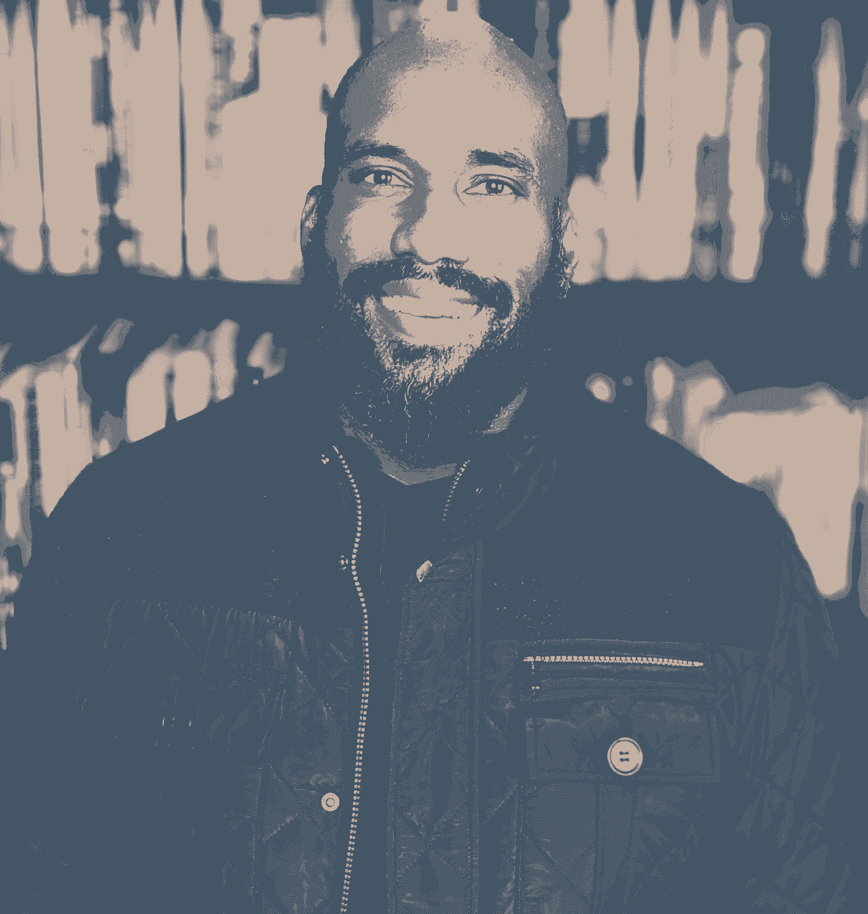

# 工程领导者打造脱颖而出的个人品牌指南

> 原文：<https://review.firstround.com/the-engineering-leader>

为了描绘安娟·西蒙斯 的工程生涯，你需要回到一个不太可能的源头——《[星际旅行:下一代](https://www.imdb.com/title/tt0092455/ "null")》“由无与伦比的莱瓦尔·伯顿扮演的乔迪·拉·福吉是星舰“企业号”的首席工程师。尽管这是科幻小说，但看到一个黑人负责那艘船上的技术给了我灵感。西蒙斯说:“我开始想，‘也许我可以成为一名工程师。’”“这也是我最终学习电气工程并进入软件开发领域的部分原因——这与表现有关。”

西蒙斯确实走了这条路，在进入创业公司之前，他从埃森哲和德勤这样的咨询公司起步。尽管他目前在 **[公司担任工程主管，忙得不可开交，但他已经把早期关于表现的课程牢记在心。这些年来，西蒙斯成功地开辟了一个强大的副业，作为一个经常预约的公共演讲者，同时也在 Twitter](https://www.helpscout.com/ "null") 和他自己的个人博客上写关于工程和领导概念的文章[。他涉及的话题从睡眠黑客和虚拟现实的未来，到管理神经多样性——他不怕变得脆弱。](https://twitter.com/anjuan "null")**

去年，在黑人的命也是命抗议席卷全国之后，他关于成为黑人科技领袖的推特帖子引起了共鸣。“我经常引用萨莉·赖德的话，他说，‘你不能成为你看不见的人。’由于科技界没有太多黑人，我们也不经常出现在科技杂志的封面上，或者在美国消费者新闻与商业频道接受采访，这种缺乏代表性的现象会让我们产生疑问，“我在这里真的有一席之地吗？””他说。

当我出席一个会议时，我通常是发言名单上唯一的黑人，有时也是活动中唯一的黑人。我站在世界各地的舞台上，代表你们*确实*在技术领域有一席之地。

早在 2016 年的开源大会 [OSCON](https://www.oreilly.com/conferences/oscon.html "null") 上，西蒙斯就从书本跃上了舞台。他的第一次演讲只有五分钟长，但他被吸引住了。从那时起，从布达佩斯到波哥大，在诸如 GitHub Universe、LeadDev 和 QCon 这样的会议上，他成了全世界的焦点。

西蒙斯并不是唯一一个有志于写作和演讲的工程领导者。在不同的角色和职业阶段，许多人都有建立个人品牌的崇高目标——机会比以往任何时候都更容易获得。无论是加入虚拟会议小组，还是在更随意的俱乐部舞台上跳来跳去，公开演讲如今正变得越来越常见。创作者们到处都在发布 Substack 时事通讯，甚至 Twitter 也加入了内容货币化的游戏。

但是在开始和登上舞台之间有很大的差距。即席发言或精心制作内容带来新的东西是很棘手的。有一个工程师怀疑的眼神询问他们是否有新的东西要说，也可能有强烈的负罪感。值得花时间去做这些兼职项目吗？它是不是给你的职业生涯增加了一个新的维度，或者你最好学习新的框架，赶上吉拉的门票，或者[承担工程领导角色](https://review.firstround.com/the-engineers-guide-to-career-growth-advice-from-my-time-at-stripe-and-facebook "null")？我们关注这个话题已经有一段时间了，但发现很难分享具体的建议。西蒙斯熟练地在相关的、可接近的建议之间穿针引线，搭配经过测试的策略让你开始。

在做了五年多的公开演讲人(做博客的时间更长)之后，西蒙斯收集了大量的建议，并为那些希望涉足拥挤的“思想领导力”领域并引起轰动的人编写了一本剧本。在这次独家采访中，他给我们上了一堂从头开始的速成课——从寻找独特的话题，到精心制作你的演讲曲目，再加上他来之不易的将这项重要工作纳入已经拥挤不堪的 eng leader 日程的经验。一路上，他打破了一些关于个人品牌的最常见的神话，以及可能让你偏离方向的坑洞。虽然西蒙斯的大部分策略都集中在公开演讲上，但他也致力于发展你的博客和社交品牌——这里有很多精明的技巧可以记下来。让我们开始吧。

# 误解 1:个人品牌与你的日常工作截然不同。

当人们向西蒙斯寻求建立个人品牌的建议时——无论是通过写作、演讲，还是两者兼而有之——他有一个简单的智慧金块:你可能已经在这么做了。“我每天都写很多东西——都是在空闲时间和电子邮件中写的。他说:“作为工作的一部分，你必须与人沟通。

在他职业生涯的早期，他开始重塑自己对公众演讲的看法。“我大学毕业后的第一份工作是在埃森哲，最终我被提升为经理。他说:“通过沟通优先事项和带领团队完成可交付成果，我开始明白沟通在专业层面上有多重要。

他是 Twitter 的早期用户，在 2007 年创建了自己的账户。但是当他觉得角色限制太严格时，他推出了他的个人博客。“我开始写博客的时候，并没有指望其他人会阅读我写的东西。我开始写博客作为我的备用大脑——无论是写我发现有用的过程还是回忆我生活中的事件。西蒙斯说:“有好几次，当我去做某件事的时候，我意识到我已经就此写了一篇博文，而不是从头开始。

“如果有一个问题是我被问得最多的，那就是我如何将公开演讲或个人写作融入我的日常工作。但我并不认为它们是完全独立的，”他说。除了致力于代表科技领域的黑人领袖，西蒙斯还亲眼目睹了许多经常被忽视的其他职业提升。“我经常被问到指导我职业生涯的关键决策。他说:“在我 25 年的软件开发生涯中，决定成为一名作家和演说家可能是提供了巨大好处的唯一决定。

## 展示你的作品。

借用[在他前面提到的 Twitter 帖子](https://twitter.com/anjuan/status/1272521446397480962 "null")中的一句话，西蒙斯说他工作时有点急躁。“我努力让自己的表现无可挑剔。开会迟到？不会吧。生产马虎的工作？不能这样。然而，携带这种芯片已经是一项非常艰难的工作，更是一种负担，”他说。

我开始在科技会议上发言的一个原因是“展示我的工作”,描绘我作为一名黑人对软件开发工作的思考和深刻理解。

当你想改变你的职业生涯时，考虑写作或公开演讲如何帮助展示，而不仅仅是讲述。“你可以精心制作一份简历，展示几乎任何你想讲述的故事。西蒙斯说:“在科技活动上发言、为科技出版物撰稿、在我自己的个人网站上写作——这不仅仅是一份简历。

求职面试有很多内容要谈，而且时间紧迫。他回想了好几次自己准备面试的地方——研究了公司和小组，精心构思了他的关键故事——结果却和看过他一次演讲的面试官坐在了一起。

“任何读过我的博客或看过我的演讲视频的采访者都会对我所做的事情和我真正热爱的事情有一个真正的了解。西蒙斯说:“我们基本上可以跳过探索部分，直接进入面试的实质内容。“这对我得到这份工作有帮助吗？从来没有人明确说过。我肯定公开演讲本身是不够的，但它有帮助。有什么比在舞台上展示沟通技巧、谈论技术话题和工程领导力更能证明我适合担任某个角色？”他说。

## 扩展你的智力。

“就像我的个人博客是我的备用大脑一样，它也是一个很好的自动应答器。作为一名工程领导者，我经常收到人们的请求，要求我帮助他们理解一些概念。他说:“我过去常常对每个问题都写一个新的回答，但我很快意识到这样做不太合适。“现在，当我收到对某件事的请求时，如果我还没有写下它，我会将它发送给请求者——更好的是，我可以为任何后续请求重新共享该博客帖子。”

## 免费培训提升技能。

很多人都计划每年参加会议，但是日程表排得满满的，有些人根本没有时间去安排日程表上的时间。当西蒙斯注册参加一个会议时，大多数人都带着一张免费的入场券——如果时间允许，他会充分利用这个机会。“通过注册成为一名演讲者，我参加了一些难以置信的活动，否则我会错过这些活动。他说:“我可以从编写技术的人或很好地使用技术的人那里了解技术，然后我可以把它带回到我的团队——我有很多想法，可以带回去给我的老板。“例如，我参加了一次会议，Yelp 的一名工程师讨论了他们如何使用赞助电子表格来记录每位工程师在公司获得支持的方式。我喜欢这个想法，并向我的老板提出了这个想法，她授权我在 Help Scout 实施同样的想法。”

## 扩大招聘范围。

像大多数领导者一样，西蒙斯最关键的指令之一是为他的团队招募人员。但是站在无尽的招聘信息中，你会觉得自己像是被困在了一台没有开关的跑步机上。“当我参加会议时，我总是戴着招聘经理的帽子。我会遇到各种各样寻找新机会的人，我会根据我遇到的人来安排角色。这极大地增加了我的渠道，”他说。在今天的虚拟会议世界中，他依赖于数字工具——许多会议都开设了空闲频道(甚至有专门面向求职者的频道)，因此与会者可以在没有面对面会面的情况下进行交流。

我的写作和公开演讲让我成为了一名更好的领导者，因为它让我负起责任。我公开表示“这是我所关心的。”

# 误解 2:最好的演讲者是几个领域的大师。

西蒙斯是一位多产的科技演讲者，但他的副业最突出的不仅仅是事件的数量，而是每当他排列幻灯片时，他给舞台带来的创造性旋转。他将[技术领导力和地下铁路](https://anjuansimmons.com/talks/technical-leadership-through-the-underground-railroad/ "null")之间的点点滴滴联系起来，将[开发者置于英雄旅程](https://anjuansimmons.com/talks/leadership-lessons-from-the-agile-manifesto/ "null")的中心，甚至与他的妻子[阿内卡·西蒙斯博士](https://www.linkedin.com/in/aneika-simmons/ "null")合作，获得关于[燃烧倦怠](https://anjuansimmons.com/talks/managing-the-burnout-burndown/ "null")的战术。

Anjuan Simmons, Engineering Leader at Help Scout

当你步入聚光灯下，开始点击浏览你的幻灯片时，你可以涵盖无穷无尽的主题——找到正确的主题就像从海滩上采摘一粒特定的沙子。Simmons 发现菜鸟演讲者遇到的一个问题是覆盖一系列话题的压力——当你刚刚开始建立个人品牌时，这种压力似乎特别大。他的建议？继续打磨你最好的想法，不要继续尝试挖掘全新的宝石。“我是回收谈判的坚定信徒。他说:“我最受欢迎的演讲之一叫做[借贷特权](https://anjuansimmons.com/talks/lending-privilege/ "null")，我已经讲过无数次了。

想起你最喜欢的歌。你听过这首歌吗？强势说话也是一样。

当谈到确定你的标志性话题时，西蒙斯带我们通过几个关键问题来找到你的最佳切入点:

**当你开始你的职业生涯时，你最努力去理解的事情是什么？**“基本上这个问题的任何答案都是精彩的演讲，因为每天都有人像你一样进入这个行业，他们也在为完全相同的事情而奋斗。是什么让你慢了下来？我早期的一些技术讲座是关于建立一个稳定的开发环境，解决或调试常见开发问题的方法，或者如何编写拉请求。这些都是基本的主题，但它们仍然非常强大，尤其是对于软件开发新手来说。”

在你的领域里，有你崇拜的演讲者吗？你认为是什么让这位演讲者如此伟大？“我这里的目标不是让他们复制/粘贴那个人，而是解构核心元素，然后把那些元素烘焙成自己的风格。我尊敬的一些演讲者是[劳拉·霍根](https://twitter.com/lara_hogan?ref_src=twsrc%5Egoogle%7Ctwcamp%5Eserp%7Ctwgr%5Eauthor "null")、[埃里卡·史坦利](https://twitter.com/ericastanley?lang=en "null")、[萨隆·伊特巴雷克](https://twitter.com/saronyitbarek?lang=en "null")和[帕特里克·夸](https://twitter.com/patkua?ref_src=twsrc%5Egoogle%7Ctwcamp%5Eserp%7Ctwgr%5Eauthor "null")(仅举几个例子)，因为他们谈论我每天遇到的问题，并且能够清楚地(通常很聪明地)解释我可以立即实施的可行解决方案。”

## 发展谈话:让它真实、友好、有趣(并重复)。

但是缩小主题范围，无论你是发表 10 分钟的分组讨论还是一小时的主题演讲，都只是冰山一角。为了应对填满一个空的主题演讲台的令人生畏的挑战，西蒙斯调整了一个简单的工程格言，并将其应用于制作一个尖锐的演讲轨道。

“‘让它工作，让它正确，让它快速’是构建软件的准则(通常被认为是[肯特·贝克](https://en.wikipedia.org/wiki/Kent_Beck "null"))。它基本上是说，软件开发应该关注每个特性的工作实现(不用担心优雅)，然后改进代码(重构，消除代码味道，等等)。)，然后使代码具有性能。西蒙斯说:“这是为了减少由于花太多时间预先考虑实现该功能的所有方法而导致的延迟。

下面是他如何将类似的精神特质应用于制作新的演示文稿:**让它真实、友好、有趣**。他进一步勾画出三重奏中的每一步。

### 让它符合事实。

“首先，我从谈话的事实开始。我需要向观众传达的目标是什么？西蒙斯说:“当然，每个演讲都需要基于事实，有足够的支持材料，而不仅仅是轶事或维基百科研究。但是同样重要的是根据你的特定听众所关心的事实来定制你的演讲。“你应该经常与会议组织者联系——他们应该能告诉你观众的概况。另一个研究来源是贸易协会。西蒙斯说:“访问他们的网站，订阅他们的时事通讯，以便更好地了解活动参与者最关心的话题。

“我最受欢迎的演讲之一《借贷特权》围绕包容性和多样性展开。我在演讲中涉及了一些沉重的话题，比如某些身份如何在历史上被拒绝进入软件开发职业的详细例子。有些事件已经做好了深入审视这段历史的准备，而有些则没有。我发现的一个方法是做我的研究。然后，我会根据我的发现添加或删除细节，”他说。

### 友好相处。

“事实摆在眼前，我能做些什么让它变得平易近人呢？在这里，你会看到我引入类似地下铁路的类比——这是一件大多数人已经理解并能与之联系起来的事情。西蒙斯说:“大多数与会者已经有了一份全职工作，我不希望我的演讲对他们来说像是一份兼职。”当涉及到构建易于消费的会议时，他严重依赖图像来组成他的幻灯片——因为我们都觉得我们的眼睛在第一眼看到大量文本的演示时变得呆滞。

“软件工程师非常喜欢技术演示，但每个开发人员也是人，人类对故事有一种[般的天然亲和力](https://firstround.com/review/how-this-5x-founder-creates-an-internal-culture-with-a-crazy-focus-on-storytelling/ "null")。我通常通过我的谈话编织两三个故事。西蒙斯说:“如果我能利用自己生活中的故事与观众沟通，尤其是当我犯了错误并从中吸取教训的时候，这是加分的。”

“例如，在我从敏捷宣言中学到的领导力课程中，我分享了我最初是如何拒绝我团队中的一名穆斯林成员的，当领导团队中有人在一个松弛的频道中开了一个关于猪的下流玩笑时，他很生气。但经过反思，我意识到我需要在公司的各种沟通形式中加强尊重文化，包括 Slack，”西蒙斯说。“我在该频道上发布了一条信息，其中提到了公司关于尊重和包容的价值观。我希望我能早点采取行动，但那个小小的行动让大家在心理上更加安全。”

由于走上舞台的本质，你可能会觉得你需要知道所有的答案。但根据西蒙斯的说法，你正在错过一个与观众进行更深层次交流的机会。“人们被脆弱所吸引，因为我们都有弱点，但是很少有人讨论他们的失败。当我看到观众们使劲点头时，我知道我已经成功地解决了与会者的痛点。这是让他们接受我的解决方案，将其作为解决他们问题的可行答案的关键，”他说。

平易近人的谈话的最后一个要素？激情。“不管话题是什么，如果演讲者对谈话不感兴趣，听众就不会关心这个话题。通过展示我自己的激情，观众可以放松下来，至少可以看到*一个人玩得很开心，”他说。*

### **让它变得有趣。**

“最后，我总是把幽默放在最后，因为这最费功夫。西蒙斯说:“在排练的时候，我会尽量找机会让自己笑起来——通常要排练好几次。“整个演讲不应该是一个喜剧场景，但幽默可以吸引观众。我试图在开始时用一个笑话让他们措手不及，并在房间里注入一些能量。”

他从《站立的世界》中借鉴了一些观点:

**涉及个人。“我经常发现最好的幽默机会是在我生活中用来阐述观点和变得脆弱的情况下。你必须能够自嘲。例如，我经常和我有商业博士学位的妻子谈论如何管理职业倦怠。当我完成介绍后，我把它交给我的妻子来介绍下一部分，我让观众知道他们将听到一位专业人士的介绍，而不是像我这样只从维基百科获取信息的人。**

每个观众都是不同的。我明白了，笑话可能对一些观众有效，但对另一些人无效。在我的[领导力课程中有一张幻灯片，来自敏捷宣言](https://anjuansimmons.com/talks/leadership-lessons-from-the-agile-manifesto/ "null")，展示了 2001 年 2 月在[一个滑雪胜地写敏捷宣言的人，这是一张所有白人的照片。我说，他们聚集在小屋是为了娱乐、放松，显然是为了谈论多样性和包容性。这个笑话引起了大多数观众的狂笑——但它也遇到了蟋蟀。仅仅因为一个笑话失败了一次，并不意味着你应该把它完全从你的谈话中删除。”](https://agilemanifesto.org/history.html "null")

### **起泡沫，冲洗，重复。**

这个过程不是一劳永逸的，而是一个持续的过程。“记住，没有交谈就真的完了。西蒙斯说:“租借特权是我最受欢迎的演讲，几乎每次上台，我都会做些调整。“因为它将多样性和包容性作为司法工作来讨论，所以我经常在新闻中提到最近的一个不公正的例子。无论是手无寸铁的人被杀，还是被有权有势的人骚扰的揭露，不幸的是，我从来不缺少某些身份如何被边缘化和压迫的新例证。2020 年 5 月乔治·弗洛伊德被杀后，我在接下来的几个月里发表《借贷特权》时经常提到他的死。”

这一切都可以追溯到用几个基础话题把你的股份放在地上，而不是试图覆盖一个宽阔的泊位。你不仅将注意力集中在你最好的想法上，而且作为额外的奖励，你更有可能被预订。“对活动组织者来说，没有什么比久经考验的演讲更有吸引力的了。他说:“如果你能在 Twitter 上展示与会者的积极反馈，那就更是如此。

# 误解 3:伟大的演讲者毫不费力。

也许最顽固的演讲神话之一就是你要么是天生的演说家，要么不是。很容易理解为什么这种信念一直存在——最好的公共演说家总是让听众感到毫不费力。但西蒙斯证明，虽然可能有少数人能轻松掌控拥挤的房间，但更多时候这是一段艰难的旅程。

“我小时候结巴过。西蒙斯说:“如果你在中学时告诉我，我谋生的一部分将是站在舞台上对数百人演讲，我可能会说你疯了。正如他所描述的，对于一个自称喜欢硬科学——戏剧——的书呆子高中生来说，在舞台上变得舒适需要一个奇怪的选修选择。“我真的很想不让我的口吃阻碍我——我不想让我的语言障碍成为让我害怕或意识不到我的潜力的东西，”他说。

他承认这个建议可能有点老生常谈，但仍然至关重要——解决这种恐惧的最好方法之一就是练习。“你不必从一个大房间或一群虚拟的陌生人开始。它可以简单到在下一次团队会议上自愿展示几张幻灯片。西蒙斯说:“从这里开始。

对我来说，这是一个在舞台上变得更加舒适的缓慢而有机的过程。耐心点。

最伟大的职业运动员不会出场比赛，只是临场发挥。每个人都有自己的赛前习惯，西蒙斯也不例外。一旦你(最终)登上舞台，他有很多让你成功的战术建议。

## 前一天晚上。

查看土地的布局。“我试着参观我将要演讲的房间，感受一下它的布局。通过提前检查房间，我不必在演讲时匆忙适应环境。这些天来，为了进行虚拟演示，我用日常使用的背景做了一次测试，以确保一切看起来都很专业，而且我身后没有任何分散注意力的东西。”

吃好，避免饮酒。“晚餐时，我坚持‘安全食物’吃什么是安全的因人而异，但我避免碳水化合物和糖，因为食用它们会让我第二天感到昏昏欲睡。我喝很多水，不喝酒——如果你有演出前的紧张情绪，这看起来很诱人。但这会影响我的睡眠质量，我最不希望的就是在舞台上宿醉。"

**睡个好觉。**“我再怎么强调充足的休息也不为过——即使你在会议的欢乐时光里玩得很开心，或者在虚拟会议前夕家里有很多事情要做。站在观众面前已经够难的了——脑雾让这变得更加困难。我试图在演讲的前一天晚上多睡一个小时，所以如果我通常睡七个小时，我会尽量挤八个小时。”

## 一小时前。

**向你的技术人员报到。"**您的确切需求会因您是亲自出席还是虚拟演示而有所不同。我亲自和视听人员一起安装麦克风，做最后一次检查，确保我的笔记本电脑连接到观众可以看到我的视觉辅助工具的屏幕上，并测试我用来播放幻灯片的遥控器。对于虚拟演示，你需要确认你正在使用的屏幕共享软件工作正常，你可以看到你的演讲者笔记，并且[你没有设置任何疯狂的过滤器](https://www.nytimes.com/2021/02/09/style/cat-lawyer-zoom.html "null")。最后一步是始终激活我的笔记本电脑上的勿扰模式，这样我就不会因错误的空闲 pings 而分心。”

打开一些音乐。“我戴上耳机，把我的预播放列表的音量调大，播放着一组被严密保护的宣传歌曲。”

**最终确认。**“我亲自确认我出场时应该使用的舞台一侧，以及视听人员是否会处理我的麦克风静音，或者我是否需要自己做这件事。如果有计时器的话，我会确认它会向上计数还是向下计数，我通常会安排人给我五分钟的警告手势。虚拟世界也是如此——我应该期待哪些线索来让我保持正轨？这些事情可能看起来微不足道，但聚光灯下的任何惊喜都会让你分心。”

掩护你的基地。“这一小时我不吃东西，只喝饮料，最好是水，不喝碳酸饮料。我最后一次去了洗手间(在确保我的麦克风静音后)，并吞下了几粒润喉糖，以防止喉咙发炎。”

## 一旦你登上舞台。

你的问候让我心动。"开始演讲时的开场白通常是最难的，但它们开启了你与观众之间的关系。我的开场白是我排练最多的，我确保我能凭记忆说出它们。当你完成了开头的几行，你就开始摆脱一些不可避免的紧张情绪。”

**扬帆渡过任何灾难。**“如果有任何技术上的困难，它们可能会在一开始就出现。当你记住了开场白，你就可以在自己或技术人员努力解决问题的时候把它们说出来，而不是像一头被车灯照着的鹿。”

**结交人脉。**“与观众进行眼神交流至关重要——既能让他们感受到参与，也能让你感受到与他们的联系。我确保从观众的左侧扫描到右侧，并与每个区域(左侧、中间和右侧)的一个人进行眼神交流，并直接对他们说话几秒钟。对于虚拟演示，经常要确保你正对着摄像机——而不仅仅是看你的幻灯片或演讲者的笔记。

不要往心里去。“如果你在给任何规模的听众做演讲，很有可能会有一个或更多的人退席。不要让这影响到你。人们出于各种各样的原因离开或注销 Zoom 去洗手间，接工作电话，或者他们意识到另一个会话更适合他们。这意味着你要说的话，观众中有合适的人。”

作为一名工程领导者，西蒙斯的日程排得满满的，他承认他不能总是遵循这种演讲前的例行公事。他说:“我的全职工作是领导软件开发团队。“在我不得不上台之前，我一直在打工作电话，跑到舞台上，放松地发表我的讲话，就像我刚刚从一个美好的午睡中醒来一样，然后冲回酒店继续我的下一个电话。”

这并不总是容易的，但我发言的一个原因是，越来越多像我这样的人找到了进入技术领域的方法，因为我们可以为这个行业带来如此多有价值的观点。技术将受益于其他人的加入并能够大放异彩。

# 总结:如何将个人品牌融入公司文化？

在他职业生涯的这个阶段，公开演讲现在是西蒙斯作为工程领导者的个人品牌的基石。但情况并非总是如此。“我以前所在的公司不太支持公开演讲，所以我不会对此直言不讳。他说:“我遇到过一些人，他们被公司领导告知不能参加任何公共活动。

在他看来，这是一个巨大的错失机会——尤其是对初创公司而言。“在过去的五年里，我工作过的大多数公司都非常小。西蒙斯说:“但我在发言人名单上，排在 FAANG 公司员工的旁边，这有助于提高在外面为你的初创公司摇旗呐喊的可信度。”。

他对希望将此融入企业文化的公司领导人有何建议？要直言不讳，要自豪。西蒙斯说:“把它记录下来——大声说，‘我们真的很欢迎演讲和思想领袖，我们鼓励你花时间在技术活动上展示。’。如果公司领导层通过上台来示范自己的行为，那就更好了。”我们在 Help Scout 的座右铭之一是[持续不断的改进(CANI)](https://twitter.com/anjuan/status/1273383195275227136?s=20 "null") ，这包括逐渐提高公众演讲的技巧。我们有一个松弛的频道，当团队中有人在做任何公开演讲时，我们会发布，并给他们一个大喊。通过明显地支持它，你的公司可以营造一种氛围，让人们觉得说‘你知道吗？“我也打算尝试一下公开演讲。”"