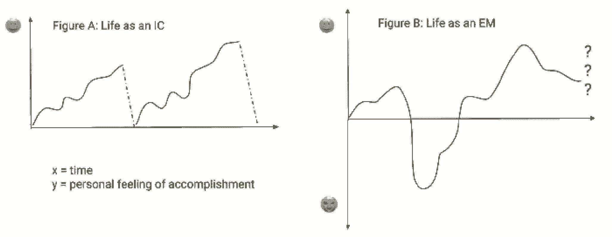
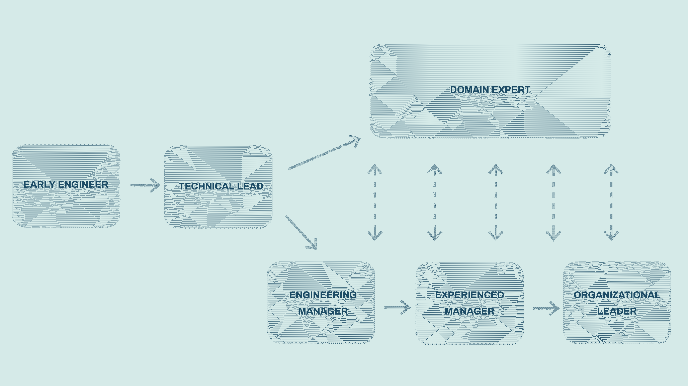
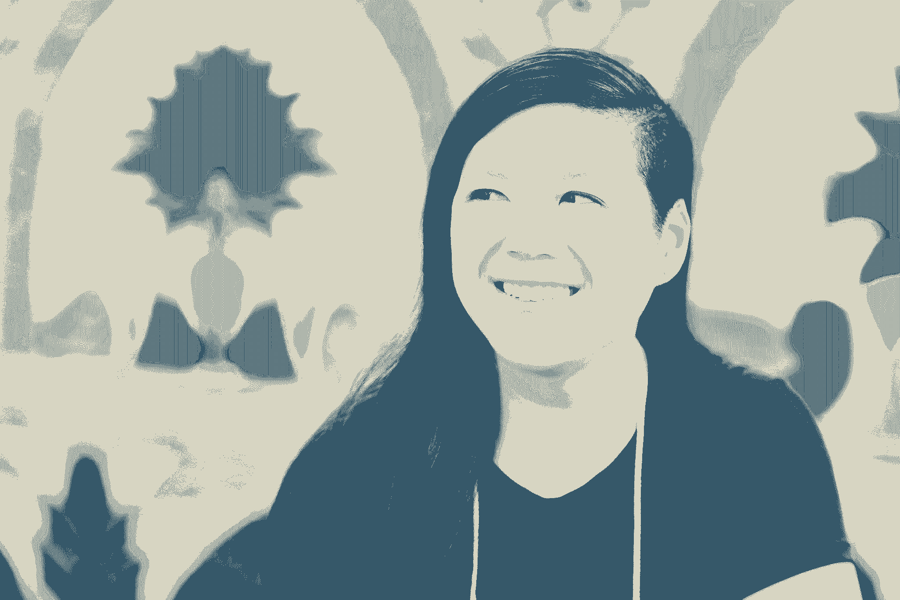

# 《工程师职业成长指南》——我在 Stripe 和脸书工作期间得到的建议

> 原文：<https://review.firstround.com/the-engineers-guide-to-career-growth-advice-from-my-time-at-stripe-and-facebook>

瑞琳恩·容 喜欢说她进入工程管理的道路在某些方面是渐进的，而在另一些方面则是充满挑战的狂野之旅。她第一次体验工程经理的生活是在 2011 年，在她描述为一个小团队的脸书。“有三个人——包括我自己，”容说。“日常生活并没有什么不同。我仍在钻研代码，但在学习如何招聘和保持一对一的同时，我也在努力平衡。”

然后狂野之旅开始了。随着她的团队从 3 人扩大到 30 人，甚至更多，Yung 不得不系好安全带。“我从审查代码转移到拥有公司指标和在多个办公室建立团队，”她说。2015 年荣智健离开脸书时，她是一家拥有 1 万多名员工的上市公司中最年轻的工程总监，比她当初作为一名毕业生加入这家当时只有 700 人的初创公司时高出了好几级。

当她加入 Stripe 时，Yung 接受了一种不同的挑战。“我想看看我是否具备在完全不同的环境中成为一名伟大领导者的素质，”她说。(剧透提示:她有。)在 Stripe 从 200 人发展到 1500 多人的近四年时间里，Yung 建立了产品管理团队，定义了职业发展和招聘框架，运营了核心支付业务，并在新加坡建立了公司的全球工程中心。

在两次截然不同的创业旅程中坐在前排，给她留下了清晰的印象。"**个人成长伴随着公司成长**。在脸书，我专注于尽可能多地向经验丰富的领导者学习，他们是随着我们的成长而加入的。“在 Stripe， *I* 是那些负责人之一，任务是找出问题所在并教导他人，”Yung 说。“我不得不尝试新的内部项目，向同事和前任经理寻求建议，并寻求辅导和培训。”

她将这个速成课程转化为大量埋头写作的时间，制作了 [Stripe 的《扩展工程团队图集指南](https://stripe.com/atlas/guides/scaling-eng "null")，以及她自己的[工程团队手册](https://github.com/raylene/eng-handbook "null")(涵盖了从 1:1 到绩效评估的所有内容)。在爆炸式增长的初创公司工作了十年后，Yung 离开了 Stripe，抽出一些急需的时间，开辟出空白空间，继续分享她所学到的东西。

她希望将自己的注意力特别集中在一个主题上:**工程师的职业发展**。“你听到的大多数建议都是关于快速前进，而不是停下来吸收你所能吸收的一切，”她说。在这次独家采访中，容分享了一系列违反直觉的职业经验，这些经验是她从艰难的道路上得来的。她还深入探讨了为什么 IC 和管理轨道不是平行的阶梯，而是交织在一起的阶梯。最后，她涵盖了可能出现在你工程职业生涯每个阶段的更具体的障碍，以及当你试图将它们推到一边时可以作为内脏检查的指导性问题。

对于不同的职业阶段，既有广泛的经验教训，也有针对性的建议，这里有很多智慧可以挖掘。无论是在拐角处观望未来的年轻工程师，还是试图应对日益棘手的技术和管理障碍的经验丰富的领导者，容都要求**每一位工程师在规划职业生涯时问自己** ***正确*** **的问题。**

# *寻找针对您具体情况的建议？跳转到 Yung 为新工程师、技术领导、领域专家、早期工程经理、更有经验的经理和工程组织领导人提供的职业建议。在这里获得她建议的有用摘要。*

# 打造工程师职业生涯的三大关键经验:

有一些潜在的主题可以贯穿你的职业生涯——这三条经验是荣氏在每个阶段的基础:

# 1.努力成为最有价值的，但最不挑剔的。

我们中的大多数人可能会因为被描述为项目成功的“关键人物”而激动不已。但根据容的经验，对于一名工程师来说，这是一个危险的领域。以她在脸书时的经历为例。容已经巩固了自己作为公司发布许可专家的地位，但她很快就发现了作为关键人物的缺点。

“我正在为我的第一次马拉松比赛进行训练，刚刚跑完 20 英里——却发现有人在呼叫我直播事故。她说:“我记得穿着衣服坐在浴缸里，有点神志不清，每只手里拿着几大瓶佳得乐，笔记本电脑开着，试图弄清楚发生了什么。“这同时是一个高点和一个低点。我觉得自己很重要，很被需要，但我只想休息，离开这里。我发誓要立即开始向我的队友传授尽可能多的知识，这样他们就可以在没有我的情况下拥有解决问题的工具。”

**虽然你可能听说过常见的工作格言“让自己摆脱工作”，但容认为这种措辞过于简单。对她来说，与其说是让自己过时，不如说是让自己不那么挑剔。**

当你对一个项目至关重要时，你在某件事的成功、失败或存在中起着决定性或关键性的作用。作为领导者和工程师，我们在某些时候都处于这种境地。但是你不能呆在那里。

“当你有价值的时候，你是非常有用或重要的——但不是一个失败点，”容说。“最优秀的工程师和经理擅长增加价值，最大限度地利用他们周围的人，并帮助团队看到周围的角落，即使他们不在那里。”

# 2.想成为成功的经理吗？建立情绪平衡。

到目前为止，大多数人都很清楚[强迫工程师进入管理层是一个错误](https://firstround.com/review/this-is-what-impactful-engineering-leadership-looks-like/ "null")。对大多数工程师来说，挑战在于决定这是否是他们想要承担的责任。“尽管向管理层的过渡有时会很快，但还是要深入思考这个问题，并尽可能做好准备。容说:“太多的工程师一头扎进去，却没有探索轻量级的方法，先试一试经理的帽子。

“我开始承担更多的团队责任，并作为脸书训练营的导师让新员工入职。我领导了一个大型的技术项目，并且有了平衡工程工作和人员领导的感觉。项目启动时，我知道我想花时间成为一名优秀的经理。”

管理不适合心脏衰弱的人。虽然成为一名伟大的经理真的很难，但却令人难以置信地值得——这也是我选择花很多醒着的时间努力做得更好的事情。

尽管如此，世界上所有的准备工作都不会让你为即将到来的情感挑战做好准备。“大多数时候，这就是我最终指导新经理的方式，”容说。“作为一名 IC，你看不到管理者必须应对的所有起伏的全貌，因此很容易陷入自以为准备好了的陷阱——一旦意识到自己没有准备好，就会惊慌失措。”

为了帮助未来的经理们更好地了解将要发生的事情，Yung 在白板上画出了这张图表，给他们一个直观的比喻([，她在这里做了更详细的解释](https://medium.com/@emdashry/modern-portfolio-theory-for-management-variance-maximization-in-engineering-7dde7269e8a4 "null")):

The productivity journey of engineering life, contrasting individual contributors and engineering managers

“作为一名个人贡献者，你的工作通常看起来像是一场当地的爬山运动。对于大多数项目，你稳步取得进展，直到你没有进展。你要么完成了，可以继续前进，要么可能出了什么差错，你的项目被取消了，或者只是失败了。不管怎样，下次你都要从零开始，”容说。

但是工程经理**打开了这张图表**的负面区域。“作为一名 IC，我有点完美主义。她说:“我白纸黑字地思考，设计系统，详尽地列出所有边缘案例。“作为一名经理，我花了很长时间才意识到，你不能用那种方式解决问题。人不是优化问题——你必须接受有一系列解决方案，没有一个真正伟大的答案。”

另一个观察:**进步和感情不再紧密相关**。“作为个人贡献者，一般来说，当你在一个项目上做得很好时，你就取得了明显的进步。容说:“作为一名工程经理，你可能会为某件事努力工作一年多，但短期内看不到任何进展，而*或许*会在更长期内获得巨大回报。”。

所有这些加在一起会让你的情绪以你无法预测或控制的方式下降。“你的情绪会剧烈波动。你的团队越大，在任何给定的时间里，出问题的可能性就越大。波峰和波谷变得越来越大，”她说。“第一步是意识到[这是完全正常的](https://firstround.com/review/give-away-your-legos-and-other-commandments-for-scaling-startups/ "null")。第二步是试图建立更多的平衡，这样你就不会那么容易偏离轨道。”

有经验的经理之所以伟大，部分原因是他们能够经受住风暴，并使自己的情绪正常化到接近于零的水平。

Yung 警告说，工程管理人员也容易患上她所说的大脑分裂综合症。“你戴上面具。她说:“对你的队友或同事来说，你觉得有必要保持一个平稳的零，但在内心深处，你正在经历这些剧烈的波动。“不要犯试图独自处理这件事的错误。我在工作中的一些最亲密的朋友和导师是我最容易受到伤害的人，他们帮助我成为一名更好的领导者。”

# 3.关注每一步的成长和学习——而不是尽可能快地爬上梯子。

尽管业界非常重视阶梯和级别，但容不再认为这是工程师考虑职业生涯的最佳方式。她说:“虽然公司已经开发了集成电路和工程管理轨道之间的‘平行’阶梯——我在 Stripe 帮助完成了这项任务——但从那以后，我开始更多地将这些工程角色视为沿着一对联合且通常相互交织的步骤前进的**”。**

以下是容眼中的这些步骤:

“我们非常幸运，与许多行业不同，在工程领域，管理不是唯一的发展途径。**尽管如此，** **太多的人认为这是一个二元选择，一旦你开始走上这条路，你就会被锁在里面。事实上，要成为一名成功的技术领导或经理，所需的技能比你想象的要多得多。她说:“我亲眼看到许多人在他们的职业生涯中，甚至在同一家公司里，在这些角色之间转换。”。**

“在 Stripe 和脸书，我雇佣了几名 IC，他们以前是经理，正在寻求从那个角色中解脱出来。他们的共同点是能够解决大问题并交付技术项目——每个人都在他们身上看到了这一点，不管他们当时处于什么样的阶段。只有当你掌握了成为优秀团队*和*技术领导者的技能，这种职业灵活性才有可能实现。”

根据荣智健的经验，许多工程师都专注于尽快升职，他们会问这样的问题:“我如何才能成为一名人事经理？或者“我来了一年了，接下来呢？”或者“我如何才能让我的团队人数更多？”跳过前面。

“这些问题都围绕着一个愿望，那就是更快地爬上梯子。但这可能会让你走上一条僵化的道路，限制你未来的选择和灵活性，”她说。相反，Yung 建议工程师们在进入下一步之前进行认真的自省，深刻理解是什么激励和激发了他们。

"**这是关于问正确的*****问题，这些问题让你专注于成长和学习，而不是提升**。她说:“我最好的队友是那些不断鞭策自己找出弱点、系统地从错误中学习并变得更好的人。*

*我给年轻工程师最好的职业建议是专注于学习，而不是担心轨迹和职业阶梯。这样，无论你走哪条路，作为集成电路、领域专家、工程经理甚至项目经理，你都会随着时间的推移变得更好。*

*在接下来的章节中，Yung 向我们介绍了职业生涯的每一个步骤，提供了量身定制的建议，概述了容易犯的常见错误，以及工程师应该问的更有成效的问题。她以自己的经历为例，引导我们从早期的工程师过渡到管理层，再到工程师所能担当的最复杂、最高级的角色。*

*

Raylene Yung, former engineering and product leader at Stripe and Facebook* 

# *给早期工程师和集成电路的建议:如何让自己走上正确的道路*

*许多刚毕业的学生(或后来进入软件工程的学生)都有强烈的渴望、动力、渴望和不耐烦。但容说，如果没有正确的引导，这种不耐烦可能会产生意想不到的后果。*

*根据她的经验，这三个步骤会让早期的工程师偏离正轨:*

***跳过工程基础知识，过早地转向其他角色:**“我见过人们过早地失去对工程工作的关注，希望成为一名经理或转向另一个角色，如产品管理。她说:“无论你最终想从事什么工作，尽早打下良好的基础对你的职业生涯至关重要。“不要一开始就急着过基本面。没有什么能真正替代你在键盘上花费的时间。”*

***离开一个团队或公司太快:**“作为一名招聘经理，我对那些说‘我已经在 X 公司工作了一年多，我已经学到了我能学到的一切，是时候继续前进了’之类的话的应聘者持怀疑态度”她说**有时最有趣的挑战在几年后对你来说才变得容易应付——你可能会忽略留在当前职位上带来的大量学习机会**。最好的工程师是那些花时间深入理解一个系统或产品，并能将他们的经验应用到新问题中的人。"*

***追逐最新潮流**:“我收到很多‘我如何才能更多地了解[在此插入酷技术]？’“早期工程师的问题，”容说。技术在不断发展，虽然了解最新的框架和最佳实践很重要，但以发展基本技能为代价来学习这些是一个糟糕的权衡。她说:“在脸书和 Stripe，你可以用你觉得最舒服的语言进行面试，因为你相信，如果你是一名优秀的工程师，你的技能会帮助你在需要时学会一些东西你也不需要过分关注新的和闪亮的东西，因为旧的会再次变成新的。例如，当 Android 平台刚刚问世时，没有人真正知道如何成为一名“优秀的 Android 开发者”。“产品团队实际上是从基础设施 Java 开发人员中招募的，”她说。事实证明，并行和多线程应用的经验远比脸书 web 应用中使用的单线程、异步请求模式更适用于 Android。"*

*框架来来去去，但核心编程基础——通过边缘案例思考、调试、学习新语言的能力——是经得起时间考验的。*

**改为问这些问题:**

*Yung 建议，不要绘制未来的功能支点，不要在一年后跳槽，也不要在当前的框架上花太多时间，而是依靠以下两个战术性的指导性问题:*

****怎样才能让每一个代码都变得很棒？她说:“这可能看起来很有策略，但是每一次提交都是软件工程中的一块基石，如果你在每一次代码审查中都建立了信心，你将会更快地前进，迎接更大的挑战。”。“相反，如果每一个拉动请求都很麻烦，而你还在犯常见的错误，那就很难与你的团队建立信任。我给新毕业的工程师的一个最常见的实用建议是，在把你自己的代码提交给别人之前，一定要检查一下。抓住自己的错误，迅速学会不再犯。”****

****怎样才能和我团队里的【这个人】一样擅长【X】？***“[导师形形色色](https://firstround.com/review/how-to-be-a-career-changing-mentor-25-tips-from-the-best-mentors-we-know/ "null")，一直在你身边——找出他们最擅长的，并努力吸收他们的超能力，”容说。举一个她刚毕业当工程师第一年的例子:“我有两个比我更有经验的队友。Adam 来自一个图形背景，在会议上很安静，但是写出了惊人的代码和评论。他总能发现我设计中的缺陷。马克来自一个以产品和商业为中心的背景。他花在设计上的时间更少，但他是一个速度惊人的程序员，并且考虑到了每一个边缘情况。我想和亚当一样擅长设计和代码审查，和马克一样擅长产品，所以我发誓要让前者审查尽可能多的代码，让后者审查我所有面向用户的更改。”*

# *无论你未来的道路如何，技术领先，尽你所能建立一个强大的基础。*

*在掌握了基础知识几年后，工程师们已经准备好晋升，获得高级工程师或技术主管等头衔。但正如她之前提到的那样，以容闳的经验来看，工程师通常会急于晋升到下一个级别或转向管理层。*

**相反，依靠这四个关注增长的问题，确保你钻的技术先导井足够深，能够支撑未来的走势:**

*我是否深入了解我所工作的系统，以及它们如何被破坏或改进？Yung 说:“这不仅仅是了解你所拥有的系统或产品的来龙去脉。“比方说，你正在建设一些新的基础设施，用于今天在一个国家推出你的产品。你不仅需要考虑现在的可维护性，还需要考虑接下来的事情。如果我们需要在十个新国家推出产品，该怎么办？一百个国家？什么会破裂？你目前的设计会有什么变化？推动自己在广泛的场景中思考，不仅能帮助你加深对此时此地的理解，还能帮助你从战略上把握未来。”*

*我如何知道我们正在做正确的事情？ “成为一名技术领导者不仅仅是四处看看，用设计良好、可扩展和测试良好的解决方案来解决问题。Yung 说:“我认识的一些最好的技术领导也能告诉你*为什么*他们正在做的事情很重要，以及为什么现在做*很重要。“这并不意味着你永远都是正确的，一些最好的人会在走错路的时候停下来。”**

****我怎样才能建立更好的人际领导技能？*** 不管你将来是否想成为一名经理，有很多方法可以培养团队和人际交往技能，这对你的工程职业生涯有所帮助。“开始更全面地拥有项目，不仅要考虑技术挑战，还要考虑人的方面——了解谁在做什么和为什么做，以及人们如何一起工作，”Yung 说。“通过指导实习生和新团队成员，帮助经验不足的工程师成长。跨职能工作，把你的项目经理和合作伙伴当成你的队友。如果你真的想以后成为一名经理，这将有助于你更强烈地意识到自己是否喜欢这种转变。”*

# *领域专家，仔细检查以确保你没有被困住。*

*一些工程师喜欢成为深领域专家的机会，特别是呆在公司或技术系统的一部分。但是特别是随着时间的流逝，检查以确保你仍然在成长和学习。“如果你停止学习，你会变得自满，依赖你深厚的背景，以你‘只知道’是正确的方式解决问题，因为你以前见过它。Yung 说:“你不仅停止了成长，更糟糕的是，你可能已经停止了构建最佳解决方案。*

*随着你在工程职业生涯中的进步，你会成为某个特定领域的专家，并觉得自己似乎是“唯一一个”能够胜任的人。这可能是真的，但是如果你筋疲力尽，那真的不值得——而且你可能低估了你的队友。*

**如果你发现自己正处于工程职业生涯的这个阶段，问这些问题以确保你深厚的专业知识不会阻碍你或你的队友:**

*我如何保持学习并接受挑战？寻找你的成长停滞的迹象，推动自己从其他人、团队或系统中寻找新的灵感来源。“在脸书从事隐私工作多年后，我知道如何在现有的基础设施上进行精确的手术，但对于如何让事情变得更好，我没有任何新的想法，”Yung 说。“回头一看，那是一面红旗。那种不可或缺的感觉，那种需要我的专业知识的感觉掩盖了这种差距。直到我们与另一个采用完全不同的方法工作的团队合并，我才感觉自己又开始学习了。这导致了一场伟大的复兴和我们整个系统的彻底重新发明。”*

*当我在一个新的领域重新开始时，我如何继续展现价值？ 成长的另一个障碍是害怕通过做不同的事情，你永远达不到同样的影响力。“的确，转变需要时间，但如果你已经成为一个领域的专家，你很可能有能力再做一次*和*下次你将能够利用你带来的技能更快地深入，”容说。对于非常有经验的新员工来说，入职的一个经验法则是，他们在最后一个职位上每呆一年，就需要一个月的缓慢入职时间；一旦增加，它们的影响会迅速加速。*

****如何将知识传递给身边的人，为后人布局策略？*** 思考你如何在更深层次的复杂性和更高层次的效率下，将知识传递给更多的人。“如果你发现自己一次只能向一个人解释一件事，那就找一个更好的方法。开发文档、培训项目或可重复使用的组件和基础设施，以便大规模传播知识，”Yung 说。“Stripe 拥有强大的信息共享和发现文化，任何人都可以搜索共享的电子邮件和文档。但是，即使在这样一个信息丰富的环境中，对某个系统了如指掌的工程师往往不如那些能够以一种可用且易于理解的方式就该系统进行交流的工程师有影响力。”*

**

# *给沿着管理轨道前进的工程师的建议:如何更好地支持你的团队*

*第一次担任工程[经理的人面临着一个陡峭的学习曲线](https://books.firstround.com/management/ "null")，还要为团队树立一个好的技术榜样的额外压力。最重要的是，你不能像写代码那样，以令人满意的具体或客观的方式来衡量你的新人职责。一个容易犯的错误是试图通过抓住你的编码时间来解决这个问题，即使这意味着在你作为经理的“白天工作”结束后的晚上做。*

*相反，容建议接受这种转变。“没有生产力，过度用技术工作来补偿，会让人感到难以置信的压力。这会让你怀疑向管理层过渡是不是一个错误。这些情绪可以持续一段时间——但是对它们采取行动是错误的。如果可以的话，至少坚持六个月到一年，然后回头评估你的感受，”她说。*

**不要担心你自己的贡献，作为一个新的工程经理，问这些问题:**

****我的团队有多健康？我们的工作有多高质量和影响力？*** 作为一名新经理，很容易被具体的挑战或大获全胜所鼓舞。不要忽视团队的整体产出和健康状况。“即使你写了最好的绩效评估，坚持每周 1 对 1，参加每个新经理培训课程，如果你的团队没有展示出成果，你的影响力也会低于应有水平，”Yung 说。但是也有对*过于苛求*结果的风险，以及对质量和团队健康的损害。“你可以做所有正确的事情并提高指标，但你的待命轮换着火了，导致工程师筋疲力尽并更换团队。**关键是投资于团队的各个方面并保持平衡**——即使一些变化在短期内可能会适得其反，比如放慢你投资于开发人员效率和团队幸福的路线图，但随着时间的推移，它们会增加你的影响力。”*

*没有我，我的团队能运作得多好？Yung 说:“一位老经理曾经告诉我，他可以通过他可以离开多长时间而不使他的团队偏离太远来大致判断他的经验水平。“起初是几天，后来可能是一周。最终他可以延长到一个月，然后是几个月的陪产假。现在他渴望能够离开一整年。我怀疑大多数公司不会让你离开那么长时间，但这是一个有益的试金石，你可以自己试试。**作为一名经理，成长不仅仅是传授知识，还包括建立正确的团队和填补空白。**也许你有一个团队，如果给他们合适的任务，他们可以比你想象的更快地完成任务，并要求更多。但如果他们仍然依赖你告诉他们下一步该做什么，分解下一个项目，如果你想去度假，你就需要有人介入。”*

# *有经验的管理者，不要默认增加更多的工程师。*

*获得经理经验后，关注点开始转移。你已经掌握了运输项目的艺术，但在某些时候你可能会遇到收益递减。根据荣智健的经验，许多经理人容易陷入的一个陷阱是过于依赖团队扩张。“人们很容易踏上跑步机，只考虑增长和员工人数，”她表示。“虽然增加更多的人可能会给你带来进步的错觉，但这可能会掩盖真正的问题，使问题更难解决。”*

*增加人手并不总能解决问题。它制造的问题往往比解决的问题还多。*

**除了增加员工数量，问这些问题可以让你的团队发挥更大的作用:**

*为什么我的团队存在，为什么我们的工作很重要？ “谈谈你的长期目标和目的，而不是只谈你今天盘子里的项目。帮助你的团队想得更远，邀请他们提出实现你目标的不同途径，或者讨论他们是否是正确的途径。如果你不能解释为什么你的目标和项目很重要，也许你正在做错误的事情。征求反馈，不要害怕改变它们。"*

****我如何帮助我的队友成长，跨越所有的经验等级和场景？*** 杰出的工程经理能够胜任管理不同经验水平的工程师。缺乏经验的经理的迹象是，他们非常适合新毕业生，但他们的团队中很少有最资深的工程师——通常是因为双方都不愿意管理他们或被他们管理。容的建议？不要试图回避这个问题，而是正面解决它。“我的第一批团队成员中有一个比我多工作了 12 年——我被吓到了，但还是决定试着从这次经历中学习，”她说。“在我们的第一次一对一会谈中，我分享了我认为可以帮助他的领域(例如产品领域知识、公司背景)，并在其他方面寻求他的帮助(例如管理高级工程师、扩展复杂系统)。在接下来的几年里，我们建立了牢固的工作关系，并从彼此身上学到了很多东西。”*

# *给领先组织的建议:如何在未知领域进行管理*

*“类似于从个人贡献者到工程经理的最初转变，管理多个团队或组织会感觉像是一份全新的工作，”Yung 说。“随着增长需求与团队中经理人数的增加，陷入人数陷阱变得更加容易。最重要的是，**一旦你开始管理经理，你会很容易发现到处都是新经理。有时，你最有可能选择那些不情愿的、不可思议的技术领导者，他们并不真的想管理，”她说。***

*当然，在“战争时期”，所有人都在甲板上，战场转换可能是必要的。但容警告说，要小心行事。“在 Stripe 的早期，我将三名工程师调到管理层，因为我们需要立即的支持，而且我们的招聘渠道仍在继续。他们中的两个开始真正享受这个角色；她说:“第三个人意识到，他们在编码和提供技术领导时最开心，于是又回来了。“关键是密切合作培养新经理——确保他们在进入 it 行业时眼界开阔，有机会学习，但也要给他们换回来的空间。让员工担任不合适的管理职位，你不仅可能会让一些最有效率的团队成员筋疲力尽，还会妨碍你找到更好的人。”*

*太多的领导者说服了不愿意成为或留下来的管理者，将他们征召入职。这在危机时期可能是必要的，但让不情愿的经理们在岗位上呆太久是一个代价高昂的错误。*

**组织领导* *应该问这些问题来增加他们的有效性:**

*是什么将你们的团队团结在一起，为什么你们要一起支持他们？ 在高成长公司中，重组是持续的，也是意料之中的。横向、纵向、特定领域或特定用户/产品的矩阵式团队结构之间有一个长期的转换——这意味着组织领导经常会有一组完全不同的团队。如果做错了，这就像是鞭打，新的组织感觉被随意地组合在一起，缺乏更广泛的目标。“在 Stripe，我曾带领团队使用特定的工程和产品技能构建应用，如前端开发、ML 和了解 SaaS 商业模式。起初，它确实感觉像是一个远离 Stripe 核心业务的应用包，”Yung 说。“但在工作和迭代之后，我们将使命与两件事联系在一起:第一，通过构建强大的功能来增强核心支付平台，这些功能可能不是每个用户都需要的，但对那些需要的用户来说是至关重要的；第二，成为新商业模式的管理者，这种模式可能会随着时间的推移而复合，并成为有意义的公司驱动力。这有助于描绘一个更加一致的愿景，并使人们能够向自己和其他团队解释他们正在做的事情。”*

*你的团队是否尽可能健康？他们是合适的团队吗？如果你不能自信地回答为什么你的团队能够在一起，或者你正在做正确的事情，不要害怕采取行动。“考虑更大的跨团队改进。也许一个团队根本就不应该存在。也许其他团队没有足够的人来完成他们最重要的项目。从你的经理、同事和其他跨职能合作伙伴那里寻求帮助，评估你的团队并做出改变。“我喜欢沿着以下坐标轴进行评估: ***人员*** (我是否有合适的技能组合和团队领导？团队参与了吗？人们得到了他们需要的发展和成长机会吗？)、 ***项目和目标*** (我们现在正在做影响最大的事情吗？人们了解它们是什么，以及我们为什么要研究它们吗？)和 ***进步*** (我们是否以正确的速度前进，并以高杠杆的方式投入时间？从短期和长期来看，什么能最大程度地加快我们的速度？)"*

****我是否以正确的方式与团队相处？*** “就像了解堆栈和技术工作可以帮助你成为一名优秀的一线经理一样，了解你的经理和他们的团队如何日常运作可以帮助你成长为一名组织领导者。尽你所能支持每个团队，不要回避收集第一手知识。Yung 说:“以嘉宾观察员的身份参加团队会议，跳过一级 1:1，全程透明地沟通。**但是不要让收集信息把你带入太深的杂草中。**“很容易陷入这样一个尴尬的境地:你在帮助调试本地团队的问题，而不是做出有助于整个组织的改变。你也可能会有介入并领导向你汇报的团队的冲动。但是现在“问而不说”的方法比以往任何时候都更重要。看看你的团队领导，告诉你他们需要什么。通过提供他们不具备的外部环境，在更广更高的层面上做出贡献，让你的价值最大化。”*

*Org 领导力是关于支持、倾听和辅导，而不是主动指挥。在你下面的每一层，你的队友比你更了解他们的日常挑战，所以你的干预是低投资回报率的。*

# *把这一切联系在一起*

*如果容必须将所有这些建议浓缩成一份简单的清单，供工程师们在职业发展中参考，她会这么说:*

*努力成为最有价值的，但最不挑剔的。想想你可以离开你的团队多长时间，他们会偏离路线多远。尽你所能缩小差距。*

*关注每一步的成长和学习——而不是尽可能快地爬上梯子。不要太快地离开一个角色，也不要追逐最新的潮流。*

*最好的工程师可以在经理和 IC 角色之间来回切换。确保你的技术基础和基本技能足够扎实，能够完成这项工作。*

*在签约成为经理之前做好功课，尽最大努力为即将到来的情绪起伏做好准备。*

*如果你是一个新经理，关注你的团队的健康和影响，而不是你个人发布了多少代码。*

*在您请求增加员工人数之前，深入了解您的团队存在的原因，以及您如何帮助每位工程师提升水平。*

*当你领导一个大型组织时，不要只见树木不见森林。深入了解发生了什么，但是把你的贡献集中在最重要的地方。*

**摄影由* *[邦妮雷伊米尔斯](http://www.bonnieraemillsphoto.com/ "null")* *。图表由瑞琳恩·容提供。**