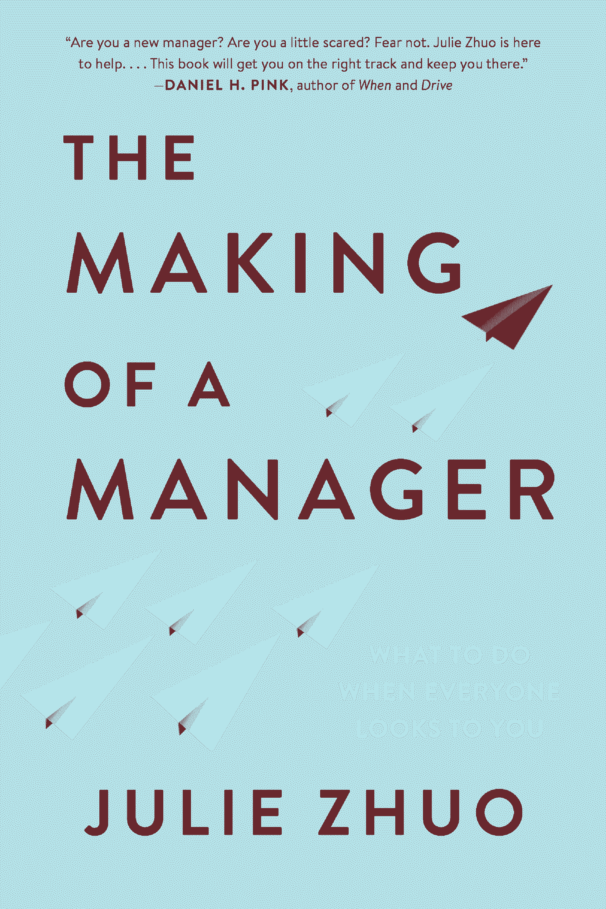

# 推动这位硅谷顶级经理人职业生涯的基本问题

> 原文：<https://review.firstround.com/the-essential-questions-that-have-powered-this-top-silicon-valley-managers-career>

十多年前，朱莉·卓 开始在**脸书**实习。从那以后，她一路晋升，成为了公司的产品设计副总裁，领导着一个数百人的团队，负责设计数十亿用户每天都会看到的应用程序。但回顾她的职业生涯，最引人注目的是她第一次戴上经理帽的那一刻。

“我当时 25 岁，我所知道的所有管理知识可以简洁地概括为两个词:*会议*和*晋升*。这相当于哈利·波特在一个黑暗的暴风雨之夜得到海格的拜访，迈出了冒险而充实的职业生涯的第一步，”卓说。“但我完全没有准备好这个新角色会给我带来多大的压力。坦白地说，在最初的几个月和几年里，我充满了恐惧、怀疑和“我疯了吗？”有点感觉。一切都感觉新奇和不舒服，相比之下，我周围的其他经理让它看起来很容易。"

无论是她第一次与直接下属一对一的回忆，还是她第一次面试时试图隐藏自己与候选人的握手，还是第一次做出让某人离开的艰难选择，卓与管理层的第一次摩擦都伴随着大量的试射里程碑，这些里程碑在当时显得很大，似乎有可能将她拖垮。

如今，卓已经做了 10 多年的经理，她认识到几乎所有的新经理都有同样的感受。在她的[博客](https://medium.com/the-year-of-the-looking-glass "null")(以及[评论](https://firstround.com/review/An-Inside-Look-at-Facebooks-Method-for-Hiring-Designers/ "null")上的许多文章中分享了她来之不易的设计和领导力见解后，她的读者敦促她写一本书——不是在她作为高管的职业生涯末期，而是现在，而她作为经理的第一次经历留下的印记还没有消退。

今天，卓出版了《经理人之道:当所有人都指望你的时候该怎么做》 *[这本书，她在书中为这位新上任的经理人提供了实用的建议、相关的趣闻和经过检验的策略。她涵盖了第一次经历的所有方面，深入到一切事物的杂草中，从处理冒名顶替综合症的焦虑，到处理管理前同事的尴尬，并给出更直接的反馈，所有这些都是为了撰写她希望在自己的旅程开始时就拥有的经理手册。](https://www.amazon.com/Making-Manager-What-Everyone-Looks/dp/0735219567 "null")*

在翻看了预发本后，卓的一句话给我们留下了深刻的印象。在第三章“1:1”一节的深处，这句话作为连接她的管理智慧的无形主线而引人注目:**问题是管理者最好的工具**。

正如卓所写的，我们大多数“帮助”的尝试实际上并没有帮助，即使他们是出于好意。了解发生了什么或如何变得更好的最好方法是向你管理的人提出试探性的问题，最重要的是，向你自己。一开始就停下来给每一步注入意图，在关键点后退一步，或者如果你已经在路上走得更远了，停下来调整一下，这对提升领导能力至关重要——而问题是打开发展之门的钥匙。

随着《成为一名优秀的管理者》一书的出版，我们很高兴地向大家介绍卓的工具箱中的一些问题，这些问题帮助她成为了一名优秀的管理者。我们从她的书中摘录了几个不同的部分，以编织一个新经理应该问自己的基本问题的集合，因为他们希望建立信任，提高 1:1，并确保反馈被听到。

Julie Zhuo, author of The Making of a Manager, What to Do When Everyone Looks to You.

**请继续阅读卓对新经理人的详细建议，这些人希望获得领导能力，在深水区游得更舒服。**

# 新任经理需要问的建立信任的问题

当我刚开始工作时，我认为*经理*和*领导*是同义词。随着时间的推移，我逐渐认识到领导力是一种品质，而不是一份工作。虽然管理者的角色可以被赋予(或剥夺)，但领导力却不是可以被赋予的。这是必须的。人们一定想追随你。

初入职场的管理者需要明确领导一个小团队的要领。只有当你与你的下属建立了信任，你才会有帮助他们一起实现更多目标的可信度。

这种信任意味着你的报告认为他们可以对你诚实。当你能回答这两个问题时，你就知道你已经完成了:

# 我的报告是否会定期提醒我他们面临的最大挑战？

我的一位队友与我分享了一个简单的石蕊测试来评估她的关系健康状况:**如果她问她的报告事情进展如何，几周以来的答案都是“一切都很好”，她将此视为进一步鞭策的信号**。更有可能的是，这份报告羞于进入血淋淋的细节，而不是一切都是一贯的彩虹和蝴蝶。

# 我的报告还会乐意为我工作吗？

当你看到一个经理承担了一个新的角色，而他以前团队的成员也和他一起飞跃，这充分说明了他的领导能力。

在追踪团队健康状况的匿名调查中，一些公司会明确地问这样一个问题:“你会再次为你的经理工作吗？”如果你的组织不这样做，简单地思考这个问题可能是有用的。对于每份报告，你能自信地说他或她会再次加入你的团队吗？

你也可以通过问你的报告，“**对你来说，一个完美的管理者应该具备哪些品质？**”并评估你如何与你得到的描述进行比较。

您能自信地说每位报告员都希望再次加入您的团队吗？如果你不确定答案是肯定的，那么很可能是否定的——就像你必须问“我恋爱了吗？”你可能不是。

# 新任经理需要问的问题，以获得一流的一对一

作为一名经理，你拥有的最宝贵的资源是你自己的时间和精力，当你把它花在你的团队上时，它对建立健康的关系大有帮助。这就是为什么一对一会议是管理中如此重要的一部分。

理想的 1:1 会让你的报告感觉对她有用。如果她认为谈话很愉快，但很大程度上不值得回忆，那么你可以做得更好。方法如下:

# 问问你自己:我所有的 1:1 都觉得有点尴尬吗？

我的朋友马克·拉伯金和我分享了一个我很喜欢的技巧:**努力让你所有的一对一会议都感觉有点尴尬**。为什么？因为最重要最有意义的对话都有那个特点。讨论错误，面对紧张，或者谈论内心深处的恐惧或秘密的希望并不容易，但是没有任何牢固的关系可以仅仅建立在表面的玩笑上。

没有什么语言技巧可以回避表达这种情绪的尴尬，比如“我觉得你没有意识到我做得很好”或者“上周，当你说 X 的时候，让我觉得你好像没有真正理解我的项目。”但是这些事情需要说出来才能解决，有了信任的基础，对话就变得容易了。

# 使用这些问题来推动对话:

管理者不应该给出建议或“拯救世界”相反，让你的报告自己找到答案。她比你更了解问题的来龙去脉，所以她是找到解决方案的最佳人选。让她 1:1 领导，而你倾听和探索。

为了有助于这种探索，每天早上，我都习惯于浏览我的日历，并为我遇到的每个人列出一个问题清单。以下是我用来推动对话的问题:

**识别**:这些问题关注的是什么对你的报告真正重要，什么主题值得花更多时间:

你现在最想做的是什么？

本周你在考虑哪些优先事项？

我们今天最好的时间利用是什么？

**了解**:这些是问题的根源，以及可以做些什么。

你理想的结果是什么样的？

对你来说，取得这样的结果有什么困难？

你真正关心的是什么？

你认为最好的行动方案是什么？

你担心的最坏情况是什么？

**支持**:这些问题集中在你如何为你的报告提供最大的帮助。

我怎么帮你？

我能做些什么让你更成功？

我们今天谈话中最有用的部分是什么？

# 新任经理需要问哪些问题才能给出反馈

对于一个领导者来说，给予反馈——无论事情进展顺利还是不顺利——是这项工作最基本的方面之一。但是你的反馈只有在让事情变得更好的情况下才算数。

我可能会觉得指出问题很有成就感，但如果没有实际帮助，那就没有效果。伟大教练的标志是他人在你的指导下进步。

给予反馈可以消除阻碍你的报告做好工作的两个最大障碍——不明确的期望和不充分的技能——这样他们就能准确地知道瞄准哪里以及如何达到目标。

你应该永远记住的问题是:**我的反馈会带来我所期望的改变吗？**再深入一层，考虑你对以下两个问题的回答:

# 我是否经常提供反馈？

我读过数以千计的关于他们经理的报告的评论，以及对“你的经理如何更好地支持你？”这个问题最常见的回答就是“给我更多的反馈”

在深入了解“如何做”的本质之前，第一步只是更频繁地给出反馈，并提醒自己可能做得不够。每当你看到自己的一份报告在发挥作用时——交付项目、与客户互动、谈判销售、在会议上发言——看看是否有什么有用的东西可以告诉她。争取至少 50%的正面反馈，让她知道自己做得好——“你的观察特别敏锐”或者“你在互动中表现出了很强的同理心。”如果你从同事那里听到了一些积极的东西，把它传递下去。或者，如果你有改进的建议，即使很小，也告诉她——“你在那次会议上说了很多，这让别人很难插话。”

同时，**注意只给出特定任务的反馈**。报告中第二个最常见的问题是:“给我更多与我的技能和职业轨迹相关的反馈。”

我认识一个经理，他是设计师的设计师，也是顶尖的创意总监。他可以不经意地瞥一眼模型，告诉你图标之间的间距是否差了两个像素。他的团队总是知道他对他们工作的立场。然而，在他们的向上评估中，我会读到这样的评论，“我想了解我的经理对我的进步的看法”或“我想就我的职业目标以及如何实现这些目标进行对话。”他的团队渴望更多关注他们，而不仅仅是他们的产出。

# 我的反馈被听到了吗？

如果你小时候玩过电话游戏，你就会知道这是真的:你想说的和听者听到的并不总是一样的。

你可能认为你说得很清楚，但实际上你说得太多或太少，或者通过你的肢体语言传达了不同的信息。(例如，有人告诉我，我很容易漫无边际，这可能会让人难以理解我的主要观点，我的友好可能会掩盖强硬信息的严肃性。)再加上听者的确认偏见——我们倾向于回忆证实先前存在的信念的事情——难怪信息在翻译中会变得混乱。

让别人听到你的反馈的最好方法是让听者感到安全，并表明你这么说是因为你关心她，希望她成功。如果你带着一点不可告人的动机——你想成为正确的，你在评判她，你生气了或者不耐烦了——这个信息就不会被理解。当你有重要的反馈要分享时，带着好奇心和真诚的愿望去理解你报告的观点。

一个简单的技巧是直接陈述你的观点，然后提出另一个问题:“**这个反馈能引起你的共鸣吗？为什么或为什么不？**

如果答案是肯定的，那么现在这个人已经认可并思考了反馈，所以更有可能坚持下去。如果答案是否定的，那也没关系——现在我们可以讨论为什么会这样，以及怎样才能让反馈更有用。为了确保在谈话结束时你能被听到，你可以问:“**好的，让我们确保我们在同一页上——你的收获和下一步是什么？**

# 外卖

最终，一群人齐心协力地工作是一件非常美妙的事情。做得好，它不再是关于你或我，一个人或另一个人。相反，你会感受到几十个、几百个甚至几千个心灵和思想的能量，在共同价值观的指引下，朝着一个共同的目标前进。

如果你或我做好我们的工作，那么我们的团队就会兴旺发达。我们将建立一些比我们更长久的东西，那些成为其中一部分的人将使它变得更强大。祝你在前进的道路上好运。和你的团队一起出去，一起创造美好的东西。

*这些摘录来自朱莉·卓的**经理的制作，由企鹅兰登书屋有限责任公司旗下企鹅出版集团出版的 Portfolio 于 2019 年 3 月 19 日出版。版权所有(c) 2019 作者朱莉·卓。杰夫·辛格拍摄的朱莉·卓照片。文章图片由 Devonyu / iStock / Getty Images Plus 提供。*