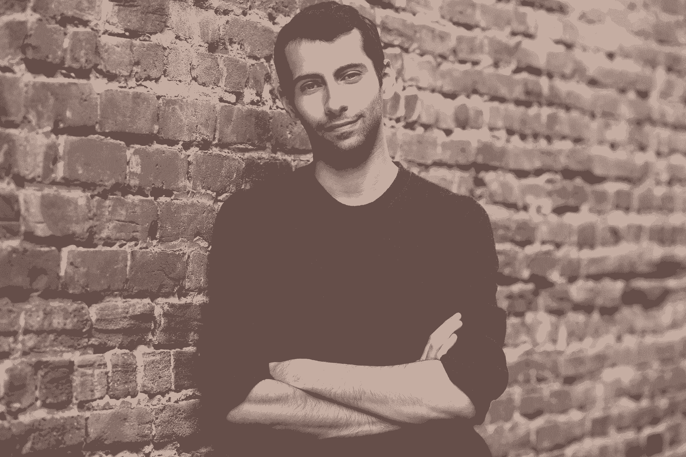

# 第一次创业的人学习一切艰难事物的指南

> 原文：<https://review.firstround.com/the-first-time-founders-guide-to-learning-everything-the-hard-way>

这篇文章是史蒂夫·艾尔-哈格在我们的新播客“深入”中的关键内容的编辑摘要如果你还没有听过我们的节目，一定要看看这里的*。*

**[滴](https://drop.com/ "https://drop.com/")** 最早的日子，是从创始人梦想是由什么做成的开始的。在发布后的第一周，该公司(当时名为 Massdrop)实现了 1.2 万美元的收入，并在第二周继续实现了 2.5 万美元的收入，随后在第三周实现了 5 万美元的收入——所有这些都只是通过一个“janky 网站”(正如联合创始人兼首席执行官 **[史蒂夫埃尔-哈格](https://www.linkedin.com/in/elhage/ "https://www.linkedin.com/in/elhage/")** 所说的那样)新的商业伙伴甚至被《纽约时报》作为住在所谓的“黑客宿舍”的早期创始团队的一员而显著报道(当他们开始筹款时，他们升级到一个家具稀少的帕洛阿尔托房子，我们自己的乔什·科佩尔曼拜访了那里，坐在一个纸箱上，他解释了[第一轮如何能够支持](https://firstround.com/philosophy/ "https://firstround.com/philosophy/")。)

黑格和他的联合创始人尼尔森·吴()通过挖掘发烧友社区发现了一些特别的东西，这些发烧友对电子产品的折扣团购过程非常狂热。一个想法的核心在早期产生了大量的牵引力，这使他们能够迅速会见潜在的投资者并筹集风险资本。

但是在积累了一系列有希望的胜利后，这家初创公司很快就跌落悬崖，收入下降到零——我们不是指夸张的意义上的收入。“我们把它归结为，‘嗯，我们一直忙于筹款，我们被分散了注意力。下周我们就知道了。下一周我们又做了零。然后第三周我们什么都没做。埃尔-哈格说:“我们连续八周零进展，但我们不知道为什么会这样。最糟糕的是，我们比以前更加努力地工作，但我们就是不能让任何人买东西。在我们结束交易后，我们基本上不得不去对这群投资者说，我们保证没有欺骗你们。"

快进八年，你会发现 Drop 已经实现了数据驱动设计和社区验证的特殊炼金术，以[制造人们真正想要的产品。](https://firstround.com/review/How-To-Build-The-Product-Your-Users-Actually-Want/ "https://firstround.com/review/How-To-Build-The-Product-Your-Users-Actually-Want/")“现在我们能够一次生产并推出 200 多种高品质产品。El-Hage 说:“我们 98%的产品成功上市，并预售了最初的生产。“目前该公司大约有 100 人。我们能够将年收入扩大到大约 1 亿美元。一切都是有机的，我们是盈利的，现在已经产生了一点正的 EBITDA。”

像这样的轶事证明，艾尔哈格可能是硅谷最不受重视的创始人之一。正如他所说，他不得不“艰难地学习一切。”该公司面临的曲折提供了大量的经验教训，而那些成功创业公司和有远见的创始人的精彩故事往往缺乏这些经验教训。在他 22 岁时从斯坦福辍学成为第一位创始人后，埃尔-哈格和他的联合创始人缺乏现金、科技创业经验以及可以让坎坷的早期岁月变得更加顺畅的硅谷人脉。

当你 22 岁时创办一家公司会有一个问题，这个问题就是你什么都不知道。

从重振营收，后来从 Drop 最受欢迎的业务线转向其他业务，到需要纠正的高管招聘失误和严重的团队倦怠，埃尔-哈格凭借坚韧不拔的毅力克服了公司早期建设的每一个障碍，埋头苦干。在这次独家采访中，他非常坦率地讲述了他在八年的努力中获得的五个关键经验以及首次担任创始人兼首席执行官的人面临的[成长的烦恼](https://firstround.com/review/nerdwallets-ceo-on-navigating-the-shift-from-first-time-founder-to-seasoned-exec/ "https://firstround.com/review/nerdwallets-ceo-on-navigating-the-shift-from-first-time-founder-to-seasoned-exec/")，为当前或未来寻求建立能够持续发展的公司的初创公司创始人提供了大量坦率的智慧和有益的建议。

# 第一课:倾听用户的声音，以恢复持平的收入。

为了在早期胜利后收入骤降时扭转局面，年轻的企业家们试图重新找回最初帮助他们起飞的魔力。“这是一个淘汰的过程——只是重演前三周那些令人惊叹的经历。埃尔哈格说:“但是，一切发生得太快，我们无法真正理解为什么早期的成功会发生。

为了开始调查，他们开始讨好那些一开始很兴奋的用户。“我们开始越来越多地与用户交流，分析他们喜欢什么，以及他们为什么会兴奋。共同的主题是[我们在倾听他们，并对他们做出回应](https://firstround.com/review/build-products-that-solve-real-problems-with-this-lightweight-jtbd-framework/ "https://firstround.com/review/build-products-that-solve-real-problems-with-this-lightweight-jtbd-framework/")。我们不只是另一家想卖给他们垃圾的公司。我们代表社区，这对他们来说真的很重要，”他说。

有了这些见解，该公司在房子的社区方面加倍努力，并开始构建功能，让用户参与列表和采购产品。尽管比最初几周进展缓慢，但他们的现金流开始恢复。“接下来的一个月，我们实现了$10K 的收入，这比零收入好得多，但比我们前几周的收入少得多。El-Hage 说，可能需要六到八个月的时间才能回到最初的水平，可能还需要一年的时间才能达到指数级的增长率。

但是在这个关键阶段，公司密切关注他们的用户——即使他们想要的不是很受欢迎。“我们看到，我们的用户对品牌*应该*做什么有很多想法，但这些品牌没有听取他们的意见，”他说。“我们希望建立一个现场讨论系统，作为社区购物体验的一部分。很多顾问和我们周围的人都强烈反对这个想法。为什么我们要为人们提供公开讨厌产品和抱怨他们不喜欢的东西的方法呢？品牌和制造产品的人会说，‘讨厌的人会讨厌——你不能听互联网上每个人的话。’但我们看到这是富有洞察力的反馈。"

很多设计产品的人都有这样的想法，“我会神奇地想象出一些完美的产品，然后把它作为礼物送给我的用户。”但通常情况是相反的——现有用户谈论他们希望品牌做什么，但这种反馈并没有融入到产品中。

该公司开始展示与品牌的合作和伙伴关系，其理念是一起制造产品。“我们会说，‘我们会带来设计、规格和理念，围绕如何制造满足社区需求的产品，你们来做工程和制造，’”El-Hage 说。“最初很难让人们参与进来，因为这需要承认他们可能没有做出最好的东西。花了一些时间。”

坚持得到了回报。“一旦我们开始真正取得进展，并最终推出我们的第一款产品，它就成为我们有史以来最畅销的产品。它向我们展示了什么是可能的，”他说。“我们采用了相同的社区设计方法，并将其应用于键盘类别，效果非常相似。”

# 第二课:你会搞砸关键的招聘——关键在于你如何正确行事。

为了开始拓展新业务的长途跋涉，El-Hage 和他的团队在没有清晰路线图的情况下开始招聘。“作为第一批团队成员，我们没有深厚的人脉。我们需要在很短的时间内与很多人见面交谈。我们必须积极地筛选和过滤，”他说。下面，El-Hage 分享了从雇佣早期员工和后来的高管来帮助创业公司扩大规模的经验。

## 在你最初几个重要的招聘中，不要局限于传统的候选人和普通的面试。

埃尔-哈格和他的联合创始人一天要接受 80-90 次采访，每次只有 5-10 分钟。“我们只是想开始弄清楚他们是否有兴趣在我们所处的环境下工作，”他说。(前两年，创始团队和早期公司员工都一起住在帕洛阿尔托之家的同一栋房子里。)

公司[专注于筛选](https://firstround.com/review/how-gusto-built-scalable-hiring-practices-rooted-in-tradition/ "https://firstround.com/review/how-gusto-built-scalable-hiring-practices-rooted-in-tradition/")的三个关键价值观:“我们的目标是在 5 到 10 分钟内大致勾选这些选项，”他说。

**发烧友:**“我们想测试他们对发烧友社区了解多少。社区是什么并不重要。我们雇了一个对红虫堆肥很感兴趣的人——但至少他们对此很感兴趣，而且他们能理解这些社区背后的哲学。你能意识到我们有一群对这些东西充满热情和兴趣的非典型用户吗？”

**职业道德:**“我们想听到某人一生中最努力工作的声音。他们决定分享并不重要。可能有一个学期你有五门课，而平时你有四门课——我不在乎。但你关于最难做什么的概念，以及它与我们的概念有多接近，对我们来说很重要。”

自主性:“我们很清楚这不是一份普通的工作。我们需要判断他们对建造某些东西的态度。我们将在公平问题上更加积极，我们将给予人们极大的自主权。举个例子，我们的工程实习生在第一天就把变化发布到主页上。这在很多地方并不常见。”

埃尔-哈格和他的团队发现，这种方法意味着他们不会遇到通常的嫌疑人。“我们采访了一些背景非常不典型的人，他们以前没有从事过白领工作，但对这些爱好者群体非常了解，并拥有我们所寻找的职业道德，”他说。“这最终成为了一个巨大的招聘优势——我们不必为了每个人都想雇佣的脸书工程师而竞争。我们能够识别出一些被遗漏但与我们的价值体系重叠的人。”

他们还采用了让顶尖候选人上船几天进行试运行的策略。“如果是销售职位，我们会给你打电话，你会花一到三天时间打电话。我们会密切关注他们在这三天里取得的进展，”他说。

但正如艾尔-哈格很快发现的那样，没有完美的过程。“不出所料，我们雇佣了很多不称职的员工，但最重要的是，我们能够非常迅速地解决这个问题。当我们意识到有人不在锻炼时，我们进行了一次坦诚的对话，然后分道扬镳。他说:“我们雇佣了很多很多人，才完成了最初的 10-15 年，最终确定了公司的发展方向。

没有成功的招聘中的一个共同主题是当事情变得困难时他们是如何处理的。打电话和打销售电话是一回事。落后于你的数字是另一回事。

## 钉钉高管招聘...第二次。

随着公司继续扩大规模，埃尔-哈格发现[高管招聘完全是另一回事](https://firstround.com/review/the-three-secrets-to-executive-recruiting-i-learned-at-apple-yahoo-and-more/ "https://firstround.com/review/the-three-secrets-to-executive-recruiting-i-learned-at-apple-yahoo-and-more/")——从寻找高质量的候选人到建立有效的面试流程，在正确的时间发现正确的人。“第一次，我犯了很多错误。有一条经验法则是，你会搞砸 50%的高管招聘。我的肯定比那辆高，”埃尔-哈格说。

“最难的是，你要雇佣一个营销或财务或其他方面的人，而你从来没有在这个部门工作过。你会对这个人知道的比你多的事实印象深刻，但这并不重要。这不是你是否什么都不知道的问题。问题是，和其他人相比，他们有多好？它们对你正在建立的公司有多大好处？他说。

我第一次做创始人时最大的错误之一就是高管招聘。我们花了一段时间才意识到，最重要的事情是我们需要雇用那些已经做了我们需要他们做的事情的人——而不是在不同规模上做类似的事情。

但是埃尔-哈格没有错过将这些失误转化为重大教训的机会。“对我帮助最大的事情之一是在过渡期间管理团队，这让我从技能和领导力的角度对团队到底需要什么有了新的认识，然后根据这些东西进行面试，”他说。"之前，我只是评估整体能力和整体经验."

举一个具体的例子:“我们有一个背景很好的财务主管，我们很幸运能把他们请来。在他们任职期间，实施了许多流程，非常注重控制。但是影响很小，我们被控制和最佳实践拖慢了脚步。作为一个习惯于快速行动的团队，这令人沮丧，”他说。“最终我们分道扬镳了，我管理了这个团队八个月。在我接下来的面试过程中，我知道我想要一个能让公司成长的首席财务官，所以这意味着我要深切关注财务和会计，关注业务建模的能力，并超越会计思考，关注真正的基本面指标建模。这绝对是一个首席运营官式的首席财务官职位，我们最终找到了有这种背景的人。”

通过集中精力检查*所有的*盒子，你可能会雇用你公司最急需的盒子中最弱的人。

“我们现在更加关注专门针对优势的招聘。我们会说，‘嘿，这个人在财务政策分析和运营方面很出色，但在会计方面不在行吗？’我们会雇佣他们，因为我们知道我们需要有人来补充他们。结果好得多，因为有一系列对我们很重要的事情，他们非常非常擅长，而第一次，我可能会因为他们不擅长我认为是高级领导者的核心能力而批评他们太多。"

为了更深入地探究，艾尔哈格分享了一些招聘高管的战术技巧，这些技巧以最佳方式从根本上改变了公司的轨迹:

明智地选择你的小组成员:“对面试圈里的人要考虑周全，确保每个人都有否决权。如果你不在乎别人的想法，就不要把他们放在面板上。如果你真的在乎他们的想法，一定要让他们在这个过程中承担责任。”

**倾向于工作会议:**“最有帮助的一件事是像对待顾问一样对待工作会议一样对待面试。我们会开一个小时的会，花 10 分钟让他们大肆宣传公司和我们在做什么，然后迅速进入我们面临的最大问题，以及他们将如何解决这些问题。首先，我们要看看他们如何在实际环境中解决问题。其次，这让我愿意采访更多的人，因为我正在众包我们如何实现目标的想法和观点。我把采访和我自己的工作融合在一起。”

**坚持一个数字:****在我犯了一个招聘错误后，我会坚持不再次发出邀请，直到我遇到了 30 多个优秀的人**——这是一个很大的数字，找到 30 个 C 级候选人是一个很大的痛苦。但这是我对自己的责任——我刚刚搞砸了第一次，我不会再犯，希望一切都好。对于第 10 或 12 个人来说，你对好答案的模式识别能力比好答案要好。到了 20 岁，你可能已经看到了一些让你大吃一惊的答案，而这些答案是你从未想过的。”

# 第三课:当谈到顾问时，给他们带来更多，投入更多的时间。

有了银行的资金和对公司聚焦发烧友社区使命的坚定信念，El-Hage 开始应对经营一家成长型公司的挑战，这是他的第一份“真正的工作”。“特别是在我们快速增长的几年里，我们在短短 9 个月或 10 个月内从 10 人增加到 80 人，这实际上是从没有真正的工作到管理相应规模的团队，”他说。对于一个创始人速成班，艾尔哈格需要[让一群专家](https://firstround.com/review/snag-the-best-advisors-for-your-startup-from-best-selling-authors-to-fortune-500-ceos/ "https://firstround.com/review/snag-the-best-advisors-for-your-startup-from-best-selling-authors-to-fortune-500-ceos/")为他和他的团队成员提供帮助。

Steve El-Hage, Co-Founder and CEO of Drop.

“它始于向我们的投资者寻求帮助，并寻找有规模的首席执行官。下一步，我们去找那些首席执行官，询问他们在每个职能部门认识的最优秀的人。你见过的最好的工程副总裁是谁？谁是最好的人力资源经理？我向他们要了一份名单，并向他们介绍我，”他说。

“大多数介绍给我们的顾问都不是最有名的人——他们中的许多人都不为人知，有更多的时间深入研究。他说:“我做了一些温和的筛选，看看谁或多或少会有所帮助或愿意投入更多时间，目的是达到我们每个主要职能部门有三名顾问的目标。

Drop 的顾问委员会由 20-30 人组成，但培养一个稳定的顶级顾问团队仅仅是个开始。一路走来，艾尔-哈格不得不不断调整如何部署这些顾问，以最大限度地利用他们在一起的时间。“许多人没有正确地构建他们的顾问。他说:“大多数情况下，你和他们喝一次咖啡，告诉他们你在做什么，他们告诉你他们做了什么，然后你可能会再和他们聊一两次——就这样。”他说:“**我平均每周会和我的顾问会面 20 个小时，持续一年——在某些情况下可能会更多。**

很多顾问真的很想帮忙，如果你让他们帮忙，并产生实际影响，他们会愿意投入越来越多的时间。

为了建立这些稳固的关系，El-Hage 部署了一些关键策略:

**思考研讨会，而不是闲聊:**“最有帮助的事情之一是准确地放大我们现在正在解决的问题，看看他们会如何解决它。我们将有效地利用这些作为研讨会和工作会议——让我们看看指标，深入了解正在发生的事情。这不是一个高层次的策略，这就像是，'嘿，我们今天有一个小时，我们要用整整一个小时来解决这个特殊的问题。'我们想把它们藏在引擎盖下。"

**建立一个异步的共鸣板:**“每个角色有两到三个顾问是非常有益的，因为我们可以有效地进行异步会议。我们没有同时引入所有三个顾问，但是有一个人会告诉我们他们会做什么，然后我会告诉第二个人和第三个人。获得对高保真问题的多种观点非常重要。”

**结束对话:**“要让你的顾问变得积极主动、乐于助人并提出真正的问题，最重要的事情可能就是结束对话。他们会告诉我们做一些事情，我们会去尝试，我总是给顾问发信息说，'嘿，你建议这样做，我们去做了，这就是结果。“非常感谢，”这已经比大多数人与他们的顾问互动的方式好了 50 倍，因为他们清楚地表明他们可以在这里产生影响。我认为这改变了他们的承诺，这就是为什么我们能够在第一年花这么多时间和他们在一起。"

# 第四课:主动管理你自己和你的团队的倦怠。

El-Hage 承认他工作时间很长，Drop 的文化在早期非常浓厚。“当我们开始下降时，我什么都不知道，我觉得如果我想最大限度地提高成功的可能性，我需要每周工作 100 个小时。他说:“作为第一次创业的人，如果你什么都不知道，而且一周工作 30-40 个小时，那你就浪费了很多时间，而且你没有最大限度地利用机会。“如果你更有经验，或者很早就找到了非常适合市场的产品，那么你可以每周工作 50 个小时。但是考虑到所有的事情都是在测试、试验、迭代、试验和迭代之间来来回回，在早期，这对我要求很高。”

在投入额外的时间来思考自己作为第一次创始人兼首席执行官的角色时，抬头看看周围的人很少出现在待办事项清单上。“肯定有那么一个时刻，公司所有其他高层领导基本上都筋疲力尽了——而所有这些人都有着异常高的倦怠门槛，”他说。“我想，‘哇，如果这些人在这方面有困难——如果我想让他们留下来，我们实际上已经达到了极限。"

埃尔-哈格更加关注团队的福祉，包括强迫一些犹豫不决的领导者休假。但是达到平衡是一个缓慢的过程。一旦人们筋疲力尽，就很难再回来。他说:“我认为，对于每一个人来说，平均需要 9 个月才能回到最佳状态。”。他是这样处理的。

## 发现团队精疲力竭的迹象，然后制定行动计划。

随着时间的推移，埃尔-哈格越来越习惯于在事情达到沸点之前发现团队的倦怠。“肯定有一些倦怠的早期迹象——尤其是在兴奋的时候。如果有人对事情的进展感到兴奋，他们会有新的想法，并且积极主动。但是你会看到他们陷入了一个消极的循环，所有的想法都是不好的。他们开会的时候更敏捷。他说:“有人过了糟糕的一天是一回事，但感觉这是一种非典型的稳定状态是另一回事。”

发现泄露秘密的迹象后，下一步是展开对话。“通常当一个人筋疲力尽的时候，他们就会知道了。但重要的是要进行对话，并说，“我认为你筋疲力尽了，这就是原因。”“几乎每次他们都会说，‘是的，你是对的，’”他说。有时可能是他们没有在做他们想做的事情，或者事情超出了他们的控制——无论是他们生活中的一部分还是工作中的一部分。"

即使他错过了早期的迹象，当他的一个团队成员筋疲力尽时，他也被吓了一跳，El-Hage 也知道了不放弃是很重要的。“我遇到过高管辞职，在那次谈话中，我问他们是不是因为筋疲力尽，他们说是的。**我会要求提出解决倦怠的建议，而不是让他们辞职**。他说:“有时候，这包括推出我知道他们有热情的新举措，或者增加一两个专门做他们不喜欢做的事情的人。“但是让我们一起工作，做一个节目，如果到最后你还是想退出，那就退出吧。埃尔-哈格说:“几乎每个人都经历过这种情况，而且这种情况会持续多年。

如果你想辞职是因为你想做别的事情或者它不再适合你，这是一个很好的理由。人们不会永远在你的公司工作。但如果你辞职是因为环境让你发疯，作为首席执行官，这是我可以控制和塑造的。

## 作为公司 KPI 管理你自己的倦怠。

艾尔-哈格也不得不面对自己的倦怠——尽管这比你想象的要来得晚。“我的职业倦怠发生在《坠楼》的第四到第五年。在一个巨大的 B 轮融资[之后](https://techcrunch.com/2015/08/13/massdrop-series-b/ "https://techcrunch.com/2015/08/13/massdrop-series-b/")，我们进入了高速增长期，这是一个很好的地方。在那之前，我一直在不停地工作。我们做了这么多决定，收获了这么多知识。至少对我来说，我需要一段时间来暂停和综合，让它渗透进来，”他说。

他几年来第一次休假——六个月后又休假了一次。“我开始花时间和朋友在一起，他们的关系已经有点疏远了。我开始更多地锻炼，变得更健康——所有这些都是你进入一个更可持续的长期阶段所需要的，”埃尔-哈格说。

我需要对自己的倦怠负责，并确保它得到积极的管理，就像公司的一个关键绩效指标一样——并努力为我的团队做同样的事情。

你不可能总是放下一切跳上一架飞机，所以艾尔哈格已经微调了他的日常做法，以防止精疲力竭。"**我已经变得更加积极主动地持续管理它，而不是让你的倦怠量表达到顶点并崩溃**。如果仪表上升了一点，你怎么把它拉回来？对我来说，这是分散我的时间。他说:“我开始做一些小的副业项目，这对长期可持续性是一个巨大的推动，并释放了一些空间。

公司业绩的最大风险之一是创始人倦怠。首席执行官的工作是以某种方式展示和传达我们的承诺、关注和兴奋。如果不这样做，将会有很多涟漪，这可能是危险的。

# 第五课:发现潜在的长期问题，打不受欢迎的电话，坚持己见。

许多年后，学习曲线仍然和艾尔-哈格 22 岁时一样清晰。最近在 Drop 的旅程中，他面临着一些艰难的——也是不受欢迎的——决定，让人想起早期那些波涛汹涌的水域。

“在过去的 24 个月里，领导团队需要改变我们处理达到局部最大值的早期指标的方式。公司做得很好，我们前一年翻了一番，从 5000 万美元增加到 1 亿美元——以任何标准来看，这都是了不起的。但在内心深处，创始团队对核心模型有所担忧。他说:“这是一个奇怪的问题，当事情可以说是我们有史以来最好的时候。

“当时我们公司有两个部分。我们有这种团购模式，人们可以以折扣价购买第三方产品，这部分业务已经扩展到这个大团队和大努力。第二，公司不太突出的部分是我们自己的产品，我们在设计过程中与社区合作制作的。我们当时的绝大部分收入来自第三方打折团购。我们在这方面的坚持是惊人的。他说:“我们所有的关键绩效指标都很可靠——净收益、留存率、有机增长，它们都很棒。”。

但仔细观察引擎盖下的情况，我们有理由感到担忧。“我们打折团购的[单位经济](https://firstround.com/review/growth-at-all-costs-is-perilous-this-is-how-to-scale-sales-sustainably/ "https://firstround.com/review/growth-at-all-costs-is-perilous-this-is-how-to-scale-sales-sustainably/")真的很差，到那个时候已经过了足够的时间，我们应该已经想出如何改善它了——但它没有改善。利润非常低。我们将需要不成比例地雇佣员工来增加收入。我们对第三方产品的长期价值支柱建立在价格上，这是非常脆弱和短暂的价值支柱。他说:“我们的烧钱率很好，并不像我们在大出血，但我们知道从长远来看，这将是一个问题。”。

“与此同时，我们已经有了这些我们自己设计的产品，从质量的角度来看是非凡的，用户对此非常兴奋。他们的单位经济令人惊叹，他们周围的社区参与度远远高于我们平台上的其他任何东西，”他说。但尽管反馈良好，Drop 自己的内部产品从未达到过与打折的第三方产品接近的收入。

领导层看到了不祥之兆，并出人意料地突然离开了他们最受欢迎的业务。“我们决定不再打折销售任何第三方产品，因为我们认为能够长期生存是一个挑战，”他说。“我们非常迅速而积极地进行了转变，完全转向我们自己的产品。那真的很难。我们脱离了 35 个类别，专注于消费电子产品，这需要与公司的许多人分道扬镳。”

Drop 的高管层面临着铺天盖地的负面反馈，资产负债表也大幅缩水。”**这不是一个受欢迎的决定。我们的用户不高兴。我们的投资者不高兴。我们的很多员工都不高兴。短期影响很恐怖**。我们刚刚解雇了很多优秀的、对公司贡献良多的员工。他说:“前三到六个月，我们的收入在第一季度缩水了 30%，下一季度又缩水了 30%。

但到那时，Drop 的历史已经充满了波折——El-Hage 和他的团队对艰难的决定并不陌生。“**事实上，这是在已经发生了很多困难的事情之后发生的——比如多次几乎耗尽现金——这给了我们做出决定并迅速采取行动的信念**，”他说。“尽管一开始的反应非常消极，但促使我们这样做的根本问题并没有改变。我们仍然长期认为这是我们需要去的地方。”

领导团队坚持己见——并取得了回报。“到第六个月，我们的收入开始反弹，到第八个月，我们的收入回到了以前的水平。我们的毛利很高，如果不是更高的话。El-Hage 说:“到第 10 个月，我们实现了盈利，EBITDA 为正。“现在，公司处于有史以来最健康的状态。作为一个组织，我们有更高的关注度。我们有一个更清晰的前进道路，我们觉得我们可以成长。我不认为我在四五年前能够做出这个艰难的决定。但现在这是我们做过的最好的决定之一。

许多走下坡路的公司，尤其是消费类公司，知道他们需要做什么。但这很难，因为你必须在保持船漂浮的同时更换船上的面板。

当面对两条不完美的道路，权衡该走哪条路时，艾尔哈格恳求初创企业创始人相信自己的直觉。

“你实际上有两个选择:**要么尽可能快速积极地做出改变，以达到你认为公司需要达到的目标，要么你可以等待，看看你的预感是否正确，你担心的所有这些事情最终会成为一个大问题**。问题是，如果你等待，然后你最终是正确的，你可能再也没有能力做出改变。埃尔-哈格说:“你浪费了太多时间。”

如果我们要破产，那不会是因为我没有做我认为我们需要做的事情。或者我没有做我认为对的事情，因为太难了或者其他人可能不喜欢。

现在，这种落差已经出现在另一边，他对那些身处同一条创业之舟的人有着足够的同情——当然也知道这不是他作为首席执行官需要做出的最后一个艰难决定。但是埃尔-哈格发现，每一个棘手的决定都会带来更多的信心和信念。

“很多时候，当我与需要帮助的创始人交谈时，他们陷入了困境，他们尝试了一切，他们疯狂地工作，但就是不起作用。他们沮丧，痛苦，没有主意。他说:“对于第一次创业的人来说，这尤其困难，因为你自己成功的证据更少，可依靠的动力也更少。”“你如何处理这些时刻，将决定公司能否运转。目标是弄清楚如何重新设置、重新组织和制定一个新的计划。离开这个坑，再给它一次机会。”