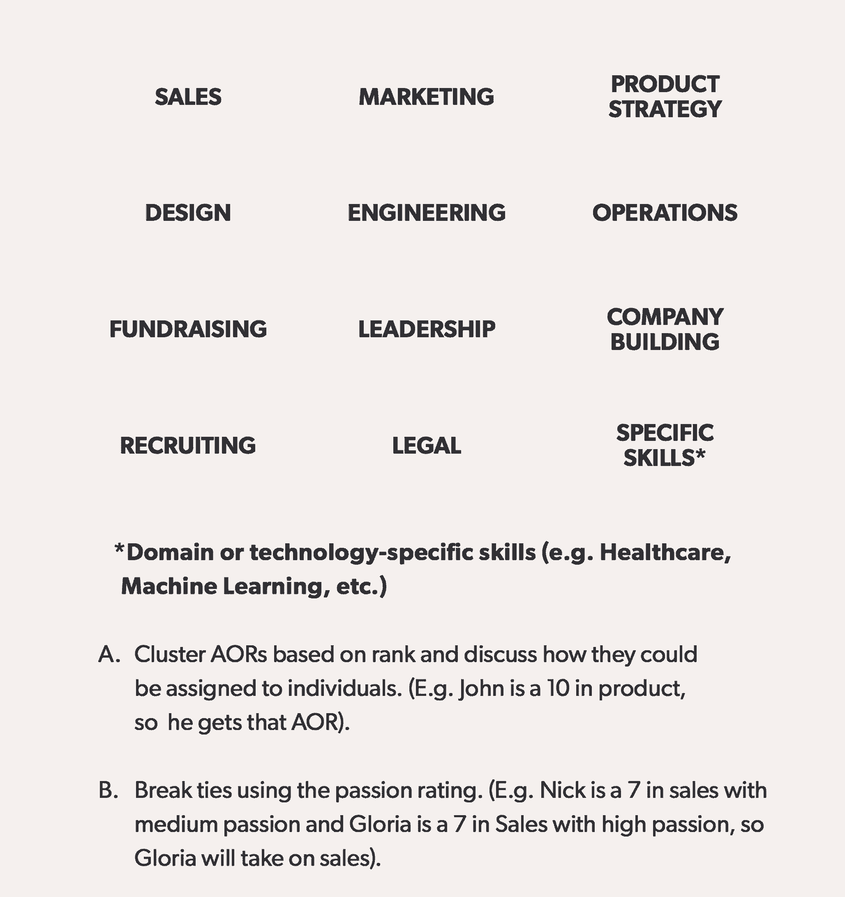

# 创始人约会手册——这是我用来寻找我的联合创始人的过程

> 原文：<https://review.firstround.com/the-founder-dating-playbook-heres-the-process-i-used-to-find-my-co-founder>

在过去的一年里，葛洛丽亚·林 约会了很多次。不，不是那种。我们说的是联合创始人约会。

作为 [Flipboard](https://flipboard.com/ "null") 的第一个产品负责人和 [Stripe](https://stripe.com/ "null") 的第一个项目经理，林看到了创始团队的行动——并且知道她在着手建立自己的公司时需要什么。“我一直想和某人合作。“当我与一位工程负责人密切合作时，我作为产品负责人的经历最为丰富，”Lin 说。“当我离开去创办一家公司时，有几个我感兴趣的空间，但我没有具体的创业想法，所以我把目光放在了寻找一位强大的联合创始人上。”

但是她很快发现说起来容易做起来难。“我听说过的大多数联合创始人的故事都是由前同事组成的团队去追求一个想法。但事情没那么简单。你必须既想创业——需要相似的高风险承受能力——同时又有时间，这取决于生活和财务状况。一旦你走出游泳池，就更难找到合适的人，”林说。“我知道我不想让我的搜索变得随意或没有重点，所以我磨练了我的过程，慢慢来。在一年的时间里，我与六个不同的潜在联合创始人“约会”。就像现实生活中的约会一样，有时我似乎会孤独终老。最终，我遇到了乔尔·波洛尼，一切都很合得来。现在我们正在一起制作网站线。

随着下一代公司创始人的形成，以及 Stripe 等公司涌现出新的创始人黑手党，有理由认为，更多联合创始人的故事将不符合传统模式，而是看起来更像林的故事。从 Reddit 上的[帖子、Quora](https://www.reddit.com/r/cofounder/ "null") 上的无数[问题以及 SOMA 咖啡馆里的所有“初次约会”来看，精心设计的寻找联合创始人的活动已经开始了。](https://www.quora.com/How-do-I-find-a-co-founder-partner-for-my-startup-or-should-I-hire-I-am-already-working-on-my-startup-and-being-from-a-non-technical-background-I-have-outsourced-the-development-of-an-app-and-website "null")

虽然之前的评论已经涵盖了联合创始人的考虑，从[在痛苦的“离婚”面前变得脆弱](https://firstround.com/review/founder-exposed-opening-up-about-startup-failures-and-vulnerability/ "null")到应用一个框架[战略性地组建一个创始团队](https://firstround.com/review/Looking-for-Love-in-All-The-Wrong-Places-How-to-Find-a-Co-Founder/ "null")，但我们从未见过像林这样的过程。这是一个详细的，一步一步的剧本，思考所有潜在的陷阱，甚至可以破坏最好的共同创始人关系。

在这次独家采访中，林完整地展示了这种严谨的方法，从她如何找到潜在的合作伙伴和处理早期的对话，到他们如何一起构思和原型，以缩小更具体的想法。无论你是一位正在创作下一部剧的成熟创始人，还是一位蓄势待发的想要成为企业家的人，她的过程都会让你在寻找联合创始人时更加严谨。

林还分享了令人难以置信的详细的**联合创始人问卷**——50 个问题跨越六个类别——她和其他创始人合作，更深入地探索兼容性。在这篇文章中，我们将重点介绍一些有影响力的问题，并附上林的旁注:她对这些问题为什么突出的思考，你需要注意的症结，以及如何知道你什么时候找到了“那个人”

但是我们也包括了完整的一套(下面，在一个设计好的 PDF 模板中，这样你就可以拿着就走，如果你想编辑和添加你自己的问题，还可以在谷歌文档中找到)。

*想直接问潜在的联合创始人 50 个问题吗？*

# 开始之前:带有一些警告的常见建议

寻找共同创始人常常让人联想到约会。这已经成为一个老生常谈的比喻，因为从吵架到结婚再到离婚，相似之处比比皆是。

“找到一个联合创始人感觉像是更激烈的约会。然而，一个关键的区别是，大多数人至少有一些现实生活中的约会经验。当然，也有大量的自助书籍和应用程序可以让你更容易地结识他人。但当谈到如何找到一个联合创始人时，很难知道从哪里开始，”林说。

“这是一个巨大的问题，因为创业失败的两个最常见原因是找不到合适的产品/市场和联合创始人问题。她说:“前者是每个初露头角的企业家的首要考虑，但我不认为人们在构思推销时会考虑后者这么多。”“我们刚刚完成了融资过程，我无法告诉你有多少经验丰富的投资者告诉我们，联合创始人的情况如何毁掉了他们的一家公司。但即便如此，也没有多少关于如何挑选合适的联合创始人的指导。”

缺乏指导的一个原因是，很难制定太多的规定——毕竟，人们正在从不同的地方着手联合创始人搜索和公司建设过程。你可以是:

寻找联合创始人，而你们两个都还没有想法。

寻找一个商业或技术合伙人来帮助你实现你一直在努力的想法。

和你已经认识的人一起寻找一个想法。

“关于如何定制搜索的建议取决于你在寻找什么。如果你心中已经有了创业的愿景，那么你可能想直接跳到更深层次去了解你潜在的联合创始人。林说:“如果你要和一个你已经认识的人一起工作，你可能要花额外的时间来确保你们在如何建立公司的问题上意见一致。”

“我在第一个桶里。**人们从一开始就被一个坚实的公司想法或一个特定的联合创始人所困扰，但我认为你不需要马上就有。将空白视为尝试合作的机会，同时也是探索有趣想法的机会。”**

创业的时候，你可以找到合适的方向，然后找合适的人一起解决。两者都不要妥协。

在看到与老朋友快速配对的潜在危险后，林意识到了这一点。“我看到新的联合创始人在公司建设的道路上走得更远，突然意识到，‘哦，我们从来没有谈论过这个’，或者，‘我没有意识到我们在这个话题上有如此对立的观点，’”她说。“这有点像第一次和某人同居，然后意识到他们把袜子放在地板上，或者他们不同意你的理财方式。他们所有这些或大或小的习惯都表明，你们可能根本就不是那么般配的一对。”

在这里，林推荐了一些在开始你的搜索之前要记住的额外的要点:

# 慢慢来——但要意识到时间紧迫。

在林看来，人们容易犯的一个最大的错误就是没有给过程足够的时间来展开。“你不会想仓促成双或过早停止寻找，”她说。"[阿尔弗雷德·林](https://twitter.com/Alfred_Lin "null")曾经给过我一些建议，这些建议很清晰:**通常要花三到六个月的时间来聘请一位高管，那么你为什么不花同样的心思去寻找一位联合创始人呢？因为那个人可能会在你身边呆得更久。你们可能会一起工作十年甚至更久。”**

人们太经常地一头扎进创建公司的机会中，而没有花时间去测试共同创始人关系的深度——这导致了风险更大的奉子成婚。

然而，有一个重要的警告需要考虑。“当人们在探索一家公司时，他们只有一定数量的财务跑道可以生存。有些人只能坚持三个月，而有些人可以坚持三年。她说:“当你开始耗尽资源时，感觉就像是加速了，这就是为什么你可能会以一些奉子成婚而告终。”

# 异性相吸——但不要忽视重叠。

“实力非常相似的人可能会导致共同创业的情况变弱。林说:“你想要一个价值观相似的人，但在兴趣或性格方面，如果你与众不同，往往会更好——人们常说异性相吸，这是有道理的。”。“举个小例子，我和我的联合创始人乔尔在音乐和其他更主观的领域没有太多的个人品味，但我们对公司建设的看法非常一致。”

我们自然会聚集到有着相似经历、品味和技能的人群中，但企业家忽视了创始团队的多样性，这是一种巨大的力量源泉。

然而，这个建议并不总是能如此清晰地映射到以前的经历中。林说:“你不能只看一眼简历，就把所有和你太相似的简历都扔了。”。“有时候，在创业方面，两个背景相同的人想要的东西非常不同。如果他们都是项目经理，一个人可能想专注于产品，而另一个人可能想延伸并进入业务方面。这在很大程度上取决于他们*想要*做什么，而不仅仅是他们以前做过什么——你必须谈论它才能找到答案。”

# 解构过程

有了这些高层次的建议，让我们来深入了解一下林的流程，以及她为什么建议首先遵循一个流程。“你需要真正有意识地决定如何度过你们在一起的时间，”她说。“以我的经验来看，通过曲折的对话和无组织的头脑风暴来实现‘让我们看看会发生什么’的方法并不那么有效。”

尽管如此，积极的结果是绝对不能保证的，而且进展往往难以察觉。“创业就像你站在一个迷宫的起点，你不知道这条路会把你引向何方。”。“这可能会令人沮丧，因为你不知道一周的努力是否会让你更接近目标。你不知道是不是死路一条。你需要一步一步地前进——你必须不停地前进。”

她发现你可以比你想象的更快地到达更多的地方。“你可以获得大量数据，了解在几周内成为某人的联合创始人会是什么样。我不认为这些步骤是严格线性的——没有一个瀑布图可以完美地展示你在其中经历的各个阶段。但总的来说，**我简单地遵循了以下过程**:

**第一步:从你的创业社区网络中寻找潜在的联合创始人**。

**第二步:** **通过最初的对话找出重叠部分。**喝点咖啡聊聊一些基本话题，比如:*你有什么故事？你在哪些部门或行业有工作经验？你对在哪些领域建立一家创业公司感兴趣？*

**第三步:** **通过头脑风暴和轻量级原型制作，深入探索具体的想法**。我们的目标是朝着一个想法前进，并获得合作经验，看看一起工作会是什么样子。

**第四步:** **分别填写联合创始人问卷**并安排三到四次工作会议来检查你们各自的答案。

第五步:承诺一起工作或者分道扬镳。知道什么时候扣动扳机，什么时候停下来和别人重新开始。

“最短的一轮，我在几次最初的咖啡聊天后就结束了。这是一个在纸上看起来很棒的人，但我们在现实生活中并不和谐，”林说。“相比之下，在我们做出承诺之前，我花了四个月的时间与我目前的联合创始人一起验证我们是否在正确的轨道上。”

在接下来的章节中，林对每一个高层次的步骤都进行了细化，补充了一些战术建议，并从她自己的联合创始人搜索经历中汲取了一些故事。

# 第一步:寻找潜在的联合创始人来填补你的渠道

“‘我到哪里去找人？’是人们向我寻求建议时我得到的最大问题之一。没有一款人人都在使用的“联合创始人引爆器”应用。“采购很难，”林说。在我的过程中，有几次我会因为找不到另一个潜在的联合创始人而重新开始自己的想法。"

林通常会向各种各样的人献殷勤，这些人要么是她认识很久的人，要么是通过共同的朋友介绍认识的人，要么是最近才在一次活动中认识的人。“有一个人是我的大学同学，我已经有一段时间没和他说过话了。她说:“有些人是我通过我所在的更广泛的创业社区认识的，比如南方公园社区。

“我试图制造意外收获——我并不是低着头希望有人与我擦肩而过。我告诉我所有的朋友和更密切的联系，我正在寻找联合创始人，并要求推荐和介绍。林说:“我认为你必须走出自己的舒适区，努力建立更多有价值的关系。“更有策略地说，加入创业社区和参加活动是扩大你的人才库的好方法。甚至有一些早期投资者帮助促成其中一些互动。总而言之，你必须对机会敞开大门。”

唯一能让你停下来的机会是和一个特别亲密的朋友一起工作。“我不会说，‘不要去那个池塘钓鱼’，但你需要睁大眼睛去了解它，”林说。”[诺姆·乏色曼](https://twitter.com/noamwass "null")就此写了一本书——在[创始人的困境](https://www.amazon.com/Founders-Dilemmas-Anticipating-Foundation-Entrepreneurship/dp/0691158304 "null")中，他探究了什么样的创始人比其他人更成功。他的研究发现，在前六个月——蜜月期——社会关系可能是稳定的，但随着时间的推移，风险会越来越大。即使进展顺利，一起创业肯定会影响你们的友谊，所以你必须为此做好准备。”

# 第二步:确定重叠的区域，以快速显示

找到潜在线索后，安排几次咖啡聊天或电话，以发现共同点——或缺乏共同点。“这个阶段非常具有探索性。没有什么是一成不变的。林说:“你在寻找向前迈进、投入更多时间的信号。

特别是，她在这一步中寻找对齐的*缺失*。“积极寻找相反的事实，你可以说‘哦，我实际上不认为我们在这一点上是一致的。’我最初和一个人聊得很愉快，但是我们发现我们中的一个人想要启动我们的公司，而另一个人想要筹集尽可能多的钱。“这可能不是一个合适的选择，所以我们不需要继续努力，”林说。

以下是她建议在这些早期对话中使用的线索:

兴趣领域: *你对从事哪种工作感到兴奋？你最近在探索什么？我们对相同的行业和商业模式感兴趣吗？*“当然，你的想法完全可以改变。林说:“合伙创业的人一直都在变化，但你们经常会搬到相邻的地方，所以弄清楚你们各自感兴趣的领域会很有帮助。”。“与我约会过的六位潜在联合创始人中的每一位，我都探索了不同的领域:身份、招聘、室内设计、安全、加密。有趣的是，一些想法会发生变化，走向完全不同的方向，而另一些想法对一个人不起作用，但最终对另一个人有意义。例如，我以前和别人一起探索过室内设计，但现在我和我的联合创始人正在相邻的建筑空间里做一些东西。”

**广泛的角色:** *我们有兴趣一起探索共同创始人的关系吗？那会是什么样子？“这不是关于谁想当首席执行官的谈判。它更像是一个‘在理想世界中，你在想象什么？’她说:“这是一种讨论。有一种粗略的角色感，但不是非常清晰。这更像是“我可以专注于产品和营销，而你可以专注于技术和运营。”"*

# 第三步:花两周时间做原型，看看一个想法是否可行

在初步比对后，林直接投入到与一位潜在的联合创始人合作的项目中。“第一次或第二次咖啡聊天可能不会告诉你太多。但一旦你开始做某种项目，你就会获得更多关于这个人及其工作风格的数据，”她说。

“对我来说，这是有趣的部分。林说:“你需要亲自动手，挖掘一个空间，弄清楚需求，看看一个创业想法是否有潜力。”。“这也是一个发现你是否真的对某个领域感兴趣的机会。有几次我以为自己对某个行业充满热情，结果通过动手项目才发现，其实我并不喜欢。”

然而，这并不是漫无目的的修补。林建议将这一探索阶段的时间限制在两周左右，以最大限度地提高学习速度和行动速度。她也从其他框架中寻求指导。“纳特·特纳寻找创业点子的方法启发了我，”林说。“他和他的联合创始人如此成功且迅速地改进了它们，以至于他们能够在没有领域专业知识的情况下在医疗保健领域创办一家公司。每次我构思的时候，脑子里都有他们的流程。”

Gloria Lin and her co-founder, Joel Poloney

以下是在与潜在的联合创始人探讨一个想法时使用的有针对性的策略的概述，这些策略正是林用来测试她自己的六个不同创业想法的策略:

# 以不同的方式探索消费者和企业的创业想法。

在调查与潜在联合创始人合作的消费游戏时，林坚信，你必须努力创造一些东西。“这并不意味着您必须构建一个完整的生产就绪型应用程序。林说:“想出最便宜的东西，一两周内你能拿到的最贵的 MVP，看看事情进展如何。”。“这可能是一个真正的 janky 原型，一个小的 Chrome 扩展，或者一个登录页面。你可以把它放到世界上，看看是否有回应。”

相比之下，企业更注重客户发现。“对于企业来说，构建通常不是最难的部分。一切都是为了销售。你需要一条捷径来弄清楚，‘我在做人们想要的东西吗？’与专家或潜在客户进行一系列访谈，找出答案。客户会告诉你他们的问题是什么。如果你听得非常仔细，你可能会找到一个切入点来建立一家公司。"

当你在探索企业创业的想法时，你必须走出去与客户交谈。我和我的联合创始人从这些谈话中得到了一些想法，这些想法是我自己在一百万年内也想不出来的。

以下是林和她的潜在联合创始人在这些客户电话中问的一些具体问题:

您目前如何管理这一流程？

与您的其他棘手问题相比，它对您来说有多大？

如果你可以挥一挥魔杖，让这个问题消失，这会对你的工作或你的客户产生什么影响？

# 利用这些线索来找出你是否有所发现。

当然，由于时间限制和最少的资源，您不能期望从这个发现阶段的工作中获得统计上的重要见解。也就是说，有迹象表明你可能走在正确的道路上。

“在消费者方面，如果有人告诉你他们想要它，如果你看到其他人确实在使用它，甚至可能主动缠着你要更多，这就是一个好信号。[段就是这个](https://www.startupschool.org/videos/13 "null")的一个很好的例子。他们推出了一个带有登录页面的开源分析库，这在黑客新闻上引起了轰动，”林说。“对于企业来说，就是寻找模式。你需要在一个细分市场中有一定数量的人说，“是的，我想要这个，我会为此付钱给你，我会付多少钱。”。"

# 准备好下车。

“这个构思阶段是我大多数‘分手’发生的地方，”林说。“这是检验双方合作能否成功的试金石。显然，你们一起产生的很多想法是不会成功的。和合适的人在一起，你可以度过难关，进入其他领域和实验。**但有时当想法半途而废，合作关系会失去动力**。你开始质疑这个人是不是你的合适伴侣。其他时候，一个商业想法有真正的潜力，但我们发现我们的工作风格不兼容。”

根据林的经验，这些分手对话可以有几种不同的处理方式。“我曾经被人捉过一次鬼，”她笑着说。“对于其他人，我们会亲自召集或打电话。人们可以通过很多方式决定不一起工作，但就我个人而言，我最欣赏的是有一个明确的去或不去的日期，我们就我们一起工作的可行性进行了一两次直接对话。这些是我今天感觉更好的关系。”

勇于直接谈论这些潜在的合作关系，尤其是在没什么合适的时候。

# 第四步:带上调查问卷

一旦你对原型制作有了一个非常基本的概念，下一步就是解决共同创始人关系的细节问题。进入**联合创始人问卷**，这是林在认真考虑与某人一起创办公司之前发出的“了解你”的挑战。

就像生活中的大多数事情一样，时机就是一切。“有些人喜欢打开书本，他们会马上做，但对其他人来说，进入这种东西似乎太私人了，”林说。“在我认识的用过这份问卷的创始人中，他们都是在不同的时间根据他们对合作伙伴的要求来填写的。”

例如:

**如果你正在寻找一位联合创始人和一个并行的想法**，你可能想在进入原型制作之前使用问卷。“我认识的一对夫妇希望在投入时间构思和业务发展之前更好地了解对方，”林说。

**如果你正在寻找一个商业或技术伙伴**来帮助你执行一个游戏计划，你可能想在这个过程的早期使用这个问卷。“我认识的一位创始人在第二次喝咖啡聊天前用过这个词。林说:“这样你就能很快筛选出不合适的人，因为你知道自己在寻找什么样的人。

如果你正在和你已经认识的人配对，在迈出这一步之前浏览一下这些问题仍然有巨大的价值。“在不同的环境中，人们的行为会有很大的不同。和某人一起在一家公司工作和共同创办一家新公司是非常不同的。林表示:“创始人的生活压力可能会大得多。

以下是林自己的看法:“**我是在我们有了可行的想法之后才这么做的。当你意识到事情可能会变得严重时，我会从工具箱里拿出调查问卷。就像约会一样，有一个合适的时间开始解决一些棘手的问题:*你想要孩子吗？你能想象自己结婚吗？你对个人理财有什么看法？如果你在第一次约会时问这些，你可能会显得太紧张。但是如果你约会了很多年才提到他们，那可能也不理想。而是要找到适合你的方法，以及你对联合创始人的期望。”***

在这里，她从战术上概述了这些问题是如何演变的，以及联合创始人如何将它们付诸实践:

# 问题的提出:

这份针对联合创始人的特定问卷已经在某些企业家圈子里悄悄流传了一段时间。“它起源于保罗·比格。他向我提出了一些他一直在问的潜在联合创始人的问题，”林说。“我认为这是一个非常清晰和有用的工具，所以我将它融入了我的前进过程中。”

然后，林对问题集进行了扩展，使其更加强大，并从中提取出她感兴趣的内容。“有一次，我把它变成了联合创始人版的[《通向爱情的 36 个问题》](https://www.nytimes.com/2015/01/11/fashion/no-37-big-wedding-or-small.html "null")，真正倾向于约会的角度，”她笑着说。“但是[我们现在使用的谷歌文档](https://docs.google.com/document/d/1x7JYzvqw6Rlt4AZFzXm-XBVtWXDIn7WQFVUBoQfueFQ/edit?usp=sharing "null")已经从最初的版本扩展和进化了很多。随着时间的推移，看到其他人加入进来是很有趣的，我当然不能把大部分功劳归于自己。[埃文·比尔德](https://twitter.com/evanbeard "null")，[尼克·莱恩-史密斯](https://www.linkedin.com/in/nickls/ "null")，[克洛伊·斯莱登](https://twitter.com/chloes "null")，[拉梅什·巴拉克里什南](https://www.linkedin.com/in/ramesh-balakrishnan-009949/ "null")，特别是[艾伦·鲍](https://twitter.com/ekp "null")增加了这么多很棒的问题。随着企业家拿到博士学位，并在发现什么适合自己时增加或减少问题，它将继续发展。”

# 卖点:

林发现这份调查问卷是一个很有价值的工具，因为她正在寻找一位公司创始人。但是如果你仍然不相信你应该把它放到你自己的过程中，这里有一个快速列表，告诉你为什么这组问题值得你这么做:

**确保你们在价值观上保持一致:**“建立一家公司有许多不同的、完全有效的方式，但联合创始人需要尽可能保持一致。林说:“这些问题暴露了你的动机和偏好，当你提出公司价值观时，在招聘时试图提升企业文化时，这些都会被考虑进去。“你会遇到很多哲学上的分歧，这些分歧可能会在以后演变成大规模的后果，所以在你陷得太深之前搞清楚是有好处的。”

**它帮助你锻炼脆弱的肌肉:**“在分享你对问题的答案时，你有了一个工具，可以让你说:‘这是我最好和最差时的样子。这是我紧张时的反应。以下是我如何防止倦怠，实现我理想的生活方式。这是我的希望和梦想，”林说。“像这样与一个你不太了解的人敞开心扉可能很难，但我相信，许多共同创始人之所以失败，部分是因为他们没有从深层次理解对方的动机和恐惧。脆弱是任何牢固的共同创始人关系的关键因素，但它不是天生的——你必须努力克服。虽然这需要时间，但有一些快速建立信任的方法，我发现这份问卷就是其中之一。

**它突出了创始团队的差距:**“许多问题都围绕着你在职业和个人方面的优势和劣势。我发现这个过程暴露了我们作为一个集体的弱点。这对于招聘和确定自己的发展领域都很有用，”林说。“对于乔尔和我来说，我们正在建立一家企业初创公司，像许多创始人一样，我们都没有第一手销售经验。”

# 潜水前的建议:

林指出，虽然你可以通过几种不同的方式来浏览问卷，但有一些基本要素要记住:

定制您自己的测试。“调查过程非常灵活，”林说。“和你潜在的联合创始人一起选择你自己的顺序，轻松进入更激烈的问题。在联合创始人速配活动中，将其削减为轻量级版本。添加更多你自己的问题，瞄准你特别想找的东西。”

**关注你自己的论文。**“根据我的经验，如果你考虑周全的话，第一次填写通常需要两到三个小时。重要的是要独立完成，而不是一起现场排练。林说:“不要陷入集体思维，你需要发现真正的差异。”。

**重新集合，检查你们各自的答案。**“你可以通过电子邮件分享你的答案，但我认为你会错过一些上下文和细微差别。如果你亲自讨论答案，那至少需要 6 到 10 个小时。林说:“我从不建议在一个马拉松式的会议中复习所有的答案，那太紧张了。”。“由于问题已经被分成几个部分，我们通常一次讨论一到两个部分，总共用三到五次时间来讨论所有问题。你可以在这部分花几天时间。一位创始人估计，她在四周时间里至少花了 60 个小时。

# 不可协商:

一个自然的问题出现在调查问卷中:你的答案需要有多一致？“你必须在每件事上都 100%一致，还是 75%就可以了？林说:“说到底，你需要依靠自己的经验和直觉，列出一张不可协商的清单，但不要太多，不要超过三张。”

当谈到与潜在的联合创始人达成一致时，你的不可协商名单最好很小——否则就没什么意义了。

当你决定和某人一起创建一家公司时，你就放弃了完全的控制权——如果你独自一人的话，事情不会完全像你想的那样。林说:“你需要弄清楚让你夜不能寐的妥协和你可以拓展以适应不同视角的领域之间的区别。

在确定潜在的妥协点时，她发现**从桌面利害关系、必备条件和灵活领域的角度来考虑会很有帮助**:

**“这些是给定的，绝对的基础。作为一名产品负责人，我必须找一个有技术背景的人来做这个东西。否则它不会是一家非常好的科技公司。因此，那些雄心勃勃要走出代码库、专注于业务的技术人员不太适合我，”林说。**

**必备条件:“我有两个:一个是个人成熟。我脑海中的第二个试金石是:**当我不在房间里时，我会同意他们的判断吗？我会相信这个人的招聘和解雇决定吗？这个人能监管公司的一个重要职能部门吗，不管是律师还是财务？她说:“我希望能够将公司的某个方面完全交给某人，并依靠他们的判断。****

****灵活领域:**“例如，有些人天生就不是沟通者。或者，你可能正在寻找一位技术型联合创始人来帮助建立和招聘，但他们没有丰富的管理经验，”林说。“这些因素可能会让你犹豫，但它们不一定是交易的破坏者。如果他们在这些成长领域表现出谦逊、愿意学习和自我意识，你仍然可以成为一个优秀的团队。”**

# **对问题的深入探究:**

**林分享了她的联合创始人调查问卷，以便其他人可以清楚地了解她和其他人在联合创始人搜索中的模板和粒度。目前，调查问卷包含 50 个问题，太多了，无法在此全部涵盖。**

**因此，我们将她的指南分成几个部分，并强调了几个突出的问题，之后，我们纳入了她的评论，说明这些问题为什么重要以及应该寻找什么:**

# **第 0 部分。你如何操作**

**“第 0 部分主要是行为访谈。你希望更多地了解这个人的价值观，他们是如何工作的，他们的优势在哪里，以及他们的缺点。他们如何成为你团队的资产，你会在哪些方面帮助他们？他们看起来有多自我意识？他们有多脆弱？”林说。**

***Gloria 评论中突出显示的问题:***

**你处理过的最糟糕的人际冲突是什么？你是怎么处理的？“我觉得这个问题特别值得关注。林说:“我希望拥有必要的工具，成功应对与联合创始人之间不可避免的冲突。**

****你愿意每周工作多少小时？什么听起来很理想，什么听起来像地狱？**“如果一个人说‘我真的很喜欢努力工作，我在投资银行工作时间很长’，而另一个人说‘我工作很努力，但我不会每周工作超过 50 小时’，这显然会让你们发生冲突，”林说。“这也很重要，因为它会影响你为公司其他人设定的基调。”**

# ****第一部分角色****

***Gloria 评论中突出显示的问题:***

****在我们达到产品/市场契合度后，您如何看待自己的角色转变？一旦我们开始扩大规模呢？林说:“说明你作为联合创始人的角色将会如何变化是很重要的，尤其是当你有多个联合创始人的时候。“在达到产品/市场契合度之前和之后，你对[的看法可能会发生相当大的变化，你需要降低期望值。你可能会开始引领销售，但很快就不得不](https://firstround.com/review/how-superhuman-built-an-engine-to-find-product-market-fit/ "null")[把你的乐高玩具](https://firstround.com/review/give-away-your-legos-and-other-commandments-for-scaling-startups/ "null")送给别人——我正在寻找对此感到非常舒服的人。”****

****责任领域练习**:“我发现这个练习非常有用。林说:“有很多领域你们都没有经验，所以增加一个对它有高度热情的人会很有帮助。”。它是这样运作的:在 1-10 的范围内，给你自己在以下方面(作为个人贡献者和领导者)排名。然后用从无到高的等级来评价你在每个领域的热情(例如，“我在销售方面是 8 分，但现在讨厌它”)。根据级别对 AOR 进行分组，并讨论如何将它们分配给个人。(例如，约翰是 10 英寸的产品，所以他得到了那个 AOR)。使用激情等级打破僵局。(例如，Nick 是中等热情的 7 级销售人员，Gloria 是高热情的 7 级销售人员，因此 Gloria 将负责销售)。这些集群符合每个人的期望、技能和愿望吗？我们是否都同意首席执行官、首席技术官和首席运营官的职责范围？**

****

# ****第二部分。公司结构和融资****

**“这一部分更大的分歧通常围绕着融资、退出和股权，所有这些都可能演变成董事会争斗，”林表示。“我的目标始终是至少在高层次上谈论治理和后勤。大多数联合创始人不是律师，也没有考虑过公司结构的具体细节。在这里，你不必有完美的答案，但要确保你积极主动地思考它，并有意识地讨论它——这往往是一些随意发展的事情，这是以后伤害感情的一个因素。”**

***Gloria 解说的重点问题:***

****我们应该筹集多少资金？** **在“自举式小企业”到“做大或回家”的范围内，你希望这家初创企业何去何从？**“这可能是一个巨大的症结。人们通常不同意他们希望公司发展到多大规模，或者他们希望多快烧完。林说:“你可以‘要么做大，要么回家’，接受风险投资，但以更可持续的方式增长，或者自力更生，非常节俭。”。“当你制定后续融资策略时，这一点很重要。”**

****方正股权应该如何设置？你对员工资产池的理念是什么？**“公平最终总是成为一个天然的摩擦点。这是关于权力，分享权力，以及你希望与你的共同创始人建立的那种团队。林说:“我有意寻找[平等或接近平等的合伙企业](https://playbook.samaltman.com/ "null")，但我听其他创始人说，他们被建议*而不是*寻求平等的合伙关系。“有时，当联合创始人之间的经验不匹配时，高度不平等的安排是有意义的。”**

****如果我们发现产品/市场合适，但没有一个创始人对该产品感兴趣，我们该怎么办？“这发生在我认识的一位创始人身上，”林说。“在公司发现产品/市场合适后，他们最终卖掉了公司，因为它没有带来欢乐。这似乎是一个边缘案例，但我认为这个案例很重要，因为它表明了你所重视的东西和激情的重要性。”****

# ****第三部分。个人动机****

***Gloria 评论中突出显示的问题:***

****你为什么想开公司——总体而言，尤其是现在？这是我的回答:我是一个产品人。“我喜欢观察外面的世界，思考五到十年后大规模采用的未来，并努力让它们更接近我们，”林说。****

**是什么让你坚韧不拔？“这是我的最爱之一。这可能很难回答，但你在寻找例子和故事，以及它们背后的思想，”林说。“例如，我谈论我的两个特点，并提供故事来支持它们。我对我追求的机会很有策略，但是一旦我决定追求它们，我就会坚持不懈。在一些领域，我固执得像头骡子。”**

# ****第五部分团队文化****

***Gloria 解说的重点问题:***

****多元化&包容性有多重要？** ***具体来说*** **，你会如何付诸行动？**“你可以看出谁对如何创造一个多元化和包容性的环境有具体的想法，谁说他们在乎但还没有投入太多的思考。林说:“那些有更具体建议的人显然表明他们更认真地对待这件事。**

# ****第六部分。联合创始人关系****

***Gloria 评论中突出显示的问题:***

**如果这成为我们合作关系发展的一部分，你会如何处理创业离婚？你如何看待引入第三个(或 N+1 个)联合创始人？“这两个问题都没有正确的答案，但我在思考如何处理这些棘手的问题时寻求成熟，”林说。**

# **第五步:承诺并坚持到底**

**寻找联合创始人之旅的最后一站是决定正式开始。“这里有点最优停止的问题。你承诺得太早了吗？会有人来吗？林说:“现实生活中的约会有一个基于数学的经验法则，但它并不完全适用于选择联合创始人。”。“说到创办公司，你的个人跑道是终点。我曾看到朋友们说，“这是我去找工作之前最后一个和我共同创始人约会的人。”"**

**但是除了这些考虑之外，很难知道什么时候扣动扳机，尤其是在过程的早期。“对于那些像我一样非常渴望信息的人来说，你有一种试图获得更多数据的诱惑。但是当你到达一个点，没有什么可以收集的时候——你必须要有一个信念的飞跃。”**

**根据林的经验，在对比了联合创始人问卷上的笔记后，她知道自己找到了“那个人”。“乔尔和我分别在笔记本上写下我们所有的答案，然后回来比较——我们 95%的答案都是一样的，”她说。“当然，这是在我们一起工作了四个月之后。我们已经发现了一个非常有趣的市场机会。所有这些加在一起，让我觉得自己已经准备好投入进去了。”**

**如今，在公司建设的最艰难时期，林和她的联合创始人正专注于将他们的想法付诸实践。但他们仍计划将共同创始人关系置于真正的优先地位。“如果你花了这么多时间做这个重大决定，那么你需要随着时间的推移为你们的关系付出努力。林说:“人们很容易陷入创业生活的压力中，并把它放在次要位置，但仅仅因为你一开始就在同一页上，并不意味着你会继续不经意地努力。”**

**“我相信，随着我们一起在公司建设的道路上走得更远，我们的关系将受到严峻的考验。但我想你知道，当你们之间有一种简单的化学反应，并且你们都愿意投入长期的承诺时，你就有了一些特别的东西。找到合适的联合创始人可能会花你不少时间，但当你找到那个人时，你会很高兴你等了这么久。毕竟真正的工作才刚刚开始。”**

***摄影由* *[邦妮雷伊米尔斯](http://www.bonnieraemillsphoto.com/ "null")* *。***