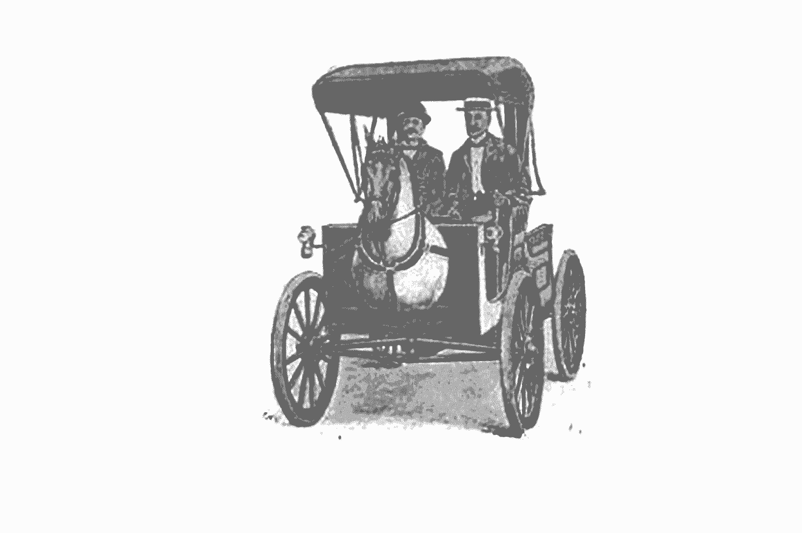
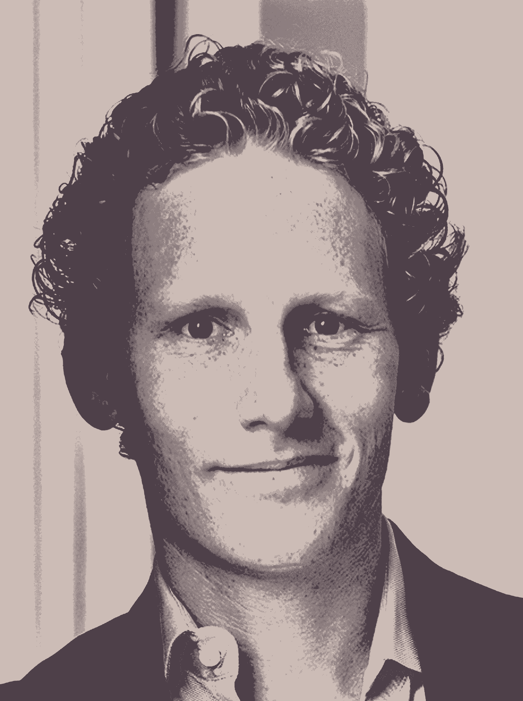

# 金发女孩效应和如何利用社会影响力

> 原文：<https://review.firstround.com/the-goldilocks-effect-and-how-to-harness-social-influence>

约拿书·伯杰 快结束研究生学业的时候，他的父亲问起他最近的研究。伯杰说他正在研究社会影响。他的父亲开始感叹它对同龄人的影响。“DC 的律师都是墨守成规的人，”他爸爸说。“他们成为合伙人后，做的第一件事就是出去买一辆新宝马。”伯杰停顿了一下。“但是，爸爸，你不是 DC 的律师吗？你*不是真的*开宝马吗？”他的父亲回答说:“是的，但是他们都开灰色的，我开蓝色的。”

即使经过多年的研究，伯杰仍对人们——包括他自己的亲属——如此迅速地识别出社会影响对他人的影响，却未能看到同样的影响对自己的影响感到惊讶。作为沃顿商学院的教授和畅销书《会传染的》和《无形的影响》的作者，伯杰花了超过 15 年的时间研究社会影响是如何工作的，以及它是如何引导产品、服务和想法流行起来的。他的工作已在主要出版物上发表，并被用于推动财富 500 强公司和初创公司的产品战略和采用。

在这次独家采访中，伯杰解构了创业世界中社会影响力背后的驱动因素，并提出了为什么我们应该影响增量，以及为什么我们应该被增量影响。他提供了在内部应用这种实践的方法，比如绩效评估，以及更多的外部公共努力，比如产品发布。最后，他提出了几个习惯，可以帮助个人在工作场所管理和利用社会影响力。

# 当影响力不可见时会发生什么

人们常常意识不到影响力是如何影响他们的，因为它是无意识地或在我们意识之外发生的。我们看不到。正因为它是无形的，所以常常会有两种发自内心的反应:“它发生在别人身上，但不发生在我身上”或者“它发生在我身上，我不信任它。”对伯杰来说，影响本身既不是歧视性的，也不是欺骗性的；每个人都会受到影响，这不一定是件坏事。

“以我爸爸和他的宝马为例，”伯格说。“首先，他觉得自己的选择是基于个人偏好，但他的偏好实际上是由环境塑造的。他买了同组其他人买的同一个品牌，但为了突出自己，他买了不同的颜色。第二，虽然我们通常认为影响是模仿或与他人相同，但选择不同也是被影响。第三，影响力不仅仅是相同或不同。我们经常通过同时做这两件事来表明我们的身份，以同时让我们融入并脱颖而出的方式行事。我们的选择——以及我们自己——是各种影响的融合。”

影响的不是一个葡萄品种。它总是一种混合。

# 颠覆获得资金；熟悉度会吸引用户

在一个崇拜偶像破坏者的创业世界里，颠覆和分化是一种直接的吸引力。根据伯杰的说法，这不是一个坏的本能，但这并不是故事的全部。这种默认副产品是最淡化——且危险地忽略——其他人对组织的影响程度。

“尤其是在风险投资支持的市场，人们更看重颠覆性。对投资者来说，没有比“我们将永远改变这种做法”更甜美的声音了。伯杰说:“对于筹集资金的公司来说，创始人将自己的初创企业定位为颠覆性的是明智之举。但是，当涉及到客户时，与众不同并不总是有效的。人们喜欢感觉熟悉、容易接受的东西。一种产品或服务，如果与他们过去习惯和接触的东西相距甚远，就很难流行起来。"

这并不是说产品或服务不能创新——它们必须是新旧的融合:部分是革命性的，部分是怀旧性的。这不仅仅是关于技术，而是通向熟悉环境的桥梁。运输部门就是一个明显的例子。“从一开始，[赛格威](https://en.wikipedia.org/wiki/Segway_PT "null")就拥有令人印象深刻的技术和彻底改变运输方式的机会。伯杰说:“自平衡个人运输车得到了史蒂夫·乔布斯、杰夫·贝索斯和约翰·杜尔登的支持，但最终成为十年来最大的失败之一。“一个很大的原因是消费者不知道该拿它怎么办。它不是汽车，也不完全是自行车，更不像滑板。他们不知道在什么情况下会用它，或者和谁一起用。”

将该产品与汽车发明并列。“现在汽车已经司空见惯，但在诞生之初，它就像赛格威一样不寻常，令人困惑。人们害怕汽车；美国农村人称之为“魔鬼的马车”“他们把汽车视为城市堕落的象征，并出台法律加以限制，”伯杰说。在世纪之交，一位发明家想出了一个聪明的解决办法。他的马车叫“无马马车”,车头上挂着一个真人大小的马头复制品。人们很容易嘲笑假马头，认为它很傻，但这一新增功能让这辆车变得更熟悉，更不具威胁性——不仅对人，对马也是如此，它们不太可能受到惊吓。"

The Horsey Horseless

# 金发女孩效应

对伯杰来说，赛格威和 Horsey Horseless 的不同结果在很大程度上可以归因于金发女孩效应。“作为顾客，我们的情感反应类似于儿童故事《金发姑娘和三只熊》中的主角。伯杰说:“不管是因为熊床的柔软度还是粥的温度，金发姑娘都被极端情况拒之门外。当采用新产品或服务时，结果遵循同样的倒 U 形曲线。如果一件事太新奇，那就是不熟悉，不可思议，难以理解。但是如果事情和已经发生的完全一样，那就很无聊，没有理由改变行为。不过，介于两者之间，刚刚好。"

成功的、突破性的创新通常会将技术隐藏在人们熟悉的外表中。

获得“恰到好处”的中间选择需要新旧平衡，并在推出产品或服务时逐步影响用户。以下是这种方法的更多现代应用，以说明构建适度差异产品的价值:

**通过特洛伊木马简化技术过渡**。“在推出数字录像机时，TiVo 可以为其技术构建任何外壳，但它选择了一个黑色的矩形盒子，放在电视下方或有线电视盒上方，”Berger 说。“公司知道客户采用和改变消费者行为至关重要，因此模仿了传统录像机的外观和感觉。通过将技术隐藏在熟悉的外表中，向新技术的过渡变得更加容易接受。”

**在一维(或二维)上转移。**“CHO Bani 已经成为希腊酸奶的代名词。但它不仅不是第一种上市的酸奶，而是希腊最受欢迎的原味酸奶，领先了十年。然而现任者从未在美国流行起来，”伯杰说。“为什么不呢？最初的产品对美国消费者来说太陌生了。他们不仅不知道希腊酸奶是什么意思，而且它大多装在家庭用的大容器里，唯一的口味是原味的。发放一份的量显然是第一步，但增量创新是将水果——如浆果混合物——放在每个容器的底部。上面的希腊酸奶保持不变，但较小的体积和熟悉的味道更像美国人所知道的。Chobani 通过与竞争对手相似——而不是完全不同——赢得了市场份额。”

打开外壳。“许多验孕棒本质上是相同的产品，依靠相同的技术，但客户购买它们的原因各不相同。有些人希望怀孕。他们一直在努力。因此，包装和定位迎合了这一点。他们以超值包装出售产品，包装上有多项测试，正面有一个快乐婴儿的形象。但另一些人却恰恰相反。他们希望*而不是*怀孕。除了一个快乐、微笑的婴儿，他们什么都想要。因此，对于这一部分，包装销售的是结果的速度和减少担忧的承诺。同样的产品，不同的外壳迎合不同的受众。

Jonah Berger

# 如何实际运用绩效评估来激励员工

许多组织使用头衔、级别和薪酬级别来表示技能和资历，但他们很难通过绩效评估来激励改进。“公司越来越多地采用同行比较来衡量业绩。伯杰说:“社会比较可能是一个强有力的工具。“采取完全不同的背景，节约能源。呼吁节约成本或保护环境听起来很棒，但这不会改变行为。社会比较。清洁技术公司 [Opower](https://opower.com/ "null") 通过将人们与他们的邻居进行比较，并以此激励他们节约能源，从而建立了自己的业务

Opower 看到了消费者行为的变化，一旦它开始分享他们的邻居所享受的节能。“不管用的只是收到一封邮件账单。没有关于你是否消耗大量能源的上下文。“得失没有参照点，”伯杰说。“但是当消费者看到一个同样大小的邻居使用了多少能源时，他们就更清楚自己应该站在哪里。结合具体的节能策略，如更换电子设备或调整设置，Opower 的程序导致能耗降低了约 2%。在这些项目的生命周期中，这大约相当于让阿拉斯加和夏威夷的家庭脱离电网一整年。”

社交比较可以在办公室产生类似的结果，但很少有组织有效地设计了它们。“传统上，公司会默认一个获奖者，比如本月最佳销售人员或工程师。伯杰说:“从某些方面来说，这个体系是稳固的——它让人们知道有一个领导委员会，并为公认的业绩设定了基准。“但这也打击了其他人的积极性，他们知道自己的表现永远达不到标准。相反，我们的重点应该是密切比较，或者我所说的“最接近的同行”

NBA 篮球比赛半场比分的趋势很好地说明了这一点。“我们研究了数千场比赛，毫不奇怪地发现，半场结束的球队更有可能赢得比赛。唯一的例外是只落后一点点的队伍。即使他们是更差的团队或平均水平，感觉他们足够接近来缩小差距激励他们更加努力地工作。他们从中场休息中振作起来，提高了生产率，结果更加成功。”

应用于工作场所，通过密切比较进行评估可以有效地激励员工立即提高绩效。“与相近的同龄人相比，尤其是表现稍好的人，人们会促使自己更加努力工作。但是如果和最好的执行者相比，保持动力往往太远了。伯杰说:“当他们几乎看不到峰顶时，攀登这座山的动力和纪律性就会减弱。“与其告诉某人他们在公司 200 名员工中排名第 27 位，不如对他们说:‘这个季度你做得很好，但莫妮卡在这方面做得稍好。下个季度或下个月，看看你是否能比她做得更好。将员工放在他们的总体排名中，与能力和表现相似但稍好的人进行比较。他们将更有可能参与并努力达到他们的新目标。"

伯杰承认，这种技术不应该用于性能的每个方面，而是主要用于你希望看到改进的关键领域。“一个月又一个月地告诉别人他们总是稍微落后是有危险的。他说:“当然，加入赢得的积极反馈，把这种策略留到对个人和公司都有短期好处的战略领域，这确实会在同事之间产生竞争，但至少他们会觉得这是一场他们可以赢得的竞争。这比将每个人与领导者进行比较更有效——这仍然会促进竞争——或者与个人的历史表现进行比较，这往往不会激发出超越他人的同样动力。”

当伯杰与人数较少的小型创业公司合作时，他建议他们以其他类似规模公司的同行为基准。“在那个阶段，甲板上的人手很少，所以鼓舞人心的个人表现和团队凝聚力可以通过向外看来实现，”他说，“在这种情况下，短期内要现实一些。你明天可能不会打败谷歌。挑选几个目前比你做得更好，但却是现实基准的相近同行。长期的、为星星而奋斗的愿景应该到位，以推动短期内的一系列冲刺，如果持续下去，这一目标将会实现。”

# 你如何运用社会影响力

在《无形的影响》一书中，伯杰提醒读者不要相信自己不受社会影响。这里有三个策略来利用社会影响力并在工作场所控制它。

**做一只变色龙。**当人们想到变色龙时，他们往往会想到一件事:改变颜色以适应你的周围环境。事实证明，同样的策略对人也是有用的。“巧妙地模仿他人——他们的怪癖、面部表情或语言——会增加你的影响力。例如，模仿谈判伙伴行为的谈判者达成协议的可能性是其他人的五倍。那些重复顾客点的菜，逐字逐句重复他们选择的菜来确认的服务员，可以多得到 70%的小费。伯杰说:“快速约会者相互模仿得越多，就越有可能进行第二次约会。模仿增加喜欢和信任，以及促进社会互动。它把熟人变成朋友，把敌人变成伙伴。"

**提名一名指定的异议者。**社交影响力在团队环境中尤其强大，因此团队必须在会议中积极主动地管理社交影响力。伯杰说:“在群体智慧和群体思维之间有一条细微的界限，群体智慧指的是群体做出比个人更好的决定，而群体思维指的是个人盲目追随主流观点。”。“有人建议做 X，下一个人可能会想到 Y，他会倾向于第一个人建议的 X，[特别是如果那个人是高级的](http://firstround.com/review/the-principles-of-quantum-team-management/ "null")。即使他们持观望态度或者有有价值的信息要分享，他们也更有可能选择 X，尤其是在团队环境中。”

为了避免默认跟随他人意见的倾向，提名一个指定的反对者。“每个人最终都会厌倦这位自称为魔鬼代言人的人，因此需要在会议开始时确定指定的反对者，并给予适当的框架。这个人不应该是职位最高或最低的人。伯杰说:“会议的主持人应该说，指定的反对者的工作就是不同意，不管她实际的立场如何。“这做了三件事。首先，它保护被指定的反对者免受鄙视，因为这是她的角色，而不一定是她的实际风格或个性。第二，它让那个人在讨论中注入不同的观点。第三，它解放了其他人，让他们可以分享自己独立的想法。即使他们不同意持不同意见者的观点，但有不同意见的事实使得这不再是一个对与错的问题，而是一个观点的问题。当涉及到观点问题时，每个人都更愿意分享自己的观点。”

**级联成共识**。当你想影响一个群体时，评估房间里的信念，利用多米诺骨牌效应来达成共识。伯杰说:“假设你在一个招聘委员会，你更喜欢候选人 A，而不是候选人 b。如果这个团队处于观望状态，你会发现办公室里有不同程度的支持:有些人对 A 有 50%的把握，有些人有 40%，有些人有 30%，等等。”。“为了让人们按你的方式行事，在会前战略性地建立共识，选择和你说话的人的顺序。公开征集 50%支持 A 的人的投票，一旦你说服了他们，40%的人会更有可能支持你，因为你这边有更多的支持者。一旦你让他们同样深信不疑的邻居成为冠军，他们就更有可能改变你的方向。一旦你得到了大多数人的支持，在做出决定之前要求投票表决。只有别人知道你有共识，共识才有价值。”

# 将这一切结合在一起

我们个人的想法和观点并不像我们想象的那样左右我们的选择。影响力往往在无形中起作用，但可以通过增量来理解和管理。这可能意味着将一种融合了未来的*和熟悉的*的产品推向市场，或者通过与相近的同行进行基准对比来激励其他人做得更好。如果个人知道在独创性方面有一定程度的一致性，他们可以让社会影响对他们有利。

“当你专注于赢得客户时，很容易忘记让自己与他们所了解的相似。改变不仅仅来自于炫耀让你与众不同的东西；这也是关于你如何用熟悉度掩盖或融合这种差异。伯杰说:“我们习惯的东西可能不会‘破坏’，但熟悉是我们喜欢它的部分原因。”。“社会影响没有好坏之分。但通过了解它是如何工作的，我们可以决定何时抵制它，何时拥抱它。”