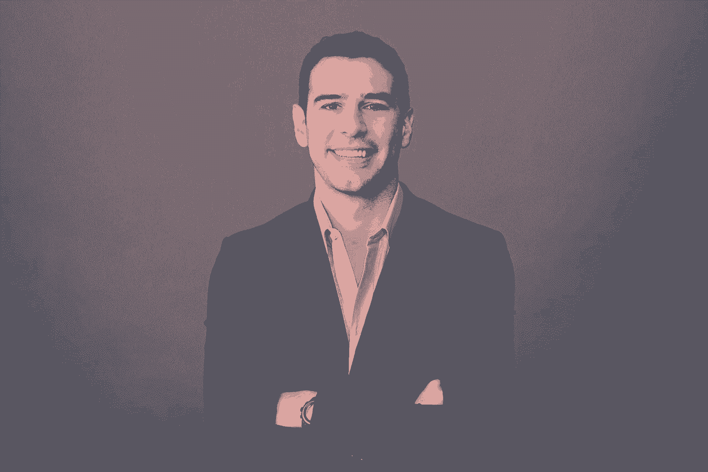

# 这位创始人快速融资、产品开发和图书交易背后的习惯

> 原文：<https://review.firstround.com/the-habit-behind-this-founders-fast-financings-product-development-and-book-deal>

亚当·布劳恩 收到他对 **[米西欧努](https://www.missionu.com/ "null")**A 轮投资的最后投资条款清单的那个晚上，他暂停了他的融资。他新推出的大学另类创业融资在不到三周的时间里就被超额认购。大多数创始人都梦想处于这种情况，但布劳恩有更多的电话要打。具体来说，他会在接下来的 24 小时内再下 23 个。他拒绝做出决定，直到他听到名单上每一个精心挑选的人所说的话。这些对话是布劳恩创造的“倾听之旅”的一部分。这些天来，他在每个重要决定前都会激活一个。

布劳恩作为一名应届毕业生开始了他的第一次聆听之旅，当时他正在决定他走出学校后的第一份工作。现在，五场涉及 80+人的聆听之旅后，这种做法不仅启动了他的职业生涯，也启动了公司。这帮助他为他的非营利组织[Promise Pencils](https://pencilsofpromise.org/ "null")筹集了 3000 万美元，该组织在发展中国家建立了 400 多所学校，他的书*[The Promise of a Pencil](https://pencilsofpromise.org/popbook/ "null")*登上了《纽约时报》和《华尔街日报》的畅销书排行榜，最近，他还与 Spotify、Warby Parker 和 Casper 等合作伙伴一起扩大了 MissionU 的规模。

一些读者可能会认为这是在向你的社交网络寻求建议。不要。这些旅游是结构化的过程，从一周到六个月不等，需要遵循特定的标准和技术。

在这次独家采访中，布劳恩详细讲述了他是如何组织他的聆听之旅的，包括他如何确定要见谁，问他们什么。他讲述了如何构建你的流程，不仅要做出手头的决策，还要与潜在雇员、合作伙伴、顾问和投资者建立持久的关系。

# 为什么聆听之旅与众不同

首先，让我们从一开始就定义它:

聆听之旅(hearing tour)|**lis**-*uh*ning t*oo*r】|(名词):有组织地分配时间，向一群精心挑选的人提问，相信听到他们的回答将为做出正确的决定提供关键的清晰性。

和任何定义一样，定义什么不是很有帮助。“这不是一个被动的声明，你会问每个人同一个问题，或者你会安排一次与你的顾问的会议，”布劳恩说。“它也不像客户拜访、焦点小组、董事会或企业教练。这些做法各有不同。”他们在这里:

**会议必须是 1:1** 。不能有集体思维或被动参与的风险。有些问题需要解决，你必须深入听取每个人对每个问题的回答。理想情况下，每次聆听之旅都是面对面的，但这不是必须的。对于那些以前见过你并和你交流过的人来说，一个电话或视频聊天就足够了。

**是加工，不是呈现**。领导者工作的一个重要部分是沟通信息，并将其传递给相关的团队。聆听之旅的起点、中间点和终点并不是传播信息本身。它是关于发现或排序你以前没有的信息。

**人们必须欢迎你的背景。你肯定很脆弱，但这只是问题的一部分。这也是他们用它做什么。那些参加你的倾听之旅的人必须有历史、意愿和/或能力来找出关键点和你所处情况的参与者。虽然他以前对人很冷淡，但参加布劳恩倾听之旅的大多数人都是他个人认识的人，或者是一个热情的引荐者。**

在一次听力巡演之前，你确实不知道答案。你不是在回避问题，而是在为它服务。

那么，什么样的决定适合聆听之旅呢？博朗使用以下调查方法来确定何时保修:

这是我今年要做的最重要的决定吗？如果是，他继续下一个问题。

**它还会对我的生活和组织的健康产生转型影响吗？如果这个答案是肯定的，他会问自己下一个问题。**

**我是否绝对确信地知道前进的最佳路径是什么？**如果答案是否定的，他会抽出时间进行一次聆听之旅。

# 聆听之旅剖析

创业文化奖励[速度成为一种习惯](http://firstround.com/review/speed-as-a-habit/ "null")。在许多方面，这都是黄金建议。但据布劳恩说，这不是为了听音乐会，他已经看到了这种深思熟虑、有条不紊的练习的好处。“倾听之旅是展开的，而不是释放的。他说:“你要致力于一个具体的、有时间限制的过程，在这个过程中，直到你与每一个人见面之前，陪审团都不在。”。“一次谈话——甚至一个问题——可以改变一切。”

例如，在启动 MissionU 之前，布劳恩在他的聆听之旅中问一个人，该计划是否应该被认可。他对布劳恩说:“如果你走认证之路，你是在要求某人在创新上超越你。”这一句话决定了 MissionU 作为一所替代大学的基础和未来。这个建议来自他在聆听之旅中交谈过的第 15 个人。

总而言之，聆听之旅需要纪律，这需要结构。下面是如何运行一个:

# 确定你的时间表。

听取意见的旅行时间从一周到六个月不等，取决于决定的紧急程度和组织旅行的时间。平均来说，它们持续一至三个月。当然，每个人都有自己的商业背景需要考虑，但这里有一条经验法则:**决策的长期影响应该与倾听之旅的长度直接相关。**根据 Braun 的说法，以下是一些关键的创业决策是如何进行的:

**创办一家公司(1 个月)**:作为一名连续创始人，博朗相信，要么你将合并并完成它，要么你不这样做。这个一个月的时间框架的原因是，你等待迈出第一步的时间越长，你就会失去越多的“情绪动力”这是博朗经历中的一个关键驱动因素。“你需要利用一个想法的情绪动力，因为它让你做出非理性的决定，”他说。“如果没有情感动力，你会把一个想法分解成一百万种方式来解释它为什么会失败。天真和执行速度有助于情绪动力。在创业方面，他们是你的朋友，因为他们允许你承担风险，否则你可能会合理化。”

**筹款(1 个月):**通过做一次倾听之旅，博朗大大缩短了他的每个筹款过程。“在为我们的 seed 和 A 系列做了一次倾听之旅后，我们花了 2-3 周的时间才拿到多份投资意向书。随着你做得越来越多，筹款的倾听之旅也会越来越短——你更了解参与者，作为一名筹款创始人，你已经进步了。也就是说，我的 seed 倾听之旅历时 6 个月，因为其中的一些元素触及到了我们的产品路线图，”Braun 说。“这类筹款倾听之旅的一个关键点是:不要使用套牌；那违背了目的。它不应该像一个球场，而是一个未来的种子。在谈话结束时，说，“我们在 X 日开始筹资”。“那你要我送你一副正式的套牌吗，”有些人会要求见面。其他人会拒绝，为你在正式过程中节省时间。对于那些回答“是”的人，你有理由在以后跟进。我的聆听之旅中的一个人成为了我们的主要投资者。"

**选择联合创始人(4-6 个月)**:“这是一场职业婚姻，所以你应该花大量的时间去了解这个人，超越他们在职业背景下的角色范围。布劳恩说:“尽可能多地和以前共事过的人交谈很重要，但你也需要了解他或她的家人和朋友。“我和我的联合创始人做的最好的事情是花几天时间进行‘生活对话’,我们根本没有谈论我们的职能责任，而是真正了解了彼此。我们分享童年的故事，揭露我们衣橱里的每一个骷髅，谈论价值观和道德观，以及工作之外对我们最重要的事情。几个月来，我们每周多次全天工作，但专门抽出几天时间来相互了解。”

**产品** **路线图(6 个月)**:以博朗为例，他在 2016 年 1 月成立了 MissionU，并花了 6 个月时间与创始人、教育家、家长和学生会面，勾勒出大学的替代方案。在更好地了解产品的潜在复杂性之前，他拒绝筹集资金(或开始另一场巡演)，从教育协议到学生贷款。为了更好地了解各种各样的人和政策，这变成了一个更长的倾听之旅，随着新主题的出现和发展，新的名字被添加到列表中。“在倾听之旅的早期，有人要求看我在对话中提到的产品演示。共有 12 张幻灯片:8 张阐明问题，3 张解释产品，还有一张跟进。他建议我做更多的产品定义工作，直到我们能够展示出与市场上存在的完全不同的东西，”布劳恩说。“我们最后的幻灯片有 21 张:6 张针对问题，14 张针对产品，还有一张跟进幻灯片。这迫使我们对解决方案说得更多，而不是它所解决的问题。这种介绍在很大程度上正是今天的 MissionU。当我想到我们的产品差异时，它甚至在一两个季度内就产生了影响。为十年的努力投资六个月是值得的。”

MissionU Students

有些时候需要快速做出决定，而**快速聆听之旅**是必要的，比如当条款清单即将到期的时候。这就是为什么布劳恩推迟关闭 MissionU 的 A 系列，以进行一次加速的聆听之旅，他在 17 小时内完成了 23 次通话。“在一次通话中，投资者投资组合中的一位创始人分享了即使在困难时期，投资者如何挺身而出支持公司，”布劳恩说。“很容易想象当事情进展顺利时，一个投资者会有多伟大，但直到你与那些见证过一只基金在事情不尽如人意时如何运作的人交谈，你才能获得真正的价值。这次谈话让我相信，无论是好是坏，这位投资者都会支持我们。没有一次聆听之旅，我是不会知道这些的。”

在这种情况下，确定你的倾听之旅的持续时间意味着考虑两个主要因素:**范围**和**紧急程度**。以下是布劳恩问自己的三个问题，以便为他的聆听之旅校准合适的时间——不要太短也不要太长:

我需要做出最终决定的截止日期是什么时候？如果没有外部强制功能，设定一个精神期限作为一个。

**在我的扩展网络中，谁是征求反馈的最佳人选？**注意那些“重要”的人，他们的反馈会带来巨大的价值和分量。在做出选择之前，与每一个人交谈。

与他们联系需要多长时间？考虑几个选项，但需要是实时的(电话、视频聊天、面对面)，而不是异步的(电子邮件)。

设计一次成功的倾听之旅的一个主要组成部分是与你的团队或公司的其他成员一起设定期望。“我明白，对许多人来说，离开团队的时间似乎不合理。但这不是休假——而是对公司的直接服务，”布劳恩说。“但这就是为什么对此次旅行及其目的保持坦诚和清晰至关重要。根据我的经验，每当我领导一家公司或拥有一份全职工作时，我的倾听之旅都是短暂而集中的经历，从一天到两周不等，而不是两个月。告诉你的领导团队，你正在进行一次倾听之旅，这将需要你在接下来的一天、一周或几周内花费大部分时间。在这些会议期间，不要查看手机或电子邮件——你必须尊重这段时间，让他们尊重这段时间。”

# 来源并设置您的人员列表。

倾听之旅不是给你关系网中最亲近的人发邮件问问题，也不是询问三位投资者的意见。这是一份经过严格筛选的符合特定标准的人员名单。例如，在并入 MissionU 后的第二天，布劳恩头脑风暴出了一份 12 人的名单。他们体现的具体特征可以总结如下:他认识的、信任的、高度正直的个人，他们正在创建或最近参与创建一家价值 2 亿美元或以上的公司。该标准旨在激励*和*期望。

接下来，创建一个列表。它不需要花哨，只要全面。布劳恩列出了他认识的所有人的名单——从大学到他与联合国全球教育特使的工作——以确保他尽可能地撒网。大多数专业或社交平台都允许你导出你的社交网络——这可以是一个很好的添加和删除的起点。

也不要把你的名单局限于你认识多年的人。倾听之旅是一个将薄弱关系转化为牢固关系的独特机会。布劳恩说:“当你告诉别人:‘我正面临人生中最重要的决定之一，我非常重视你的建议。’你就创造了一种家庭般的动力。”。“马上，他们必须想，‘哇，这个人真的很重视我的想法，我们只见过一次面。’我的一些最好的关系就是这样发展起来的，比如[亚当·格兰特](http://firstround.com/review/adam-grant-on-interviewing-to-hire-trailblazers-nonconformists-and-originals/ "null")，我向他寻求如何推出一本书的建议，从那以后，他成了我的朋友，无论何时被问及，他都会给我提供周到的建议。"

以下是布劳恩最近巡演清单的一部分:

***一支铅笔的承诺*** : [加里·维纳查克](https://en.wikipedia.org/wiki/Gary_Vaynerchuk "null")，[亚当·格兰特](https://en.wikipedia.org/wiki/Adam_Grant "null")，[格伦道尔·梅尔顿](https://en.wikipedia.org/wiki/Glennon_Doyle_Melton "null")，[路易斯·霍维斯](https://en.wikipedia.org/wiki/Lewis_Howes "null")

**MissionU 产品路线图** : [海利·拜尔娜](https://en.wikipedia.org/wiki/Hayley_Barna "null")，[丹·罗森斯威](https://en.wikipedia.org/wiki/Dan_Rosensweig "null")，[尼尔·布卢门撒尔](https://twitter.com/NeilBlumenthal "null")，[奇普·波切克](https://twitter.com/chippaucek "null")

**米桑努筹款** : [芬·曼德尔鲍姆](https://www.gsb.stanford.edu/faculty-research/faculty/fern-mandelbaum "null")，[迈克·拉泽罗](https://www.linkedin.com/in/lazerow "null")，[彼得·法姆](https://www.linkedin.com/in/peterpham/ "null")，[欧文·费恩](https://www.linkedin.com/in/irvingfain/ "null")

# 构建并开始你的外展。

一旦你整理好你的名单，为每个人起草一封简短的私人邮件。在一封长信中提供大量的背景信息并不重要，而且往往适得其反。布劳恩说:“人们在要求别人的时间时犯的错误是，他们试图用一封长邮件来证明这一点。”。“在开始之前，你会产生一种感觉，无论你要求什么，都会很繁重。在三行或更少的行中包含您需要的所有内容。”这是布劳恩基金募集的一个例子:

*你好 XXX，*

*几个月前，你建议当我准备好筹集资金时，我应该联系一下，听听你对如何最好地运作这个过程的想法。考虑到团队已经组建完毕，我们将在[插入月份]开始加薪，我很乐意聚在一起听取您的想法和指导。*

如果最简单的话，请随意抄送给管理员。下周一、周四、周五我有空。我还会提前发一遍。

*谢谢！*

*亚当*

这里有几个要点需要强调:

优先考虑建议、洞察力和指导等词语。即使你和这个人关系密切，你也需要证明你来自一个脆弱的地方，并尊重他们的意见。

**传达灵活性**。“我一直做的一件事是，如果可能的话，要求面谈，”布劳恩说。“除此之外，围绕人们的时间表开展工作，并表明你重视他们的时间。秀，不是也讲这个。如果被问到有空的日期和时间，如果可能的话，不要少于三个选项。

**找到中性接地**。虽然有些人可能会要求在办公室见面，但如果可能的话，布劳恩建议在工作环境之外聚一聚，尽量减少干扰，创造一种非正式的感觉。为了方便他们，可以在他们工作的地方附近开一家咖啡店，甚至附近的公园。选择一个你不会被打扰的地方。

一旦你有了你的模板集，把它们发送出去。理想情况下，在同一天。布劳恩说:“因为你试图在规定的时间内与每个人交谈，分批发送给他们——和你——最多的时间来回应和设定时间。“然而，如果你处于建立人际网络的早期阶段，从你最有信心会遇到你的人开始。然后，如果需要的话，引用一两次你已经进行过的对话，以增加其他人回应的可能性。

Adam Braun

# 将你的问题分成三层。

一系列的问题是任何聆听之旅的引擎。布劳恩将他的过程分为三步:

**研究。**花大量时间阅读文章、书籍和网站，在你要问的话题上尽可能地变得聪明。听听那些在你所追求的领域取得成功的人的播客，依靠这些集体信息来确定成功的关键变量和杠杆是什么。

**联想到。**你必须涵盖每个问题，但不是每个问题都是平等的。“当我列出 12-15 个问题时，从一堆问题中挑出 3-4 个最关键的问题。我知道这一点，因为如果需要的话，我经常可以在它们下面嵌套三到五个其他问题，”布劳恩说。“当我起草问题时，我会从最关键的三到四个问题开始。这些加在一起，回答了*要回答的*最高层次的问题:正面解决做决定的障碍的问题。这种分层可能会随着对话的进行而发展，但请尽可能提前准备好您的问题。”

**背诵。研究和写下问题的物理行为让它们根深蒂固。亚当仍然带着一份问题清单，在谈话中逐一核对，但多年后当被问到这些问题时，他的回忆是准确的。“这就像为一出戏背台词一样。布劳恩说:“你回忆得越多，在问他们时，你就越能专注于自己的情绪——以及其他人的情绪。它给你许可去接收你对面的人的信号，你可能会错过盯着你的笔记本。"**

以下是布劳恩在他的产品开发和筹款听证会上使用的问题集。最高级别的问题用斜体表示，三个最重要的支持性问题用**粗体**表示，最后三个问题是他建议在每次巡演中询问的问题。

**米西欧努:** *一个伟大的高等教育机构如果创建于今天会是什么样子？*

节目应该多长？

应该花多少钱？

特派团应该被认可还是不被认可？

我们应该如何从品牌的角度定位 MissionU？

**我们的目标学生应该是哪一部分人？**

MissionU 在启动时应该专注于哪个专业或学科？

与面对面相比，在线课程应占多大比例？

学生应该以同样的速度还是自己的时间来完成？

它的物理位置应该在哪里，在哪个城市？

目标班级或群体应该有多大？

我的前三个雇员是什么样的？

你如何建立最好的联合创始人关系？

你认为我应该知道你在旅途中经历的任何错误或陷阱吗？

**对于像 MissionU 这样一家使命驱动的公司，我们应该筹集多少资金，什么样的投资者类型是理想的？**

知道你现在所知道的，有没有什么事情你会做得不一样？

如果你是我，你会如何定义成功？

有没有一个你真正尊敬的人认为我也应该和他谈谈这件事？

**米西奥努融资:** *我们如何策划一次成功的融资，让合适的投资者以合适的条件投资这家公司？*

你是如何考虑为你的企业筹集适量资金的？

如果你领导 MissionU，你的目标是筹集多少资金？

我们应该如何安排投资者会议的时间以获得最佳的最终结果？

**是什么让推销成功？**

球场甲板应该有多长？

应该包括哪些信息？什么应该保留？

说到勤奋，我们需要准备什么来确保我们成功？

应该如何划分投资者类型？我们应该瞄准教育投资者吗？传统投资者？影响力投资者？A 轮投资人？家族办公室？

谁是我们理想的投资者？

你会如何组织你的董事会？如果您可以根据我们公司的当前阶段为我们选择任何投资者，您会选择谁？为什么？

有没有你建议远离的投资人？如果有，是谁，为什么？

你认为我应该知道你在旅途中经历的任何错误或陷阱吗？

知道你现在所知道的，有没有什么事情你会做得不一样？

如果你是我，你会如何定义成功？

有没有一个你真正尊敬的人认为我也应该和他谈谈这件事？

# 积极的倾听是有纪律和有条理的

你的倾听之旅是关于你问什么和你如何问。11 年来，博朗已经提炼出最有效的策略，以充分利用会议。方法如下:

# 设计学生/教师互动。

成功聆听之旅的秘密是脆弱。从你的第一封邮件开始，你就承认你需要指导来做出正确的决定。在你面试中遵循同样的思路。“你的目标是从和你在一起的人那里获得尽可能多的知识，”布劳恩说。“带着学习的目的去听。一旦你发现自己在争论或插话，就停下来。除了提问，你根本不应该说太多。”

布劳恩每次开会都会带一个笔记本，上面列有他的问题，这样他就可以核对并做笔记。“它创造了一个与大学讲座相似的环境。他们告诉你他们所知道的关于某个特定主题的一切，你把它写下来。这促使他们进行深入思考，因为他们的观察被记录和考虑，”布劳恩说。"当着某人的面写作这一行为本身就表明了对所说的每一个字的认可和重视。"

前进的唯一道路是说你不知道前进的道路。说出来，真心实意:“我需要你的帮助才能到达那里。”

# 看着钟。调整你的日程。

要完成每个问题需要严格的时间管理。与其计算每个问题的时间，不如考虑 Braun 模板化的日程安排，以保持进度:

**5 分钟:**感谢对方。分享他人没有的背景。强调你正在学习做出一个关键的决定。向他们保证这是许多会议中的一个，遵循一个结构化的过程来实现预期的结果。

40 分钟:尽可能仔细地浏览你的问题清单。大多数会议会围绕几个问题进行，这是很自然的，但是要引导对话向前发展。在开始之前给他们一个提醒，你不想打断他们，但是要注意速度。

**15 分钟**:把三到四个最重要的问题留到*最后*再问。“想先问你最迫切的问题以确保它们得到回答是很常见的，但人们需要热身。这需要在给出一个真正深思熟虑的回答之前，更好地把握上下文和关键变量。

就拿布劳恩为米西奥努的筹资提出的三个问题中的一个来说:*谁是我们理想的投资者？*“如果你在谈话开始时问了这样一个问题，你将会听到纸上谈兵的最佳投资者。你不想要纸上谈兵的最佳投资者。你想要最好的投资者，”他说。“当你最后问的时候，他们会先评估你的商业模式和现有关系。因此，从*的角度来回答这个问题，你会更有优势。根据我的理解，我认为你应该把目标锁定在他身上。*’”

你的最后一个问题不是为了触发最后一个词，而是为了以后对话的第一个词。

布劳恩的最后一个问题总是:**有没有一个你真正尊重的人，认为我也应该和他谈谈这件事？**“我第一次遇到的很多最器乐的人，都是因为在聆听之旅中问了这个问题，”布劳恩说。“有一半的情况下，人们会给你一个答案，并主动给你联系。在我定义 MissionU 产品的倾听之旅中，[Jeff Raider](https://www.linkedin.com/in/jeffrey-raider-2b30406/ "null")[Harry ' s 和 Warby Parker 的联合创始人]建议我与[Joey Zwillinger](https://www.linkedin.com/in/jzwillinger/ "null")[all birds](https://www.allbirds.com/ "null")的联合创始人】联系，他已经成为我的好朋友，并高度支持我们后来与之合作建立整个 MissionU 品牌形象的品牌代理公司 Red arterle。如果没有杰夫把我介绍给乔伊，今天的米西纽看起来会完全不同。”

因为倾听巡回会议非常密集，有时你会觉得你已经掌握了做决定所需的所有信息。不要落入这个陷阱。默认完成游览。布劳恩更进一步，在与所有人交谈之前，他不会正式考虑自己的决定。“参观的目的是在规定的时间内尽可能多地学习。他说:“这不是做决定。“如果你在会议中反复考虑这个决定——即使是在对方发言时在你自己的头脑中——你不仅会错过形成的过程，还会错过整个目的。”

聆听之旅是一次聆听之旅——而不是决定性之旅。在错误的时间做出选择会消除选项。

# 旅行结束后再做决定。

在聆听之旅的最后，Braun 会花 4-5 个小时来回顾他的笔记，通常需要 1-3 天，因为他在聆听之旅中的笔记可能超过 50 页。大多数情况下，在看完笔记后，他会对重大决策的共识有所了解。“在这个阶段，我推荐两种练习:长距离、独自行走和写下你的想法。布劳恩说:“散步有助于清除不断涌入的电子邮件和社交媒体的干扰。“至于手写的想法，我会写一些非结构化的日志来激活我的‘潜意识倾听者’。”我发现，当我手写一篇日记时——特别是希望没有人会读它——我听到了听众的声音。这是我的直觉。那就是要追随的声音。"

这两种实践的结果不是从倾听之旅中找出共识，而是在认同共识的同时找到自己内心的声音。“有时候，你会认同共识。其他时候，你会完全不同意。但这不是共识的问题。这是聆听之旅的一个重要原则。再说一遍，这不是共识的问题。这是关于你的直觉告诉你的*在*之后，你明白共识在哪里。这就是当你与你信任的人分享后，背景是如何变化的。”

**绕回闭环**。

对你遇到的人进行跟进是基本的礼节，既要感谢他们，也要分享你的过程的结果。大多数人会发送一封群发邮件或者定制的模板邮件。布劳恩通常会远离群体更新，而倾向于更个人化的快速文本。“这是信息，但不会很长。类似这样的话:'*嘿，我只是想让你知道，这是我做出决定的地方。我对你的真知灼见感激不尽。我非常感激你。如果我能在任何方面帮助你，请直说。“就是这样，”布劳恩说。“如果你的目的是播种和建立长期关系，你不需要提交长篇报告。而是对他们的时间和支持的真正认可，以及回报的意图。”*

# 将这一切结合在一起

有针对[完美销售招聘流程](http://firstround.com/review/the-anatomy-of-the-perfect-sales-hiring-process/ "null")、[可复制的入职蓝图](http://firstround.com/review/the-only-onboarding-timeline-youll-need-from-offer-to-first-friday/ "null")和[产品原型](http://firstround.com/review/six-steps-to-superior-product-prototyping-lessons-from-an-apple-and-oculus-engineer/ "null")的详细概述。但是当涉及到像倾听做决定这样的基本问题时，人们会摒弃任何具体的养生方法。但是不要犯这样的错误:尝试一下结构化的、有时间限制的聆听之旅。首先，确定这个决定是否值得投资。确定你的时间表，让你的团队做好准备，这样他们就能支持你的追求。根据特定的标准找到你的人员名单，并启动你的外联活动。将您的问题分成三层，并针对每个人逐一解决。以你们相遇的方式圈回来:1:1。然后，保持距离来处理你的笔记，独自做决定。

“风投的目标是做出初始投资回报高的决策。一开始我不会把它们归为一类，但我已经开始期待聆听之旅会有类似的表现——我希望在那段时间获得高回报，既属于名单上的人，也属于我自己。这意味着我们如何度过这段时间不仅要服务于眼前的决定，还要服务于我们可能相互分享的未来决定，”布劳恩说。“从长远来看，这开始体现为你公司的顾问、未来的董事会成员，以及理想情况下，你的使命和运动的倡导者。这种结构化的投资决策方式会带来更多好的选择。这真的是你作为一个创始人希望排队。”

*摄影由* *[米西努](https://www.missionu.com/ "null")* *提供。*