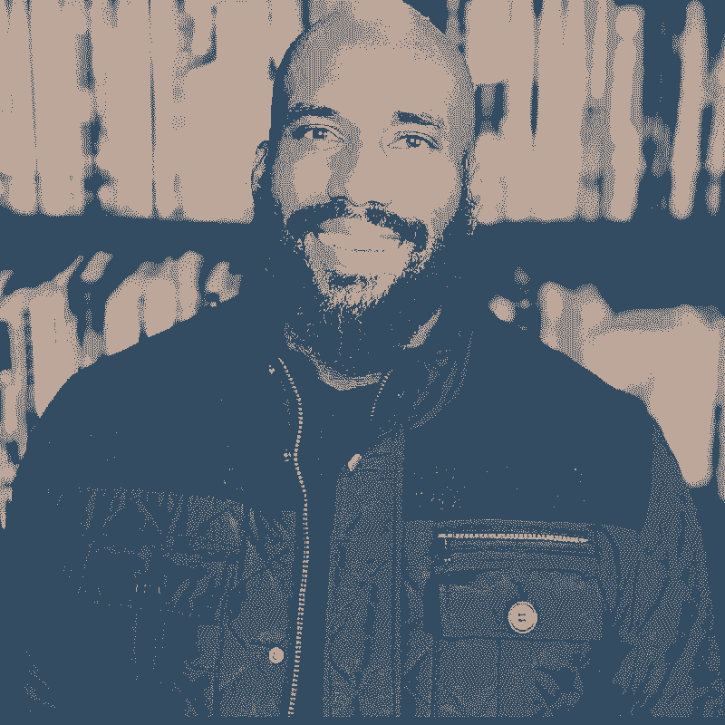

# IC 的职业对话指南——有目的的职业规划的 25 个技巧

> 原文：<https://review.firstround.com/the-ics-guide-to-driving-career-conversations-25-tips-for-purposeful-career-planning>

## 介绍

有一个原因是“你认为自己五年后会怎样？”是最常被提及的面试问题之一——职业规划被认为是人们最关心的问题，尤其是在寻找新的工作机会时。但在现实中，许多人往往采取一种更加随意的方式来规划他们职业路线图上的点。看看下面的症状是否听起来很熟悉:也许是害怕绩效评估季节，把自我评估留到最后一刻的感觉。当你的经理询问他们如何支持你的职业发展时，也许你正在绞尽脑汁想出一个令人信服的回答。或者你开始寻找一份新工作，努力评估你在下一份工作中想要什么，不想要什么。或者也许职业规划是你第一次进入职场时做的事情，有一个被长期搁置的 5 年、10 年和 20 年的计划。

职业规划一直处于次要地位的最大信号之一是，默认情况下将大部分(如果不是全部)繁重的工作委派给你的经理——相信他们会突出你的优势，在整个组织中展示展示这些肌肉的机会，并提供稳定的反馈。但是那些想掌控自己职业生涯的人应该坐在司机的位置上，而不是乘客的位置上。

这需要转变你的视角，尤其是在高增长的初创公司，那里的职业阶梯不断变化(如果一开始就存在的话)，经理缺乏培训，职业对话过于短期，只需勾选方框——或者更糟，根本不会发生。

虽然有很多关于[经理如何通过他们的报告进行更好的职业对话的建议](https://review.firstround.com/our-6-must-reads-for-managers-to-give-feedback-that-helps-people-grow "null")，但对于那些希望推动自己职业生涯的人来说，无论他们在阶梯上的哪个位置，想法往往都不够。考虑到这一点，我们在过去几周联系了一些我们所知的最敏锐的领导者和经营者，询问他们对这个问题的看法:

## **对于开创自己的事业，你的最佳建议是什么？**

以下是一份不容错过的框架、技巧和战术想法的清单，它们来自组织结构图中的所有人，既有在快速增长的初创公司工作的经验，也有更老牌的科技巨头。他们的建议包括:有目的地进行绩效评估，与你的经理合作，以及寻找跨职能合作伙伴来满足企业的最大需求。这并不是将所有 25 个技巧复制/粘贴到你自己的剧本中的权威指南——有些想法可能会引起你的共鸣，有些可能不太合适。您还会注意到，其中一些技巧可能会相互矛盾，或者对同一问题采取不同的方法——这是设计使然。

展望未来几年，感觉就像仰望一座山峰，它的峰顶被雾遮住了——你不知道它到底是什么样子，也不知道你要走哪条路才能到达山顶。本指南的目的不是给你准确的登顶地图，而是给你工具来制作你自己的地图，并在你的旅途中继续修改它。我们将这个庞大的列表分成了六个类别(你会注意到我们保持了驾驶主题)。使用左侧的大纲导航到每个部分。让我们开始吧。

# **在开始旅程前设定您的坐标**

## **1。从这四个列表开始。**

在这篇评论中，我们多次求助于 **[莫莉·格拉汉姆](https://www.linkedin.com/in/mograham/details/experience/ "null")** ，因为她有能力提供准确的创业建议，无论是“T8”放弃你的乐高还是“与啃你腿的怪物交朋友在谷歌、脸书、Quip 和 Lambda School 的管理生涯中，她为自己的直接下属打造了自己的标志性建议。

“我总是告诉 20 多岁的人，他们应该利用工作经验的前 10 年，建立 4 个清单。格雷厄姆说:“尽管其中一些听起来可能相同，但随着你对自己了解的加深，你会意识到它们是不同的，但又有所重叠。

我喜欢做的事情

我擅长的事情

我讨厌做的事情

我不擅长的事情

“你职业生涯的最佳版本是在你热爱做的事情和你擅长做的事情之间找到维恩图中的工作。这听起来可能是显而易见的，但通常随着你越来越资深，维恩图经常是“我擅长的事情”与“我讨厌做的事情”重叠。你必须足够了解自己，才能拒绝这些工作，即使有人给你提供了一个超级性感的角色，里面充满了你讨厌做的事情。格雷厄姆说:“这个角色会让你表现出最糟糕的一面。

但这并不是你在职业生涯早期一次性列出的清单。你的每一次工作经历——每一个项目，每一个角色——都可以给列表增加更多的数据。在绩效评估期间，花些时间回顾过去，以这些问题为指导:

上个季度我做的最喜欢的事情是什么？

哪些时刻或几周是我感觉最好的时候？

什么时候我觉得我可以一遍又一遍地做同样的事情，并且很开心？

我什么时候感到筋疲力尽了？

我什么时候觉得无聊了？

哪些瞬间我觉得自己是最差的自己？

接下来，把这些清单带给你的经理。“如果你有一位优秀的经理，他们应该会想帮你补充这些内容，并在你的工作中应用这些经验教训。你下一步可以做什么项目，让你做更多你喜欢的事情，并从中找到活力？公司需要什么与你擅长的事情重叠？Graham 说:“一个优秀的经理可以帮助你利用在公司的时间更好地了解自己*和*通过利用你的优势来帮助公司发展。

## **2。换下你的镜片，每月追踪进度。**

“在职业生涯中较早的人经常说他们想要职业发展，但他们实际上并不知道他们的职业目标是什么。这可能会成为阻碍你职业生涯的精神障碍——但这并不一定如此， **Tech Matters** 的工程总监 Nick hurl BurtT9 说道。他的建议？“如果你没有长期目标，选择短期目标。不知道 10-20 年后你想要什么是正常的，但是如果你在接下来的 1-2 年里实现了你的目标，你会更好地处理下一组短期目标，然后是下一组。Hurlburt 说:“这些短期目标结合起来，就能打造一份让你引以为豪的职业。

他勾画出几个开始的地方。“短期目标的一个非常有效的默认方式是培养在组织的层级结构中提升一级所需的技能。他说:“或者，你可以向你钦佩的、比你略胜一筹的人学习，找出他们擅长的领域，努力缩小你自身技能的差距。”

尤其是在你职业生涯的早期，任何前进都将为你未来的目标打下基础。

John Cline, co-founder and CTO of ShelfLife

****shelf life 的联合创始人兼首席技术官 John Cline 也利用了 2-5 年时间框架内的短期目标。“接下来，我列出了我目前的角色如何适应路线图，以及我需要努力的领域。然后，我将该计划提交给我的经理，征求他们对我的角色的看法，并寻求他们对我们下一步行动的帮助。有时这意味着学习一项新技能，或者获得一个新项目，或者获得关于我如何以不同方式完成我的角色的明确反馈，”他说。****

**下一步至关重要:“一旦我和我的经理就下一步达成一致，我将为我在未来六个月想要改进的地方设定一个目标，并设置日历提醒，每月跟进，以获得关于我进展情况的反馈，”Cline 说。**

## ****3。缓解完美的压力。****

****[Andrea Spillmann-Gajek](https://www.linkedin.com/in/andreaspillmann/?miniProfileUrn=urn%3Ali%3Afs_miniProfile%3AACoAAADWTKUB8UvZiiXwyDao7r5YJgdC5hjwdxY "null")******SV Academy**的客户成功和战略伙伴关系主管也看到太多的人陷入了需要解决所有问题的困境。“事业不是线性的。如果你不知道 10 年后的最终目标，也不要担心。不要认为有一条“正确”或“完美”的道路适合你。她说:“有很多有趣的途径可供选择——我敢打赌，没有一条对你来说是‘完美的’。”她推荐的开辟非线性道路的书是比尔·伯内特和戴夫·埃文斯的《设计你的生活》。****

****虽然没有完美的路径，但这并不意味着你应该满足。“如果你对目前的工作不满意，花点时间想想为什么会这样。是工作是什么，你和谁一起做，工作的结构或负荷，等等。？不要只是现在“忍气吞声”或“还债”来让以后变得更好。斯佩尔曼-加杰克说:“专注于让你快乐的事情，而不是你认为别人会喜欢、钦佩、赞同或认为是成功的事。****

****如果你走别人的路，你永远不会真正到达。****

## ******4。远离“职业蛙人”******

****虽然拉斯·拉罗威 同意没有“完美”的工作，但将目光放在一份遥不可及的梦想工作上可以让你的下一步更清晰。“我从 1000 多人的经历中了解到，制定长期愿景对许多人来说很难，甚至看起来不可能。尽管如此，这件事必须做。原因如下:你想要成长和发展，你的经理很可能认为帮助你成长是他们的工作。问题是你们两个都没有回答下一个最重要的问题，那就是:“成长为什么？“他说。这个问题只能通过努力阐明你的长期愿景来回答——不是你的可仲裁性阐明的“五年计划”，而是你的梦想工作——当你快乐、有挑战、不渴望更多的时候，你在职业生涯的巅峰时对自己的愿景。要了解更多信息，请点击[查看他之前在《评论》杂志](https://review.firstround.com/three-powerful-conversations-managers-must-have-to-develop-their-people "null")上发表的对经理人的对话提示，以及他即将出版的新书《当他们赢了，你也赢了:成为一名伟大的经理人比你想象的要简单。"****

****他还从一个意想不到的街机引用。“如果你没有清晰地表达你的职业愿景，那么你未来的工作决定很可能会被打乱，”拉罗威说。****

****不要成为职业蛙人的主角——从一片空地跳到另一片空地，躲避众所周知的卡车，无处可去。****

******[莉兹·福斯林](https://www.linkedin.com/in/liz-fosslien/ "null")****内容负责人**胡穆，**也强烈建议乡亲们避免跨越。“很多人会鼓励你去尝试很多事情，以找出是什么让你变得有活力——这是个好建议，但只是在一定程度上。她说:“一旦你找到了一群你喜欢一起工作的人，以及你普遍感兴趣的工作，我认为承诺一段时间并拒绝新的机会是有价值的(当然，除非你偶然发现了一些非常惊人的事情)”。“如果你经常跳槽，你就不太可能积累真正的专业知识，学会如何看透长期战略项目，并发展深厚、持久的关系，”她说。******

## ******5。寻找灵感和嫉妒的火花。******

****感觉卡住了？尝试滚动 LinkedIn——即使你还没有寻找新的角色。找到让你兴奋的延伸职位(比你现在职位高几级的职位)，然后看看列出的要求。为了具有竞争力，你需要具备什么样的技能？你觉得哪个听起来特别有趣？Fosslien 说:“然后，把你的新成长机会清单带到下一次与你的经理或志愿者的一对一会谈中，参加那些能给你提供相关经验的项目。”****

****倾听那些嫉妒的剧痛。太多时候，我们做各种各样的心理体操来说服自己不嫉妒别人。相反，试着准确地指出你渴望的是什么，然后问自己:我能参加课程来获得这种技能吗？我应该承担不同种类的项目吗？****

# ******清点你需要的工具******

## ******6。开始吹牛博士。******

******[亚伦·佩尔茨](https://www.linkedin.com/in/pelz/ "null")** **，****纸风车的工程经理，**建议扎根于你迄今为止引以为豪的成就中。“保留一份吹牛文档，并不时地重读一遍。它提醒你已经做了什么，这让你的注意力集中在你想如何成长。他说:“它还会提醒你，如果你坚持接受完全符合你舒适区的项目，那么就会促使你寻找机会来展示不同的技能。”****

## ******7。看硬币的两面。******

****

Nikhyl Singhal, VP of Product, Facebook**** 

******[脸书](https://www.linkedin.com/in/nikhyl/ "null")**的产品副总裁**Nikhyl sing Hal 说:“最难开发的技能是隐藏在你的超能力背后的技能。“假设你是一个出色的合作者——你可能很难让人们负起责任。或者你非常有原则，以数据为导向——在信仰和天真至关重要的地方，你可能很难创新。”他的建议？“与你的经理和同事合作，了解你的最大优势，但进一步评估他们可能会阻碍你的发展或需要调整的地方。Singhal 说:“当你将优势和发展联系在一起时，这是一个巨大的职业机会。******

******你的超能力可以让你走得更远，但它们也会给你成为伟大领袖所需的技能蒙上阴影。******

********[霍华德·艾昆达约](https://www.linkedin.com/in/howardsueing/ "null")******【网飞】的工程总监**也鼓励人们不要在他们的天才地带里休息得太舒服。“一位前任经理分享了一些建议，这些建议重新定义了我对职业发展的看法:'**达到目前水平的你可能不是达到下一个水平**所需的你。”我们经常将我们的成长领域和职业目标局限于我们职业生涯的历史背景。当一个人寻求进入下一个层次时，你需要根据差距、机会和业务需求重新调整。他说:“那些以增长思维快速、战略性地应对这些时刻的人，将自己定位为最需要的关键领导者。********

## ******8。让它成为每周一次的练习。******

****

Jimena Sanchez Gallego, Associate of Strategic Operations, Flatiron Health**** 

****向下凝视[绩效评估季](https://review.firstround.com/the-power-of-performance-reviews-use-this-system-to-become-a-better-manager "null")通常是一项令人生畏(且势不可挡)的工作——试图将一个季度或六个月的工作总结成一个整洁的叙述。为了减轻负担，**熨斗健康**的战略运营助理 Jimena Sanchez Gallego 经常收集数据并进行反思。“在我的日历上，每周五我都有一个小时的时间来回顾我在那一周完成的工作，并花时间捕捉在工作中反映出来的职业阶梯上的技能。她说:“我还会总结经验教训，以及下次我会采取不同做法的事情。“这对我的职业发展聊天非常有帮助，因为它让我和我的经理可以回顾我做得好的具体时刻，以及我可以做得更好的地方。当我们进行绩效评估时，更容易思考我的评估，因为我已经有了具体的例子来说明我希望在我的角色中展示的具体能力和技能。”****

# ****邀请人们帮你导航****

## ****9。关注正确的区域。****

******[马特·沃勒特](https://www.linkedin.com/in/mattwallaert/ "null")******青蛙公司的行为科学主管**发现，当直接下属希望直接模仿他们的经理时，这些对话往往会出错。“通常，我们对自己是陌生的。因此，当你问一位经理如何效仿他们的成功时，他们给出的往往是从自己的经验中总结出来的事后合理化(附带所有偏见)。最终，就像他们所做的那样，你将在实践中学习，”他说。“所以与其试图获得建议，不如努力获得机会。保持职业发展对话集中在你的“最近发展区”——你还没有准备好完全依靠自己，但可以在别人的帮助下完成的事情。他们能为你提供什么样的机会，并引导你度过难关？你认为你的 ZPD 在哪里？他们在哪里？”******

****Stedi 的软件工程师 Davit Balagyozyan 说，如果你不能完全确定，不要完全交出方向盘。“如果你犹豫不决，不要让经理替你‘决定’。如果你有一个职业方向(例如，一名工程师可能想成为一名项目经理)，那么你需要要么推动它，要么推回来，或者表明你还没有决定。他说:“犹豫不决没关系，但如果你发出了不明确的信号，经理会试图为你‘决定’下一步行动。”他推荐给犹豫不决者的书包括雷伊·达里奥的《原则》和纳西姆·尼古拉斯·塔勒布的《游戏中的皮》。****

****艾伦·佩尔茨还建议戴上你的老花镜。“阅读你尊敬的业内人士的博客，你可以将他们的想法应用到你的日常工作中。对我来说，这就是威尔·拉森的博客，它是工程管理故事和建议的宝库，”他说。(要了解 Larson 的建议，请查看他的[关于评估团队规模的评论文章](https://review.firstround.com/how-to-size-and-assess-teams-from-an-eng-lead-at-stripe-uber-and-digg "null")。)****

## ******10。探索阶梯。******

****“如果你的职位有一个职业阶梯，每一级都有明确的绩效预期，请你的经理检查阶梯上当前和下一级的每个维度，并具体讨论你的差距在哪里。然后制定一个在这些领域发展的计划，填补空白。将讨论记录下来，每隔几个月重复一次，以上一次讨论的笔记为参考，讨论你取得的进展， **[熨斗健康**的产品管理总监乔希·哈姆森**](https://www.linkedin.com/in/jhaimson/ "null")** 说。****

**“如果你的职位没有明确的职业发展阶梯，也没有每个级别的绩效预期，请你的经理帮助你确定。他说:“主动提出帮助你建立晋升阶梯，会给你加分，因为这有助于减轻你上司的负担，同时帮助你详细了解公司里的人是如何看待你的职业发展和对你职位的绩效预期的。”**

## ****11。优先考虑诚实和透明。****

**“永远不要害怕要求你需要的和想要的。当谈到你的抱负和愿望时，大多数经理都欢迎有机会与你进行诚实、透明的交谈。我已经学会了用一种对双方都有利的方式来组织这些对话。什么能给我提供最好的学习、成长和发展机会，什么能给组织带来最大的收益？在这方面，这是一个双赢的局面。能够用数据、具体例子和商业伙伴甚至客户的证明来支持你的要求。确保你听取并牢记建设性的反馈。反馈是你能得到的最大的礼物，” **Lob** 的内容和客户营销总监**[Kim Courvoisier](https://www.linkedin.com/in/kim-courvoisier-517b945/ "null")****说。****

# ****不要只停留在自己的车道上。****

## ******12。看看那些你最少接触的人。******

****

Julie Froelich, Head of Product Design, Perpay**** 

******[Julie froe lich](https://www.linkedin.com/in/julie-froelich/ "null")******Perpay 的产品设计主管 Julie froe lich**分享了一个重要的提醒:“你不知道你不知道的东西，这将阻碍你的成长——所以去探索吧！对我来说，成长经历了各种各样的经历。她说:“我已经要求与该行业完全不同部门的其他专家建立伙伴关系，这扩大了我职业生涯中的人际关系和技能。”。******

****Froelich 分享了她自己职业生涯中的一个例子:“我注意到我们很少与客户服务合作，部分原因是我的经理和我自己不太了解这方面的业务。我问我是否可以作为联络人，找到一些我们可以跨职能解决的重叠项目。她说:“作为开始，我开始定期召开状态会议，与这方面的业务展开对话，一个美好的合作伙伴关系就此形成。****

****但是不要出于义务而坚持新项目。“要有自知之明，认识到自己对项目没有激情的时候，做好优雅的交接。新事物可能很难，但不应该很痛苦。弗罗利希说:“快速前进，利用这段时间去发现与你喜欢的事物更契合的新事物。”****

## ******13。采取三阶段方法。******

****对于**谷歌**的**[Pedro Tanaka](https://www.linkedin.com/in/pedrotanaka/ "null")****工程经理来说，拥有自己的事业意味着专注于为利益相关者创造价值。“我个人的方法包括三个主要阶段:调查、确认、行动，”他说。******

********调查:**“在调查阶段，我探索并定义自己角色的边界。我发现了可能没有明确所有者或项目的机会领域，但我看到了通过执行这些领域可以获得的价值。”******

******确认:**“在确认阶段，我专注于让决策者和利益相关者了解我的提议的价值，目标是达成共识并形成势头。”****

****行动:“一旦我获得了关键的支持，我就会根据建议采取行动，同时还会定期观察环境，以适应环境的任何变化。”****

****Davit Balagyozyan 同样以一个简单的列表开始:“写下每一个和你一起工作的人，他们最大的需求，以及他们最理想的‘天哪，这让我的生活变得如此美好！’现在，您已经有了组织最大需求和解决方案的列表。他说，现在，决定满足这些需求是否符合你(提示:如果你对此感到兴奋，那通常是正确的标志)。****

## ******14。带着主人翁的心态。******

****“像主人一样思考。Liz Fosslien 说:“特别是在你职业生涯的早期，你很容易默认去寻求别人对你应该做什么的指导。****

****养成习惯退一步问自己，“如果我在管理这个公司或团队，我会怎么做？我会把时间投资在哪里？我可以尝试哪些目前没有人在做的事情？”****

****

Cristina Cordova, Angel Investor and Advisor**** 

******[Cristina Cordova](https://www.linkedin.com/in/cristinajcordova/ "null")****，**曾在《观念》担任平台和合作伙伴的主管，她列举了自己职业生涯中的一个例子。“在 Stripe 工作期间，我让我的经理知道，我想要一个更像总经理的角色，可以管理不同职能部门的人。当时，Stripe 的运行非常功能化，他让我知道这是不可能的。但我一直在努力，最终，公司在成长，这是在公司雇佣第一批这类角色的时候了。她说:“知道自己想要什么至关重要，以持续但尊重的方式传达这一点，可以确保机会来临时你是第一个想到的人。”****

## ******15。参加一次信息面试。******

****信息性面试可能会受到一些指责，但是盲人培训中心的公关负责人里克·陈认为这些面试没有得到充分利用。“寻找信息面试的机会——这不仅仅是针对职业生涯早期的人或求职者。他说:“从坐在那个位子上的人那里了解更多关于你喜欢的公司、行业或角色的信息总是有帮助的。****

****如果你害怕发送一封冷冰冰的邮件，试试这个策略。“一位新的公共关系总监加入了我工作的公司，我发了一封简短的个人信息，直接问道:‘欢迎来到[公司]！本周或下周你有 20 分钟的时间来聊天吗？我在这里已经两年了，可以带你了解公司、员工和产品。“我也很想向你学习更多关于公关的知识，因为我过去从事过政治沟通工作，但从来没有像你一样在公关公司或公司内部工作过，”陈说。那次谈话最终帮助我在职业生涯的早期转变了行业和学科。"****

## ****16。介入，实现跨职能双赢。****

****

Randhir Vieira, SVP of Product Management, Omada Health**** 

****Omada Health 产品管理部的 SVP 说 **[Randhir Vieira](https://www.linkedin.com/in/randhirv/ "null")** “全年与你的经理一起播下种子，让他们知道你想要获得的技能不在你的直接职责范围内。“在你的定期绩效评估中重申这些，当团队或组织中有人离开时也要重申，这对你和你的经理来说可能是双赢的。如果你知道公司可能会考虑重组，提供你的技能让公司考虑。他说:“改变可能很难，但这通常也是你目前公司发展的最佳方式。****

****Cristina Cordova 还强烈建议积极寻找这些机会。“我发现，在我的职业生涯中，对我帮助最大的项目或机会让我接触到了日常工作/职能之外的人。这既是因为它让我在我的特定组织之外为自己建立了声誉，也让我更多地接触到我希望为自己的职业发展探索的其他职能。同样常见的是，一个组织内的晋升需要跨组织的工作，这类项目可以提供帮助。”****

## ******17。拥抱谈判。******

******[Trish Leung](https://www.linkedin.com/in/trishleung/ "null")** **，****Pantheon Platform 货币化和定价策略高级主管**发现，人们往往将下一步工作完全集中在自己的部门，而不是扩大范围。“知道自己想要什么是成功的一半以上。想出你想尝试的角色，并描绘出达到这个目标所需的技能。**从你的跨职能团队那里了解公司的差距。有了这些，你就可以规划你想要发展的技能和需要关注的领域了。她说:“任何优秀的经理都会希望看到你、团队和公司成长。******

****如果你想抓住一个机会，不管是一个新项目还是一个新角色，都要做好准备。“归根结底，这是一场谈判。你正在为接受新挑战的权利和潜在的晋升和/或加薪进行谈判。因此，准备好展示为什么你是做提议的合适人选。希望你能定期展示你的成就，并让其他人来赞美你。最后，不要害怕谈判。这个词可能会让人们产生很多焦虑，但谈判只是为了达成结果而进行的讨论，”Leung 说。****

# ******安排定期维护检查******

## ****18。缩小到“本周问题”之外****

****“许多人忽略的第一步是确保你在日历上有定期的成长对话。这些应该不同于通常与你的经理进行的一对一会谈(专业提示:相应地命名会议)。 **Meta** 的产品经理 **[汀-周婷](https://www.linkedin.com/in/tingtingzhouqy/ "null")** 说:“尽管节奏可能会有所不同，但这些会议应该明确地以谈论职业发展为目的。****

****不要让你的经理或你自己劫持了本周最新问题的对话——自私一点，集中时间。****

****克里斯蒂娜·科尔多瓦还建议将这些广泛的对话与常规的一对一对话分开。“虽然有些经理会在报告中主动安排职业对话，但并非所有经理都这样做。她说:“当我与忙碌的经理一起工作时，很难在常规的一对一中花太多时间，所以每季度留出一次时间会有所帮助，也能让你的经理有时间准备。”****

## ******19。落笔。******

****“在为 1:1 做准备时，我总是花一些时间反思自己的表现、团队以及个人和职业目标。在那里，我喜欢写下一些东西。即使我最终把纸扔进了垃圾桶，落笔的练习也能帮助我以一种重要的方式追踪我的想法。我最终会写下我在哪里，我想去哪里，然后是到达那里的解决方案，”Alma 的社区成长代表科林·巴特勒说。****

****“无论是像养成一些富有成效的日常习惯这样的小挑战，还是像朝着目标前进这样的大挑战，我都会把它们写下来。然后我过滤出值得注意的，值得讨论的，或者我希望得到支持或反馈的，而不是那些。在这一点上，我有一些在会议上值得花些时间的要点，对我的经理和我自己都是可行的，”他说。****

****廷-周婷还建议保留一份运行文档，以反映与经理的每一次职业对话。“你可以记下你的目标、差距、哪里需要支持、你想学什么、你完成了什么等等。她说:“让你自己和你的经理对这些对话负责，并将这份文件作为一种问责措施。****

## ****20。写下你自己的晋升。****

****

Anjuan Simmons, Engineering Coach, Help Scout**** 

****“在推动你的职业发展的过程中，一个经常被忽视的工具是[在你目前的工作中使用绩效流程](https://review.firstround.com/betterment-tested-three-performance-management-systems-so-you-dont-have-to "null")。大多数公司都有年度评估，其中绩效评估被编辑并用于决定谁可以晋升。不要等到那个回顾期来推动你的晋升。找出你的上司需要看到的关键成功因素，以支持你的晋升，” **[安胡安西蒙斯](https://www.linkedin.com/in/anjuan/ "null")** **，**的**工程蔻驰说。**“现在就开始填写你的晋升文件，列出你如何达到下一个级别的期望。没错，*你*应该是把你的推广文件里的每一个字都写出来的人。然后，定期和你的老板一起回顾——至少每月一次。即使你离升职还有好几个月，你也应该让这成为你和上司谈话的常规内容。****

**通过持续讨论你是否适合升职，你将有机地为自己的晋升创造一个令人信服的案例。不要把你职业生涯中如此重要的一部分留到最后一刻。**

## ****21。帮助你的经理帮助你。****

****[格雷格·拉特纳](https://www.linkedin.com/in/gratner/ "null")** **，****部队的联合创始人兼首席技术官。ai，**鼓励人们更深入地接受请求。“带着你想要推动的非常具体的成果来参加会议，这非常有帮助。你的经理不会读你的想法。因此，如果你知道有一个具体的项目即将完成，并为之举手，那么说“我想领导一个大项目”会更好。越具体、越可行越好。他说:“让你的经理更容易帮助你。**

**当你的经理不知所措时，相应地调整你的要求。Cristina Cordova 说:“你的经理可能太忙了，无法直接帮助你培养技能，但让你和公司里更高级的 IC 联系起来，他们会更容易帮助你。”**

# ****寻求反馈&拥抱“我的驾驶技术如何？”保险杠贴纸****

## ****22。使用这个框架来发现机会。****

**“虽然有许多优秀的经理，但不幸的事实是，出于各种原因，团队成员的职业发展往往不是他们的经理最关心的问题。这经常会导致他们分享不完整的指导，遭受最近的偏见，或者不像期望的那样深思熟虑。Sprig 的运营副总裁 Sean Twersky 说:**这里的最终目标是发现机会——无论是对个人成长、公司成长还是两者都有——并在经理的全力支持下解决这些问题。带着这个目标，他会给年轻时的自己以下建议:****

****识别:“我的实际目标是什么？是学习技能吗？是我班上的第一名吗？是升职吗？”****

****预演:“让你的经理知道你要征求反馈了。在一对一过程中，分享你的目标，并要求一些集中的时间来讨论，例如，“我真的很专注于在这里继续成长。“我们能不能利用下周的 1:1 或找些专门的时间来听听你对我目前表现的看法，以及我能做些什么来继续进步，”这将你的发展放在首位，给他们一个准备的机会。"****

******参与:**“试着从一个好奇的地方进入对话。对几乎任何不完美的事情都心存戒备是很自然的。分享机会时，征求如何改进的建议。例如，如果你收到了关于糟糕的表达技巧的反馈，你可以问“你认为有谁在这方面做得很好，值得我学习吗？”"****

******跟进:**“也许你把所有的事情都写进了一个行动计划，并与你的经理分享，或者也许只是一个清单上的几个要点，你决心回头再来看。无论你和你的经理倾向于哪种方法，询问进展情况，例如，“我真的一直在研究你提供的关于让整个房间都参与小组会议的反馈。我想在过去几周我已经取得了一些进步，但如果能得到你的看法，那就太好了。"****

## ****23。创建用户手册。****

****“不要假设你的经理知道你个人喜欢如何接受反馈——每个人都是不同的。Jimena Sanchez-Gallego 说:“创建一个‘用户手册’(T9)，说明何时(当下还是以后)、如何(口头还是书面)以及为什么反馈对你很重要(“我想在 X、Y、Z 方面做得更好”)是设定期望值和避免沟通失误的好方法。“在我职业生涯的早期，我经常犯的一个错误是在收到建设性的反馈时立即做出回应。后来我明白了，最好是感谢对方的反馈(不管你同意还是不同意)，花时间吸收和反思，并安排一次后续谈话，深入挖掘你理解的领域和你希望更加清晰的领域。”****

## ******24。使用正确的词语要求每周反馈。******

****一些经理和队友会比其他人更乐于提供反馈。[为了让他们得到更多而不是更少的反馈](https://review.firstround.com/the-best-leaders-are-feedback-magnets-heres-how-to-become-one "null")，一次又一次地打开机会。“在每周 1:1 的会谈中，向你的经理寻求反馈。亚伦·佩尔茨说:“有时他们没有什么有意义的话要说，但这会促使他们考虑更经常地给你有意义的反馈。****

********Lob、**的收入支持高级经理依赖一句最喜欢的话:“每次与你的经理进行正式的一对一或回顾性谈话时，都应该包括以下内容:'**请告诉我一件我应该停止做的事情，一件我应该继续做的事情，以及一件我应该开始做的事情，以帮助我在职业生涯中取得进步**。”"******

****任何特定项目的结束都是思考的自然开端。“在职业生涯中前进的最佳方式是学习，而最简单的学习方式是在工作流程中进行。完成一个项目或任务后，问你的经理和队友，“我能改进哪一点？””利兹·佛斯林说。这里用词很关键。”当你问，'*我还有什么可以改进的吗？'人们很容易简单地说，“不”。但是通过使用“一件事”这个短语，你更有可能得到一个具体的、可操作的反馈。"*****

## ******25。检查你的自我。******

****

Michelle Valentine, co-founder and CEO, Anrok**** 

****开始职业对话——尤其是谈论升职的时候——会让人感到紧张。****Anrok**的联合创始人兼首席执行官米歇尔·瓦伦丁建议将这些职业目标设计成问题来征求反馈。“一个经典的框架是:‘这些是我在职业生涯中考虑的事情，我想听听你的想法，我可以做些什么来朝着那个方向前进。’以这种方式提出你的目标，你可以得到经理们的认同，让他们成为你在这个过程中的思想伙伴。她表示:“当软实力策略可以释放更多机会时，ICs 往往会为激烈的谈判定下基调。”。******

****Davit Balagyozyanalso 认为，当“自我”走向餐桌时，这些对话就会出现偏差。“当你无意中说了一些大意为‘我听了你的建议，但我不想步你的后尘，所以我不会听从你的建议’的话，那就是错误的策略。写下你的谈话要点并做好准备，避免将你或你的经理的自负带入谈话。不要即兴发挥。他说:“即使你不想追随你的经理的职业道路，他们也会给你宝贵的建议。****