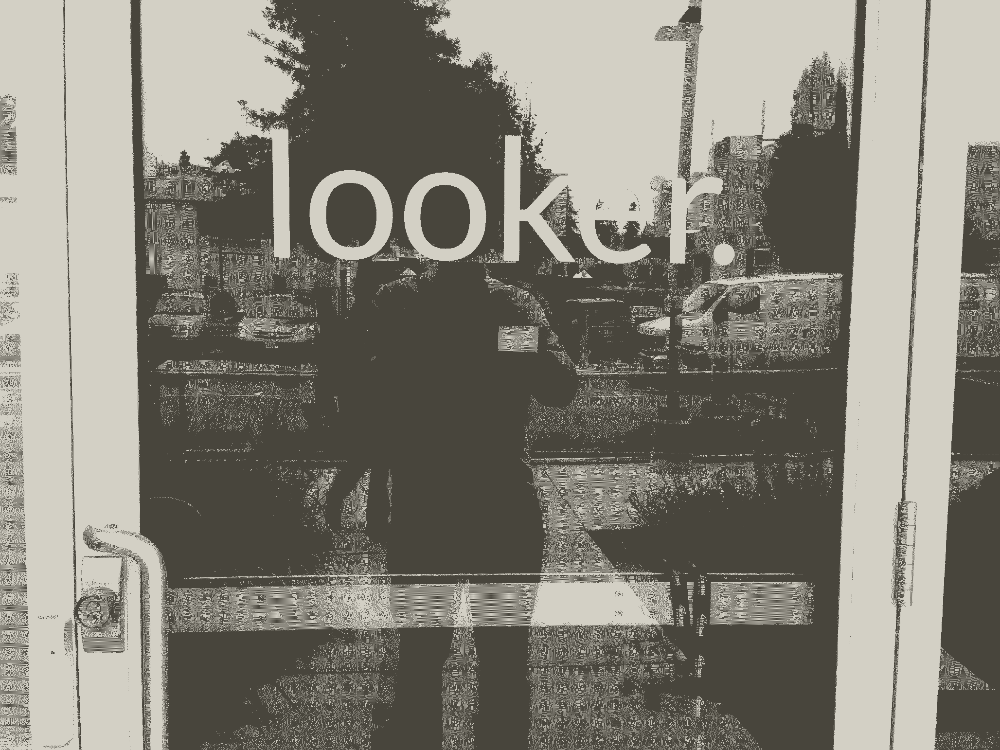

# 这家初创公司如何将一封 216 字的推介电子邮件变成 26 亿美元收购的内幕

> 原文：<https://review.firstround.com/the-inside-story-of-how-this-startup-turned-a-216-word-pitch-email-into-a-2-6-billion-acquisition>

## 介绍

2011 年 8 月， **[劳埃德·塔布](https://www.linkedin.com/in/lloydtabb/ "null")** 开始为最终成为 **[Looker](https://looker.com/ "null")** 编写前几行代码。几个月后，他的联合创始人本·波特菲尔德加入进来，帮助打造这款产品。通过尝试不同的交付模式和培养一个小而强大的早期客户粉丝群，他们能够自举，直到 2012 年夏天他们筹集到种子资金，这是由第一轮的 **[比尔·特伦查德](https://firstround.com/person/bill-trenchard/#mystory "null")** 共同领导的。在接下来的几个月里，一些关键的早期雇员加入了进来，而 Looker [在 2013 年 3 月悄然出现。几个月后，](https://techcrunch.com/2013/03/06/looker-takes-2m-from-first-round-and-pivotnorth-to-build-a-sequel-to-sql-for-business-intelligence/?_ga=2.183224486.1207393954.1559761513-1479926336.1559325613 "null")**[弗兰克·比恩](https://www.linkedin.com/in/frankbien/ "null")** 出任总裁，在首轮融资中与塔布并肩奋战在融资前线后，他接任首席执行官，负责加强销售活动，扩大业务规模。

在这些早期标记之前，快进到 2019 年 6 月，[谷歌云宣布有意收购数据分析初创公司](https://techcrunch.com/2019/06/06/google-to-acquire-analytics-startup-looker-for-2-6-billion/ "null")，达成了一笔 26 亿美元的交易，这是一笔载入史册的交易。在 7 年多一点的时间里，Looker 从一个单一客户发展到 1700 多家，从圣克鲁斯的一个小团队发展到一个拥有 700 名员工、遍布全球 8 个办事处的公司。

但是在那些开始和获得成功的书之间，有许多书没有被阅读。拂去封面上的灰尘，你会发现无数的故事，讲述了创始团队努力解决的所有棘手问题，他们艰难得出的教训，以及他们做出的正确决定。其中一些故事成为了初创企业的传说，但大多数已经湮没在历史中。

这是因为很难在创业的过程中讲述创业的故事。在早期的浓雾中，你不知道哪些赌注会有回报，哪些举措会成为拐点——你肯定没有时间停下来把这些都写下来。

但当谈到编织这个特殊的创业故事时，我们有比平时更多的故事可以利用。在第一轮，我们作为他们的第一批投资者，坐在了 Looker's rocketship 的前排座位上——幸运的是，[我们一路上做了一些笔记](https://twitter.com/btrenchard/status/1136667161915772928?s=20 "null")。(The Looker 团队也在这里留出了一些时间进行反思，从分享[发现工程超级英雄](https://firstround.com/review/how-to-spot-and-magnify-the-powers-of-your-engineering-superheroes/ "null")和[钉钉分析](https://firstround.com/review/your-data-is-your-lifeblood-set-up-the-analytics-it-deserves/ "null")的策略，到为[超越虚荣指标](https://firstround.com/review/im-sorry-but-those-are-vanity-metrics/ "null")和[招聘高管](https://firstround.com/review/the-three-secrets-to-executive-recruiting-i-learned-at-apple-yahoo-and-more/ "null")提供技巧。)

在过去的一个月里，我们与塔布、波特菲尔德、比恩和特伦查德坐在一起，梳理他们的观点，反思 Looker 的发展轨迹。**在这次独家采访(和史诗般的历史)**中，这群人聚在一起补充细节，挖掘隐藏在 Looker 创始故事中的真知灼见。

他们分别以**创始 CTO** 、**工程负责人**、**首席执行官**和**第一投资人**的独特视角，从各个角度解读 Looker 的成功秘诀，分享他们对 Looker 成功的原因、业务是如何建立的以及其他初创公司可以从早期学到什么的深入了解。

这个团队涵盖了创业机器的所有基本要素:找到创意，在市场中脱颖而出，尝试不同的模式，扩大销售，确保客户成功，当然，还有组建一个成功的团队。从管理公司文化和有意筛选早期雇员的角度，到传达产品价值和击败每个预订计划的策略，早期团队将在这份关于 Looker 如何建立的详细说明中找到大量智慧。

这是一个很长的故事，但我们希望这是一个值得阅读的故事。我们开始吧。

# 想法:从一个清晰的论题开始，不要提得太早

当谈到提取 Looker 成功的精髓时，塔布、波特菲尔德、比恩和特伦查德都很快指出相同的要点:强有力的想法和卓越的执行是关键。

根据塔布的说法，最初论文的力量是他酝酿创业想法相当长一段时间的副产品。“我等了很久才开始 Looker。回过头来看，我认为我们取得了很大的成功，因为我一直等到我对问题所在有了清晰的论述，然后我们就直接着手解决，”塔布说。

“我看到很多创始人在创办公司时会说，‘这个领域有机会，我会找到的。’或者，我认识一些刚走出校门的孩子，他们宣布自己“要去创业了”。这最终可能会成功，但这很难做到，因为没有明确的路径。对于 Looker，我可能不确定我将如何实现它，但我从一开始就清楚自己的使命是什么:打造一款产品，让组织中的每个人都能通过数据看到正在发生的一切。"

未来的创业者们，从你将要解决的问题着手，提出一个真正强有力的论点。如果你错过了第一个至关重要的因素，最好是让你的公司在低火上构建梦想，同时努力找出一个。

# 从一个深刻的个人问题出发，召集创始成员。

这个论点植根于塔布以前的经历。“几年来，我看到了对 Looker 这样的产品的需求，并不断回归这个想法。在多家公司担任创始角色后，我知道企业需要实时了解他们的数据。我一直在构建这些一次性的定制工具，以帮助其他人查看非常狭窄、特定的数据集，我意识到必须有一种更好的方式来做到这一点，”他说。

由于第一轮合作伙伴比尔特伦查德与塔布的关系可以追溯到 2004 年，他能够证实这个故事。“我在 LiveOps 时受益于 Lloyd 的数据处理方法，当时我是首席执行官，他是首席技术官，当我们在 [ReadyForce](https://www.crunchbase.com/organization/readyforce#section-overview "null") 合作时也是如此。**特伦查德说:“如果你一遍又一遍地做同样的东西，这是一个信号，表明你可能有了创业想法。“但劳埃德特别擅长处理这个想法。现在我是一名投资人，我发现最好的创始人会深入一个问题，理解它的所有细微差别，并真正沉浸在客户的痛点中。这就是劳埃德。真正深刻地理解人们和他们的问题是至关重要的——这也是为什么劳埃德经常喜欢说“[伟大的软件是移情的表现](http://lloydtabb.com/great-software-is-an-act-of-empathy "null")”"**

Tabb 的联合创始人本·波特菲尔德对 Looker 的早期想法也有类似的亲身经历。“我通过我的朋友索尔·李普曼认识了劳埃德。劳埃德试图在 ReadyForce 找到人帮忙，我加入了。波特菲尔德说:“接下来的两年里，我们一起开车从圣克鲁斯来到门洛帕克，所以我对他非常了解。“ReadyForce 所有部门的人都在使用 Lloyd 开发的工具来帮助理解员工数据，所以当我们都离开公司去尝试一些创业概念时，我知道他的想法是有道理的。我们确信我们从一开始就合适——我们知道工程师会发现这个工具很有价值，因为劳埃德已经证明了这一点。”

在同意合作后，这对搭档花了 15 美元买下了 Llooker.com——Tabb 说，这是 Jim Everingham 的一个有趣的拼错域名的主意——并开始创造一个 MVP。泰伯专注于构建语言引擎和推动早期销售，而波特菲尔德则致力于平台和底层技术。

“作为联合创始人，本是我的最佳选择，”塔布说。“他是一名出色的工程师，而且他很有气质。我见过的最好的英国副总裁都镇定自若，而本绝对有这种特质。他也知道当前的技术堆栈——那时我 40 多岁，他 20 多岁，所以他更熟悉我们需要使用的所有现代工具。有了这些，我们就能够构建一个非常简单的【*版本的 Looker，并开始迭代。”*

Looker co-founders Ben Porterfield and Lloyd Tabb

正是这种新生产品首次向公司现任 Looker 首席执行官弗兰克·比恩(Frank Bien)出售。“劳埃德和我都住在圣克鲁斯。我记得 2011 年末在一家名为[神韵](https://www.vervecoffee.com/pages/story "null")的小咖啡店见过他。比恩说:“现在的连锁店更大了，但那只是第一家。“我知道他发现了一些东西，可以让我们在*中获得的所有数据变得有用*。我最终加入了另一家公司，这家公司最终被 VMWare 收购，但我仍然保持联系，每隔几个月就和劳埃德见面。我想在他们的建设中扮演一个角色。”

与比恩等球员的持续对话在早期给了 Looker 团队至关重要的共鸣板。这个羽翼未丰的团队知道他们的成功取决于他们在自己的弱点上利用建议的能力。

“马克·伦道夫在早期对我们来说很重要。塔布说:“他兼职是为了承担更多机械的业务任务，但他也是我的顾问，帮助我思考所有棘手的问题。“在旧金山进行了一天的销售拜访后，我经常在回家的路上给 Marc 打电话，回顾他们的进展，详细讨论每次会议中哪些可行，哪些不可行。我们就定价和走向市场战略进行了很多讨论。有时候我真的很犹豫不决，马克会帮我做出决定。”

对波特菲尔德来说，吉姆·埃弗灵厄姆扮演了顾问的角色。“我以前当过工程经理，但这是我第一次领导这个组织。Lloyd 总是说 Jim 是他合作过的最好的工程领导者，所以能够依靠他是不可思议的。波特菲尔德说:“我会定期与吉姆会面，他就如何思考技术问题和组织团队给了我重要的指导。

# 不要过早筹集种子资金。

有了一个强有力的想法，许多创始人的第一个冲动是开始筹集资金。但塔布发现，这有助于自我维持，并推迟最初触及投资者圈子的时间。

塔布说:“在融资方面，我给早期创始人的最大建议是**不要试图过早融资**。“我看到很多创业者试图用幻灯片上的一个想法来筹集资金。我们等了将近一年来筹集资金，直到我们知道这是一项风险业务——并不是每个初创公司都是这样，你不想被套牢。我们与客户和收入一起前进。虽然还没有完全确定下来，但是我们已经对走向市场的工作方式有了足够的了解，知道它是可行的。这让我们在 2012 年夏天的种子培育变得更加容易。**如果你创造价值，那么筹资过程将从你如何擅长推销自己，发展到你可以简单地说‘问问使用我们的人对这件事的看法’。**’”

如果你不能证明价值，你是在要求投资者相信它。你要求他们接受你是谁，而不是他们面前的证据。

作为接受这种筹资策略的投资者，特伦查德认为这是有效的。“当我们决定是否投资他们的种子期时，劳埃德给我发了一份 10 个客户推荐人的名单——其中许多都是第一轮支持的公司。我在勤奋期间与每一个人交谈，我被感动了。特伦查德说:“他们对产品的喜爱是前所未有的，如果没有它，他们会非常失望。

Bill Trenchard’s 2012 email to the First Round team on why he decided to invest in Looker.

# 市场:在人群中脱颖而出，加倍下注，展示你的与众不同

塔布早期推介的另一个关键因素是他发给特伦查德的一封电子邮件，其中概述了 Looker 希望利用的更广泛的行业趋势。

“现在回头看看这封推介邮件，这 216 个字概括了我们努力做的每一件事，以及我们做对的所有事情，”塔布说。

The pitch email Lloyd Tabb sent to Bill Trenchard and Marc Randolph during Looker’s seed raise in 2012.

在这里，塔布和波特菲尔德联手剖析了邮件中概述的一些具体赌注和趋势:

**押宝 SQL** 。“当 [NoSQL](https://en.wikipedia.org/wiki/NoSQL "null") 看起来像匹获胜的马时，我们选择了 SQL，”塔布说。波特菲尔德将这个赌注建立在 2011 年的背景下:“我们认为 SQL 将成为分析的通用语言，这在当时并不完全明显。Hadoop 正处于其宣传的巅峰，分析有可能朝着这个方向发展。我们本可以投入大量精力支持 Hadoop 来对冲我们的赌注，但这将是一个错误。”

学习一门新语言。“我创建了 LookML 作为我们平台的基础。这是一个抽象层，是 SQL 的续篇。我的想法是，如果我们能够简化 SQL 的问题，并发展数据语言，它将更容易使用，”塔布说。但指望数据分析师学习一门新语言绝不是万无一失的举措。“这是一个可怕的，”波特菲尔德说。“我记得那些早期的存在主义问题:‘分析师能学会这种语言吗？他们会希望 T9 这么做吗？现在回想起来，似乎更明显的是，开发者风格的工具和工作流将被接受。这些天来，有很多[讨论](https://twitter.com/levie/status/1138227037322113029 "null")任何时候你可以提供增加某人杠杆的工具，他们就会采用它们。但那时候还不清楚。"

**缩放数据库**。“我们打赌数据库最终将会无限扩展，并会走向云端。波特菲尔德说:“这在现在看来是显而易见的，但在当时，红移和大查询才刚刚起步。”。“这种转变对 Looker 来说是巨大的，坦率地说，当它第一次发生时有点令人惊讶——你可以突然在云端的快速数据库中处理大量数据，而且相对便宜。”

**降低数据延迟:**“报告和运营分析的区别在于延迟，即数据的新鲜度，”塔布说。“大多数数据分析工具都是高延迟工具:它们将数据提取到其他东西中，这意味着这种移动需要时间，所以您看到的是昨天发生的事情。假设您正在查看昨天未发货的商品列表。旧数据没有帮助。你真的需要知道他们*是否还*没有发货，这样你就可以*做点什么*了。在许多情况下，延迟会使数据变得无用。公司也是一样。他们需要了解当前正在发生的所有事情，研究这些事情发生的原因，然后做出决策。”

这最后一点对 Tabb 来说尤其重要。“在网络世界里，你看不到身体上发生了什么。塔布说:“我一直认为[建立一家基于技术的初创公司有点像飞行](https://firstround.com/review/Flying-Lessons/ "null"):有 [VFR](https://en.wikipedia.org/wiki/Visual_flight_rules "null") ，那里的条件很清楚，你可以看到跑道，还有 [IFR](https://en.wikipedia.org/wiki/Instrument_flight_rules "null") ，那里能见度很低，所以你必须依靠你的仪器。

“所有的科技企业都是 IFR。你看不到你的顾客。但 2011 年的问题是，大多数公司没有仪器。所以他们试图飞起来，但是他们看不太清楚。我们的赌注是，如果我们能给他们带来工具，他们的生意就会腾飞。几个早期的顾客变成了独角兽。我显然有点偏见，但我认为部分原因是因为他们很好地处理了他们的数据。他们会飞。”

当你在暴风雨中驾驶飞机时，你必须依靠仪器，而不是眼睛。初创公司也是如此——如果你能开发出一种工具来帮助公司“观察”，你就成功了。

# 不要回避拥挤的市场，即使很难传达差异化的信息。

虽然商业智能领域有几个成熟的参与者，但 Looker 团队发现[看似拥挤的市场可以反直觉地成为一个伟大的狩猎场](https://firstround.com/review/future-founders-heres-how-to-spot-and-build-in-nonobvious-markets/ "null")。

“拥挤市场的好处是，你知道对产品有需求，顾客愿意付钱。特伦查德说:“当然，不利的一面是，你需要敏锐的洞察力来切入。“当我在 2012 年收到他们的推介电子邮件时，Looker 产品仍处于非常早期的阶段，但很明显，这个赌注是坚实的，不同的，足以坚持到底。”

Looker's first office space.

这正是塔布想要表达的意思。“过去是，现在仍然是一个拥挤的市场，相似的产品采用不同的方法。是的，市场上有一堆访问数据的产品。他们听起来都一样。但没有任何东西能做到我们试图做的事情，”他说。

波特菲尔德表示同意。“我们并不害怕市场有多拥挤，因为我们意识到我们实际上并没有遇到太多困难。我们试图向许多早期风险投资支持的科技公司出售产品，但他们没有现成的解决方案——当他们需要询问有关数据的问题时，他们依赖开发人员编写 SQL。这给了我们很大的优势，”波特菲尔德说。“它几乎允许我们致力于最能实现我们的世界版本(劳埃德曾称之为我们的宗教)的工作，这意味着我们花了更多时间来支持分析师，并专注于我们想要构建的功能。”

尽管如此，在早期，沟通是什么让外表与众不同是非常困难的。“问题的一部分是，最终的输出似乎与表面上的其他工具(仪表板和报告)相似，所以如果不太专业，很难描述为什么它是一个更好的解决方案。你必须经历它，”波特菲尔德说。

泰伯同意。“可能太多年了，我们没有一个[的定位声明](https://firstround.com/review/Positioning-Your-Startup-is-Vital-Heres-How-to-Do-It-Right/ "null")。我记得在我们筹集了 B 轮融资后，一位投资者对我说‘哇，这是我见过的第一家没有投资就走到这一步的公司。’”塔布笑着说。

但这并不是因为缺乏尝试。“我们知道我们在架构上非常不同，但你看网站看不出这一点。塔布说:“虽然我们在销售会议中使用‘商业智能’这样的术语，因为这是我们受邀参加聚会的方式，但这不是我们描述我们正在做的事情的方式。”。“这就像是向某人描述早期版本的谷歌‘你在这个框里输入单词，然后一个列表就出现了，你可以点击它。’技术上是正确的，但是表面之下有更多的东西。"

这一信息挑战导致 Looker 维持了一个相当简朴的数字存在。“直到我们的首轮融资，也就是我们开展业务和创造客户整整一年半之后，Looker 的网站只有七行文字——这是一个笑话，”塔布说。“这是对‘looker’一词的模拟定义，还有一个播放按钮图标，可以播放某人发音的音频。我们也为我们的第一条推文做了类似的事情[。现在想想我们是如何实现正现金流的，这让我觉得很好笑，这就是我们传达的信息的样子。”](https://twitter.com/LookerData/status/297010776462462976?s=20 "null")

A screenshot of Looker’s first homepage (back when it was still Llooker).

不过，这是有意的选择。“我们不认为任何人会出现在网络上并找到我们，尽管后来证明渠道确实非常重要。我们认为所有的网站看起来都一样，”塔布说。因此，我们没有以营销为主导，而是试图建立一个粉丝群——要么你从未听说过 Looker，要么你是一个超级粉丝，你会参与其中。

# 销售和 GTM:锁定一个型号并扩展机器

由于描述产品价值的挑战，塔布和波特菲尔德加倍努力找出如何*交付它。*

“最令人紧张的是，我们不清楚*将如何处理这个产品。开源 it？建立一个服务公司？”波特菲尔德说。塔布同意。“我们不知道什么是正确的交付机制，”他说。“我们本来可以提供大量定制服务，这几乎就像是咨询，你深深地融入了你的客户。或者我们可以走产品路线，我们只销售工具，一切都在客户手中。**所以我们决定不决定**。*

对塔布来说，这种*缺乏决策*是至关重要的。“作为创始人，我们经常觉得我们必须知道所有事情的答案，不可知的东西是不可接受的，”他说。"**当你不知道某件事的时候，克制住冲动，勇往直前，等着看什么行得通。**正如我之前分享的那样，[我们没有做出的决定往往会彻底改变我们的业务](https://looker.com/blog/the-three-decisions-we-didnt-make-that-totally-changed-our-business "null")。

传统观点认为你需要尽早锁定一个商业模式，但我们发现事实并非如此。事实上，不做决定可能是你做过的最好的决定。

由于前面有空地，早期的 Looker 团队对每个新顾客都测试了不同的方法。以下是 Tabb 对他们如何探索这些不同模型的想法:

**咨询:**“lift opia 是早期客户，他们的团队中没有数据人员。我们将最初的约定视为咨询合同。当他们需要什么的时候，他们会打电话。Tabb 说:“我们是作为一个雇佣数据团队来运营的。“我们还做了其他咨询工作，帮助客户将他们的数据从 MongoDB 数据库转移到一个分析数据库，虽然这很有效，但远没有那么好。”

**独立产品:**“另一个早期客户，他非常熟悉数据库市场和工具，所以他是一个很好的人，可以把软件交给他，让他自己尝试，”塔布说。“这种方法效果很好，实际上他们现在仍然是客户，但是我们发现这种自助式方法让他错过了很多我们从其他客户那里获得的价值。”

**组合**。“我们的另一个早期客户是[简单雇佣的](https://info.looker.com/customer-stories/case-study-simply-hired "null")。我们一开始尝试与他们进行咨询，因为这个产品太早了，还没有成熟到可以让任何人使用的程度。所以我不得不走进去，把它和他们的数据连接起来，坐在他们旁边，教他们的工程师如何用 LookML 编程，”塔布说。“最终他们上线运行了，随着我们添加其他功能，他们能够自己使用该产品。”

# (演示)n 额定值。

“不管交付机制如何，我最初的推销总是回到这个概念:‘问我的一个现有客户，他们都会说这改变了生活。然后让我向你展示一些你不知道的关于你自己的数据的东西来展示价值，”塔布说。

我们知道成功的唯一途径就是展示商品。你知道那句谚语吗，“只有帽子，没有牛”？我们必须有牛。

这种洞察力最终让 Looker 对经典的 SaaS 模式做了一点小小的调整:**免费试用，但将繁重的售前实施工作与在演示中使用客户实际数据的关键策略结合起来。**

“我们以为我们在产品和服务之间做出决定，但没有决定解锁第三种方式:作为产品销售*和*在免费试用期间预先部署，所以感觉像是定制服务，”塔布说。“在销售产品时，我们将演示作为构建概念验证的机会，因此我们没有虚假的推销版本，我们总是要求潜在客户提供实际的数据集来玩。然后，如果我们可以让我们的潜在客户在免费试用中尽可能多地使用该产品，我们就可以在以后轻松地要求付款。”

这也为早期的产品策略提供了信息。“我们很早就在产品中内置了监控工具，以确保我们能够判断他们是否在使用它。Tabb 说:“我只会在我们看到产品开始在组织中流行起来的时候才试图完成交易，在使用势头明显之前，我永远不会开口要钱。”。“这种方法的缺点是一些试验运行了很长时间。如果我们看不到这种势头，我会回去亲自动手，确保他们了解我们如何回答他们所有的数据问题。”

您需要加倍努力才能在售前快速展示价值。如果你能在早期证明自己的价值，那么这笔钱以后总会出现在你的银行账户上。

# 即使你是首席执行官，也要让自己变得更快。

在 Looker 旅程的这一点上，在种子和首轮融资之间，Tabb 指出他非常依赖董事会。“我们的董事会与我们在所有‘下一步是什么？’上携手合作想着我们需要做的。“早期的一个主要焦点是销售，”他说。我们有合适的产品/市场，我们有大约 20 个客户，一切都在运转——但我们需要考虑下一阶段。"

作为 Looker 董事会的一员，从种子期到收购期，特伦查德生动地回忆起了这些对话。“我记得在种子期的一次董事会会议上，马克·伦道夫、[蒂姆·康纳斯](https://twitter.com/timc?lang=en "null")和我与劳埃德谈论销售，”特伦查德说。“我在白板上画出了整个销售机器流程，包括构建漏斗、确认销售线索、组建销售团队。劳埃德沉默了一会儿，然后说，'**我不知道该怎么做，我也不想弄清楚。我需要替换我自己。“我们需要一位出色的首席执行官，我将去寻找那个人。”在那次会面后的几周内，劳埃德已经把我介绍给了弗兰克·比恩。"**

塔布愿意放弃他的角色给特伦查德留下了深刻的印象。“很少有创始人愿意在首轮融资中放下首席执行官的缰绳。能够看到自己的弱点、认识到某些事情的重要性并如此迅速地做出改变的能力真的很少见。“劳埃德做出了一个非常理性的决定，它改变了公司的整个轨迹，”特伦查德说。

“当时，这是一个朝着真正有趣的方向发展的伟大产品，但当弗兰克加入后，他们开启了一个完全不同的增长矢量。劳合社非常专注于这个行业也是独一无二的，”特伦查德说。“我见过一些初创公司在不再担任首席执行官后，很难让创始人参与进来，但劳埃德在首席技术官的职位上表现出色。他和本建立了一个非常棒的团队，继续推动产品的发展，这让他们保持了优势。”

Bill Trenchard’s company update notes for other First Round partners on Looker in 2013

以下是塔布的说法:

“当董事会告诉我是时候雇佣一个销售团队的时候，我知道我已经力不从心了。我立刻想到了弗兰克。在咖啡店的第一次见面后，我们一直在谈论生意，我知道他有兴趣加入 Looker，但我花了很长时间做决定，并花了几个小时与马克·伦道夫谈论让他加入的事情。这不是奉子成婚。**说实话，放弃首席执行官的帽子很难——坦率地说，起初我让弗兰克担任总裁，因为我对摘下这个帽子感到紧张**，”塔布说。

但他们筹集 A 轮资金的过程让塔布相信，比恩已经赢得了首席执行官的头衔。“我们在 2012 年的种子基金中筹集了 200 万美元，而我相当吝啬——一年后，也就是 2013 年夏天，当弗兰克加入总裁行列时，我只花掉了我们筹集的 40 万美元。我记得我以为我们有四年的 t 台，”塔布笑着说。“然后弗兰克进来，开始雇用所有这些销售人员和出色的领导。我记得就在几个月后，我和他坐在会议室里，他告诉我，我们必须筹集资金，因为我们将在 12 月份离开，这对我来说是一个‘糟糕’的时刻。”

他们最初的计划是采用在种子期行之有效的方法。“我们去见了另一位我们认识的投资者。他们想投资——但以上一轮的估值。所以我们去了第一轮办公室征求比尔的意见。塔布说:“他以如此直接和准确的方式指导我们。

下面是特伦查德告诉塔布和比恩的剧本:“比尔告诉我们一周内去见六个合伙人——因为我们不想被超过。在我们向投资者解释了这笔交易后，如果他们感兴趣，他们会在下周带我们去参加合伙人会议，”塔布说。“所以弗兰克和我穿上漂亮的衬衫，开车在沙丘路来回兜风。我们见了七家公司，接下来的一周我们开了六次合伙人会议，最终我们选择了红点公司的托马斯·东古兹。

这么多年过去了，特伦查德反思了他在 2013 年给出的这条建议:“T2，我们开始用 Pitch Assist 为我们的公司收集融资智慧，因为我们发现许多创始人对他们需要如何改变首轮融资战略感到措手不及，”他说。**筹款建议的变化基于几个因素。你不能总是借用别人的剧本或复制粘贴上一轮有效的方法。**在其首轮融资中，Looker 在一个大市场中拥有强大的证据，我们帮助他们推出的这一策略是当时他们的最佳选择。弗兰克和劳埃德完成了处决。”

Lloyd Tabb and Frank Bien, together in 2019.

在一起战斗在筹款战壕后，塔布意识到比恩应该得到首席执行官的头衔。“现在回想起来，**我坚信 Looker 之所以能取得现在的成就，是因为我们引入了专业管理**，”塔布说。“很明显，弗兰克是一个非常正直的人，他了解企业软件——他知道如何在这个领域执行。因此，虽然我感觉自己放弃首席执行官的角色、让我们走企业化道路是在冒险，但我提醒自己**创业都是关于风险的——他比我更适合**。”

作为一个重复的创始人，我经常喜欢说我是一个人的乐队。我玩过所有的乐器，几乎能做所有的创业工作。但这并不意味着我都做得很好。保留你最擅长的乐器，把其他的扔掉。

从 Bien 的角度来看，他到来的早期时间消除了他看到的其他创业公司在向专业管理过渡时遇到的障碍。“我见过职业首席执行官被引入来取代创始人，但总是在四五年后，这创造了一种非常不同的动态。比恩说:“在 Looker，我不是创始人——我非常重视创始人的称号——但我确实加入了大约 10 或 12 名员工，收入很少，这很不寻常。

“这么早就加入让事情变得简单多了。它非常平静和自然。如果你在创业公司的后期进行替换，那么通常整个管理团队都会被淘汰。即使创始人留任，这也可能是一种奇怪的动态。它会变得丑陋和消极。但因为我们在 Looker 这么早就进行了转型，所以我们避免了这一切。”

# 致力于一个模型——从里到外学习它。

现在，作为首席执行官，Bien 的任务是找出如何扩大 Tabb 的早期销售方法。他必须将这家斗志昂扬、前途无量的初创公司转变为一家模型驱动的公司。

“当我在 2013 年年中走进 Looker 时，有很多早期的吸引力，”比恩说。“劳埃德已经通过另一名早期员工[基南·赖斯](https://www.linkedin.com/in/keenanrice/ "null")赢得了坚实的客户基础，但仍有许多未知因素。我们应该每月卖 500 美元还是 5000 美元？一切都悬而未决——没有电子表格或幻灯片，”比恩笑着说。“在我看来，这类似于 Marketo 的模式，这意味着它不会只是每月几百美元。我们需要每位客户每年花费大约 25，000 美元。”

Bien 知道，为了说服潜在客户签署如此大规模的交易，Looker 需要一个销售团队。“劳埃德早期的销售直觉是正确的，你必须做一个强有力的概念证明。这让我想起了 [Palantir 的前沿部署工程师](https://medium.com/palantir/dev-versus-delta-demystifying-engineering-roles-at-palantir-ad44c2a6e87 "null")。我们想做一个内部销售活动。Bien 说:“这些销售人员必须得到嵌入式技术人员的支持。

“对于数据领域的大多数公司来说，售前人员就像水管工，他们只是把东西连接在一起。我们试图在 Looker 采取不同的方法，询问潜在客户数据集，然后让经济学或数学专业的学生工作。在早期，他们身兼所有职务:售前、售后和客户支持。最终，随着我们规模的扩大，这些角色变成了独立的角色，”比恩说。

在演示中，不要只是向客户展示他们正在寻找的答案。也告诉他们应该问什么，他们甚至不知道什么。

这种方法当然不是低升力的。Looker 团队不得不打消投资者和顾问的顾虑，他们担心这种销售活动不具有可扩展性。“每个风投都告诉我们不要这样做，”比恩笑着说。“他们确信它永远不会扩展。”

特伦查德在那个集中营里。“我承认当时我认为这是一个有点奇怪的方法，因为我专注于帮助他们扩大业务，但我知道他们会想出办法的，”他说。

但是比恩很自信，因为他已经计算过了。“经过对数据的分析，我们发现，当我们拥有 2，000 名客户时，我们可以在 ARR 中实现 1 亿美元的收入，并且正在走向上市。这是从 2013 年开始的模式。顺便说一句，我们做得非常好——我们现在有 1，700 个客户，所以我们实际上比我们预测的要好一点，”Bien 说。

但是你必须对你的模型了如指掌，才能下这样的赌注。我们知道投入售前支持的成本利润是合理的。但是，如果我们不确定是需要 2000 个客户还是 100000 个客户才能达到 1 亿美元的运行率，那将是一个非常冒险的举动——我们很容易就会把我们的风险投资资金付之一炬。”

如果你对自己的模式有信心，你就不必担心你是否能支撑你投入销售的所有资源——你可以自己算一算，找出答案。

数字敲定后，比恩开始组建早期销售团队来执行。“根据我们的目标客户，我们知道我们可以利用第一轮社区的优势，与所有这些基于数据扰乱其行业的潜在客户建立联系，如 thredUP 和 HotelTonight，”Bien 说。

除了这个客户群，他还认为企业游戏也有长远意义。“我立即雇用了四名销售代表，两名外部销售和两名内部销售作为实验。我们将在 SDR 生成的管道中构建一个事务性的管道。他说:“这个飞轮将使我们能够完成 20-30，000 美元的交易，同时还能带来一些可以满足这些企业代表的潜在客户。”“销售团队不会组织他们自己的会议，而是由营销团队来组织。”

# 将模型转化为计划——并战胜它。

有了这个剧本，Looker 团队设定了他们的目标——七年来，他们从未错过一个预订计划，实现了罕见的连续 28 个季度的纯执行。以下是 Looker 规划策略的基本思路:

“人们经常创建模型来推动估值，他们总是试图做两倍于计划的事情。**在我看来，这是你能做出的最危险的、扼杀公司的举动。**我们从未根据任何外部投资者的影响或我们试图在即将到来的一轮融资中实现的估值来调整我们的计划。比恩说:“当然，我们确实时不时地踩下油门，但这只是在我们看到这个行业的机会时。“例如，当我们第一次尝试向企业扩展时，我们是在试水。一旦它开始工作，我们就在企业走向市场的努力中投入更多，并提高了我们的目标。”

Bien 指出，在制定计划时，你希望增长最大化，但你也希望它仍然像一个胜利。“把计划数字设得更高很有诱惑力，并且认为如果你把兔子放在狗前面稍远一点，它会跑得更快，”他说。“但事情不是这样的。这只会让你感觉像在踩水，从长远来看，这实际上会让你慢下来。我们根据自己的模式设定了数字，我们雄心勃勃，但并不疯狂——最终我们更快地实现了目标。”

在设定季度目标时，不要偏离你的模型太远。在你能跑得更快的地方跑得更快，但是不要采取一种生硬的方式，让你的团队感觉他们快要淹死了。

这种销售和规划方法进一步增强了投资者的信心，这是特伦查德在第一轮投资中亲眼所见的。“弗兰克是正确的，他们建立了一个真正惊人的销售机器，并执行到几乎闻所未闻的程度，”特伦查德说。

# 客户成功:早期投资，以爱为中心

特伦查德还对 Looker 业务的另一个方面印象深刻:对客户的不懈关注。“如果非要挑选一件长相出众的事情，那就是这件了。他说:“很多人陷入了销售和营销机器，但 Looker 从未忘记顾客。“大多数创业公司在这方面的投入都不够。很多创始人来问我，‘我如何建立一个客户成功团队？’？我在考虑外包出去。我总是试图引导他们远离这些。这对业务来说太核心了，你需要抓住它。"

旁观者不只是坚持。“他们过度投资于客户成功，并且很早就让真正的数据科学专家加入支持团队。Tait Kirkham 是这里至关重要的早期雇员，他积累了大量的服务交付经验。但是整个公司真的参与进来了——劳埃德自己帮助运营客户服务聊天已经很多年了，他会在半夜起来回答问题。“这确实体现在病毒式的口碑增长中。”

泰伯和波特菲尔德分享了他们对 Looker 如何培养这种病毒式顾客喜爱的看法:

# 早期投资:

“我们狂热地关注对客户的早期投资。我毫不犹豫地在这里投入了大量的资源——如果你让客户成功，他们会永远使用你的产品。如果这种情况发生变化，他们将不再为此付费，”塔布说。“在 SaaS，**专注于让客户成功就是一切。你不能在那里偷工减料。这是一种保留策略，而不是成本中心。**

Tabb 说:“我们试图[颠覆典型支持团队的逻辑](https://www.linkedin.com/pulse/how-you-today-really-lloyd-tabb/ "null")，让支持和客户之间的关系不要过于事务化，而是更多地成为合作伙伴关系。”。“从一开始，如果客户正在构建数据模型并有问题，我们会立即介入并帮助他们完成工作。这就是为什么我们知道我们必须从提供纯粹的支持转向建立一个真正的社区。”

在提供服务的公司里，只有你的顾客成功了，你才算成功。就是这样。句号。

一位领导人在将这种支持生命的愿景付诸实践中发挥了特别重要的作用。“我们在 2012 年末雇佣了玛格丽特·罗萨斯。我是在 T2 tech raising(T3)志愿担任导师时认识她的，这是她领导的一个圣克鲁斯孵化器项目。和大多数早期雇员一样，她扮演了几个不同的角色。但是，当她发现她的电话管理支持，她完全改变了我们的世界。她在 Looker — [管理社区、文档并改善开发者体验，至今她仍是我们的客户之爱副总裁。没有她，我们就无法实现我们对客户爱和社区的愿景。”](https://looker.com/blog/women-of-data-margaret-rosas-looker "null")

Margaret Rosas, managing support in the early days of Looker.

从波特菲尔德的产品制造角度来看，这种早期对客户的关注也是一种有益的反馈循环。“Margaret [让我们关注客户的所有反馈](https://looker.com/blog/at-looker-the-love-is-baked-in "null")。每个工程师都在支持聊天上，我们会和使用该产品需要实时帮助的人实时交谈。我们还通过电子邮件将所有错误实时直接发送给所有工程人员。这种一致的信息流让我们能够调整，告知我们的路线图，并帮助我们快速取悦现有客户，”他说。

# 爱情旁观者爱:

“早期，玛格丽特习惯说‘当我们拥有 1000 名真正的粉丝时，我们就会成功。’“这是我们的驱动力——弄清楚如何在企业软件中建立一个粉丝群，”塔布说。如果你制造出顾客喜爱的产品，你的顾客也会爱你。这可能看起来很俗气，但它确实是关于爱——这是我们想要唤起顾客的情感。我们将客户成功称为我们的“客户关爱部”我们将“爱人如己”作为我们的价值观之一。我的早期客户告诉我，他们公司的生活现在被分为两个时代:“前旁观者”和“后旁观者”。这就是我们一直追求的反应，”他说。

**Tabb 最喜欢的早期客户成功案例之一，说明这一点来自****[hotel night](https://firstround.com/review/from-burning-millions-to-turning-profitable-in-seven-months-how-hoteltonight-did-it/ "null")**(另一家首轮融资公司):

“营销团队中的某个人正在研究他们的推荐计划，试图弄清楚它是否有效。在 Looker 中，他们能够建立一个二维网格，上面是用户推荐他人的次数，下面是用户预订的次数。所以在底部，你会看到很多已经预订和推荐的用户，然后在顶部，你会看到从未预订和推荐的用户，”塔布说。“有意思的是，**有相当一部分用户** ***从未预订，却频繁提及*** **，这没有太大意义**。但是在 Looker 中，每一个数字都进一步向下钻取。因此，通过点击用户数量，你可以很容易地调出他们的姓名和电子邮件地址。这位营销人员开始通过电子邮件发送这份名单，并问了这样一个问题:“你是谁，为什么你这么频繁地向人们推荐 HotelTonight？”以确保这不是一个骗局。但得到的回答都是‘我是空姐、出租车司机、酒保’。本质上，这些用户总是被问到这样的问题，“今晚我应该住在哪里？”因此，HotelTonight 意识到他们可以专门针对这一角色来大规模地推动推荐。营销人员能够在不与数据分析师交谈的情况下完成所有的研究。"

# 观看和讲述事件:

为了让这些故事浮出水面，并在销售过程中加以利用，Looker 转向了客户活动。塔布说:“这是帕姆·史密斯的创意，她在早期是我们的重要营销顾问。她告诉我，让我们的现有客户和我们的潜在客户一起参加一个“看一看，说一说”的活动，这样他们就可以在销售 Looker 时承担重任。"

A tweet from Looker on the success of an early Look & Tell event in 2013.

波特菲尔德清楚地记得这些事件。“与其他初创公司相比，我们很早就开始举办客户活动。他说:“我记得我汗流浃背，拖着几箱啤酒沿着市场街去参加我们举办的一个活动——我想我们大概有八个人参加，但我们坚持了下来，他们最终得到了回报。”。

对塔布来说，有趣的是这些早期事件也起到了社区建设的作用。“我没想到会这样，”他说。“我们的客户开始交流如何建立数据文化的技巧，并帮助他们公司的其他人使用 Looker——本质上是如何教每个人钓鱼。我听到的最好的策略之一是，我们的一个买家会在会议室的屏幕上调出 Looker，与运营和营销人员一起举办一次 AMA 午餐，邀请他们提出任何数据问题以获得答案。”

Lloyd Tabb at a recent Looker community event.

# 人员:组建团队和培养文化

最后——绝对不是最不重要的——是实现这一切的团队。

塔布说:“初创公司的创始人周围经常有这种崇拜，我认为这是一个巨大的问题，我只是讨厌它。”。“是的，我让飞轮运转起来了，但是我得到了*所以*很多帮助。当我[在评论](https://firstround.com/review/What-making-partner-means-at-a-startup/ "null")中写下把人当作伙伴的重要性时，我是真心实意的。如果没有我们聚集的人才，Looker 是不可能的。我请来了弗兰克和本，他们请来了以前共事过的了不起的人。幸运的是，我们的员工流动率非常低，所以 7 年后，最初团队的许多人仍在这里工作。”

我不相信创始人把这一切都背在背上。公司因为伟大的团队而成功。

为了深入挖掘 Looker 在人员和文化方面的正确之处，塔布、波特菲尔德和比恩在下面分享了他们对其他创始人的重要启示，包括早期和后期招聘、异地、学习和工作/生活平衡。

# 从多面手开始，但是尽早引入专家。

塔布有一个关于在早期创业中培养人才的理论:“有一面空白的墙，你用彩弹枪朝它射击，每个人都有不同的飞溅图案。在早期，你需要尽可能多地覆盖墙壁。因此，你需要的是多面手，他们可以覆盖广泛的领域，无论是还可以处理法律事务的产品人员，还是可以销售的工程师。塔布说:“本、内特·皮肯斯、基南·赖斯、玛格丽特·罗萨斯、[迈克·徐](https://www.linkedin.com/in/mike-xu-9baa2215/ "null")和我都是多面手。

然而，当比恩加入他们的首轮融资时，这种方式需要改变。“弗兰克上任后，他开始在各个领域雇佣有经验的领导者。他认识到，我们能够利用我们的影响力，比我们预期的更早地抓住优秀人才，”塔布说。

“这是我做的第一步，我绝对会再做一遍，”比恩说。“我不想处于这样一种境地:两年后我们需要重新引进一位销售副总裁，我想尽早锁定我们的领导者。许多早期创业公司通常不会这样做，原因有两个:第一，他们没有建立网络。劳埃德和我都在职业生涯中走得更远，有些人是我们在 21 世纪初合作过的，我们可以试图说服他们加入。第二，尽早引入高层人员违背了你保持控制和承担所有责任的本能。但正如劳埃德指出的那样，专业管理全面提升了我们的水平，”他说。

为了说服他的关系加入 Looker，Bien 首先询问他们是否愿意作为顾问过来。“我会说，‘我知道我们太小了，你不能正式过来，但你为什么不来帮我想想这个问题？’比恩说:“我通过这种方式得到了我们的首席财务官乔·莫兰和 CRO·T2·兰伯特的职位兰伯特曾在惠普和甲骨文管理过非常大的团队，在 21 世纪初，我们与一家软件公司有过重叠，所以我在最初的四次销售招聘中向他寻求帮助。有趣的是，他们都还在——如今 Looker 的顶级销售人员是第一个*销售人员，这太疯狂了。"*

The current Looker executive team.

# 随着规模的扩大，继续参与招聘。

许多创始人很早就停止了面试，转而寻找规模合适的招聘方式。但是 Bien 和 Tabb 对 Looker 采取了不同的策略。

“我们对团队成员非常谨慎。塔布说:“弗兰克和我采访了大约 400 人。“几年前，当我意识到我整天都在面试时，我们达到了一个临界点，但在那之前，真的是每个人——如果是在房子的技术方面，我会和他们交谈，如果是在业务方面，弗兰克会和他们交谈。我们在筛选混蛋。”

每个人都关心自己的事业，都想成功。但是那些以牺牲他人为代价的人是毒药。

以下是 Tabb 在面试中常用的问题:

他说:“我会让应聘者告诉我去年工作中发生的一些事情，这些事情让这一天变得真正美好。“在他们的回答中，我在寻找别人的关注点。它涉及团队胜利还是有人因个人胜利而表扬他们？”

"**我还会问应聘者他们曾为之工作过的最佳经理是谁。塔布说:“这有助于你了解对他们来说什么是重要的，他们看重什么。**

# 比你认为需要的更早地计划异地。

塔布回忆起 Looker 的第一次异地旅行:“2012 年 4 月或 5 月，我带着整个公司——包括我、本、我们的第一个工程师内特·皮肯斯和我正在实习的儿子以利亚——去夏威夷度假一周。塔布说:“我们称之为 Hackwaii。想法是我们都需要团结，他们需要学习用 LookML 编码，这是我建立的新语言。它们是短暂的日子。我们会从上午 10 点开始工作，一直工作到下午 3 点左右，剩下的时间用来远足和冲浪，但我们完成了很多工作——当我们试图赢得他们的客户时，Nate 和 Ben 制作了 HotelTonight 演示模型。"

The early Looker team at ‘Hackwaii’ in 2012.

根据波特菲尔德的说法，这些早期的越位是帮助球队凝聚的关键。**“以我的经验来看，创始人等了太久才这么做。人们很容易想，“我们只有四个人，为什么需要异地办公？”但是我们是结合了战略规划和团队凝聚力的黑客时代，这对文化建设和激励都很有帮助。他说:“随着我们的成长，我们继续这样做，让每个人都参与进来。**

# CEO 们，警惕深海潜水。

“早在我上大学的时候，我就非常喜欢罗伯特·格林立夫的观点，他开创了服务型领导的概念。如今，作为一名首席执行官，这一理念得以延续——我把自己视为一名管家，”比恩说。“我的角色是为他人消除障碍，为自己消除所有权。”

作为一个领导者，你必须知道什么时候深入解决一个问题，什么时候别管它。过度潜水害死公司。

“当开始计算模型时，我在海底。但举例来说，我本可以更多地参与到产品中，”比恩说。“我本可以坚持让他们立即构建某些对企业友好的功能，或者我们应该聘请一位拥有 20 年经验的工程领导者，但我非常信任 Ben 和 Lloyd，相信他们有能力做好这件事。”

# 培养一种中学文化，开辟销售摊位鼓励学习。

“在网景和 LiveOps 工作期间，我教过中学，还经营过一个电脑俱乐部，”塔布说。“[我在](http://www.thetwentyminutevc.com/lloydtabb/ "null")之前已经谈到过这个问题，但是这次经历增强了[创造一个非常安全的学习环境](https://www.linkedin.com/pulse/corporate-culture-did-you-love-middle-school-lloyd-tabb/?trk=hb_ntf_MEGAPHONE_ARTICLE_POST "null")的重要性，在这里你可以提出任何问题。如果 Looker 要成功，我们必须让全世界了解这种新的编程语言。我们必须成为教师，为了成为教师，你必须有一种文化，在这种文化中，每个人都感到安全地学习。[我们的长餐桌是学习的地方](https://en.wikipedia.org/wiki/Harkness_table "null")

The Looker “kitchen table."

对这种学习文化的关注是 Tabb 作为创始人的精神基石。"**文化就是你如何待人接物。它从顶部流出。塔布说:“作为创始人，他们会模仿你的每一个行为，所以做一个你想成为的人——说出你不想看到别人重复的行为。“我记得有一次在工厂外，一名工程师取笑其他人不知道一些事情。我把那个人拉到一边，说:‘你不能这么做。’从那以后，我看到那个人以同样的方式把其他人拉到一边。"**

如果你作为创始人的捷径行为，其他人也会这么做，所以千万不要这么做。

作为一名负责扩展的首席执行官，Bien 从不同的角度解释了为什么学习环境如此重要。“我考虑的是，当你快速成长时，它有什么用处。如果你要雇佣数百人，并且团队中三分之一的人都是新人，那么分享知识很快就变得至关重要。Bien 说:“世界上所有的教育、文档和培训都无法取代一个开放的环境，在这个环境中，人们可以自然地相互分享信息。

“我最喜欢的实际例子是我们的销售电话。在许多文化中，销售团队通常非常封闭。没有人想让其他人加入他们的销售电话，因为他们害怕会发生什么，害怕在观众面前推销失败。在 Looker，我们公布了本周所有的销售电话，公司的任何人都可以旁听。这也是一种很好的学习方式，因为你可以听到有人在做推介，并更多地了解我们的客户。”

# 为工作/生活平衡创造空间——还有自行车。

“我总是说美好的生活是一连串美好的日子。你所拥有的是你生活的日子，所以如果你在 Looker 工作，我不希望你推迟生活——我希望你*过*生活。如果你现在不打算活下去，那什么时候呢？这就需要平衡，这就是为什么‘腾出时间粉碎’一直是我们的价值观之一，”塔布说。

“就我个人而言，我发现我一天大约有八个小时很有创造力。**我认为如果你专注于重要的事情，你可以做大量的工作，但是人们混淆了努力工作和价值**。价值来自于留白。他说:“我是在骑上我的自行车(T7)的时候做到这一点的。“如果你陷入经营困境，没有机会反思，那么你就不会有战略眼光。如果你抽出时间，你会做得更好。”

Looker’s Santa Cruz office

# 其他创始人的最后反思和立足点:

收购往往给创始团队留下一种有点伤感的混合体，既要反思过去，又要展望下一章。“我非常兴奋能与谷歌合作。塔布说:“Looker 的使命是帮助人们更好地利用他们的数据，而谷歌的使命是帮助组织全世界的数据，这是一种天然的契合。”“世界上一些最聪明的工程师在谷歌工作，所以他们相信我们所做的事情可能是我能想到的最高形式的赞美。”

但是当他回顾 Looker 的旅程时，他想起了另一个故事，尽管是在创业世界之外:免费的个人纪录片。“他自由攀登埃尔卡皮坦峰，这是世界上最具挑战性的攀登之一。在不到四个小时的时间里，他完成了这个不可能的目标，几乎让它看起来很容易。但在此之前，他花了很多时间试图找出如何做到这一点。他用绳子爬了很多次，研究并策划每一个小心的动作，”塔布说。

这里有一个类似于早期创业公司的旅程:“**我们在 Looker 的轨迹可能看起来很容易，但 Frank、团队的其他成员和我在自由攀爬的每个动作背后都做了大量的准备工作和仔细思考。**人们经常问我，“scaling Looker 最难的部分是什么？”我总是说决定点。不是因为我们犯了巨大的错误——我们没有任何灾难性的时刻，我们没有跌倒。不是因为它们特别硬。那是因为他们是*恐怖分子。*我们下了很大的赌注，很容易就会掉下悬崖，”塔布说。

“找到那些安全的立足点非常具有挑战性——当你移动时，你不知道一旦你放下脚，你的脚是否会稳定。创始人需要在每一步都投入如此多的思考和考虑。人们很容易被锁定在一条特定的道路上，一条你无法爬出来的道路，无论是过早地筹集资金，过早地承诺一个模型，还是匆忙做出决定。你没有很多重来的机会，所以要小心行事。”

*照片由 Looker 提供。*