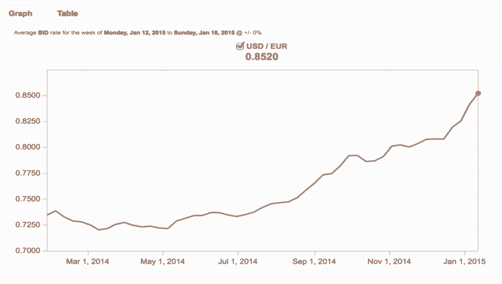

# SurveyMonkey 如何打入国际市场的内幕

> 原文：<https://review.firstround.com/the-inside-story-on-how-surveymonkey-cracked-the-international-market>

当**[Selina tobacco wala](https://www.linkedin.com/in/selinat "null")**加入 **[SurveyMonkey](http://www.surveymonkey.com "null")** 时，其 85%的业务都是用英语完成的。这是一家稳步向海外扩张的本土公司。五年多一点以后，他们支持 17 种不同的语言和 28 种货币。目前，国内市场占他们业务的 55%，但他们的目标是只占他们业务的 25%。

国际化对他们来说是一个巨大的战略目标——对于首席技术官 Tobaccowala 和她管理的技术组织来说，这充满了来之不易的教训。

许多早期创业公司可能会想，“现在谈论这个还为时过早。”但是他们错了。

“我能提供的最大建议是，如果你开始提前考虑这一点，你必须做出的投资是相当少的，”Tobaccowala 说。“另一方面，如果你必须在几年后改进你的应用程序，这可能会非常困难——在进入 SurveyMonkey 之前，我在这方面有 9 年的经验。这非常痛苦。”

不国际化的机会成本是显而易见的，但直到最近才变得明显(根据玛丽·米克尔 2014 年互联网趋势报告):

2013 年初，全球排名前 10 的互联网公司中有 9 家位于美国(想想谷歌、脸书等)。)，但他们 79%的用户是国际用户。

一年后，前 10 名中只有 **6 家在美国，而 **86%的**用户不在美国。**

移动领域的趋势更加惊人。**美国有 1.88 亿智能手机用户**但年增长率仅为 12%。

在国际上，有 16 亿智能手机用户，年增长率为 24%。

为了让美国公司建立并保持他们的领导地位，他们 ***有*** 来思考国际化。值得投入工程资源。“正如阿尔伯特·爱因斯坦所说，‘一个聪明的人解决一个问题。一个聪明的人会避开它。在这种情况下，明智的做法是避免延迟国际化的泥潭。

在 First Round 最近的 CTO 峰会上，Tobaccowala 借鉴了她在 SurveyMonkey 和之前的 Ticketmaster 的经验，分享了初创公司为实现强大的全球影响力应该采取的不明显的步骤。

# 设计和营销

“不管你是谁，也不管你有一个商务应用还是内容应用，你肯定会有网站试图向人们推销你的产品或公司。每个市场的网站都必须不同。”

日本的主页比专为美国用户设计的主页更明亮、更繁忙。

日本的主页总是充斥着密集的图片和内容。这与美国网站形成鲜明对比，美国网站通常设计简洁。审美的不同可以改变人们对你品牌的认知方式。

同样，SurveyMonkey 在美国招聘的卖点之一是员工喜欢在那里工作。当他们在俄罗斯测试这种语言时，它没有同样的共鸣。

“要创建一个灵活的营销网站，你必须考虑你正在使用的内容管理系统，”Tobaccowala 说。“你需要挑选一些能让你向不同市场展示不同内容的东西。这不仅仅是翻译，而是每个市场真正不同的内容。”考虑到需要做的工作，你不会想在游戏后期切换内容系统，即使你现在还没有全球化。

您还希望确保能够为您的站点锁定理想的领域分类法。在你工作的国家购买域名对好的 SEO 排名至关重要。例如， [SurveyMonkey.de](http://SurveyMonkey.de "null") 或【SurveyMonkey.co.uk】比任何时髦的替代品更容易被搜索到。**教训:**如果你认为有机会扩张到新的领域，一旦知道就要坚持自己的主张，否则回购域名会很昂贵。

然而，当涉及到您的核心应用程序时，关键的事情是了解人们在哪里跨境做类似的事情。在 Ticketmaster，Tobaccowala 发现人们搜索和浏览内容的方式在不同的市场是相当一致的。在 SurveyMonkey，他们能够证明人们创建调查和理解数据的方式几乎是相同的，无论他们身在何处。无论你在哪里看到这些相似之处，直接翻译都会对你有用，但是仍然有一些事情需要考虑。

要记住的一件大事是，英语是简短的。平均来说，每一种其他语言所花的时间是英语中同样内容的 1 . 5 倍。

这意味着你也需要召集你的设计团队。“与您的前端工程师合作，确定这样一个事实，即从一开始，您就需要在您的 UI 中留出平均 1 . 5 倍的空间，因为稍后构建它将是一个痛苦的过程。”一般来说——除了这些调整——您的核心应用程序在不同国家之间可以非常一致。

别忘了编码。如果你一开始就注意到这一点，那也很简单。但是如果你以后在你的整个应用程序中尝试这样做，特别是如果你像 SurveyMonkey 一样有一堆表单输入，它会变得很快。如果你只关注这几个在市场间变化的简单领域，你可以为自己省下一大笔设计和技术债务。

# 支付和定价

世界各地的支付和定价大相径庭。当你开始考虑转换率和国际转换渠道时，你必须做大量的定制工作。

“你知道吗，在荷兰，每个人都在口袋里放着一个小计算器。每次他们进行网上支付时，他们都将密码输入这个计算器，然后从银行获得一个唯一的安全密码，用于支付。[荷兰人这样做完全正常](https://www.about-payments.com/newsroom/news/online-payment-method-ideal-breaking-with-trend "null")，实际上这个星球上 60%的人每次进行网上交易时都会这样做，”tobacco wala**T3 说。**

又如，德国人很少用信用卡支付。这是第二次世界大战期间许多金融系统破产的遗留问题，但它仍然影响着人们今天的购物方式。他们更喜欢通过银行转账支付。在法国，更常见的信用卡类型是 Carte Bleu，大多数美国人从未听说过。对公司来说，最大的问题是他们将如何支持所有这些不同的方法。

Tobaccowala 说:“不管你现在使用哪种支付服务提供商，你都必须为其他国家选择不同的支付服务提供商。”“这听起来很简单，但它需要在你的应用程序中提取支付，以便你以后可以连接到不同的 PSP。如果你考虑得够早，你可以创建抽象层，避免重新构建你的整个结账系统。”这将大大简化在新国家的上市。

**价格也相差很大。在美国，亚马逊上一份《饥饿游戏》售价约为 12.50 美元。在亚马逊的英国网站上，同一本书要价超过 15 英镑——相当于 25 美元。**

“为什么？”烟草瓦拉问道。“我不知道为什么。这可能是因为市场将承受更高的价格。这可能是因为他们必须向内容公会或作者支付不同的费用。当你在构建和销售一款应用时，你的系统需要能够支持一系列不同的价格和价格，原因是你现在都想不到的。”

在 SurveyMonkey，团队在这方面做了大量的 A/B 测试。该公司有 150 种不同的定价页面，以支持各种语言、货币和产品包。“转换率、你与客户交谈的方式以及你可以销售的产品包将因市场而异。”

当你这样做的时候，有一些挑战需要了解。当你做 A/B 测试时，你可能会发现你的国际样品比你的国内样品要小。部分原因是，除了中国和印度等少数国家，这些国家中的每一个国家实际上都比美国小得多。此外，大多数 A/B 测试平台都是基于 cookie 的。这是一个国际性的问题，越来越多的人通过多种设备访问网站。这意味着他们中的许多人会看到你的定价页面的多个版本，这可能会发送有害的混合信息。

为了应对这些挑战，SurveyMonkey 正在进行一项重大变革:它设计了其 A/B 测试，以便对相同的用户来说，定价和套餐总是相同的——它在用户层面而不是 cookie 层面上是持久的。无论如何，如果你打算投资建筑价格实验，这是你绝对应该考虑做的事情。

不直面外汇问题，你也无法思考国际定价。“如果你的企业有任何可变成本，那么你需要考虑货币，否则就太晚了，”Tobaccowala 说。

“这里的欧元处于历史最低点。因此，即使像苹果这样的公司也不得不提高其欧元价格——既因为税收变化，也因为货币贬值，”她说。“因此，当你考虑你的支付系统时，你可能不仅需要改变新用户的价格，还需要改变现有用户的价格。你必须投入大量精力将这些东西抽象出来，并确保你有足够的灵活性对所有这些东西进行细微的改变。这极其重要。”

# 存储您的数据

“不幸的是——尤其是如果你经营的是企业——国际客户对国家安全局和爱国者法案非常警惕，”Tobaccowala 说。“这伤害了美国企业，尤其是互联网公司。这是销售中出现的一件大事。甚至当我在 Ticketmaster 的时候，我也会一遍又一遍地担心同样的问题:‘你是如何存储我的数据的？你把我的数据存储在哪里？"

这里有几个不同的模型可以帮助你减轻恐惧:

**1。** **你可以将本地数据保存在本地。**如果你在一个国家或另一个国家开展本地化业务，你可以包含一些东西。以 Ticketmaster 或亚马逊为例。例如，如果你登录 Ticketmaster.co.uk 或 Amazon.co.uk[，这是一个独立于你作为用户登录 Ticketmaster.com](http://Ticketmaster.co.uk "null")[和 Amazon.com](http://Ticketmaster.com "null")的账户。你的数据是完全隔离的。如果你正在建立一个本地商业公司，这个解决方案是可行的。但大多数不是。

**2。** **保留一个客户资料，** **匿名化** **跨境。**当人们跨境开展业务时，您可以将用户与他们的个人身份数据分开，这样他们就可以有效地匿名。更重要的是，你必须确保你有一个数据存储计划，允许快速和大规模的解决方案。无论数据存储在哪里，都要确保数据存储安全可靠。

无论你走哪条路，你都必须说出你是如何储存物品的。人们不会乱动自己的个人信息，对公司的信任是脆弱的。因此，为全球市场建立一个安全和存储计划不仅仅是一个灵活、有弹性的系统，还包括扩展您对该系统的沟通。

# 在移动领域获胜

随着越来越多的服务和网站通过移动设备访问，尤其是在美国以外，所有这些都变得尤为重要

在亚洲，到 SurveyMonkey 的流量此时有 75%是移动的。

更高的手机使用率也意味着更高的安卓国际市场份额——事实上，这一比例要高得多:美国为 52%，而全球为 84%。这使得初创公司应该更多关注 iOS 还是 Android 开发的问题变得相当棘手。他们中的大多数人不能两者兼得。或者，即使他们可以，他们也不能始终保持最新和高质量。

Tobaccowala 对这个问题的看法是微妙的。

“如果你看看 Android，你在那个平台上的应用程序下载量大约是两倍——特别是如果你看看消息应用程序之类的东西，如果你首先使用 Android，你会获得更大的渗透率，因为原始用户基础更广泛，”她说。“但如果你是一家基于订阅的企业，并且你正试图开展商务，iOS 仍然有两倍的交易量通过它。你必须根据你的商业模式来确定优先顺序。”

知道你最终将需要走向国际，这将不可避免地有助于确定你的移动战略。你必须制定一个包括 Android 开发的计划。但是，从好的方面来说，您将有时间考虑像 [React Native](http://www.reactnative.com/ "null") 这样的技术，或者其他允许您更快更容易地运行并行开发周期的技术。“Android 是任何国际战略的关键部分。非可选。”

Tobaccowala 说，这听起来像是在早期阶段就要开始考虑的很多事情——但这并不一定是令人畏惧的。“真正需要做的只是和你的团队坐在一起一个小时，然后说，‘好吧，如果我们想在一年、两年或三年后走向国际，就需要这些东西。’“只需根据你的模式，列出一个简单的清单，列出所有符合上述类别的东西:设计和营销、支付和定价、数据存储和移动设备。然后将它们融入你的未来计划中。

“要成为一家全球性企业——世界十大互联网公司之一，你必须不断思考一件事:我们现在可以做些什么来确保一旦我们到达那里，事情会变得容易得多？”