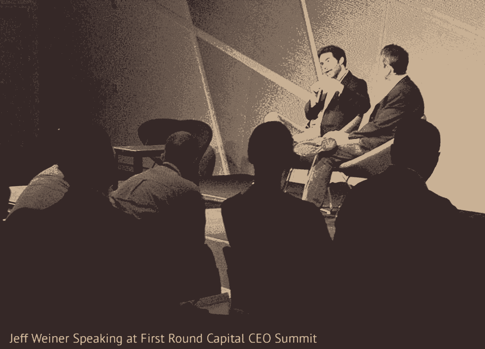

# 推动 LinkedIn 成为 200 亿美元公司的管理框架

> 原文：<https://review.firstround.com/the-management-framework-that-propelled-LinkedIn-to-a-20-billion-company>

在杰夫·韦纳成为领英首席执行官之前，他问了创始人兼首席执行官雷德·霍夫曼三个问题:“你希望如何处理决策？你想做什么决定，我应该做什么决定？”霍夫曼回应道:“[这很容易。这是你的球，你带着它跑](https://www.linkedin.com/pulse/20121105142234-22330283-set-up-for-success-it-s-your-ball-you-run-with-it?trk=mp-reader-card "null")。或许这只是一次简单的交流，但它开启了硅谷历史上最成功的 CEO 交接。霍夫曼知道，要想让公司运转起来，公司需要赋予其领导者清晰而独特的日常决策权，他是对的。韦纳带领 LinkedIn 通过一场轰动性的 IPO，目前市值超过 200 亿美元。首次公开募股后，他从另一边走出来，带来了一些令人难以置信的管理经验。以下是他在第一轮资本 CEO 峰会上分享的一些想法。

# 风帆中的风

大多数创业公司都是从一个核心想法和大量热情开始的。这个想法是创始团队所了解和喜爱的。这是他们日夜工作的动力。但是，如果这个早期的小团队没有奠定正确的基础——正确的工具、人员和协议的组合——他们的想法将无法扩展，他们将无法实现他们的愿景。这种事经常发生。

“我把它称为‘风帆中的风’动力……公司突破并建立别人从未创造过的东西，”韦纳说。这就像在完美的条件下在帆船上一样。风正朝着正确的方向吹。一切都很容易。“当这种情况发生时，你的船体结构、船员的技能、力量和耐力以及船长的能力都无关紧要。船上的每个人都在庆祝船移动得有多快，你在后视图中看不到任何人。那里没有其他人。”

但是完美的航行条件不可能永远持续。“风向将会改变，其他船只将会出现，”韦纳说。与此同时，如果不考虑改进船只或招募最好的船员，这些竞争对手将会迎头赶上。“等它们离你足够近超过你的时候，就太晚了。这就是为什么你必须在早期打下坚实的基础。你必须把基础设施、流程和人员安排好。”

愿景就是梦想。一个公司的正北。它日复一日激励着每一个人。这是你需要不断追求的。

# “使命”和“愿景”不仅仅是海报上的文字

韦纳认为，让你的“船”到达尽可能好的目的地需要一个清晰的愿景和使命。这些声明最终会告知并激励公司的战略和目标。或许最重要的是，领导者需要言行一致，坚持他们宣称的价值观，以保持整个公司团结一致，朝着正确的方向前进。

这说起来很好，但是首席执行官如何实现这些理想呢？太多时候，公司价值观被贬低为墙上的海报或说教式的全体会议。但韦纳认为，一个好的领导者可以让他们活起来——通过教练，一种旨在实现任务的战略，因为它概述了明确的目标和衡量，沟通的结果。

许多从事科技工作的人交替使用“使命”和“愿景”这两个词，除了高管们的口头承诺，他们通常不会付诸实施。韦纳相信，清楚地定义这两者，并每天按照它们生活，是建立一个成功的技术公司的关键定义方面。

“愿景就是梦想，”韦纳说。“一个公司的正北。它日复一日激励着每一个人。这是你需要不断追求的。”[他将 LinkedIn 的愿景定义为“为每个专业人士创造经济机会](https://www.linkedin.com/pulse/20121210053039-22330283-the-future-of-linkedin-and-the-economic-graph "null")”，这里的“专业人士”指的是全球超过 33 亿劳动力中的每一个人。

另一方面，使命定义了公司如何努力实现这一愿景。对于 LinkedIn 来说，这意味着“连接世界各地的专业人士，让他们更有效率、更成功。”在这里,“专业”一词指的是公司网络中超过 6 亿知识工作者的直接受众，以及改变他们生活的机会。

愿景不是马上就能实现的。这些都是不切实际的理想，可能需要几代人、许多合作伙伴和许多人来实现——即便如此，也可能只是部分实现。韦纳说，然而，使命可以用具体的目标来定义，一个公司可以通过它实现这些目标的程度来衡量。大部分公司，即使是创业公司，也只会有这个或者那个。但是，一个没有参考公司实际所做的愿景是脱离现实的，可能无法达到激励和组织员工的目的。

韦纳将谷歌作为一家公司的主要例子，该公司的使命包括有效愿景声明的特征:它不是“成为一个更快的搜索引擎，也提供略好的首页结果。”它是“组织世界上的信息，使其普遍可用和有用。”搜索引擎和该公司的其他产品渴望完成这一使命。这就是谷歌如何建立一个传教士而不是雇佣兵的团队。韦纳说，这是你如何能找到最优秀的人，并激励他们变得伟大。

# 将言语付诸行动

一旦公司定义了核心价值观，就要靠领导层来规划实现这些价值观的战略。韦纳说:“战略是在竞争格局中导航，以实现你的目标。”他把这比作在象棋比赛中规划你的下一步棋。你必须预测对手的下一步行动，然后决定如何部署你的资源来击败他们。

这一总体战略可以分解为多个目标，优秀的领导者会清楚地说明组织中的每个人如何共同努力来实现每个季度和每年的目标。“随着组织的成熟，任何高级管理人员的工作都与指导和战略有关，”韦纳说。一个强有力的目标很容易明确地与公司的总体使命、愿景、文化和价值观联系在一起。韦纳说，甚至管理团队也经常将公司价值观视为“办公室里像呆伯特一样的标语牌——斯科特·亚当斯会在连环漫画中取笑的东西。”但是，如果表达的价值观成为员工休息室里嘲笑的对象，那么领导力就会失去可信度和激励能力。

韦纳说，这就是为什么持续沟通价值观如此重要——对于高管来说，早就过了令人厌烦的阶段了。“你必须重复这个设想。你必须重复任务。你必须重复战略、目标、优先事项，并花时间定义你是谁，你想成为什么样的文化。”只有通过不断的重复，人们才开始内化和理解。在一个快速发展的公司，你总是鼓舞着新的忠实信徒，未来的火炬手。

# 让 OKRs 不仅仅是 LinkedIn 的首字母缩写

LinkedIn 使用一个名为“目标和关键结果”的任务跟踪系统来管理团队。这一策略最初由英特尔公司的安迪·格罗夫提出，后来由凯鹏华盈的约翰·杜尔登推广开来。今天，这种速记遍布硅谷。但是，很容易把一个听起来像公司的首字母缩略词视为另一个提取员工工作的领导伎俩。OKRs 听起来没什么鼓舞人心的。LinkedIn 正是通过这种方式帮助员工更好地融入公司的集体使命。

在格罗夫著名的手册《高产出管理》中，他通过回答两个简单的问题来介绍 OKRs:**(1)**我想去哪里？ **(2)** 我怎么知道我要到达那里？本质上，我的目标是什么，我需要关注哪些关键结果来确保我取得进步？仔细想想，这些问题是非常私人的，触及到人们如何度过一天的核心。组织内的每个人每个季度都应该有自己的 okr，这是有道理的。重要的是将这些个人 okr 与团队 okr 联系起来，最终与组织 okr 联系起来。这种排列组合了功率和效率。

韦纳理解 OKRs 的个人性质和激励潜力，对它们进行了更广泛的定义。它们应该是“你想在一段特定的时间内完成的事情，倾向于一个延伸的目标，而不是一个既定的计划。这是你想要创造更大的紧迫感、更大的关注度的事情。”出于所有这些原因，员工的级别越高，OKRs 就应该变得越重要。韦纳说，当你处于领导地位时，“你向组织中的其他人发出了‘这很重要’的信号”。

OKRs 绝对不应该是容易实现的。低期望可能看起来会产生令人振奋的结果，但从长远来看，它们最终会阻碍人、团队和公司的发展。OKRs 也不要可塑性太强。它们应该是季度信标，而不是一周一周地变化。沿着这些思路，韦纳更喜欢他的团队成员在任何给定的季度为自己设定三到五个 okr。任何超出这个范围的事情都有可能分散我们对真正需要完成的事情的注意力。

# 如何召开有效的高管会议

韦纳的高管团队每周开会一次，每次三小时，每六周开会一整天。一年两次，用于跨越多天的异地。每一层会议都有不同的目的和范围，目标是在微观和宏观层面上指导公司。

每周的会议都是关于一般的战术更新，每个人在他们的 okr 上做的如何，计划的任何大的改变，等等。这绝对不是每个人活动清单上的老调重弹。相反，它意味着提供每个人正在做的事情的高层次视图，并确保他们都按照相同的目标和原则操作。除此之外，如果需要的话，韦纳会在周一和周五抽出一个小时进行战略性的深度潜水。通过从战略中分离出战术，他确保团队保持专注，不在长期和短期环境之间不断切换。

韦纳也有点不寻常地用“胜利”来开始每周的员工会议。在深入研究指标或手头的业务之前，他在房间里走了一圈，要求他的每个直接下属分享一项个人胜利和上周的一项职业成就。这种仪式从一开始就给这些会议注入了积极的能量。否则，韦纳指出，他们会倾向于陷入一轮又一轮的抱怨。

他还发现，让这些会议尽可能有影响力就像他在会议室之外所做的一样。也就是说，不要开太多的会，如果可以的话，绝对不要连续开会。韦纳说，他发现保持两小时的缓冲时间有巨大的价值，这使他能够与他的团队一对一地联系，并收集自己的想法。“作为一名领导者，你的关键角色是指导和战略，如果没有适当的时间来处理身边发生的事情，你就无法做好这两项工作。

除了创造时间积极思考，韦纳认为，经理的成功来自于“同情心”而不是“同理心”。同理心指的是体验另一个人做的事情，就好像你是那个人一样。同情是理解他人正在经历的事情，并保持足够的客观空间，让你能够采取相应的行动。

韦纳举了一个旁观者观察一个人被巨石压碎的例子。一个感同身受的人，也会有同样的窒息感，无法帮助。但是富有同情心的观察者可以在采取行动的同时理解受害者的痛苦。有经验的领导者的任务是从另一个人的角度理解事情，并利用这种力量来改善局面。

# 全部加起来

不可思议的 IPO 不会凭空出现。尽管硅谷和媒体都在谈论毫无意义的估值和疯狂的市场，但要进行公开募股需要很高的技巧，更不用说让人们记住了。LinkedIn 上市的那天，在超出分析师和公众预期后，它立即成为头条新闻。人们仍然谈论它。

当被问及他是如何做到这一点的，尤其是对于一家不那么浮华的公司——一家通过击败闪存而获得更多利润的公司——Weiner 列出了他在上面分享的建议。价值观。同情心。围绕统一目标的领导力。问题是，大多数公司很容易忽视这些概念，因为它们有些陈旧，或者与他们每天需要完成的工作无关，以达到下一个梦寐以求的水平。韦纳说，这是一个错误——对自己的满帆兴奋不已，以至于看不到即将到来的首次公开募股。你没有照顾好你的船，你会在到达目的地之前沉没。