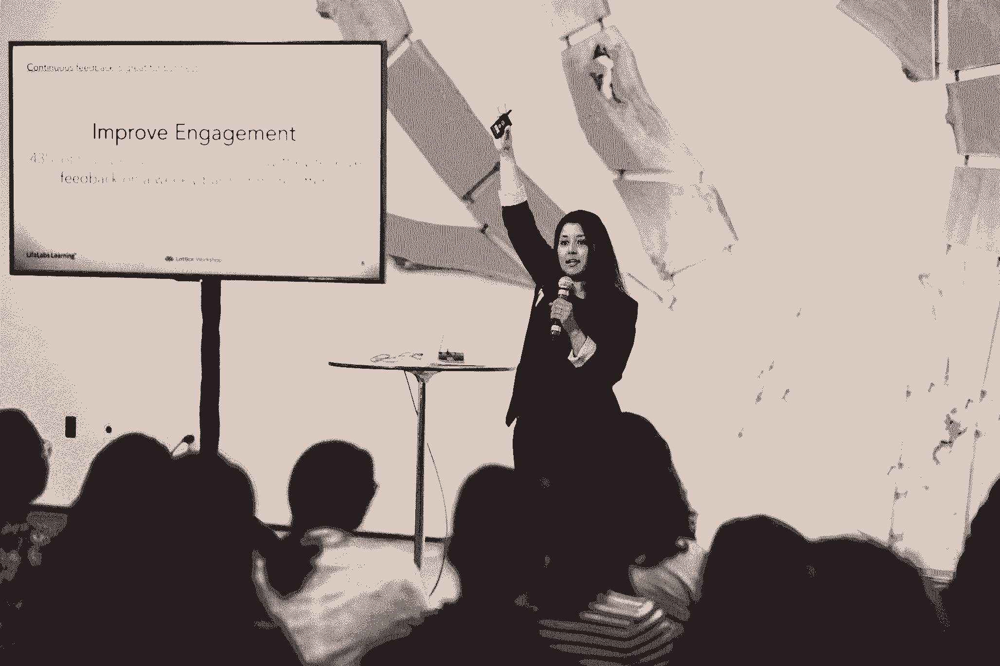

# 包容性领导的经理指南——产生巨大影响的小习惯

> 原文：<https://review.firstround.com/the-managers-guide-to-inclusive-leadership-small-habits-that-make-a-big-impact>

## 介绍

“现在，整个技术领域的领导者和经理们都在争先恐后地想出如何应对黑人的命也是命运动，并了解更多关于他们如何才能反种族主义的信息。瓦妮莎·塔尼辛 说:“从重新审视招聘实践到组织关于种族和联盟的内部对话，在这个迄今为止在包容性投资方面进展相当缓慢的行业，现在有一种迅速行动的压力。”。

Tanicien 非常适合帮助那些准备着手这项工作的公司。作为 **[LifeLabs Learning](https://lifelabslearning.com/ "null")** 的领导力培训师和主持人，她和她的同事与 Slack、Peloton 和 Warby Parker 等 700 多家公司合作，提供研究驱动的项目，培训经理和团队如何在最短时间内掌握最重要的领导技能和习惯。

“在 LifeLabs，我们专注于影响最大的最小变化，”她说。“需要明确的是，从教育和产品制造到招聘和绩效评估，所有领域都需要进行关键的系统层面的变革，以打击偏见和种族主义。但除此之外，领导人也有机会在日常交往中反种族主义和包容——这有助于保持这项工作的中心地位和持续性。”

最近，在第一轮社区中，与其他领导力培训师 **[Massella Dukuly](https://www.linkedin.com/in/masselladukuly/ "null")** 、LifeLabs 联席首席执行官 **[Tania Luna](https://www.linkedin.com/in/taniadluna/ "null")** 、引导领导**[Vaneeta 桑德胡](https://www.linkedin.com/in/vaneetasandhu/ "null")** 博士和 Tanicien(实际上)一起，就领导者为什么以及如何变得更有意识地包容进行了战术性讨论。鉴于科技行业迫切需要变革，我们想在这次回顾中与更广泛的受众分享我们的内部对话笔记。(公平的警告，我们做了*多*的笔记。)

从立即为黑人员工保留空间并领导与团队的脆弱讨论的迫切需要，到建立欢迎文化的长期行为，LifeLabs 的团队将包容性领导提炼为四个最重要的习惯。对于这些高影响力行为中的每一种，杜库里、卢娜、桑德胡和塔尼西恩分享了改善互动和决策的小策略和关键问题。他们的建议为那些有新动力出现并致力于持久变革的领导者提供了一个很好的起点——那种始于内心的变革。

# 为什么 DEI 中的“我”很重要，它实际上意味着什么:

当谈到多元化、公平和包容(DEI)战略时，[公司倾向于](https://firstround.com/review/eight-ways-to-make-your-dandi-efforts-less-talk-and-more-walk/ "null")将精力集中在雇佣和分享关于“多元化数据”的报告上，而不是检查他们自己内部的现有动态。由于前者处理数字，而后者涉及归属等模糊概念，首字母缩略词中的“I”经常被省略。

这对从绩效到保留的一切都有真正的影响。“作为人类，我们的大脑天生就有偏见。这意味着我们必须有意识、有系统地欢迎多样性，建立公平和包容，”培训师 Massella Dukuly 说。“你不能只是假设，一旦你引入了更多的多样性，包容性就会有机地萌芽。”

为了开始这项工作，联合首席执行官塔尼亚·卢娜强调，首先要重新定义领导力。“领导不是说，‘跟我来。我会带你去一个地方。是关于我离开后会发生什么。你比以前更有效率了吗？人们是否能互相发挥出最好的一面？总的来说，我们在研究中看到的是，当一群人一起工作时，我们都开始付出更少的努力——这是心理学家马克斯·林格曼首先[发现的一种效应，”她说。](https://en.wikipedia.org/wiki/Ringelmann_effect "null")

“卓越的领导力意味着激发更多的努力、参与和生产力。它创造了一个 1+1 = 3 的公式。从很多方面来说，这是典型的微小的、不可见的包容行为的结果——表扬工作，要求听取其他观点，或者只是说谢谢，”卢娜继续说道。“但是**关注小事情对我们来说很不自然。**当然，包容也可以看起来像是佩戴或张贴联盟的标志，并公开声明你承诺使用你的特权来支持他人，但有意义的包容是关于那些我们大多数人甚至没有注意到的日常行为。”

这里有一个简单的定义:包容性的领导者让每个人和每个房间都比他们发现时更好。

在主持研讨会时，Vanessa Tanicien 还发现强调包容的反面很有帮助，这样我们就可以通过对比来学习。“我们人类默认为，‘我在这里信任谁？’或者‘我和谁关系好？’或者‘我坐在谁旁边？’然后把这些人拉到房间里进行对话，解决问题或分享信息。她说:“所有这些微小的排斥在我们意识不到的情况下累积起来。**这种依赖我们已经认识和喜欢的人的倾向在自发碰撞不太频繁的遥远空间被放大**。"

相比之下，包容就是让他人加入进来。“这是关于收集他人的想法和感受，以便我们能够提出有利于整体的解决方案。它需要额外的意愿来赋予你周围的人权力，并让每个人都有平等的机会获得成长和贡献，”Tanicien 说。

为了揭示管理者如何更实际地融入包容性领导的原则，LifeLabs 集团将其分为以下四个习惯:

邀请并展示真实性

建立自我意识和好奇心

寻求反馈，并对反馈做出积极回应

不断提升其他观点

“谨慎和真实地处理困难的对话是目前最重要的，所以我们将首先深入探讨这一点。卢娜说:“虽然这可能是短期内的紧迫工作，但其他三个习惯对于保持变化、摆脱我们短期内的反应模式以及随着时间的推移而放松下来绝对至关重要。

# 包容性领导习惯#1:邀请和展示真实性:

领导者目前最紧迫的责任之一是让员工安全地说出他们独特的需求和经历。但是说起来容易做起来难。

我们经常在工作场所听到这些口号，比如‘做你自己’或者‘带上你的全部’卢娜说:“但这些信息的重点不应该仅仅是穿着古怪的衣服去办公室，每个人都很酷。更具体地说，这是一种给予积极反馈的能力，询问你需要什么，承认错误，展示你不符合主流文化的一面——而不会受到惩罚。例如，今天许多黑人仍然被告知自然地留头发是“不专业的”。"

在许多工作场所，从众是一种生存策略。“选择变成了:适应或者接受成长、联系和贡献的机会减少，甚至可能拿你的工作保障冒险。卢娜说:“T2 的克劳德·斯蒂尔和许多其他人的研究表明，这种顺从的压力对来自边缘群体的个人来说是最大的，会导致慢性压力、脱离和生产力下降。“简而言之，当人们觉得带着真实的自己去工作不够安全时，整个公司都会受到损失。”

Vanessa Tanicien, Leadership Trainer and Facilitator at LifeLabs Learning

Tanicien 挖掘了不真实地出现的非常个人化的一面:“在这个过程中的某个地方，人们决定以某种特定的方式来表现和行动，以便在办公室里被喜欢。不幸的是，取悦他人是现存最深层次的操纵形式之一。你本质上是在弄清楚如何以一种对自己不真诚的方式让人们喜欢你，在“工作的你”和你认为自己是什么样的人之间制造距离。这就是为什么我很久以前就决定不戴这个面具去工作了。”

Tanicien 还指出，随着[我们适应远程工作](https://firstround.com/review/struggling-to-thrive-as-a-large-team-working-remotely-this-exec-has-the-field-guide-you-need/ "null")，我们保持这种伪装的能力现在比以往任何时候都更具挑战性。“这是由于所谓的[整合与分割](https://www0.gsb.columbia.edu/mygsb/faculty/research/pubfiles/6421/phillips_multiple_roles.pdf "null")。你们的身份之前是物理分割的。你过去常常离开家，步行去火车站或坐进你的汽车，然后到达办公室，突然你就“工作了”。然后你下了班，回到“家你”这些界限现在变得模糊了，”她说。

“所以保持这些情感障碍要困难得多。当没有更多的线索让大脑知道它在一个地方而不是另一个地方时，维持这种分裂需要大量的精神能量。这种新的融合水平促使人们变得更加真实，并以他们在 T1 之前从未有过的方式出现。作为领导者，你必须为此做好准备。这是你展示真实自我在这里受欢迎的机会。邀请真实不仅会增加参与度，还会让你满足人们的真实需求。”

我们现在共享的这个环境的一线希望是，人们被迫脆弱地联系，实际上进行真正的对话——我们无处可藏，伙计们。

考虑到这种情况，LifeLabs 团队就领导者如何通过展示和邀请真实性来迎接这一时刻提出了三条具体建议:

# 1.在检查之前先检查。

许多人可能会有一种冲动，想去看看他们生活中的黑人，问问他们过得怎么样。但你可能也看到过一些文章和有用的 Instagram 帖子，它们指出了为什么这可能不是一个通用的解决方案。

“作为一名美国黑人女性，我收到了很多这样的短信。其中一些比其他的更受欢迎。我肯定不代表这里所有的美国黑人，但这就是我如何解释好消息的不同之处:它们来自一个真实的地方，”塔尼辛说。“它们来自你已经交谈过的人，或者你已经有关系的人。否则，这可能会显得有点透明或自我驱动。”

Massella Dukuly, Leadership Trainer at LifeLabs Learning

杜库里(她也是一名黑人女性)补充道:“从我的角度来看，我仍然想成为你的朋友。我不希望你开始对我不一样，也不希望你觉得我们需要这种奇怪的互动，”她说。“我希望这些对话有深度，这种深度应该与已经存在的关系相称。“如果你想谈谈，我就在这里”这句话只有在我们之前真正谈过的情况下才有效。如果你是我三年没说过话的前同事，你真的想让我打电话给你，开始谈论系统性压迫吗？大概不会。”

当研究是什么让伟大的管理者与众不同时，LifeLabs 团队的研究表明，引导性问题和真实问题之间有很大的区别。Dukuly 和 Tanicien 对这种细微差别进行了分析:“**最好的领导者会提出他们真正想知道答案的问题。要做到这一点，停下来问问自己:我为什么要问这个问题？我是真心想听到这个人的消息，还是想确保自己看起来不坏？我是在打勾还是在尝试真正参与？”**

如果你现在选择接触一个黑人，选择联系——而不是开车路过。

当然，领导有责任检查，因为表现出关心和关注是工作的一部分。“所有员工都应该遵守的一个好规则是‘先**报到，再**报到。’换句话说，在把谈话转向工作之前，为感情和人际关系留出空间。这是提供个性化支持的机会。"

为了周到地引导这些签到对话，LifeLabs 团队为您的 [1:1 会议](https://firstround.com/review/managers-take-your-1-1s-to-the-next-level-with-these-6-must-reads/ "null")提供了以下提示:

*说什么:*

你好吗，真的？你在睡觉吗？

这段时间最有用的用途是什么？你愿意谈谈世界上正在发生的事情吗？我们可以谈论你正在经历的事情，专注于工作，或者只是休息一下。

我现在能做什么让你的工作更轻松？

如果你需要请假，你不在的时候我能做什么来支持你？

*不该说的话:*

我不敢相信会发生这种事。

我很清楚你在经历什么。

我感到很内疚。

至少工作中没有种族歧视。

我相信很快会好起来的。

*如何应对:*

承认:我听到了。谢谢分享。

提问:你想对此多说点吗？

# 2.创造有意交谈的空间。

Tania Luna, Co-CEO of LifeLabs Learning

除了一对一的签到，全公司或小组讨论也提供了展示包容性领导的机会。“尊重几个世纪以来的痛苦和压迫的严重性和细微差别，是处理种族问题的关键，”卢娜说。"**但是害怕不知道如何提出这个话题或者说错话会让谈话停留在表面层次——或者完全阻止他们发生**"

在进行这些对话时，请记住以下提示:

**发挥积极作用:**“沉默发出了一个意想不到的信号，让员工以他们自己的方式去解读它——通常认为没有信息是不感兴趣、害怕或缺乏关心的表现。引用我的同事 Ashley Schwedt 的话来说，不作为仍然是行动。“当围绕偏见、微侵犯和排斥进行这些对话时，领导者不要只是希望每个人都自己发现，这一点非常重要。”她的同事瓦内塔·桑德胡博士强调了这一点:“在这些对话中扮演积极的角色。邀请经理发布文章、博客、播客、个人故事和讨论提示。她说:“如果我们想让员工学到更多东西，我们就必须宣传我们自己的学习成果。

**创造空间**:卢娜说:“要求员工在工作时真实、在场、真实*，与承认工作之外*事件*的真实影响并为其创造空间是相辅相成的。”。Justworks 的首席执行官艾萨克·奥茨发来的电子邮件就是一个很好的例子。他说:'*我们正在为自己的员工创造空间，让他们聚在一起，悲伤和疗伤。空间是指场地、时间、优先级；其他的事情都要等一等。持有空间意味着什么——而不是让它成为一个抽象的概念——这一点非常重要。"**

**拥抱不适:**“在我们的 LifeLabs 内部团队会议上，我们的同事 [Robleh Kirce](https://www.linkedin.com/in/kirce/ "null") 提醒我们，我们需要选择勇气而不是舒适。卢娜说:“不要担心我们会说‘不该说的话’，要相信如果我们说了，我们会给对方反馈——这是我们学会互相展示的唯一方法。”

期待不适，不要让它拖你的后腿。把它看作是取得进步的代价。把它作为一个信号，推动你学习更多。

# 3.表现出弱点——但是要设定意图，划定界限

Dr. Vaneeta Sandhu, Facilitation Lead at LifeLabs Learning

领导者要求真实和脆弱，而自己却不言行一致，这是虚伪的。当你说你真的希望他们做自己，说出他们的想法时，人们需要看到这种行为模式才会相信你。

但是，尽管人们越来越了解脆弱性的[威力，但弄清楚它如何转化为你的日常视野却很棘手。桑德胡说，一个起点是**承认错误**。“在我们的研究中，我们注意到影响力技巧得分高的领导者会分享他们犯错误的时间以及他们从中吸取的教训。犯错是必须的。当我们还是孩子的时候，我们碰到了火炉，我们被烧伤了，并学会了不要再这样做。她说:“有时候，错误是我们的大脑将学习内容编码的代价。](https://firstround.com/review/founder-exposed-opening-up-about-startup-failures-and-vulnerability/ "null")

我们都会犯错。我已经研究包容性 12 年了，在过去的 7 天里，我至少犯了 4 个错误。

桑德胡愿意分享她的一个故事:“我和我的一个朋友聊天，她受到了自新冠肺炎袭击以来席卷全球的仇外心理和反亚洲情绪的影响。在谈话中，她说，“我想知道你说了多少，而我说了多少。”我专注于自己，而不是别人。"

在与你的团队进行这些易受攻击的讨论时，提醒自己你不必知道所有的答案。“我们需要抛弃这种想法，即我们必须对每件事都有一个答案，”杜库里说。“如果一个领导者可以分享一些事情，比如，‘这是我是如何搞砸的’，或者‘我也很害怕，但这是我所知道的，以及我将如何与你分享’，这将会有很大的帮助。”

当我们假设我们的团队会要求所有的事实或铁定的计划时，我们低估了他们。人们通常只是在寻找关爱文化的迹象——我们会在他们身边，如果有什么不对劲，我们会为他们创造一个分享的渠道。

但作为领导，**开放不代表自由卸载**。“既可信又脆弱，同时又‘混乱’是一门艺术。卢娜说:“我们现在已经有了几十年的研究，从埃利奥特·阿伦森关于所谓的 pratfall 效应’的研究开始，揭示了当人们非常能干时，犯错误实际上会让他们更可爱、更平易近人。”。“也就是说，只有当你已经通过可信、可靠和有能力赢得了人们的尊重，这种效果才会成立。”

更重要的是，领导者需要注意情绪传染——领导者的情绪被团队中的其他人“感染”的趋势。“作为人类，我们是彼此的生物反馈机器。我们感受到别人的感受。[情感标签研究](https://www.sciencedaily.com/releases/2007/06/070622090727.htm "null")表明，当你把自己的感受用语言表达出来时——无论是在心里默念还是大声说出——都会降低自己和他人的情感强度，”卢娜说。“学习如何把我们的感受用语言表达出来，是领导者[塑造和规范感受](https://firstround.com/review/these-seven-emotions-arent-deadly-theyre-your-secret-career-superpowers/ "null")的一种方式——不要把那些感受挂在别人身上，让所有人来安慰你。你可以说，“嘿，我只是想表明我今天真的很难过，所以我可能会表现得不太投入，但我在坚持，真的很想待在这里。”"

Tanicien 表示同意。"**我不主张领导者在没有意图的情况下变得脆弱**。添加额外的背景是至关重要的，尤其是当我们[在这个虚拟场景](https://firstround.com/review/struggling-to-thrive-as-a-large-team-working-remotely-this-exec-has-the-field-guide-you-need/ "null")中远距离工作的时候。否则，人们可能会对你选择做或分享某件事的原因做出否定的解释。她说:“这是汉伦剃刀在起作用。

“使用**意图陈述**一开始就告诉人们原因。使用这样的短语，“我分享这个是因为，”或者“这就是为什么我认为你需要知道这个。”例如，不要只是说“对不起，我今天有点心不在焉”，而是说“我今天有点心不在焉，我告诉你这些是因为我想确定我的行为没有引起任何焦虑。或者你可以直截了当地说，“我今天感觉很低落，我把它分享出来，这样就很清楚了，我们所有人都有不好的日子，这没什么。”"

# 包容性领导习惯#2:建立自我意识和好奇心:

但是，仅仅为围绕偏见、包容和反种族主义的对话创造空间是不够的。包容性的领导者也投入工作来建立他们自己的自我意识。一个简单的事实是，虽然大多数人都想变得更有自知之明，但我们中的许多人都不想。很难务实的磨砺这个关键技能。LifeLabs 团队在你努力支持这一核心行为时，分解关键问题和重要提醒。

# 1.问这些关于你的过去、现在和未来的问题。

“一个包容的领导者会意识到自己的偏见，并且明白即使你是一个充满爱心、体贴、“清醒”的人，我们都会有偏见。如果你有脑子，你就有偏见。有时候，当一种偏见或排外的习惯被发现时，人们会变得有所防备，说些诸如“我在尽可能地包容别人”之类的话。相反，把这些时刻当作一个好奇的机会。这意味着有更多的东西要学，这很令人兴奋，”杜库里说。

以下是 LifeLabs 的工作人员建议你在寻找自己的失误时可以参考的问题(和背景):

**过去的自己:回头看。**从你在工作中的关系开始，回想一下你本可以为他人做得更多的时候。提问:我什么时候没有向别人展示自己？我有没有目睹过微侵犯，没能保护好一个队友？有没有一段时间，我主动做出了贡献，让某人感到被排斥？我能从这些经历中学到什么，以便下次做得更好？

**呈现自我:在当下识别和去模糊。**“正如临床医生兼作家 [Resmaa Menakem 指出的](https://www.psychologytoday.com/us/blog/the-author-speaks/201709/my-grandmother-s-hands "null")，偏见在你的身体中显现。当有一个积极的偏见时，我们倾向于放松或倾斜。卢娜说:“当有负面偏见时，我们会紧张起来。“观察你的反应，问自己:‘为什么我会紧张？如果是别人，我还会有这种感觉吗？例如，假设我有一个黑人女同事，而我的大脑告诉我，“她给人的感觉非常咄咄逼人，”那么，问自己一个建立意识的好问题可能是，“嗯，如果他们做同样的事情，我还会对一个白人同事有那种感觉吗？”男同事怎么样？如果不是，是什么引起了我的反应？在 LifeLabs，我们称这些**模糊单词问题为**。如果我说了或想了一些“模糊”的东西，比如，“那个人不是专业人士，”或“他们似乎没有经验”，我会停下来问自己:“___”对我来说意味着什么？我真正关心的影响是什么？"

未来的自己:在差距形成之前发现它们。“领导者通常会过度关注组织内的某个团队。例如，他们如此深入地致力于改善性别平等，以至于不去关注其他任何事情。“砰，他们的偏见就出现了，”杜库里说。“做一次自我检查。提问:我现在主要关注的是什么，将来会如何形成其他差距？例如，当专注于在工作场所雇用更多女性时，我是否忘记了 BIPOC，queer 或 trans women？你不需要一个明确的答案，但你越能意识到这一点，你就越有机会考虑采取什么样的审慎措施。”

# 2.向他人询问这些问题，以不断练习好奇心。

“领导者经常听到展示开放心态的重要性。桑德胡说:“练习的一个方法是问一些针对他人的问题。"这是提高我们自我意识的一个简单途径."

伟大的领导者找到倾听和提问的方法，比他们说话和给出答案的次数更多。

作为一名领导者，要始终如一地实践好奇心，要经常问这样的问题:

在那次会议上，你希望我说什么，而我没有说？这个问题可以让你不断缩小自己的经历和他人经历之间的差距。

那对你来说有什么重要的？如果有人和你谈论他们需要的或者他们非常感兴趣的事情，不要直接谈论你能帮上什么忙或者这是否是个好主意。这样，您可以更好地定制您的支持。

**还有什么？**“第一个回答通常是一个基本的回答，比如‘我很好’或者‘你好吗？’杜库里说:“要想让对话更上一层楼，就要问一些需要你深入倾听的问题。一个简单的问题放在你的后兜里:“你还在想什么？”和“还有别的吗？"

Dr. Vaneeta Sandhu facilitating a LifeLabs training session

# 3.指导你自己的学习——并确保你正在吸收它。

但是好奇并不总是意味着对话。“我非常提倡自己做大量的工作。有很多资源可以参考。是的，互联网是一个巨大的信息地带，让人感觉无法抗拒，”Tanicien 说。“但是，选择一个主题并决定真正解决它，就可以克服这一点。让这成为一次积极的经历，一路上问自己:**我在学什么？什么时候可以实际应用？为什么它对我很重要？** **可以和谁分享？**

人们花费大量时间消耗信息，却没有真正地学习它。花时间保持好奇心，在新的话题上进行自我教育——不要忘记将点点滴滴与你的日常生活联系起来。

# 包容性领导习惯#3:寻求反馈并做出积极回应:

接受[反馈](https://firstround.com/review/our-6-must-reads-for-managers-to-give-feedback-that-helps-people-grow/ "null")是开启自我意识的钥匙，让我们能够提供量身定制的支持，因此它是包容性领导者工具箱中的一个重要工具。但是它经常被请求和接受很差。LifeLabs 团队指出了一些常见的陷阱，并提供了一些有用的策略来改善这些陷阱:

# 1.从关注目的和意图开始。

我们经常听到这样的说法，“反馈在这里是一个重要的价值。”“但是这背后的意图以及人们实际上是如何感知反馈的往往不太清楚，”杜库里说这就是为什么领导者明确地说“当我们在这里给予和接受反馈时，是为了促进学习和成长，并重新定义我们的先入为主的观念”是有帮助的。"

模糊的意图也许可以解释为什么你在向你的团队寻求反馈后会听到蟋蟀的叫声。“我们都问过，‘有人能给我一些反馈吗？’桑德胡说:“然后得到的回答是，‘没有，都很好’，如果你希望得到更多，这可能会令人失望。”。

“人们可能会误解你提问背后的意图，或者对此感到焦虑，这可能是因为他们过去曾被要求反馈但回应不佳的经理伤害过。这就是为什么附上一份意向声明会很有帮助。像“帮助我不断进步”这样的简单短语...、'或者'我真的在努力更清楚地沟通决策。“我能做得更好吗，”会很有帮助。"

# 2.询问扩展问题。

“作为领导者，我们倾向于问一些非常宽泛的反馈问题，比如‘事情怎么样？’你需要非常非常具体。Dukuly 说:“特异性将使我们能够准确定位排斥问题可能在哪里，并了解我们如何补救。”

“我喜欢 LifeLabs 的一个战术练习，我们称之为**扩展问题**。一个简单的例子是:从 1 到 10，你认为我在促成这次会面方面做得如何？杜库里说:“大多数时候，你通常会听到七八个，因为他们不愿意说任何超出这个范围的话。

这就是为什么第二个问题是神奇的:**怎样才能把分数提高一分？**然后，我可能会听到类似这样的话，“你本可以更多地呼吁人们倾听其他声音。”这很重要，原因有二。第一，给人们更大的安全感，让他们能够表达自己，增加参与度和承诺。第二，它还为我们提供了微观步骤，我们可以据此建立信任并提高包容性。"

比例问题能够将抽象的想法转化为可衡量的、可操作的反馈。影响是通过第二个问题的微小而发生的。

这里还有一个例子:如果你的直接下属看起来不知所措，问问他们的压力有多大，从 1 到 10 分。假设他们回答 8。使用这些扩展问题来确定您可以如何提供帮助:

什么能让你从 8 分变成 7 分？

10 分看起来怎么样？1 怎么样？

是什么让成绩不差？

上一次配乐感觉好是什么时候？那次有什么不同？我们今天如何应用它呢？

谈到包容性，可以围绕以下几个方面寻求反馈:

会议质量

成长和学习的机会

贡献的机会

发展反馈质量

绩效预期的清晰性

获取信息

感觉自己的观点被倾听和重视

获得社会联系和建立关系

# 3.提高你的回应水平。

但是仅仅更好地找出你需要的反馈是不够的。为了提升你的包容性领导能力，专注于如何在回应你收到的反馈时做出改进。

“我们都遇到过这样的情况，我们给了某人他们想要的反馈，但你意识到他们肯定不想听你说的话，”Tanicien 说。

卢娜补充道:“正如《白人的脆弱性》的作者罗宾·迪安格洛(Robin DiAngelo)指出的那样，尤其是白人通常会避免关于种族主义的直接反馈对话，所以白人领导人需要格外小心地接收信息，并让反馈深入人心。”

对于 LifeLabs，对反馈做出良好回应的关键要素包括能够:

说谢谢

求举例

询问影响

想出一个行动计划

对自己负责，不管是私下还是公开的

(迅速)跟进，展示你是如何落实反馈的，并要求更多反馈

这里有两个更具体的策略来帮助你将这些元素付诸实践:

**获得第二高分。**

"[亚当·格兰特通过思考第二个要点，推广了回应反馈的概念](https://firstround.com/review/what-your-startup-can-learn-from-astronauts-the-daily-show-and-the-coach-of-the-boston-celtics/ "null"):当有人给你反馈时，他们已经做出了判断，而这不在你的控制之内。但是你可以控制你如何回应他们告诉你的事情——这是另一个被正确评价的机会。卢娜说:“格兰特用获得 A+来衡量你接受 D-的程度。

“在处理围绕种族主义、偏见和排斥的看似可怕的对话时，这一点尤为重要。我们花费了太多的精力，天哪，我做了什么？或*我想我被误解了*一种更强大的心态是，'**这是我向这个人展示我会倾听他们的机会。我要向他们学习。我会给他们空间来表达他们的感受和需求。虽然你可能会惊慌失措，但他们是对的吗？我该怎么处理这个？相反，问问你自己，我该如何回报他们鼓起勇气来和我说话？我如何才能确保他们对我们刚刚的谈话感觉良好？你的目标应该是让他们感到受到鼓励，在将来给你和其他人提供反馈。"**

**广播你听到的。**

“这是我从我们在 LifeLabs 研究的一位领导者那里学到的:每当她从团队中的某人那里得到批评性的反馈时，她都会——在得到允许的情况下——广泛宣传，”Luna 说。

“这可以简单到在交谈中传递给别人。像这样说'*我得到反馈说我打断了别人。请你留意一下好吗？如果你注意到了，请告诉我。这是我非常想知道的事情。*“以下是我最近如何自己实现它的:当一个社区成员给我反馈时，我将它包含在发给 LifeLabs 社区的每周简讯的附言中，内容类似于“*附:我最近收到了这条反馈，以下是我从那条评论中了解到的情况*。”诸如此类的行动有助于规范寻求和获得反馈，并鼓励他人给你更多的反馈。它还允许您与团队分享学习成果，这在我们试图教育自己如何变得更具包容性的时候尤其有效。"

Massella Dukuly facilitating a LifeLabs training session

# 包容性领导习惯#4:不断提升其他观点

包容性领导者的最后一个习惯是确保平等的播出时间和机会。“包容性的领导者非常注重沟通的平等性。即使是在闲聊的时候。杜库里说:“我们倾向于和那些我们觉得最舒服的人在一起，但包容性的领导者会特意和那些他们还不太亲近的人联系。”。

她的 LifeLab 队友提供了更多改善这种关键行为的技巧:

# 1.管理电波。

桑德胡说，在会议中为每个人创造空间，让他们有时间分享自己的想法。“外向的人，那些在团队中呆的时间最长的人，以及主导身份群体的成员，他们的观点通常比其他人更容易被听到。她说:“领导者需要关注这些动态，从女性和有色人种如何经常被忽视，到距离团队较远的人、新加入团队的人、英语学习者(ELL)或更内向的人如何难以开口说话。

为了获得更多的战术，桑德胡提供了一些有用的工具:

一是**创造思考时间**。“那可以简单到说，‘在我们都回答之前，让我们都记下我们的想法。’这对那些用非母语工作的人，对内向的人，对那些神经有分歧的人和许多其他群体来说都是很好的。"

“另一个有效的工具是一种强制轮流机制，比如**计时循环赛**，你可以说，‘我们都要去，每人花两分钟分享一个问题或答案。请随意说“通过”例如，在外科领域有很多研究——由阿图尔·加万德(Atul Gawande)推广——表明如果外科团队以循环方式开始手术，护士更有可能在手术过程中直言不讳，并有可能提供挽救生命的关键反馈。"

**仪式问题**也很有影响力。养成一个习惯，在会议结束时问一些问题，比如“谁还没给我们回复？”以及“我们没有考虑的另外两个观点是什么？”

虽然防止在交谈中被打断——尤其是虚拟交谈——可能会适得其反，但领导者可以做的一件事是**跟踪完成情况。如果有人被说服了，回去对他们说，“嘿，你想结束你的想法吗？”或者“在我们继续之前，我想听听他们的其他观点。"**

确保每个人都有一席之地是不够的——包容性的领导人要确保每个人都有发言时间。

# 2.迎头痛击微侵袭。

“这是目前特别具有挑战性的事情。人们越来越了解社会心理学中经常被称为微侵犯的重量和痛苦——这个术语是由切斯特·皮尔斯首先提出的。这些看似很小的评论或行为，比如“你到底是哪里人？”(对一个非白人同事说)‘你看起来像个真正的女人！’(对一个跨性别同事说)或者‘你真能言善辩’(对一个黑人同事说)。这些通常是我们向人们发出的无意识信号，告诉他们他们不属于这里，或者我们对他们的期望很低。作者 [Ibram X. Kendi](https://www.ibramxkendi.com/how-to-be-an-antiracist-1 "null") 甚至称之为‘种族虐待’，”卢娜说。

“领导人在这方面负有重大责任。如果你真的想变得更包容，你就不能掩盖这样的评论。她说:“当你遇到微侵犯时，你需要用微干预来应对。“现在有太多关于反种族主义的言论。像这样的具体行动实际上挑战了日常种族主义的常态和隐蔽性。”

在事情发生前就开始准备，想想你将如何应对。“你会大声说什么？在什么情况下，你会在公共场合插话说些什么，在什么情况下，你会在私下里给出反馈？”卢娜说。

当微侵略真的发生时(它们会发生)，考虑你的选择。“你可以对可能受到影响的人说，‘嘿，你想让我说点什么吗？你感觉如何？“下次你可能想让我做什么，””卢娜说你也可以把做微攻击的人拉到一边。在 LifeLabs，我们在包容性培训的行为中使用[这个短视频](http://lifelabsworksheets.com/microintervention "null")来展示它可能看起来是什么样子，但本质上你可以说，‘我们能谈谈你的评论吗？我注意到，当你提到 XYZ 时，其他人后来并没有那么投入。我也经历过，我以前说过的话并没有如我所愿。你愿意谈谈吗？”卢娜说。

“最重要的是，你需要制定一个计划，告诉自己如何成为一个更具包容性的领导者——否则你很可能做不到。就像 DEI 的世界里常说的，不有意包含，就会无意排斥。我们不能再这样下去了。”

*寻找更多资源？在这里查看 LifeLabs 的* *[开源 DEI 剧本](https://docs.google.com/document/d/11aVZbj9jMbo9-JoH9_xHtpXYwmSZh-uhPXpNNzKVQRY/preview?pru=AAABcuJt9nQ*O-_v_0TMbdOh-6mfd_lBcg "null")* *。*

*照片由 LifeLabs Learning 提供。封面图片克劳斯·维德费尔特/斯通/盖蒂图片社。*