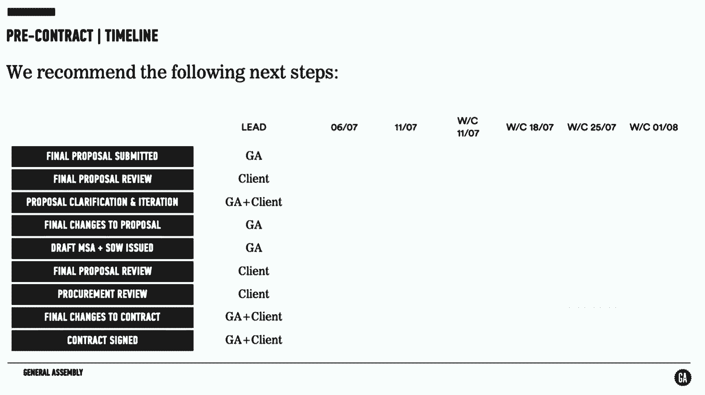
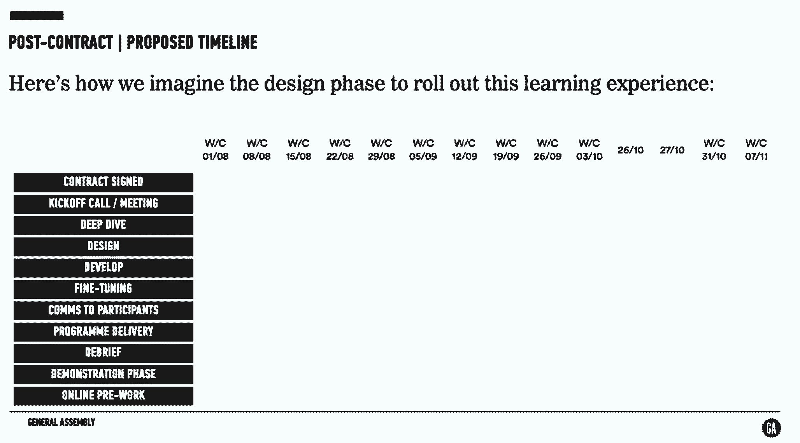
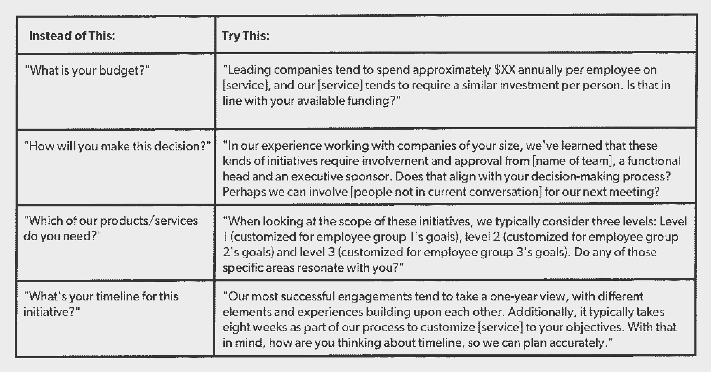

# 我发现的赢得企业交易的最可靠方法

> 原文：<https://review.firstround.com/the-most-surefire-way-ive-found-to-win-enterprise-deals>

刚刚一岁， **[总会](https://generalassemb.ly/ "null")** (GA)就已经走到了十字路口。该公司刚刚从为公司提供工作场所转向只专注于为个人提供教育服务。在这一转变过程中，其创始人发现了一个新的、有些令人生畏的机会:这样一家年轻的公司能为全球最大的工业集团之一的领导人组织为期一周的数字训练营吗？

正如在创业界经常发生的那样，GA 先说“是”，计划以后再想“怎么做”。快进到今天，GA 正在与成千上万的雇主合作，其中包括 20%的财富 500 强企业。GA 不仅直接向世界各地的个人提供课程，而且公司也来 GA 帮助培训和提升他们的人才-从数据科学到 UX 到数字营销等等。

幸运的是，他们有一些秘密武器来帮助推动这项业务——包括 **[阿南德·乔普拉-麦高恩](https://www.linkedin.com/in/achopramcgowan "null")** 。作为 GA 企业业务建立和发展的核心，他的团队和他负责与一些世界上最大的公司如 GE、Visa、沃尔玛、欧莱雅等达成数百万美元的交易。

他第一个承认成功不是一夜之间发生的——绝对不是。经过多次对话、事后反思和反复循环，才得出一个在挤满企业利益相关者的会议室里行得通的公式。今天，Chopra-McGowan 领导 GA 的欧洲扩张，他在过去几年中最有影响力的发现是:**销售周期越短，成功的可能性越大。**因此，过去(现在仍然)对 GA 销售策略的大部分调整都朝着更紧的时间框架推进。他们一路走来学到了很多。

在这次独家采访中，他分享了帮助 GA 缩短销售周期、帮助他们与大公司达成交易的具体策略，以及其他企业销售团队如何做到这一点。

# 加快销售的三大关键

**用洞察力和方向引领。**

太多的科技创业公司通过谈论他们的新产品、服务和底层技术来开始对话。听起来不错，但它掩盖了对客户的好处(例如，他们为什么应该听你的)，并最终延长了对话。相反，公司应该对你们公司之间的关系将如何运作以及他们将从中获得什么有一个清晰的愿景(紧密地为客户量身定制)。

**开发一个客观的、数据驱动的资格模型，并无情地应用它。**

当你刚刚起步，客户很少的时候，很难对任何会议说不。但正是在公司发展的这个阶段，你需要明智地决定把时间花在哪里。这就是为什么高效的销售团队往往有非常清晰的资格模型，并在整个销售周期中应用。这个模型应该随着时间的推移不断完善，并利用过去的经验在流程的每一步建立一个客观的清单，以便销售主管有信心知道销售是否正在进行。

**在每次买家互动中加入助推器。**

大公司的大多数买家都对销售过程的每个阶段需要多长时间有所期望——这往往超出了大多数年轻公司的承受能力。为了生存，你必须尽可能地挑战这些期望——你如何准备会议，如何在会议中利用时间，如何提出建议，如何采纳客户的反馈。对每一项进行一些削减可以大大减少你的总周期。

# 深入挖掘战术

好的，这三个主题可能有意义，但是你实际上如何执行它们呢？让我们仔细看看每一个，并解开你可以采取的行动，把它们付诸实践。

**带来洞察力和方向。**

第一次销售会议往往都是晴天霹雳。这不太好。人们喜欢结构，如果你强有力地构建你的想法和过程，他们会对你的交付能力更有信心。乔普拉-麦高恩说，理想情况下，你给他们的结构侧重于你计划交付的内容。

例如，General Assembly 的销售团队表示，其核心产品是帮助公司及其员工建立新的能力。“我们尽量简短:我们将帮助你寻找、评估和培训你的人才，”他说。“当然，我们也可以参与我们提供的所有黑客马拉松、活动、社会影响计划和赞助课程，但那会使我们无法专注于我们能为他们做些什么。这完全是关于三分法——一个由三部分组成的框架很容易让你接受。”

“来源、评估和培训”模式为客户提供了具体的设想。如果你的第一次谈话太宽泛，你可能会偏离主题，承诺一些你无法实现的功能，并要求再开一次会议来讨论基本问题。从一个清晰、简单的购买模型开始，相信你以后会有机会深入了解细节。

随着你获得更多的经验，你可以提供几种不同的型号供购买，并从与有问题的客户最相关的型号开始。这展示了对他们真正需求的洞察力，并建立了信誉。

例如，GA 的第一个企业客户希望它为异地领导定制一部分课程。GA 能够开发出满足需求的产品。一旦他们有了它，他们可以立即进入其他对话，为静修和异地提供这种类型的节目。Chopra-McGowan 说:“这一建议明确了我们建立关系的全新方式，减少了我们浏览整个选项菜单的时间。”

设定明确方向的另一个策略是:制定时间表。

如果你在创业，大多数人不会买你卖的东西。他们不知道你计划如何从推介到发布，无意中给了他们拖延和磨蹭的机会。

Chopra-McGowan 列出了详细的时间表，概述了与客户的每个步骤——通常在一张幻灯片上，用颜色编码的行项目显示谁负责什么。他的团队试图让客户明确确认他们接受该计划。即使他们最终没有完全坚持，它仍然建立了对将要发生的事情的共同理解，而且越清楚事情发展得越快。

**无情地出线。**

为了确保 GA 明智地将时间投资于正确的客户，Chopra-McGowan 和他的团队采用了相对常见的 BANT 系统，代表预算、权威、需求和时机。新创始人可能不熟悉。如果你已经在 IBM 做了 30 年的销售，那已经是旧闻了。

“像许多框架一样，它有支持者也有反对者，但老实说，如果这四个因素都符合，这笔交易可能有很大的机会，”他说。“新的是，我们更少关注框架本身，而是更关注开发一种客观的方法来确定一个新的机会是否真正符合框架试图证明的东西。”以下是 GA 团队在销售会议中经常使用的一种洞察驱动的方式来构建资格问题:

右侧的问题倾向于产生更客观可靠的答案，以此来确认新的商机。乔普拉-麦高恩说:“你要提出适当的背景，然后提出问题。“当你问别人一个完全开放式的问题，比如‘你有多少钱？’他们很难回答，而你表现得很不专业。相反，你应该说，“与我们合作的成本如此之高，这符合你的预期吗？”如果他们对你的直接感到惊讶，承认你很忙是很有力的，你知道他们很忙，你只是不想拐弯抹角。一般来说，这是值得赞赏的。"

很多初创公司最终跳过了基本的限定条件。他们更喜欢花时间在销售电话上列出他们能做的各种事情，而不是解决潜在的尴尬和困难的问题。“我的同事 Nate Castro 多年来一直是苹果公司最成功的销售领导之一，他一直说‘我们会在这个职位上取得成功，这取决于我们在哪些方面花了时间，哪些方面没花时间’。乔普拉-麦高恩说:“换句话说，让*在销售对话中脱颖而出*，与让*在销售对话中脱颖而出*同样重要。”。

您进行的对话越多，针对您的产品或服务的限定条件就会越多。你会听到新的异议和问题，你绝对应该把它们放进一个矩阵里，就像上面那个一样。在为本文做准备时，乔普拉-麦高恩采访了保罗·赫拉奇，他是电子邮件销售初创公司 Yesware 的西海岸销售主管。

“根据以前的经验，Yesware 的销售团队建立了这个严格的内部资格框架，帮助他们大大提高了销售团队的生产力，”他说。“如果潜在客户说他们没有内部销售团队或专门的资源来挖掘潜在客户，他们就不太可能购买 Yesware。销售代表还会询问他们使用了哪些其他销售工具来查看他们是否做过类似的投资。向您自己的 BANT 系统中添加 2-3 个这样的限定符是值得的，这样可以确保您以后不会遇到意外的障碍。

不管你选择什么样的资格问题，都要为这些公司的买家做好回避的准备。他们很少会给你一个铁一般的答案。但这并不意味着他们没有给你有价值的信息。听一听，放在上下文中。“例如，如果他们说他们‘只是逛逛’,或者甚至不能提供一个‘你有学习和发展预算吗’的大概答案我们知道我们应该继续前进，我们只是浪费了双方半个小时的时间，而不是两个星期。

对于销售人员和购买者来说，谈论金钱都是非常困难的。如果他们害怕冒犯，问这些问题会感觉很尴尬。如果你是做销售的，你必须克服它。“把它想象成对你的产品有信心，”乔普拉-麦高恩说。“你越能直接、清晰地谈论金钱，你对自己的产品就越有信心。”

表现得好像你不是在销售，而是在促进购买过程。相信你提供的价值水平。

**加速您的流程。**

如果你认真审视你目前的销售周期，列出所有可以节省时间的方法，你一定会发现机会。但是捷径和助推器是有区别的。如果你为了简化而简化步骤，你可能会过多地逼迫你的客户，不能分享重要的信息，或者错过更多的机会。以下是五种最有回报的提升技巧。

**双重会议。Chopra-McGowan 说:“当去见客户时，我们发现在第一次会面后的 24 小时内要求进行后续会面非常有效(提前安排好两次会面的时间)，有时甚至是同一天。”。这可以让你花些时间消化你在第一次会议中学到的东西，然后马上带着建议的草稿回来，以获得快速的反馈。**

理想的情况是，你先安排与更大的利益相关者群体会面，然后第二次只与你的主要客户会面。这使得日程安排变得更容易，并且避免了大型小组会议结束时没有明确的后续步骤的情况，这是一个常见的陷阱。这不同于通常的节奏:开会，在几天内发送提案，然后安排下周跟进。

双重会议可以让你的销售周期缩短两周。

“我们最近在斯德哥尔摩会见了一家大银行，我们决定要求举行两次会议——当你去见他们时，这增加了他们同意第二次会议的压力，”Chopra-McGowan 说，他的团队位于伦敦。“比如说你只在那里呆一天，想充分利用每个人的时间。我们可以带着一份 word doc 离开与银行的会议，里面记录了与他们最相关的内容。我们能够将其润色成一份粗略的提案，并在当天下午的后续会议上发送并获得反馈。”

**敏捷提案。**这里的想法是快速创建您的交易提案的粗略版本，目标是在提出完整的提案之前获得大量反馈。第一个版本可能像一个简单的 word 文档一样粗糙，第二个版本可能是一两张主题幻灯片，最后一个版本将是详细的和品牌化的，对客户来说更有可能是一个灌篮。

除了加快反馈循环之外，这还有一个额外的好处，即在最终的提案中建立客户的投资，使双方在整个周期中保持紧密一致。

乔普拉-麦高恩说:“在你第一次见面后的 24 小时内完成第一个版本是非常重要的，而且你已经提前向客户明确表示，你将向他们发送一些非常粗略的信息，目的是获得反馈。”。“我们在 GA 告诉他们，我们喜欢实践我们所宣扬的快速原型制作，我们将在今天晚些时候发送一份包含初步想法的文档，我们希望每个人都有 20 分钟的时间，以便明天继续获得反馈。”

他有一个团队成员亚历山大·特里恩(Alexandre Terrien)更进一步:他甚至在与客户第一次见面之前就准备好了粗略的提案。他说:“他对公司需要什么做出了最有根据的猜测，并带着这些想法去获得更直接的反馈。”"这让他的销售周期缩短了整整一步，而且效果非常好."

他见过的另一个策略是在共享的谷歌文档中起草第一份提案，允许客户在会议间隙直接发表评论或编辑。这样，在正式跟进之前会有更多的反馈。

您希望尽可能降低对客户早期提案的审查成本。告诉他们简单地浏览一下，也许记下一些想法，然后告诉你是否在正确的轨道上。

**预介绍**。当您在客户处会见更多的人时，与任何新加入谈话的人进行简短的一对一通话非常有帮助。这可以确保当你和整个团队开会时，减少浪费在介绍和让每个人熟悉情况上的时间。它也给你一点提示，告诉你应该准备在小组讨论中提出的问题。

Chopra-McGowan 说:“我曾经参加过 8 个人在客户方面进行交易的会议，我们与他们每个人都进行了预先通话，这为我们节省了很多时间。“你不必重复每件事，你可以获得有价值的信息，使任何小组互动更加顺畅。”

通常在小组会议上，它会被放在每个人的日程表上，他们出现时不知道你是谁，也不知道他们为什么会在那里。“我们甚至有人问我们是否为他们自己的公司工作，”他说。“有了这个起点，他们从不了解我们转变为富有成效的对话的可能性几乎为零。”

但是如果你在会议前几天设法让他们打 10 分钟的电话，他们会更有方向，更愿意谈论一些实质性的东西。所有的电话必须是一个 3 分钟的公司做什么的总结；一个 3 分钟的提议，说明你认为你们可以如何合作；花 2 分钟时间询问他们的角色；给他们两分钟时间问任何问题。

Chopra-McGowan 说:“如果你愿意的话，它可以很短很甜，但我们对人们经常想保持通话感到惊讶。”“有时这些对话会持续一段时间，我们会学到各种有用的东西。例如，一个人告诉我们，他们公司前一年有一个培训项目，但没有成功。我们问了一堆问题，以了解为什么以及我们可以做哪些不同的事情。几天后，我们将这些见解带到了小组会议上。”

**取消突袭**。尤其是如果你正试图与高管们争论，会议可能会被安排在未来几周甚至几个月。大会的销售团队不只是接受这一点，而是在会议前每隔几天就与他们的助理核实一下，看看是否有任何取消或任何其他意外的机会。

“我们刚刚会见了一家大型丹麦公司的首席运营官和首席信息官。我们将不得不等上两个月，你最好相信我们得到了那个时间段，但是我们团队负责该地区的 [Svetlana Knyazeva](https://www.linkedin.com/in/sknyazeva "null") 在日程安排三天后与他们的助理联系，看看是否有任何空缺。我们实际上把日期提前了一个月。”

“创业必须逐月思考。大公司会考虑 3 到 5 年的计划。不要让他们的一个销售周期的长度决定了你公司整个生命的长度。”

**训练更柔和的触感**。Chopra-McGowan 说:“没有人谈论它，但销售人员带进房间进行这种类型的谈话的能量对销售至关重要。”“客户做出这些决定的方式通常非常模糊。尤其是如果你是一家年轻的初创公司，数据有限。很大程度上取决于人为因素。”

许多创业公司也发现自己处于劣势，因为销售人员和购买人员之间的年龄差距可能非常明显。“这意味着你真的需要派一个能拥有这个房间的人，这个人能过度补偿任何自动存在的怀疑。这几乎完全是关于你的职业姿态，手势和眼神交流。他们会很快做出判断，而你希望所有信号都准确无误。”这里有几条规则应该时刻牢记在心:

永远准时，没有例外。

准备好你的材料，为客户定制，不要依赖他们的技术工作。

记笔记。即使客户没有对你说什么新的东西，也要把它们写下来——这表明你对他们所说的东西有兴趣。

“我们过去常常自由自在，从来不会带着演示文稿出现——以为企业会喜欢初创公司 MO。乔普拉-麦高恩说:“我们后来意识到，展示前期工作投入更有影响力。“保持敏捷很好，但你也想证明你对这个机会非常认真。否则人们会很快给你打折。”

GA 团队也犯了早期低估面对面会议的错误，现在培训新销售人员抓住一切机会与客户共处一室。

“我们认为数字技术更快更好，但是当我们看不到对方时，我们会错过很多人类交流——肢体语言，给予的关注，”他说。“最重要的是，亲自前往那里是向客户展示他们有多重要的一个重要举措。”

尽管旅行需要时间，但面对面可以大大减少所需的会议次数，因为你可以更快地到达相互理解和信任的地方。

“现在，当我们达到一定的资格水平，并知道那里有一些潜力后，我们会立即提议进行面对面的会谈。即使当客户反驳说他们可以在电话里谈，我们也要再次坚持:“如果对你来说都一样，而且你反正会在办公室，我们希望能面谈。”"

# 正确的后续步骤

让你的销售团队改变他们的行为和方法可能会令人生畏。下面是下周你可以做的三件最简单、最可行的事情，来看看这些销售方法的影响:

**快速跟进。**下一次你安排会议时，也安排一次后续会议——比你通常安排的时间要早得多。例如，如果您上午与客户有一个会议，要求当天晚些时候再花 30 分钟，明确指出后续会议将是您提出一些初步想法、提出澄清性问题以及起草提案的机会。

“在最坏的情况下，这将更好地验证你解决客户问题的方法，”Chopra-McGowan 说。"在最好的情况下，这将为你的销售周期节省大量时间."

**开始取消突袭。**让你的销售团队列出日历上未来一个多月的所有客户会议。然后让他们联系这些客户，并明确询问是否有任何事情被取消，以便提前之前安排的会议。

**花样搭配。**看看你的 20 个最成功的客户关系，看看你能从一些因素中辨别出什么样的客观模式:行业、公司规模、关键决策者的角色、回复电子邮件的平均时间等。由此产生的通用因素列表应该是您定制鉴定框架的起点。确保包含交易成功所需的所有关键要素。

“查看您当前的渠道，了解每笔交易如何与您的新框架相匹配。无论哪里有差距，都要专注于如何弥补或者继续前进。”

*照片由大会提供。*