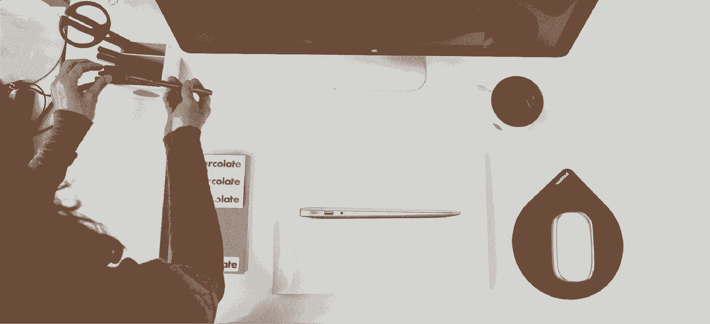
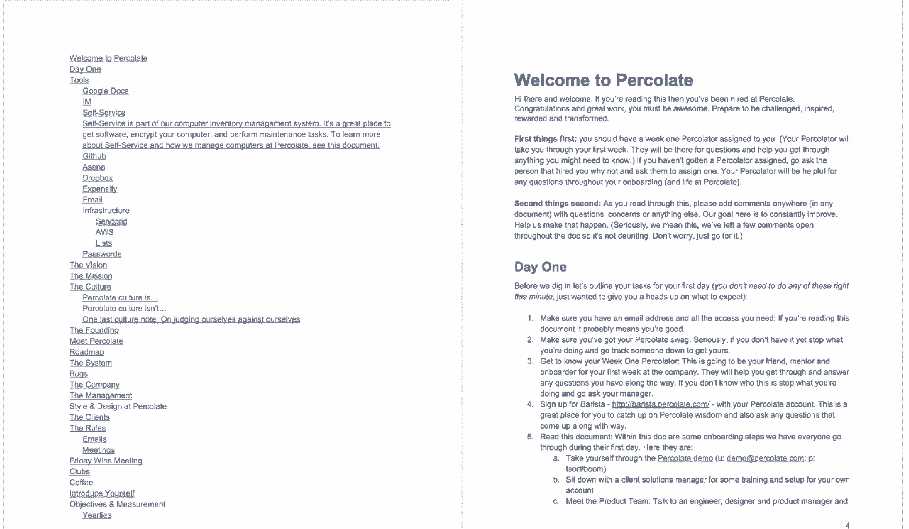
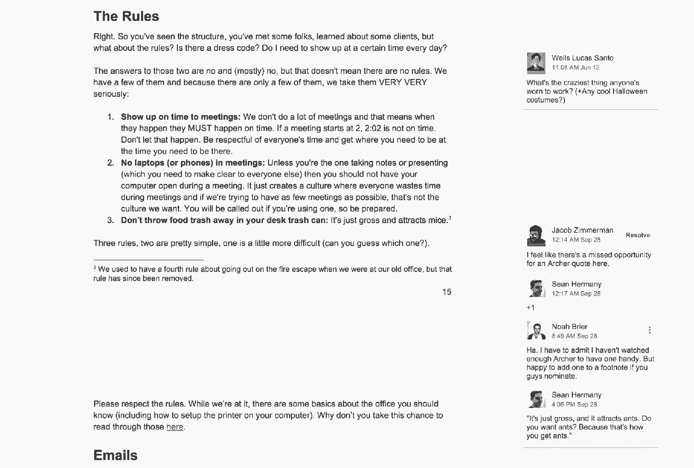
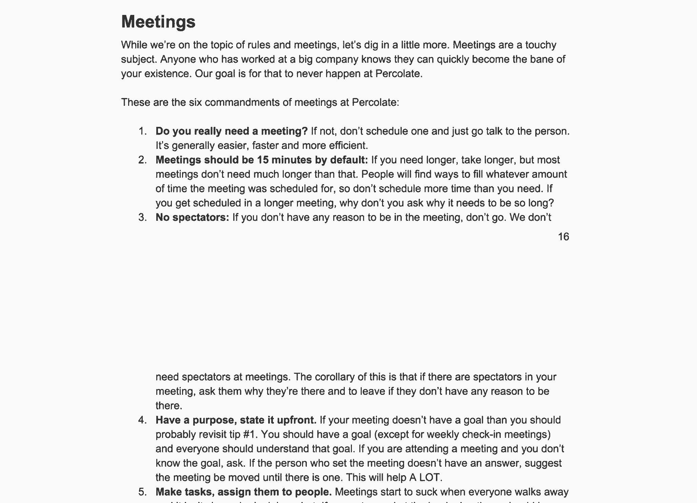
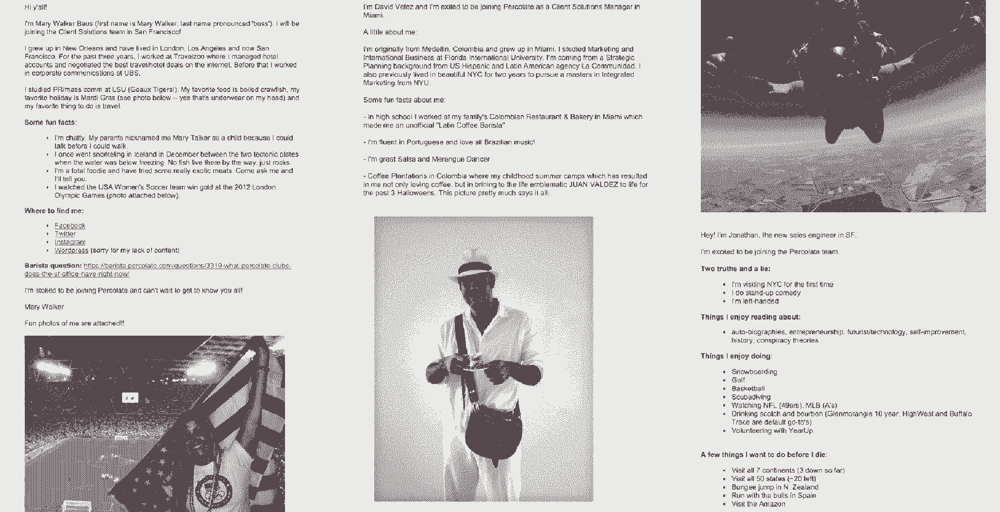

# 您需要的唯一入职时间表:从录用到第一个星期五

> 原文：<https://review.firstround.com/the-only-onboarding-timeline-youll-need-from-offer-to-first-friday>

2013 年初，联合创始人 **[诺亚·布瑞尔](https://www.linkedin.com/in/noahbrier "null")** 向该公司讲述了其价值观以及如何通过快速增长保持其文化的完整性。到 6 月份，这家初创公司的员工人数已经翻了一番，达到 60 人。当 Brier 在年中提到这个演示时，他意识到房间里有一半的人没有听过。从那时起，他知道他必须为他未来的员工和他现在的团队做同样多的计划。这意味着精心设计的入职培训。

通过渗滤液，Brier 已经建立了一个营销平台，使用超过 400 个客户，包括全球品牌，如联合利华，通用电气和万事达卡。在近五年的时间里，该公司已经在六个办公室里雇佣了 300 多名员工。布赖尔来自《快公司》 和 *[《商业周刊》](http://www.businessweek.com/innovate/content/feb2009/id2009029_320890.htm "null")* 的创意帮助他建立了这个团队——可以说，这在渗滤液精心设计的员工入职流程中表现得最为明显。

“这是我们学到的东西:你在一家公司的第一周对你对这家公司的感觉、你如何让自己振作起来以及你会有多有效有着巨大的影响，”他说。"这是你工作经验、能力和情感联系的基础."

在第一轮 CEO 峰会上，Brier 概述了新员工入职时需要遵守的四项原则。为了展示他们在实践中是如何体现的，他详细解释了公司的整个入职流程，从员工签署聘书的那一刻到他们结束第一周的工作。对于强调人才重要性的快速成长的初创公司，这里有一个蓝图，可以帮助整合和激励你的新员工。

在进入每天的入职计划之前，有必要先了解一下指导它的关键原则。这些想法根植于公司以这种方式推出入职流程的方式和原因。

把这些都写下来。在 2013 年的六个月里，一半的员工没有听过 Brier 讲述其价值观和制定这一年的启动计划。他通过设计一个全面的入职计划来解决这个问题，让新人尽快熟悉公司及其文化。这里的关键是写下一切。没有什么比语言更好或更快。普通成年人阅读的速度是她听的速度的两到三倍。另外，文档是现成的资源，而人们并不总是有空。

**分配决策**。对 Brier 来说，文化就是你如何做决定，而你的文化的第一个展示就是入职。“它展示了你们共同的价值观，以及它们如何帮助人们做出符合公司最大利益的决策，”布瑞尔说。“如果不信任人们在没有你的情况下做出决策，你就无法扩大一家公司的规模。如果你要这样做，你需要提供一个决策框架，因为不是任何一个决策都可以。你希望他们做出好的作品。”新员工通过整个入职流程了解我们的价值观。从第一天的文件到办公室参观，再到具体部门的会议，新员工了解到我们的价值观是如何影响决策的。

**让入职** ***每个人的*** **职责**。如果文化最终是做出好决策的框架，那么当员工开始了解这些决策是如何做出的时，向入职提供资源会有很大的回报。“我们的目标是让他们在早期尽可能多地接触到好的决策，”Brier 说。“这就是跟踪和创造观察时间变得至关重要的地方。你希望让尽可能多的现有员工参与这些决策的论证。”

**用心设计**。这是渗滤液的价值观之一，意味着精心制作每一个互动，尊重谁是另一端。“我们的第三位雇员是我们的设计副总裁，所以我们是一家非常以设计为中心的公司。这一直是我们工作的重要部分。Brier 说:“不仅仅是图形和美学，它还关乎对客户和员工体验的认真态度。“传达我们对设计的深切关怀的最佳方式是让每个人都参与创造这种体验。在内部，入职是我们实现这一目标的第一步，也可能是最有影响力的一步。”

如果说营销是你品牌的外在表现，那么文化就是它的内在体现。这从入职开始。

# 入职计划:从录取通知书到第一个星期五

在渗滤液，最好的方式在内部阐明其文化，由良好的设计和每个人精心制作的指导下，是一个结构化的入职计划。在这里，Brier 展示了他的公司招聘新员工的流程，从他们同意加入到第一周结束。该公司正在不断完善其流程，但这是过去几年的计划。

# 已签署聘书

在员工走进办公室之前，渗滤液为员工提供了生命线和品牌赃物。这为新员工提供了支持，并展示了其品牌和价值观。“在收到签名聘书的 48 小时内，每位员工都会收到一封欢迎电子邮件，指定一名联系人来回答任何问题，并通过‘欢迎筛选’调查收集基本信息。这有助于我们为员工的到来做准备，”Brier 说。“与此同时，我们会寄一个欢迎礼包——包括 t 恤、咖啡杯、格兰诺拉麦片、手提袋和手写的‘祝贺’信。”

Percolate Welcome Package

最值得注意的是，每位新员工都会收到一台 Kindle。“这与我们是一个学习型组织的核心理念有关。布瑞尔说:“我们有责任鼓励人们继续阅读，让自己变得更好。“他们可以阅读任何他们想要的东西，但就我个人而言，我觉得 Kindle 是一个非常神奇的设备，可以继续在世界上寻找新的想法。

# 开始日期前两周

每一位远在纽约之外的新员工都被提供了已经安排和购买的旅行和住宿细节。布瑞尔解释道，“我们把所有人带到纽约。以我们的规模和足迹，我不确定这种情况会永远持续下去，但现在，我们让每个人都在纽约度过他们的第一周。”

在早期，尤其是开设新办公室时，你必须输出文化。“这是唯一可行的办法。布瑞尔说:“我们第一次试图在纽约以外的地方开设办事处时，我们试图不从纽约(当时我们的总部)派人去。“这是一个挑战。我们了解到，你必须把已经熟悉公司运作方式的人送到新的地方，以此来输出你的文化。不仅仅是普通人，还有你最好的大使，来确保文化继续以正确的方式建立。”

# 新员工到来之前的星期五

在新员工开始工作的前一个星期五，他们可以查看他们的电子邮件和她头两天工作的日程安排。“我知道关于入职时间表有不同的观点。布赖尔说:“一般来说，我们会努力让新员工超额完成工作，而不是低于计划。“以我个人的经验来看，第一天上班却没有任何工作或者不知道该做什么，这种感觉很奇怪。所以我们尽可能地充实那些日子。”

总的来说，以下是在新员工入职第一周前提供给他们的关键信息:

实用说明，包括电子邮件登录、到达时间和常见问题

第一天的文件(*详见*)，这是渗滤液文化的数字化体现

通过电子邮件介绍给一位“过滤者”，这位员工会伸出手来欢迎新员工，并作为另一位关键人物来回答问题和提供指导

People Ops onboarding 日历，列出了第一周的头两天会议和体式任务

默认为填充新员工的日历。不要让他们觉得他们的出现让你很惊讶。

# 第一个星期一

新住处。渗滤液设置新员工的办公桌，因此没有必要寻找用品。标准发放的物品，如电脑、显示器、笔记本和笔，都已摆放好。Brier 说:“你一进门，你的桌子上就摆满了你开始工作所需的所有东西。“我见过做得不好的事情之一是，新员工需要等到 2 点钟才能拿到笔记本电脑。显然，这是每个人都想做的第一件事。”

员工的工作空间是一个机会，可以加强其强烈的设计美感，并在更广泛的社区中占有一席之地。除了渗滤液橙色调的项目，该公司还使用了其他首轮资本支持的初创公司的产品和服务，如提供时尚办公产品和家具的 [Poppin](http://firstround.com/company/Poppin "null") 。

Desk of a New Hire at Percolate

**引见。**每周一上午，渗滤液会召开业务和产品团队会议。这些每周一次的动员会是一个快速介绍新员工的机会。它是为了快速，而不是全面，以便面孔可以开始变得熟悉。

每个人都做一个简短的介绍，所以焦点会在房间里转移，但不会太笨拙或太冗长。“你只要说你是谁，你从哪里来，你上过什么大学，”布瑞尔说。“我们的一位副总裁是大学篮球迷，喜欢猜吉祥物，大多数时候他都能猜对。”

**大头照。不是每个公司都做专业的头像，但这是一个需要过滤的重要细节。“这是我们做的事情，人们似乎真的很欣赏。布瑞尔说:“我们有一名摄影师，他为每个人拍大头照。“成为社区的一部分很重要，而实现这一点的一个关键是表现出是部落的一部分。因此，如果你去查看一些员工的 LinkedIn 页面，你会发现他们有着非常相似的头像。"**

**第一天文档。创立渗滤液六个月后，布瑞尔写了渗滤液的公司文化的详细文件的原始版本。它存在于谷歌文档中，并在他的员工手中得到发展。“第一天文件是我们把一切都写下来的信念的最好例子。我认为我们做得很好，记录了所有的事情。我们发现，如果你是一个创始人，话的尺度很好，这是很重要的，因为人们与你单独相处的时间更少。有了这样的文档，您的团队可以异步学习和参与。”**

那么，第一天的文件中有什么呢？“有很多事情正在发生，它由它是什么和它不是什么来定义。这不是你的人力资源通读你的福利，”布赖尔说。“这是我们活生生的文件，涵盖了我们文化的方方面面，从公司的起源到我们对会议的看法。主要是关于我们的文化、理念和方法。我们试图专注于解释，而不是规则。事实上，在渗滤液只有三个规则。”

Table of Contents and first page of the Day One Document

"The Rules" from the Day One Document

"Meetings" section of the Day One Document

**自我介绍邮箱。**如第一天文档中所述，员工在第一天结束时发送一封“自我介绍”邮件。这是新员工对公司的问候，分享一些背景和琐事。“公司开头的每个人都发一个。它还包括一张照片和一个链接，链接到咖啡师的三个问题，渗滤液的内部 Q & A 平台。Brier 说:“这个想法不仅仅是提供信息，而是开始与你的新团队进行交流。”

由于渗滤液使用谷歌集团，“自我介绍”电子邮件作为一个新员工发送的每个介绍的存档和灵感而存在。布瑞尔说:“人们回去读它们，是为了获得指导、观点或纯粹的娱乐。”。“最初，我们鼓励人们分享尴尬的照片来取乐，但当我们接触到大约 150 人时，我们认为明智的做法是取消这一提示。所以，我们告诉人们包括任何快照，但尴尬的照片不断出现。显然，每个人都受到了老方法的启发。你不能完全控制这些事情，但这是一种很好的方式，让人们互相了解。”

Examples of Introduce Yourself Emails

# 到第一周结束时

第一天之后，在部门深度讨论中筛选出一些时间，这样新员工就能广泛而有意义地接触到每个团队的动机和责任。“每个部门都在第一周进行展示，”布瑞尔说。“不管你在公司的职位如何，这一点我认为都非常重要。无论你是工程师还是设计师，你都会接触到公司的所有其他部门。”

在这个列表中可能有一些熟悉的入职会议，但这里有一些关于渗滤液如何处理其每个组的新员工会议的更多细节:

**人作战。**由于这是第一个与新员工互动的团队，该团队通常会概述其角色、设施和总体办公室文化。在另一次会议上，团队成员介绍了福利待遇和注册情况。

**IT** 。它回答给员工的所有硬件和软件的初始设置问题。他们概述并提供未来任何技术问题的支持。

**销售**。渗滤液的销售团队分享了它的结构如何最有效地达成交易。

**设计**。设计团队解释了它如何通过其使命来实现渗滤液的品牌:通过一个激励合作的从头到尾的设计过程，为营销人员创造最好的产品套件。鉴于渗滤液的强大的设计文化，该集团解构了其使命的每一部分。“其中之一就是‘从头到尾’。”Brier 说:“我们要求我们的设计师做从研究到视觉设计的所有事情。

**营销**。作为一个建立营销软件的初创公司，这次会议不仅讨论了如何渗透品牌本身，还讨论了它如何以及为什么服务于营销人员。

**产品管理**。在这个环节中，项目经理解释了产品团队的结构，并介绍了开发软件的方法。“即使新员工不需要了解我们使用的技术，我们也希望所有员工都能接触到我们的技术，”Brier 说。“在这次会议中，我们引入了[经理时间表和](http://www.paulgraham.com/makersschedule.html "null")制造商时间表的概念，来教育每一位新员工如何与工程师合作。我们变得细致:不要打断工程师，尤其是当他们戴着耳机的时候。”

对每个部门的全面考察强化了渗滤液的原则，即入职是每个人的责任。这种可见性还展示了决策是如何在整个组织中分配的，以及每个部门是如何管理其权限的。“最终，这些部门深度挖掘不仅仅是为了展示每个团队的工作，而是为了揭示每个团队的核心理念，以及它如何融入公司的整体使命。”

# 中间时间

除了旨在教育新员工了解每个团队的会议之外，还可以安排会议，通过启动关系来整合新团队成员。不管他们看起来有多随意，公司都会安排他们的日程，以免碰运气。

**茶歇**。在与各部门开会期间，新员工接受了使用渗滤液浓缩咖啡机的培训。“如果你用一种咖啡产品来命名你的公司，那就要求你周围有好的咖啡产品。布瑞尔说:“人们不一定知道如何使用它。

**徒步旅行。**在每节课的间隙，一名新员工在办公室里从一个房间走到另一个房间。所以每个雇员都被分配了一个“过滤者”，这是新雇员一周的伙伴。为了促进跨团队协作，过滤者必须来自与新员工不同的部门。“这个人会问候你，带你去吃午饭，把你介绍给每个人。布瑞尔说:“当我们还小的时候，过滤者会知道每个人的名字。“现在我们已经达到了临界质量，我们已经将角色转移到我们的办公室经理，他奇迹般地——不管我们增加多少人——继续知道每个人的名字。”

**滤壶午餐。**在第一周，过滤者带着新员工去办公室最喜欢的附近餐馆享用午餐，并随意了解更多关于过滤的文化。

# 与首席执行官一起总结入职时间

作为大型入职会议的最后一场，Brier 将带领最新成员了解公司的历史、哲学和文化。他分享了该组织如何看待产品与市场的契合度，以及这种契合度如何与其构建营销记录系统的愿景相联系。Brier 解释了为什么公司会记录所有的事情，以及新员工在故事中的角色。

“这个演示可能有 40 或 50 张幻灯片，但实际上需要两个小时。布瑞尔说:“我们的目标不是长篇大论，而是花时间和他们在一起。”“作为一名创始人，我意识到的一件事是，当你的公司非常小的时候，每个人和你在一起的时间比例相当高。如果你是五个人，每个人都可以得到你 20%的时间。对于 200 名员工来说，这要难得多。但创始人的人脉永远是最重要的——尤其是在刚开始的时候。”

不可否认的是，Brier 解释的大部分内容都会在雇员签署聘书到她结束第一周工作之间有所涉及。但他的目标不是原创，而是共鸣。“说到你的信息——当然还有使命、愿景和价值观——重复你自己，直到你觉得自己听起来像一张破唱片。然后开始多重复一些。这是一个思考你在建设文化和运营公司方面的工作的好方法。”

随着公司的发展，重要的是要记住你与人相处的时间并不相称。关注创始人之间的联系。

当 Brier 在 CEO 峰会上传达他关于入职的信息时，他刚刚完成了一个季度，在这个季度中，渗滤液雇佣了超过 75 人——几乎每天一个人。该公司的员工人数增加了 30%。因此，在入职之前，相当一部分人对公司并不熟悉，更不用说上个季度取得的任何成就了。这正是为什么渗滤液开发了一个入职计划，以帮助立即灌输其历史，文化和价值观在其新的劳动力。从一封有趣的“自我介绍”邮件，到一张精心设计的新桌子，再到“第一天”的文件，布赖尔确保他的新员工的第一印象是有影响力的。

“是的，请记住，文化是你品牌的内在表现，没有什么比语言更有影响力。但如果你只拿一件事，不要忘记创始人的连通性，因为从你的角度来看，你永远会觉得比他们与你的团队更有联系。布赖尔说:“只是假设他们与你的联系没有你想象的那么紧密。”。“这尤其适用于那些你还没有雇佣的员工。当你快速成长时，为他们做好计划，就像你为你当前的团队做好计划一样。他们可能不知道他们的入职培训已经开始，但你必须知道。”