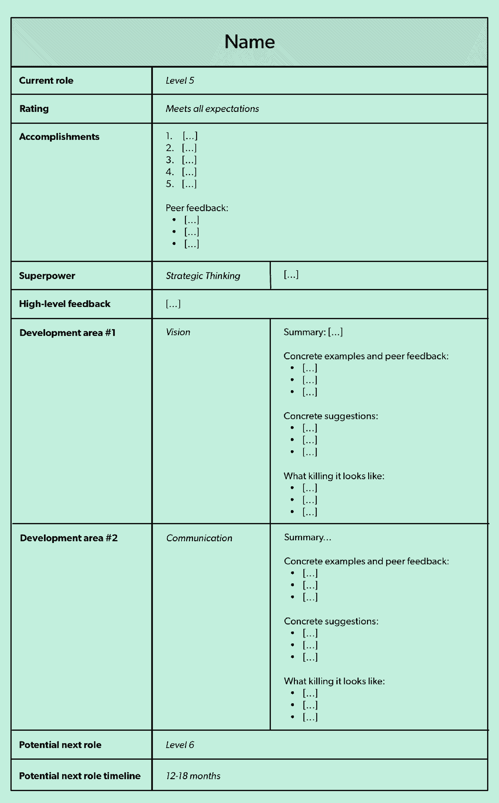
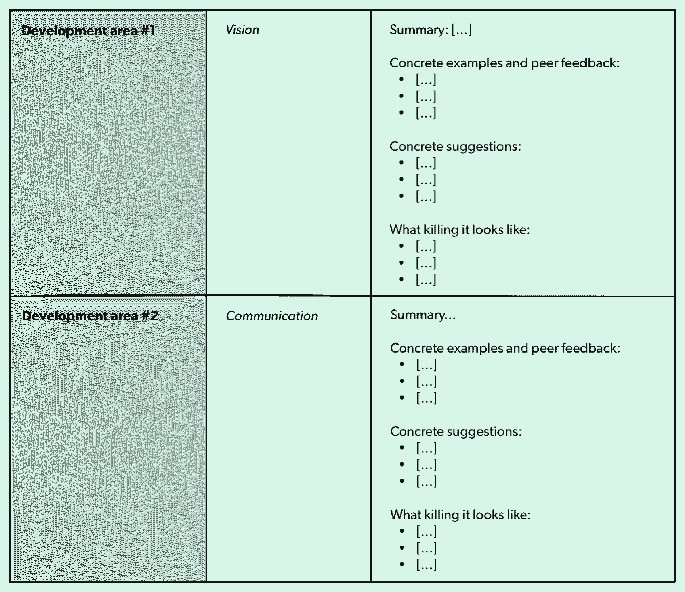

# 绩效评估的力量:使用这个系统成为更好的经理

> 原文：<https://review.firstround.com/the-power-of-performance-reviews-use-this-system-to-become-a-better-manager>

## 介绍

*本文由* ***[【莱尼】](https://twitter.com/lennysan "null")*** *，前产品负责人****[【Airbnb】](https://www.airbnb.com/ "null")****。*

当我还是一名年轻的项目经理时，我的一位经理改变了我的职业轨迹。那是我在 Airbnb 的第二年。我做得不错，但不是很好。我的新经理 Vlad Loktev 接手了我的工作，当时我负责的项目已经推迟了数周。他没被打动。尽管他帮助我把它拉回正轨，我们把它推出了门外，但我知道当绩效评估季节到来时，它将是艰难的。当那个时刻到来时，我确实得到了一个不太好的评价。Vlad 标记了一些重要的发展领域让我关注，包括更多地谈论地位，更积极地确定优先顺序。虽然我本可以垂头丧气地离开，但我却在结束那场表演对话时感到前所未有的清晰、积极和兴奋。

原因如下:弗拉德有一个简单而强大的绩效评估系统。他清晰的反馈、细心的讲解和简单的框架组织一起创造了一个我从未有过的职业发展经历。这让我走上了一条道路，从一个新的 IC 项目经理一跃成为六个项目经理的经理，处理从市场质量到增长的一切事情，最近建立并领导了一个跨职能的 80 人团队，推动 Airbnb 的[供应增长](https://andrewchen.co/grow-marketplace-supply/ "null")。

多年来，随着我过渡到管理层，接受了一些直接下属，并进行了 50 多次绩效评估，我采用了他的系统并将其扩展为**一个端到端的绩效管理框架，使我能够系统地将初级 IC 培养成明星员工，将大麻烦转化为超级优势，并建立了 Airbnb 中表现最好的团队之一。**

考虑到其他经理也可能会发现这个系统很有用，下面我将深入探讨为什么绩效评估通常很糟糕，我们如何解决它们，然后一步一步地详细介绍这个框架。无论你是第一次做经理，正在寻找如何处理第一次评估的指导，还是希望将自己从优秀提升到优秀的有经验的经理，或者是试图建立公司绩效评估系统的早期创始人，你都可以在这里找到模板、策略和现实世界的例子。

# 经理们，避免这些常见的绩效评估错误

一年一次或两次的会议对员工的士气、绩效和发展轨迹产生如此巨大的影响，这种情况很少见。不幸的是，绩效评估被严重利用不足，而且经常做得很差。从直接下属的角度来看，他们更可能引发恐惧而不是希望。对于管理者来说，他们更多的是被当作一件苦差事，而不是一个机会。

做得好，绩效评估提高绩效，调整期望并加速您的报告职业生涯。如果做得不好，他们会加速离开。

以下是经理在绩效评估中最常犯的六个错误:

**1。没有花足够的时间准备。**绩效对话直接影响您的直接下属的长期职业前景、士气，通常还会影响他们的身份。如果你花在填写费用报告上的时间比准备绩效评估的时间还多，那你就做错了。我建议每六个月花至少三个小时(最好是五个小时)为每个直接下属准备绩效评估对话。

**2。过于依赖同事的反馈。**我曾经共事过的一些表现最好的人有时会为了给出正确的结果而生气，这可能会在绩效评估季带来负面的同行反馈。(在领导岗位上尤其如此。)这就是为什么过度索引同级反馈是危险的:如果仅仅根据同级反馈来判断你，你将优化预期的，而不是正确的。作为经理，你需要对直接下属的表现有自己的看法，将同级反馈仅作为一种输入，而不是绩效对话的驱动因素。

**3。没有提供实质性的反馈。**你的报告渴望得到反馈。他们会查看你与他们分享的每一点信息，以判断他们应该把时间花在哪里。不要浪费这个机会。

**4。进行单方面的谈话。**太多时候，管理者只是简单地告诉直接下属他们的想法，该做什么，留下的对话空间太少。领导者希望看起来强大，但往往不担心表现出任何错误的迹象。有效的绩效发展流程是对成长和学习的共同承诺，这需要双向沟通和问责。

**5。没有后续计划。大多数经理都会进行绩效对话，说出他们的想法，然后期望他们的直接下属记住他们听到的一切并采取行动。当他们在下一次绩效评估中重新审视这些话题时，他们通常会对没有取得多大进展感到震惊，并会将缺乏改进归咎于报告。这不是他们的错，是你的错。**

**6。一点也不做。有一个学派认为公司不应该有绩效评估，反馈应该是持续不断的。他们说，当你可以有规律地、即时地给出反馈时，为什么要等六个月才给出反馈呢？事实是，这在实践中很少奏效(也就是说，你得不到反馈)，更关键的是，这实际上是一个错误的二分法。你绝对应该定期提供反馈，坚持每周 1:1，并参与正在进行的职业对话。然而，除了正在进行的工作，定期的绩效评估节奏对员工的职业生涯轨迹产生了不可思议的影响。**

如果你一年中找不到十几个小时专注于你的报告事业，那通常意味着你有太多的报告——或者你不应该成为一名经理。

# 遵循这个三步绩效评估系统

作为上述常见失误的解药，我所依赖的系统由三个同等重要的部分组成:

1.准备

2.传递

3.后续行动

该模板构成了系统的基础，我们将在下面详细介绍每个部分。 **[下面是 Google Doc 版本的模板，方便您自己使用。](https://docs.google.com/document/d/1SXO4eH8ZvpuONpdlxpu6y1ufDS0n6vbciV4IJzpm-sc/edit?usp=sharing "null")**

# 第一步:准备，准备，准备

这是你大部分时间应该花在的地方，因为它建立了接下来的步骤。从收集关于你的直接下属表现的数据开始，既可以从你的下属同事那里寻求意见，也可以直接从个人那里进行自我评估。您希望在这个阶段获得尽可能多的信号，最好是在流程的早期(我通常会在预定的绩效聊天之前至少一个月开始，因为通常需要一段时间来获得每个人的回应)。有很多方法可以做到这一点，大多数公司都有自己的收集反馈的系统，但是你总是可以通过电子邮件采取一种轻量级的方法。

首先，与你的直接下属一起确定五到八个能够提供意见的人。然后发电子邮件(抄送给每个人)问三个简单的问题:

*你好乔，*

为了帮助 Jane 提升事业，我正在收集与她工作关系最密切的同事的反馈。我真的很喜欢你的意见。如果你能在接下来的几天里抽出 5-10 分钟来回答这些问题，我将不胜感激(Jane 也是):

*1。简应该开始做的 2-3 件事是什么？为什么？2.简应该继续做的 2-3 件事是什么？为什么？3.简应该停止做的 2-3 件事是什么？为什么？*

*我会对你的回答保密，除非你告诉我其他情况。请诚实和坦率，因为这将有助于我在 Jane 的职业生涯中给予她最好的支持。如果你还有什么想分享的，不管是好是坏，我都乐意倾听。*

*谢谢！*

与此同时，要求你的报告做自我检讨，用一封电子邮件，如:

你好，简

*在我们即将开始的绩效对话之前，我很想听听您对事情进展的看法。能否请你回答这三个问题，以及你想分享的任何其他问题，并在 X/X 之前回复我？*

*1。在这个周期中，你最大的五项成就是什么？2.在下一个周期，你希望重点发展哪 2-3 个领域？3.你未来两年的职业目标是什么？*

*谢谢！*

当你在等待反馈时，我强烈建议你开始明确你对报告表现的看法。他们做得好的是什么？是什么阻碍了他们？他们在下一个周期应该关注的一两个最重要的发展领域是什么？这是减少偏见、避免完全被同行的话左右的关键一步。

当你开始收集你的想法，当同事的反馈开始涌入，开始充实上面提到的[模板](https://docs.google.com/document/d/1SXO4eH8ZvpuONpdlxpu6y1ufDS0n6vbciV4IJzpm-sc/edit?usp=sharing "null")，你最终会在你的报告中分享它。让我们看一下每个部分:

**成绩:**详细说明人员在此期间的成绩。从报告的自我评估、同事反馈和你自己一整年的笔记中收集这些信息。这里的每一项都应该有意义和内涵。例如，写“达成团队目标”和“按时按预算交付项目 X”，而不是“召开了一次很棒的会议”或“参加了三次会议”在同一个部分，我还喜欢包括我收集的最好的积极的同行反馈的样本，最好是关于这个人的三到五个最好的引用(当然是匿名的)。

**超级大国:**大多数绩效评估对发展领域的评价过高。事实是，如果一个人发挥自己真正擅长的东西，而不仅仅是努力改进他们正在努力的领域，那么他将对组织产生同样大的影响(如果不是更大的话)。在这里，你有机会强调这一点。描述他们最大的超能力，以及如何进一步发挥它。我在过去强调的一些超能力的例子包括讲故事、执行或激励团队的特殊诀窍。有很多[研究](https://hbr.org/ideacast/2016/01/stop-focusing-on-your-strengths.html "null")表明关注优势比纠结于劣势要有效得多。请注意，注意这里的偏见是很重要的，因为我们许多人都不自觉地把男人的相同行为描述为女人的优点和缺点。(关于这个话题[这里](https://hbr.org/2018/05/the-different-words-we-use-to-describe-male-and-female-leaders "null")，这里[这里](https://fortune.com/2014/08/26/performance-review-gender-bias/ "null")，这里[这里](https://hbr.org/2017/04/how-gender-bias-corrupts-performance-reviews-and-what-to-do-about-it "null")可以阅读更多)。

**高级反馈:**接下来，我后退一步，用简短的叙述来总结报告的表现，大约四到六句话。我试图建立一个简单的故事弧线，首先描述他们已经走了多远，然后用一两句话讲述他们如何完成这个周期，最后从高层次概述他们下一步需要关注的内容。

**发展领域:**

确定一到两个下一个周期要关注的发展领域，并将它们放在中间栏中(见下面的截图)。这一部分是绩效评估的核心，因此仔细选择它们是绝对重要的。以下是一些具体的建议，可以帮助你解决这些问题:

什么**最**把人从下一级拉回来？如果你的公司有一个平衡系统，利用它来解释你的想法。

从同行反馈或自我评估中是否出现了任何明确的主题？

如果您的公司进行校准，您是否会从其他经理那里听到一个关键问题？即使这不是你同意的事情，这也是你需要解决的事情。

确保你仍然能为表现最好的人找到重要的发展领域。不管一个人有多了不起，总有一些事情可以让他们专注于更上一层楼。

潜在发展领域的几个例子包括可靠的执行、提高代码质量和更简洁的语言交流。不要担心这里的描述过于全面，因为细节将在下一个专栏中介绍。这里一个常见的错误是包含了太多的发展领域(超过两个就很难在任何领域取得有意义的进展)，或者没有将发展机会具体化(你的直接下属只能猜测你真正的意思)。

*填写每个开发区内的详细信息:*

这个右栏是大部分内容的位置，最终也是大部分面对面对话的位置。这里的目标是让*非常清楚什么是*发展机会，*为什么*如此重要，以及*如何*具体改进它。我经常发现自己直到最后一分钟还在完善这一部分。

对于每个发展领域，包括:

**描述发展机会的简短摘要**。这里有一个例子:*“你的团队在过去的六个月里缺乏一个清晰的战略。如果没有战略，你的团队就不清楚他们正在做的所有工作是如何结合在一起的，这使得团队以外的任何人都很难理解你为什么要优先考虑你要优先考虑的事情。”*

**这种不顺利的具体例子。**包括来自同事反馈的支持这些观点的引文，以及任何你能回忆起的导致问题、导致投诉或在会议中出现的例子。养成一年中记录这些事件的习惯。

**具体的改进建议。在这里，你可以分享你的智慧和经验来提升这项技能。你建议他们具体做些什么来显著提高这项技能？要直接、有雄心、有建设性。最终，这将告知您将在报告中处理的行动项目。我经常包括要阅读的文章和书籍，要交谈的人，要实验的事物。尽可能地利用上面提到的超能力，以及你认识到的任何其他优势，来提升这个领域的水平。例如，如果他们的发展领域是语言交流，建议可以是“参加一个公共演讲研习班”如果他们的发展领域是围绕提高执行力，“一个建议可能是”每周与您的团队进行一次检查，每个人都审查时间表、阻碍因素和优先事项。如果他们的开发领域是接近最后期限，建议可以是“对于接下来的五个项目，花额外的时间估计工作”。"**

“杀死它”会是什么样子。不要低估你的报告，让它们满足于足够好。从未来 6 到 12 个月的完美状态开始回溯，并在这一部分进行描述。不要指望任何人能做到这一点，但要给人们空间和灵感去拓展。

雄心勃勃的人想知道的不仅仅是如何变得更好，而是如何把它打得落花流水。为你的直接下属描绘这幅图画——到下一次绩效评估时,“杀死它”会是什么样子？

**到下一级的时间线:**

最后，在你的报告中留下他们离下一个“层次”还有多远的感觉即使你在公司没有正式级别，也要包括一个让你的报告感到兴奋的有意义的里程碑(比如成为经理、扩大范围或头衔变化)。这里有三种常见的情况:

*如此接近:*这些人处于危险边缘，但却没能挺过来。我使用 6 到 12 个月的估计时间(假设你们每 6 个月见一次面来评估绩效)，并在适当的时候口头告诉他们可能更接近 6 个月。

刚刚升职:这些人不太担心会升到下一级，所以对可能需要多长时间要现实一点。我通常说 12 到 18 个月。

*做得好:*这是最常见的情况，一般要 6 到 12 个月。

# 第二步:交付

绩效评估不仅仅是简单地分享评分、发展领域和薪酬变化，还有很多其他的内容—*绩效评估是如何进行的,*绩效评估引发的对话是实现变化的重要部分。我在绩效评估中得到的评分很低，但我离开时充满活力和动力。我也有这样的评论，我得到了惊人的评分，但对自己的未来不确定。这是因为人们想要背景、清晰，最重要的是，下一步。

你如何传达反馈，以及你的直接下属事后的感受，往往比实际内容本身更重要。

以下是准备进行绩效评估的一些技巧:

**安排时间:**我在我的直接下属的日程表上安排了 45 分钟的绩效对话。我试过 30 分钟和 60 分钟，但 45 分钟似乎特别管用。尽快把它放到日历上，一部分是为了让你的报告知道它的到来，一部分是为了给自己创造一个强迫功能。我通常会在会议前给自己额外预留 30 分钟来准备(无论是打印副本、回顾要点还是排练流程)。

准备你的叙述:无论是在你的笔记中还是在你的脑海中，写下你将如何完成这个回顾。下面我有一些关于如何开始和遵循顺序的建议，但是要找出最适合你的。不要在没有至少考虑好你的介绍和关键点顺序的情况下出现——在这里“即兴发挥”不是一个好策略。

**提前发送:**在聊天的当天，我通常会在会议前几个小时通过电子邮件发送文档。我发现这给了人们处理内容的时间，而不是即时反应。这通常还会在会议期间引发更丰富的讨论。我要提醒的是，这并不总是一个好主意，特别是如果报告对评论感到非常惊讶或失望，所以做适合你情况的事情。

**带上纸质副本:**这是一件小事，但我发现它非常有影响力。我打印了两份这份文件，一份给我，一份给我的报告。我把它们带到会议上，还带了一个荧光笔，我用它来强调我们讨论中的要点。纸张的实体性增加了一个重要的维度，使对话专注于事实并以事实为基础。

准备工作完成后，我通常会这样安排房间里对话:

**介绍:**每次谈话，我都会先缓和气氛，询问对方的近况。每个人都会紧张——想办法让它不那么紧张。然后分享一些聊天的背景:

明确这是一次非常重要的对话，在你们一起经历的过程中，可以提出问题和想法。

提醒他们你是多么认真地对待这些谈论职业发展的机会，强调你在其中投入了多少时间和精力。

分享会议的简短议程，涉及您将如何完成评估，分享任何薪酬更新，并留出足够的时间进行问答。

**分享评级:**某种[评级标准通常有助于](https://www.cultureamp.com/blog/how-to-choose-the-right-performance-review-rating-scale/ "null")报告获得他们所处位置的具体感觉，因此，如果您的组织还没有这种工具，请考虑在下一个周期引入它。我尽量在谈话中尽早分享此人的评价。这是人们头脑中最直接的事情，我发现人们在知道他们“正式”做了什么之前不会完全注意。如果这不是一个令人惊讶的评级，就解决这个问题，但不要纠结太久。相反，向前迈进，这样你就可以花时间谈论提升自己的机会。尽可能确保绩效评定不会让人大吃一惊。你的报告应该通过全年的定期聊天来大致了解他们的表现。如果评级真的有问题，这部分就要特别小心和重视，而且往往涉及到和 HR 的密切合作。

**开始:**浏览文档。如果你提前发了，对方也看了，那就抓住要点。沿途停下来，问一问所有的事情是否有意义，或者他们是否不同意任何事情。确保你在看时间，至少花三分之二的时间在发展领域的细节上。当你遇到棘手的事情时，我会鼓励你变得开放和脆弱。如果可能的话，分享你自己在这些发展领域工作时的个人经历，你遇到了什么困难，以及你是如何克服的。越感觉你站在他们一边，帮助他们成功(而不是评判或斥责他们)，他们就越有可能接受反馈。

谈话过程中需要注意的一些常见反应:

*变得防御或不安:*如果你注意到了这一点，听他们说完，并真正倾听他们的观点。总有可能你错过或误解了什么。即使你没有，你也要给他们一个分享观点的机会。如果它开始转圈，试着缩小，继续下一个点。不要在一个问题上卡住。如果谈话结束时仍然是一个问题，你没有被动摇，坚持你的观点。明确表示不同意也没关系。讨论接下来的步骤，并同意在接下来的 6 到 12 个月里观察事情的进展。

*沉默不语:*这是最典型的反应。复习是一次吸收大量信息，所以大多数人都处于倾听和处理模式，这很好。但是，如果感觉太安静了，就简单地指出来，例如，"我注意到你真的很安静，我只是想确定这一切都有意义？在我们继续之前，有什么想法或问题吗？”

看起来沮丧或不知所措:当你有太多的信息要分享，或者评价是负面的，这种情况就会发生。在这些情况下，放慢速度。继续检查。我有时会停止回顾谈话，转而进行一次推心置腹的交流。找出这个人到底是怎么回事。有时他们会比他们需要的更难接受。有时他们生活中的其他事情也会在这里出现。回到人与人之间的联系，不要担心通过审查的每一个细微差别和细节。

**分享薪酬更新(如果有):**最后，分享任何薪酬更新。这通常会以一种愉快的方式结束事情。保持简单，分享事实，祝贺对方的成就。员工很容易认为加薪是理所当然的，不把它当作一件大事，所以把它当作一个机会，提醒他们你有多重视他们的伟大工作。

留出讨论的时间:然后，对任何遗留的问题和想法敞开心扉。你的报告有什么不一致的地方吗？他们有什么想深入研究的吗？对于下一个周期的预期，你还能给出更多清晰的解释吗？尝试给这个至少五分钟。也就是说，如果没有什么紧急的事情，我尽量不在这里逗留太久，尤其是如果事情看起来很顺利的话。人们通常需要时间来处理和思考他们听到的一切，您可以在未来的 1:1 中跟进。

**后续行动计划:**最后，将这次讨论转化为行动计划(你会在下面找到如何做的指导)。这将允许你把所有的想法、动机和动力引导到一个持续的结构化讨论中，让你们双方都有责任做出改变。

**Outro:** 想办法以积极的方式结束。提醒他们对公司有多大价值(如果他们有)，你有多喜欢和他们一起工作(如果你有)，他们在你的公司有多大潜力(如果他们有)。最后但同样重要的是，让他们知道，如果在你下次聊天之前发生了什么事，要毫不犹豫地联系你。

Lenny Rachitsky

# 第三步:跟进

正如乔治·萧伯纳的名言，“沟通中最大的问题是产生错觉，以为沟通已经发生了。”

我们希望相信我们精心选择的智慧之词被正确地解释，并铭刻在我们的报道中。假设他们不是更安全。

在我管理生涯的早期，我有一份表现不佳的报告。我花了几个小时准备我们的表演聊天。我确定了发展领域，包括了大量的例子，并分享了大量的建议。在长达一小时的会议中，我讨论了这个问题。我觉得我产生了真正的影响。一个月后，我重温了我们的讨论，感觉好像从来没有发生过。我的直接下属对我提到的几点有模糊的记忆，并有明确的改进愿望，但 95%的信息都丢失了。

在那一刻，我学到了两个教训。首先，作为经理，如果我的报告没有记起应该关注哪些发展领域，那是我的错。第二，**我将绩效对话视为结束，而实际上这只是绩效发展过程的开始。**

解决这两个问题的方法很简单——留出专门的时间来检查，并让彼此负责。以下是实现这一点的方法:

**制定一个双面行动计划:**在你们谈话结束时(见上文)，根据绩效评估文件，要求你的报告列出五到七项他们希望在未来六个月内采取的具体行动，并将它们添加到一个超级简单的电子表格中。趁他们还记忆犹新，给他们一周时间来做这件事。[这里有一个你可以使用的模板](https://docs.google.com/spreadsheets/d/12Z8euSULYHGSKgJMR47QuK2cEyHm0B-6hAmanqtVqQ0/edit?usp=sharing "null")，还有几个例子:

除了这份清单，确保他们还包括为了成功他们需要从*你*那里得到的东西。重要的是你的报告拥有这个过程并选择项目(由你输入),因为他们需要被激励去做这些事情。这份清单应该包括你在他们的绩效评估中记录的具体建议、你的报告个人希望改进的地方，以及你的报告需要从你那里获得成功的地方。在每个项目旁边放置一个状态颜色，并且每个月更新一次。

**安排一个一小时的月度检查:**立即把这个会议放到日历上。我称之为“每月职业辅导”，以区别于我们每周的一对一辅导。这些会议的重点是从日常工作中抽身出来，专注于职业和绩效发展。不要谈论项目进展如何，即将到来的截止日期，或者阻碍因素(那是一对一的事情)。在每次会议前提醒你的报告更新他们的电子表格的状态和他们想腾出时间讨论的任何新的讨论项目。

**在职业辅导时间:**在这次会议中，你有三个目标:

1.查看您的报告在他们的发展领域取得的进展。

2.确保他们拥有一切必要的东西，以便向前推进。

3.确保他们关注的行动项目列表仍然是正确的。

会议的主要内容应该是你倾听、提问，以及(在真正必要的时候)提供建议。你的报告应该引导会议——浏览行动计划中的每个项目，分享简短的更新，并与状态颜色保持一致。我发现大多数时候我的报告与他们的评估是一致的。如果你不同意，讨论一下。在整个讨论过程中，不要确切地告诉你的报告要做什么，而是帮助他们自己想出来。当被问及答案或建议时，转过身来问“你认为正确的方法是什么？”或者“在我回答之前，你觉得呢？”([大卫·罗克的这本书](https://www.amazon.com/dp/B000XUBC04/ref=dp-kindle-redirect?_encoding=UTF8&btkr=1 "null")和[朱莉·卓](https://firstround.com/review/the-essential-questions-that-have-powered-this-top-silicon-valley-managers-career/ "null")的文章教会了我很多如何通过问好问题成为更好的管理者。)

**两次聊天之间:**记录你的报告做得好、做得不好或者总体上做了一些值得注意的事情。尽可能地在你的报告中实时分享这些东西，或者每周 1:1 地分享，但是也要把它们保存在一个运行文件中。例如，“7 月 10 日-与高级管理人员进行了一次出色的会议”，或“9 月 3 日-为第三季度制定了一个非常强有力的战略”，甚至是其他人的反馈(“1 月 4 日-斯派克与我分享了他对简主持会议的能力的印象。”)为此，我为自己的每份报告都保留了一份单独的谷歌文档。除了 Google Docs，还有一些简洁的反馈和绩效管理工具，比如 [Matter](https://matterapp.com/ "null") 、 [Culture Amp](https://www.cultureamp.com/ "null") 和 [TINYpulse](https://www.tinypulse.com/ "null") 可以帮助你跟踪全年的绩效。

# 把这一切联系在一起

作为经理，世界上最美好的感觉就是看着你的直接下属成长。我永远不会忘记一个初级项目经理，他来到我们的团队时，在协作技能方面有相当大的差距。在确定了发展领域后，通过上述过程一起工作，然后在六个月后再次访问它，我很高兴地看到几乎每一个同行反馈都指出这不再是一个问题，事实上，这份报告的发展领域已经变成了一种优势。所需要做的就是给绩效评估注入更多的结构、注意力和意图。

以下是这一过程的回顾:

**1。准备**

从你的报告和他们的同事那里收集直接反馈

捕捉他们的成就

描述他们的“超能力”

对他们的表现写一个简短的高度概括

确定 1-2 个发展领域，用例子，具体的建议，以及“杀死它”会是什么样子

分享他们下一个职业里程碑的时间表

**2。交付**

安排一下

准备叙述，带上纸质副本

打破僵局

分享他们的评分

浏览细节，将大部分时间花在发展领域

股份补偿

创建跟进行动计划

留出讨论的时间

**3。跟进**

安排每月一小时的辅导谈话

一起回顾行动项目，随着事情的进展进行调整

捕捉并分享全年进展顺利和不顺利的例子

即使您的公司已经建立了反馈或绩效评估流程，您也可以轻松地将该系统映射到该流程中。我发现，经理们有很大的空间来拥有更加定制的、个人化的方法，这种方法可以在周期和组织变革中坚持下去。不要只是拿着高高在上的表格和谈话要点敷衍了事。把腿放进去。你会立即注意到这种影响，并开始成为一名更好的经理。

*呼呼大起来了* *[弗拉德](https://www.linkedin.com/in/vladimirloktev/ "null")* *举了太多的东西来命名，包括他对这个职位的贡献，还有对* *[海伦西姆斯](https://www.linkedin.com/in/helensims/ "null")***[庞雅文【拉奇斯基】](https://www.linkedin.com/in/yelena-rachitsky-6944198/ "null")***[埃里克鲁斯](https://www.linkedin.com/in/ericdruth/ "null")* *，以及* *[布雷特·赫尔曼【特](https://www.linkedin.com/in/bretthellman/ "null")***

***摄影由* *[邦妮·雷·米尔斯](http://www.bonnieraemillsphoto.com/ "null")* 完成。**