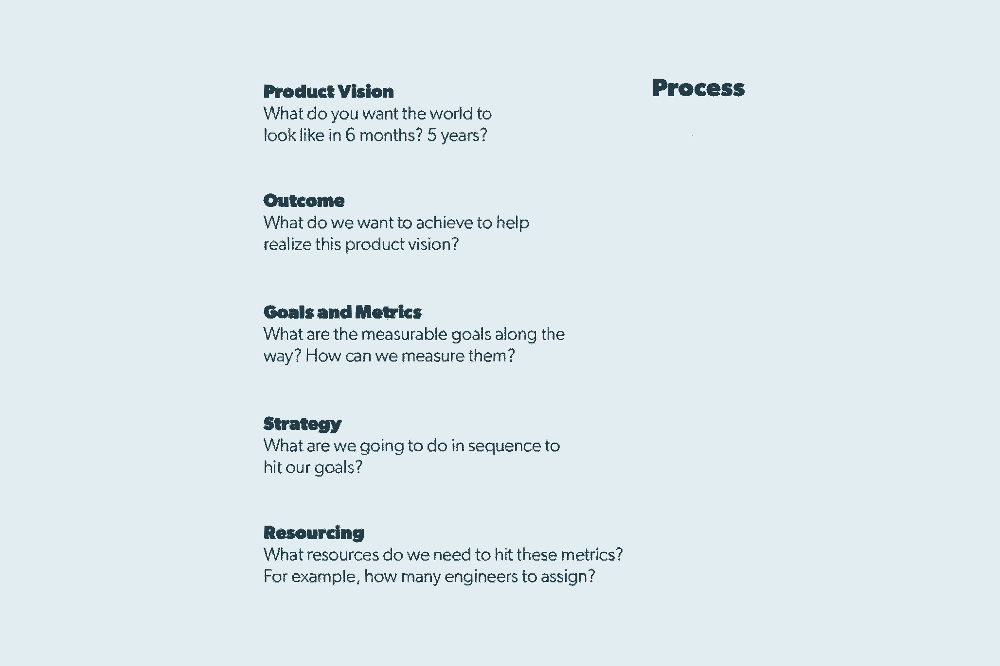

# 弹性产品团队的力量——Airbnb 首个关于如何建立自己团队的项目经理

> 原文：<https://review.firstround.com/the-power-of-the-elastic-product-team-airbnbs-first-pm-on-how-to-build-your-own>

[乔纳森·戈尔登](https://www.linkedin.com/in/jgolden "null")、 **Airbnb** 的首任产品经理和现任产品总监知道，在他的工作中，灵活性可以让你走得更远。去年，他甚至去了古巴。

虽然这个岛国实际上一直对 Airbnb 关闭，但 2015 年与美国重建外交关系打开了一扇门——该公司领导人希望快速穿过这扇门。“我们认为将这个社区融入世界和 Airbnb 生态系统是很重要的，”Golden 说。

任何数量的 Airbnb 团队都可以将古巴项目添加到他们现有的工作量中，但鉴于进入高度受限的市场和管理资金转移的独特挑战，这将需要太长的时间。因此，他们决定建立一个新的、专门的团队，这个团队隶属于金头盔的**支付**组织。

在 10 周内，一个跨职能团队——产品经理、设计师、工程师和从组织其他地方重新分配的数据科学家——组建起来了。包括法律、运营和通信在内的公司其他部门提供了广泛的支持。对于跨职能部门工作的每个人来说，这都是一项艰巨的任务。但是两个月后，最初的基础设施在古巴建成并开始运行。这个团队几乎一成立就被解散了，维护古巴业务的持续工作被分配到现有的产品领域。

一个不寻常的案例？也许吧。但它象征着**弹性的、视觉驱动的产品管理方法**，这种方法让 Airbnb 重新想象了旅行。在这次独家采访中，Golden 描述了如何建立由实际需求驱动的高影响力、模块化团队。他走过他用来分配最热门商品的决策框架:工程师。他解释了为什么——当每个人都朝着一个明确的公司目标努力时——让团队扩张和收缩实际上会让你保持一致。

# 第一步:确保你的愿景得到充分阐述

如果 Golden 可以分享一个组织原则，那就是:**围绕结果而不是功能来设计你的产品团队。**

这就是定义清晰愿景的切入点。太多的团队跳过这一步，因为他们想开始具体的工作，而不是把时间浪费在感性的目标设定上。当你这样做的时候，你最终会浪费更多的时间。

“很多人打电话给我，问他们应该如何构建产品组织。我总是告诉他们要根据结果来做。如果你是基于特性来做的，那么不管这些特性是否有用，你都要让它们永存。”你的公司愿景是你希望世界在五年多后变成什么样子——结果是团队的要求，将帮助你实现目标。Golden 说:“结果决定了我们想要为社区中的人们实现什么。(稍后会有更多相关内容。)

你的产品愿景和由此产生的团队成果并不是董事会议和投资者推介中的空想。对你公司的日常运作来说，它和你的网站指标或收入一样重要——就像这些数字一样，你应该经常清晰地传达出来。

例如，Airbnb 对支付团队的愿景是“创造一个人与人之间的联系变得更少交易、更人性化的世界。”通过将客人和主人之间的支付交易元素在线化，该团队使该过程尽可能无缝，并允许社区以更有意义的方式参与。但这是一个持续的挑战——戈尔登知道，要实现这个更大的目标，还有更多的事情要做。与此同时，更直接的任务是一个有用的工具:“建立一个准确和可扩展的全球支付平台，为客人、主人和合作伙伴提供无摩擦的体验。”

这并不是说，你需要确定一个愿景，让你的公司从首轮融资一直发展到首次公开募股。坦白地说，如果你想，你可能做不到。你的产品愿景会因为各种原因而发展——例如，你的业务需求或你所服务的社区的变化，或者仅仅是因为你已经改进了你开始构建的东西。

消费科技创业公司的兴奋之处在于，你周围的商业和环境变化如此之快，你必须以牙还牙。

保持你的产品愿景的动态性，并定期重申你的目标。

“我敢肯定，马克·扎克伯格在早期没有想到脸书会像今天这样大，”戈登说。“现在，他们能够更广泛地思考如何以一种非常有意义的方式连接世界。但他们之所以能够实现这一目标，是因为他们能够在取得一系列成果的同时，慢慢扩展这一愿景。”

戈尔登建议创始人最初关注那些有效的东西，并有机地发展成他们的产品愿景。他说:“我看到公司规模扩张得太快了。“通常，如果某样东西正在工作，你加倍努力，那么无论你测量的是什么，都会显著加速。如果某件事只完成了一半，而你需要去做其他事情来实现你的目标，那么它可能真的没有你想象的那么好。”

# 步骤 2:建立模块化团队以获得最大的灵活性

Airbnb 首先通过组建跨学科的产品团队来优化敏捷性。一群产品经理一起坐在牛棚里，远离组织的其他部分，这种想法令人讨厌。相反，产品经理与工程师、设计师和数据科学家相匹配，从各个方面解决业务问题。

如果在同一个项目上合作的人是脱节的，或者他们不总是互动，那么许多创造力的魔力将会消失。

这种模块化的团队结构是 Airbnb 在成长为科技巨头的过程中保持早期创业精神的方式。“在早期，我们曾经开过一次大型会议，所有的工程、设计、数据科学和产品管理都在一个房间里。当然，当时可能只有 20 个人，”戈尔登说。“我们从那里发展起来，但我们保持了团队运作的核心。”

每个团队内部都没有等级感，也没有自负者的空间。“每个人对数据、设计、工程和产品都有相同的影响力。”如果一个团队需要向公司的其他人传达一些东西，它会选择合适的领导—例如，一名数据科学家会传达一项重大 A/B 实验的结果。“这是一个有凝聚力的团队，而不是一个可能更像极权主义领袖的人。”

# 第三步:雇佣这三种类型的项目经理——你会需要它们

在建立模块化产品团队的同时，创业公司也需要为自己的舞台配备人员。当你向产品/市场契合度推进时，你将需要一种与你在扩大规模时非常不同的 PM“类型”,或者，当你实现规模并转移到平台计划时。这些关键阶段中的每一个都可以由三个原型产品经理中的一个来最好地解决(一个永远有用的框架，金色笔记，最初由[西蒙·沃德利](http://blog.gardeviance.org/ "null")开发，改编自罗伯特·x·克林格利 1992 年的书[偶然的帝国](https://www.amazon.com/Accidental-Empires-Silicon-Millions-Competition/dp/0887308554 "null")中的概念):

**先驱者**

“这些人对建造原型感到兴奋，对努力的风险以及在世界上创造全新的东西感到兴奋，”戈尔登说。听起来很像创始人？这不是巧合。创始人通常是他们公司的第一个产品人——终极先锋。但是，无论你是自己把它带到桌面上还是雇佣它，这都是一家公司在开始时需要的 PM 能源类型。

如何发现他们:这些敢于冒险的先锋需要斗志昂扬，所以寻找已经有创业经验的人。那可能是他或她自己公司的 CEO，或者甚至是一个领导一个大公司探索团队的项目经理(例如，谷歌新产品领域的领导)。然而，不要认为任何创业经历都等同于先驱经历。“建造了一些东西的人和维护了一些东西的人之间有着巨大的差异，”Golden 说。

以下是他推荐用来判断一个产品经理是否有先锋潜力的问题:

你发现用户需求的过程是什么？

你如何知道你的产品是否符合市场需求？

告诉我你做了一些不可扩展的事情来快速启动一个产品的时候。

我在考虑建造“X”——你怎么做才能在 10 天内建成它？

对于这些问题中的每一个，你都在寻找既深思熟虑又简明扼要的回答。当心那些绕圈子或提供大量不必要的上下文的候选人。他们应该清楚地知道自己在每种情况下会说什么，并且能够清楚地表达出来。他们的解释应该与你公司的节奏、速度和文化相吻合。

**定居者**

一旦你实现了产品与市场的契合，你的关注点就需要从创办一家公司转移到创建一家公司。为了扩大规模，你需要定居者。“这些产品经理更关注影响力。他们真的很关心接触到很多人。那是稍微不同的妆容；他们痴迷于增长，痴迷于优化。”

定居者可以来自各种背景。大多数时候，他们具有高度的分析能力，并拥有与数据科学携手合作的不可思议的能力。大型消费者互联网公司有许多定居者，他们致力于完善和优化产品体验。

**如何发现他们:**寻找那些在 A/B 测试中发现创造力的人，那些受指标驱动的人，他们能准确地告诉你他们将如何衡量新功能的影响。

**以下是戈尔登建议用来判断一个产品经理是否是天生的定居者的其他问题:**

你会如何打破我们的转换漏斗？

你喜欢如何设置 A/B 测试？

我们有一个特性“X”——这个特性的用例是什么，你如何衡量它？

告诉我你通过产品影响用户行为的一次经历？

**城市规划师**

这些是您的平台经理，当需要构建必要的基础设施和系统来处理规模并适应您的产品当前和未来的用例时，他们会接管。

优秀的城市规划师也是企业家。许多城市规划师都有技术背景，但这并不是硬性要求。他们还可以与技术远见者一起工作，产品经理可以引导远见，为更广泛的产品团队实现其实用性。在 Airbnb，他们为核心基础设施团队增加了产品管理支持，以帮助他们建立技术工具，为未来几年的业务规模做好准备。

**如何发现它们:**“城镇规划者必须能够综合大量不同的信息，以构建服务于现有和意外用例的技术，”Golden 说。不要只寻找能够打下坚实后端基础的老黄牛——这些项目经理还需要对基础能够支持的未来产品计划的愿景。

**以下是判断一个人是否有能力成为城市规划师的问题:**

您会用什么标准来衡量平台产品的成功？

告诉我你构建一个支持多种用例的系统的时候。

你如何平衡已知案例和未知未来用例的构建？

怎么知道平台是太死板还是太灵活？

一个全新的企业需要知道什么时候带来下一波产品管理。但即使在一家老牌公司，这三种类型的产品经理都至关重要。“产品团队需要每一个项目经理都敏捷、反应灵敏。否则，这项业务无法长期持续下去，”戈尔登说。“我们在三个主要类别中分配产品资源:专注于现有产品的核心计划、探索业务潜在增长领域的新计划，以及专注于构建基础技术基础设施的平台计划。”开拓者和定居者不会因为你的规模而变得过时。

城镇建设并不是路的尽头——它只是新一轮开拓的基础。例如，Golden 的支付团队主要负责构建一个平台。但由于资金交换触及到该公司的一切，他的团队也为 Airbnb 的许多新嘉宾和主持人对话做出了贡献。“我们总是在想，‘好吧，我们如何利用我们已经建立的、目前正在全球转移大量资金的系统，来思考业务的发展方向？’"

如果做得好，这三种项目经理的工作会形成一个循环，从而造就一个十亿美元的公司和一个昙花一现的奇迹。

# 第 4 步:用清晰的过程揭开资源项目的神秘面纱

“一个产品团队需要随着产品、人们如何使用产品以及企业周围的环境而发展，”Golden 说。“它需要一种不断变化的文化。”但是你怎么知道什么时候该实施改变呢？为此，你还需要一块基石:**一个设定和衡量目标的一致框架。因为如果没有一个测试假设的过程，你可能会很快发现你与其说是在重复，不如说是在转动你的轮子。**

**对于 Airbnb 的黄金和产品领导来说，这个过程看起来像这样:**

当你到达这个流程图的底部时，资源配置决策可能并不容易，但它们会变得更加清晰。

“每个人总是想要更多的资源，”戈尔登说。“在大多数情况下，没有人会说‘我很好，我不需要成长。’人们觉得他们的工作可以为产品、社区做出贡献，在一个高速发展的公司里，这通常是真的。“因此，产品经理需要与创始人和其他公司领导人合作，确定优先事项。

决定下哪笔赌注是 PM 的职责。

然而，完成这个流程图并不是一件一蹴而就的事情。“你需要不断地重新审视和挑战核心的基本假设，以确保你根据我们今天所知道的事实做出正确的决定，”戈尔登说。

每个季度，他都会对他的每个团队进行一次评估，以确定他们对业务的影响以及他们是否达到了目标。“我们会说，‘好吧，如果这个团队已经建立，我们已经阐明了我们所有的目标，但我们没有实现其中一个目标——或者出于某种原因，有些事情发生了——为什么我们会发生呢？发生了什么事？"他又一次从图表的顶部开始. "第一个问题是“这个产品或项目实际上符合产品愿景吗？”通常是这样，但其他时候我们不得不令人不安地诚实。"

**以 Airbnb 的愿望清单功能**为例，它最初被设想为单用户“收藏夹”工具。“但 Airbnb 上的大多数旅行都有不止一个人，一旦它被使用，我们就会发现我们实际上并没有解决真正的需求，这是为了分享最爱和选择最佳的集体住宿地点，”Golden 说。

到今年该工具重新推出时，产品愿景已经被推倒重建。“我们不得不退一步说，‘好吧，这真的是我们想要的产品吗？它是否以积极的方式改变了人们的行为？“有了一个新的产品愿景，一个基于数据的愿景，该团队将愿望清单重新打造为一个规划旅行的协作工具(并看到了使用量的显著增长)。

但是，如果你的产品或项目仍然*没有*解决愿景，那么继续沿着规划框架往下走。“在一天结束时，如果你意识到一个项目没有成功完全是因为你的度量没有达到目标，通常罪魁祸首是资源配置，”Golden 说。这是重新调整团队资源的一个明显信号。

# 第五步:快速集结队伍，必要时消灭他们

“如果你有一种迭代的文化，一个灵活的团队，包括三种类型的产品经理的平衡，那么重新调整是常有的事。这没有争议，”戈尔登说。

无论你发现了一个人手不足的团队，还是出现了现有团队无法解决的新问题，或者想要抓住一个新生的机会，都不要回避将员工转移到他们最有价值的地方。

以国际化为例。古巴并不是 Airbnb 的目标第一次需要这种弹性团队建设。当该公司在 2012 年首次大举进军国际市场时，组建了一个团队来应对一系列新的挑战:翻译、新的支付系统以及其中的用户界面变化。与古巴的情况一样，一旦这些系统和平台到位，维护它们的任务就再次分配给了组织的其他部门。

今天，该公司正在重组一个国际化团队，以应对其最新的新市场。“该团队已经从 2012 年的翻译和内容本地化转向在这些市场开发更深入、更具文化本地化的产品体验。我们需要一个专门的团队来思考这些问题。"

**很明显** ***为什么*** **一个公司可能想从零开始组建一个产品团队，但是怎么做呢？**

当一个产品经理参与到一个特定的团队中时，你如何说服她放下一切去应对一个新的挑战？如果你已经建立了以愿景为基础的公司文化，这将是你真正收获回报的地方。团队将被购买来完成一个目标，而不是将一个特定的功能或产品推向市场。“如果你从一开始就做对了——正确地表达了你的愿景、结果和目标——那么关于重新分配人力资源的对话应该会容易得多，”戈尔登说。

让一个团队退役通常是这个等式中更难的一面，但同样，让你的产品愿景成为一块试金石。带领团队了解你的目标设定框架，并找出哪里出了问题或发生了变化。是产品愿景、战略、目标、指标或资源中的缺陷吗？“如果你经历了这个过程，那么团队会更容易理解事情不如他们想象的那样发展的原因，”Golden 说。此外，在迭代的产品管理文化中，个人没什么好害怕的。

如果不接受失败，你就无法实现真正的迭代文化。“验尸的关键显然是不要指责任何人。这一切都是为了吸取教训，并找出事情发生的原因。”

从 2012 年到 2013 年，Golden 管理了一个专注于用户工具的团队。他们在预订后处理所有客人和主人的互动，并处理许多关于预订变更、退款和取消的问题。但是他们没有一个明确的与结果相关的使命。

“我们意识到，最好将团队分成两个以结果为导向的团队——预订流程团队和主办团队，”他说。“这使得这两个团队能够通过更广泛但总体上更简单的范围来实现他们的任务。”

# 重要的提醒:你必须重复你自己来做这些工作

当然，Airbnb 已经达到了很少有初创公司能达到的规模——但 Golden 并没有像你想象的那样远离早期阶段。“随着 Airbnb 产品组织的扩张，每个团队实际上都开始变得像 Airbnb 几年前的样子。他说:“这些团队的规模越来越大，几乎都是初创公司。像任何优秀的创业领导者一样，戈登知道保持团队运转的关键是不断的沟通。

**为此，他紧紧抓住三个简单的支柱:过程、背景和倾听。**

**流程**:正如我们所见，拥有一个清晰的公司决策框架是关键。透明地讨论这一过程的结果也是如此。

背景:然而，清晰的愿景是不够的。你需要确保团队中的每个人也看到这个愿景。不要害怕重复你自己。其实一定要重复自己。“你必须一直与人交流，”戈尔登说。“当新成员加入团队时，告诉他们事情如何演变的历史。这种背景通常非常有用。”

**倾听**:作为团队领导，戈尔登也敏锐地意识到他的沟通责任是双向的；正如他反复与他的团队分享公司的愿景一样，他也将他的团队的反馈贡献给领导层正在进行的愿景制定。“如果不与个人进行实际交流，并确保解决他们的问题，你就无法做出最佳决策。”

“无论是在产品、工程、设计还是数据领域，传达什么和为什么是团队领导的工作。但是如果人们不同意，那么你必须重新审视他们。任何人都可以反击。挑战核心基本面假设真的很健康。”

除了这三个沟通原则，Golden 并没有规定团队应该多长时间见一次面，或者他们应该如何管理他们的内部消息。“我们允许每个团队找到自己的节奏、自己的流程和结构。我们喜欢看到每支球队都有自己的特色——一点点个性。”

当你做建立使命驱动型文化的工作时，你可以在细节上有所变通。

“再说一遍，产品管理的大部分工作是确保每个人都明白是什么和为什么，”他说。“让团队自己想办法实现这一点，可以让他们做得更好，并在工作中找到更多意义。我认为每个人都希望在自己的日常工作中拥有发言权——不仅仅是在科技领域，在生活中也是如此。”