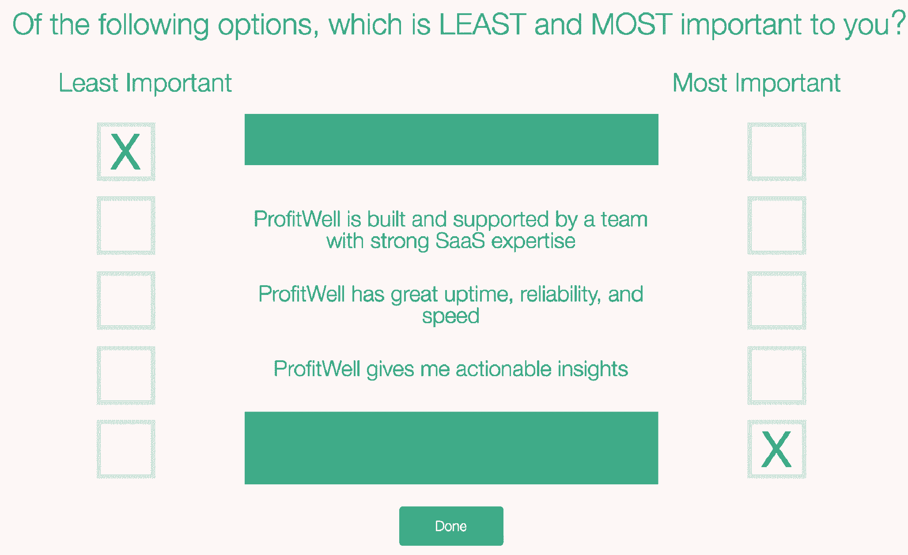
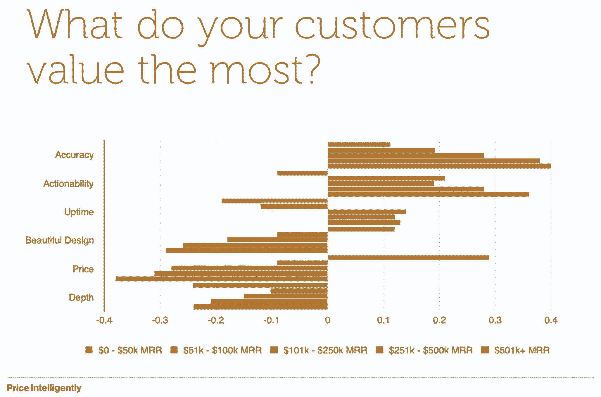
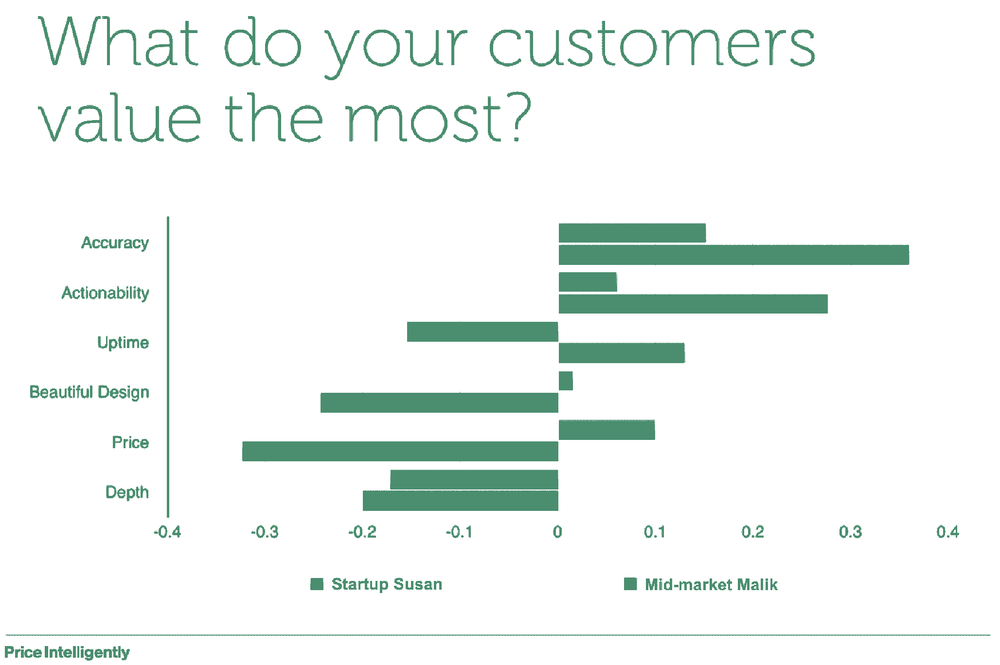
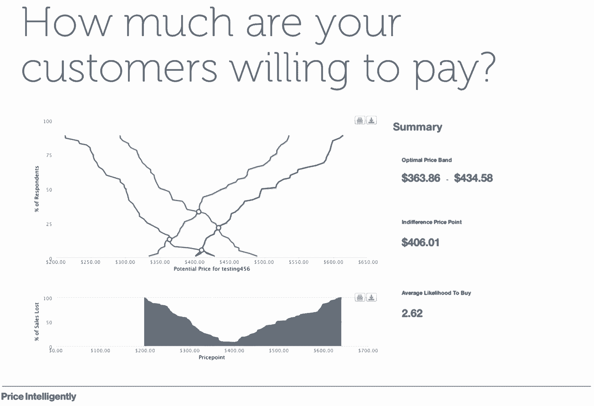
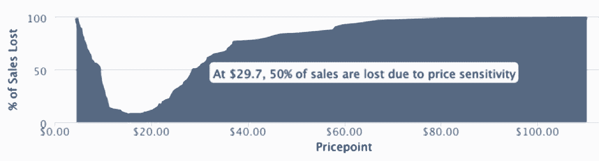
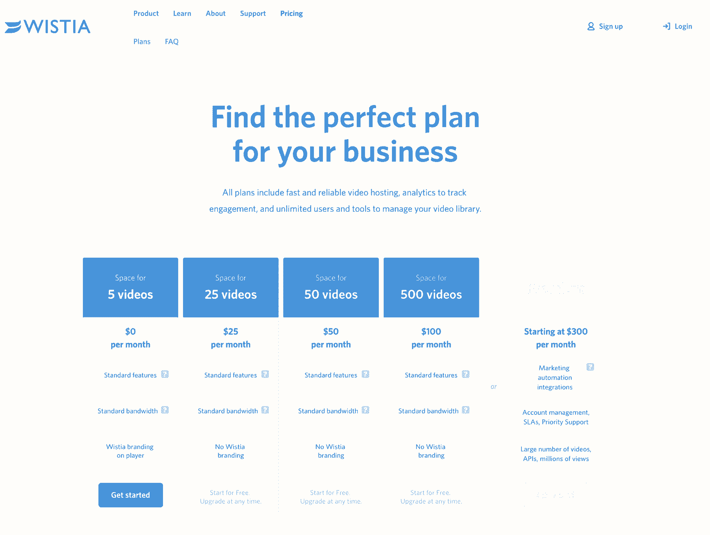

# 价格合适:确定定价策略的基本技巧

> 原文：<https://review.firstround.com/the-price-is-right-essential-tips-for-nailing-your-pricing-strategy>

如果你不会明智地看待 **[定价](http://www.priceintelligently.com/ "null")** 联合创始人兼首席执行官 **[帕特里克·坎贝尔](https://www.linkedin.com/in/patrickccampbell "null")** 关于定价策略的重大后果的话，请留意伯克希尔·哈撒韦公司的沃伦·巴菲特的智慧:“评估一家企业最重要的决定是定价权，”这位奥马哈先知说，将定价权排在良好管理之上。“如果你有能力提高价格，而不会把生意输给竞争对手，那你的生意就非常好。如果你不得不在提价 10%之前祈祷，那你的生意就糟透了。”

这些年来，坎贝尔看到初创公司和跨国公司都在努力完善产品，但在定价时却漫不经心地竖起手指。2011 年，Campbell 推出了 Price Intelligently，以帮助 SaaS 公司，如 [Atlassian](https://www.atlassian.com/ "null") 、 [Hubspot](http://www.hubspot.com/ "null") 和 [Insightly](https://www.insightly.com/ "null") ，增加来自用户的收入和知识。在此之前，他在私营和公共部门担任战略家角色:通过广告解决方案帮助谷歌的中端市场广告商发展业务，并在国防部担任情报分析师。

在这次独家采访中，坎贝尔解构并介绍了定价策略的要素，以使初创公司更有效地获得客户。定价背后的基础工作是创建、测试和完善买家角色，以便它们反映在您的定价页面上。要做到这一点，需要一个三阶段的过程:定义你的客户，从他们那里收集数据，并应用你的发现。虽然这些步骤听起来很简单，但执行起来并不容易。让我们开始吧。

# 定义您的客户

也许你所在的初创公司是由以前从未处理过定价的人创立的，或者是在新市场推出产品的人。你的第一步是从建立量化的买家角色开始，这是你的目标客户的数据驱动的概况。我们的目标是创建相关且有利可图的客户群类别，以确定部署资源追求的最重要客户群。以下是开始的方法:

**针对 3-5 个买家群体进行测试**。尤其是在公司的早期阶段，资源推动并决定决策。“如果你能拿出 20，000 到 30，000 美元对你的市场进行适当的研究，跳到下一部分。然而，如果这听起来对你来说太多了，那就从小处着手，挑选少于半打的目标买家资料，”坎贝尔说。“你是怎么做到的？有根据的猜测。在早期的市场对话和初步的潜在客户调查中，你倾向于向特定的人群销售产品。写下这些群体，你认为他们重视什么，他们不重视什么，以及他们的支付意愿。请注意您预测的最有创收潜力的群体。”

**给每个买家群体命名一个角色。**坎贝尔是买家角色的粉丝，这些角色被营销自动化公司所使用和提炼，如 [Hubspot](http://www.hubspot.com/ "null") 和 [Marketo](https://www.marketo.com/ "null") 。他的经验法则是使用符合以下模式的每个片段的头韵描述符:[组属性][名字]。“说到底，这些*是*人，不是数字。坎贝尔说:“让你的买家群体人性化。”“他们可以按职能人格化，如销售苏珊，营销马利克或工程埃内斯托，或按阶段人格化，如创业苏珊，中端市场马利克，企业埃内斯托。”

这个简单的命名约定可能看起来很傻，但是它完成了一些有价值的目标。“首先，它为您创建了一种通用且易于记忆的语言，便于您在整个组织中引用您的潜在客户群。其次，它允许您快速定义和堆叠每个群组。最后，它会提醒你回忆起你的买家群体的多样性。很容易把你的潜在客户想象成一片汪洋大海；坎贝尔说:“这提醒你，每个人都有控制自己行为的独特偏好、价值观和动机。

**为每个人物角色分配描述，包括人口统计和行为描述。**每个目标群体都应该有与您的组织相关的简明定义。例如:

**初创公司 Susan**——她处于预营收状态，营收达到 100 万美元。她对自己的流程还不熟悉，主要专注于核心产品。

**中端市场 Malik**——他是一家收入在 1000 万到 5000 万美元的中端公司。他管理着一个 12 到 25 人的团队。

企业埃内斯托(Enterprise Ernesto)——他可能会创造 7500 万美元或更多的年收入。他不太可能亲自使用该产品，但更多情况下他是决策者。

这些占位符描述不需要很详细，但是要足够广泛，以便您可以在现场识别它们。确定阶段和行为是一个很好的起点。根据产品的不同，这些描述可能会更深入到每个群体所重视的东西，但当前的目标是您的团队可以共同了解每个客户群。

Price Intelligently Co-founder and CEO Patrick Campbell

建立这种客户分类的更大原因是开始处理一个人的价值主张。“我一直认为价值是一个光谱。作为人类，我们并不是天生就知道一把椅子或一台电脑的价值，而是赋予它相对于周围物体的价值。坎贝尔说:“这就是我们的想法，多年的心理学和经济学研究已经证明了这一点。”。“有鉴于此，当你审视你的客户人物角色时——无论是初创公司 Susan、中端市场 Malik、企业 Ernesto 还是其他群组——某个特定特征的价值会因每个人物角色的不同人口统计或心理特征而发生巨大变化。这就是为什么你需要首先测试你的同伴。”

弱肉强食:好的调查导致好的定价。糟糕的调查导致糟糕的定价。就这么简单。

# 从潜在客户那里收集数据

客户调查在创业界名声不佳。当他们没有返回准确或充分的结果时，许多人会放弃他们，但这通常是由于错误的调查设计。“如果调查没有产生好的数据，通常是由于用户的错误。我们想知道的东西很多，但是我们在提问的方式上犯了错误。坎贝尔说:“我们最终完成了包含 45 个不同问题的 25 分钟调查。“如果不考虑激励或用户体验，难怪我们会得到糟糕的结果，并对作为工具的调查失去信心。但是，如果处理得当，它们会非常强大。”

Price Intelligently 已经发送了 1500 万份以上的调查，并研究了在这一过程中什么是有效的，什么是无效的。**首先，Campbell 建议您使用相对偏好方法集中调查测试两个要素——功能和价格敏感度。**这些应该用来测试你假设的客户角色。第一项调查帮助对您的核心功能进行排名，以确定客户群的相对偏好，第二项调查侧重于整体价格敏感度，即客户购买产品的意愿。

**[特征偏好调查](http://www.priceintelligently.com/blog/bid/194853/Lessons-from-Sending-One-Million-Surveys "null")** **。仅在几个问题中提取人们的偏好是一个挑战。一方面，你可以问一个多步骤或多方面的问题，这些问题通常很费时，让人难以完成。另一方面，你可以选择一个更简单、更轻量级的问题，这可能不会得到你所寻求的深度回答。排名问题属于前一类，选择题属于后一类。**

取而代之的是，列出一组特性来评估和磨练极端情况。要测试相对偏好，问两个问题:

在这五个特征中，哪一个最重要？

在这五个特征中，哪一个最不重要？

坎贝尔说:“通过两个简单的问题，你就能知道相对于你清单上的其他特征，什么是最重要的，什么是最不重要的。”。“现在你不仅对吸引和排斥不同人物角色的因素有了强烈的感觉，而且对他们觉得中性的特征也有了强烈的感觉。您已经以低层次的方式为目标客户提取了重要的上下文，并为您的开发团队提取了另一个数据点。现在，它知道哪些功能是你的目标群体不重视或不太关心的，从而影响不同的行为或购买决策。”

等式的另一部分是节奏。“随着时间的推移，你会比一蹴而就地对客户偏好有更丰富、更及时的了解。这就是延时视频和几张快照的区别。它更有活力，”坎贝尔说。“我们发现，每三周发送包含 3-5 个问题的调查比每季度发送更长时间的调查更有效。较短的调查能够以四倍于或更快的速度产生反馈。”

关于相对偏好问题的最后一点:重要的是问他们最喜欢什么，而不是问他们最常用什么。“使用并不总是与价值相关联。坎贝尔说:“注意那些他们并不真正重视的特点。”。“就拿会计软件来说。开具发票通常是最常用的*功能*，但是工作流程和实践管理通常更受*重视*，因为这是他们业务的症结所在。仅仅因为一个功能，如发票，总是存在于一个系统中并被使用，并不意味着它将成为差异化的功能。”

**[价格敏感度调查](http://www.priceintelligently.com/blog/bid/190607/Unlock-Price-Sensitivity-s-Profitable-Surprise "null")** 。当你发出问卷来决定你的定价时，有两个部分是关键因素。第一个是你的**价值指标**或你如何收费(例如每用户、每百次访问、每千次浏览)，第二个是**付费意愿**，这有助于确定阈值定价。以下是询问每个问题的方法:

对于 **[价值指标](http://www.priceintelligently.com/blog/bid/195287/The-Value-Metric-Optimize-Your-Pricing-Strategy-for-High-Growth "null")** 调查，使用相对偏好方法。“对于你的价值衡量标准可能是什么，你可能有一些直觉。如果你在销售分析产品，你可以按用户、可视化、千兆数据或集成来做。坎贝尔说:“假设你要测试这四个选项。“设置一个相对偏好问题，将每个问题列为一个选项。将这些问题发送给客户或潜在客户，并询问他们，在这四个问题中，您从该产品的哪些方面获得了最大价值，从哪些方面获得的价值最少？”

甚至在你按人物角色做更深入的分析之前，你就会开始对整个样本有一个总体偏好的感觉。“也许人们并不真正关心用户，但他们确实关心集成的数量，最重要的是关心流经的数据量，”坎贝尔说。“最终，这有助于你规划出实际的充电方式。这意味着，如果你的价值衡量标准正确，你的扩张收入就不是问题了。突然之间，你的小客户、中客户和大客户自然而然地符合了一个范围，你基本上是在需求曲线的不同价值点上得到他们。如果没有这一点，你最终会向迪士尼收取与明智定价相同的价格，尽管我们的偏好不同。”

另一个陷阱是盲目地遵循传统的价值标准。“在 B2B 领域，有一种陈旧的观念，认为每用户是最好的价值衡量标准，因为过去每个人都出售许可证。坎贝尔说:“公司按座位销售，因为他们实际上得到一个磁盘，或者必须向每个用户授予访问权限或进行数据传输。“当 SaaS 出现时，大多数人自然会保持按许可证或按席位的模式，因为这是一贯的做法。但 SaaS 面临的挑战和机遇是，你可以非常灵活地收费。”

有很多不同的方法来测试**支付**的意愿，但坎贝尔通过一组简单的提问取得了最大的成功。“有了这些问题，你不一定要获得完美的价位。你试图找出价格弹性是什么样的。你绝不会想直截了当地问别人:这台电脑应该值多少钱？”坎贝尔说。“正如我提到的，我们人类的大脑并不自然地理解一个物体的内在价值。我们知道它的价值是多方面的。我知道我的电脑比一支铅笔更有价值，所以由于这种心理现象，我们应该问一些范围内的问题。”

所以，[不会问一个产品值多少钱，而是问这些问题](http://www.priceintelligently.com/blog/bid/190607/Unlock-Price-Sensitivity-s-Profitable-Surprise "null"):

在什么情况下，这种方式太贵了，以至于你永远不会考虑购买它？

在什么情况下，它开始变得昂贵，但您仍然会考虑购买它？

在什么情况下这真的是一笔好交易？(你会立刻买下它。)

这种方式在什么程度上太便宜了，以至于你会质疑它的质量？

“最后一个问题几乎比所有其他问题都重要，因为你会发现自己的底线，”坎贝尔说。“这一点非常重要，不仅因为价格，还因为对您产品的信任。我无法告诉你我和一家公司谈过多少次，人们就是不信任它的产品。它做了很多很酷的事情，但是一个月 5 美元。就是对人没意义。现在，这些都是好的情况，因为如果你把价格翻一番，或者提高几倍，你会看到转换率上升——因为人们信任产品——收入也会增加。”

如果你不确定你的价格弹性，拿起电话打给一些早期或潜在客户。“根据这些试探或初步调查结果，将开始形成一个阶梯。您会发现，您的产品 100 美元很划算，您可以选择对其进行优化以供采用，而 200 美元则越来越贵，您可以选择对其进行优化以增加收入。突然间，你开始了更深入的分析，当你对这四个问题得到 50，100，200 个回答时，分析会变得更加复杂。但随着反馈的深入，你会开始看到有价值的方向性趋势。”

# 发起调查的两种方法

如果每三周发布这两个调查看起来工作量很大，有其他方法可以收集这些信息。“我知道在预算范围内运营这些物流很有挑战性，所以不要因小失大。坎贝尔说:“即使你刚刚起步，花 10，000 美元就可以节省 12 个月的时间，这也是显而易见的。“我承认，当 Price 明智地推出时，我们回避了这种权衡。现金流是非常重要的，但是如果没有这些关于我们客户的数据，代价会更高。所以，不要害怕在这些努力上花一点时间或一点钱。”

如果问题是为你的每个客户人物角色获取足够大的样本量，有几家公司可以帮忙。"[立即](https://www.instant.ly/ "null")(前 uSamp)、[支点](https://luc.id/fulcrum/ "null")和其他一些公司提供市场小组成员，所以你可以从堪萨斯州的足球家长或财富 500 强首席信息官那里得到回应。坎贝尔说:“如果你有一种消费品，就没有理由不做这类研究。“当你进入 B2B 企业软件时，受众可能会更加有限，因为没有那么多买家，但你仍然可以使用这些服务。”

如果这仍然感觉像是太多的投资，就从小处着手——但是不要期望 a 能立即得到你的客户人物角色的全貌。“这可能意味着每个季度问一个问题，从五个功能中最受欢迎的开始。接下来的一个季度，你要回答四个关于定价的问题。坎贝尔说:“接下来，你会问他们更喜欢按年计费、按季度计费还是按月计费。"就像拼图一样，随着时间的推移，所有这些都会累积起来."

你要避免的是突然意识到你需要收取比现在多五倍的费用，以及向客户传达这一现实的混乱局面。所以，尽早咬紧牙关，做一个全面的研究，或者开始每三周推出一组功能和定价问题，最好是在你达到大约 85，000 美元 MRR 之后——坎贝尔认为这是产品/市场适合度的一个好标志，也是真正开始扩展的时候。“不管怎样，不要让事情变得更加令人生畏。我帮妈妈做了一个副业，一个小缝纫公司。坎贝尔说:“我们来自中西部，在那里缝纫是一大爱好。“我做了一些她的市场调查。虽然我以此为生，但从头到尾花了我六个小时的时间。我花了 1100 美元和[询问你的目标市场](http://aytm.com/ "null")，得到了 600 个回复。我让 600 名目标客户回答了一份 15 分钟的调查，调查有 15-20 个问题。我很快就获得了比大多数企业软件公司对其客户更多的研究。”

不要花比建立调查本身更多的时间来决定做一个调查。考虑到它可以生成的数据，它的限制比您想象的要少。

# 运用你的发现

所有的角色和调查都是为了微调一个关键区域:你的定价页面。你如何展示和证明你的定价是所有这些努力的顶点，也是获得客户的杠杆。但要实现这一点，你需要首先掌握你的产品的价格弹性。

# 绘制价格弹性图

收集调查结果后，使用这些数据来确定您的产品的价格弹性。“价格弹性是你的转化率相对于你的价格的函数。换言之，它显示了随着价格的变化，对你产品的需求也在变化，”坎贝尔说。“这里有一个简单的例子。比如周日版的《华尔街日报》或《T2 时报》是 5 美元。现在你可以做一个很好的价格弹性研究，发现如果你把价格提高到 10 美元，你可能会失去 20%的用户，但你的收入会翻倍。然后你就有了可以比较的场景来决定你的价格策略。”

价格弹性对科技初创公司如此重要的原因是，软件没有有限的成本，也没有有限的实物。“你可以构建无限的软件，出售无限的许可证。但是你的目标市场不一定是无限的，”坎贝尔说。“因此，如果你在一个用户数量有限的领域运营，那么你需要确保要么获得大部分用户以提高收入，要么为一部分用户获得最高的人均价格。”

创业公司可以利用这四个支付意愿问题所获得的数据来绘制弹性曲线。一旦你[完成这些计算](http://www.priceintelligently.com/blog/bid/190607/Unlock-Price-Sensitivity-s-Profitable-Surprise "null")，它看起来会是这样的:

你的价格是你创造的价值的汇率——你的团队所做的一切都是为了证明你定价页面上的数字是正确的。

# 看，价格页！

一旦你绘制了价格弹性曲线，你就可以根据买家的功能偏好和支付意愿来细化他们。“现在，你对每个群体的价值和购买动机都有了更新的认识。坎贝尔说:“从理论上讲，你知道每个人都处于不同的阶段，但现在你可以追踪转折点。“例如，一个非常早期的初创公司不会花 1000 美元购买一个可以解决很多头痛问题的产品，现在，作为一个成长期的公司，它可能会看到这个价格的价值，因为它可以节省时间。这就是为什么你需要随着时间的推移收集这种类型的数据，以了解中端市场 Malik 的支付意愿实际上是初创公司 Susan 的五倍，这可能会改变你的整个战略。”

将用户货币化的一个关键步骤是从你如何设置你的定价页面开始。以下是一些从一开始就应该避免的常见陷阱:

**勾选标记死亡**。“带有勾号栏的页面描绘了每个包装，这是定价页面的第一个迹象，可能是建立在小买家研究基础上的。坎贝尔说:“它们通常是根据产品来设计和组织的，而不是根据购买它们的人来设计和组织的。“各层之间的材料差异通常并不直观，如果你希望进行无接触或半无接触销售，这将是一个大问题。”

注意你的 9 和 5。“有很多关于定价的错误信息。常见的伪装成“定价技巧”的花招包括:以 9 或 5 结束你的价格。或者把最昂贵的计划放在左边而不是右边，”坎贝尔说。“这些技术中的一些可能会产生微小的差异，但不能替代基本技术，并且从长远来看不会产生更多的客户。避免微观测试价格，而不是建立定价策略的整体过程。”

将您的客户角色作为您定价方案的基础。“还记得你在客户调查中提炼的关于买家概况的最初假设吗？坎贝尔说:“用这些来构建你不同的专栏。“您的客户应该能够在不到 20 秒的时间内访问您的定价页面，并了解每个计划之间的差异。企业埃内斯托应该能够找到企业计划，如果他在查看初创公司苏珊的包，他会很快自我纠正。”

这里有一个来自互联网视频托管和分析公司 [Wistia](https://wistia.com/ "null") 的好例子:

Wistia's Pricing Page

定价页面应该有指导意义并且简单明了。“Wistia 的页面清晰但不简单，全面但不拥挤。坎贝尔说:“显而易见，它的价格基于两个因素:每个视频和每个月。“更多信息列在 FAQ 中，很容易在菜单栏中找到，或者将鼠标悬停在其中一个问号框上。它不仅是描述性的，而且给出了上下文。例如,“标准带宽”象限中的弹出框不仅解释了“标准”意味着 200GB 的带宽，还解释了这一分配足以满足 93%的 Wistia 客户。清晰且分类明确的定价页面表明，Wistia 已经做了客户研究。

# 何时显示或更改您的定价

公司经常问坎贝尔他们是否应该显示他们的价格。“早期，许多初创公司不想显示价格，这没关系。Campbell 说:“大多数人并不真正知道他们应该收取多少费用，所以他们更愿意通过向入境客户询问一些定价问题来获得信息。“然而，当你想要无接触销售时，你就需要展示你的定价。如果这不是一个明确的数字，如在威斯特亚的情况下，给一个范围。这并不意味着你的价格是可以协商的，只是它因客户而异。在“智能定价”页面上，我们给出了方向，而不是数字。我们将使用一个范围，比如 20-30K 美元，或者一个起点，比如“套餐起价为 45K。”这让人们可以自我筛选，证明自己的资格，这样就不会浪费任何人的时间，并开启一场最终确定价格的对话。"

一个定价页面的目标不是赢得设计大奖。它应该像商场地图一样指引你，而不是让你敬畏。

在调整定价方面，经验法则是每一两个季度刷新一次。“许多人对改变定价感到紧张，因为他们不想让顾客感觉到他们支付了更多的钱。坎贝尔说:“事实是，人们知道产品需要花钱，但他们需要随着产品的变化而适应变化的节奏。”。

当你改进你的产品和增加功能时，展示这些变化与价值和价格的增加相对应。“首先，你反复进行的功能偏好和价格敏感度调查应该有助于核实和证明提价的合理性，这样你就不会在黑暗中操作。坎贝尔说:“如果价格定期调整，它会让你的客户明白，随着产品的改进，价值也会发生变化。”。“你能做的最糟糕的事情是在三到五年的时间里——甚至是 12 个月——增加了如此多的价值，然后突然希望你的客户大幅提高价格，因为他们已经习惯了支付特定的金额。这种冲击会导致顾客不满和流失，而不一定是价格上涨。”

事实上，有很多顾客愿意多付钱。“他们只是需要慢慢适应，而不是一蹴而就。那么你应该怎么做呢？坎贝尔说:“每隔三到六个月就应该有所变化，但你不应该每隔三到六个月就对某人提价。”。“不要让人们为他们所拥有的支付更多，这实质上降低了他们的价值标准。向企业级添加一个特性，让人们升级。或者引入一个价值指标和价格稍高的相关计划。这些方法可以有效地确保您不断改进和优化您的定价。”

避免与客户不和的一个方法是尽早确定正确的价格，这样你就不会陷入为了生存而提高价格、挨家挨户敲门的境地。“你应该能够对你的客户说，我们已经做了 X、Y 和 z。这是这个价格的有效新费率，它是一个长期的价值指标，因为我们提供了更多的价值。有些人会马上说好，大多数人会考虑，有些人会让你回答几个问题，”坎贝尔说。“不是说没有涨价的习惯就不能从漫长的拉伸中回来，但可能会很痛苦。还记得 Evernote 是如何免费多年，然后把定价提高到每月 4 美元的吗？他们的免费用户流失可能会受到很大打击，但也有依赖它并付费的人。不要像 Evernote 那样等待很久，也不要根据你的免费用户来做决定，除非你有办法最终将他们货币化。价格的逐步上涨有助于衡量这一点。

这年头追量真是个错误。以更高的价格让 100 个人开心比以更低的价格让 1000 个人开心要容易得多。

# 开始吧

如果读者从坎贝尔那里得到一个提示，那就是现在就开始。不要等到你的产品完成后才开始发送功能偏好或价格敏感度调查。发布首选功能后，不要被与客户关于价格上涨的对话吓倒。无论是早期，只有创始人，还是你有产品、销售和营销主管，用白板将你的潜在客户描述成人物角色。对于每个概况，请给出他们最喜欢和最不喜欢的功能的假设，以及他们的支付意愿。然后用相对偏好调查来测试你的人物角色——无论是你自己，还是每季度问几个问题，或者在可以提供市场小组成员的公司的帮助下。应用您的发现创建直观的定价页面，让您的客户可以清楚地看到他们自己。

“随着客户找到适合他们的定价包，并且随着新功能带来更高的价值，他们对价格上涨持开放态度，一个经过充分研究的动态定价页面的好处变得显而易见。然而，清晰的定价不仅仅有利于中端市场的 Malik 或初创公司 Susan，”Campbell 说。“它开始统一你的团队的心态和动机。如果你的调查显示，企业埃内斯托的功能将增加他的支付意愿或 LTV 的 50%，有一个明确的，同步的特定功能的战斗口号。有了优先化的目标，团队就确切地知道将要构建一个特性的内容和原因。这是一种无法定价的结盟。”