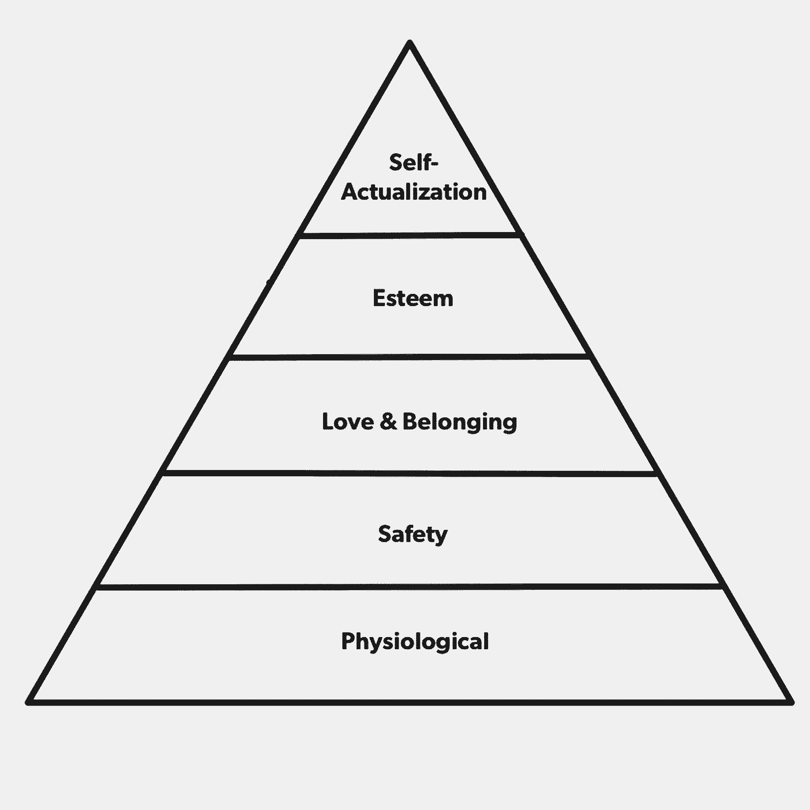
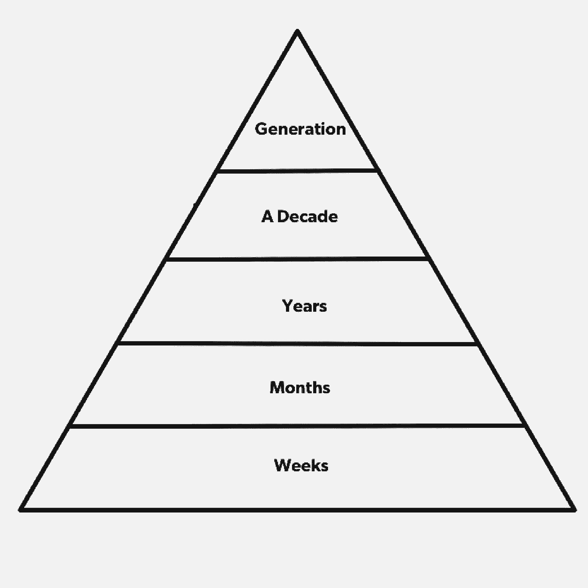

# 马斯克用来建立帝国的递归产品策略

> 原文：<https://review.firstround.com/the-recursive-product-strategy-that-musk-used-to-build-an-empire>

*本文由****[Vinny Lingham](https://www.linkedin.com/in/vinnylingham "null")****，个人身份保护初创公司****[Civic](https://www.civic.com/ "null")****联合创始人兼 CEO。他创办并领导了另外三家公司，包括移动礼品卡公司**[Gyft](https://www.gyft.com/ "null")**，该公司被第一数据公司**收购。*

十年前，埃隆·马斯克在[的一篇博客文章](https://www.teslamotors.com/blog/secret-tesla-motors-master-plan-just-between-you-and-me "null")中总结了特斯拉的公司战略:

制造跑车

用那笔钱造一辆买得起的车

用这些钱去造一辆更便宜的车

在做上述工作的同时，还提供零排放发电选择

不要告诉任何人。

在此后的十年里，马斯克有条不紊地检查了每一个盒子，只保留了他不告诉任何人的厚颜无耻的“承诺”。他制造了特斯拉跑车，为 Model S(以及略贵的 Model X)和现在的 Model 3 让路。在此期间，该公司不仅开发了汽车发电技术，还开发了家庭、企业和公用事业发电技术。

当然，这些都是路标，而不是完整的奥德赛，因为破败成为一个更简单的故事，去掉了汗水、牺牲和意外收获。人们总是告诉创始人要胸怀大志，尤其是这位南非企业家，他的诱惑是立即瞄准马斯克最终目标的雄心水平，而不是从他实现目标的过程中获得指导。

这不是一个容易执行的系统，更不用说内化了。马斯克创办特斯拉的那年，我创办了第一家公司，直到我创办第四家公司时，我才感觉自己从一开始就有了清晰的愿景。马斯克可能不是第一个应用这种方法的创始人(尽管可能是最著名的)，也不会是最后一个。为了引用这种方法，我给它起了个名字:**递归产品策略**。我对它的理解是:从一个最终目标——5 年、10 年或 50 年后——往回努力，直到你能够到达推动你的公司及其客户进入下一阶段的拐点，同时引领双方朝着最终目标前进。

我们从头到尾都在努力推进公司和人生，所以很少停下来逆向设计。

# 按时间顺序呈现；递归设计

在特斯拉的例子中，马斯克从第一步(制造一辆跑车)开始，而不是他列出的最终目标(制造一辆负担得起的零排放电动汽车)。当提出一个愿景时，当从它的第一步或化身开始时，人们更容易消化一个计划。在他发表博文的时候，我们大多数人都可以更好地想象一辆高级跑车，而不是一辆负担得起的豪华电动汽车。

然而，我敢打赌，他是以相反的顺序构建他的总体规划的。换句话说，他提出了宏伟的愿景，并回到了实现这一愿景所需的开局阶段。实质上，他从更大的视野中提取了第一步。

按照马斯克在他的帖子中的方法，我将为我的公司 Civic 提出如下计划:

为消费者创建易于使用的免费身份管理服务

投资建立身份网络，以消除欺诈和身份盗窃

验证使用移动设备作为远程移动识别的标准

通过让任何地方的每个人都有能力行使他们的民主权利来改善民主进程

创建一个参与度更高、信息更灵通的公民社会，为人类和地球做出更好的决策

然而，这是我和我的联合创始人[乔纳森史密斯](https://www.linkedin.com/in/jonathan-smith-2b997a "null")第一次递归设计思域的方式——本质上是按照相反的顺序:

**我们的背景:**和马斯克一样，我和我的联合创始人都是在种族隔离时期长大的，尽管他们站在压迫性制度的对立面。我生来就没有投票权，但是，多亏了纳尔逊·曼德拉，这一切都改变了。政治过渡一点也不顺利，我意识到民主可以是多么强大，但又是多么微妙——不仅在南非，在全世界都是如此。

**大问题**:公民参与度极低，尤其是在选举前后。在世界范围内，选民投票率持续下降——在美国约为 20%。增加支出有助于选民投票，但回报却大大减少。进行选举的成本——即使是在地方一级——也可能高得令人望而却步。

**我们的目标**:实现大规模的授权民主。通过授权选民将他们的选票委托给一个注册的相关领域专家代表团，而不是某个可能或可能不具备该问题特定专业知识的政治家，来吸引选民。

**需要什么**:乐于接受的利益相关者——政府、公民、选民——参与授权民主。一个可访问的在线平台，用于连接和允许公民安全、准确和可靠地按需大规模分配他们的投票。

为什么不是现在？没有法律能力、文化熟悉度、技术平台让公民在线投票。公民被绑在他们的投票站或注册地址。

**阶段 4** :解决未亲自投票者的“不在场”质疑。

**需要什么**:政府对移动投票平台的认可和采用。

**为什么不是现在？**机构无法验证设备另一端人员的身份。

**阶段 3** :打造一款安全验证数百万人身份的产品。

**需要什么**:一个可以将人们和他们的电子设备以近乎完美的准确度绑定在一起的平台。

**为什么不是现在**？还没有政府或公司能够成功建造它。例如，[美国政府因其庞大的生物特征数据库而受到抨击，该数据库被称为](https://www.eff.org/deeplinks/2016/05/fbi-ngi-privacyact "null")[下一代身份识别](https://www.fbi.gov/about-us/cjis/fingerprints_biometrics/ngi "null")。脸书既不收集社会安全号码，也不验证身份信息。它主要通过社会共识来构建身份，这是不充分的。甚至在名字这样的基本问题上，它也可能动摇这个目标；例如，我在脸书的名字叫文尼，但我的法定名字是维诺丹。在我们最近进行的一项调查中，我们发现不到 10%的受访者会考虑向任何社交网络提供他们的社会安全号码。

第二阶段:创建最大的个人身份数据网络。

**需要什么**:消费者的信任，这意味着首先要保护数据。用户数据和授权是分散的网络，不存储在公司服务器上，因此客户和公司都不太可能成为目标或被黑客攻击。能够提供他们的个人信息和一个在全球范围内被认可和接受为可靠的数字身份证明形式的品牌。

**为什么不是现在**？现在是时候了！消费者担心数据泄露。付费身份保护行业有数百万人每月支付固定的保护费。如果免费提供相同或更好的保护*，难道不会让更多人注册——并创建一个强大的消费者网络吗？*

***阶段 1** :提供免费产品保护个人身份信息。*

***需要什么**:一款大众市场消费产品，优雅、简单且永远免费地解决身份盗用和滥用的痛点。*

*为什么不是现在？时机成熟。进入思域。*

*

Vinny Lingham* 

# *使用递归产品策略来构建帝国蓝图*

*我花了一个创业的职业生涯来真正内化这个公司建设蓝图，并花了几个月的迭代来将这个过程应用到思域。以下是应用的四步框架，用 Gyft 的例子来说明这种方法在事后是如何工作的:*

***挑一个宇宙来凹痕**。宇宙都是不同的，但凹痕总是值得注意的。当我在 2007 年创办 [Yola](https://www.yola.com/ "null") 时，我们希望任何人都能够建立一个网站，而不需要任何技术技能。回头看，这是一个令人钦佩的愿景，但还不够大的宇宙。我们没有足够仔细地考虑利润压力和多个向内的竞争对手——如 Wix、Weebly、Shopify、GoDaddy 和 Squarespace——挤满了市场，即使在近十年后，整个行业的收入仍仅略高于 10 亿美元。它也不是一个任何人都可以建立护城河来保护自己的行业，即使他们可以，市场太小，交易过度。*

*我对 Gyft 采取了[不同的策略。当时，礼品卡是一个 1250 亿美元的产业，其中只有 0.1%是数字化的。我们想让丁成为一个凹痕。如果我们能在五年内将数字比例提高到 10%，我们就有机会在一个巨大的市场上留下明显的印记。问题是:在数字时代，我们如何让消费者抛弃塑料？我们能建一条护城河来保护自己免受竞争对手的伤害吗？](https://vinnylingham.com/the-path-to-50m-in-digital-gift-card-sales-bf6e2a4bf444#.jwtjgfmk2 "null")*

***挥楔子做丁**。先有凹痕，后有丁。要想留下凹痕，需要一些重的、持续的摆动——为此，你需要一个楔子。这可能是一种不公平的优势、利基市场或规模经济，但目的是一样的:打入市场并保持这种优势。*

*对 Gyft 来说，那个楔子就是一个数字钱包。这是一种上传实体卡来存储数字货币的方式，这样货币就可以被访问。实体礼品卡经常被放错地方或丢失；每年至少有 200 亿美元的礼品卡没有被使用。当然，我们不能只依赖一个楔子，所以我们放弃了很多，这次是以产品功能的形式:余额查询、忠诚度积分、比特币等额外的支付选项等等。通过钱包，我们发现了一个最有价值的——也是意想不到的——用例:为自己购买数字卡，用于预算和其他目的。*

***寻找邻近的市场进行你的第一次挥杆**。我明白了，一个人——在大多数情况下，一个公司——无法以足够快的速度在宇宙中留下足够大的凹痕。在我们开始摇摆之前，我们绘制了其他人可能与我们摇摆的市场。对于 Gyft 来说，这意味着为每个商店、中小企业或公司设计集成在线或 POS 的数字钱包。一个数字钱包的强大之处在于它可以被用来消费它的余额。我们能服务的邻近市场越多，我们的客户就越能代表我们发挥作用。然而，这并不意味着要为不同的市场开发不同的钱包；我们保持专注。在谷歌钱包等其他数字钱包失败的地方，我们赢了，因为我们只专注于礼品卡，尽管入境要求信用卡和会员卡。*

***每个挥杆动作本身都必须有价值。**你的公司可以逐步实现并推迟最终目标的实现，但客户和合作伙伴必须得到回报。有了 Gyft，能够以数字方式存储实体礼品卡不会造成损失是一个立竿见影的好处。与 Gyft 合作的企业可以立即向客户发货。所有其他功能——从忠诚度积分到支付选项——都是增强功能。*

*思域也是如此。将个人身份信息委托给我们只会发生在平等交换的一部分。所以从一开始，我们就提供终身免费的身份盗窃保护。然后是第三方安全验证身份的能力。一旦能够做到这一点，客户将能够安全地进行远程交易。最后的“转变”应该是允许人们参与和行使他们的公民权利。*

# *对马斯洛诚实*

*对于创始人来说，在递归产品策略的所有应用之前，必须有一个步骤:对他们的动机进行真诚的自我评估。作为创业背后最初的灵感和力量，创始人必须——哪怕一开始只是对自己——清楚地表达他们真正的驱动力。生存、安全、归属、尊重、自我实现都是建立公司的非常有效的理由。这些动机在更现代的理论中被捕捉到，但最著名的可能是发展心理学框架[马斯洛的需求层次](https://en.wikipedia.org/wiki/Maslow%27s_hierarchy_of_needs "null")中的阐述。*

*

Maslow's Hierarchy of Needs* 

*为此，既有严肃的马斯洛层次理论在创业领域的应用，也有讽刺的 T2 层次理论在创业领域的应用。他们打算按动机列出创始人的成长阶段，从最基本的动机到高级动机。回想我创办的公司，我已经在金字塔的大部分层次上了——有时在创业期间会有一些。大多数连续创业者在他们的职业生涯中会被马斯洛金字塔上的大多数原因所驱使。*

*我认识追求自我实现的第一次创业者和经验丰富的创业者，他们努力获得同行的尊重。这不是攀登的梯子，而是每次的选择。众所周知在马斯克从收购 Paypal 获得的 1.8 亿美元中，他向 SpaceX 投资了 1 亿美元，向特斯拉投资了 7000 万美元，向太阳能城市投资了 1000 万美元。他不得不借钱付房租。这位百万富翁选择了自我实现，而不是满足基本的生理需求。*

*在我职业生涯的早期，我用刷爆了的信用卡住在酒店里，因为我没有地方住。当我开始第一次创业时，我的目标是在这个世界上生存，而不是改变它。因此，虽然马斯克和我都曾借钱度日，但我们这么做的原因非常不同。创办公司的原因很重要——但最重要的是，企业家积极地与他们目前领导的企业的实际动机保持一致*。**

**在建立你的公司时，要考虑知名度，而不仅仅是愿景。你实际上能看到前面多远？**

**当我第一次创业时，很多时候我只能看到未来几周。我的目标是想得更远，但当你试图赚取工资时，你必须制造或节省资本才能生存，所以你只能活在短期内。这对硅谷以外市场的企业家来说更是如此，在那里资本是一种奢侈品。**

**在我的下一项业务中，我筹集了资金，可以预见未来一年，并在几个月内进行思考。不仅仅是一家公司，它就像一个具有里程碑意义的大项目，因为投资者坚持渐进式改进，以便获得下一批资本。从本质上说，产品*就是*公司——它们拥有相同的寿命。**

**在我上一个公司，我们想了很多年。它让我们不再关注收入，而是关注用户体验和用户维系。我们的目标是召集并服务一个强大的客户群。为此，我们必须专注于建立一个伟大的公司——而不仅仅是一个伟大的产品——来发展与客户的关系，并与他们一起发展。我们保持低调，尽可能延长我们的跑道，以确保我们关注用户所需的灵活性和自由度。**

**我现在公司的参照系是十年。前景如此遥远不仅是因为我们试图创造一个行业——一个人们以不同方式联系和交易的市场新角落。它不再仅仅是产品、公司或客户的个人，而是集体——我们已经设计了成为统一代理的计划。**

**很少有公司能影响下一代。它们影响着还未出生的人在未来还未实现的情况下使用还未制造的产品的方式。在这个领域，这看起来更像是科幻小说，但有些创始人渴望那种跑道和地平线。他们试图影响一个他们可能无法经历的时代。**

**简而言之，这与其说是需求的层次，不如说是需求的范围。一个创始人早期的任务不仅是定义一个愿景，而且还要确定她可以舒适地运营的可见性。**

**

Horizon of Needs** 

**递归产品策略包括退回到建立长期公司所需的第一步。这就是为什么创始人必须从一开始就确定自己的动机，以确定长期是需要 10 个月还是 10 年。驱动创始人的因素和相应的时间框架很重要，但准确的自我评估更为重要。不是每个公司或创始人都会选择为下一代打造，即使他们尝试了，也不能保证他们会这样做。前景越遥远，变数就越多，比如市场动态、竞争对手、新技术、融资周期——不胜枚举。有丰富的创业建议来应对这些因素。递归产品战略是建立一家长期公司的一种方式。到达那里的诀窍是首先铺好正确长度的跑道，然后倒过来。当然，正如马斯克所说，不要告诉任何人。**