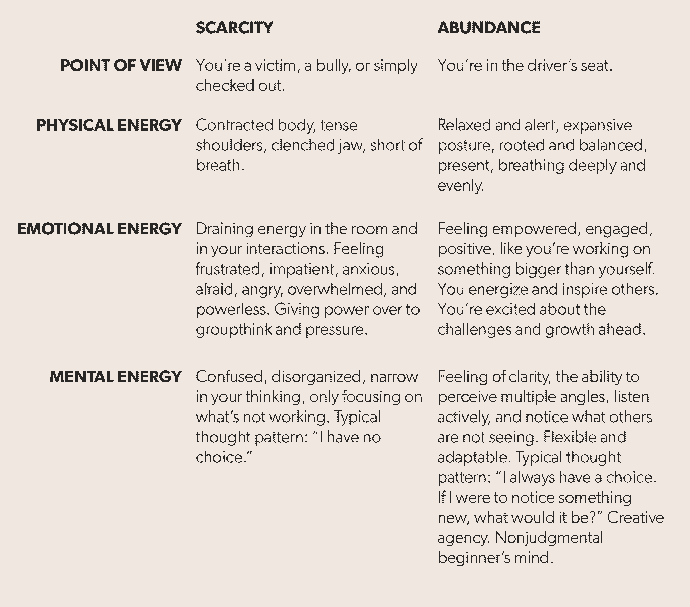

# 思维丰富的显著优势

> 原文：<https://review.firstround.com/the-remarkable-advantage-of-abundant-thinking>

如果你认为自己是雄心勃勃的，这已经发生在你身上了。你的闹钟响了，你被前方的困境所困扰；大海捞针；削弱宇宙；永不结束的过山车——以及许多更可怕但不幸却恰当的陈词滥调。今天，科技界的集体思维基本上认为，要想成功，你必须忍受痛苦，勉强生存。但这是一个陷阱，**炙手可热的高管教练** **[卡蒂亚·韦里森](https://www.linkedin.com/in/katia-verresen-574251 "null")** 说，她为**脸书**、**斯坦福**、 **Airbnb** 、 **Twitter** 以及一系列知名初创公司的领导人提供咨询。

“你不可能在一连串糟糕的日子里建立起十亿美元的企业。她说:“这必须是一系列你最美好的日子。"你的表现 100%取决于你的态度。"

理想的态度是她所说的**丰富的思维**——一种给你创造力和勇气去实现你的愿景的心态——并且，在每天的基础上，去设计你自己的生活。当韦里森第一次见到她的大多数客户时，他们都处于被动模式。这就像他们在电影中，在不知道剧本或没有视角的情况下，在他们的工作和生活中表演。她的目标是让他们坐在导演的椅子上，有更多的选择、视角和可能性来重写和升级剧本。

看到这些选择是丰富思考的根源。而且，根据 Verresen 的说法，随着经济和筹资环境的转变，这一点现在再重要不过了。在这次独家采访中，她将富足的概念建立在真实的策略和行动上，任何人都可以用这些策略和行动来感到更有活力，扩展他们的世界观，并实现他们对成功的愿景。

# 自我控制

在与客户合作的早期，Verresen 会给他们一个稀缺与丰富的思维诊断。我们的目标是区分和识别当他们处于稀缺驱动心态时和当他们思考丰富时的生理、感觉和想法。这有助于他们真正感受到这两种模式的区别，并注意到它们在日常生活中的临界点。这样，他们可以主动选择更有建设性的态度。请注意，这与韦里森早期关于身体、情感和精神能量的工作密切相关，以及企业家最大限度地发挥和锻炼这三种能量的重要性。

你可以用上面的方法来确定你的感受，并引发不同的反应。但是如果你感觉如此低落，你能做些什么来变得富足呢？韦里森围绕这种转变做了大量的工作。**在这里，她分享了六个实用工具来帮助你开始。**

# 1.注意到

“富足实际上是你在生活中看到更多的能力:更多的选择，更多的选择，更多的资源。韦里森说:“这要从多注意开始。“你从来没有完整的故事。如果你在开会，房间里有多少人就有多少现实。看待事物总有不同的方式。”

问题是我们天生就不会注意到事物。

1999 年，哈佛发表了一项现在很受欢迎的研究，他们向人们展示了一个小篮球队在一个圆圈里传球的视频。参与者被问及球被传递的次数。很简单。但是在视频之后，当他们被问及是否注意到任何异常时，超过一半的人不知道研究人员在说什么。他们忽略了一个事实，一个穿着全套大猩猩服装的人在球场上走了几秒钟。超过一半的人的大脑似乎删除了这些信息。

关于生活和工作，这告诉了我们什么？大脑只能吸收这么多。当你过度专注于一项任务或一个想法时，你会错过一些东西。“这只是简单的生物学。你没疯，其他人也不傻。只是我们的大脑被设计成能看到它已经在寻找和相信的东西。例如，**如果你的信念是‘这是不可能的’或者‘我做不到’，那么任何与你相矛盾的东西都会被扔出去。**

这也是专业群体思维是如何发生的，因为抵制它确实需要能量。有可能你正在删除替代路径，资源，各种各样的东西，因为它不符合这个世界的集体观点。因此，想想如果你能打破大脑的默认设置，等待你的是什么:显著的创造性和竞争优势。

当你投入时间和精力去注意时，新的大门就打开了。意外收获加速。你觉得整个宇宙都在支持你。但实际上，你并没有限制自己。

你可以培养这种丰富的心态和自我意识。是生物。正如任何有价值的事情一样(想想锻炼，健康饮食)，注意需要锻炼成为习惯。最佳养生法:当你感到匮乏时，问自己一些开放式的问题。依靠你的大脑来记录你以前可能没有见过或考虑过的信息，但是现在可以被调用。**这些问题旨在恢复这些数据并扩展你的现实地图:**

如果我以不同的方式经历这种情况，我会注意到什么？

我有什么选择？(注意:这不是质疑你是否有选择，而是承认你肯定有。)

如果我在这里发现了一些有用的东西，会是什么呢？

如果这个看似不可能的任务实际上*是*可能的，我的下一步逻辑是什么？

在这种情况下什么是正确的？

我想知道那会是什么样子...(填写一个似乎存在于可能性范围之外的动作。)

我可能有哪些我还没有发现的资源？

注意也取决于放下现有的界限和限制信念——包括你自己的知识。“你能做的最好的事情之一就是一次又一次地向自己承认，最好大声地说，‘我不知道我不知道的事情。’“你需要不断打破你的假设，”韦里森说。如果你保持中立——在不知情的情况下没事——你更有可能注意到一些你之前没有注意到的东西。"

# 2.中立

有些人把这叫做[初级思维](https://en.wikipedia.org/wiki/Shoshin "null")，但是这个概念超越了拥抱无知——它是释放判断和假设的能力。这样做，你就创造了新的可能性，而不会被限制性的信念所蒙蔽。

多年来，韦里森一直是斯坦福大学商学院最受欢迎班级的常驻教练之一。名为 **[通往权力之路](https://explorecourses.stanford.edu/search?view=catalog&filter-coursestatus-Active=on&page=0&catalog=&q=OB+377%3A+The+Paths+to+Power&collapse= "null")** ，强调中立的重要性:这个世界没有公平或不公平。很简单。你越能暂停判断，你就越能学习和成长你的力量。

你相信什么是绝对真实的？整体来看还是真的吗？

“问问你自己，‘如果我在这个问题上保持中立，我会注意到什么不同吗？如果我对此一无所知，只是在这一刻介入这种情况，我会看到什么？”韦里森说中立让你远离盲目的乐观和安全的悲观。它让你与真实的自己保持适当的关系。"

她经常从公司那里听说招聘是不可能的。外面没有一个人是好人。都没救了。然后，突然地，当被训练到中立，放弃他们认为他们在这个角色中需要的东西或者谁适合这个角色时，他们意识到那个合适的人一直在他们面前。(郑重声明，她在旧金山找房子时也见过同样的事情。那些不知道这有多难的人往往会发现未经雕琢的钻石。)

中立也承认**现实是一团乱麻**，有一件事永远不会对所有人都成立。公司和团队是由许多不同的观点、矛盾、意见和声音组成的。最好的领导者是那些接受他们同时都是正确的人——不仅仅是他们的想法是正确的。这可以采取多种形式。这只是一个例子:

“我告诉我的客户，如果在会议上对一个决定或下一步该做什么有多种意见，记下房间里每个人的声音，”Verresen 说。也许 8 个人对一个决定说是，两个人说不是。当你把它写在每个人都能看到的白板上时，你写的是想法，而不是人；每个人都在视觉上看到房间里的真实情况；少数人的意见得到尊重和采纳。

重要的是，这不是基于共识的决策。比那更实际。当你不承认所有的声音时，你总是在后来为此付出代价。有些人想在晚些时候改变决定或者放慢进程。“当你睁大眼睛走进去的时候，你可能感受到的阻力或消极情绪会得到释放——被中和。”

# 3.底漆

“如果你的态度实际上决定了你的眼睛能够看到的信息(或者你的大脑认为他们看到了什么)，那么你必须准备好你的精神状态以看到更多——这和用牙线剔牙一样重要，”韦里森说。

启动是参与任何提升你情绪和精神能量的活动。当然，正确的睡眠、良好的饮食和锻炼是它的一部分，但它也可以比那更具体。**花 5 分钟看一些让你开心的照片。**

她说:“我辅导那些经营大公司的人，他们依赖‘权力板’——他们在手机上收集了大量巅峰经历(最好是过去的胜利)的照片，这些照片给了他们所需的精神休息，将他们的精力转移到正确的方向上。”“这听起来不太可能或不自然，但有时你不必相信魔法会起作用。”

做好准备是早上的第一件事，也是你感觉自己进入匮乏状态的任何时候——当你的身体收缩或心脏开始跳动的时候。当这种情况发生时，能够快速换挡会让你的幸福和创造力大不相同。启动给了你决定你想成为哪一个版本的你的控制权。

“你的身体通常首先知道发生了什么，所以像使用天线一样使用它，”她说。"然后选择一个在那一刻有用的工具."以下是她认为最有效的工具——她建议将这些内容制作成播放列表(即将它们全部放在手机的同一个地方),这样你就可以很容易地找到并按下播放键:

幽默:阅读或观看一些你知道会让你发笑的东西。([在工作中，幽默和创造力之间有一种被证实的科学联系](http://youtube.com/watch?v=-sS-xiyQLpU "null")。)

**回忆**:这就是电源板派上用场的地方。你有经历和你爱的人的照片吗？这可能是一个巨大的胜利——一些看似不可能的事情被完成了。任何带你去一个快乐的地方，并提醒你在更高层次上你所重视的东西。

一些歌曲或声音肯定会让你产生积极的联想。当你情绪低落的时候，玩玩它们，你会感觉到改变。

**动作**:起床。走到哪里都行。呆在一个地方会让你陷入同样的思维模式。

**外向**:找一个能提供不同视角的思想伙伴。和一群让你感到快乐和支持的人在一起。

**内向者**:找一个安静的会议室，远离喧嚣，休息一下。呼吸并享受这份宁静。

这些工具在白天也很有用。韦里森说:“上午 11 点和下午 4 点往往是精力下降的时候，这些能量会成为有用的推动力。“但是，任何时候你感到一点点压力或不安全感，你都应该开始准备。去会议室或安静的地方呆五分钟。使用你的原声音乐，看看你为此制作的相册。你需要和你刚刚做的事情保持距离。”

灌注很像白天回到基地充电。她说:“要明白，感到疲惫或绝望不是你的错——这只是一种心理反应——没什么大不了的。”"放下你自己的案子，集中精力做下一件有建设性的事情."

# 4.自我同情

弹性是自我安慰的能力——这个过程有三个步骤或阶段。韦里森使用的这个框架是基于奥斯汀州立大学心理学教授克里斯汀·内夫的工作:

首先，承认一段经历或处境是痛苦的，承认你在受苦，你在挣扎。也许你已经筋疲力尽，事情没有按照你想要的方式发展，或者你刚刚收到了一些坏消息。感受当下的不适，不要试图逃避或忽视它。根据 Neff 的说法，简单地给一种情绪贴上标签就能让你平静下来。

第二，承认这种痛苦是人类共有的经历。生活充满了可怕、痛苦、疯狂和悲伤的情况。它发生在我们最好的人身上，没有人是孤独的。所有创始人在筹资时都会经历痛苦。“没有新的有压力的想法。“其他人已经体验过你现在的感受，或者正在经历这种感受，”韦里森说。“当我们痛苦时，我们会被孤立。我们需要重新连接以开始恢复。”

**第三，想出什么样的、有意识的行动能让你现在感觉更好。**你能给自己什么，哪怕只是一点点安慰？也许是走出房间，或者选择睡觉或锻炼而不是工作，或者承认你不知道答案。和你的宠物一起玩。灵魂循环。为自己做点好事——这意味着滋养，扎根，做一些让你做了之后感觉更好的事情。内夫说，即使把手放在心脏上一分钟，也能让催产素流动，缓解情绪。

**研究表明，自怜与更大的勇气相关。例如，[研究人员监测了从阿富汗返回的退伍军人](http://self-compassion.org/wp-content/uploads/publications/SCandPTSD.pdf "null")，结果发现他们的 PTSD 发病率与他们战斗的持续时间或严重程度无关，而是与他们个人的自我同情水平有关。**

快速完成这三个步骤是在最紧张或最情绪化的情况下保持丰富心态的一种方法。每个人都注定会遇到匮乏。韦里森建议在一天中进行几次自我同情的休息。它只需要不到 3 分钟，给你巨大的情感弹性和韧性。如果你处于完全锁定模式，在战壕中，战斗到底，冲刺，需要最大限度地与你的团队保持一致，这一点尤为重要。

# 5.慷慨

了解你的个人货币。研究表明，最有权力和最快乐的人处于不断给予他们联系的大网络的中心。这就是你如何发展一个部落——慷慨解囊，无论是有价值的介绍、技术技能、编辑能力，还是成为一个好的倾听者等等。

太多的人在拥有很多东西的时候却觉得自己什么都不能提供:关注、风度、善良、知识、资源。

同样，她建议形成朋友和同事组成的“**奉献圈**”,他们可以为彼此做同样的事情——只有 5 到 7 个人，每个人都在做一些不相关的事情。他们可以来到这个圈子，让其他人给他们提供解决问题的想法，并指出他们可能拥有的看不见的机会。

“别人的思维导图帮助你摆脱困境，”她说。“记住，你最不了解的人通常最有力量向你介绍新事物或改变你的想法。”

每个人都应该提出他们需要什么帮助，然后设置一个 7 分钟的计时器，在此期间，其他参与者集体讨论解决方案。为这些想法做一个便利贴，并把它们贴在墙上。这将保持良好势头并产生具体成果。唯一的要求:慷慨，并理解没有坏主意。每当韦里森跑完这些圈子，成员们都报告说此后几天都感到精力充沛。

当你建立一个你支持的人的部落时，你也在建立一个会支持你的部落。

你应该总是在团队之外寻找新鲜的视角，想想你的工作场所。谁能揭示你的盲点和假设？找出你生活中想发展相同技能，但在不同公司或不同行业的人。这些人最能为你指出可能性。

**这也会帮助你找到导师，这很关键**。韦里森强烈建议创建你自己的个人顾问委员会，包括你领域外的专家。他们开辟了绿色的田野和蓝色的天空，因为他们没有陷入和你一样的文化中。“对你来说像过山车的东西，对以前经历过的人来说通常是直线，”韦里森说。“我经常告诉客户，‘**如果你想要**，‘你可以借用我的确定性，因为我见过像他们这样的公司如何获得资金，或者从长远来看如何获胜，我知道这也会发生在他们身上，不管他们有多害怕。你需要能给你这种确定性的导师。”

在她职业生涯的早期，她的顾问之一是**拉里·莫尔**，莫尔·达维多风险投资的联合创始人。在 2000 年网络泡沫破裂时，他会对她说，“森林火灾是正常的，也是好事。恐慌是没有用的。睁大眼睛就好，因为森林大火过后，总会有一波幼苗。”他是对的，一大批新公司——包括 Twitter 和脸书——标志着新社交媒体时代的诞生。她不得不借用他的自信来度过难关。

一种经常被忽视的慷慨形式是欣赏。听起来这么简单，却对身边的人产生了特大的影响。她说:“我见过很多人的表现突然发生变化，因为他们的老板告诉他们，‘干得好’。”“在这种文化中，每个人都背负着太多的重量和责任，他们甚至不欣赏自己。”

**富足的心态看到欣赏他人的机会，结果是更加富足。最好的欣赏方式是精确。它认可某些特定的东西和它所产生的影响。这对一家公司的影响是惊人的。**

为了使欣赏有效，它需要是可观察的和具体的。(这意味着不要把人拉到一边说:“你真棒。”这意味着以一种非常有根据和切实的方式大声疾呼，以强化团队或个人的高绩效。)[研究表明，最高效率的团队遵守这样一条定律:当他们每收到一条建设性的批评，就会得到 7 条积极的反馈](https://hbr.org/2013/03/the-ideal-praise-to-criticism "null")。

“当你看到健康的团队时，无拘无束、无拘无束的欣赏总是一个关键因素，”Verresen 说。"这是世界上排名第一的记忆工具."

# 6.感谢

感恩是让奇迹发生的肌肉。

根据韦里森的说法，透过感恩的视角来看待你的世界，会揭示出可能就藏在你面前的东西。[无数的研究表明](http://www.inc.com/jessica-stillman/the-amazing-way-gratitude-rewires-your-brain-for-happiness.html "null")持续地、主动地(甚至是超意识地)练习感恩可以重塑大脑，并产生持久的副作用。

但是练习这个实际上意味着什么呢？

每天花 5 分钟，只关注现在正在发生的好事情。实际上，在你的日历上安排好这个时间，无论发生什么都不要错过。当你感到精力不足时，你可以用感恩来激励自己。它能提神醒脑。

“很多人忽视了他们的成功和他们在职业生涯中创造的东西，”韦里森说。“你必须对自己的创作表达感激，真正承认它们的发生，获得价值，并利用这种动力推动你接下来的创作。”

她的一个客户最近庆祝了他们公司的 10 周年纪念日。因此，她给每位创始人列出了他们完成的主要里程碑。当她分享它们时，房间里充满了欢乐。然后，她告诉他们每个人花一点时间想象 2005 年的自己，他们永远不会相信这是可能的。这是至关重要的一步。

她说:“通过提醒自己，你已经实现了不可能的事情，你就更有可能相信自己的能力，并朝着目标前进。“如果这件事可行，想想你现在的能力。抓住这一势头，加速未来的大思考和增长。”

人脑在反馈回路中运作。所以我们有规律地给它们喂食正确的食物是很重要的。很多时候，被驱动的人在他们完全体验到最近的胜利之前就开始了下一个挑战。当你这样做时，你剥夺了你自己和你的团队从承认已经达到的目标中获得的速度。

这也强化了一个观点，即丰富的思维不应该等待。这是实现目标过程的一部分。“人们普遍认为，‘一旦我拿到资金，一切都会好的。’或者‘一旦我们雇佣了那个人，就没问题了。’等等等等。但这只是生活在匮乏之中，没有什么是足够的。当你花时间去感激你所拥有的一切时，你正在训练你的大脑从压力中转移，不要反应过度，并对其他的前进路线持开放态度。"

一次，一位客户问她为什么这如此重要。他认为压力对他有利。她的回答是:

因为你会少受他妈的苦。当你痛苦的时候，你不在最佳状态。

她经常看到处于稀缺模式的领导者在会议结束时被击败，对所说的事情或分歧感到不安。他们会完全忘记他们被分配了资源，或者在对他们重要的另一点上有共识。

“他们真的删除了一些信息，而在同一个会议中，有人会认为这些信息意味着，‘他妈的，他们只是给了我工程资源来完成这件事！’她说:“如果你重视感谢给予你的一切，你就不会错过小礼物和机会。

你可以通过定期的仪式在生活中建立感恩之心。Verresen 建议每天、每周和每月进行反思，强调哪些事情做得对，哪些事情让你感到自豪，哪些事情让你感到感激。所需要做的就是把它记在日记里(无论是笔和纸，Evernote，还是其他什么)。

每天结束时做这件事。在整个星期的周日晚上做这件事，挑出最重要的事情。每个月的最后一天再做一次。这样做，直到你有了一个精选的清单，上面列出了三件对你来说真正重要的事情。

随着你写得越来越多，你会增加你的能量。你会开始看到成就堆积起来，达到看似不可逾越的目标。你会增强自信，对未来一天、一周、一个月能做的事情有更大的憧憬。此外，为了产生更大的影响，做 Verresen 做的事情，并建议她的所有客户做:

她写下自己生活中感激的事情。

她写下她感激别人所做的事情。

她会立即给那些人发电子邮件，或者在会议上把他们叫出来。

她看到这个习惯完全改变了公司文化。一天结束时只需要几分钟。

# 规模丰度

一致性建立信任和速度。当你坚持做某件事时，你是在为长期利益而工作。你拒绝做出反应。

每天做一些让你朝着目标前进的事情会给你带来内在的适应力。这样，当发生火灾时，有人跑进房间大喊，每个人都需要停下手头的工作来解决这个问题，你不会忘记自己的终极使命。您正在构建使您的团队保持敏捷并步入正轨的基础结构。

每个领导者都希望自己是强大的、开放的、鼓舞人心的——不是那种玩零和批评、命令和控制管理的人，也不是那种认为自己是房间里最聪明的声音的人。但是确保你不是这种类型的领导者的唯一方法是每天有意识地练习这些习惯和品质。

她说:“在每一刻和每一次互动中，你都有选择自己想要成为什么样的人的自由。“一个真正优秀的领导者知道——没有任何情况或现实迫使他们以某种方式行事。这给了他们自由。”

当你强调充分思考时——注意更多，整合更多，分享更多你知道的东西——你团队中的每个人都会知道你的前进方向。他们会效仿你的模式，在决策中包含更多的信息和意见。他们不会急于下判断，也不会因为有了错误的答案而恐慌。

当你在构建新的东西时，你会不可避免地遇到第 11 个小时，所有人都在甲板上，处于紧张状态——任何时候。当你带领团队时，你永远不会脱离困境。在这种情况下，很容易告诉你的团队，“继续启动，当我们完成时，我们会呼吸！”很容易让上面列举的所有习惯半途而废，因为你认为你没有时间或空间。

**但这正是*****最需要的时候。**这里提到的每种工具只需不到 5 分钟就能完成，让你处于最佳状态，这也是确保你的团队处于最佳状态的方法。在最重要的时候，你不能接受更少。如果你在筋疲力尽的情况下，这是不会发生的。*

*“这些时刻应该会提醒你，当初为什么要投身于此。每次大型发布会、活动、危机或火灾——这都是你的难题。这时，你需要全力以赴，加倍努力，让自己保持最佳表现，”韦里森说。“说‘我们只需要度过难关’是绝对没有用的。”记住为什么这份工作让你觉得活着，并从那里走。"*