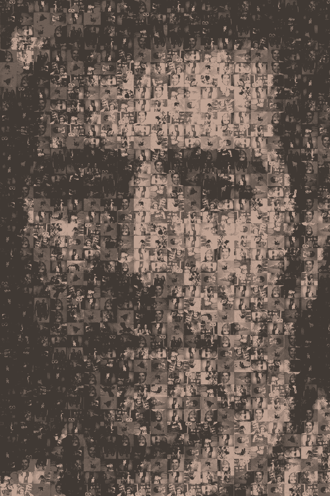

# 创造者驱动的文化的回报——以及能够实现这些回报的工程师

> 原文：<https://review.firstround.com/the-rewards-of-creator-driven-cultures-and-the-engineers-that-can-deliver-them>

如果 Lou Montulli 可以为现代软件工程师传递一条格言，它不会来自史蒂夫·乔布斯或埃隆·马斯克。他引用了美国诗人沃尔特·惠特曼的一句诗:

我大，我包容众。

在成为网景公司的创始工程师后的几十年里，Montulli 目睹了许多创始人成长为公司的首席执行官，产品经理成为产品事实上的首席执行官。然而，在开发人员身上，他看到了一种将他们隔离起来的专业化趋势。在推进模块化构建的实践中，许多人已经变得独立了。工程师应该以他们广泛的——而不是昂贵的——技能组合而闻名。

作为一名工程师，Montulli 成长于渴望成为博学之士的开发人员中间。作为一名工程多面手，他做了一些最持久、最有创造性的工作。蒙图里开发了两个最早的网络浏览器，Lynx T1 和 T2 网景 T3，以及浏览器创新，如 cookies 和 T4 fish cam T5，这是最早的在线直播摄像机之一。他的贡献导致了 web 的基础元素，包括 SSL、Javascript 和 CSS——所有这些都是他与 Netscape 早期工程团队一起开发的。在成为 serial 创始人之前，他还在 Shopping.com 公司和 Shutterfly 公司担任过工程领导职务。

在所有这些角色中，他建立并受益于他所谓的**创造者驱动的文化**——与他目前在他的新公司 **[JetInsight](https://www.jetinsight.com/ "null")** 播种的环境相同，这是一个按需飞机租赁市场。在这次独家采访中，蒙图里剖析了一种创造者驱动的文化，并概述了培育这种文化所需的要素。其成功的核心是一个特殊的工程师阶层:程序员被驱使——并且有自由——在他们的职能管辖范围之外工作来开发产品。任何创业公司在建立其工程团队的早期都会受益于这种开发文化的优势。

# 分发问题，而不是产品。

如果有一个创造者驱动文化的关键，那就是将问题分配给更多人的不懈实践，而不仅仅是解决该问题的产品特性。这看似细微的差别，但结果可能大相径庭。“这是给别人拼图还是空白画布的区别。蒙图里说:“即使两者拍摄的是同一个场景，过程和最终结果也截然不同。“在第一种情况下，设置参数；挑战在于执行和组装。在第二种情况下，设计和处理任务与结果本身一样具有创造性。在这种情况下，你离问题更近了，而不仅仅是负责组装解决方案。”

在软件环境中，这种相似性是成立的。“为了产品和自身的发展，创作者需要避免成为仅仅是实施者。例如，工程师很容易误以为他们的目标是每个季度提高 0.25%的广告印象效率，而实际上是为了提供更好的产品体验，”蒙图里说。“避免这种倒退的方法是创建一个工程环境，在这个环境中，开发人员将他们的工作构建在产品级别，而不是功能级别。但是日复一日的截止日期和明确的任务最终会把他们带回到杂草中。所以关键是从产品解决的问题的一部分开始，而不是解决方案的一部分。创造者驱动型文化的领导者会不断提醒她的工程师这个问题，并一遍又一遍地让他们回到这个问题上来。

如果没有这种积极的心态，典型的工程文化就会显现出来，尤其是在初创公司成长的时候。问题层面的问题，直面问题，最终整合到越来越少的人身上。大多数人会引用规模，但这是一种有意识或无意识的权衡，这对产品不利。“实际情况是，一个人开始负责让一个产品变得伟大，所以只有这个人会深入思考它所解决的问题。然后，工程师们被指派去帮助那个人编写代码，”蒙图利说。“这不仅不好玩，而且也不是长期打造产品的最有效方式。更激励和有效的是将产品解决的问题分解到不同的责任领域。通过在问题层面(而非功能层面)共同解决问题，工程师们更有能力、更积极地参与进来。”

Mosaic of Lou Montulli

镇上的新首相

虽然产品经理的概念很熟悉，但 Montulli 更喜欢培养一种不同的项目经理:问题经理。“这不是一个正式的头衔，但我喜欢用这种方式来思考我希望我的组织中的工程师类型，”他说，“我是根据我如何开始使用 Lynx 来思考的。我开始自己构建它，所以不仅拥有完整的产品，还拥有完整的问题。它变得成功了——比我想象的还要成功。我被迫扮演每一个角色:我回复所有的电子邮件，做所有的包装、构建、编程和产品管理。这变得很自然。”

戴上每顶帽子是创业者起步时的典型特征，但当其他人加入时，这种心态被复制——而不是淡化——时，奇迹就发生了。“当我们创建 Netscape 时，我们是一个小团队，试图创造一个可扩展的产品。它有一个非常创造者驱动的文化；产品创新确实来自工程。我们强烈反对被交付特性。我们并不反对授权——我们各自处理一个更大问题的不同方面——但更反感流水线思维，”Montulli 说。“给我们带来问题！这就是我们的全部要求，反过来，我们会尝试提出真正有趣的解决方案，不仅解决那个问题，还解决用户尚未遇到或考虑的一大堆其他问题。

为副产品进行优化。这项工作有多大可能衍生出对问题的另一个方面有用的东西？

Montulli 用日常工具强化了问题分配的实践。“当我团队中的工程师进入 [JIRA](https://www.atlassian.com/software/jira "null") 时，他们会发现一个问题——而不是一个功能——在等着他们，”他说，“有时会提供一个潜在的解决方案，但我们的默认是将功能请求作为一个问题来阐述。例如，我们将发布一个问题，而不是给一个工程师一个 UI 模型图像并告诉他构建一个功能。例如:‘用户需要跟踪飞行员的费用。他们目前使用纸质和实体收据，需要一种更好的方式。"

JetInsight 最初几个月致力于解决的一个问题是，运营商如何整合机场周围酒店和租车的现有行业数据库。“如果我们从表面上接受了功能请求，我们将致力于与现有数据库的基本集成。相反，我们缩小范围来考虑更大的问题:数据库中的信息很快就过时了。它使用简单，但很少更新，并且只包含机场附近的资源，这限制了库存，”Montulli 说。“通过关注根本问题并从技术上了解谷歌地图 API，我们能够使用谷歌地图构建更具功能性的集成，这使我们能够访问更多资源、实时更新、评论、照片等。这种体验比我们使用现有数据库获得的体验要好十倍。”

在创造者驱动的文化中，解决问题的人变成解决问题的人。每一个动作都可以诱导出许多解决方案。

**当工程师成为创造者**

问题经理的思维方式会导致开发人员吸收传统产品经理的实践。“这种转变的另一种思考方式是，工程师吸收了产品管理的权限。蒙图里说:“是的，合并这些数据是有挑战性的，是的，这需要工程师们掌握不同的技能，但这种努力会带来十倍的回报。”。“首先，当你的工程师作为分布式项目经理时，它缩短了项目经理和开发人员之间经常发生的缓慢、痛苦和好斗的交流。否则，问题会变成额外的会议:“你确定要这样做吗？”‘你为什么要这样做？’我们开个会讨论一下，好吗？"

PM 和工程角色的融合不仅避免了艰难的沟通过程，更重要的是给了工程师一个从源头解决问题的机会。“我帮助实现的一些最具原创性和影响力的想法——从 cookies 到网络浏览器——是我在早期就接触到需求并想象从那时起可能发生的事情的想法，”Montulli 说。“在项目经理和工程师之间的电话游戏中，我们失去了太多东西。不仅在准确性方面——一些技术上的细微差别可能会丢失——而且在创新方面。当问题被综合成一个解决方案，并分解成路线图上的特性时，开发人员不仅减少了两步，而且失去了客户痛点的刺痛。这种距离是一件坏事。”

要成为真正的创造者，工程师必须融入游戏。Montulli 说:“如果一个工程师被迫发展和加深客户的同理心，你就会有一个开发人员，他的精力花在弄清楚如何建立一些客户友好的东西，而不是如何转移到下一个功能上。”“这种转变改变了编码本身的受益者。工程师不会把一个功能交给产品经理，而产品经理会把它交给客户；他们把它交付给客户，一个他们觉得与客户息息相关、不想让客户失望的客户。”

在创造者驱动的文化中，创造者将他们的能力带到最初的挑战中——而不是过滤后的版本。

随着工程师在价值链上延伸，他们的工作范围从功能到问题再到客户。“工程师在自己生活中使用的产品往往比他们为他人开发的产品更好。因此，他们越能进入客户的世界，产品就越能更好地融入其中。“拜访客户有助于工程师对日常生活中不使用的产品的用户产生共鸣，”Montulli 说。“为开发人员设定节奏，以监控和吸引客户。最理想的是[走出办公室，亲自与他们见面](http://firstround.com/review/the-power-of-interviewing-customers-the-right-way-from-twitters-ex-vp-product/ "null")。至少派一个有客户成功经验的工程师去见你的客户。我们在 JetInsight、入职时以及之后的每个季度都会这样做。在拜访的间隙，我们用用户记录工具安排会议，如 [FullStory](https://www.fullstory.com/ "null") 或 [Inspectlet](https://www.inspectlet.com/ "null") ，看看客户如何浏览产品。这是对工程师参与客户拜访的补充，而不是替代。”

以下是 JetInsight 如何将工程师融入客户访问的更多细节:

**入职**。“工程师轮流加入客户成功人士的行列。他们可以参与，但他们应该像科学家一样在那里观察和吸收。需要注意的关键领域是客户第一次看到产品的方式，他们如何发送第一批产品，以及他们在工作流程中的导航方式。”

**季度访问**。“即使需要一整天，工程师也需要花时间和客户在一起。在这些检查中，工程师应该亲自了解客户，记录他们的不喜欢和偏好，并观察他们使用产品。”

**用户记录工具**。“每周，我们都会通过 FullStory 了解客户如何使用该产品。工程师听到销售电话和演示，这有助于销售自动化功能，并阐明销售与公司其他职能部门之间的关系。最终，这更像是一场单方面的对话，但它有助于我们潜移默化地获得洞察力，并让我们在两次网站访问之间保持最新状态。”

真正的创造者需要有时间和客户在一起，即使这会占用产品开发的时间。

Montulli 认识到，面向客户的交互并不是每个工程师的强项，但要打造卓越的客户体验，这最终是必要的。对于那些不情愿的人，他试图让他们和其他工程师或员工一起慢慢适应。“如果他们不擅长与客户交谈，在拜访时让他们与另一名工程师配对。作为最后的手段，他们可以通过事后与同事和工程师交谈来了解客户的观点。他们不必从一开始就获得所有的第一手资料，但这就是目标。”

# 增加曝光，而不是交流

创造者驱动的文化寻求通过结合产品管理和工程的元素来简化产品开发。然而，在独立解决问题之前，仍然需要同步。“作为一名领导者，当你赋予创造者权力时，你就放弃了集中控制。蒙图里说:“在这种模式下，管理往往是非常扁平化的，如果任何时候都有几十个问题需要解决，这可能会令人望而生畏。”。“我们不想要混乱，也不想要金字塔模型，所以我们的做法是创建相对无摩擦的检查站，增加对动态的曝光。这意味着，在他们的流程中，创建者与主要利益相关者分享他们的工作，但他们的同事也有责任积极参与，以保持一致和知情。”

举个例子，JetInsight 的一名工程师最近在解决飞行员的合规性问题。“这里有一个问题:联邦航空局限制飞行员在特定时间内可以飞行的次数，并跟踪他们在飞行之间的停机时间。每个飞行员都必须遵守复杂的规则才能保持在规定范围内。蒙图里说:“虽然飞行员知道这些规则，并保持与时俱进，但调度员可能不知道。“我们的挑战是自动跟踪这些规则，并告诉客户他们是否会违反联邦航空局关于飞行员值班时间的任何规定。事实证明这是一个大问题，因为它需要大量的数据输入，从飞行的具体分钟数到飞行训练和其他纳入这些规则的要求。”

解决问题的工程师提出了一些想法，亲自或通过屏幕分享在内部分享，并收集反馈。这个周期发生得很快——通常在几个小时内——然后通过共享早期模型与客户交流。“在投入时间建造原型之前，工程师和同事们已经看到了这个问题，并提出了许多可能的解决方案。他们不仅有机会发表评论，还能了解到针对该问题提出的解决方案会对他们自己产生怎样的影响，”Montulli 说。“在这几个小时里，如果有创作者喜欢的想法，工程师就会制作一个原型。如果没有，那就从头开始。无论哪种方式，这一过程都将团队紧密地结合在一起，让他们能够自由地思考，同时以同步的方式进行创作。”

在这个具体的例子中，工程师和他的同事在许多原型上来来回回，但是获胜者成为下一个产品特性。“在这次交流中，另一名工程师意识到，并不总是清楚机群中的哪架飞机实际上被调度了。因此，工程师不仅在原型中包含了飞机的规格，而且作为一个团队，我们认为将这些信息提升到菜单的顶部非常重要，因此它会显示在每一页上，”Montulli 说。“这就是曝光的力量。沟通就是分享你已经知道你想说的话。暴露表面观察和未知。

在曝光不足的地方，领导层会介入来收拾残局。对于小公司，这可能是技术联合创始人，对于中型公司，这可能是工程或产品副总裁。“需要明确的是，这不是一个工程师可以随心所欲地解决任何问题的自由场所。Montulli 说:“工程或产品负责人的工作是监控正在解决的大量问题，并不断安排和重新安排最紧迫的问题。“领导者介入，指导问题应该如何堆叠和同步，最好是每周全体会议，并与团队成员进行一对一的强化。在 JetInsight 的全体人员中，我分享了我所知道的关于我们正在追求的市场、我们正在获得的客户以及这些客户在未来一年可能面临的问题的所有信息。只有有了完整的背景，创作者才能确信他们选择的不仅仅是重大问题，还有相关的问题。”

# 创造者驱动文化的警告和催化剂

如果说这种创造者驱动的文化在创业环境中最有可能、最稳定，那是因为它确实如此——但这并不意味着它不能在更大的公司中重现。“正如民主在雅典或斯巴达等城邦中以最纯粹的形式存在一样，这并不意味着它不能存在于其他地方。只是更有挑战性。随着一个团体的成长，其成员变得更加专业化，这意味着他们只处理问题的一小部分。这就是为什么我在多达 20 人的工程团队中最成功地建立了创造者驱动的文化，”Montulli 说。“在此之后，从管理和执行的角度来看，都变得更加困难，因为必须保持范围和协调的平衡。我见过其他人分解问题集的方式，允许 50-100 名工程师采取独立行动，但仍然有一些监督。但毫无疑问，在这种规模下，协调发布会变得很有挑战性。”

公司越大，工程领导关注功能和产品之间的接缝就越关键。“这就像从四重奏变成了完整的管弦乐队。有这么多因素在起作用，它变得更加复杂，这就是为什么需要更多地关注协调这些分布式创意团队，”Montulli 说。“相互依赖的特性通常会带来挑战，导致调度和 API 交互的问题。更大的工程组织更难同步，因为这些分布式创意团队的输出必须在大约同一时间到达。你永远无法达到完美，但你希望对它们进行排序，这样它们更有可能在相同的时间交付。”

一个技巧是根据相似的问题和产品特性对工程师进行分组。“通过将类似的问题集——以及正在解决这些问题的工程师——聚集在一起，你可以减少他们对与其他共同创造者不断沟通的依赖。在这种情况下，你的目标是他们不需要与每个人交谈，但如果需要的话，他们可以向每个人展示自己的想法。“项目和问题集的模块化确实增强了人们独立工作和创新的能力，并提高了效率。随着 Netscape 的发展，我们不得不模块化我们的团队以保持高效工作。我们在产品界限上进行划分，比如 web 客户端和 web 服务器，在客户端上按照操作系统版本进行划分，比如 Windows、Mac 和 Unix。这是一个巨大的协调挑战——并不总是奏效，但当工程团队能够看到更大的问题时，即使他们需要与其他工程团队合作来实施解决方案，也是如此。在这种情况下，模块化比整体主义更好——两害相权取其轻。”

**什么是多样性的高级多功能性**

除了将工程师培养成创造者，加速创造者驱动文化的一个可靠方法是将不同的工作背景融合在一起。蒙图利在网景公司的早期就亲眼目睹了这一点，当时工程团队决心在网络上创造更好的用户体验。“我们希望让内容创作者能够制作更具活力的内容。回想起来，让来自图形成像和游戏领域的工程师在房间里工作非常有帮助。他说:“当他们考虑这个问题时，他们无法理解用户和计算机之间非自然动态的交互。“尽管 90 年代初的计算机速度不快，但他们认为，在这个世界里，人们可以与页面互动，页面就会发生变化。”

总的来说，这个团队的专业知识和直觉带来了新的浏览器创新，包括 Javascript、DOM 和交互式 HTML。“每个工程师都带来了自己的假设、专业知识和观点。这让我们能够想象和创造新的东西，”蒙图里说。“诚然，这是一个非常有天赋的团体。我们有不同的背景，但是我们每个人都选择了问题级的产品。更大的范围和我们集体的技术敏锐度让我们看到了一些不太懂技术、不太熟悉底层数据模型的人可能会错过的解决方案。”

# **把所有东西绑在一起**

创建者驱动的组织通过将更大问题的一部分分配给工程师来解决，而不是让他们构建特性来规范和实现，来构建更好的产品。这种文化成功的关键是功能灵活的工程师，他们可以承担传统的产品管理责任和面向客户的互动，同时拥有将第一手情报转化为代码的技能。这种文化奖励多才多艺的工程师，他们不仅感觉更有能力，而且更专注于他们正在为谁建造的东西。虽然这种模式适合初创公司，但通过一些协调，它可以随着公司规模的扩大而蓬勃发展。

“对我来说，创造者驱动的文化最好的一部分是，从根本上解决问题，而不仅仅是成为机器中的一个齿轮，这要有趣得多。这就是为什么我喜欢建立这种类型的环境。当制造商能够真正当家作主，并从他们认可的客户那里获得出色的反馈时，没有什么比这更令人满意的了。他们与比产品本身更持久的东西联系在一起:客户体验，”蒙图里说。“‘我很大，我包含许多人。’这六个字摘自惠特曼的主要著作，他用自己的钱出版了这部著作，并一直修改到去世。他不仅决心创作一部杰作，还想通过一部美国史诗与他的同胞联系起来。这就是你想在你的工程师中释放的动力。你会惊讶于他们作为创造者会建造什么。"