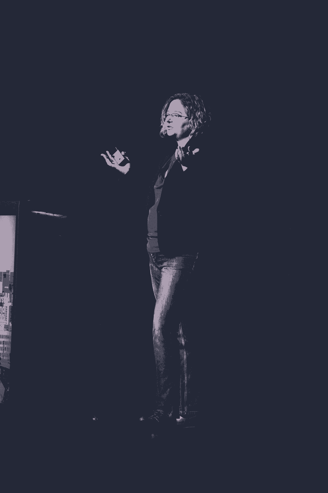

# 交付软件的正确方式

> 原文：<https://review.firstround.com/the-right-way-to-ship-software>

*本文由* *[乔斯林·戈德费恩](https://www.linkedin.com/in/jgoldfein "null")* *撰写，天使投资人，曾任脸书和 VMware 的工程主管。她因帮助工程团队在高速增长时期扩大运营规模而闻名。在 First Round 的最后一次 CTO 峰会上，她分享了她在不同环境下发布软件的经验，并就如何构建自己的发布流程向初创公司提供了建议。*

我一直在附近转悠，卖了很多软件。我在拥有 3 到 10，000 多名员工的科技公司工作过。我开发了免费赠送的软件，并以 5000 万美元的许可费出售——以及介于两者之间的所有价位。这些产品中的每一个都是以不同的方式开发和交付的，在有机会对它们进行比较和对比之后，我很乐意揭示一种真正的软件交付方式。

我惭愧地承认我不能。

我已经多次发现并重新发现了构建和发布软件的“正确”方法。我发现对某些实践(比如，精确的编码估算、通过 A/B 测试的详细规格或 UI 设计)有着近乎宗教般的热情，但当我试图将它应用于其他产品时，却发现魔力消失了。

在一个行业中，我们在标签宽度和大写字母上进行了长达十年的圣战，这并不奇怪人们会对他们的开发和发布习惯产生依赖。但是，如果说发布这么多软件教会了我一件事，那就是成为一个不可知论者。不同的方法针对不同的目标进行优化，它们都有缺点。如果您最大化进度可预测性，您将损失工程师的生产力(因为这被证明是典型的时间/空间权衡)。即使当你不处理教科书上的权衡时，所有的努力投资都与你可以花费时间的其他事情进行权衡，无论是构建自动化测试套件还是对错误进行分类。

我的工程师同行们，请不要再问“这个过程是好是坏？”并开始问“它适合我的情况吗？”

想想我的两个前世:

当它还是一家初创公司时，VMware 需要提供可预测的日期和高可靠性，因为他们必须说服保守的企业从一家新晋供应商那里购买操作系统。(当时，虚拟化听起来像科幻小说！)

在脸书的创业初期，他们需要快速行动，因为先发优势意味着基于网络效应的产品的一切。

其中一个把大量的工程重点放在可预测性和可靠性上；另一家公司致力于推动用户参与。不难猜出哪个是哪个。可以想象，这两家公司的开发实践有着天壤之别。没有谁是对的，也没有谁是错的——他们都为他们想要实现的目标做出了适当的权衡，如果将每个公司的做法应用到另一个公司的产品上，将会是无效的或灾难性的。

# 首先，看看客户是谁

为了确定“开发软件的正确方法”，你必须了解什么对你的产品重要，以及如何优化。这不是基于个人喜好。最终，它源于你公司的使命，而你赚钱的方式是这一使命的合理代表。

很有可能，如果你以高价出售软件，你是在向那些根据他们的*需求*购买你的软件的企业出售。您的软件越贵，对您的客户来说就越关键，您就越有可能在可靠性、功能和可预测的时间表方面进行优化。你可能认为商业客户会尽快喜欢你的软件，但是因为他们有很多依赖——部署、培训、集成——通常对他们来说，你是*可预测的*比你是*快速的更重要。*交易规模越大，客户越少，这意味着每个客户对你的影响力相对更大，满足他们的需求对你的创业公司的生存更为重要。

许多最传统、最老派的软件过程方法旨在确保进度的可预测性:仔细的特性说明和任务估计、依赖性分析和长浸泡时间。更现代的技术，如持续集成、全面的单元测试和 beta 测试，也有助于更早地发现技术风险。我在 VMware 工作的七年里，我们所有的努力都放在一个三条腿的凳子上，它的腿是:时间表、功能和质量。所有这些都必须被服务，这在工程工作中付出了很高的代价，并且开发人员的生产率有时似乎低得不可思议。我们尝试了号称周期更快的新技术，但它们也带来了一个代价:缺乏远见。这对我们的顾客来说是不可接受的。

根据经验，昂贵的软件意味着可预测性是运输的关键。客户需要你的产品。如果你有一个较低(或没有)的价格标签，集中在 UX。不需要你产品的用户也得要。

那么，如果您的客户不是要求苛刻的企业呢？随着你收费越来越低(从数百万到数千，到数百，到免费增值和免费)，你的市场会变得更大，涉及更小的企业或消费者。对于这些产品，时间表可能不太重要，因为人们通常会接受你的最新改进，无论它们何时实现。单个客户的影响很小，因此您可能会降低只影响少数人的利基平台或 bug 的优先级。

然而，你不能因为价格低就决定质量不再是首要问题。如果你的产品便宜或免费，人们可能会使用它，因为他们*想用，*而不是因为他们*必须用*。从历史上看，用户体验(UX)对消费者来说比企业产品更重要。企业供应商正在领会大 UX 的价值，但是他们将卓越描述为“消费级用户界面”是有原因的你会发现不同的实践工作，以确保 UX 质量，包括授权的设计团队，原型和迭代之前承诺的日期，设计和工程之间的密切合作和用户测试。

舞台在这里也很重要。如果你发展很快，如果一年后 80%的用户都是新用户，并且不会记得你的错误，那么牺牲质量可能是可以接受的。另一方面，如果回头客(也就是经常性收入)是你的游戏，你最好确保现有的客户感到高兴。

# 接下来，评估你如何部署以及你愿意冒多大的风险

科技公司之间还有另一个同样重要的差异会影响你的发布权衡，那就是你的部署模式。部署在云中意味着您可以完全控制软件的运行时环境。这意味着你的词汇表中不需要有“测试矩阵”这样的词，这大大减少了测试时间和需要修复的 bug 数量。你可以随时更新；分发是即时和普遍的(并且不需要用户的努力。)你删除的代码实际上会消失。您不必担心修复代码中的 bug，这些 bug 是您在两个版本之前因为用户没有继续前进而放弃的。部署到客户的设备上(包括从原生移动应用到操作系统的所有东西)意味着发布一个版本的一次性成本和未来成本会大幅提高。

**你想要可靠性**？无需数周的实验室压力测试，只需交付生产并逐步提高负载即可。当你遇到瓶颈时，关掉它并解决问题。

你想要高效的测试吗？嗯，你可以用 20%的测试来捕捉 80%的错误，然后快速发现并修复少数逃脱的错误。

**你想要设计质量**？通过为少量用户将原型投入生产，让自己接触到快速反馈循环，看看它是如何工作的。

当然，你没有选择部署在云端的自由，只是因为它让你的生活更轻松。有些产品(操作系统或视频游戏机)根本不可能完全存在于云中。如果你在手机上为消费者构建，你可能会选择一个原生应用，这样你就可以提供最好的 UX，因为至少在消费者中，丰富的 UX 胜过工程生产力。我知道这听起来很荒谬，但是要做好准备，移动应用与操作系统比网络应用有更多的共同点。这就是为什么即使你首先是移动的，你也希望你的移动应用程序的所有大脑都在服务器上，在那里你可以很容易地改变它们。

脸书转向移动领域的努力显示了潜在的麻烦。脸书设计和发布软件的快速、个性化和迭代的方式深深植根于产品团队文化中。如果你在 web 层工作，发布的成本非常接近于零，实际上你工作方式的其他一切都是为了利用这个假设而优化的。随着该公司的重点转向原生移动应用，因其移动专业知识而被聘用的工程师坚持一个此前未知的流程，如功能和 UI 冻结、功能规格和 QA。

学习新的编程语言和框架并不是让脸书的工程师们难以转向移动的原因。这很难，因为他们必须撤销所有关于如何制作软件的假设。我想告诉你的是，考虑到本地应用开发的限制，以及什么对脸书的用户群体最有利，我们对各种实践的优点进行了冷静的分析。实际发生的事情更像是感恩节餐桌上的宗教或政治讨论。我们都是一家人，但在根本上存在严重分歧。

这场辩论的核心是对风险容忍度的不同假设。对风险的偏好融入了脸书的文化——毕竟，这家公司带给你的口号是“快速行动，打破常规！”长期在脸书工作的工程师们将接受风险视为一种基本的文化特征，当时他们并没有意识到这种运营模式依赖于对宇宙的假设，这些假设对网络是正确的，但对移动设备却不是。

弄清楚自己的软件开发风格意味着你必须考虑自己的风险偏好。

一般来说，出于完全理性的原因，初创公司应该是积极的冒险者。当你没有客户、收入或品牌时，一个错误的影响是无关紧要的。你以前一无所有，以后也一无所有。所以谁在乎呢？但是一旦你有了客户，你必须根据你造成的痛苦来定义一个错误的代价。基于不同的业务和部署模式，类似的运营错误可能会导致一家初创公司的增长率下降 5%，另一家下降 75%。如果是这样的话，那些创始人最好以不同的方式经营这些公司。

在 Twitter 的早期，服务中断是如此普遍，用户创造了术语“失败的鲸鱼”(灵感来自 Twitter 的中断页面上的图形)，作为“又一次中断”的简写。失败的鲸鱼最终对 Twitter 的业务并不致命，因为用户耐心地给了他们很长时间来修复它。是的，我们开了很多玩笑，但我们没有离开服务。想象一下，如果像 Salesforce 这样的公司遇到了“失败的鲸鱼”问题。如果他们的客户经常遭遇中断，导致他们无法记录收入或拨打销售电话，那游戏可能就玩完了。客户会转而使用本地 CRM。当企业依赖您的软件进行关键任务操作时，您的错误会给他们带来非常大的痛苦。因此，消费者业务比企业软件业务能承受更大的风险。

部署模式也会影响风险。当客户遇到问题时，你修复错误的速度与错误的严重程度同样重要。当您可以将一个热修复程序推送到您的服务器，并立即为每个用户解决问题时，您的修复速度将比发布过程快一个数量级，如果您的发布过程涉及两周的 QA 窗口和 App Store 审查过程，以获得最小的代码更改，之后客户可以在自己方便的时候安装补丁。Twitter 作为一个基于网络的产品足够幸运，能够修复服务器端的中断问题。想象一下，在基于客户端的消费产品(如苹果 iPhone)中，由于除了下一个手机版本之外看不到任何解决方案，导致间歇性中断的错误。那部有问题的手机被扔进了历史垃圾堆。

为了说明部署和风险是如何复合的:如果您碰巧向企业出售内部部署系统软件以获得大量资金，那么您将面临巨大的痛苦和漫长的更新时间。你可以相信，同样的错误会让你付出比向消费者提供免费网络服务高出两个数量级的代价。

对全世界来说，VMware 比脸书更加厌恶风险，这可能是显而易见的。要意识到这并不是因为黛安·格林和马克·扎克伯格性格不同，也不是因为他们中的一个是对的，一个是错的。他们是不同的企业，拥有不同的技术堆栈，他们根据客户能够承受的风险程度，以完全不同的方式恰当地发布软件。

# 你如何运输是你文化 DNA 的一部分

既然您已经清点了您的业务模型、部署模型和风险偏好，那么您已经有了一个分析您正在使用的发布过程的良好框架。如果你已经生存了足够长的时间，实现了产品与市场的契合，并吸引了一些客户，那么很有可能你已经自然而然地适应了有意义的实践。在创业公司，就像在自然界一样，形式遵循功能。你可能会让自己大吃一惊，发现自己一直在无关紧要的目标上浪费精力(比如消费者业务的进度可预测性)！

除了基于这个框架分析你当前的方法论，你还可以用它来过滤采纳谁的建议，模仿哪个公司的做法，甚至雇佣哪个领导。

如果您在处理多种技术或业务模型时遇到困难，您可能会发现这个框架特别有用。一家初创公司很可能需要同时支持 web 和原生移动应用，或者不止一组客户(比如，一个针对消费者和企业的不同应用的双边市场)。在理想的情况下，您的发布过程会有所不同，以匹配正在开发的产品。但是你如何运送不仅仅是过程，它是文化和身份。换出一个进程很容易。改变文化很难。对于一个小公司来说，为不同的团队拥抱不同的文化就更难了。

如果你发现在你的公司中多种“运输文化”处于紧张状态，你正在处理构建和运输软件的一个基本的困难的执行挑战。当人们基于情感而非理性来表明立场时，没有简单的答案。有利的一面是:你的团队的情绪被卷入了！当冲突愈演愈烈时，你可能很难记住这一点，但你的工程师热情地关心你的公司，这是一个好消息。

深呼吸，提醒他们发布过程来来去去，但是你公司的使命和价值观是不变的。希望你的团队能够同意，最终重要的是为你的用户提供最好的产品，剩下的是可以协商的。幸运的话，这个框架将帮助你解决这个问题。