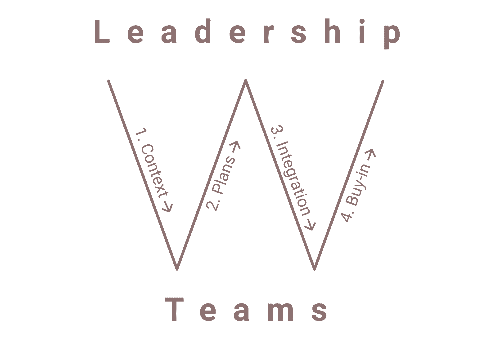
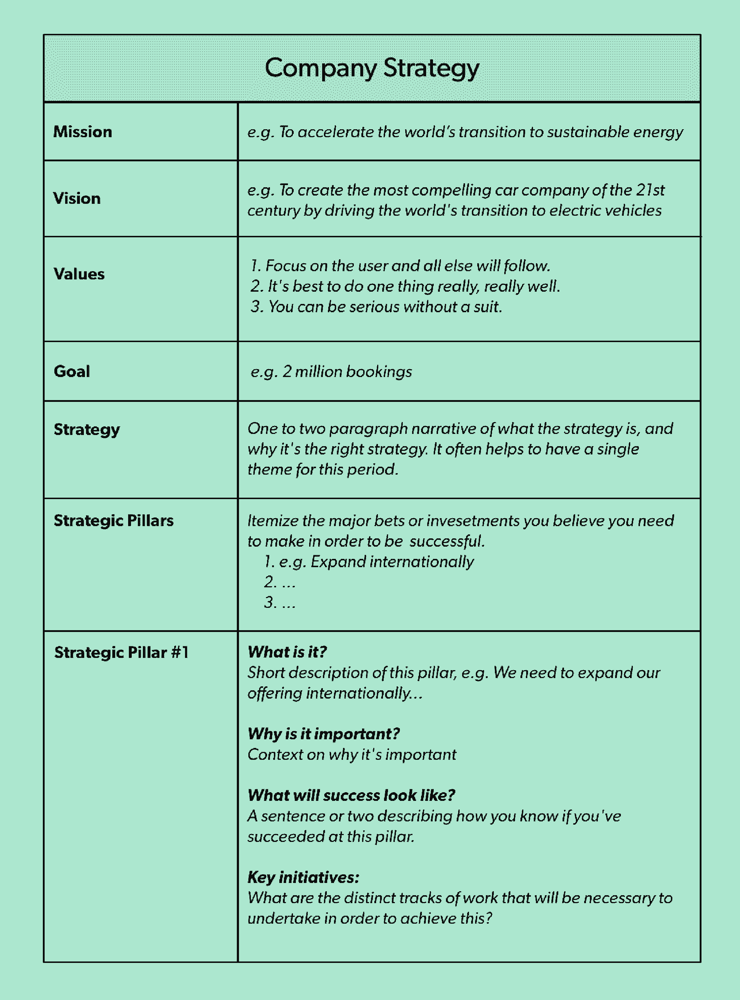
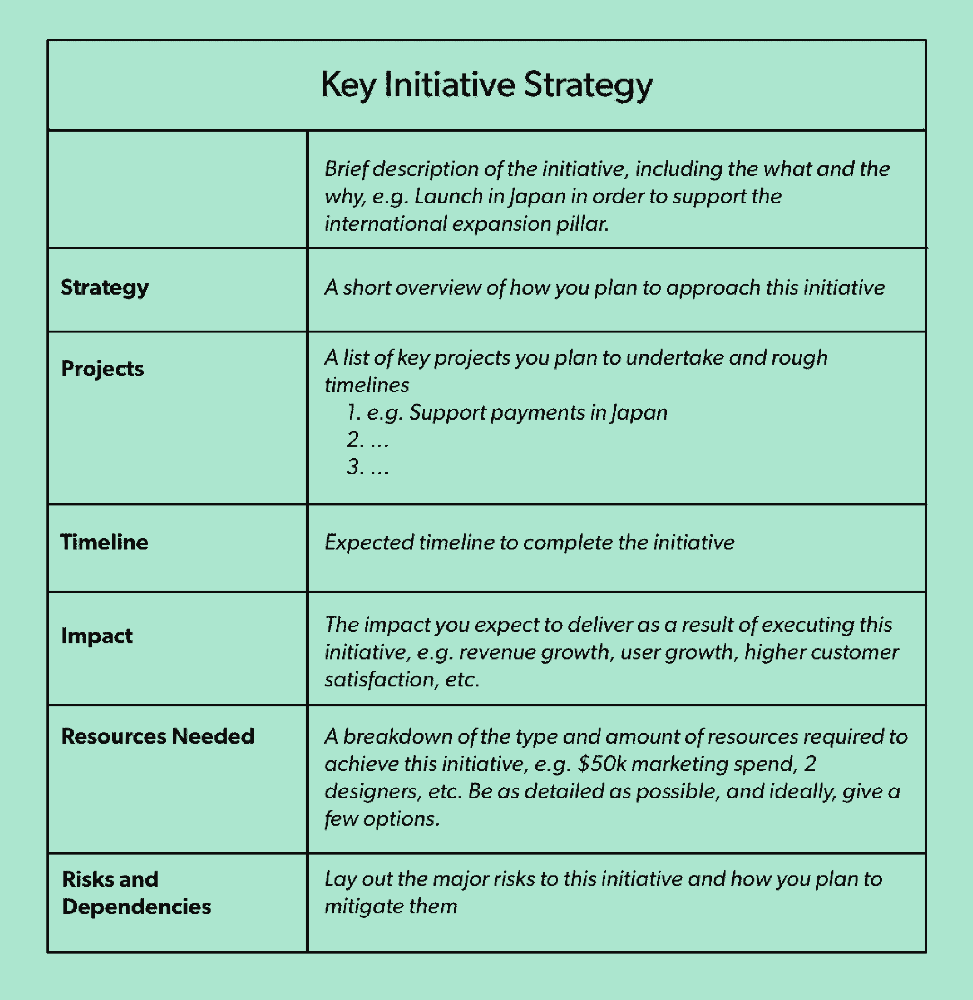
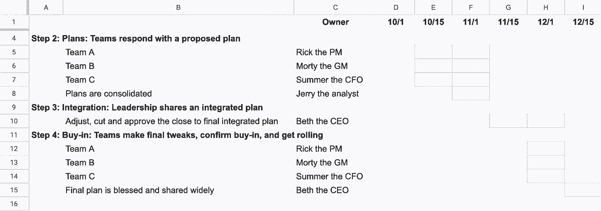

# 伟大规划过程的秘密 Airbnb 和 Eventbrite 的经验

> 原文：<https://review.firstround.com/the-secret-to-a-great-planning-process-lessons-from-airbnb-and-eventbrite>

*本文由 Airbnb 前产品主管兼消费者供应增长主管**[Lenny Rachitsky](https://twitter.com/lennysan "null")**和 Eventbrite 前全球收入战略主管**[Nels Gilbreth](https://www.linkedin.com/in/nels-gilbreth-36a9821/ "null")**撰写。*

第三季度即将结束，这意味着年度(和季度)计划即将出台。如果你和大多数人一样，这句话只会让你充满恐惧。

在 Eventbrite 度过了 10 年，在 Airbnb 度过了 7 年之后，我们已经经历了几十个规划周期，所以我们亲眼目睹了它是多么的混乱和具有挑战性。有时我们仍然在制定我们的年度计划——一年中的第三个月。其他时候，一个半吊子的计划匆匆通过审批，仅仅六个月后就被彻底放弃了。对我们大多数人来说，当计划结束时，我们只剩下受伤的自尊、错位的计划和缺乏认同。

另一方面，我们也看到了一个伟大的规划过程的力量。在一个案例中，一个单独的团队始终走在计划的前面。他们总是准备在季度的第一天大干一场，因此比其他任何人都更快地产生重大影响(而且士气更高)。

**计划很难，因为它本质上不同于你的组织进行的其他练习**。它不需要专注于日常执行，而是需要大量的人去思考各种可能的未来，团结在一个单一的未来上，然后规划一个具体的路线来实现它。为你自己的个人目标(例如，新年决心)做这件事，感觉很有挑战性——对几十或几千人做这件事感觉几乎不可能。

你不能指望组织“只知道”如何制定季度计划。没有一个公认的框架通常会导致灾难。

下面我们将分享一个我们称之为**“W 框架**的系统。在离开各自的组织并回忆起我们协调大量人员来推动集体影响的经历后，我们想到了这个主意。我们意识到几乎所有糟糕的计划过程的根本原因都很简单:**对角色缺乏基本的理解——谁负责什么，什么时候**。例如，谁应该在计划中有发言权，什么时候？每个利益相关者到底需要交付什么，向谁交付？谁设定时间表？谁让每个人都有责任？谁做最后的决定？这些问题经常得不到解答，这导致了规划过程中的混乱和失望。

我们已经在各自的组织中使用了这个框架的变体，并且见证了它是如何使计划变得更可预测、压力更小并且显著更有效的。下面我们将详细介绍该过程的每一步，强调最佳实践，并指出常见的陷阱。(最后，我们将全面总结所有内容。)

虽然使用这个框架不能解决你计划过程中的每一个问题，但我们坚信它会使几乎任何组织的计划都更加有效。

*在我们开始之前，请注意:*这个框架是一个完整的自上而下的公司规划过程，最适用于超过大约 25 人的公司(一旦有多个团队)。它的目的是帮助公司的领导(即高管、创始人)在整个组织中建立一个规划过程。对于单个团队领导，你可以倡导你的公司使用这样的框架，你也可以在你自己的团队中使用相同框架的缩小版。

# 打开 W 框架

首先，你首先需要确定将参与计划的两个基本团队:领导团队和个人团队。

**领导层**群体一般是公司的高管人员(CEO 和向她汇报的人)，或者某个业务单元的高层领导(产品 VP、工程 VP、业务单元总裁等。).

**团队**是执行实际工作的人，例如营销团队、每个产品团队和客户服务团队。举个实际例子，当 Lenny 领导供应增长团队时，他与一个领导团队一起工作，这个领导团队包括家庭业务部门的总裁、数据科学总监、设计总监、工程总监、运营总监以及其他一些总监和副总裁。

在几个不同的规划周期中，我们已经看到了这些角色的极端表现方式。我们已经看到领导团队去了一个非现场的地方，带着一个最终确定的计划回来，却从来没有让团队参与进来。我们已经看到了相反的情况:团队“收回”计划，在没有领导参与的情况下完成几乎所有的工作。根据我们的经验，最好的办法是在这两个极端之间找到平衡。

该框架由四个步骤组成:

**1。背景**:领导与团队共享高层次的战略

**2。计划**:团队响应提议的计划

**3。整合**:领导整合到一个单一的计划中，并与团队共享

**4。买入**:团队进行最后的调整，确认买入，然后开始行动

为了成功实施该流程或任何公司规划流程，我们建议以下角色和职责:

**领导层**(即高管团队、业务部门领导)负责:

制定鼓舞人心的高层次愿景和战略

分享这一时期的具体目标

最终决定什么是优先事项和资源

**团队**(即跨职能产品团队)负责:

制定支持高层战略的执行计划

强调最终计划的差距和风险

在给定的资源水平下致力于一个目标

有了这个高级框架，让我们深入每一步。我们将分享来自我们自身经验的例子、模板和避免常见陷阱的策略。

# 第一步:领导提供背景

“为了提高规划过程的质量，管理者可以做出的第一个解放性的改变是，通过深思熟虑地识别和讨论对未来业务绩效有最大影响的战略问题来开始。”——*T3【麦肯锡 *

如果你从这篇文章中学到了什么，那就是好的计划需要自上而下的指导。在我们过去的一个计划周期中，领导团队(在本例中是我们业务部门的领导)收到了来自所有不同团队的来年综合计划，这是一个不这样做可能会出错的例子。这个计划是自下而上的，每个团队更集中的计划被合并成一个大的计划。结果令人大开眼界。优先级是团队数量的五倍，而且单个团队的策略往往背道而驰。当高管们看到这一幕(并有机会深吸一口气)时，他们意识到自己犯了一个错误。

这个问题的核心是团队缺乏背景。团队需要知道现在需要做什么投资，以便为公司未来的成功做好准备。他们需要知道企业最大的风险在哪里。领导层对这些事情有着最好的理解，当计划开始时，必须确保这种情况得到沟通。

团队需要上下文。他们需要知道公司在接下来的一年里绝对需要解决的问题。

领导层应该如何与团队分享这种背景？最好的方法之一是将他们的**公司战略初稿放在一起分享。**

最终，这份文件将发展成为完整的公司计划，但现在，领导层应该把重点放在战略要素上。在这个阶段，一个好的公司战略给出了一个简洁的概述，说明领导层认为什么是成功之路。

任何公司战略文件的五个要素是:

1.使命——你打算实现什么

2.愿景——一旦你实现了，它会是什么样子

3.目标——你如何具体地知道你已经实现了它

4.战略——实现战略的途径是什么

5.战略支柱——公司需要做的三到五个关键赌注

在这一阶段，领导层不应该过于关注让计划变得过于完美。规划不是证明领导有所有答案的时候。这是一个分享他们所知道的，并邀请他人帮助填补空白的时间。领导需要大家的帮助才能完成。最重要的是，战略计划准确地反映了领导者此时的最佳思维。

事实上，我们鼓励领导不仅要说出他们知道的，还要说出他们不知道的，并且希望他们知道的。例如，领导层可能知道他们必须扩展到 APAC 市场，即使他们还没有就首先扩展到哪些特定国家(或如何扩展)达成强烈的共识。如果是这样的话，他们应该明确说明这一点，即，“我们知道向亚洲的扩张对我们的成功至关重要，我们也相信日本可能是我们应该集中努力的地方。然而，我们愿意听取有说服力的理由来进入其他国家，而不是日本。”

重要的是，领导层的观点不应被解释为一种命令。很重要的一点是，领导层应尽早提供他们认为对公司发展至关重要的战略信息，*但在第二步中，团队被鼓励退回来，分享更好的方法。*

你希望充分发挥团队的创造力，同时确保你们都朝着同一个方向前进。

# **制定战略计划的技巧:**

**从倾听开始**:直接与现场员工交谈，回顾过去的数据挖掘和研究发现，并开始捕捉最有趣的想法。

**让一个人通过第一关**:让一个小组评论和重复一个稻草人的提议，远比一个小组一起实时制定一个计划更有效。

**透明**:包括你思考背后的背景。大声说出你*确定的*和你*认为*可能是真的。

专注于你的努力:一个好的策略是专注的策略。为了获胜，你需要做好哪些事情？现在需要做什么，如果你以后做，什么会同样成功？

**不同意并承诺**:领导层在进入下一步之前达成一致非常重要。

# **这个阶段常见的陷阱:**

过于指令化:领导确切地告诉团队该做什么，却没有暗示他们的反馈是计划过程中的重要一步。这导致创新和员工满意度有限。

缺乏重点:领导层内部无法就一项战略或有限的优先事项达成一致。这导致了所有团队的连锁反应，没有整体战略和看似无限的优先级列表。

没有背景:领导层完全跳过这一步，而是要求团队在真空中制定执行计划。虽然从表面上看，这似乎是一种授权行为，给予团队很大的自由，但在实践中，它会导致计划不集中和不一致。

**过度思考:**领导层认为必须证明自己有所有的答案，否则这个计划就不“完整”相反，他们应该专注于分享他们知道什么，他们有什么假设，以及他们需要帮助回答什么问题。

**认为文档就足够了:**领导层给所有团队一些文档和模板，假设他们有足够的上下文和指导。然而，团队对无形资产理解得越多，例如，愿景和战略背后的“为什么”,他们就越有可能交付符合领导期望的伟大成果。

有效规划的关键？激烈辩论，但团结一致。

一旦战略计划处于合适的位置，领导层需要从团队中确定个人，他们将拥有战略计划的每个部分，并与他们分享所有这些内容。例如，如果你想扩展到 APAC，你可以选择在 APAC 的人(如 APAC 的总经理)，或在总部的人，可以与当地的运营人员和产品团队总部密切合作(如国际扩展的负责人)。选择这些人是关键，因为这些人将在剩余的规划过程中发挥关键作用。寻找那些与工作相关的、可靠的、能够在交付成果的同时大胆思考的人。令人惊讶的是，要花多长时间和多少次会议才能有效地分享这一背景，但最终，这些时间是值得的。

希望您发现自己处于一种组织结构中，这种结构使得识别不同计划的所有者(和支持资源)变得容易——在这种结构中，每个战略计划都完全适合现有的团队。如果没有，选择最合适的人暂时接手这项工作。

同时，考虑重组你的团队以符合你的战略。这现在听起来可能很痛苦，但是根据我们的经验，让你的战略通知你的结构(反之亦然)是长期成功的唯一途径。举个例子，当 Airbnb 扩展到[体验](https://www.airbnb.com/s/experiences "null")的时候，他们可以让现有的团队一起工作来创建这个新的业务线。相反，领导们做出了正确的决定，创建了一个全新的团队，相对独立地工作，直接向高管汇报。[比特币基地经历了同样的学习](https://firstround.com/review/lessons-from-coinbases-wild-ascent-four-rules-for-scaling/ "null")，认识到他们应该根据产品塑造组织结构图，而不是相反。

一旦你选定了你的关键人物，单独会见他们，分享你在上面建立的所有背景，然后告诉他们你需要他们做什么。我们建议领导层为他们正在推动的每个计划要求以下可交付成果。

1.战略

2.重点项目清单

3.预期时间表和影响

4.所需资源

5.风险和依赖性

此外，这也是分享规划流程完整时间表的时机。确保每个人都尽早理解时间表，每个项目都有人负责，每个项目都有人负责。

# 步骤 2:团队用一个提议的计划来回应

接下来，团队开始行动——他们接受领导层提供的所有背景，并开始为来年的计划交付计划。

每个项目的负责人应该组建一个团队(通常是他们现有的团队，有时是一个临时工作组)，并开始思考如何最好地解决他们面临的问题。重要的是要记住，尤其是在这个阶段，领导层提出的所有建议都有待讨论。如果团队在提议的计划中看到了主要的缺陷，或者有更好的方法，这就是强调这些要点的时候了。

# **下面是我们通常用来制定团队计划的流程:**

**1。早点开始:**在规划正式开始之前，就开始制定你的视角。尽管事情会发生变化，我们发现最成功的团队会提前做好计划(并准确预测领导层的要求)。如果你做错了，在最好的情况下，你有一个现成的更好的领导建议，在最坏的情况下，你仍然可以使用有价值的部分。

**2。从问题开始:**你想解决什么样的问题？例如，“发展我们在 APAC 的业务”，或者“扩展到音乐垂直领域”在你继续下一步之前，确保每个人在这个问题陈述上都是一致的。理想情况下，每个团队只有一个明确的问题。如果你的团队是一个支持其他团队的“平台”团队，你需要了解其他团队的计划和问题，然后才能最终确定你自己的计划。与这些团队中的每一个都安排好时间，并确定你能做什么和不能做什么来支持他们。让领导提前知道你需要额外的时间来做计划，为这些协调会议腾出时间。

**3。提出假设:**和你的团队一起为如何解决这个问题提出一些假设。例如，“我们将通过与当地合作伙伴合作来发展我们在 APAC 的业务”或“我们将通过签约 X，Y，z 场所来扩展到音乐垂直领域”，与客户交谈，进行团队讨论，在安静的地方独自思考。

**4。想法:**针对每一个假设，提出测试和解决这些假设的想法。这里有一些想出好主意的方法。

**5。创建一个稻草人计划:**与第一步类似，一个人(最好是团队领导)应该首先制定[团队计划](https://docs.google.com/document/d/1RQWuvWDgcAv1ylksFXtiwhuTbHLcL1byIcoXsbCQfic/edit# "null")。

**6。获得反馈，迭代:**与团队分享这个早期计划，收集反馈，迭代，直到你和团队对它感觉良好。在整个过程中，挑选，区分优先次序，集中精力。

**7。理智检查资源:**为你今年想要如何投资提出你的理想比率。例如，应该将百分之多少的资源用于短期、中期和长期投资？你的跨职能团队成员的理想比率应该是多少？你的计划符合这个吗？

**8。巩固:**让拟定的计划进入一种状态，让故事感觉紧凑、润色。在这个阶段花额外的时间来确保你对这个提议感觉良好。你制定的计划应该很好地符合领导提供的背景。你计划交付的影响应该是雄心勃勃的，但可以实现的。资源应该被清楚地定义和很好地解释。

**9。获得你所依赖的团队的认同:**确保你所依赖的团队在进入下一步之前看到并认同这个计划，尤其是如果他们没有参与这个过程的话。这通常包括财务(他们是否认同你设定的目标)、CX(他们能否支持你的变革)、营销/销售和平台团队。尽早找出团队中的依赖和阻碍因素，让领导的工作变得更容易。

# **这个阶段常见的陷阱:**

**各自为战:**团队长时间独立工作，不与其他团队或领导沟通。这导致交付的计划偏离目标，浪费了大量时间。

准确地做你被告知的事情:团队认为他们从领导那里得到的方向是不可改变的。这一步的重点是让团队根据他们的实际经验分享他们独特的观点。团队突出他们认为更好的想法是很重要的。

**呆在你的盒子里:**只关注你团队的表面区域。相反，探索你无法直接控制的想法。其他团队可以做些什么来积极影响您的成果？你如何影响他们去做那项工作？稍后，领导层应在此分享意见。

一旦你的团队计划是可靠的，打包并与领导分享。除了发送预读邮件之外，每个团队还应该亲自向领导小组提交他们的计划。这给团队一个机会，在领导层过早下结论之前解决差距和问题。与你的团队一起设定期望，在你收到反馈后事情会发生变化——因为它们肯定会发生变化。

Nels Gilbreth, former Head of Global Revenue Strategy at Eventbrite.

# 第三步:领导分享综合计划

从理论上来说，第一步中开始的好主意，现在已经接近真实和具体了。您应该为您的每个计划准备一套详细的计划，包括战略、项目、影响评估和资源需求。如果计划看起来很不靠谱，那么回头重复第一步和第二步。但是如果事情看起来不错，你可以开始敲定计划。

在这个阶段，领导有三项主要工作:

区分优先次序:决定哪些项目和团队得到了资助

分配:分配资源和目标

整合:把所有的东西都结合成一个有凝聚力的公司战略

# 您可以继续使用[这个模板](https://docs.google.com/document/d/1JI73WrGplrhNE46aLyRD_B74gEynI77EPgXn1ic6WeQ/edit# "null")来收集最终的整合方案。

这个阶段的大部分工作涉及到困难的决定，比如资助什么，削减什么，加倍投资什么。为了做出这些艰难的决定，领导层应该进行一系列的小组讨论，逐一审查每个计划，并开始制定一个单一的计划。随着计划的形成，领导团队中的每个人都应该不断地相互询问以下问题:

1.战略上最关键的工作是否有优先权和资源？

2.每一次押注的收益是否值得投资？

3.你有信心团队会很好地执行并实现他们的目标吗？如果不是，什么会让你更自信？

4.团队是否足够雄心勃勃？或者可能过于雄心勃勃？

5.团队是否遗漏了额外的利益或风险？

6.你对投资组合的整体组合感觉如何？你是在新的事物上下赌注，还是仅仅投资于我们以前做过的事情？(一个很好的经验法则是将 80%投资于安全的短期投资，20%投资于风险较高的长期投资。)

7.你做得太多了吗？

记住，计划一旦付诸实施，总会变得更加复杂——从来不会减少。

新的优先事项出现了，市场力量改变了，一切都比你预期的要长。你的计划需要重点——可能比你感觉舒服的更多的重点。要设计一个真正有机会成功的计划，把你的资源放在少量的赌注上(理想的是 3 次，最多 5 次)。根据我们的经验，当你离开计划过程时，你会怀疑你是否在一个赌注下了太多的资源，这个赌注最终会成功。

将大量资源放在更少的事情上可能会有风险。大量下注有一定的安慰，其中任何一个都可能产生积极的结果。然而，根据我们的经验，这种感觉就像对冲，往往会导致有影响力的想法得不到发展壮大所需的资源。

例如，在 Eventbrite 的早期，Nels 记得他的团队有一个积极的计划，在短短两个季度内暂停许多活动，以支持进入一个新的类别。虽然这意味着对许多不同的事情说不，但他们成功地进入了这个类别，并获得了多年来他们最大的客户之一。

找到你最有影响力的赌注，然后全押。大胆的想法需要大胆的资源。

挑战你自己和你的同事是很重要的，如果他们不是易腐的(可以以后做)，战略性的(不要直接支持这个计划的战略)，或差异化的(让你从你的竞争中脱颖而出)。相反，把这些资源放在最重要的事情上。

此阶段的另一个关键考虑是确定自下而上的计划是否实现了既定的目标。如果是这样，太好了！只要确保这些目标经过审查，并且你相信它们。如果不是，那就有问题了。与财务、数据科学和每个计划的领导者合作，优化各种计划的预期回报。如果拼图块不能全部拼在一起，你可能不得不回到第二步。然而，大多数情况下，通过正确的关注程度，可以利用现有的一系列计划达成解决方案。

# **此阶段常见的陷阱:**

**不够积极:**领导层接受团队的平庸计划——容易达到的目标、缺乏创意的项目或有限的创新。这是设立高标准并做出艰难决定的时候了。不要害怕反驳或要求重做工作。如果这是正确完成计划所需要的，你甚至可以回到第一步。

**做得太多:**领导对太多事情说好。避免像[花生酱](https://www.mckinsey.com/business-functions/strategy-and-corporate-finance/our-insights/the-strategy-and-corporate-finance-blog/why-your-business-needs-a-hit-mentality "null")一样分散你的资源。现在做困难的事情。有些人会因为东西被剪了而不高兴。提醒他们正确处理更重要的事情是多么重要。

**埋葬领导:**领导层对艰难的决定含糊其辞，或者他们没有尽早或足够明确地分享令人失望的消息。这件事会曝光的。坦白几乎总是更好。

一旦领导层在综合计划后达成一致，就该进入最后一步了。

Lenny Rachitsky, former product lead and head of consumer supply growth at Airbnb

# 步骤 4:团队确认他们的买入

这一步通常被认为是理所当然的，或者被完全跳过。相反，领导经常在最终变更时给团队一个快速的提示，假装听取反馈，然后广泛地分享计划。这是一个错误。与团队领导分享整合的计划需要深思熟虑和小心谨慎。许多团队成员已经花费了几十(有时几百)个小时来开发他们的计划，获得内部一致性，并进行迭代。很可能很多东西已经改变了，甚至被砍掉了。

推出一个新的计划让领导者有机会对未来的工作产生强烈的认同、信任和兴奋。不要浪费它。

此外，领导层应该利用这段时间来确保他们在整合计划时没有遗漏任何关键内容。在计划期间总是有很多事情在进行，重要的事情可能会从团队之间的缝隙中溜走。

因此，这一步的三个目标是:

1.与团队领导分享整合的计划

2.根据他们的意见进行最终调整

3.承诺并广泛分享

# **如何以最少的戏剧性分享整合方案的小技巧:**

**带领导一起:**避免意外。当领导得出某些结论时，及时分享这些结论和决定。

**分享推理:**解释为什么，而不仅仅是什么。帮助人们理解这个决定从何而来。

分享权衡:计划和优先排序本质上是一个权衡的游戏。分享一下这些权衡，以及为什么做出这些权衡。

倾听:确保真诚地倾听担忧和危险信号。虽然这听起来像是抱怨，但人们关心的事实是一个好迹象。大多数情况下，现场团队比领导层更快地发现计划中的主要缺陷。

让人们兴奋起来:如果你对这个计划充满热情，帮助他们明白为什么。给人们一个兴奋的理由。

# **此阶段常见的陷阱:**

**跳过这一步:**在团队领导有机会分享反馈之前，领导层就敲定了计划。这通常会导致计划中出现许多本来可以很容易避免的缺陷。

**不感同身受:**很多人会感到惊讶，常常觉得自己的职业轨迹会受到冲击。提前确定谁需要特别的关注和解释，并花时间带他们一起来。

**不倾听:**领导将所有反馈视为批评，实际上并没有听到人们在说什么。大多数人都想做好的、有意义的工作——你至少可以听听他们的想法。

根据反馈进行调整，关闭未决问题，并对计划进行最终润色。这个阶段计划有 5-10%的变动是正常的。如果事情开始出现分歧，回到第二步或第三步。

通过深思熟虑和共同努力，该计划将汇集在一起，并准备与整个公司分享。这应该是一个值得庆祝的时刻。在整个组织所有领导的帮助下，利用您所掌握的所有信息，您已经想出了最好的计划。分享愿景、战略和未来激动人心的项目。让你的公司充满活力，跃跃欲试。

# 将这一切结合在一起

一个糟糕的计划过程是痛苦的——但是如果进展顺利，它会是一件美好的事情。虽然规划对许多组织来说很难，但根据我们的经验，它并不像大多数人想象的那么难。关键是要明确角色——谁负责什么，什么时候。尽早达成一致并坚持下去。W 框架是我们解决这一问题的最佳尝试，根据我们的经验，把这一块做好通常是一个糟糕的计划过程和一个好的计划过程之间的区别。

# **总之，这里是完整的 W 框架:**

**第一步:领导层为团队提供背景** *目标*:领导层就最重要的*可交付成果* : [战略计划草案](https://docs.google.com/document/d/1JI73WrGplrhNE46aLyRD_B74gEynI77EPgXn1ic6WeQ/edit# "null")，其中应包括:

代表团

视力

目标

解释成功之道的简短叙述(即策略)

三到五个战略“支柱”,描述公司需要进行的关键投资

**第 2 步:团队以提议的计划** *目标*做出回应:团队汇集他们为未来一年提议的计划*可交付成果* : [每个关键计划](https://docs.google.com/document/d/1RQWuvWDgcAv1ylksFXtiwhuTbHLcL1byIcoXsbCQfic/edit#heading=h.c50sltibqqhp "null")的计划，应包括:

战略

关键项目和时间表清单

预期影响和目标

所需资源

风险和依赖性

**第三步:领导层分享一个整合的计划** *目标*:领导层将许多不同的计划整合成一个公司计划*可交付成果*:一个有凝聚力的[公司计划](https://docs.google.com/document/d/1JI73WrGplrhNE46aLyRD_B74gEynI77EPgXn1ic6WeQ/edit# "null")，应该包括:

哪些战略得到了资助

这些战略在目标和时间表方面的期望

被削减的战略及其原因

**第四步:团队确认他们的买入** *目标*:确保团队被买入并准备推出*可交付成果*:

来自团队的反馈

团队的认同

与公司广泛分享的最终计划

*感谢* *[凡妮莎·施耐德](https://www.linkedin.com/in/vanessahopeschneider/ "null")**[伊莎贝尔·泰维斯](https://www.linkedin.com/in/isabeltewes/ "null")* *和* *[劳拉·钱伯斯](https://www.linkedin.com/in/chamberslaura/ "null")* *审阅本帖的早期草稿。*

*图片由 Getty Images / Sally Elford 提供。邦妮·雷·米尔斯拍摄的莱尼·拉奇斯基的照片。*