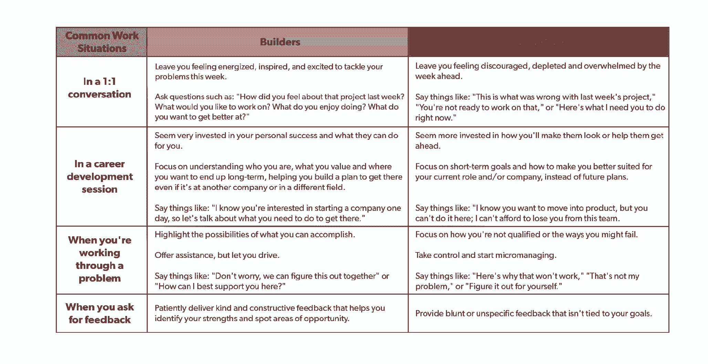

# 设计好奇心驱动的职业的秘密

> 原文：<https://review.firstround.com/the-secrets-to-designing-a-curiosity-driven-career>

Zainab Ghadiyali 的科技之路一点也不传统。虽然她最近的简历令人印象深刻——跨越了在脸书的工程职位的上升，她目前在 **[Airbnb](https://www.airbnb.com/ "null")** 担任产品负责人的角色，以及作为 **[Wogrammer](http://www.wogrammer.org/ "null")** 的联合创始人的兼职——她通往硅谷的不太可能的道路的倾斜和轮廓要显著得多，描绘了一个非凡职业生涯的地图。

她的旅程是由惊人的转变形成的:19 岁时，口袋里只有 107 美元的 Ghadiyali 离开了她的家乡孟买，在南卡罗来纳州的一所小学院学习化学。学生时代，她在柏林协助研究中国针灸和替代医学。接下来，她在一家公共卫生非营利组织的工作让她去了秘鲁和尼加拉瓜的一些最偏远的地方，后来一次偶然的机会让她去了脸书大学参加工程面试。“直到 25 岁，我才知道硅谷的存在，”她说。在我所有的生活经历中，我渴望学习。Ghadiyali 没有选择指定的专业方向，而是听从了自己好奇心的召唤。这是一种风气，直到今天，帮助她最大限度地实现个人成长，开创一个非传统的职业生涯。

在这次独家采访中，Ghadiyali 记录了塑造她独特职业生涯的转变，确定了在任何角色中脱颖而出所需的关键技能。她就如何在各个方向上发展你的职业生涯提供建议，分享在每个关头问自己的问题，并就如何让自己周围有支持者提供策略。从推动过去的冒名顶替综合征到为副业提供动力，她的见解——以及丰富多彩、迂回曲折的故事——对处于职业生涯任何阶段的企业家都有启发意义。总的来说，Ghadiyali 的旅程证明了好奇心驱动的职业可能是最有回报的道路。以下是你如何打造自己的。

# 在每一个十字路口，倾入好奇心

当 Ghadiyali 成长的时候，科技行业似乎是另一个世界。“我在印度的一个中产阶级家庭长大，”她说。“我父母大学没毕业，所以非常支持我的教育。”在孟买图书馆的书架深处，Ghadiyali 仔细阅读着自传，被那些经历与她周围环境相去甚远的名人的生活所吸引。

在这几页纸中，Ghadiyali 发现了一个指导原则，这个原则将会在她以后的生活中推动她的事业:好奇心。“书籍灌输了学习与我的世界截然不同的世界的欲望，”她说。

虽然许多人在童年时受到书籍的启发，但随着规划职业决策的压力越来越大，保护这种好奇心往往变得越来越难。以下是 Ghadiyali 用来激发创造力的策略:

# 利用创造性而非被动的心态来克服不确定性。

把好奇心放在驾驶座上，不可避免地会让不确定性成为顺风车上的乘客。但是 Ghadiyali 很早就学会了拥抱未知。“人们总是告诉我，‘你真勇敢，带着 100 美元去一个新的国家上大学，’”她说。但是勇敢需要恐惧，而我并不害怕；我对这种可能性感到兴奋。”

为了克服屈服于恐惧的诱惑，她借鉴了鲍勃·安德森关于[领导圈](https://leadershipcircle.com/en/products/leadership-circle-profile/ "null")的著作所启发的框架，该框架帮助她区分了两种不同的思考不确定性的方式:创造性思维和反应性思维。

“被动心态是由恐惧驱动的。你想到一个问题，你把它看作一个威胁，然后你对它做出反应。这会让你陷入焦虑的漩涡，你会把注意力集中在为什么你不能做某事的所有理由上，”Ghadiyali 说。“相比之下，创造性思维是由可能性驱动的。你强调什么是可能的，而不是为一个问题烦恼。创造性思维激发好奇心和激情，从而导致行动。

为了从被动的心态转变为创造性的心态，Ghadiyali 首先设定一个目标。“例如，如果我知道我将要进入一个困难的局面或谈话，我会提醒自己我想要的结果，”她说。“毕竟，如果你专注于积极的结果，你就含蓄地承认这是可能的。然后，你可以开始集思广益，找到达到最终目标的方法，而不是担心恐惧。”

当你开始你的职业生涯时，让好奇心成为你的向导。你永远不知道它会把你引向何方，但这就是刺激所在——它让你能够探索超出你想象的可能性。

# 把你的职业想象成一幅画，而不是梯子。

Ghadiyali 发现，当她放弃“职业阶梯”的概念时，她就能更好地拥抱自己好奇的冲动。这种传统观念意味着职业生涯应该被认为是线性的，沿着狭窄的轨道整齐的前进。但这一比喻导致对向上增长的关注相当有限。事实上，机会无处不在。

例如，当她开始职业生涯时，Ghadiyali 并没有走上一条平坦的职业道路。她在大学期间曾在柏林学习替代医学，并考虑成为一名医生，但因为医学院的费用而退缩。她也是在 2009 年毕业的，当时正值经济衰退最严重的时期，这进一步限制了她的选择。“我在网上申请了 200 多份工作，但都遭到了拒绝，”她说。没有明确的下一个台阶，Ghadiyali 向不同的方向出发，以另一种方式磨练她对医疗保健的兴趣。她离开美国，为公共卫生非营利组织国际儿童医疗救助基金会工作，该基金会带她去了印度和南美洲的偏远村庄。将近一年后，她决定回美国读研究生，学习卫生经济学。

理论上，Ghadiyali 的举动可能看起来像是一系列失误，导致她最终偏离了科技之路。但是通过把兴奋和好奇作为一条主线，明显不规则的转变之间的联系开始显现。这就是为什么 Ghadiyali 鼓励人们把他们的职业看作一件艺术品。

“当你从远处看一幅画时，你会看到一幅更大、更有凝聚力的画面，”她说。“但当你走近画布时，你会看到，事实上，有数百个单独的笔画组成了这幅画。把你的职业想象成一件艺术品——不断展现整体的扩展的、独立的运动。

当我们想象职业阶梯时，我们开始把自己放在一个盒子里。退后一步，看看这幅画——每一次经历都为一幅更大的画增添了一笔。

# 问这些问题，解锁全方位成长。

放弃职业阶梯的决定开启了追求其他更广阔的增长领域的可能性，这些领域通常被忽视。更重要的是，它给了你用自己的*术语定义成功和成长的自由。*

职业生涯不仅仅是飞速上升。横向扩张让你有更强的基础去追求纵向增长。

一到研究生院，Ghadiyali 就开始重新考虑她的职业目标。“我意识到，虽然我喜欢学习这个学科，但我对从事卫生经济学职业并不感到兴奋。我需要改变方向，”她说。

“我知道我希望我的下一个角色是我热衷于学习的东西，”她说。在每个职业生涯的十字路口，我都会问自己同样的两个高层次的问题:‘接下来我会兴奋地学习什么？我想达到的下一个学习水平是什么？这些问题帮助我在研究生院以及此后的每一个关键时刻做出决定。

**这种严格的、引导性的思考使 Ghadiyali 决定了她研究生毕业后的下一部戏剧。”我想起了过去令我着迷的一个问题。当我在非营利部门工作时，我亲眼看到了社区在公共卫生中的重要性——特别是在线社交网络，以及它们在传播健康信息或联系欠发达地区的个人方面的强大影响。我想，‘我们如何利用社交网络来最大程度地推进医疗保健和公共卫生？’”她说。**

**“那时我第一次意识到，我可以在科技行业产生影响，这些平台就是在这个行业创建的，”她说。**

**试探性问题不仅仅是为了在不同的行业设定路线。它们对于构成职业生涯的所有微观决策也很有用，无论是该换个团队还是完全转向一个新的职能。即使是现在，当她考虑科技行业的新角色和新公司时，Ghadiyali 也依靠三个有针对性的问题来评估她的下一步行动:**

****我在目前的职位上最大限度地提高了自己的成长吗？虽然跟随好奇心去寻找另一个角色很有价值，但过早地继续前进也有危险。例如，当她还是脸书的一名生产工程师时，她接受了一个可以让她平级进入软件行业的职位。“当时，我渴望转向软件行业。但是作为一名生产工程师，你能够真正理解系统是如何配合的，这是一项无价的技能。很容易陷入“下一步是什么”的心态——花时间停下来，确保你已经从目前的角色中吸取了所有你能吸取的东西。”****

****我的下一个机会是否符合我的价值观？为了开始寻找新的机会，Ghadiyali 建议明确地写下优先事项，以便系统地做出决定。“我创建了一个电子表格，我会把我所有的选项放在行中，然后在列中列出对我来说重要的因素，”她说。“我通常会寻找增长、财务稳定性、地理位置、优秀的经理人和创造力空间，然后我会给每个因素打分。然后我把哪个机会能产生最高的积分值加起来。这样，我就能确保根据对我来说最重要的价值观来评估我的选择。”****

**我想横向扩张还是潜得更深？当 Ghadiyali 对自己作为脸书的技术主管感到满意时，她必须做出决定:她是想继续积累专业知识，还是尝试一次横向调动？她选择在一家新公司尝试产品，但她谨慎地指出，即使你不打算转换职能，横向增长也很重要。“我认为，即使你想深入，也有你必须学习的横向技能，”Ghadiyali 说。“我注意到的一件事是，人们可能会因为缺乏专业领域以外的技能而止步不前。以沟通为例。你可能是世界上最熟练的工程师。但如果你没有能力传播这种专业知识，或者影响人们采纳你的想法，那么这种知识的实际影响是非常有限的。”**

**

Zainab Ghadiyali, Product Lead at Airbnb and co-founder of Wogrammer** 

# **重新定义“合格”的含义**

**乍一看，“跟随你的好奇心”似乎是一个贴在保险杠上的职业建议。但是 Ghadiyali 通过强调坚持到底的重要性，把一个模糊的真理变成了一个战术原则。“你需要关注你的兴趣，然后，更重要的是，专注于如何将兴趣转化为有意义的工作，转化为你可以追求的角色，”她说。**

**“当我想到在科技行业工作时，我与那个世界没有任何联系，似乎也缺乏任何相关技能。但我决心以某种方式实现它，”她说。**

**以下是帮助她将好奇心转化为行动的几点:**

# **跳上火车。**

**对于 Ghadiyali 来说，将兴趣转化为角色或职业需要仔细发现机会，然后利用它们。对她来说，打开科技世界大门的钥匙是免费的中餐。**

**“在研究生院的一个晚上，我路过一个宣传免费中餐的活动。她说:“对于一个以披萨为主食的学生来说，这似乎太好了，不能错过。这次活动是由脸书赞助的黑客马拉松，就在她拿着满满一盘食物偷偷溜走之前，一名脸书的招聘人员走近加迪亚利，问她是哪个团队的。**

**”我环顾了一下房间，有点惊慌失措，在一张空着椅子的桌子旁坐了下来。我的团队成员很快发现我一无是处，”Ghadiyali 笑着说。“但我留下来看着他们，完全被吸引住了。我的团队赢得了黑客马拉松，事实证明，获胜的团队获得了采访脸书的机会。”**

**只有一点需要注意:这是一次工程面试。虽然这是一扇敞开的大门，可以将她热爱的公共卫生工作与社交网络的力量联系起来，但 Ghadiyali 犹豫了。“我想，‘我应该等六个月，学习编码，然后再重新安排。’她说，当你面对一个机会时，很容易屈服于这些疑虑，找借口比如“时机不对”或者“我还没准备好”。**

**“尤其是因为，在这种情况下，内心的声音并没有完全偏离轨道——我确实不够格。但在那一刻，让我难以忘怀的是，这种恐惧是多么有限，多么令人无法动弹，”Ghadiyali 说。“我们必须停止听从头脑中的那个声音，那个声音告诉我们不能追求那个角色，不能要求升职，也不能改变我们的职业生涯。**每个人在职业生涯的某个阶段都会觉得自己不合格或没有准备好——决定你成功的是你是否愿意投入工作来证明那个声音是错的**。**

**现实是，没有人对一份工作是 100%准备好的。最终，明星球员的区别在于他们是否能发现机会并抓住它。**

**“这让我想起了一位家庭朋友和导师曾经跟我分享的一句话:**当火车离开车站时，你需要跳上去**，”她说。意识到可能不会有另一辆车开过来，她接受了采访。虽然 Ghadiyali 对脸书的侥幸采访可能仍然是一个关于黑客马拉松和免费食物的有趣轶事，但她抓住机会的意愿使它成为她进入科技的发射台。**

**根据她的经验，她提供了以下建议，告诉你如何战胜冒名顶替综合症，以及如何在你“不合格”的情况下应对面试:**

**放大你的优势。“让脸书相信我作为一名软件工程师拥有广博的知识是没有意义的，”她说。“但我的谈话表明，我是一个逻辑思维者。我让他们相信我学东西很快。当你准备面试时，不要因为你的弱点而气馁。相反，你应该专注于如何用自己的优势来弥补这些不足。”**

**最小化他们的风险。也就是说，有时候明确指出你的缺点是值得的，尤其是如果你的申请希望渺茫的话。“我问自己，’**我怎样才能把对他们的风险降到最低？**我能给出什么样的保证，让他们不太可能拒绝我？”她说。由于没什么可失去的，Ghadiyali 直面了她编码经验中的空白。我强调说，实习只有三个月，我对此充满热情，在这段时间里我可以学到我需要学习的一切。我确保面试官清楚地知道*我知道*我是黑马候选人——并且我愿意尽全力减少他们的赌博。"**

# **在你准备好之前跳跃——但是要准备好迎头赶上**

**在获得工程实习机会后，Ghadiyali 进入脸书，渴望学习。但是她很快发现，尽管大胆尝试令人钦佩，但真正的挑战是贯彻执行。**

**“尽管我尽可能地做好了准备，但我真的不知道在硅谷做一名软件工程师意味着什么，”Ghadiyali 说。在脸书的头几周，她感到不知所措，力不从心。“我不知道 Python 是什么。这是一场灾难。”**

**沮丧和强忍泪水，她告诉她的经理，她想放弃。令她惊讶的是，他阻止了她。“他告诉我不要再担心自己的不足，不要再拿自己和经验更丰富的人相比。他的支持和现实检验对我来说真的意义重大，”她说。**

**“每个人都说鼓起勇气去冒险是最难的部分。但这项工作才刚刚开始，”Ghadiyali 说。"**风险实际上不会推动你前进，除非随之而来的是对进步的奉献**"**

**和经理谈过之后，Ghadiyali 开始工作。“我在实习的剩余几周里尽可能多地死记硬背代码。我甚至在办公室睡觉。”实习结束时，她不仅完成了自己的项目，还获得了一份生产工程师的全职工作。**

**在一次冒险的行动中，你能做的不仅仅是增加投入和投入更多的时间。如果你刚刚跳上一辆行驶中的火车，以下是 Ghadiyali 对坚持着陆的建议:**

**对你的优势和劣势要现实。加迪亚利说:“当你在努力解决某件事情时，把它藏在心里是没有用的，尤其是当这个弱点影响到其他同事的工作时。让别人知道你认识到你需要成长的地方，并且你正在努力。如果你幸运的话，他们会帮你制定一个实现目标的计划。"**

**不要固步自封。“仅仅因为你在一个角色上取得了成功，并不意味着你可以将同样的技能应用到另一个角色上。她说:“对于每一个新的机会，评估一下你能从过去学到什么，以及你还有什么需要学习的。“尽管我在一个团队中作为软件工程师做得很好，但当我调到另一个团队时，我真的很挣扎。起初我很沮丧，但我需要后退一步，了解我的新环境并适应它。”**

****虚心接受反馈，即使你不同意。**如果你刚刚进行了一次冒险的职业变动，很可能你会收到很多反馈。泰然处之。“当我刚开始管理时，我收到了大量关于我的风格和策略的反馈，有些我同意，有些我不同意。但即使你不同意反馈本身，也要努力理解背后的“为什么”,并问很多问题以确保你理解了。如果人们感觉到你在倾听，这会让你们双方都敞开心扉去讨论和成长。”**

# **在非传统的道路上带上这些工具**

**对于不畏艰难的非传统道路的开拓者来说，并不总是有预先存在的目标或制度性的路标来支持你前进。**

**随着 Ghadiyali 职业生涯的发展，她积累了一套技能，使她能够绘制从针灸到 Airbnb 的路线。下面让我们仔细看看让她保持敏捷、适应性强和不断加速的日常超能力工具箱:**

# **培养说服的能力——这是不断给予的技巧。**

**自从从脸书的工程部门转到 Airbnb 的产品主管，Ghadiyali 注意到了曲折职业生涯的另一个意想不到的好处:随着时间的推移，她获得了大量可转移的软技能。**

**“**无论你是在研究医学、建立国际非营利组织，还是在硅谷编码，分析和解决问题的能力是拥有**最重要的技能，”她说。“像展示你的工作和与团队良好合作的能力这样的技能有助于你在候选人中脱颖而出。”**

**刚开始在 Airbnb 工作时，Ghadiyali 对说服的力量印象特别深刻。“加入后不久，很明显，我们需要投资重新构建我们的技术体系，以便扩展、构建更可靠的产品并改善开发人员的体验，”她说。“这将是一项极其耗时耗力的任务，所以我必须让一些人和我一起参与进来。我不是工程副总裁。我不是首席技术官或首席采购官。但是因为我对这个项目充满热情，我不得不学会从一个没有权威的地方不仅影响我的同事，而且影响领导。**最后，你不需要为了施加影响而把权力写进你的头衔里**。**

**Airbnb 并不是 Ghadiyali 学习影响力技巧和艺术的第一个地方。“回想起来，我从职业生涯一开始就一直在开发这个。她说:“当我试图说服脸书给我一个实习机会时，我在练习施加影响。“尽管我当时没有这样想，但这是我开始培养的技能。大多数人在生活的某个领域施加的影响比他们可能意识到的要大。”**

**我们认为影响力是一种超级力量。但事实是，每个人都有影响力。你说服你父母让你看那部电影。你说服空服员升级你的座位。影响力是一种生活技能——我们都应该在工作中更有意识地运用它。**

# **为饥饿而雇佣，而不是资格清单。**

**现在她自己是一名招聘经理，Ghadiyali 从坐在桌子的另一边获得了新的见解。在她的职业生涯中，她雇佣了近 12 名员工，在她运行的每一个流程中，她都主张更全面地审视候选人的技能。**

**“当我招聘时，我会忽略诸如‘三到五年的工作经验’之类的清单项目。“这对我不起作用，”加迪亚利说。相反，我定义了对每个角色最重要的三件事。例如，在一些团队中，说服能力更为重要。对于其他人，我可能会考虑跨职能支持或技术能力。"**

**在硅谷，我们倾向于过分看重严格的资历清单，而实际上，软性技能远比简历上一系列具体的头衔更有影响力**

**然而，Ghadiyali 在每个候选人身上寻找一种品质。她说，“尤其是对于创业公司和领导职位，经理们应该充满渴望地招聘。”。为了定义和辨别候选人的饥饿感，她提出了以下问题:**

****你愿意进一步了解这个问题吗？**“很容易把饥饿和激情、动力混为一谈。但是仅仅被激励去做某个特定的工作或者解决某个特定的问题是不够的。她说:“饥饿意味着渴望了解如何解决问题。"它很乐意、急切地寻找这种挑战."**

**你对什么感兴趣？ Ghadiyali 从 Koru 的首席执行官 [Kristen Hamilton 那里学到了这个策略](https://firstround.com/review/hire-a-top-performer-every-time-with-these-interview-questions/ "null")。“候选人在个人生活中表现出饥饿吗？我寻找从事副业的人。她说:“可以是烘焙、钓鱼、开发应用程序——任何能显示你在空闲时间学习热情的事情。**

**你上一次不得不学习新东西是什么时候？她说:“我在以往的经历中寻找显示某人愿意冒险和坚持到底的能力的模式。”。“他们会把自己推出舒适区去探索新事物吗？我希望我的团队里有这样的人。”**

# **让你周围都是“建设者，而不是清洁工”**

**Ghadiyali 也很快注意到，好奇心驱动的道路是由一路上支持你的人铺就的，在很大程度上。作为一个提醒，她相信她从玛丽·卢·杰普森那里听到的智慧之言:**这个世界上有两种人——建造沙堡的人和摧毁沙堡的人。我尽量让自己周围的人都是建设者，而不是清洁工。****

**为了识别你自己生活中的建设者，Ghadiyali 建议关注你的情绪。“谁会在谈话后让你对解决问题感到鼓舞或兴奋？那是建筑商的标志。他们投资于你的成长，”Ghadiyali 说。**

**相比之下，引座员会让你感到疲惫和沮丧，因为他们会提醒你可能会失败。“我想在团队中转换到一个新的角色，所以我向招聘经理寻求建议。我被告知离开公司，到其他地方获取经验，然后再回来，”Ghadiyali 说。“反馈让我大吃一惊，因为我已经投入其中，并且已经在朝着那个角色努力了。我花了一段时间来克服这种感觉，并认识到这不是很好的反馈。”**

**因为当你在职业生涯中不可避免地遇到一个陌生人时，Ghadiyali 说，“不要让最初的震惊让你偏离轨道。她说:“随着时间的推移，我学会了忽略反对者，专注于我可以采取的下一步*来实现自己的目标。***

**对于那些选择走非传统职业道路的人来说，让自己周围都是盟友，同时排除消极因素，是特别有效的建议。“标新立异会让你更容易患上冒名顶替综合症。你可能会更担心自己可能会失败，或者你不属于这里，因为你不符合这个模式，”Ghadiyali 说。让建筑者包围你是骗子综合症的解药:他们不会让你屈服于恐惧。**

****

# **侧推如何增强你的技能**

**有时候，激情和好奇心不能仅仅满足于公司的变动和新头衔，这就是为什么[这个副业](https://firstround.com/review/Spotifys-Design-Lead-on-Why-Side-Projects-Should-be-Stupid/ "null")诞生了。四年前，当她还是脸书大学的一名软件工程师时，Ghadiyali 就感受到了这种痒感，她第一次开始质疑作为一名科技界女性的说法。**

**Ghadiyali 和她的同事 Erin Summers 担心女性被描绘的方式有限。“人们经常走过来问我，作为脸书第一批女性生产工程师之一有什么感受。这总是让我感到惊讶，”她说。“我不想谈论那个，我想谈论我正在构建的这个很酷的功能或我刚刚发布的修复程序。有一天我和 Erin 谈到这个，她也经历了同样的事情。我们怀疑其他女人也是。”**

**为了弥补这一差距，他们在 2014 年推出了 Wogrammer，作为一个兼职的 [Instagram 项目](https://www.instagram.com/wogrammer/?hl=en "null")。自那时以来，该平台蓬勃发展，并找到了新的方法来推进其使命。沃格拉玛现在出版了[关于女性技术角色的简介](https://medium.com/wogrammer "null")，主持[研讨会](https://wogrammer.org/workshops/ "null")，并为新闻专业的学生管理[奖学金项目](https://wogrammer.org/fellowship "null")，这些学生将塑造下一代关于女性技术角色的故事。**

**采访了 200 多名女工程师后，Ghadiyali 和 Summers 注意到一个有趣的趋势。“我们发现，当我们问女性她们最自豪的是什么时——无论她们是科技公司的首席执行官还是高中生——她们很可能会说她们为一段关系感到自豪，无论是母亲、姐妹、女儿、朋友、导师还是经理，”加迪亚利说。这些都是值得我们骄傲的伟大的事情。但我们认为女性应该同样乐于谈论她们的技术成就。我们希望鼓励女性拥有自己的职业成就，然后将这些成就传播给更多的受众。”**

**你不要问男人做男品领导是什么感觉，也不要问女人做女品领导是什么感觉。问她关于她的成就，她现在在建设什么，或者她认为未来会是什么样子——这些都是更有趣的问题。**

**不管你追求的是什么样的激情，平衡兼职和全职工作的责任都不是一件容易的事。当你一天只有几个小时来做一个激情项目时，你必须有条不紊地最大化你的时间来产生最大的影响。**

**“我给任何想扩大副业的人的建议是，像做生意一样管理副业，”加迪亚利说。"**适用于商业和生产力的原则同样适用于社会影响**。问问你自己，你想如何建立可扩展的、可持续的筹款模式。由于 Erin 和我不能日以继夜地在 Wogrammer 上工作，我们的团队用脚本和自动化系统构建了非营利流程，以减轻工作量。我们还引入了一位出色的执行董事，建立了一个商业模式来创造一些收入，这样我们就可以最大限度地减少对捐赠的依赖，而捐赠是很难保证的。它让我们能够在有限的时间内扩展自己，产生更大的影响。”**

# **未来是光明的——也是令人好奇的**

**Ghadiyali 的好奇心将带她去哪里？“我现在感兴趣的一些领域围绕着老龄化、移民和性别平等，”她说。“未来，我想我会加入一家公司，或者自己开一家公司来解决这些问题。”**

**从早年的环球旅行，到她在硅谷的着陆，Ghadiyali 曲折的旅程被关键的转变和决定所塑造。事实上，她的职业精神呼应了史蒂夫·乔布斯 2005 年斯坦福大学毕业典礼演讲中的一句话:“向前看，你无法将点点滴滴串联起来。你只能回头看才能把它们联系起来。你必须相信，在你的未来，这些点会以某种方式连接起来。”**

**回顾过去，Ghadiyali 积累了一个被好奇心照亮的星座。通过以个人学习为中心，抓住向不同方向发展的机会，任何人都可以运用她的经验来设计一个对他们来说独特的——最重要的是有意义的——职业。**

**对于刚刚开始工作的年轻毕业生，我想说的是:不要太担心简历的制作。专注于建立你的技能，最重要的是，专注于创造一个真正伟大的生活。**

**但是也许个人的快乐和成就感并不是少走职业道路的唯一好处。正如加迪亚利所指出的，如果你围绕好奇心、适应能力和投资多样化的技能来设计你的职业转变，你就能有效地让你的职业适应未来。**

**“毫无疑问，技术正在改变工作的性质，”Ghadiyali 说。“我鼓励职场中的任何人，从职业生涯早期的人到创业老手，都要适应不断变化的工作性质。她说:**无论是兼职项目、与非营利组织合作，还是在公司内部做一些事情，做一些能让你发展软技能的事情。“未来更有价值的工作将需要高水平的创造性解决问题、同理心、沟通和影响力。这些是我们在很长一段时间内都无法成功训练计算机具备的素质。这将使你变得无比珍贵，无论你走到哪里，永远如此。”****

***摄影由* *[邦妮雷伊米尔斯](http://www.bonnieraemillsphoto.com/ "null")* *。***