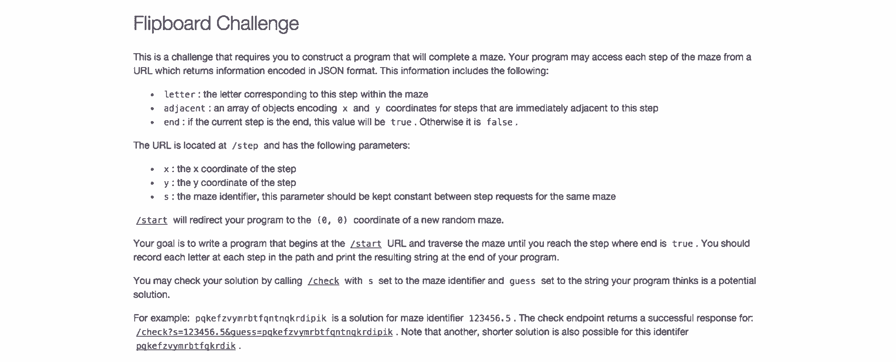

# 简单的数字可以改变你的招聘方式

> 原文：<https://review.firstround.com/the-simple-numbers-that-could-change-how-you-hire>

短短三年时间，冯在葫芦做了很多事情。作为该公司聘用的第一位高管，他在桌面应用程序 Hulu.com 的开发、分销和广告方面发挥了关键作用。他担任发言人，甚至自己编写了网站前端的大部分代码。它得到了回报——Hulu 一跃成为互联网上第二大视频网站，每月吸引 4300 万独立观众。但是有一项成就让这一切成为可能:**他雇佣的人非常好**。

当他离开公司时，他已经招募并领导了一个 80 人的技术组织，横跨工程、产品管理、设计和运营。现在，作为 [Flipboard](https://flipboard.com/ "null") 的首席技术官，他正在发展另一个火箭船团队，应用他学到的许多策略，尤其是这个:**你必须像对待你的产品一样，以数据驱动招聘。你把候选人的成交率看得和你的每日活跃用户数一样重要吗？你的招聘经理能不能不只是告诉你招聘进展顺利，而是用数字告诉你为什么？**

“正如经常被认为是世界上第一位数据科学家的 W. Edwards Demming 所说的那样，‘你不能管理你不测量的东西’，”冯分享道。在 First Round 最近的首席技术官峰会上，他概述了自己用来处理招聘数据、从中汲取有意义的经验教训并加以充分利用的策略。一路走来，他提供了许多公司可以采取的技巧和行动，以获得世界级的人才。

# 入门指南

你需要的第一个公式很简单。当你考虑招聘漏斗每个阶段的目标数字时，**除以 4** 。像许多招聘经理一样，冯指出了招聘生命周期中的四个关键阶段:

采购

排查

采访

雇用

当你考虑需要雇佣多少人时，只需做一些快速的除法(或者乘法，这取决于你从哪一端开始)。假设你正在寻找一名工程师，你的招聘漏斗应该是这样的:

如果你找到 64 个候选人...

16 个应该能通过你的筛选。

4 应该通过招聘程序。

我应该得到这份工作(而且极有可能接受这份工作)。

当然，这只是一个大概的指引。但这很有帮助。冯说:“当你明白这些水桶是如何流动的，以及每个阶段你应该有多少人时，你就可以微调那些真正不平衡的地方。”“例如，如果你想雇用一个人，你不应该从漏斗顶端的人开始。那是行不通的。我可以向你保证。”将您的数字与除以 4 的基准进行比较——实际上是做数学运算——可以帮助您发现您的流程可能在哪里崩溃或无效运行。

在每一个阶段，仅仅希望数字是一致的是不够的。以下是每个创业公司可以实施的关键策略，以确保招聘能带来最好的员工。

# 货源:从 64 到 16

在你前进之前，你需要找到足够多的符合你需求的候选人。领导者能做的最重要的事情就是多样化。也就是说，你应该通过三大招聘渠道找到大致相同数量的候选人:**外向**、**内向**和**推荐**。冯说，当一个来源大大超过其他来源时，公司就会被绊倒，所以你要捕捉每个来源的数据。

“接受推荐，但不要只关注*和*推荐。如果你这样做，你的候选人中就没有足够的多样性。随着你拓展人脉，推荐最终会逐渐减少。”建立一个可持续的潜在雇员渠道——随着公司的发展，该渠道将继续满足您的招聘需求——取决于培养对这些候选人来源的强大控制力:

**推荐(也就是最受欢迎的渠道):**“我看到的公司实施推荐计划的最大失误是，他们说，‘好吧，我们真的要把重点放在推荐上，所以我们要取消推荐奖金。就是这样，”现金激励固然很好，但冯提醒说，成功的推荐策略需要的不仅仅是奖金。事实上，你自己的团队是你应该不断向其推销空缺职位的主要受众。

“在 Flipboard，这是我们入职流程的一部分。在第一周，新员工会和招聘团队坐下来，我们会讨论推荐项目，”冯说。当他们在一起时，新员工甚至被要求快速浏览他们的 LinkedIn 和脸书网络，以唤起他们对任何他们可能认识和推荐的候选人的记忆。

强调推荐不应该就此打住。“在每周的秘密会议或全体会议上强调空缺职位，比如，‘嘿，数据科学团队有两个空缺职位，他们正在寻找有这种经验的人。’那很有帮助。"

冯甚至在 Flipboard 举办定期的推荐活动，让挖掘顶级候选人变得简单，就像让团队在一个房间里，有几个披萨和他们的笔记本电脑。“招聘经理进来分享他们的空缺职位。然后，我们让每个人坐下来，浏览 LinkedIn、脸书、Twitter、GitHub——任何他们可能认识的人——并根据这些推荐建立一个名单。”

当涉及到激励人们去参考的时候，正面强化是非常强大的。

在被推荐人入职的第一周，在我们的全员培训中，我们不仅会欢迎新人，还会认识到这个人是如何进来的。我们当场给推荐人奖金。

这是一个非常公开的、有益的提醒，提醒人们引荐招聘的互惠互利。人们看到这样的东西后会把它放在心上。

**海外招聘:**冯说，一个强大的海外采购项目的秘密在于寻找意想不到的地方。“很多人只是从 LinkedIn 开始，仅此而已。他们完了。那不行。你必须有一个非常多样化的地点索引，这样你才能不断地寻找候选人。”

首先是屡试不爽的:脸书、 [GitHub](https://github.com/ "null") 、[栈溢出](http://stackoverflow.com/ "null")。冯还建议创业公司关注最新的新市场，如白松露、[、](https://hired.com/ "null")、[极客榜](https://geekli.st/home "null")和 [HackerRankX](https://www.hackerrank.com/work "null") ，这些市场对于招聘更多初级员工尤其有价值。招聘机构仍然是补充你招聘漏斗顶端努力的一个重要途径。“只要你利用他们最擅长的领域，广告公司就能帮你找到一系列候选人，这是一个非常有价值的目的。冯说:“我发现，对于资深员工来说，中介公司真的很棒。

**外来兴趣:**“不管你是一家小公司还是谷歌，你都应该有很多人主动申请你的工作，”冯说。无论你是在推销你的产品还是你的公开需求，你的秘密武器都是一样的:**善于讲故事**。

越来越多的公司正在偏离传统的职位描述，要求和资格，以提供一个更全面的公司，以及他们寻求的角色是如何至关重要的。Medium 就是一个很好的例子，它的工作岗位旨在让观众真实地感受到公司的生活，以及如果他们加入的话会有什么样的预期。Flipboard 将这种创意更进了一步，[为每个功能领域创建定制页面](https://about.flipboard.com/team/design/ "null")，其中包括该领域高级员工的引用，以及团队其他成员在 Flipboard 产品上分享的内容的链接。

即使你写了招聘界有史以来最吸引人的职位描述，也不足以发布到你的网站上然后离开。“你必须把话传出去。你必须在尽可能多的地方传播这个故事，无论你的目标候选人在哪里进行搜索。大约 40%的求职者使用的社交网络不是脸书和 LinkedIn。”

你知道你的初创公司是一个令人兴奋的、快节奏的工作场所，所以要确保你的招聘信息不会无意中讲述了一个不准确的故事。

不要让你的工作岗位变得陈旧。大约 16 周后，你会看到入境游兴趣下降。

如果你已经过了那一点，只要把帖子拉下来，刷新一下，等一个星期，再重新发布。

一旦你让感兴趣的人送来了他们的材料，你需要承诺快速参与并让他们对你保持兴趣。“不要忘记采购也是销售。对于你用来寻找候选人的每一个渠道，你在接触时都需要使用不同的策略来推销。”

**对于通过推荐而来的候选人:**你需要利用你推荐的员工。“你应该说，‘嘿，苏珊和你一起上学。你对苏珊评价很高。她对你评价很高。“我们应该谈谈，”冯说。如果你只是简单地把它变成一个陌生电话，你的推荐就失去了影响力。“因为这种联系，你拥有不公平的优势。一定要用。”

**对于外出求职者:**冯说，当你联系潜在求职者时，一定要大胆直言，不要回避。“LinkedIn 发表了一个非常有趣的统计数据:**在任何给定的时间里，只有 25%的员工在积极地寻找，但 85%的人愿意谈论。你发现的候选人很有可能会欢迎你的邮件。**

也就是说，你不要粗心大意。你必须成为一个人。也许你要用邮件合并。你将会做很多自动化的工作。你要复制粘贴。但你要尽最大努力让自己听起来像个人，因为这是候选人的第一选择，”冯说。尽可能个性化你的外展活动，并针对特定候选人的动机发言。保持简短。时间越长，看起来越绝望，放弃的权力越多。

**对于入境求职者:**“当你收到关于工作的简历或电子邮件时，你应该有 100%的回复率。你真的应该。冯说:“如果有人花时间联系你的公司，而你却没有时间回应，这是没有理由的。你的信息可以非常简单，甚至只有几行。但如果招聘是销售，那么你的回复率应该和你的销售代表一样一致。“如果你的客户投诉，如果他们直接给你发电子邮件说有 bug，你可能会回复。同样，当有人对你的公司如此感兴趣，以至于想为你工作时，你也应该以同样的尊重对待他们。”记住，世界很小，消息传得很快。你希望每个人都对你有高评价，听到对你的高评价。

# 放映:从 16 岁到 4 岁

在这一点上，你的寻找努力已经产生了大量的潜在雇员(约占你所寻找的所有候选人的 24%)。现在是时候评估前 16 名参与的候选人，并选择最好的 4 人进行面试了。从招聘到面试这一重要步骤是公司招聘流程最有改进空间的地方。

“我是一名工程师。我喜欢应用技术。冯说:“在我看来，筛选是最有机会在你的整个生命周期中结合技术，真正做出重大改变、重大改进的领域。”。“一切都始于数据。”

首先，如果你没有使用申请人跟踪系统，你应该使用。“研究表明，通过申请人跟踪系统，你实际上可以提高至少 50%的效率。”而且有很多可以选择。找到最适合你招聘需求的那一个。重要的是，一旦你有了这个软件，你也就有了一个数据层用于你的招聘工作。

你真的不知道自己在过程中的哪个阶段崩溃了——我成功了吗？我不是吗？—没有数据。

您需要一种方法来定期存储和提取这些数据。冯建议公司从跟踪四个关键的招聘指标开始:

所有未结头寸

你得到的所有候选人信息

候选人的完整参与历史

你对那个候选人有什么反馈吗

“如果你把这四样东西储存在某个地方的数据库里，到那时你就有了能够弄清楚你表现如何的原始材料，”他说。

技术不仅仅可以帮助你分析你的筛选——它实际上还可以帮助你*执行*你的筛选。电话屏幕和电子邮件对话是常态，但是，正如冯指出的，单词和他们说话的方式实际上代表了候选人沟通的不到 50%。思考肢体语言、面部表情等。

“视频筛选是获得候选人更多信息的一种非常有效的方式，这些信息可以让你做出更好的决定。”冯指出，自 2011 年以来，视频面试的使用增加了 49%，现在每 10 名人力资源经理中就有 6 人使用视频面试应聘者。

对于工程招聘来说，编码挑战是另一种强大的方式，可以利用技术在筛选过程中快速、可测量地了解候选人的很多信息——正如冯所说，以提取更多信号——而你只需付出最少的努力。“在 Flipboard，我们建立了一个网站[challenge.flipboard.com](https://challenge.flipboard.com/ "null")，在那里我们发布工程问题。我们的大部分候选人都接受了这个挑战，它提供了大量有趣的数据，”冯说。

为了从这个练习中得到最大的收获，他建议了一些应该做和不应该做的事情:

**做**:建立你自己的编码挑战。“你可以使用第三方服务，有一堆这样的服务，但构建自己的服务其实很有趣。”在 Flipboard，它甚至成为员工士气建设的一部分。“我们让我们的工程师参加我们的测试，这很有趣，并给了我们很多关于它是否足够难的好信息。”

**不要**:想入非非。“你不必 A/B 测试你的挑战。你不必为每个职位准备 7 个不同的挑战。”那最终将是浪费时间。投资回报率低。

**做**:保持真正的开放式。"挑战仅仅针对特定的编码语言或领域并不重要."一般的挑战是最有效和可重复的过程，所以继续前进，让每个候选人以他们最舒服的方式工作。

请记住，这里的目标是开始一场对话，就像是筛选技能一样。有了对每个候选人的新见解，你就可以深入了解每个电话屏幕或面试。“我们只是简单地问候选人关于挑战的问题，”冯说。“‘你为什么决定使用这种语言？你为什么决定以这种方式实现它？“一个人谈论自己刚刚采取的行动的方式，通常足以让你发现表现出色的人，他们也是很好的沟通者。

# 面试:从 4 点到 1 点

当你进行现场面试时，你面对的是你的候选人中的佼佼者——你仍然会淘汰 75%的人。“我发现面试阶段实际上是整个招聘周期中最有争议的阶段之一，因为我们暗示你应该有 25%的成功率——这是一个相当高的失败率，”冯说。考虑到这也是生命周期中最昂贵的阶段——你投入了你的时间，很可能是你团队的很多时间，可能还要支付机票、酒店、晚餐等费用——这个失败率听起来可能是一个相当高的成本。

但是冯坚持认为这是完全值得的。“当你进行面试时，你实际上要做四件主要的事情:当然是评估技能和相互评估适合度。但是你也需要建立内部一致性；你需要让你的团队相信他们招到了好员工。最后，你有机会建立品牌。”

值得注意的是，无论你是否雇佣候选人，你都可以完成这四件事情中的后两件。大多数公司甚至不认为招聘是强化其品牌或现有团队的机会。有很多东西可以利用。

公司可能也不会考虑那 75%的人离开面试后会发生什么，这是一个错误。首先，在与你的公司进行了数天、数周的深度接触后，他们完全有可能成为品牌大使——或者不会。

你的招聘过程是你品牌的巨大反映。

“候选人会向人们介绍你的公司。他们可以说好话，也可以说坏话。冯说:“与他们在一起的整个过程是一个机会，让你真正创造一个福音传播者，创造一个将你的信息传播给世界其他地方的人，这是非常强大的。”。

候选人也是潜在客户。你在招聘过程中如何对待他们将会影响到他们是否会继续使用你的产品。“确保你考虑的是品牌建设体验。冯说:“如果你最终没有录用那个人，不要认为面试是浪费时间或徒劳无功。无论如何，创造一个积极的结果是可能的。

# 把它们堆在一起

一旦你深入了解了你的招聘周期——分为几个阶段，每个阶段都有目标人数——你就能更好地了解你的组织是如何运作的。冯说，除此之外，你可以专注于在流程表现不佳的地方进行改变、修正和试验。

你最后是不是面试了 30 个候选人，浪费了很多时间？或者你只面试了一个人——如果是的话，是因为漏斗中没有足够的人，还是因为你筛选掉了太多的人？“通过观察数字来了解这一过程是如何运作的，真的可以帮助你清楚地看到效率低下的地方，并把它们从你的系统中清除出去。”