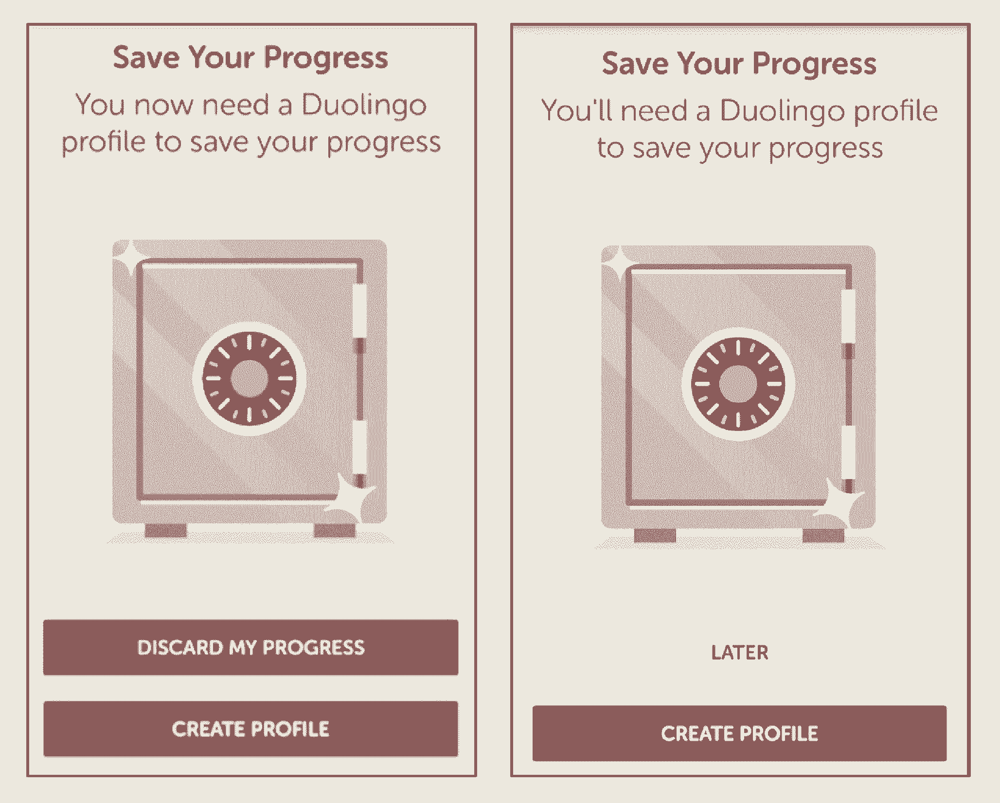

# 来自 Duolingo 的 Master Growth Hacker 的 A/B 测试原则

> 原文：<https://review.firstround.com/the-tenets-of-a-b-testing-from-duolingos-master-growth-hacker>

语言教育平台 **[Duolingo](https://www.duolingo.com/ "null")** 的成长副总裁吉娜·戈蒂尔夫 不愿透露她最喜欢的 A/B 测试之一，但不分享太好了。“你知道你的应用程序图标上的那个小红点，它表示有新的东西，或者还有一些东西没有解决？这导致我们的 dau 增加了 6%。这是六行代码。我认为它花了大约二十分钟。然后我们的 V2 为 dot 带来了额外的 1.6%的 dau 增长，”她说。

这段轶事中包含了很多教训:你无法预测什么会推动事态发展。优化产品总是宏观和微观的结合。但最能说明问题的是戈蒂尔夫对这些数据了如指掌。作为一名成长型营销大师，她知道最重要的一课:你发送给用户的任何东西——哪怕是一个点——都会产生有价值的数据。所以全部测试一下，把每一个数字内化，用这些结果来指导你下一步做什么。

通过勤奋地测试每一个通知、应用程序屏幕和每一行文字——仅 Gotthilf 的团队就一直在进行至少五次 A/B 测试——她监督了 Duolingo 的发展，该公司的用户从 300 万激增到 2 亿。

在这次独家采访中，Gotthilf 分析了对这一增长至关重要的四项 A/B 测试。她分享了她从每次实验中收集到的教训和警示故事，以及从中得出的原则。我们开始吧。

# 继续进行四项 A/B 测试

我们请 Gotthilf 在她的团队和产品经理 Kai Loh 的帮助下，向我们介绍了 Duolingo 进行的四项最具形成性的 A/B 测试。以下是她分享的背景和计算方法——包括即使是最精简的营销团队今天也可以开始实施的策略。

**A/B 测试#1:延迟注册**

**问题:**几年前，Duolingo 开始着手解决一个对一家应用初创公司来说可能是最关乎生死存亡的问题:**是什么导致了他们的漏斗顶端出现漏洞——他们如何阻止它？**

“我们看到访问 Duolingo 或下载应用程序并注册的人数大幅下降。人们报名显然非常重要——这表明他们会再来，其次，也表明我们有机会将一次参观变成一次有益的、持续的体验，”Gotthilf 说。“这意味着我们可以向他们发送通知和电子邮件。所以我们开始思考我们能做些什么来改善这种情况。”

他们认为这种修正可能违反直觉:虽然看起来你应该要求用户立即注册，但当你拥有最多感兴趣的用户和他们的注意力时，也许让人们先试用你的产品是最有力的推销手段。

Gotthilf 说:“我们发现，通过让用户在没有注册的情况下体验 duo lingo*——上一堂课，看看你能掌握的一系列技能——我们可以显著提高注册指标。“只需将注册屏幕向后移几步，dau 就会增加约 20%。第一次尝试延迟注册是在我任职之前，但我们已经看到了积极的影响。”*

由于迭代在 Gotthilf 的成长组织中是至关重要的，他们没有就此罢休。第一次测试产生了重大影响，现在是时候对其进行改进了。他们问自己:他们应该什么时候要求用户注册？在上课的时候？在最后？他们应该怎么做呢？

他们也看了网页本身的设计。“有一次我们想，‘好吧，我们把这个屏幕移动一下。“我们还能做什么，””戈蒂尔夫说屏幕底部有一个红色的大按钮，上面写着“放弃我的进度”——基本意思是“不要注册”。“他们怀疑许多人习惯于不假思索地点击屏幕上最突出的按钮，而 Duolingo 正在失去仍然感兴趣的用户。果不其然，把这个设计换成一个简单的写着“稍后”的按钮，指针移动了。

这一改变引入了“**软墙**”——即要求用户注册的可选页面，但允许他们点击“稍后”继续进行——并打开了一个新的实验舞台。“我们现在有三面这样的软墙，”Gotthilf 说。“最后，有一堵硬墙，在几堂课之后，基本上就是说，如果你想前进，你必须报名。关键在于:如果没有那些被忽视的软墙来启动注册，那些硬墙的表现会明显更差。”

总之，这些对延迟注册的后续改变——优化硬墙和软墙——已经使 dau 增加了 8.2%。“这发生在最初测试后大约三年，所以我们的用户群要大得多。这个数字非常重要。”

Screenshots courtesy of Duolingo

要点:测试早期用户，以确定在使用你的产品之前还是之后注册更好。如果是后者，形成一个假设:用户发现你产品价值的*时刻是什么时候？估计一下你的注册漏斗中的那个点，然后尝试一个软墙。(Gotthilf 建议尽早这样做，因为在每一步，你都有可能失去用户。)然后在几次接触后又是一堵软墙。然后试一个硬墙，分析每个墙的漏洞。相应地向前或向后移动墙。*

把软墙想象成一排排多米诺骨牌。正确订购它们，一推就能产生注册的动力。

**A/B 测试#2:条纹**

**问题:**像许多其他应用一样，Duolingo 希望鼓励用户养成一种有规律的行为——在这种情况下，每天完成一节语言课。事实上，除非用户定期访问，否则产品基本上不会工作。“在我的一生中，我已经学习了四种语言，并且会说五种。我的观点之一是，一个人不可能只在周六或周日学习一门语言。“我们需要让人们每天或每隔一天都这样做，这样语言才能坚持下去。”

但是说起来容易做起来难。“有了这么多的 MOOCs 和教育平台，有很多方法可以在网上学到很棒的东西，”Gotthilf 说。“人们对注册感到非常兴奋，但这些服务的保留率很低。因为让人们回来真的很难。”

这就是为什么 Duolingo 团队在教育领域之外的行业寻找灵感:游戏世界。“为了将 Duolingo 视为一款游戏，我们基本上必须找到让事情变得更有趣的方法，”Gotthilf 说。“我们会从我们真正喜欢的游戏中寻找例子，然后说，‘如果我们把它移植到 Duolingo 中，会是什么样子？’"

对于 Duolingo 来说，记录用户连续使用该产品的天数已经改变了游戏规则。这是 Gotthilf 和她的团队继续关注的一个指标。“这就像在电子游戏中，你必须每天做一些事情，否则你会失去你的排名，”她说。

条纹奖励——游戏化——坚持。

测试:duo lingo streak 的推出标志着用户与应用程序互动方式的一个重大转折点——以及 Gotthilf 和她的团队如何应对。

首先，连胜需要一个既定的目标，因此团队在帐户设置过程中增加了目标设置。Gotthilf 说:“你可以决定自己每天想做多少多语。“如果你没有达到目标，你就不能保持连胜。不仅仅是每天打开 app。”

反过来，目标给了成长团队一个新的思考通知的方式。“现在我们实际上有理由告诉你回来。这不仅仅是“回到 Duolingo”，这是超级垃圾和令人讨厌的。我们可以说，‘你有一个目标。“今天就实现你的目标。”或者“是时候做你的日常功课了。”这种提示是好的。你可以从帮助用户保持她自己的目标的地方来。"

他们考虑了许多因素，从人们何时以及多长时间被 pinged 一次开始。时机可以决定任何通知的成败。当你对此无能为力的时候买一个，这是一个错过的机会——或者更糟，是一个烦恼。“如果你在工作，你收到一个有趣的通知，或者你正要睡觉，你可能会忽略它，”Gotthilf 说。“一天中有特定的时间更适合接收特定类型的通知，这在很大程度上取决于你是哪种应用程序。”

当然，没有放之四海而皆准的时机，Duolingo 也在与世界各地的用户交流。他们进行了一系列测试，最终达到了一直沿用至今的标准:23.5 小时。“我们认为，无论您何时使用我们的应用程序，当天都是您使用该应用程序的好时机。因此，我们认为第二天可能也是你使用该应用程序的好时机。我们想帮助我们的用户养成一种习惯。我们想让它像刷牙一样。”

通知内容的测试时机也成熟了。“我们优化了文案，从搞笑到更有命令性。我们试着使用你将要学习的单词的例子。我们尝试使用我们的猫头鹰吉祥物 Duo，让它变得可爱和个性化。我们在通知中做了一个小测验，你必须回答。”顺便说一句，获胜者是最个性化的版本——“嗨，这是二人组”信息。

花了一些时间来研究各种方法，用每个新的测试来优化副本，但是这些时间是值得的。“像这样的优化因素真的很值得，它影响了你的很大一部分用户，”Gotthilf 说。

确实值得——仅获胜的副本就导致 dau 增加了 5%。

然而，事实证明，条纹可能是一把双刃剑。用户变得如此投入，以至于连败令人沮丧——并导致一些人完全退出。但是在这个意外的结果中，Gotthilf 和她的团队看到了更多的实验空间。Duolingo 开发了一种货币——通过成功完成课程获得——因此他们尝试了新的使用方法。

“我们首先尝试的是周末护身符。戈特希尔夫说:“你只能在周五购买——现在，当你周五上完一节课后，我们会把它放在表面上——以保护你在周六和周日不练习的记录。”。“我们的想法是领先于那些在使用率最低的周末离开的用户，然后永远不再回来。这有助于他们的学习，因为在一种情况下他们会放弃，而在另一种情况下他们不会。”

护身符是成功的——D7 和 D14(分别在 7 天和 14 天后)的保留率分别上升了 2.1%和 4%——但这并不是测试的结束。A/B 测试的分析不应该局限于一个指标的增加，而应该根据竞争目标来衡量。在这种情况下，Duolingo 进行了一项测试，看看保留和货币化是否存在矛盾。

“虽然它增加了 DAUs，但我们认为周末护身符可能会损害货币化，因为我们有一种叫做条纹修复的东西，人们需要付费，”Gotthilf 说。“我们进行了一项实验，发现 dau 增加的价值超过了条纹修复带来的任何收入损失。必须将增加 dau 和留存率与货币化目标结合起来。”

**要点:**大多数应用都有一个他们试图灌输的习惯。可能的话，让你的用户从一开始就设定目标，比如写作、睡眠或与朋友保持联系的频率。换句话说，从一开始就帮助他们定义自己的使用期望。它是否准确并不重要，更重要的是它是否由用户决定。这有助于打开更智能通知的大门。双倍下注，在一天中他们最后一次使用你的时间不到 24 小时。

最后，随着一个概念引出另一个概念(然后是另一个)，你可能会发现自己在进行一系列测试。跟着它走——那些衍生测试经常会戏剧性地放大每一个收益。但是请记住，你不能完全不参与重大决策。“当涉及到牺牲一个指标而帮助另一个指标的决策时，比如周末护身符，或者道德决策或品牌认知决策，你可以进行测试来收集数据，”Gotthilf 说。"但是在一天结束的时候，有时你不得不做出一个人的决定."

**A/B 测试#3:徽章**

**问题:**给 Duolingo 添加徽章已经成为 Gotthilf 最喜欢的项目之一，尽管一开始并不是这样。她多年来一直想测试它，但对它的回报持谨慎态度，因为它需要高额投资。但她的团队提倡这样做，这已经成为一场真正有回报的赌博。他们的直觉？如果用户因为有意义的成就而得到奖励，他们会更频繁地完成更多的课程。

这种预感在很大程度上是正确的。自推出 V1 以来，他们的 dau 增长了 2.4%。“课程开始时间——人们开始上课的频率——增加了 4.1%，课程结束时间——用户完成的课程数量——增加了 4.5%，”她说。“所以这告诉我们，人们不仅开始更多的课程，而且还完成了他们因为想获得徽章而放弃的课程。”

也有意想不到的提升。例如，在 Duolingo 商店购买的商品增加了 13%。增加了 116%的好友。“人们突然会想，‘哦，徽章。我想和我的朋友竞争。所以他们在个人资料中添加朋友，这是他们以前没有做过的事情。现在我们开始考虑社交和推荐，这对我们真的很有价值，”Gotthilf 说。

徽章是一个全面的胜利。所以你可能会惊讶地发现，由于之前的一次失败尝试，这个实验几乎没有发生。“我们第一次尝试用徽章和成就做任何事情是在一年前。我们想测试最小可行的产品，所以我们基本上给用户一个徽章，上面写着“你注册了”。它对任何事都没有影响，所以我们杀了它。"

然而，直到事后分析，团队才经历了这一经历，并意识到注册徽章根本没有抓住成就的精神。以下是主要的经验教训:

报名很少是一个灌输自豪感的成就。

获得一枚徽章并不重要；重要的是有几个徽章。

人们想要的是看到他们收藏的徽章。

这是 A/B 测试的重要经验之一:

有效实现一个想法的最简单方法，未必是实现那个想法的最简单方法。“最低”是“MVP”的第一位，但“可行”是它的核心。

测试:下一次，团队开发了一个更加健壮的体验。“我们花时间设计了几个徽章，并在应用程序中找到了这些徽章的位置。我们考虑了 Duolingo 最有价值的部分，用户可以感受到最积极的方面。”

然而，抛开过去的经验不谈，这仍然是新测试的 V1，团队需要限制自己(他们后来推出了 V2，解决了更复杂的问题，如徽章的层次)。正如重大的、创造性的实验经常发生的情况一样，这意味着要打破僵局。范围随着人们的兴奋而扩大。“桌面上有超过 70 个徽章创意。有些人想建立第二、第三、第四层徽章。“其他人想创建一个系统，让用户可以看到他们朋友的徽章，”Gotthilf 说。我必须是那个说‘这太复杂了’的人。我们需要缩减规模。我们发现的一个保持界限的方法是让一个团队经理或者一个项目经理和设计师坐在一起，做一个设计冲刺。这是最近的发展，也是重要的发展。"

产品经理通常非常接近这些指标。他们知道你想要完成什么，也知道设计师和工程师在哪里花费时间。“当你把那些关键人物召集在一起时，他们可以坐下来打平。对话通常包括:“好吧，这个我们可能不需要。我们可能不需要它。"

这一过程变成了对等谈判，而不是一系列自上而下的法令。“我发现这是完成工作和保持人们动力的最有效方式。最好的结果是，当你能够让房间里的人得出结论，离你所希望的只有一步之遥。更好的是，他们现在支持的是他们的想法——即使它与你的想法相似。”

**要点:**成功的测试需要平衡:一个最小可行的产品，既不是涉水也不是完全投入:不是一个想法的拙劣表现，也不是其最健壮的实现。对于像 Duolingo 徽章这样有希望或渴望第二次尝试的第一个功能，尝试在早期设计冲刺阶段将项目经理或团队经理与设计师配对。这两个功能相互平衡，有助于保持适当的热情和执行力。如果它动摇了，失败了，不要在事后分析中失去焦点或失去热情。到处都是下一个实验的立足点。

**A/B 测试#4:应用内蔻驰**

**问题:**有时候灵感来自外部。该团队的几名成员一直在阅读行为心理学研究，这些研究表明，根据人们提高技能的能力而不是他们的自然智力来鼓励他们更有力量。

“这是一种想法，告诉你的孩子，‘你考得这么好是因为你努力学习’比说‘你考得这么好是因为你是个天才’要好得多，”Gotthilf 说。该团队决定通过创建一个令人鼓舞的应用内教练来实现这一想法——在困难任务上的代理是激励。

测试:Duo，Duolingo 的猫头鹰吉祥物，现在兼任教练。“有时候你在做一门非常难的语言。我刚开始学日语。“我犯了很多错误，”戈蒂尔夫说。当你犯了很多错误时，你会感觉很糟糕。你觉得你失败了。你很容易放弃。所以我们有一个友好的角色出现在边上，说着这样的话，“即使你犯了错误，你也在学习。”"

用户做得好的时候他也在。“我们测试了‘哇，你太棒了’和‘成长思维’的对比。两个副本都击败了对照组，但增长思维副本总体上赢了。所以我们传达了这样的信息:“哇，你的努力真的有回报了。”"

Duo 的鼓励在 Duolingo 团队中有些争议。“有些人不喜欢它，觉得它很烦人，”Gotthilf 说。尽管如此，结果还是不言自明:他们看到 D14 增长了 7.2%。“所以 14 天后，我们有 7.2%的人回到了 Duolingo，因为我们在课程中添加了这种语言和啦啦队猫头鹰。太令人惊讶了。我会保留那些结果。”

**要点:**有时候，你必须把你的个人品味——尤其是你的假设——放在一边。在这种情况下，应用内教练做得出人意料地好，几乎和渴望已久的徽章项目一样活跃。“其他时候，你可能会对一个想法感到非常兴奋，认为它会让世界变得不同。然后你对它进行 A/B 测试，意识到它没有做你认为它会做的任何事情，然后不得不继续前进。”

# 测试的原则

这只是 Gotthilf 和她的团队进行的 70 多种测试中的四种。在她的职业生涯中，Gotthilf 已经形成了一些一贯为她服务的宝贵原则——无论测试需要六行代码还是六周的全力以赴。

**连续耙入和排名。**

如果你觉得有无限的测试可以运行，那你就对了。那也是你最需要限制自己的时刻。“这是 A/B 测试中最难的部分，”Gotthilf 说。“对于我们应该做什么，每个人都有不同的看法，所以优先排序对于节省我们团队的时间和悲伤来说非常重要。”

不过，他们不会在头脑风暴阶段进行编辑。任何关于测试的想法——来自公司的任何地方——都会被添加到 JIRA 的主列表中。“我们有无数的想法。Gotthilf 说:“可能其中 75%都是垃圾。“但每当有人去参加会议，进行鼓舞人心的谈话，或者我们举行头脑风暴会议，我们就会不断增加名单。”

然后，大概一个季度两次(“不够经常！”)，Gotthilf 和她的团队在列表中搜寻新的测试素材。当选择一个时，他们使用一个简单的工具供每个营销人员使用:投资回报率。通过两个关键问题，您可以对您考虑的任何测试的结果做出明智的猜测:

**1。有多少人会受到这种变化的影响？**

换句话说，这种变化在你的漏斗中处于什么位置？例如，在 Duolingo 的例子中，注册页面的改变——大多数用户都能看到——比深埋在语言课中的页面的改变更能打动更多的人。他们还会考虑哪些语言和操作系统会受到影响。

“考虑一下这些领域，你就会知道通过改变你能感动多少人。然后问问你自己，‘好吧，那么如果这个测试成功了，我们能把这根针移动多少？’”戈蒂尔夫说**我们的指导方针是百分之一。如果有什么东西能让我们的数字提高至少 1%，那就是我们考虑推出的时候了。否则，我们没有。**

当然，对于 duo lingo——一家在全球拥有 2 亿用户的成熟公司——来说，1%和早期初创公司的 1%是不一样的。Gotthilf 很少考虑硬性数字，但她提供了一个经验法则:10 万。

“具有统计意义的结果是关键。粗略来说，你至少应该有 10 万个 dau 才能运行 A/B 测试。”

不过，除了达到那个[的统计显著性](http://thumbtack.github.io/abba/demo/abba.html "null")，她还关注百分比。Gotthilf 说:“**对于新的应用程序，你应该把重点放在能让你的指标增加 20-30%的 A/B 测试上**。随着时间的推移，这个数字会改变，你会注意到即使是你最成功的测试结果也会提高 20%，然后 15%，然后 10%。这没关系。随着你的成长，你可以移动你的基线。“重要的一点是*有*一个基线，这样你就不会推出任何东西。”

这不是一门精确的科学。你需要确定什么样的指标最能衡量你的成功(对 Duolingo 来说，就是每日活跃用户)，并了解你自己的使用模式。“当你检查漏斗的每个阶段时，你会开始意识到你在和多少用户打交道——以及你的桶的漏洞在哪里。你还会获得所在行业的某些基准，并发展自己的直觉。”

**2。进行测试要花多少小时？**

接下来，您需要估算您自己团队的时间，以及您需要投入的资源，以使测试顺利进行。你认为你能在一次测试中获得同样的回报，但工程投资却是另一次的一半吗？那么，这可能是你的赢家——接下来解决这个问题。

**提炼重复。**

Gotthilf 说:“任何大的测试都有很多果汁要榨。以 Duolingo 增加的成就徽章为例:增加成就徽章大大提高了 dau 数，因此团队将注意力转向了让成就徽章变得更好。“现在我们可以问:我们还想要什么样的徽章？他们应该如何与 Duolingo 的其他部分进行交互？它为许多新的测试和测量用户行为的方法打开了大门。”

人们总是对大创意最感兴趣，这是用全新的外观或改变游戏规则的功能大幅提升公司业绩的机会。但事实是，只有将那些较小的、有时几乎察觉不到的变化结合起来，才能让指针继续前进。

Gotthilf 说:“你必须控制人们，让他们参与到可能让你获得 1%或 2%收益的无聊的、微小的迭代中来。”“实现你的目标需要跨越式发展，也需要持续的长期增长。关键是要有一个多元化的投资组合，既有大赌注，也有更有把握的小赌注。”

当你磨练你的 A/B 测试策略时，如何保持在正轨上？

有节制地设计。很容易陷入一种测试风气，以至于你想尝试一个想法的每一种可能的实现。“你可以设计 70 种主屏幕，然后运行它们。但是当你这样做的时候，很难得到有统计学意义的结果并且在你的分析中不犯错误，”Gotthilf 说。因此，**坚持每次实验不超过三个手臂:一个控制和两个测试条件**。如果我们意识到我们想要测试其他东西，那么我们就必须等到以后再运行它。”

**坚持自己的立场。**有些测试不应该运行。不是因为他们不会成功，而是因为即使他们成功了，你也不得不放弃你的公司或品牌原则来实现他们。“在 Duolingo，设计是神圣的。我记得尝试过应用程序注册页面的设计。获奖版本的特色是一个微笑的卡通女孩。问题是，这个角色在其他任何地方都不存在，我们的设计团队让营销部门知道它是品牌以外的，”Gotthilf 说，并指出这是在公司实行正式的设计审查流程之前。“最后，我们没有放弃这部漫画，而是继续进行测试，这样我们就可以满足我们的设计准则*和*达到相同的用户数量。我承认，在这些设计上花费更多时间可能会令人沮丧，但在一个具有实验意识的组织中，推动标准是至关重要的。”

我们一次运行 5-8 个实验，但在公司的其他地方，我们同时运行 20、30、80 个测试。每次实验都很容易在不知不觉中出错。肯定有你不会妥协的地方。

# 将这一切结合在一起

A/B 测试的价值众所周知。为了赢得——并捍卫——优势，最好的技术公司不断地测试他们产品的各个方面。说到 A/B 测试，不要拖泥带水。在注册之前，尝试一下软硬墙的顺序。给用户额外的机会来保持习惯——无论是通过游戏化条纹还是根据用户定义的目标提供通知。小心成为 MVP 中“最小”部分的牺牲品，在测试时以“可行的”组件为代价。接受行为心理学来精心制作促进成长心态的信息。这些建议，加上 Gotthilf 辛苦得来的 A/B 测试原则，可以帮助任何增长型领导者测试他们前进和向上的道路。

“我们几乎对所有东西都进行 A/B 测试，并专注于能产生结果的东西。不管怎样，我们都不会。这是一种非常简单的看待事物的方式。Gotthilf 说:“我们没有让意见、自我或背景来做决定，而是让指标来做绝大多数决定。“但有一个很大的例外。即使你是一个 A/B 狂热者，有一件事胜过衡量标准:使命。我们的目标是把免费的语言教育带给全世界。这是我们非常重视的事情，我们每天都在接受测试。有些想法——比如收费墙后面的门控课程——我们只是不去测试，因为它们从根本上违背了我们的信念。但是任何有助于任务的东西，我们都会测试。这是我们实现这一目标的最佳选择。”

*亚历杭德罗·加西亚·依班娜的插图。照片由 Duolingo 提供。*