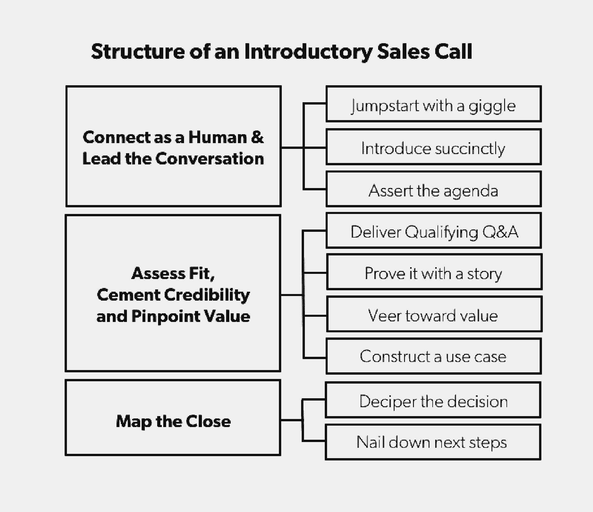

# 启动销售所需的三个框架

> 原文：<https://review.firstround.com/the-three-frameworks-you-need-to-kick-start-sales>

在创业的最初阶段，销售可能是一个谜。关于[建立强大的销售平台](http://firstround.com/review/building-your-best-sales-deck-starts-here/ "null")或[设计销售入职](http://firstround.com/review/youre-losing-hundreds-of-thousands-of-dollars-because-of-poor-sales-onboarding/ "null")的明智建议是存在的，但当只是热情的创始人或销售人员在发布前招揽销售线索时，建议往往是含糊不清的，并沦为“去争取”的态度。这是对吸引早期客户的想法的热情，但这不是未经测试的增长策略的未知领域。

凭借十多年的创业销售经验， **[惠特尼的销售](https://www.linkedin.com/in/whitneysales "null")** 专长倒不如说是她最后的*和*中间的名字。销售方法的创造者，她支持那些需要经验丰富的销售经理的创始人。她目前是 TalentIQ的销售副总裁，但在一系列初创公司担任过销售领导职务。在瓦内洛，销售和她的团队在短短八周内达成了 200 项合作，包括诺德斯特龙、Urban Outfitters 和丝芙兰。在销售额领先的一年内，她帮助 SpringAhead 在 Inc 5000 排名中上升到第 567 位。在 TalentIQ，在不到八个月的时间里，销售部门已经创造了超过 130 万美元的预发布销售额。

如果你的创业公司仍在建立早期销售功能或记录第一笔交易，它必须以不同的方式销售。根据 Sales 的说法，初创公司需要更加重视他们的创始叙事，定制他们的客户故事，并将两者无缝集成到结构化的潜在客户推介中。在这里，她用一步一步、一分钟一分钟的格式来解构每个区域的练习。让我们开始吧。

没有顾客？从你的测试版用户那里拉。还没有？借鉴创业公司的起源故事。种子总会有的。

在通过创始人或客户故事创建用例之前，销售强调了早期创业公司销售的两个关键差异:**目标客户**和**公司验证**。对于前者，她表示，“初创公司的买家将不同于从微软、甲骨文(Oracle)或通用电气(ge)购买成熟企业产品的买家。作为一家初创公司，你通常向目标群体销售产品，包括早期采用者、创始人和有创业倾向的专家，他们可能来自小公司，也可能来自大型成熟机构。你在寻找有着非常特殊心态的人。你在寻找早期采用者，寻找新的、新鲜的方法来解决市场问题的人。这种心态伴随着较低的进入门槛，较高的宽恕门槛，以及随着你的公司找到自己的路，一个积极的反馈循环。这类客户购买产品是因为它具有创新性和与众不同，他们希望在其他人之前第一个发现并测试你的产品。”

当谈到公司验证时，在早期创业公司的销售职能有产品/市场匹配或付费客户之前，它有一个起源故事。“讲述创始人如何想出一个产品创意，以及他们从第一批客户那里得到的反馈。这种叙述是对一个公司和产品存在的确认，是每个公司都有的。放弃这些故事就等于忽略了你当初为什么决定创办一家公司，”Sales 说。“任何公司的成立都不可避免地与创始人首先面对和解决的挑战联系在一起。这部分内容经常被遗忘，但却是与顾客沟通的关键。”

比乔布斯走得更早的黑色高领毛衣。当他意识到字体是一件大事，以及这对第一批苹果用户意味着什么时，就在书法课上召唤他。

# 如何构建基于价值的创始人故事

在追求增长的过程中，早期的创始人常常忽略了他们这么做的最初原因——对于销售来说，这是一个严重的错误。“很多时候，年轻公司甚至不会谈论他们的创立故事；他们认为这不重要。sales 说:“他们将销售电话视为经典戏剧演绎中的推销——[Glengarry Glen Ross](https://en.wikipedia.org/wiki/Glengarry_Glen_Ross_(film) "null")独白——但销售实际上并不是这样，尤其是现在。“这就更复杂了。这是关于能够与人们和他们每天面临的挑战联系起来。如果有一个非常适合你的潜在客户，他们会分享你所面临的挑战——这是你最初迫切需要解决的问题，以至于你决定花费多年时间来缓解它。”

# 基于价值的创始人故事模板

以下练习旨在帮助讲述您的起源故事，向潜在客户传达共同点，并通过共同的棘手问题与潜在客户建立联系。这里有一个例子，以 Sales 现在的公司 TalentIQ 为模型:

我们的创始人肖恩三年前在大学里创办了他的第一家公司。他正在为一个应用程序寻找一名 Android 开发人员，并与一名招聘人员坐下来，概述了理想的候选人应该是什么样的。招聘人员说她会很快带着候选人回复他。肖恩很快了解到“不久”意味着“十天”当招聘人员发送候选人简介时，Sean 已经找到了自己的候选人，这意味着招聘人员失去了数千份业务。

他知道招聘人员是拿佣金的，他想知道为什么要花这么长时间来发送候选人。她向他展示了她的屏幕，屏幕上有 50 个标签，每个标签代表了候选人在线资料和工作经历的不同方面，以及在不同记录系统中的生活。他意识到招聘人员缺少一个获取关键、最新候选人信息的地方。通过进一步调查，他了解到大多数工作流管理工具都存在这种挑战。他们都不跟踪人，他们只是跟踪人的活动。在招聘人员、销售人员和营销人员日常使用的工作流管理工具中，没有一种简单的方法可以让一个人的在线个人和职业足迹保持最新。因此，他开发了 TalentIQ **。**

这个例子可以抽象为这个基本模板:

【主题】【从前】【情况】【客户问题】。[客户]并意识到[问题的特征]。【成本】。【科目】学过【构思过程】。结果，【解】。

使用以下要点，通过模板创建您的基于价值的创始人故事:

**主语。谁是故事的主角？你、你的创始人、朋友、同事还是前雇主？**举例:**我们的创始人/肖恩/何**

**从前。**什么时候的事。这个时候发生了什么？**举例**:三年前在大学开了自己的第一家公司。

**情况。**设置舞台。描述一下场景。**例子**:他正在为一款应用寻找一名 Android 开发人员，他与一名招聘人员坐下来，概述了一名理想的候选人应该是什么样的。招聘人员说她会很快带着候选人回复他。

**客户**。描述你的目标市场或符合你当前前景的特征。**示例**:招聘人员/她

**问题**。描述问题。**例子**:肖恩很快了解到“不久”意味着“十天”

**问题的特征。招聘人员是拿佣金的，他想知道为什么要花这么长时间。她向他展示了她的屏幕，屏幕上有 50 个标签，每个标签代表候选人在线资料和工作经历的不同方面——每个标签都存在于不同的记录系统中。他意识到招聘人员缺少一个获取关键、最新候选人信息的地方。**

**成本。这个问题如何转化为时间或金钱。当招聘人员把候选人简介发给肖恩的时候，他已经找到了自己的候选人，这意味着招聘人员失去了数千份业务。**

**构思过程。**确定理解需求的过程，并假设解决需求的方法。**例子**:通过进一步调查，他了解到大多数工作流管理工具都存在这种挑战。他们都不跟踪人，他们只是跟踪人的活动。在招聘人员、销售人员和营销人员日常使用的工作流管理工具中，没有一种简单的方法可以让一个人的在线个人和职业足迹保持最新。

**解。**保持简短。这是关于你，而不是你做了什么。哒哒时刻！**例子**:结果他开了 TalentIQ **。**

Whitney Sales

# 如何构建基于价值的客户故事

创始故事只是帮助你的潜在客户理解你的产品所解决的问题的第一步。然而，创始人的挑战并不总是每个人的——你的潜在客户可能能够更多地联系到另一个像她一样的客户的用例。“对于每一个你在早期与之交谈的客户，你都应该有一个吸引人的另一家公司的故事，像她一样，你解决了他们的问题，”Sales 说。“如果你只有一个客户，提取他们用例中与你的潜在客户最相关的元素。如果你还没有付费客户，那就使用测试版客户。如果客户不付款，这并不意味着你没有为他们提供价值；这只是一个理解价值是什么的问题。对于潜在客户来说，测试版客户的故事和付费客户的故事一样有价值。”

随着您将潜在客户转化为付费客户，您的用例数量和客户案例自然会增加。“在获得第一个用例后，下一个里程碑是有三到四个用例可供选择。对于您所追求的每个目标市场，您都希望有每个使用案例和客户案例可供参考。了解每个客户的独特属性，你的产品解决的问题，以及你的产品如何详细解决那个问题。寻找展现一系列客户属性的用例，例如规模、地区、行业或技术堆栈。Sales 说:“在你的故事中描绘出能引起潜在客户共鸣的独特标识符。

随着您的客户和潜在客户群的增长，按照前面提到的客户属性对您的客户案例进行细分。“在大约 20-40 次的销售对话中，你会对你的目标市场有更好的了解——以及精选的客户案例，这些案例阐述了每个市场问题的解决方案，”sales 说。“作为一家小公司，如果你每个季度都在构建一个客户用例，那你就做得很好。如果你每个月增加一个可靠的故事，你会做得非常好。每一个故事都代表了一个经过验证的市场用例，以及潜在的一组新目标客户。”

# 基于价值的客户案例模板

以下练习旨在通过使用客户示例，帮助您为潜在客户构建价值主张。“目标是与潜在客户的痛点相关联，以及您的产品或服务如何成功帮助了类似的公司。“基于价值的客户案例用于消除异议，为您的公司及其产品建立信誉，”Sales 说。“随着你的客户故事集的增长，我建议为你的每个客户群和产品或服务构建丰富的基于价值的客户故事。”

这里有一个例子:

我的一个客户，XYZ 可扩展性公司，也有同样的问题。当 I
会见其营销副总裁时，他们提到入职期间的取消率在过去三个月中增加了 12%。保留率下降，公司的声誉受损。他们认为这是入职期间的客户沟通问题。入职电子邮件没有针对用户在入职过程中的位置，导致点击率低、退订率高和最终取消。

我们实施了自动化行为电子邮件营销，并使 XYZ 可扩展性公司能够根据产品中的行为向客户发送电子邮件。这使得 XYZ 能够根据客户的具体入职路径向他们发送个性化的电子邮件。在我们实施自动化行为电子邮件营销两个月后，我们将转化时间减少了 30%，总体转化率提高了 63%，这为 XYZ 带来了 420 万英镑的收入。

这个例子可以抽象为这个基本模板:

我的一个客户[客户名称]，也符合同样的[资格标准]，也遇到了同样的问题。当我与他们的[标题]会面时，他们提到了[客户棘手问题的示例]。[附加细节]。

我们实施了[产品功能]，并使[客户名称]能够实现[该功能能实现什么]。[客户名称]看到了[可量化的结果]。

使用以下要点，通过模板创建基于价值的客户案例:

**客户名称**。谁是你最成功的客户之一？这可以是一个测试版用户，如果你没有客户。**例子** : XYZ 可扩展性公司。

**资格标准**。有哪些独特的特征可以帮助您识别与该客户相似的其他客户？要有描述性，这样很容易识别配对。按行业、员工、阶段、技术堆栈、部门、公司规模、里程碑或团队规模划分。**举例** : SaaS，50-200 员工，B 系列，垂直响应，SFDC，十个销售人员，CMO 到位，六人营销团队。

**标题**。你卖给了组织中的谁？谁面临的挑战最大？公司内的每个角色都会遇到不同的障碍。在整理您的价值主张时，您会希望看到这些内容。**例如**:营销副总裁，负责品牌推广和销售线索转化率。

**客户痛点示例**。在您的解决方案之前，客户的痛点是什么？这些棘手问题对他们的业务意味着什么？例:在过去的三个月里，入职期间的取消率增加了 12%。保留率下降，公司的声誉受损。

**附加细节**。使用丰富的描述性语言来描述客户示例。突出与潜在客户的棘手问题相关的细节。**示例**:入职电子邮件没有针对用户在入职流程中的位置，导致点击率低、退订率高以及最终被取消。

**产品特性。**设计了哪些产品特性来应对这一挑战？**示例**:自动化行为电子邮件营销。

**该功能能带来什么(好处)**。该功能具体如何解决客户的挑战？**示例**:根据产品中的行为向客户发送电子邮件。根据客户的具体入职路径向他们发送个性化电子邮件。

可量化的结果。您有哪些统计验证来确认您的解决方案解决了客户描述的棘手问题？**示例**:在我们实施自动化行为电子邮件营销两个月后，我们减少了 30%的转化时间，整体转化率提高了 63%，这为 XYZ 带来了 420 万英镑的收入。

# 将创始和客户故事融入销售

早期创业故事——那些属于创始人和第一批客户的故事——只是构成介绍性销售对话的更大机器的一部分。大多数销售流程都强调提出正确的问题，这是获得转化潜在客户所需信息的关键。

然而，当你的问题产生问题和答案时，潜在客户就取得了进展。换句话说，来自潜在客户的最有价值的输入可能是他们的问题。“问题不仅意味着客户参与其中，还意味着传递以流程或价值为导向的反馈。他们正在研究如何与你一起对你的产品做出决定。如果他们在问问题，那就是有东西着陆了。这是一个好迹象，”Sales 说。“如果他们询问另一位客户，你的例子可能不够贴切，这是一个信号，表明要改变策略，更深入地挖掘他们的痛点。许多人忽略了反对是件好事这一事实。这是客户告诉你他们在购买你的产品时将面临的挑战。如果您发现有些事情仍然没有着落，请提出另一个问题，并找到另一个用例来引导对话。不要勉强。”

以下是该流程的概述:

创始人和早期客户故事的元素是贯穿整个销售宣传的垂直主题，但集中在谈话的前半部分，以尽早建立可信度并打开潜在客户。以下是如何融入这些故事并构建一个有效的销售拜访:

# 像人一样交流并引导对话(5-10 分钟)

**咯咯地笑着开始** **(1-3 分钟)**

**目标**:产生共鸣——或者更好——大笑。

如何做:试着引用一些你对公司、市场或行业的了解。谈一谈相互间的联系。分享一些最近发生的事情或者你的感受，比如喝了太多咖啡。自嘲或者正面的体验都是比较靠谱的选择。把自己变成人类。

提示:“如果可能的话，我喜欢从笑声开始。笑声建立——或恢复——一种积极的情绪氛围和两个人之间的联系感。“这实际上迫使两个人在彼此的陪伴下享受快乐，”Sales 说。

**简洁地介绍(2 分钟)**

**目标**:给出上下文并控制对话。

**如何**:提及你是如何被联系上的。给出你的名字，头衔和一些关于你自己的信息。求姓名，职称，职责。如果你的同事参与，介绍团队成员。确认可以为对话分配多少时间，并感谢他们抽出时间。

**提示**:“记下通话中谁提出了问题，以及他们提出了什么问题。“如果对话中有多人，记下他们之间的互动，”Sales 说。“尝试确定组织的管理风格。这将告诉你一个公司或团队将如何对一个产品做出决定，以及你在一个组织中实际上需要向谁销售。决策是自上而下、通过共识、由执行委员会还是以其他方式做出的。”

**断言议程** **(2 分钟)**

**目标**:了解他们的 ______，并讨论你如何帮助他们。如果有合适的话，就列出接下来的步骤。

**如何**:为何时应该提问设定一个结构。他们应该在谈话过程中随机应变，还是在最后留有提问的时间？是讨论还是推销？始终暂停，询问与电话结构相关的问题。询问他们此次通话的目标，以及他们希望确保涵盖哪些内容。

**提示**:在一个例子中，这些信息是如何汇集在一起的:“我今天开会的目的是很好地了解你目前是如何做 _____。然后讨论我们如何帮助您解决 _____ 问题，如果合适，我们可以讨论下一步。听起来像个计划吗？太好了。你今天想要报道什么吗？我想请求我们把这变成一次讨论而不是一次推销。我喜欢听自己说话，但你的问题对我来说更重要。如果您有任何想要深入研究的领域，请随时打断。”

# 评估适合度、巩固可信度并确定价值(20-30 分钟)

**提供资格确认问题和答案(5-15 分钟)**

**目标**:确定一个潜在客户是否是你的好客户。

**如何**:提出基于价值的问题(VBQ)，给出基于价值的回答(VBR)。您的 VBQs 应该收集您需要了解的关于客户的信息，以了解他们是否是您的好客户。换句话说，你需要知道什么来确定一个能引起潜在客户共鸣的客户案例研究？你想在这里保持两到三个问题，所以让他们有价值。设计你的 VBR 来分享你的行业知识，教育潜在客户并建立信誉。

**提示**:“在你的 VBR 中随意提及一个竞争对手是激起好奇心和吸引客户的好方法。Sales 说:“统计数据也是引导潜在客户思考和解决问题的有效方法。

**用故事证明(2-3 分钟)**

**目标**:通过他人的经历建立信誉。

**如何**:举出一个相关的客户故事(如上所述)，为潜在客户建立投资回报。如果你有一个以上的故事，从你的分类故事库中提取，这些故事按照行业、客户名称、问题、技术堆栈等进行分类，以便最大限度地增加关联性。将故事与您在合格 VBQs 中发现的棘手问题联系起来。**如果你还没有付费或测试客户，使用你的创始故事或客户发现对话。**

**提示**:“通过使用客户的例子来处理潜在客户的异议或担忧。下面是一个模板化的回答:“这实际上是我们经常听到的事情。______ 也有同样的担忧。_______ 是我们为他们解决问题的方式。"

**转向数值(5-15 分钟)**

**目标**:深入挖掘客户的痛点。

**如何做**:最多问三个 vbq 来回答以下问题:你需要了解客户的哪些方面才能知道你为客户提供的投资回报？要为客户组织一个清晰的使用案例，您需要知道什么？在您的 VBR 中，对客户的痛苦感同身受。将这些问题与相关的客户示例和统计数据放在一起。

**提示**:“VBRs 不是音高。销售人员说:“他们应该关注客户的痛点，让客户了解市场趋势，并理解你的产品为客户解决的问题。

**构建一个用例(2-5 分钟)**

**目标**:确认你能帮助他们，并表达如何帮助。

**如何做**:如果可以的话，将你从 VBQs 中了解到的适用于潜在客户的产品的关键优势，放回投资回报计算中。使用客户对其问题的描述，找出她用来描述其棘手问题的关键词。阐明你的产品对他们的业务意味着什么。暂停提问。

**提示**:“简洁明了。如果你在做演示，展示适合他们需求的产品的*具体*方面。你不需要展示整个产品，除非他们需要看到它的整体。这不是展示和讲述，”销售人员说。“如果你的产品价格较高，在所有利益相关者都到场之前，不要进行演示。避免使用你的产品或套牌作为销售对话的支撑。如果你不知道产品会给客户带来什么好处，那就默认提问。”

# 绘制成交图(10 分钟以上)

**解读他们是否以及如何决定(5 分钟以上)**

目标:评估他们是否能行动。提出异议和担忧。了解他们的决策过程。

**How** :记住这个缩写“BANT”，它代表 **B** udget，**A**authority， **N** eeds 和 **T** imeline。它比所有的销售缩略语都耐用，因为它很管用。对于**预算**，提问:“作为一个团队，你通常如何评估这样的工具？您的潜在客户是否有相应的资源和预算？”对于**权威**，你知道谁在打电话以及他们的角色，但是仍然要问:“还有其他人需要看产品或者需要参与决策过程吗？”了解他们的角色以及他们关注的原因。对于**需求**，您应该已经在会议的这一点上确定了。对于**时间线**，询问:“您以前购买过这样的工具吗？过程是怎样的？”记得询问任何可能延长或影响销售流程的法律或采购流程。

**提示**:销售人员说:“当你觉得自己完全理解通话后他们那边发生了什么——如果他们在通话中没有购买——重复你所学到的东西，并确认它是正确的。

**钉下下一步** **(5+分钟)**

**目标**:如果你在对话中没有完成交易，向他们和你阐明接下来的步骤。

**如何**:明确说出你的待办事项，确认他们的作业。你应该知道当你结束谈话时会发生什么。

提示:“如果可能的话，在结束谈话之前，安排下一次会议，并预览一下会议议程。这就在下一次会议之前建立了一个隐含的截止日期，”Sales 说。

如果问对了问题，你的客户会告诉你所有你需要知道的事情，以便向他们推销。

刚开始做销售的创始人，应该把自己的故事看做第一个客户故事。他们不仅发现了一个有意义的问题，而且亲自采取行动去解决它。有了这个共同的问题，就形成了通向潜在客户的桥梁，创始人可以跨过这座桥梁提供解决方案。早期阶段的创始人和销售人员必须毫不掩饰地接触创始人的故事，直到他们从早期客户那里收集用例。具有绿色销售职能的创业公司应该通过销售练习来创建两个故事的版本。创建后，团队可以将这些叙述整合到她概述的结构化销售拜访中。

“创业者被未来所吸引，提前 20 步思考。所以他们很容易让过去的故事淡去。但是他们可以也应该使用它们。作为一名创始人，每个企业家都有自己的创业故事，并且都利用了这个故事。创始人用这些故事做的第一笔生意是卖给他们自己。然后，他们用它们来雇佣团队、筹集资金和吸引测试客户，”Sales 说。”这是一位创始人必须向其组织中的第一批销售人员传达的同样的故事。这些模板应该有助于明确起源故事，并将早期冠军转化为客户。当这些练习使销售人员能够引导创始人和客户的叙述时，规模就产生了。与其他资源不同，这些故事在传播时不会被稀释。它们是初创公司最通用、最持久的资产。”