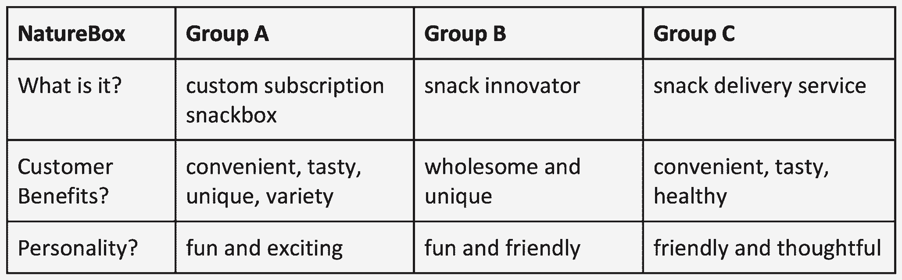
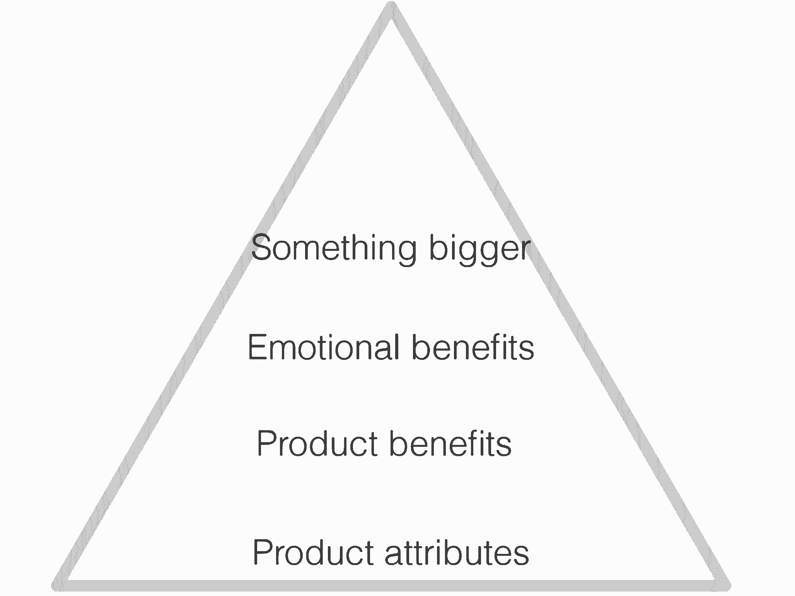
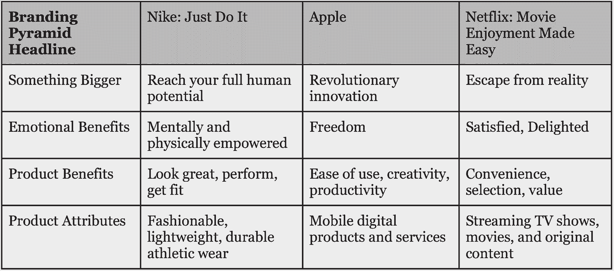
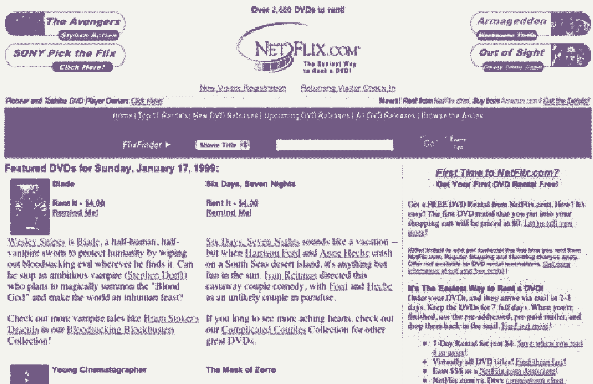
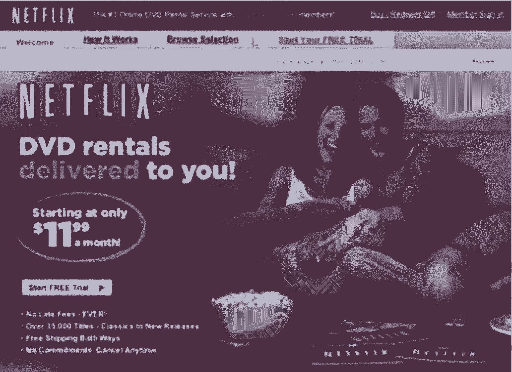
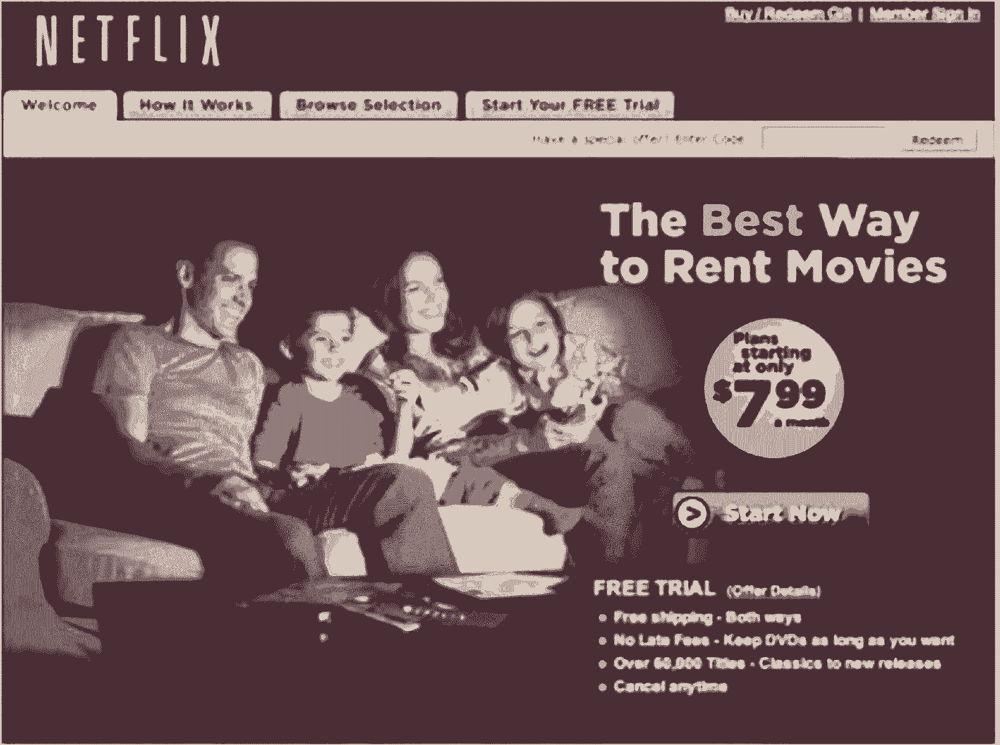
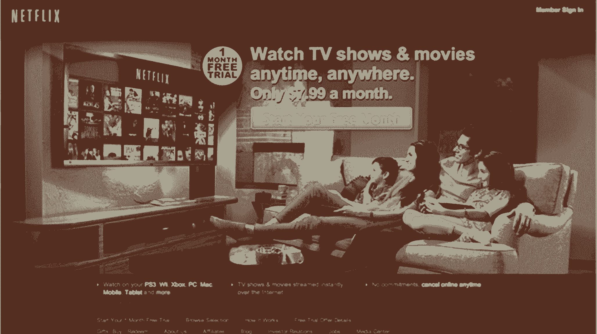

# 网飞打造世界级品牌的三大工具

> 原文：<https://review.firstround.com/the-three-tools-netflix-used-to-build-its-world-class-brand>

很难想象一间起居室——或董事会会议室——需要介绍网飞。今天，它在 40 多个国家拥有超过 6500 万用户。甚至它的文化文件也像病毒一样传播开来，成为创业佳能的一部分。它每天刺激数百个有线电视取消。

然而，当前产品管理副总裁 **[吉普森比德尔](https://www.linkedin.com/in/gibsonbiddle "null")** 在 2005 年加入时，产品专家仍然有焦点小组问他:“等等，我不明白。你是说*精简*？”不，*流*，他会说。没人知道那是什么意思。在早期，建立公司的品牌不仅意味着找到推广和定位网飞“品牌承诺”的方法，还意味着引入——并拥有——对这个令人难以置信的新业务至关重要的语言。除了网飞，Biddle 还为地标教育和游戏公司领导品牌创建和产品开发并提供建议，包括 **[Chegg](http://www.chegg.com/ "null")** 、Sega 和 Mattel。

Biddle 作为产品领导者的记录来自于他用难以复制的、提高利润的方式取悦顾客的能力。网络效应、规模经济和独特的技术被普遍认为是创造难以复制的竞争优势的方式，但很少有人了解定义和建立品牌所需的规则。

就像一个公司的使命或愿景一样，一个定义明确的品牌描述了一个“真正的北方”,为公司的产品开发提供信息。在世界级的公司，你经常会看到营销团队和产品团队之间非凡的团队合作，营销团队定义品牌，而产品团队则帮助赋予品牌生命。在这里，Biddle 提供了三个简单而强大的工具来定义一个经久不衰的品牌。

# 定位模型

“很多人被品牌吓住了。他们认为，‘我不是艺术家，我不是作家。“我想不出什么，”比德尔说。关于品牌创建，有太多模糊的指导方针和抽象的词语:“品牌应该来自内心。”“它们是真实的、可持续的。”"最好的东西是由人类精神的力量建造的，而不是广告宣传."如果你在考虑具体的可交付成果，这些都没有帮助。

对于比德尔， *[精益品牌](http://www.leanbranding.com/ "null")* 作者[劳拉·布施](http://laurabusche.com/ "null")最接近一个可行的定义:

一个品牌是消费者想起你时回忆起的独特故事。

“这个故事将你的产品与(你客户的)个人故事、特定的个性、你承诺要解决的问题以及你相对于竞争对手的地位联系起来，”布施写道人类所有的渴望都是品牌建立关系的机会。"

与 Busche 的想法一致，**定位模型**将帮助你定位你的品牌在消费者心目中应该占据的位置。**首先，回答这三个关于贵公司的问题**:

**什么事？描述性的。**

**对客户有什么好处？**它是如何改善客户生活的？

**它的个性是什么？如果你的产品、公司或服务是人，你们在鸡尾酒会上相遇，你会如何描述他/她？**

当然，在回答这些问题时，要考虑杠杆和陷阱。为了解决这些问题，Biddle 提供了一些建议和示例来指导您的过程。在这里，他使用他建议的零食订阅服务 [Naturebox](https://naturebox.com/ "null") 来说明在网飞和他的整个职业生涯中对他有用的概念。

**避免单独或单独进行定位练习。**

Biddle 与初创公司合作的方式是同时利用许多人的智慧。例如，在与 Naturebox 员工的研讨会上，他将团队分成六个小组，将他的定位模型应用到业务中。所有参与者在一个小时结束时重新聚集在一起分享他们的想法。本练习的目标是捕捉并阐明他人对公司的评价，因此获得多种观点至关重要。跟踪跨团队的共享语言也很有帮助。以下是 Naturebox 三个小组的初步回答:

Selected answers from a Naturebox branding workshop with Gibson Biddle

那么，如何从这样的东西开始，并得出清晰、一致的定位语言呢？

向六年级学生描述一下。

“力求简洁明了。假设你在和一个六年级学生说话。你的客户很忙，所以他们没有时间解析模糊的概念。你的目标不是让它变笨，而是让它变紧。”Biddle 挑战 A 组打开“定制订阅 snackbox”一个人主动提出:“外卖快餐。”对比德尔来说，这太“廉价”了。" Snackbox 订阅服务。"那行得通。一个对你的业务一无所知的人会马上明白什么？就这样吧。

**把你的描述节食。**

Biddle 在定位模型中对语言的经济性要求很严格。“把事情精简到最多三个字。选择最关键的话。”在 Naturebox，Biddle 要求 A 组从描述他们服务的四个单词中选择三个，这样团队就不会只是列出单词，而是仔细地对它们进行优先排序。该团队选定了“方便”、“健康”和“多样化”。

**不精确就不要停止。**

“这串单词中通常有一个模糊的单词。比德尔说:“找到那个抽象的词，并深入挖掘它。他促使 A 组展开“多样性”，直到团队达成“选择”，然后是“选择”“选择”更适合 Naturebox，因为该公司的目标不仅是提供一系列产品，还包括健康零食的精心策划。

比德尔警告说:“不要自动传递跨团队流行的词语。"每个人都有嫌疑。"A 组和 B 组都选择了“独特”“在什么方面独一无二？”他坚持。“味道很棒——很好吃，”该团队回应道，提供了一个更精确的答案。

像介绍一个人一样介绍你的公司。

为你的公司创造个性是激发人们情感的一种方式——这是建立一个令人难忘的品牌的关键概念之一。"问问你自己:如果你在一次聚会上遇到你的公司，你会如何描述它？"比德尔说。来自 Naturebox 的两个团队将该公司的个性定位为“受大众欢迎”和“值得信赖”。“一个大众租赁者会做什么——他或她在聚会上会怎么做？公司在哪些方面是相关的？”推比德尔。团队将 Naturebox 的个性重新定义为“友好、有风度”和“脚踏实地”。

决定拥有一个单词。

成功定位品牌的公司在消费者心中拥有一个特定的词。"你会用哪个词来形容各大汽车品牌？"比德尔问道。“本田是‘可靠’，奔驰是‘豪华’，沃尔沃是‘安全’，宝马是‘性能’，特斯拉是‘创新’。”我们都本能地将这些公司与这些词联系起来，但公司可能需要几十年才能“拥有”一个词——这就是为什么我对特斯拉作为一个年轻的品牌印象如此深刻，这种想法是他们在相对年轻的年龄就拥有汽车行业的创新。"

十年后，你想拥有什么词？

**从客户而不是公司的角度来表达好处。**

当你表达公司的利益时，一定要设身处地为客户着想。例如，Biddle 记得在线教科书租赁公司 Chegg 达到了一个与客户利益相关的里程碑:省钱。该公司引以为豪的是，Chegg 的所有客户当年累计节省了 5 亿美元。但在其主页上的 A/B 测试中，这一信息没有得到很好的转换。

A/B 测试表明，通过租赁而不是购买来“节省数百美元”的说法效果最好，但在回到 Chegg 的定位框架后，这将是一个安全的赌注。5 亿美元的节省更多的是关于 Chegg 的，但“节省数百美元”更多的是关于使用这项服务的学生。

# 品牌金字塔

在完成定位模型后，你已经创造了有助于为客户定义你的品牌的语言。比德尔说:“公司的属性、利益和个性是基本的基石。”。“对于消费者来说，他们会分别回答你是谁、你将如何改善我的生活以及与你共事是什么感觉。”但是，要让你的品牌在消费者心中根深蒂固，还需要几个步骤。这就是第二个模型——品牌金字塔:

The Branding Pyramid

好品牌和伟大品牌的区别在于，它们定义了情感上的好处，以及它们传递的“更大的东西”。Biddle 说:“情感上的好处与我作为你的顾客通过使用你获得自信控制我的生活的方式有关。“更大的东西”说明了你的目标是向客户提供什么，也说明了十年后的世界。就像一家公司的使命或愿景一样，这种品牌承诺或“更大的东西”应该是鼓舞人心的，有助于为你正在打造的品牌和产品定义“正北”。

通过将这些元素添加到定位模型中，您已经创建了一个**品牌金字塔**。这意味着从下到上的方法，每个部分都是上一部分的基础。以下是三个世界级品牌的金字塔示例:

“金字塔模型是一种从定义产品的属性‘升级’到产品提供的优势的方式。然后你就可以步入让一个品牌令人难忘的情感境界。比德尔说:“更大的东西可以让你的品牌屹立数十年。“在网飞，多年来产品发生了哪些变化——从邮寄 DVD 到流媒体再到原创内容。但是好处——方便、选择和价值——保持不变。而‘更大的东西’——一部夏季大片带给我们每个孩子的对现实的逃避——仍在继续。”

产品需要实现的品牌承诺可以用四个字来形容:“轻松享受电影。”

“它为我们的许多产品开发决策提供了信息，并为产品创新定义了一个‘真正的北方’，”他说。 **Biddle 提供了两条建议来充分利用品牌金字塔练习**:

**情感是人们将如何记住你。**

在思考情感对品牌的作用时，比德尔喜欢引用玛娅·安杰洛的话:“我明白了，人们会忘记你说过的话，会忘记你做过的事，但人们永远不会忘记你带给他们的感受。”

一种情绪既可以是积极的，也可以是消极的，但它总是个人的，所以明智地选择是至关重要的，因为它会持续下去。想想你最尴尬的时刻。不管那是多久以前的事，你仍然记得，它仍然有力量让你感觉到什么，对吗？

在一个公司的背景下，情感是产品如何造福消费者和公司如何造福世界之间的桥梁。这是一个很大的话题，但正确的情感是强大的，令人难忘的，足以将他们联系在一起。比德尔说:“情感可以将一项冰冷的技术转化为人们生活中与之密切相关的东西。”

比德尔说:“Chegg 从教科书租赁开始，发展到数字服务，帮助学生节省时间、金钱和变得更聪明。”“但是情感上的好处是关于教育能为你的生活做的所有事情。我们的产品变了，但与自我提升的情感联系没有变。”

在你的“更大的东西”上下大注

发挥你全部的潜能。革命性创新。逃避现实。“你公司的‘更大的东西’应该是一个大胆而崇高的想法，”比德尔说。“‘更大的东西’背后的想法是，它应该抓住你未来十年甚至更久的梦想。我不想夸大其词，但这是真的:这是你渴望体现并计划为人类做出贡献的东西。”

“更大的事情”的核心是一个问题:你将为你的客户做什么——更重要的是，为整个世界做什么？对苹果来说，这是交付“革命性的创新”在它的经营中，例子比比皆是:改变市场的消费电子产品、[其零售店的独特设计](http://firstround.com/review/How-to-Do-Retail-Right-from-the-Inventor-of-the-Apple-Store/ "null")以及以纳尔逊·曼德拉、阿尔伯特·爱因斯坦和达赖喇嘛等标志性变革者为特色的 Think Different 运动。

品牌因创造情感联系而令人难忘，但当它们传递“更大的东西”时，它们才是强大的权力不仅意味着持久的遗产，还意味着表达更多的价值。“对耐克来说，这个品牌不仅仅是精神上和身体上被赋予力量的情感上的好处。更重要的是，它帮助人们发挥他们的“全部潜能”我会多花 10 美元买一双球鞋成为最好的自己吗？你打赌我会的。这就是一个品牌的价值。"

虽然没有千篇一律的模式来确定你的公司的“更大的东西”，但实现它的最好方法之一是彻底看看你是如何实现你的使命和愿景的。这些陈述激起了什么样的情绪反应？抓住这些感觉，并尝试用吸引客户的语言来提升它们，兑现你对客户的长期承诺。

# 概念总结

一旦你确定了你在第一个模型中的定位，以及你的品牌如何提升到情感领域，是时候向潜在客户表达你的想法了。Biddle 是品牌黑客的强烈支持者——快速建立、测试和学习。他指出，“文字是廉价的。”很容易对几个关键想法进行多种变化，形成一系列的概念总结，看看语言和某种程度上的想法是否能引起客户的共鸣。

一份好的概念总结包括你的定位模型、品牌金字塔和关于你的公司成长后想要成为什么的内部讨论的所有想法——并将其缩减为一段话。它必须回答这样一个问题:人们了解我是谁、我的好处、我的个性以及我将代表的更大的东西吗？

我们的目标是将您的定位和品牌模型转化为通俗易懂的六年级语言，以便与客户展开对话。“在网飞，我们提出并测试了几十个概念总结，但我不会与你分享所有这些，”比德尔说。“我会通过分享那些明显能引起客户共鸣、并在过去 5-10 年里代表了品牌和产品的想法，让它看起来简单一些。”

**以下是网飞**的概念总结示例:

*有时候很难找到一部每个人都能在周五晚上欣赏的电影。对于接入互联网的个人和家庭，网飞可以随时随地即时播放无限数量的电视节目和电影。只需在易于使用的网站、移动应用程序、游戏平台上的应用程序和数百台联网设备上搜索、浏览和观看。只需一键点击，任何人都可以观看无广告、高清质量的电视节目和电影。它是按月支付的，你可以随时取消。我们提供一个月的免费试用。网飞，轻松享受电影。*

这个概念总结中的关键思想“轻松享受电影”是产品团队致力于实现的核心品牌承诺。概念总结应该是一个动态的文档，随着公司的发展，它会被重新审视和利用。以下是概念总结对你的品牌和业务如此重要的原因:

**当你做出产品决策时，这是一个可靠的直觉检验。**

“当我第一次加入网飞时，它没有口号，”比德尔说。“但我的营销合作伙伴反复强调的一个简单想法是，我们即将让电影享受变得更容易。除了在我的营销合作伙伴与我分享的概念总结和其他内部品牌材料中，你不太可能在任何地方看到这一点。但这正是我们试图打造的与我们品牌相匹配的产品的精髓。我发现，作为一名产品负责人，在做决策时回到 it 部门非常有帮助。”

比德尔在网飞工作期间，公司内部就如何提高员工保留率展开了一场辩论。第一个选择的前提是，娱乐性更强的电影体验是解决方案。

比德尔说:“想象你来到 Netflix.com，这个网站真的在和你说话。”。“这让人想起了一个叫做[你不认识杰克](https://en.wikipedia.org/wiki/You_Don%27t_Know_Jack_(video_game_series) "null")的游戏，一个很受欢迎的琐事视频游戏。通过原创游戏创作者编写的巧妙文字，该功能将吸引观众回答问题，以提升他们的电影品味——这对用户和我们的推荐算法都有好处。该方法的灵感来自于产品团队对我们将成为商品的持续恐惧。我们想创造一种非常独特的电影体验。”

现实是你正在成长为一家公司。你变得更聪明，更好，更快。你在学习。在网飞，我的同事们每两周一次，永远不停地测试非会员主页——这个页面的工作是将潜在顾客转化为顾客。

第二个选项更像是自动售货机，在屏幕上以平铺的方式显示电影——很大程度上就是你今天在网站上看到的。虽然产品团队发现这种方法不太有趣，技术上也不太具有挑战性，但它在数量上测试得更好。

“我们尝试了两种选择，这很好，但我们的概念总结可能提供了早期预测。我们需要记住:享受电影变得容易。比德尔说:“第二种选择是让人们进入电影体验的最快、最简单的方式。“网飞通过真正推动便利性、选择性和价值而脱颖而出——我们从 DVD 递送服务发展到在数百台设备上即时播放电视节目和电影，每月仅需 8 美元。

**你的概念总结有助于你更有效地宣传你的品牌。**

对于建立自己品牌的年轻公司来说，在开始时表达很多关于公司的好处或技术是很常见的。例如，网飞用“即时观看”代替“流媒体”，直到消费者熟悉这个术语。

随着人们对你的品牌和技术越来越熟悉，你需要做的很多宣传你的产品和它所带来的好处的工作就消失了。在网飞早期，非会员主页很复杂。但随着时间的推移，随着品牌的成长，并成功体现了“轻松享受电影”的理念，与客户沟通的工作变得越来越容易，因此非会员主页也变得越来越简单。

当我们意识到曾经在主页上的信息现在在我们客户的头脑中时，这是一个里程碑。

在网飞期间，Biddle 看到随着产品的发展，竞争格局的变化，以及世界从邮寄 DVD 转向现在广为人知的流媒体概念，非会员主页迅速更新。“我的同事们一直在对非会员主页进行 A/B 测试，最终，越简单的解决方案开始测试得越好，”Biddle 说。“在我们网站的其他领域，简单的设计几乎总能胜出，但在非会员主页上，我们需要传达价值，密集的设计仍然胜出。然而，在过去的几年里，你可以看到非会员页面变得越来越简单。网飞品牌本身包含了更多的意义，因此非会员页面不必如此努力。”

**以下是网飞主页在过去 15 年中的演变**:

Netflix.com in 1999

Netflix.com in 2004

Netflix.com in 2006

Netflix.com in 2012

Netflix.com in 2015

Netflix.com in 2015: Will promoting original content improve conversion?

一份好的概念总结记录了你的品牌的永恒和暂时的部分。

大约十年前，网飞提供了 10 万张精选 DVD。八年前，它推出了流媒体服务。近年来，它推出了第一部原创电视连续剧。在每一次转型中，网飞总是让电影享受变得简单。这一品牌承诺抓住了品牌永恒和不断变化的元素。

“产品属性是一个会随着时间变化的元素。好处基本上是一样的。如果你在早期真的做得很好，客户的情感收益将是持续的。比德尔说:“即使是你追求的‘更大的目标’也会保持不变。

比德尔说:“网飞成长了，但十多年来，非会员主页继续以沙发上的人为特色——这是‘轻松享受电影’的体现。”。“今天，事情还没有太大的变化。如果你仔细观察，今天你会看到一位顾客坐在吊床上，用 iPad 看电影。如果《超胆侠》的非会员主页是一个测试，我也不会感到惊讶——这是为了看看网飞原创内容的承诺是否会激发更好的转化。”

这些原创内容是一个很好的例子，说明了一家公司的属性会随着时间的推移而改变，但仍然会兑现同样的品牌承诺。

**概念总结使用日常的、非销售性的语言来传达你的品牌金字塔的元素，并探索能引起顾客共鸣的东西。**

Biddle 很小心，不会仅仅根据定性证据来选择一个或另一个品牌概念。这就是 A/B 测试的领域。他喜欢从概念总结中提取好处，并在公司主页上进行 A/B 测试，以获得客户反馈。创业公司可能没有资源雇佣一个营销团队来运营焦点小组一年，但他们可以选择他们寻找的客户。

“想办法和正常人谈谈你的概念总结。使用清晰、简单的语言，不要使用任何硅谷行话。与你所在地区以外的人交谈。”Biddle 建议使用 [WebEx](http://www.webex.com/ "null") 或 [GoToMeeting](http://www.gotomeeting.com/ "null") 作为与不同时区的客户进行引人入胜的对话的经济有效的方式。

你会从日常生活中的人们和你从未想过要问的顾客那里得到一些你最好的想法。

最后，与客户讨论一系列潜在的概念总结将有助于你避免被对产品和公司所有权的自豪感所蒙蔽。“谈到 A/B 测试，通常会有赢家，但不知道为什么。与真实人物的对话开始让你知道为什么。我从未与客户交谈过，没有一次不引发一些关于产品未来发展方向的想法。”

不要害怕让真正的顾客的声音进来；你必须相信他们会教你。“我会再说一遍。与真实的人交谈。不是你的母亲，不是你的父亲，不是你的共同创始人，”比德尔说。“和 20 到 40 个不喜欢你的人交谈，并倾听。最终，他们可能不会立即注册成为你的客户。但是他们会透露他们的思维方式，向你展示他们的思想。这正是你希望你的品牌开花结果的地方。”