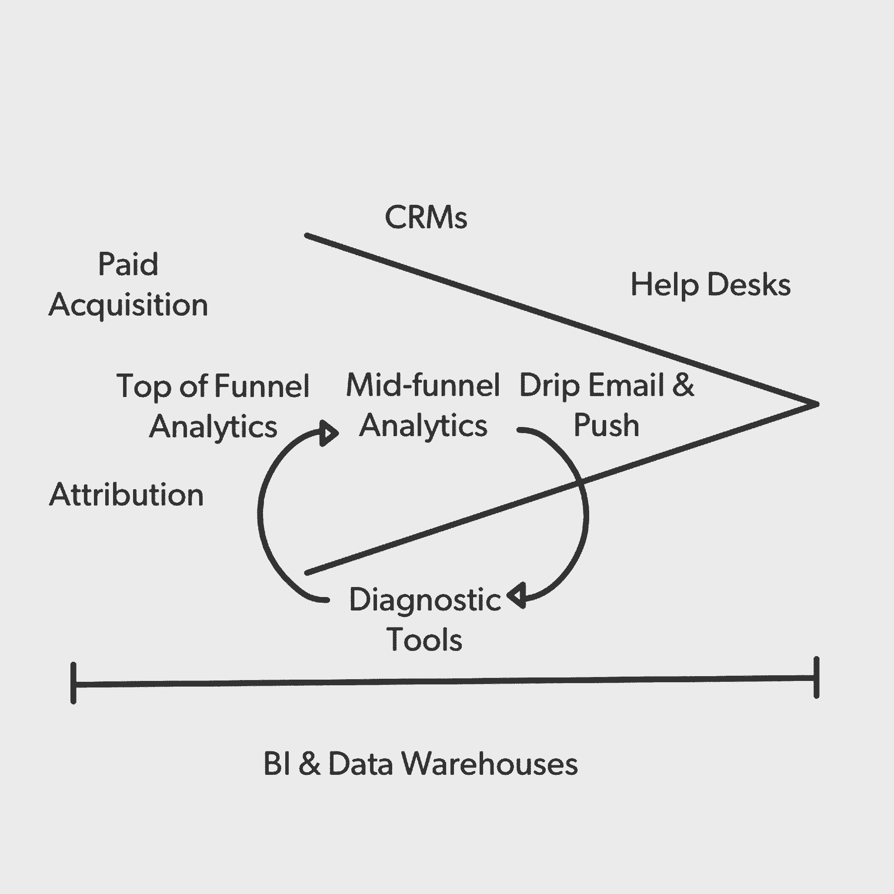
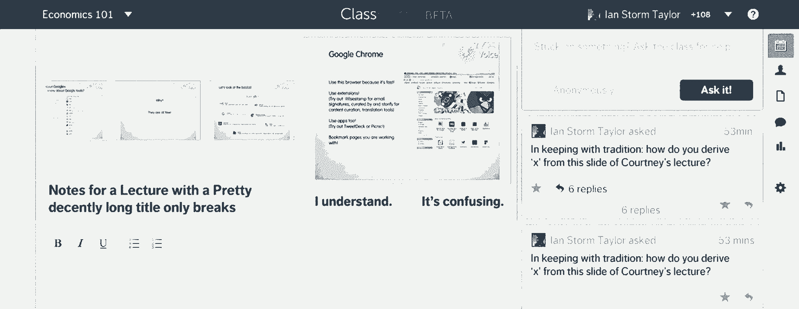

# 工具早期创业公司实际上需要了解他们的客户

> 原文：<https://review.firstround.com/the-tools-early-stage-startups-actually-need-to-understand-their-customers>

经过 18 个月的挣扎，以两种产品理念获得牵引力，细分市场开始了转机。接下来是两年的增长，从 4 个人到 60 个人，成千上万的新客户，经过几轮融资达到 4400 万美元。是什么触发了如此重大的转折点？在迎接巨变的过程中，联合创始人兼首席执行官 **[彼得·莱因哈特](https://www.linkedin.com/in/peterreinhardt "null")** 和 Segment 的团队开始大量使用实时聊天工具 [Olark](https://www.olark.com/ "null") 等定性反馈工具。它嵌入在每个页面上，从新员工到联合创始人，每个人都在不断地向使用他们产品的人学习。

很难将所有这些动力都归因于工具，但知道如何利用它们是 Segment 业务的核心。这家初创公司可以轻松收集客户数据，并将其发送到用于任何目的的任何工具，从分析到营销自动化。这就是为什么 Reinhardt 对他能找到的每一种增强客户数据的工具都了如指掌，在过去的三年里，他每周都亲自试驾一种工具。Segment 已经集成了数百种工具来帮助超过 6000 名客户，包括 [Product Hunt](https://www.producthunt.com/ "null") 、 [Atlassian](https://www.atlassian.com/ "null") 和 [Instacart](https://www.instacart.com/ "null") ，构建和完善他们的工具包。

在这次采访中，Reinhardt 根据他对工具的广泛评估，分享了资源受限的初创公司应该如何以及何时选择它们。在这里，他讨论了构建还是购买的争论，提供了关于在八个不同类别中考虑哪些工具的建议，概述了选择工具时要避免的陷阱以及何时宣布工具成功。

# 选择工具时从哪里开始

当大多数人想要利用客户数据时，他们会想到分析，但广告工具、帮助台、客户关系管理、归因和十几个其他类别的工具也是由客户数据驱动的。“所有这些工具的共同点是，它们使用客户信息和行为数据来帮助业务团队改善客户的旅程，”Reinhardt 说。“当我们考虑客户数据时，这不包括流入人力资源或会计工具的信息。这是因为客户数据最终是行为数据:知道用户何时浏览页面、购买产品或邀请朋友。它通过用户或顾客采取的许多行动来定义和提炼他们是谁。”

# 首先决定建造还是购买。

如果不与客户互动并获取他们的资料，就不可能经营一家企业，尤其是在公司的早期形成阶段。“如果你正在建立一个网络或移动业务，你与客户互动的方式通常是通过电子邮件、推送通知、短信或产品内外的调查，”Reinhardt 说。“你发现他们使用你的产品有多容易的方法是使用一个分析工具，向你展示一个漏斗。实体模拟是一个店主站在她的店里观察发生的事情。这是最基本的。”

因此，首先出现的一个问题是，是购买现成的工具还是内部工具。前者可以立即使用，但可能成本很高，并且不能精确地适应业务需求。后者会占用宝贵的工程资源，并有重新发明轮子的风险。“这个决定其实与成长阶段关系不大。许多公司错误地为自己构建工具——而不是完全专注于客户——因为他们比客户更了解自己。这是一个容易的陷阱，”莱因哈特说。“如果您已经尝试了市场上的许多其他工具，但发现没有一个能解决您的问题，那么您应该只构建自己的工具。只有在别无选择的情况下才建造。但还是要小心:我估计我看到的 50%的初创公司都无法维护它们。”

如果你已经做了调查并决定建造，睁大眼睛进去吧。“构建自己的分析工具，而不是释放所有资源来构建产品，这可能很危险。莱因哈特说:“这很容易扼杀一家初创公司。“假设你有三个工程师，其中一个正在开发你的分析工具。你开发产品的能力降低了 30%,所以你需要 30%的跑道。构建这种分析工具比看起来要昂贵得多。有能力建造一些东西并不意味着你应该这样做。”

# 编制一份工具类别的综合清单。

如果您决定测试和购买工具，理清选择什么可能是一个挑战，更不用说工具类型的宇宙了。Reinhardt 已经确定了八类工具，这些工具应该可以作为大多数创业公司的足够的启动清单。以下是他的分类和主要推荐:

**基本的漏斗顶端分析** : [谷歌分析](https://www.google.com/analytics/ "null")。

**中深漏斗分析** : [Mixpanel](https://mixpanel.com/ "null") ，[振幅](https://amplitude.com/ "null")和 [Kissmetrics](https://www.kissmetrics.com "null") 。这些特别适合作为事件跟踪工具。

**全业务分析**:SQL 商业智能 [Looker](http://www.looker.com/ "null") 、 [Mode](https://modeanalytics.com/ "null") 和 [Periscope](https://www.periscopedata.com/ "null") 。

**诊断工具** : [Olark](https://www.olark.com/ "null") ， [Livechat](https://www.livechatinc.com/ "null") 和[对讲机](https://www.intercom.io/ "null")。对于诊断工具的视频录制部分， [Fullstory](https://www.fullstory.com/ "null") 和 [Inspectlet](https://www.inspectlet.com/ "null") 是首选。它们提供了观察客户正在做什么的能力，甚至可能在与他们通过实时聊天工具交谈的时候。

**滴滴邮箱** : [Customer.io](https://customer.io/ "null") 和[自动驾驶](https://autopilothq.com/ "null")。Mailchimp 适用于传统的电子邮件列表管理。

**销售和支持工具** : [Zendesk](https://www.zendesk.com/ "null") 和 [Salesforce](http://www.salesforce.com/ "null") 。

**有偿收购**:脸书和推特。

**归属地** : [Convertro](http://www.convertro.com/ "null") (web)和 [Kochava](https://www.kochava.com/ "null") 或 [Hasoffers](http://www.hasoffers.com/ "null") (移动)。

# 时机让好工具变得伟大。

选择正确的工具的一个大任务是在正确的时间集成它们。这可能有助于你不要过早购买昂贵的工具，或者继续使用基本的工具，如果你已经不再需要它们的话。当你按照 Reinhardt 的工具清单行事时，以下是他的一些建议:

决定从哪里开始。“就客户数据分析工具而言，大多数初创公司都是从谷歌分析开始的。这似乎是显而易见的，但不要忽视它。这会让你的创业公司对你的访问者有一个基本的概念，他们在看什么内容，他们来自哪里。它是免费的，是一个非常好的工具，将在很大程度上帮助你度过第一年。不打开它，你一定是疯了。”

**关于高级分析工具**。“在产品符合市场需求后，开始集成用于更复杂分析的工具。当你越来越细化，想要更深入地理解，比如说，从主页到产品内部的转换漏斗，扩展到一个完整的漏斗分析工具，比如 Amplitude、Mixpanel 或 Kissmetrics。然后，当您询问的关于客户数据的问题对于开箱即用的工具来说变得太复杂时，您将达到一个点—可能有 30 个人左右。如果你正在寻找超越漏斗的更全面的业务分析，开始考虑 Looker、Mode 或 Periscope，为你提供 SQL 业务智能系统，以获得一个业务范围的视图。这些工具连接到像 Redshift 这样的数据仓库。”

**关于潜入诊断工具**。“当你感觉到漏斗中哪里有漏洞时，就会出现一个点，比如当人们注册了，但没有激活时。在这一点上，我们发现定性反馈比定量分析更有趣、更有影响力，尤其是当你的客户数量在统计上微不足道的时候。考虑像 Olark，live chat 和 Intercom 这样的实时聊天工具。如果没有某种真正高带宽的与客户沟通的机制，我不知道你怎么开始构建一个网络或移动产品。”

**开启访客录音**。“访客记录对产品营销和生命周期非常有帮助。对于产品团队来说，这是一个很有价值的工具，可以用来了解在个人用户层面发生了什么。例如，如果在产品激活流程的某个特定步骤只有 10%的转化率，你可以观察用户行为的记录，发现按钮是看不见的。"

**关于寻求市场归因工具**:“当一家消费创业公司开始投资付费收购作为其营销努力的一部分时，谷歌分析的漏斗顶端分析不会成功。购买营销归因工具，如 Convertro for web 和 Kochava 或 Hasoffers for mobile。

**关于介绍滴滴邮件**。“当你的分析和诊断工具显示用户在哪里下车，但你还不能在产品修复队列中找到它时，引入滴滴电子邮件。给他们发信息，帮助他们堵住那个洞，或者让他们越过他们可能遇到的障碍。”

**关于激活销售和支持工具**。“在您的分析、诊断和即时电子邮件工具协同工作，并且销售和支持团队开始运作之后，这些产品才是真正有益的。为了完成工作，他们需要更多关于客户体验的背景信息。这需要提取客户在应用程序中采取的渠道和行动的数据，以便销售和支持人员可以帮助客户，而无需不断询问他们一直在做什么。”

# 用逻辑在定性和定量工具之间切换。

Reinhardt 在创业公司中看到了一个共同的模式，他们扩展工具来了解他们业务的偏远角落。“他们倾向于在定量和定性工具之间摇摆不定。Reinhardt 说:“前者的例子是分析、归因或 SQL BI 工具，而后者包括实时聊天、访客记录或调查工具。“定量工具往往有助于发现失败或成功，而定性工具本质上是诊断性的，对于揭示为什么会发生这种情况很有价值。”

用定量工具发现症状或机会，用定性工具进行诊断。

创业公司在定性和定量工具之间移动时，应该对节奏感到舒适。“这是螺旋式上升的一部分。Reinhardt 说:“人们经常会在这两种工具之间来回切换，以求提高。”“不要反抗。当你的注意力转移时，进行转换。如果你观察漏斗，发现跌幅比你预期的要大，那就退出分析工具。求助于你的定性工具套件——也许是实时聊天或访客录音——找出原因。通过调整您的流程来测试您的假设，并检查您的分析。冲洗，重复。”

# 选择工具时要避免的陷阱

即使有了明确的计划，Reinhardt 仍然看到公司在选择工具时犯一些基本错误。以下是他最重要的三条告诫:

# 试用现成的工具—不要沉溺于研究。

您正在寻找新的工具来更好地了解或装备您的公司，但没有什么可以替代尝试。“我认为在尝试使用这个工具和在用户界面上玩之前，很难评估它是否合适。然而，大多数人进行研究是因为通过一个系统来完全整合和运行足够多的数据以衡量其价值是一项繁重的工作，”Reinhardt 说。“我不想做广告，但这正是像 Segment 这样的工具有用的地方。设置好跟踪后，您只需切换开关，就可以让它在多个工具之间流动。这让你很容易并列他们。无论您是否使用 Segment，都要想办法降低通过工具查看动态数据的门槛。”

负责供应商选择的人想要表明他们正在内部运行一个彻底的过程。“具有讽刺意味的是，我发现那些试图在供应商选择过程中做得非常好的公司搬起石头砸了自己的脚。Reinhardt 说:“这是因为你在供应商选择过程中做得越好，试用这个工具的时间就越长。”“我在与供应商的深入访谈中看到的成功率非常低，这意味着尝试新工具的迭代时间非常长。想办法快速测试它们。”

如果不是供应商研究，最简单有效的准备就是在测试工具之前写下目标——即使是假设的形式。“带着来自实验的自信态度进入工具选择过程。Reinhardt 说:“这看起来很明显，但我很震惊有这么多公司忘记了这一步，因为他们急于做出决定。”。“这里有一个例子:‘我们使用分析工具的目标是让我们的产品团队对激活漏斗有一个完整的了解。’在这种情况下，定义在使用该工具取得成功的不同阶段，客户完整情况的 60%、80%或 100%可能是什么样子。用你的数据测试它，在两个星期后，宣布它是否击中马克。这个设置将帮助你找到赢家或让你继续前进。"

测试工具的另一个好处是评估对工具的支持程度。“采访供应商是为了了解产品能够做什么和可能做什么。Reinhardt 说:“在试用期间获得支持就是了解产品的功能。“别忘了支持体验。该工具的支持团队应该尽早到达，以确保您的试验成功。有了工具，转换平台可能会有很大的障碍，所以如果它们在短期试验中不能很好地为您服务，那对于长期支持来说不是一个好兆头。”

成功的公司不断尝试新的工具，如果它们不起作用就切断诱饵。他们通过短期试验而不是长期的研究过程来验证。

# 计算工具的*全部*成本。

标价只是一个开始。量化节省的时间和机会成本给出了工具真实成本的更真实的近似值。“在细分市场的历史上，我们曾经只剩下三个月的时间。Reinhardt 说:“那是一段非常可怕的时期，如果我们无法筹集到资金，我们会想尽一切办法活下来。“与人相比，工具只是很小的一部分，但即使在绝望的情况下，我们也不能放弃它们。这是因为工具让我们节省了时间，这是非常有价值的。”

Reinhardt 和 Segment 将工具的成本与他们的时间价值进行比较。Reinhardt 说:“工具不仅为我们节省了每小时的成本，还加快了我们的工作。“假设你以每小时 50 美元的价格估算你的时间，以每月 100 美元的价格购买 MailChimp，这将节省你构建电子邮件分发工具的费用。这显然是值得的。所以对我们来说，衡量我们的时间和预算之间的权衡变得越来越严格。”

这还是在计算机会成本之前。“回想起来，这可能是巨大的，”莱因哈特说。“如果公司成功了，那么你将会更加珍惜你的时间，而不仅仅是每年付给自己的 3 万美元。考虑到它的高度可变性，这很难量化，但如果你正在做一个 50/50 的决定，这可能会扭转局面。”

如果你真的在购买工具或服务时陷入了瘫痪，那么让你感到安慰的是，这些工具的大多数合同远没有你的移动计划那么积极。“我与供应商达成协议，按月付款，但几乎所有这些供应商都会默认这样做，特别是对于产品上市前的初创公司，”莱因哈特说，“随着公司变大，他们会要求年度合同，但在那个时候，这不是什么大事。更大的问题是被套牢；这是真实的。假设您开始向工具发送数据，六个月后您发现您使用了错误的工具。你真正需要的是另一个工具中的数据。你越来越难以理清自己，因为你到处都安装了跟踪代码。"

转换成本是计入工具总费用的一个变量。“同样，在早期创业过程中，一家公司会在大约八个不同类别中的每一个类别中使用几种工具。Reinhardt 说:“例如，随着创业公司的成长，你的数据必须从不同的分析工具中提取。“不要纠结于一个你不想再用或者你的公司已经不再适用的工具。一种方法是确保将数据收集与接收数据的工具分离开来。”

# 不要过度依赖定量数据。

对于早期公司来说，获取持续的客户反馈和观点比详细的分析更重要。“在那个阶段，你近乎单一的目标是迭代产品本身或产品定位。莱因哈特说:“在证明产品符合市场需求之前，你能做的最重要的事情就是开发客户。”“在这一点上，你可能还没有足够的统计数据，所以要更多地关注定性因素，也就是客户真正想要的和/或需要的。”

当 Reinhardt 和他的联合创始人在 Y Combinator 开发早期产品时，他特别深刻地体会到了这一点。“我们的目标是建立一个课堂教学工具。莱因哈特说:“基本上，学生可以按下一个按钮，匿名对老师说‘这很令人困惑’，而教授可以看到他的学生有多困惑的图表。“我们在 YC 工作了 3 个月。这意味着成千上万行代码。产品功能的大规模传播产生了各种各样的数据来分析，从演示幻灯片、学生笔记和实时问答。我们痴迷于测试和跟踪每个教室设置。但是，当我们坐在教室的后面亲自观察发生了什么，看看学生们实际上在做什么时，批判性的洞察力就来了。结果，他们打开笔记本电脑，直奔脸书。”

这个故事的寓意是，在你把你的产品当作一个评估客户行为的机会之前，不要把它看作是一个需要跟踪的指标的组合。“产品或业务的失败模式非常明显。如果我们只是观察学生，我们会立即知道，但如果只是以定量的方式进行，这是完全不明显的，”Reinhardt 说。“在那个阶段，当我们使用它的人数在统计上微不足道时，定性方面是至关重要的。因此，在任何情况下，你都不应该被无关紧要的定量指标分散注意力——这是有成本的，通常是以牺牲早期最重要的定性数据为代价的。”

# 如何衡量你的工具的成功

每个公司和类别对其工具都有自己的需求，但 Reinhardt 认为每种类型的工具都有一个通用的成功基准。他说:“很难对不同的类别进行概括，所以有一个大致的预期是有帮助的。”。以下是他对每种工具的成功基准:

**漏斗分析的基本要点**:“对谷歌分析来说，就是知道你获得了多少流量。你知道你的产品登陆页面的哪些部分在引起共鸣，生态系统中的哪些人在谈论你，给你送流量。”

**中深漏斗分析**:“对于事件跟踪工具，如 Mixpanel、Amplitude 和 Kissmetrics，当你对每个主要产品工作流程进行完整的漏斗分析时，你就成功了，所以你知道用户有多大可能在你的产品中完成一系列主要的动作。您应该能够总结出如何改进该流程的后续步骤。”

**业务范围分析**:“对于 SQL BI 分析工具，如 Looker、Mode 和 Periscope，人们应该能够为每个团队构建高质量的仪表板，包括高管团队和董事会。”

**诊断工具**:“对于聊天工具，你的产品经理应该感觉他们确实学到了很多。这是一个更加定性的评估，因此我们制定了一个等级(1-10)，来评估项目经理是否认为该工具有助于建立客户需求的背景。”

**滴滴电子邮件**:“对于电子邮件工具来说，成功就是能够在一个漏斗中捕获一个列表。你希望能够在客户 IO 或自动驾驶和一个活动之间来回跳动，并看到转化率在漏斗的不同部分波动。”

**销售和支持工具**:“对于 Zendesk 和 Salesforce 等工具来说，成功就是你的销售和支持人员拥有关于客户的完整背景，并为他们提供卓越的服务。”

**付费获取和归因工具**:“对于付费获取或归因工具，看看你是否真的通过它获取客户，以及你是否能够衡量你获取每个客户的成本。将这些数据与您的分析工具相结合，看看该客户创造了多少收入。”

您对这些工具类别的期望是，它们使用您的数据，并提供改变您决策方式的见解。“这可能是更快地做出选择，以更明智的方式，或者与您的团队或客户更好地合作。如果你有一个工具在后台运行，但你从来不看它，它就没有价值。”

成功来自于实现一个工具，使用它并根据它提供给你的数据做出决策。

结构化和理清数据已经是一个很大的挑战了；没有理由让您用来管理它的工具变得如此复杂。Reinhardt 的八大类客户数据工具不仅可以作为一个分类法，还可以作为一个时间表，供你在创业公司扩展其运营和数据集时遵循。在大多数情况下，默认尝试和购买你的工具，这是一个更全面，更具成本效益的方法，当启动资源和跑道摇摆不定。在测量定量和定性输出的工具之间寻求平衡，并确保它们满足每种类型工具的预定成功基准。

“客户数据变得一团糟是有原因的。这是因为客户数据对很多方面都很有价值。Reinhardt 说:“每个团队——销售、营销、产品、设计、高管团队，应有尽有——都需要访问越来越多的数据来做好自己的工作。“事实是，与许多其他有争议的资源不同，如果组织得当，数据有可能被其所有追求者同时完全使用。关键是创建一个数据存储库，允许每个工具共享一个完整版本的数据，当路由到每个团队的工具时，这些数据似乎是专门为他们的目的而收集的。这就是神奇之处。”