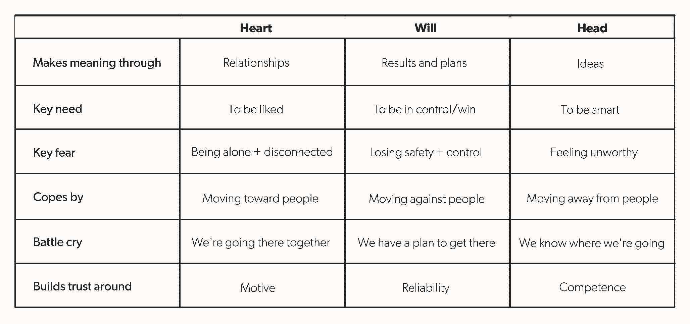

# 你可能没有注意到的团队多样性类型

> 原文：<https://review.firstround.com/the-type-of-team-diversity-youre-probably-not-paying-attention-to>

几年前，在一次破解他的团队扩展计划的任务中， **[伊塔马尔·戈德明兹](https://www.linkedin.com/in/itamarg/ "null")** 忍住不翻白眼，拿起一本新书，确信自己会同样快地放下。也许是封面上“突破”和“非凡”之类的夸张语言。也许这只是 Goldminz 自己对任何闻起来太像自助的东西的厌恶——毕竟，他是一名训练有素的工程师，是可证明想法的坚定粉丝。

相反，Goldminz 发现了一个理解人们的具体模型，这改变了他的工作方式，并使他的组织蓬勃发展。你甚至可以称之为突破。

这本书的名字是 *[掌握领导力](https://www.amazon.com/Mastering-Leadership-Breakthrough-Performance-Extraordinary/dp/1119147190 "null")* ，这个被称为“心/意志/头脑模型”的模型定义了三种“类型”的人，以及他们如何看待周围的世界。Goldminz 是 **[语法上](https://www.grammarly.com/ "null")** 和之前 [AltSchool](https://www.altschool.com/ "null") 的人力资源总监，他一直秉承这一理念，并根据自己在科技公司的经历进行调整，发现这对于技术团队和业务团队都很有价值。

在这次独家采访中，他描述了这三种类型中的每一种，以及如何发现它们(或了解你在哪里跌倒)。他解释了管理者如何利用这种洞察力来建立更强大的团队，并让每个成员都发挥出最佳水平。他分享了使用这种模式成为更灵活和更有创造力的专业人士的策略和自我评估策略。

# 人是扩展的秘密

Goldminz 的人员运营之路是非传统的。“我的职业生涯始于软件工程，随着时间的推移，我意识到我对人类谜题比对技术谜题更感兴趣，”他说。“所以我开始倾向于更以人为中心的角色，如项目管理、项目管理、工程管理。”

多年来，在像 [Opower](https://www.oracle.com/corporate/acquisitions/opower/index.html "null") 这样的公司，Goldminz 的任务是在实施敏捷和精益软件实践的同时快速扩展团队。他发现这些实践在很多方面更多的是关于使用软件的人和他们合作的方式，而不是软件。“这些方法的核心是，人们坚信，如果你在合适的条件下帮助他们取得成功，他们就会做正确的事情。因为人要成长。他们希望发展，并对组织产生积极、有意义的影响，”他说。"他们不需要通过胡萝卜加大棒来胁迫或控制."

因此，有效地扩展一个组织与帮助人们成长密不可分。因此，Goldminz 将注意力转向学习如何做到这一点，最终完全转向了人员团队。他曾在一家咨询机构工作，学习过像《T2》《掌握领导力》这样的管理书籍。一次又一次——用不同的语言但相同的基本概念——三种类型的模型不断出现。很快，Goldminz 就到处看到心脏/意志/头部模型。

在一个特别令人难忘的例子中，他的团队负责向整个团队传达 AltSchool 福利计划的变化。“我们第一次传达这一变化时，进展并不顺利。他表示:“当时有很多阻力、阻力和挫败感。“在我们的第二次尝试中，我决定用这个心/头/意志模型来组织我如何传达同样的消息。我认真思考了我将如何迎合我的信息中的每一个受众:解释“头脑”型改变背后的最终目标或“为什么”,“意志”型改变的逐步方法，以及“心灵”型改变对人们的影响。这显然更受欢迎。人们能够理解新闻、处理变化并回到工作中来。”

# 三种类型:心、意志和头脑

Goldminz 版本的模型将人分为三种类型，每种类型都通过一个主要的镜头来看待世界:心、意志或头脑。“当然，这些类型映射到我们所有人的基本需求:被喜欢——或心，控制和胜利——或意志，以及聪明——或头脑，”他说。“但我们通常有一个占主导地位的原因是，在生命的早期，我们主要依赖一个作为应对策略——不一定是围绕创伤，而是作为理解世界的一种方式。”

每种类型都展示了关键的积极属性，以及关键的消极属性。“我们通常认为的优势和劣势实际上是一枚硬币的两面，”Goldminz 说。“如果你把一个积极的属性带得太远，积极的就会变成消极的。或者你在一个方向变得非常强大，但这是以你个性的其他方面为代价的。”

这种模式的优势在于有助于强调你的类型的积极属性，减少消极属性。“我如何放大我的优势？我如何衡量或管理我的阴影面？此外，我如何成为一名更全面的个人和领导者？”Goldminz 说。“有效地使用这种模式意味着不要只关注你的类型，还要从其他类型中寻找你可以和应该在哪里成长的线索。”

Goldminz 分享了每种类型的草图，以及识别它们的提示:

# 心

这种类型的人需要被喜欢，他们的动力首先是关系。对他们来说，一起完成某事和他们正在完成的事情一样重要。

**优势:**“这些人往往非常擅长建立一种社区意识，并将其推向一个共同的目标，”Goldminz 说。"他们的人际交往能力很强，而且他们总是乐于向需要帮助的同事伸出援手。"

**挑战:**惹怒羽毛对心形的人来说特别不舒服，所以他们可能不太倾向于在必要时做出大胆的举动。“他们有更强的服从倾向，”Goldminz 说。“比起做正确的事情，他们可能更看重取悦别人。在寻求不要捣乱的过程中，他们可能无法畅所欲言，错失分享宝贵想法的机会，尤其是如果他们是逆向思维的话。”

如何发现他们:“考虑到他们在发展人际关系方面的天赋，心形类往往会成为你团队的最佳合作者，”Goldminz 说。“他们与同龄人建立起一种相互关心、感同身受的关系，并培养有效的团队精神。”

“我曾经参加过一个人际交往技能研讨会，其中一个参与者有一种‘阅读房间’的神奇能力，不用他们说什么就知道每个人的感受。Goldminz 说:“她自然知道该对他们中的每一个人说些什么才能让他们感觉好一些。“但我们都是来学习的——学习通常需要一定程度的不适。在某些时候，她看到两个参与者经历了一场富有挑战性但健康的人际冲突，感到很不舒服，她会插话调解，但在这个过程中剥夺了他们学习的机会。

# 将

意志驱动的人主要是被成功或控制的需要所激励。“他们理解周围世界的方式更多的是通过结果，或者通过让他们达到目的的计划，”Goldminz 说。

优势:“这些人想要完成工作，他们会全力以赴地追求这个目标，”Goldminz 说。“他们绝对有能力，并将全力以赴，争取最好的结果。

挑战:“意志坚定的人和内心坚定的人有着截然不同的风格，”Goldminz 说。“这种类型会更加专制。他们可能雄心勃勃，想要排挤他人，或者追求完美主义，认为“足够好”才是正确的结果。”

**如何发现他们:“**你的团队中有特别优秀的决策者吗？Goldminz 说:“他们很有可能是意志型的。“这些以结果为导向的人不害怕打电话，进入他们计划的下一步。”

“想象一下你最受流程驱动的同事。okr 是他们 DNA 的一部分。Goldminz 说:“他们喜欢制定计划，也喜欢执行计划。“我在过去的初创公司有一个同事就是这样。在他工作的头几天，他向我们介绍了他接下来 90 天的多阶段、循序渐进的计划。他立刻制定了一个六步迭代流程，打算通过这个流程来管理他的团队。

# 头

这种类型的人需要理智地参与，并且最关心组织前进的方向。“他们通过思想来理解世界。他们想在更哲学的层面上参与进来，”Goldminz 说。"他们回到这个问题:最终状态是什么？"

**优势:“**当他们为团队或组织设定目标时，这种类型的人会茁壮成长，而且通常是初创公司的‘大视野’人士，”Goldminz 说。

挑战:然而，专注于伟大的想法往往会让这种类型的人与他们的感觉脱节。“他们倾向于屏蔽或远离情感。Goldminz 说:“他们可能会对自己或他人过分挑剔，有时甚至到了傲慢的地步。"如果任其发展，这种无法理解他人的能力会表现为过度的自我，或者愤世嫉俗的倾向."

Goldminz 说:“如果有人在开始谈论细节之前需要了解全局，那么他们很有可能是头型的。”。“这一群体也以他们强烈的正直而闻名——通常伴随着同样强烈的自我批评倾向。”

“另一位前同事会多次把我拉到一个房间，向我介绍他认为是阐明公司愿景的一种新方法，”Goldminz 说。“在 team offsites，他是推动更具哲学和战略意义的话题的人——而且在这些对话中最投入。他想知道我们要去哪里——当他知道其他人也知道时，他感到安慰。”

# 管理每个成功原型

对于管理者来说，这个模型有双重作用，既能洞察他们自己的类型，又能理解和指导他们的团队。一旦你理解了这些特征，就更容易给人们分配发挥他们长处的任务。但是不要止步于此。Goldminz 说:“最好的经理也会督促他们的团队成员去改进他们的弱点。”“将人们置于需要他们拓展自己不一定擅长的领域的环境中。”

无论你是在帮助你的报告培养优势还是克服劣势，都要用能引起共鸣的语言来构建你的指导，并且[要与每种类型的](https://www.google.com/url?q=http://firstround.com/review/use-this-equation-to-determine-diagnose-and-repair-trust/&sa=D&ust=1528497638488000&usg=AFQjCNFYTzbAnjeCR-4Pzs0V3mEgl_Arvw "null")建立信任。“以头型为例。你可能需要哄着这些人和他们的同事在更情绪化的层面上交流，而不是停留在大想法的领域里。但如果你试图用轻松的语言跟他们谈论关系的价值，你不会走得太远，”Goldminz 说。“相反，告诉他们，‘嘿，如果你不能投入自己的情感，你就错过了可以帮助你做出更好决定的数据点。’或者“不能有效地参与冲突，你就错过了一个让别人进入你试图让每个人都去的更抽象的地方的机会。"

理解这个心/意志/头脑模型就是理解人们如何理解这个世界。有了这种洞察力，管理者就可以摆脱一刀切的信息传递方式，加快每个人对团队的贡献。

# 心

**增强自己的优势** ***:*** 这些团队成员最擅长建立社区，将他们的同事团结在一个共同的目标周围。Goldminz 说:“需要建立认同、推动团队朝着某个方向前进的事情，可能真的很适合更喜欢心脏类型的人。”

**管理他们的局限** ***:*** 要对抗这种避免冲突的阴影，让他们专注于结果，更加果断。“鼓励‘心’型的人说出他们脑海中的世界末日场景。围绕它们发生的可能性提出问题，这样他们就能明白它们发生的可能性有多大。Goldminz 说:“帮助他们设计小型、安全的实验来检验这些信念。“这将有助于他们逐步解决冲突，通过他们觉得果断的小步骤，因为每个小测试对他们自己和他们周围关心的人来说风险都较小。”

**如何建立信任** ***:*** “对于你团队中的这些人来说，这将是所有关于维护关系的事情，向他们表示同情，并表达你的关心，”Goldminz 说。"证明你和他们的兴趣是一致的，这对于管理心脏类型是很重要的."

**关于绩效考核。Goldminz 说:“正式的反馈机会、绩效评估和同行评估对这个团队来说尤其重要。“对于心脏型的人来说，这就是作为一个团队一起完成一些事情，知道其他人对他们正在做的工作非常满意。对于心脏类型的人来说，获得积极反馈或认可的强烈需求更为重要。”**

# 将

增强他们的优势:对于这种类型的人来说，寻找以最好的方式做事是一种资产(而不是耗费时间的负债)的任务。Goldminz 说:“通过给他们非常详细的任务，并要求更高的精确度，来利用他们的完美主义属性。”“就早期创业公司而言，遗嘱型人才在会计、薪资或合规等领域表现出色。我见过他们管理严密，组织路演筹款或与供应商合作，而不是计算下一个产品版本的 MVP。”

**管理他们的局限性:**团队合作对这些独立型的人来说可能很难，所以 Goldminz 鼓励经理们强制解决这个问题。“例如，我会有意挑选一个有意愿的人，给他们一些指导，或者为他们创造更多的团队合作机会，”Goldminz 说。“对于一个‘意志’型的人来说，这是一个渐进的过程。这可能看起来像是在授权问题上给初级经理施加更大的压力，然后在授权的任务结果不尽如人意时进行深思熟虑的汇报。强调糟糕的结果和与他们想象的不同的有效解决方案之间的区别。然后，询问他们将来可能会如何授权。”

**如何建立信任:**管理者可以通过清晰地阐明计划并定义其步骤来激励这些成功驱动型的人。“你想把你现在所在的地方和你想去的地方联系起来，”Goldminz 说。然后，当你朝着共同的目标努力时，向他们展示你也一直在完成你的计划。可靠性对意志型的人来说很重要，他们想要一个守信用的经理。”

**关于绩效考核。**正式点评的时候，要特别注意高层的外卖。“对于意志型的人来说，他们会问，‘嘿，我赢了吗？“我到底成功了没有？”“经理的反馈将比同事的反馈更有分量，”Goldminz 说。专注于确定一条发展道路，并让他们清楚梯子上的下一个梯级是什么——以及跳到它的前进路线。"

# 头

增强他们的优势:这种类型的人头脑冷静，这是一笔巨大的财富，所以给他们一些任务，最大限度地发挥他们批判性思维的天赋。“他们真的很擅长让自己远离一个决定，并真正以公正的方式权衡利弊，”Goldminz 说。"这类项目发挥了主管人员的优势。"

**管理他们的弱点:“**头型可以从走出他们的头脑和与他们周围的人联系中获得最大的成长，”Goldminz 说。“这可以归结为情绪的细化。了解他们的感受——尤其是作为对他们工作生活的一种投入，这样你就可以清楚地表明你没有干预。提供你自己的感觉，让它更像是一种交流，创造心理上的安全感。这有助于建立同理心和不同观点的健康表达。”

**如何建立信任:**理智地与这些类型的人交往，不要犹豫谈论大的想法。“你想朝什么方向前进，为什么这是正确的方向？这就是这些人想知道的，而不是如何到达那里的细节，”Goldminz 说。"领导型人才比任何人都更希望从他们的经理那里获得专业知识."

**关于绩效考核。当谈到评论时，这种类型的人也可能希望保持理智的水平。“我们要如何成长？我们对什么是性能有共识吗？Goldminz 说:“这个群体希望有针对性地讨论绩效。“他们希望将自己的职业生涯理解为更宏大愿景的一部分，并会对帮助他们达到最终状态的反馈做出最佳回应。”**

# 每个团队都应该代表这三种类型

无论你是在组建自己的团队，还是在经理招聘时为他们提供支持，都要找出这三种类型。“我发现这是覆盖您的基础并建立一个装备齐全的团队来克服扩展挑战的唯一方法。这并不是说你需要达到一个精确的比例。Goldminz 说:“关键是要避免陷入只雇佣和你想法一样的人的陷阱。”“我们都天生偏向自己的类型。我们认为，‘哦，这个人真的让我很有智慧。“我们完全可以对未来的工作感到厌倦，”但也许我团队中真正需要的是在建立同理心方面比我更好的人。"

此外，如果你屈服于熟悉事物的安逸，你不仅会错过不同的技能和视角，还可能会让你的团队对你之外的其他类型变得不那么友好。养成强迫自己寻找从不同角度看世界的人的习惯，也可以加强你的创业公司的多元化招聘工作。“实际上，这意味着每个面试小组都应该代表每一种类型——心灵、意志和头脑——的人。Goldminz 说:“这也意味着了解你的类型，并利用行为面试来确定候选人的类型，以避免“与我相似”的偏见。”“我建议对你雇用的候选人类型做一个连续记录，看看你雇用的候选人类型是否有偏见——如果你缺乏，比如说，‘意志’或‘头脑’类型。”

一旦你的团队建立起来，帮助每个成员理解完整的心/意志/头脑模型——而不仅仅是他们自己的类型。练习观察每种类型的两面。目标是使用这种结构来建立对不同人的方法的理解、讨论它们的共享词汇以及更大的团队间共鸣。“当你审视自己时，你倾向于看到自己类型的积极面，而当你审视其他类型时，你倾向于想到他们类型的消极面，”Goldminz 说。“但当你进行反向练习，考虑以不同的心态参与世界的优势时，它会帮助你对其他类型的人带来的东西有更多的欣赏。”

# 将该模型应用于个人发展

当然，虽然这种模式是经理们必须的，是团队动力的福音，但它对个人来说也是同样有价值的路线图。你越了解自己为什么会以这种方式对工作做出反应，你就能更好地控制这些反应，增强好的方面，并在注意到不好的方面时暂停。Goldminz 说:“专注于发展其他类型的长处，减少你自己类型的短处。”

首先，他建议通过问一些适合你类型的基本问题来定期检查自己:

# 心

我是不是花了太多时间去取悦别人？

我可以更果断一点吗？

我能否超越个人关系，看到更大的图景？

# 威尔(男子名)

我是在独裁地做决定吗？

我怎样才能培养更好的团队精神？

我能更真实地参与吗？

# 头

我(对自己和他人)是否太挑剔了？

我该如何与他人建立更多关爱的联系？

怎样才能让我的工作更具战略性？

除了这些更一般的问题，也要围绕你特殊的职业需求和目标来设计你的工作。“例如，在我作为人事主管的角色中，人际智能和建立同情关系的能力非常重要，”Goldminz 说。“在我的个人成长中，这些是我希望自己更加关注的事情。”

围绕个人发展有许多框架，Goldminz 提醒人们要认识到这种模式能做什么(以及什么时候你需要超越它)。Goldminz 说:“有些模型非常善于给你指明方向，有些模型非常善于帮助你找出如何改变你的行为。”“这种模式确实能给你指明方向。它给了你精确的词汇来表达你想在哪些方面做得更好。”

# 将这一切结合在一起

无论你是首席执行官还是个人贡献者，当你将这种模式内在化时，你可能会开始在任何地方看到它。从识别你自己的主要类型开始——并认识到超速运转的每种优势都有其相应的弱点。当你观察整个组织中不同类型的工作并与之合作时，唤起这种共鸣。对于建立团队的领导者，确保你代表了每一种类型。一旦你在管理他们，了解你的报告类型将有助于你更好地增强他们的优势，减少他们的弱点，并迎合他们的绩效考核，以达到他们的目标。这种模式也有助于个人发展，特别是在提供问题以帮助保持你的优势在最前沿，你的弱点在检查中。

同样，你会开始发现它在你的许多职场互动中是一个无价的指南:你设计电子邮件和团队沟通的方式；你如何设定你或你的团队的职业目标；以及你如何理解冲突，并将其转化为建设性的东西。

“我很高兴我没有对这种模式视而不见，因为它的语言更加柔和。Goldminz 说:“对于我在工作场所的许多互动来说，这是一个无价的指南——从我如何设计给个人的电子邮件到办公室范围的沟通，从我如何设定个人目标到我如何解决团队冲突。“我相信初创企业的领导者可以用这个模型作为指南，来思考和构建他们公司最关键的元素:一个一个人建立起来的团队。这种模式有助于建立多样化的团队，让人们在其中运作，思考和理解周围的世界。我相信，这正是我们在建立多元化团队和蓬勃发展、可扩展的公司时努力实现的核心目标。

图片由 Eranicle 和 Suljo / iStock / Getty Images Plus 提供。