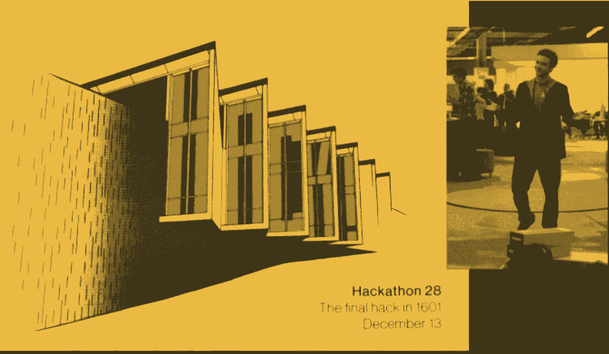
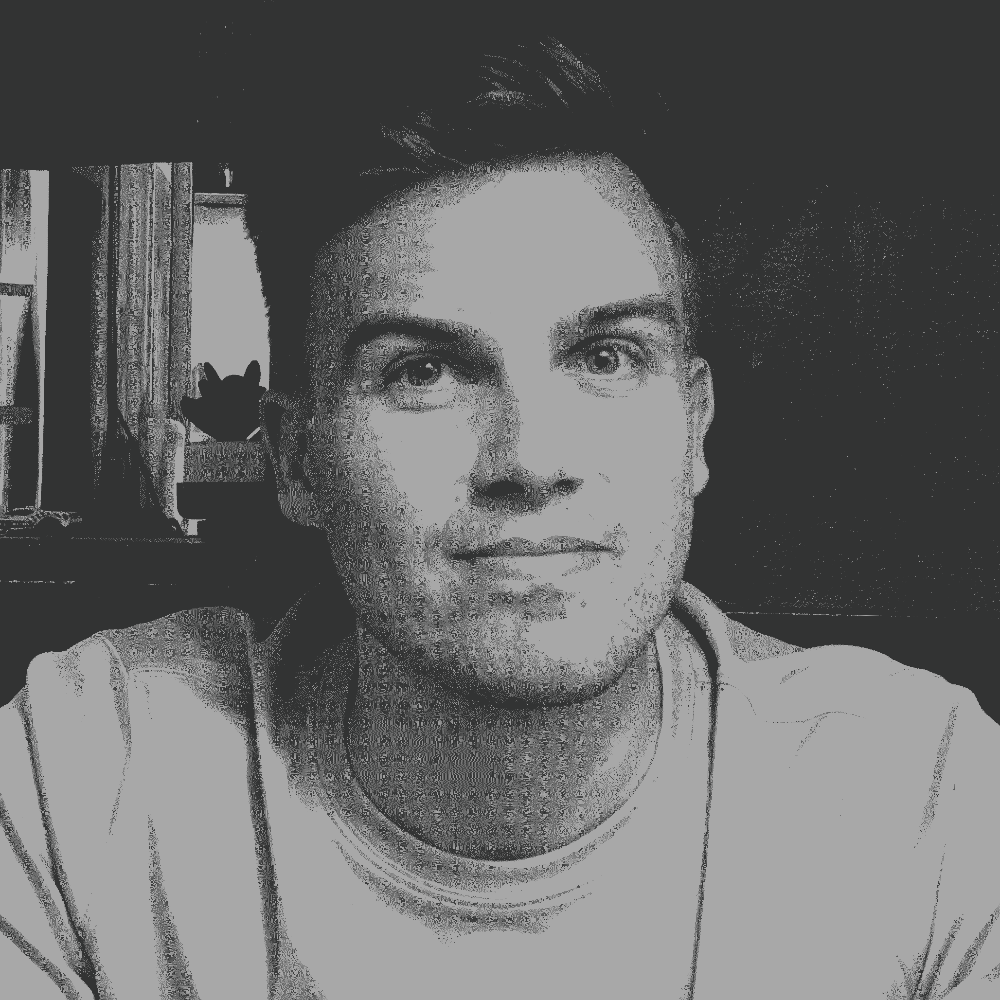
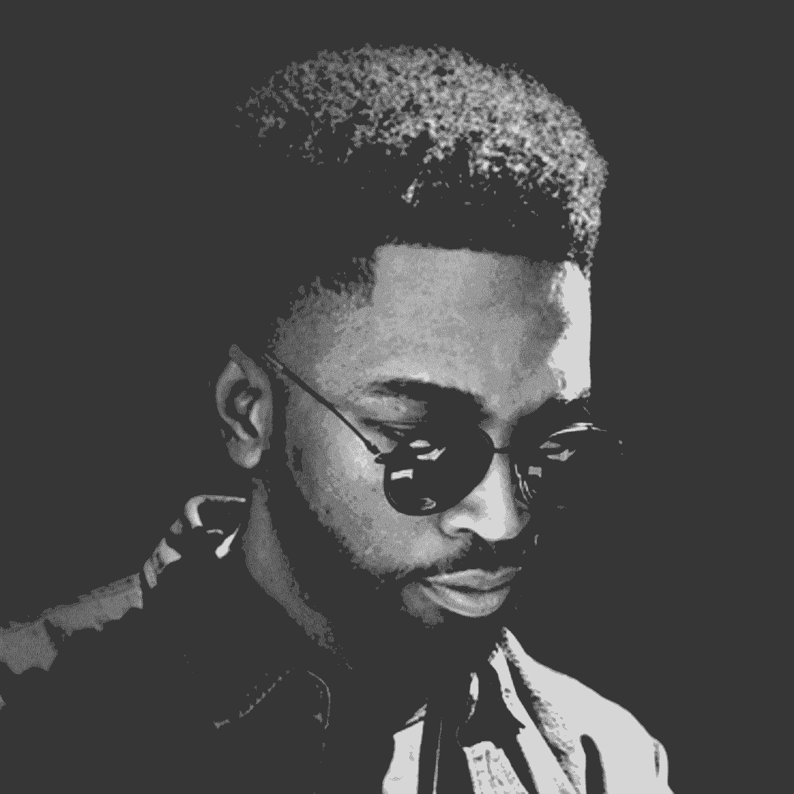
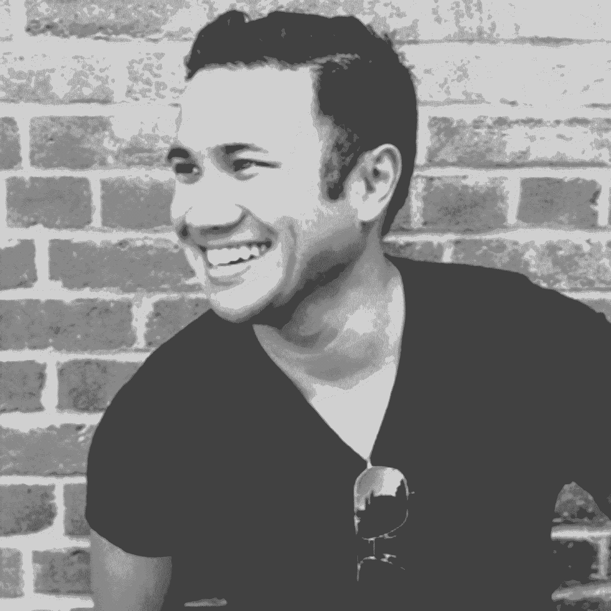
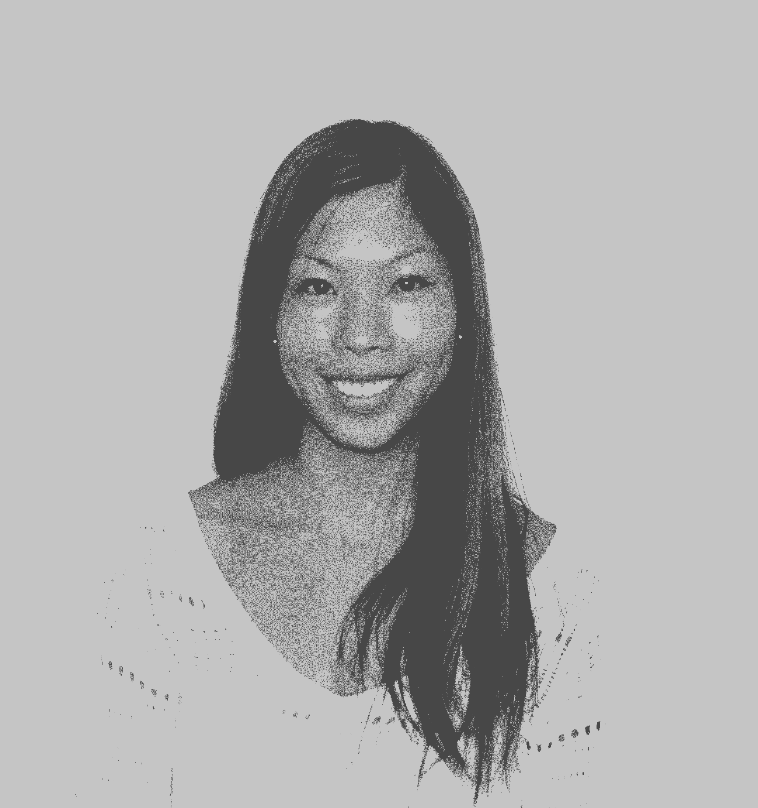
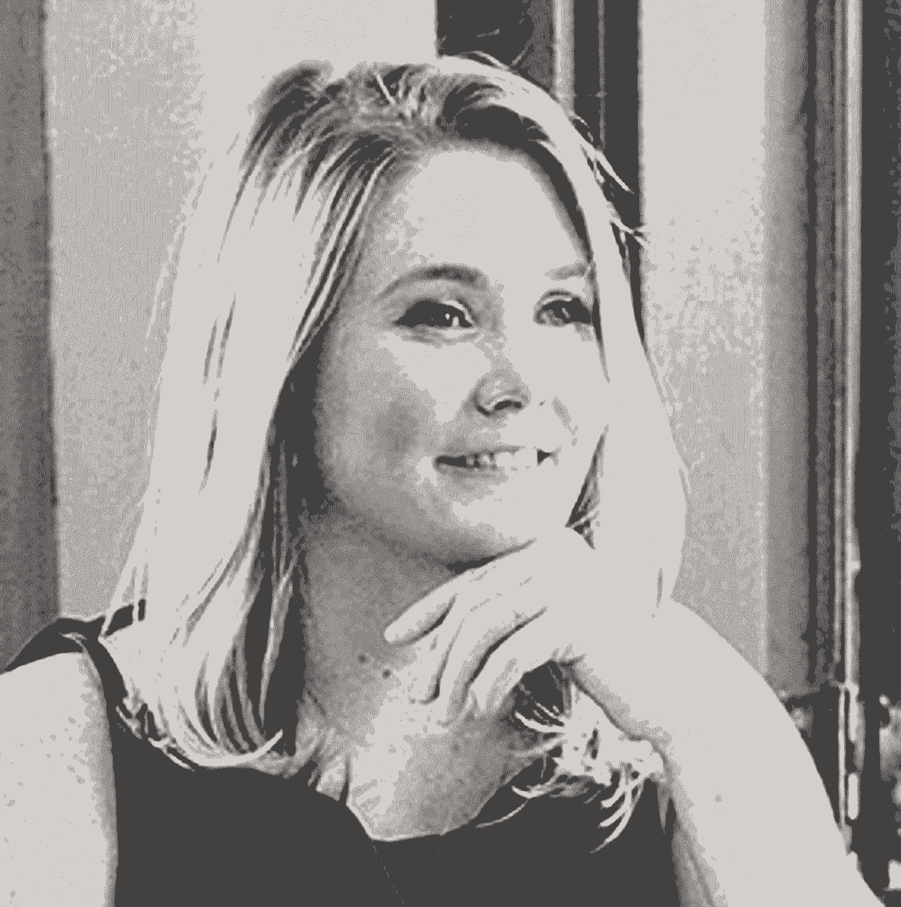
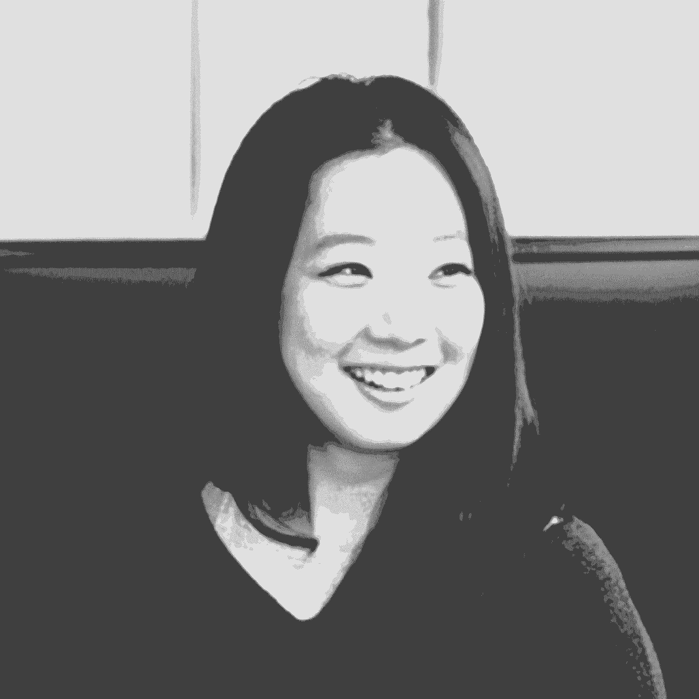
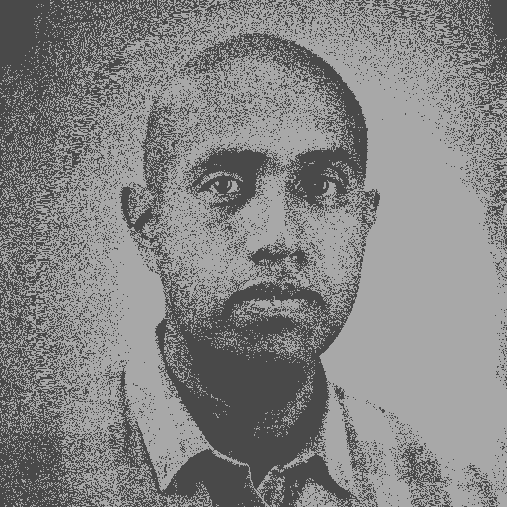

# 创始设计师角色的终极指南

> 原文：<https://review.firstround.com/the-ultimate-guide-to-the-founding-designer-role>

## 介绍

当谈到创业公司的最早雇员时，最常见的是那些进入第一个产品或工程岗位的人最闪亮——并得到最多的支持和建议。然而，第一个设计雇员有能力改变一家初创公司的整个轨迹，从用户与产品的互动方式，到吸引新客户的品牌和创意工作，都将受到影响。

首先，设计师同意承担一个充满无限机会和无尽雷区的角色。或许比其他创始团队成员更是如此，人们常常不清楚这个角色到底是什么。****[Keyo](https://keyo.com/nyc/rent "null")**的设计负责人 Gaurav Bhushan** 或许说得最好:“作为一名设计师，当事情模棱两可时，你会增加最大的价值。**然而，在初创企业中，“现在是什么样”和“可能是什么样”之间的差距让人很不舒服**。

在我们的首届[创始设计师论坛](https://designertrack.firstround.com/ "null")上，我们听到了这样的智慧瑰宝，这是一个为那些考虑作为第一个设计雇员加入创业公司的人开设的同类社区。虽然我们长期以来一直在整理来自一些当今领先设计师的顶级建议，并试图揭开新兴设计角色的神秘面纱，但我们似乎可以做更多的事情来缩小设计师的雄心与早期创业场景中第一个立足点的不确定性之间的差距。

通过这个项目(刚刚结束)，我们希望将课程和社区带给一个很少成为焦点的群体。为了做到这一点，我们召集了一批真正杰出的专家来深入了解这一关键角色——它到底是什么样的，需要避免的陷阱以及帮助自己走向成功的技巧。这些教练中的每一位(下面列出)都亲眼目睹了自下而上建立设计文化的高峰和低谷。

Checkr 的第一位设计师 Amir Hadjihabib

[安东尼·肖特](https://www.linkedin.com/in/anthonydeanshort/ "null")，细分市场的首位设计师

[大卫·达特·阮](https://www.linkedin.com/in/daviddatnguyen/ "null")，Sonix 的联合创始人，Gusto 的第一位设计师

[贾里德·埃隆杜](https://www.linkedin.com/in/erondu/ "null")，Lattice 的第一位设计师(现在是设计总监)

[Jessica Ko](https://www.linkedin.com/in/kojessica/ "null") ，Playbook 的联合创始人兼首席执行官，Opendoor 的第一位设计师

Katie Witkop ，Faire 的创始设计师

[帕特里克·韦斯](https://www.linkedin.com/in/patrickweiss/ "null")，第一轮入住的前设计专家

[丽贝卡·加尔萨-博尔特曼](https://www.linkedin.com/in/rebeccabortman/ "null")，大师班的创始设计师

[Sara Lin](https://www.linkedin.com/in/yanweilin/ "null") ，Parastructure 的第一位设计师(已被 Dropbox 收购)

索莱奥·库沃，Dropbox 和脸书的早期设计师

Stephanie Hornung ，Asana 的第一位设计师

超人的首席设计师特雷莎·曼

我们永远感谢这个成就非凡的团队，感谢他们举手指导下一代设计领导者，但我们也不禁花一分钟吹嘘那些从他们的智慧中受益的人:我们第一批的成员。这个精心挑选的后起之秀团队已经开始设计你每天使用的产品，包括谷歌、Lyft、脸书、网飞、Dropbox、OpenTable 等等。请关注这个团队——在未来的创业场景中，你会看到他们的很多表现。

为了与更广泛的社区分享该计划的见解，我们从这些稳健、诚实的对话中收集了几个关键要点。摆在面前的是对课程的深入了解，以及从每一次会议中涌现出的最具战术性的精华。

公平的警告:这本深入的手册很长，是一个可以反复阅读的综合资源。要浏览，请单击下面的任何链接，直接跳到该资源的相应部分:

成为一名创始设计师意味着什么——它适合你吗？

**第二部分**:你如何挑选合适的创业公司加入？

**第三部分**:如何成为优秀的创始设计师。

**第四部分**:如何壮大自己的团队和规模。

如果你对这个独特的角色感到好奇，请继续阅读，看看作为第一个设计师加入一家初创公司需要什么。让我们开始吧。

# 第 1 部分:解开成为一名创始设计师的真正含义——以及它是否适合你。

就像任何“第一个”角色一样，初创公司的第一个设计师没有明确的职业轨迹，因为任何一家全新的公司都没有固定的飞行路线。通常人们在没有真正了解自己的情况下就加入了一家初创公司——随之而来的极快的步伐并不是每个人都喜欢的。因此，如果你正在考虑成为一家初创公司的第一位设计师，第一步就是进行一些严肃的自我反思，来审视早期员工的生活是否适合你和你的工作方式。该计划的专家将帮助您做到这一点，概述取得成功的必备素质，以及您可能没有考虑到的这一角色的亮点和缺点。

## 创始设计师的必备素质

在我们深入这个独特的创始角色的细节之前，让我们勾画一个最早的设计师角色的蓝图——包括你在起草桌上需要的工具。更具体地说，当你以创始成员的身份加入一家初创公司时，当进展(不可避免地)变得艰难时，你需要一些技能。虽然没有一个设计角色看起来是完全一样的，但如果以下清单上的品质听起来是真的，你可能是初创公司第一个设计人员的绝佳候选人:

**你对变化和不确定性感到舒适——不仅仅是容忍:**“早期员工是小餐馆的厨师——他们总是改变菜单，尝试新事物。在大公司工作就像是寿司厨师——你每天都要切同样的鱼。那些在不确定的情况下茁壮成长，对缺乏结构感到舒适，并能转换环境的人是初创公司优秀的第一设计师候选人。最适合你的环境真的取决于你的心态，”**第一轮**的董事会合伙人 **Phin Barnes** 说，他与第一轮合伙人、Dropbox 前产品和设计副总裁 **Todd Jackson** 一起启动了该项目。

**你以透明的方式运作:**“设计愿景可以是一种超能力，但你必须能够向整个公司推销这种设计愿景。整个公司都在帮助做设计决策。当你和一小群创业者一起工作时，你需要能够解释你的思维过程，以及你如何权衡每个决定。成为帮助讲述公司故事的人。“你不能对自己的工作过度保护或遮遮掩掩，”第**部门的第一设计师安东尼·肖特说。**

**你用规模来思考:**“我们很容易陷入一步一步走的困境，只想着完成清单上的下一个任务。但是你也必须注意当团队发展到只有几个人的时候，你所建立的系统将如何扩展。如果你等到团队更大的时候才开始考虑结构，那就已经太晚了，”Gusto 第一设计师 David Dat Nguyen 说。

你是大多数行业的杰克:在一家大公司，你通常会在一个功能上工作，但在一家初创公司，你不会有同样的奢侈。当你是他们唯一的设计师时，你会做所有事情的一小部分(好吧，所有事情的一大部分)。“在小型创业公司，做一个多面手并能适应很多事情是很好的。也许你在任何一方面都不是最好的——这没关系。在一家大公司，你专注于一件事，但在一家五人初创公司，如果你足智多谋，你会发展壮大。托德·杰克逊说:“你对几乎所有事情都有点熟悉，如果你不知道答案，你知道如何找到答案。”。

你工作很快:“作为唯一一名加入年轻创业公司的设计师，你应该期望在最初的一两年里真的全力以赴，”**凯蒂·威特科普**，**博览会**的创始设计师说。“你将负责每个层面的设计、团队、招聘和留住人才、流程管理，甚至办公空间。没有什么是有失你身份的。经常接受变化。”

在你作为创始设计师的整个旅程中，你将拥有所有头衔，同时又没有任何头衔。

即使你在这些方框中打勾，点点头——认识到自己的这些特点——也要知道事情远不止如此。下面，我们概述了角色的双重性，在获得创始设计师头衔之前，你应该考虑的光明面和黑暗面。

## 优点:是什么点燃了创始人设计师的激情

在一家仍处于起步阶段的公司担任一个全新的角色，会带来一系列不熟悉的挑战。但是伴随挑战而来的是难以置信的机遇——那种让你夜不能寐的机遇，不是因为你担心或焦虑，而是因为你迫不及待地想要抓住它们。这里有一个快速列表，列出了创业公司第一个设计师的能力:

**在世界上看到你的作品**

Rebecca Garza-Bortman, First Designer at Masterclass

从本质上讲，设计师是创造者——没有什么比看到他们的作品变得栩栩如生更能激发创造者的热情了。“即使是现在，我仍然非常兴奋地看到我设计的东西——我创造的以前不存在的东西——出现在世界上。对我来说，没有什么能打败这种感觉。诚实地问自己:你有多少作品想在外面看到？**大师班**的创始设计师丽贝卡·加尔萨-博尔特曼说:“在初创公司的早期阶段，你的工作会被人看到，但在大公司或以顾问的身份，当公司忙于处理无数其他部门的优先事项时，项目进展会慢得多(甚至可能永远见不到曙光。

加尔萨-博尔特曼还指出，初创公司的第一位设计师所承担的工作范围之广令人振奋。无论是想象一个有着著名专家的班级会是什么样子，飞到佛罗里达州帮助瑟琳娜·威廉姆斯的房子制作，还是设计公司的第一个办公空间，作为 MasterClass 的第一个设计师，没有两天是一样的。

有时候，工作可能会以你做梦也想不到的方式出现。正如**索莱奥·奎尔沃**(脸书**的**首批设计师之一)在一次会议上分享的那样，他肯定没有想到[会为贾斯汀·汀布莱克在电影《社交网络》中的出场](https://www.quora.com/What-is-the-story-behind-Facebook-Engineerings-quail-logo-I%E2%80%99ve-heard-that-there-were-references-to-quails-hidden-on-Facebook-pages-Can-someone-enumerate-all-of-the-hidden-quails/answer/Soleio?ch=10&share=e7b05186&srid=gY "null")设计一件 t 恤

Hackathon poster by Ben Barry. Still from "The Social Network" featuring hackathon t-shirt.

**影响**

创业公司提供了一个有吸引力的影响力水平，这是大型组织无法达到的。你不需要说服数百人支持你的下一个伟大想法——你只需要说服几个联合创始人。但这不仅仅是一个令人印象深刻的“创始团队”头衔。

让我在这里澄清一下——影响力不仅仅是拥有一个华丽的头衔。作为团队的早期成员，你是企业成功和失败的主人。你将在打造环境、文化、设计和体验你希望看到的方式方面发挥重要作用。Faire 的凯蒂·威特科普说:“无论是作为个人还是作为设计师，你都会增长自己的技能。“随着公司的发展，团队中可能会增加一些头衔更高、职位更高的成员。你不能让这分散你的注意力。利用影响力、韧性和谦逊来实现有效的领导。”

如果你认为没有大头衔就不能拥有巨大的影响力，那么你其实根本没有影响力。

## 缺点:早期设计师将面临的最常见的挑战

就像任何早期创业角色一样，有许多坑坑洼洼需要躲避。我们的教练坦诚地谈到了第一批设计师在前进道路上需要面对的障碍。

**顾此失彼**

不管挣不挣得，设计师通常都有完美主义者的名声。设计不仅仅是让每个像素都尽善尽美——简单和快速是初创公司的基本技能。**速度不是一个脏字**。不管是好是坏，速度一直是——并将继续是——我作为设计师的最高技能之一。这让我们作为一家公司可以下大赌注，快速迭代，建立我们的品牌，并随着时间的推移加强我在团队中的地位。现在我知道你在想什么了，‘当你在赶时间的时候，怎样才能完成高质量的设计？’”威特科普说。

设计过程固然重要，但忽略了追求完美并不是一个设计团队的特权。

“快速行动和快速迭代使我们能够建立一个足够成功的公司，雇佣一个由五名设计师组成的团队。她说:“当你以后有团队支持你时，不要害怕修改和重做。

**找到你在公司的位置**

Anthony Short, First Designer at Segment

设计可能与产品和工程最紧密地联系在一起，但是在这个紧密的圈子之外，还有一大堆其他的利益相关者，你需要倾听他们的意见。“当你与其他部门合作时，找到立足点可能是一项挑战。例如，市场营销是根据非常特殊的指标进行的，如果人们没有达到这些指标，他们就有被解雇的风险。而设计并不坚持严格的标准，可能会追求无法衡量的东西，”Anthony Short (Segment 的第一位设计师)说。

“虽然设计通常属于产品团队，但营销和销售与产品一样是我们的合作伙伴。花时间发展这些关系并对这些部门产生共鸣是非常重要的。这是一个非常微妙的平衡，既要允许其他团队参与进来，又要保护你作为最终权威的愿景。他说:“你被聘用是有原因的。

# 第 2 部分:做出“选择”并找到合适的创业公司

所以你决定冒险成为下一个伟大创业公司的头号设计师。你已经准备好接受挑战，在动荡中坚持，并从无到有创造一些东西。在对这一重大职业转变的兴奋中，抓住第一个落在你腿上的机会是很有诱惑力的。但是如果你能够的话，花时间严格评估加入哪家初创公司是值得的。如果角色范围不匹配，与联合创始人关系紧张，或者未来的商业模式不稳定，你可能会对创始设计师的经历感到不快。

你如何找到合适的机会，并评估(没有水晶球的帮助)它是否真的是最好的前进道路？没有一套标准指向你应该抓住的下一个位置。但是通过适当的尽职调查，你可以找到最适合你的技能。方法如下:

## 接触正确的人

也许比典型的求职更重要的是，寻找一家在市场上寻找第一个设计师的初创公司是一场网络游戏。在非常早期的阶段，大多数创始人不与招聘人员合作，也缺乏资金来利用传统的招聘信息板。(尽管许多风险投资公司在早期帮助他们支持的公司招聘人才，所以一定要看看我们自己的[首轮人才门户网站](https://firstround.com/talent/ "null")。)这意味着你将不得不展示你的人际关系网肌肉，以获得你可能从未见过的机会。

**贾里德·埃隆杜**(第一位设计师，现在是 **Lattice** 的设计主管)分享了一个拓展人脉的实用方法:“设计和技术社区经常被低估。你永远不知道你现在是否会和某人建立关系，五年后和那个人一起开公司。他说:“如果你有兴趣在某一天作为创始设计师加入一家初创公司，现在就优先考虑加入这些社区。为了将这一建议付诸实践，考虑一下许多精彩的社区和指导项目中的几个，包括[创意女性社区](https://www.creativeladydirectory.com/ "null")、[设计师协会](https://twitter.com/Design_Guild "null")、[设计师基金](https://www.designerfund.com/ "null")和 [Out in Tech](https://outintech.com/ "null") 。此外，在所有远程工作发生 180 度大转变的情况下，这是一个绝好的时机来拨打 Zoom 电话，与您当前所在地理区域之外的人保持联系。

## 了解创始团队

在你出名并努力拓展你的人际网络后，也许你遇到了一个激起你兴趣的机会。虽然你可能兴奋得不得了，但几位导师警告说，不要为了有机会塑造新产品而忽视创始人的红旗。

对于项目参与者来说，这条建议特别有影响力:“作为设计师，我们过度投资于产品质量，但产品不是全部或最终目的。“**谷歌健康**的交互设计师、团队成员 **Kaye Mao** 说:“被提醒一个企业的成功并不完全取决于产品——除了例外——这既让人解脱又让人害怕。

当谈到评估创始团队时，首先要反思你自己的优先事项，以及你在下一次职业发展中寻求什么。记下你梦想中的角色可能是什么样子——你如何与联合创始人一起工作，是什么推动了产品决策，以及设计在会议中的位置。然后，开始寻找你面前的机会。导师建议在三个关键领域进行磨练:个人优先事项、公司理念和设计的重要性。

Jared Erondu, First Designer at Lattice

**你的首要任务是什么？Lattice 的 Erondu 通过使用三个 P 简化了这个大问题:目的、人员和报酬。“目标通常是大多数初创公司员工的动力——解决你感兴趣的问题的机会。但这不是唯一的一块拼图。你也可以被和你一起解决问题的人所驱使。至于薪酬，如果这是你的主要动力，你可能会想去做一家后期创业公司，那里的薪酬不是那么基于股票期权。”Erondu 建议对这些领域进行堆栈式排序，以获得对你来说最重要的东西。**

什么驱动着公司的 DNA？是产品驱动的公司还是销售驱动的公司？在创业公司的每个分支中扎根的哲学是什么。例如，作为**超人**的首席设计师，**特雷莎·曼**与[公司的创始人兼首席执行官](https://firstround.com/review/how-superhuman-built-an-engine-to-find-product-market-fit/ "null")密切合作。“他很有设计头脑，但与我习惯的方式不同。他往往会问，“那个产品让人们感觉如何？”超人的核心 DNA 正在考虑这个中心问题。这对我来说是一种新的心态，因为它不太容易衡量。但是用这种新的方式来考虑设计是一个非常有趣的挑战。"

他们如何看待设计？“你要挖掘他们的设计价值观。有非常具体的问题，为什么设计或品牌对他们很重要。**para structure**的第一位设计师萨拉·林说:“继续用‘如何’、‘为什么’或‘看起来是这样……’等后续问题进行试探，直到你具体了解他们对设计和品牌构成的理解，他们真正关心的是什么，以及他们为什么关心它。”。“如果设计讨论都围绕着很酷的新技术，而不是解决业务问题，那么为创始人指明正确的方向可能会很有挑战性。改变联合创始人的想法比你想象的要难。”她还恳求你诚实面对自己的优势——这将有助于以后一帆风顺。“你需要了解自己，并坦率地告诉联合创始人，作为一名设计师，你的优势是什么。是视觉，管理，UX，还是别的？这将有助于确定你是否适合执行他们的愿景，”林说。

Sara Lin, First Designer at Parastructure

作为受访者，你可能会觉得自己很尴尬，但作为一家初创公司的第一位潜在设计师，你将会在未知的领域探索自己的道路——所以了解一下大致的情况对你最有利。但是采访非设计师关于设计的话题是非常具有挑战性的，可能需要你费力地完成大量的市场营销演讲。你不会有无尽的时间和创始团队在一起，所以确保你的问题有冲击力是很重要的。考虑以下来自 Anthony Short(细分市场的第一设计师)的提示，与创始团队展开更具启发性的讨论:

谁是你喜欢与之共事的设计师，为什么？“这里可能会出现一些危险信号。如果他们谈论快速发货和关注视觉细节，他们可能不习惯与更高级的设计师一起工作。如果是这样的话，设计将很难推动难以量化但能提高整体产品质量的功能。”

**你能给我举一个设计良好的 app 的例子吗？“我用这个问题来了解他们如何看待设计的角色。大多数时候，人们会关注视觉效果，但我认为更多有高级工程师思维的人会关注设计师如何以一种真正新颖的方式帮助团队解决用户的问题。”**

你能告诉我一次你不得不牺牲质量的经历吗？“我想对于像我这样关心细节的人来说，我倾向于记得我输掉的那些小战斗，我们没有着手做一些我们认为对用户更好但难以量化的事情。这方面的一个例子可能是花时间来确保应用程序的 URL 是真正周到和可访问的，或者采取措施来确保网站在共享时在 Slack 中显示一个不错的预览。诸如此类的特性总是很难与更丰富的工作相平衡，但是它们加在一起。这个问题有助于评估你们在理念和优先事项上是否一致。

**为什么公司现在雇佣他们的第一个设计师？**“第一位设计师是何时以及为何被聘用的，可以告诉你很多关于创始人如何重视这个学科的信息。随着公司的发展，这种对待设计的文化将渗透到公司的其他部门。”

## 评估优势

这里有一个小警告——即使你已经找到了梦想中的创始团队，你仍然需要做好自己的尽职调查，以确保初创公司有能力坚持到底。这里没有秘密公式，但在他的会议上，Lattice 的 Jared Erondu 建议设置投资者上限。以下是一些需要考虑的具体领域:

**空间:**你在考虑消费者业务还是企业业务？某些行业的细微差别可能与你所寻求的速度或互动周期背道而驰。“例如，在一家医疗保健公司，你必须在高度管控的环境中工作。对于生产实体产品的公司，你肯定会经历更长的产品开发周期。他说:“在签约之前，做好调查，预测这些挑战。

客户:你真的对你正在解决的问题感到兴奋，并帮助公司的目标客户吗？你真的需要深入了解你的客户，坦率地说，你需要喜欢他们。你将进入他们的大脑，检查他们的痛点，体验他们的快乐，感受他们多年的低落。

**分布:**作为设计师，我们倾向于考虑构建产品，而不是考虑产品如何到达用户手中。但创业工作的比例实际上更像是三分之二专注于分销，三分之一专注于产品。考虑将利用什么渠道成功地将产品推向世界。

**为什么是现在？:**技术趋势来来去去。现在是在这家公司投资多年的时候了吗？[他们是否处于市场巨大的拐点](https://firstround.com/review/after-15-years-as-a-product-leader-ceo-and-now-vc-heres-the-advice-i-always-share-with-future-founders/ "null")，他们是否处于你作为设计师的贡献对业务至关重要的时刻？

# 第三部分:作为一名优秀的创始设计师

你已经得到了你梦想中的工作，成为一家初创公司的第一名设计师，并拥有一个你喜欢的创始团队。你已经进门了，但是艰苦的工作才刚刚开始。接下来是什么？坦率地说，成功是不确定的。要成为优秀的创始设计师，你需要为自己开辟一条没有任何轨迹可循的道路。

David Dat Nguyen, First Designer at Gusto

在每堂课中，教练们都强调一个高于一切的核心责任(不，这不是为了避免 Lorem Ipsum，尽管这也是一个一致的请求):**创始设计师最重要的一个目标是将设计确立为企业的一项关键职能**。它拉起一把椅子，让你在桌旁有一个座位。它在努力让你的声音被听到。Gusto 的第一位设计师 David Dat Nguyen 说得很简洁:“你需要做好隆隆作响的准备。”

如果这听起来令人生畏，我们并不想这样。然而，它确实让创始设计师追踪这样的项目变得如此特别。如果你想深入、真实地了解作为一家羽翼未丰的初创公司的第一位设计师，开辟一条新路到底意味着什么，你需要依靠那些以前走过这条路的人的指导——如果不是多次的话。

那么，如何在一片(通常是相互冲突的)声音和公司担忧的海洋中树立自己的旗帜呢？这里没有放之四海而皆准的答案。每个公司所关心的，以及你如何集中设计的任务，在不同的创业公司之间会有很大的不同。导师们没有让你独自思考如何实现这一目标，而是在打造一条类似的道路时，对他们来说，什么是可行的，什么是不可行的，进行了令人难以置信的战术调整。考虑这五个关键领域，它们对证明设计的勇气至关重要。

## 让设计成为文化的支柱

根据产品、行业和创始团队的构成，设计的角色会有很大的不同。但是作为一个总体目标，[将设计视为更广泛的组织文化的延伸(和驱动力)](https://firstround.com/review/How-design-thinking-transformed-Airbnb-from-failing-startup-to-billion-dollar-business/ "null")。“打造设计文化类似于打造公司文化。我们模仿我们崇拜的公司、产品和人。那么，你的初创公司希望成为什么样的公司呢？Gusto 的 David Dat Nguyen 说:“通过建立公司重视和优先考虑的东西，为公司的设计奠定基础。

Dropbox 前设计主管、脸书早期员工索莱奥·库沃(Soleio Cuervo)用一个贴切的比喻回应了这种情绪:

把设计文化想象成动物的骨骼系统。就像骨骼反映了它所在的生物的本性一样，设计文化存在于更广泛的公司文化中。它必须为整个实体服务。

设计必须随着公司的发展而发展，并继续反映产品的核心价值。考虑这个来自超人类首席设计师 Teresa Man 的例子:

Teresa Man, Lead Designer at Superhuman

“超人的 DNA 根植于用户体验有多快。作为首席设计师，我知道这是一件不能妥协的事情。曼说:“电子邮件并不是一个新的范例，但因为在超人公司，我们如此关注速度，所以我们必须考虑我们可以嵌入什么样的设计来强化这种快速行为。”“这可能意味着删除人们习惯于在电子邮件中看到的图标、按钮和文本。这个想法是，如果我们给他们看一个他们真的不需要的按钮，他们会点击那个按钮，这会让他们慢下来。我们故意没有在移动应用程序上包含任何后退按钮——唯一的返回方式是滑动。我们正在定制设计，以使用户能够更快地工作，这强化了我们产品的核心优势。”

但是，为了让设计反映整个公司的文化，你需要在整个公司开放设计输入——而不仅仅是在一个狭窄的利益相关者群体中。在 Superhuman，人们已经以一些关键的方式将这种精神植入其中。“每个人都可以访问我的 Figma 文件，我们在 Slack 上发布不同的设计想法，任何人都可以讨论和投票。我们还与公司的每个人一起主持设计会议，并非常重视来自最接近客户的人的反馈。这是一个很高的目标，但我们真的花时间与客户满意度和入职团队一起走过设计流程，分享为什么做出某些设计决策，并仔细倾听他们的意见。没有人比他们更了解我们的客户。”

细分市场的 Anthony Short 还提醒我们，利用这种客户心态对于平衡冗长的待办事项列表和公司目标至关重要:

创业就像在一个黑暗的房间里。你知道自己在哪里，但看不太清楚，你只关注眼前的事物。不要忘记时不时地打开灯，看看你应该朝着哪个方向进行广泛的用户研究和探索。

## 展示你的能力

Amir Hadjihbib, First Designer at Checkr

由于评估设计的标准有限，高层领导质疑设计带来了什么也就不足为奇了。但是，Zendesk 的早期设计师、Checkr 的第一任设计师阿米尔·哈吉哈比卜(Amir Hadjihabib)说，“任何初创公司，伟大设计的首要目标都应该是获得更多客户。”为此，你必须与推动公司整体战略的其他领导者保持一致。

“总应该有一个战略来定义设计所扮演的角色。你必须与创始人保持一致，以确保你致力于影响最大的商业目标。MasterClass 的丽贝卡·加尔萨-博尔特曼说:“你正与首席执行官合作争取客户，你需要知道这些总体目标是什么，这样你就可以每天用设计的眼光来看待它们。

当 Garza-Bortman 在 2013 年作为第一名员工和设计师加入 MasterClass 设计最初的产品和品牌时，该公司从一开始就在品牌上投入了大量资金——不是因为偶然，而是因为那是 Garza-Bortman 的秘密武器。“该公司希望提供一种高级体验，视觉语言需要与这种奢华保持一致。她说:“我在《大师班》的第一个项目是想象公司品牌如何与《安妮·莱博维茨》的一个班级互动(我们甚至还没有拍摄过)。“这种投机性的页面设计被用来吸引未来的讲师成为公司的一部分，并为未来的课程设定质量水平和基调。”

## 珍惜你的时间

在一家初创公司工作就像试图决定你需要扑灭十种不同燃烧的火中的哪一种。当有人请你帮忙时，即使你已经力不从心，也很难拒绝。通过与最高层设定的优先事项保持一致，你就有更多的理由说“不”。如果你做得很好，你的创业公司会想要更多。通过制定战略，你可以提供清晰的界限和护栏，”Hadjihabib 说。Faire 的 Katie Witkop 完全同意这一点——你不能同时与每一场大火战斗:

有时承认有一团闷烧的火，并积极告诉自己改天再担心它，是完全正当的，而且往往是正确的选择。

更具战术性的是，作为一名创始设计师，你的日程可能会被“快速同步”和其他与跨职能团队成员的背靠背会议填满。“保护你的时间去做重要的工作。通常在创业公司，当公司终于有了一个设计师，团队会非常兴奋地去做一堆东西。加尔萨-博尔特曼说:“你需要把时间投入到对公司目标重要的事情上。

Katie Witkop, First Designer at Faire

这可能需要一点练习，但是你会开始习惯在会议邀请上点击“不”。“在一家年轻的初创公司，你的工作每三个月就会换一次——这是一件好事。作为创始设计师，你的工作就是要敏捷、灵活，为企业的成功做好最重要的事情。维特科普说:“你要做的工作太多，没有时间参加与设计无关的会议。“我的首席执行官非常理解这一点——除了产品发布会、设计评审和周五的全体会议之外，他过去常常拒绝我参加任何会议。现在，我成了我日程安排的坚定捍卫者，并对推后会议时间或组织会议感到很舒服，这样我就可以保护一天中不受干扰的时间来进行设计。”

控制你的时间表——在一家快速增长、有时不稳定的公司——是让你恢复理智、有时间进行高质量思考的最佳方式之一。

## 享受单飞的舒适

又一个痛点？作为唯一的设计师，你需要对评估自己的设计感到舒服。“是的，从你的跨职能合作伙伴那里获得反馈非常重要，但他们不会以设计师的眼光来考虑。“你必须能够审视自己的作品，尽可能消除偏见，”Parastructure 的第一位设计师萨拉·林(Sara Lin)说。在这里，林提供了一些让你以批判的眼光看待自己作品的技巧:

**分解问题:**“设计包含了那么多不同的因素:核心问题、工程能力、交互、视觉、文案等等。一下子评估它们会非常令人沮丧，让你原地打转。试着把范围缩小到最关键的方面，现在就关注

***获得灵感:**“通过评估解决类似问题的产品的不同设计方法，你可以走出设计筒仓。比如 Medium 和 Google Docs 都有评论功能。他们的设计有什么不同？想想是什么导致他们做出这些选择，以及他们的功能目标和背景与你手头的问题有多相似。”*

***想得更大:**“孤立地评估一个设计通常非常困难。相反，如果你能创造出三种不同的选择(甚至包括一些糟糕的设计)，你就可以退一步，不再拘泥于一种解决方案，而是专注于解决问题。”*

## *建立一个系统——但不是鲁布·戈德堡式的机器*

*作为一名艺术、创意设计师，你可能更像是一个右脑思考者。也许让你自己去梦想和创造会让你感觉最幸福。但是作为你创业的一个关键齿轮，你需要与所有其他齿轮互锁，这样你们才能一起转动和前进。这就是左脑操作性和系统性发挥作用的地方。*

*“当你加入一家更大的公司时，你可能真的不需要考虑流程和基础设施。这些系统很可能在你到来之前就已经存在，并且在你离开之后还会继续存在。但在一家初创公司，你需要考虑如何建立设计团队，以在未来取得成功——即使现在你只是一个人的团队，”Gusto 的大卫达特阮说。“这不仅仅是完成一件事，然后立即进入下一个项目。你必须考虑有助于提高质量的流程。与其他部门的摩擦点是什么导致了交叉线？他说:“记住:设计团队的快乐程度取决于其跨职能同事的快乐程度。*

*请记住，这是一个平衡的行为——您想要引入轻量级流程，所以它不是免费的，但不要忘乎所以，试图将 FAANG 设计流程复制粘贴到一个小的、杂乱的团队中。*

*“不要被那些承诺设计流程和工作流程的可靠解决方案的中型帖子所困扰，”Segment 的 Anthony Short 说。“在大公司，设计师通常会概述每个步骤，包括研究、测试、探索、原型制作和设计冲刺。但在较小的创业公司，沟通层面很浅，公司只有几个人。大公司的许多步骤并不适用于初创公司，会给你的发展速度增加不必要的阻力。想想你所处的公司阶段需要什么，不要因为一个人对应该如何做的看法而过度设计一些东西。”*

# *第四部分:如何壮大你的团队并招聘好员工*

*作为第一设计师的生活并不意味着你将永远是唯一的设计师。希望在你公司旅程的某个时候，你会开始招聘来壮大你的团队，[扩大设计的长期影响](https://firstround.com/review/ready-set-hypergrowth-how-duos-product-design-lead-primed-her-team-for-momentum/ "null")。(如果你记笔记的话,《超人》的特里萨·曼建议，通常的比例是九名工程师对一名产品经理和一名设计师。)尽管在直接执行上保持低调可能很有诱惑力，但你应该像对待所有设计项目一样，用同样谨慎的眼光和艰苦的努力来对待招聘。“作为一名优秀的创始设计师，一半是执行，一半是思考如何提升文化和团队，”**的产品设计师 Andrew Lee** 说。*

*首先，有一句老话叫慢招快炒。不要因为时间紧迫而仓促行事或跳过最佳实践，而是专注于深思熟虑的成长。当你扩展设计的印记时，留意这些常见的挑战:*

## *建立平衡的团队*

*

Stephanie Hornung, First Designer at Asana* 

*可能会有诱惑(和来自其他利益相关者的压力)去雇佣一个和你有同样技能的设计师。毕竟——你是如此伟大的第一设计师，为什么他们不想让同样类型的人继续组建团队呢？“创始人已经知道如何与‘斯蒂芬妮’一起工作，所以他们很可能会想雇用一个他们可以安插进去的人，这个人与你的流程相似，这样就更容易把这个新人带到团队中来，”第**Asana**的第一位设计师斯蒂芬妮·霍农说。但是有几个关键原因让你想要抵制这种诱惑。*

*补充——不要复制——你自己:我们都有自己的长处和短处——也许你很擅长证明自己的价值，并在联合创始人团队中获得影响力，但你需要有人加入进来，成为一名脚踏实地的执行者。“评估你的优势和劣势，专注于填补你的差距(包括软技能和硬技能),并确定支持公司战略的新分支学科。内向的人可能会雇佣外向的人，拥有更多人际交往技能的人可能会雇佣更专注于任务型工作的人。“你需要对自己坦诚目前存在的差距，”曾在**第一轮**任职的设计专家 **Patrick Weiss** 说。“如果您不确定，这是一个与您的跨职能合作伙伴联系的绝佳机会，以获得他们对什么可以帮助推动进展的评估。”*

***避免** **[多元化债务](https://firstround.com/review/atlassian-boosted-its-female-technical-hires-by-80-percent-heres-how/ "null")** **:** 在你联系过去公司里你最喜欢的设计师之前，考虑一下这样一个狭窄范围的后果——即使这意味着招聘过程需要更长的时间。“现实是，大多数人的网络并没有反映出他们所服务的客户的多样性。招聘经理和创始人面临权衡。First Round 的 Phin Barnes 说:“在扩大人脉的同时，你需要愿意每季度雇佣更少的人。*

*为了吸引你身边圈子之外的不同人才，你需要开始展示你的人际网络和个人品牌肌肉。这是无可避免的——这需要时间和资源的投入。但是，如果你能找到一个适合你创业的人，就像一块丢失的拼图，这是值得的。*

*“你必须愿意打持久战——建立你的人才管道是招聘和人际关系网的结合。霍农说:“当你规模很小，想要快速发展时，就要把 20%以上的时间花在招聘上。“咖啡聊天是一种非常有价值的策略，可以让我认识我的圈子之外的人。不要从招聘的角度出发，把它当成互相学习。即使他们不适合这份工作，他们也能帮你找到其他可能适合的人。”*

*另一个有用的策略？“建立你的个人品牌是吸引不同人才的好方法。寻找机会在你的个人博客或媒体页面上写文章。自愿在你所在地区的集会上发言。她说:“让人们对你的想法感到兴奋，并愿意和你一起工作。*

*霍农还提醒我们另一个关键因素。“当你把一个拥有不同方法或流程或不同背景的人带进一个小组织时，你需要进行诚实的评估，以确保这家初创公司是一个包容所有人的环境。雇佣多样化的人才只是第一步，你需要在你的组织中为新的声音创造空间。”*

## *为非设计师面试设计师做准备*

*你已经筛选出了你的候选人，现在你需要组建你的小组。这可能有点棘手，因为当你是公司唯一的设计师时，你肯定会让非设计师评估设计师的特质。“找出房间里的人，看他们是否理解设计。考虑那些善于处理顾客的人。你希望找到以产品为中心的工程师、项目经理和创始人，” **Opendoor** 的第一位设计师**杰西卡·柯**说。*

*为了确保每个人都在相同的范围和期望内进行评估，[制定一个面试规则](https://firstround.com/review/hire-a-top-performer-every-time-with-these-interview-questions/ "null")。包括与评估设计不直接相关的高级标准，但要说明他们作为团队成员会如何，比如“这个人对完成目标表现出同理心了吗？”或者“和这个人合作你会有多兴奋？”*

*

Jessica Ko, First Designer at Opendoor* 

*根据 Ko 的说法，在你的创业公司雇佣下一个设计师时，要评估的最重要的一项技能是初学者的心态。以下是她对评估这个有点模糊的标准的建议:*

*“当你要求澄清时，他们会考虑问题和答案吗？还是他们围着你说话，变得有所防备？如果他们不能接受批评，如果他们变得保守，你可能不希望他们加入你的团队，不管他们的工作有多漂亮。在初创公司，每一段关系都很重要。与一个极度自负的人打交道通常不值得你付出额外的压力。*

*“他们在获得新信息时会重新评估吗？还是他们坚持自己的枪和他们根深蒂固的立场？”*

*“他们是将产品和工程师视为合作伙伴，还是将他们视为工作的阻碍者？如果他们不能通过别人的眼睛看世界，那么他们就不能被辅导。如果一个人不能被指导，那么和他一起工作将会非常困难。"*

## *雇佣自己的老板*

*Faire 的 Katie Witkop 在她的职业生涯中已经雇佣了很多设计师，但是当需要雇佣自己的老板时，这是一个额外的难题。“你需要培养你的团队，让它取代你。两年前，Faire 的首席执行官告诉我，我们需要聘请一位设计主管来建立一个 100 人的设计组织。她说:“我曾选择尝试并努力适应这个角色，但我痛苦地承认，这超出了我的管理经验，最终走向了另一个方向，而不是我想要的个人成长方向。*

*“从他们开始，我们开始寻找设计负责人。我们找这个角色找了一年半多。当我们找到最终聘用的候选人时，首席执行官和我终于觉得我们找到了我们要找的人。她说:“他考虑周到，注重过程，对设计师的招聘和发展很感兴趣。要找到你的下一个伟大的设计领导者，从维特科普自己的面试库中借用这些问题:*

*你在设计领导力的最后一个角色中最享受的是什么？*

*解释你最近的团队组织结构图。队里有多少人？他们的角色是什么？你雇佣了那个团队的所有成员吗？*

*你如何看待设计和管理职业机会？这些角色在你之前的组织中是如何扩展的？*

*你如何看待我们(面试官的)公司的设计主管这个角色？你最感兴趣的领域是什么？你认为哪些领域有成长或改进的机会？*

*你(受访者)认为我(面试官)的角色在未来六个月到一年内会发生什么变化？*

*在设计评审期间，你喜欢给出什么类型的反馈？*

*你希望你团队中的设计师具备什么样的品质？*

*你经历过不良报道吗？你是如何处理这种情况的？*

*您当前发布报告的流程是什么？*

*在你过去的领导岗位上，你会有什么不同的做法吗？如果有，是什么？*

*大多数创始设计师都梦想拥有自己的组织，通过头衔和管理来领导——最初我也不例外。但最终找到并招募到我的老板是我最自豪的事情之一，因为我设计了一个可以超越创始成员的企业。*

## *确保设计是一项团队运动*

*随着团队的成长，你的角色有了全新的意义。不再是一个人的乐队，你有责任将团队引向正确的方向。这让人不知所措，尤其是对于那些管理经验有限的人来说，但是在空白的画布上画画也有美好的一面。牢记这些核心重点:*

*

Soleio Cuervo, Early Designer at Facebook & Dropbox* 

*当 Dropbox 和脸书的前 Soleio Cuervo 和 First Round 的前常驻设计专家 Patrick Weiss 在一次会议上合作时，他们分享了这一见解:**“你对** **[西海岸进攻](https://en.wikipedia.org/wiki/West_Coast_offense#:~:text=In%20American%20football%2C%20the%20West,as%20%22West%20Coast%20offenses%22. "null")** **的版本是什么？**你和你的队友可以写一份新的战术手册。反复强调能够增强个人优势的合作方式。”*

***“磨练你团队的故事，整理你的价值观**。弄清楚你们是如何一起工作的，然后如何最好地向公司其他人和新员工解释你们的内部流程。*

*"**成功是跨学科的合作。肖特说:**通过团队与其他职能部门的配合来衡量团队的影响力。*

*最后，肖特恳求你重新思考作为一名领导者意味着什么，超越浮华的头衔。“不要为了得到一个新角色而跺脚。对你目前的角色满意，同时知道你最终想要更上一层楼。专注于建立你的人际关系来迈出下一步。你需要赢得你的领导力——这不是给定的，你需要建立你周围的人；人们需要相信你能领导他们。”*

## *一些结束语:如何在波涛汹涌的水中漂浮*

*像任何“第一”角色一样，作为创始设计师可能会感觉有点像你在一个人的孤岛上——遥不可及，被公司的其他人误解。“作为第一设计师的生活其实挺孤独的。你经常与工程师、销售人员或其他不太了解你的人一起工作。有时你抬起头，你会意识到当所有人都在依赖你的时候，你却缺少了一个可以依靠的人。所以要为此做好准备，一旦有机会，要抓住机会聘请第二位设计师，”Asana 的 Stephanie Hornung 说。*

*《超人》中的 Teresa Man 在她的职业生涯中的其他角色中也看到了这一点——但直到她开始与其他设计领导者会面时，她才真正明白自己的感受。“尽管我可能有设计驱动的同事，但这绝对不同于与另一位设计师一起拼凑一些草图、概念和原型。至关重要的是，你要与创业公司以外的人建立创意支持网络，以帮助应对，或许还可以一起研究出一些好的(或坏的)字体。”*

*

Patrick Weiss, former Designer in Residence at First Round* 

*除了寻求[外部指导](https://firstround.com/review/we-studied-100-mentor-mentee-matches-heres-what-makes-mentorship-work/ "null")和设计社区来帮助你在这些低谷中振作起来，任何初创公司的员工都必须首先关注他们的[心理健康和压力管理](https://firstround.com/review/practical-frameworks-for-beating-burnout/ "null")。“这是无可回避的事实——创建一家公司压力非常大。你将与冒名顶替综合症作斗争，而且有很多天你会想‘我让自己陷入了什么样的境地？’“你必须在压力像砖头一样砸到你之前，而不是之后，开始考虑如何管理压力，”First Round 的前住宅设计专家帕特里克·韦斯说。*

*“很容易让人觉得你是唯一一个在为某事奋斗的人——尤其是作为一个工程师团队中的独立设计师。虽然细节可能会有所不同，但十有八九有人已经解决过你的问题，我们需要做的只是寻求帮助，”来自 **Snackpass** 的参与者**布莱斯·丹尼尔**提醒道*

*当你考虑你的下一个角色时，记住头衔可能听起来令人印象深刻和重要，但它不会让你有动力投入很长时间，忍受批评和拓展你的技能。*

*"**寻找责任，而不是角色**。想想是什么给了你能量，塑造一个能利用你最有能力承担的责任的角色。如果你在你正在做的事情中找不到快乐，你几乎肯定会筋疲力尽。有时候，当一家小公司发展壮大时，企业文化的演变方式不再能引起你的共鸣。这完全没关系，”曾在 Dropbox 和脸书任职的索莱奥·库沃说。*

*如果你发现你不再对你的角色感到满足，听从丽贝卡·加尔萨-博尔特曼的建议。“在我们推出 MasterClass 大约一年后，我并不觉得自己的角色受到了挑战——设计功能是从零开始构建和扩展的，维护系统对我来说没有激励作用，”她说。“我知道是时候离开了，而不是等到我完全痛苦的时候。这是一个难以置信的艰难决定，要离开你帮助带给世界的东西，但我想留下一个光明的音符，而不是痛苦的音符。”*

*趁着最好听的歌还在播放的时候离开晚会。*

*“对我来说，这是一个深刻的提醒，告诉我当你觉得自己已经做了最好的工作时，可以离开，去需要你的地方，而不是看着一家初创公司一直到 IPO，”谷歌健康的 Kaye Mao 说。“成功没有特定的方式，你可以为自己定义成功，追寻自己的快乐。”*