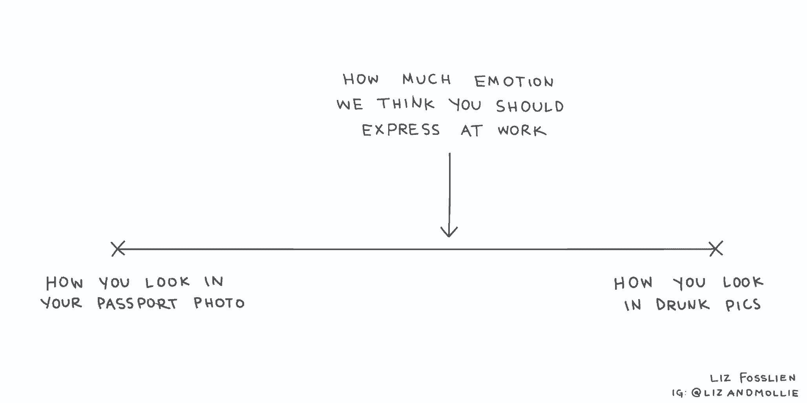
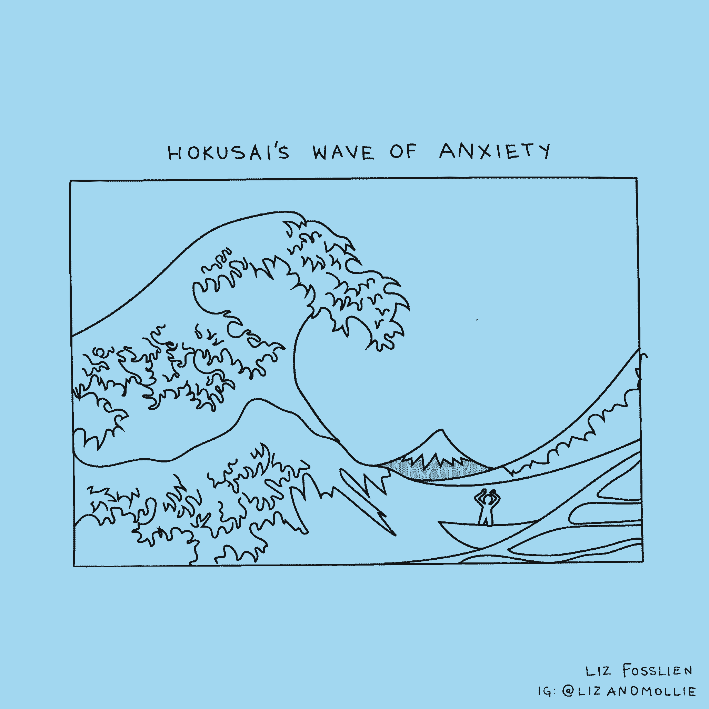
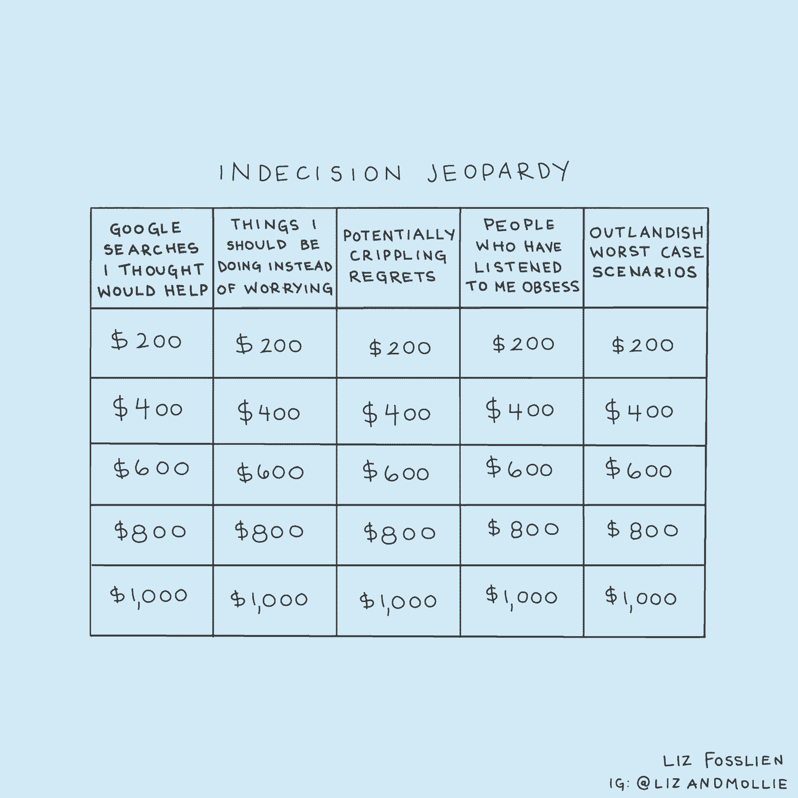
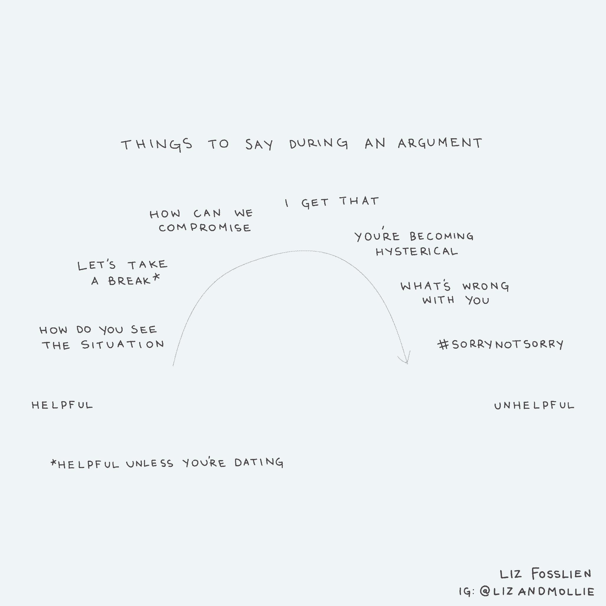
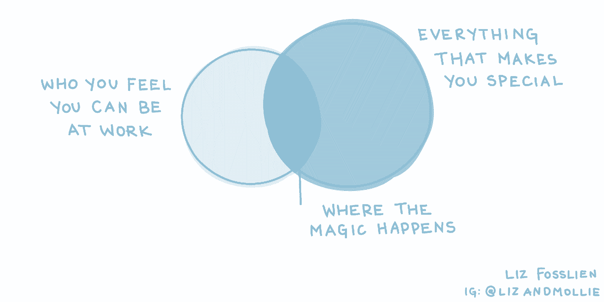
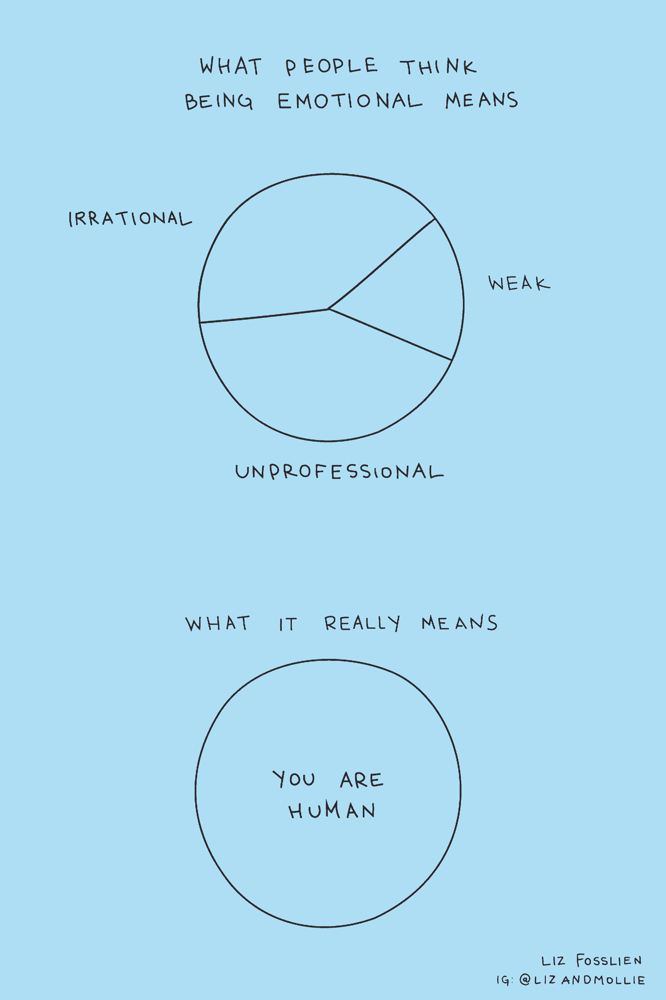

# 这七种情绪不是致命的——它们是你职业生涯中的秘密超能力

> 原文：<https://review.firstround.com/these-seven-emotions-arent-deadly-theyre-your-secret-career-superpowers>

当谈到工作中的感受时，我们大多数人都会相信一系列的神话。尽管情绪在我们的生活中扮演着核心角色，但我们被训练在上班前检查它们。在公开谈论潜伏在初创公司表面下的可怕情绪之前，我们犹豫不决。当谈到[做职业决定时，我们被告知“跟随你的头脑，而不是你的心”。](https://firstround.com/review/the-secrets-to-designing-a-curiosity-driven-career/ "null")

但是在现实中，*忽视*情感的代价是巨大的。“情绪之所以名声如此之差，部分原因是我们长期以来一直试图将情绪排除在工作场所之外。我们压抑我们感觉到的一切，这意味着我们不会在问题还可以控制的时候解决它们。相反，我们的感情溃烂了。这意味着我们在工作场所看到的情绪表达的唯一形式是有人对着一份报告大喊大叫或痛哭流涕——这些都是非常激烈的、徒劳的爆发，”Liz Fosslien 说，他是 **[Humu](https://humu.com/ "null")** 的现任内容主管，也是 [Genius](https://firstround.com/review/Rap-Genius-Explains-Why-Worse-is-Better/ "null") 的前执行编辑。“这助长了一种恶性循环:我们认为，‘情绪是糟糕和可怕的，所以我们应该关闭它们’，这延续了围绕情绪的有害神话。

福斯林是来纠正这种说法的。她的职业轨迹处于经济学和艺术的交汇点，她有独特的定位来提供关于情感和职业生活的微妙视角:她在跳到创业公司之前，从经济咨询开始了她的职业生涯。与此同时，她很会用墨水笔，她是一名出版作家和插图画家，她的作品出现在《纽约时报》和《T21》等地方。

今年，她和她的合著者[莫丽·韦斯特·达菲](https://molliewestduffy.com/ "null")出版了 *[没有痛苦的感觉:拥抱情绪在工作中的秘密力量](https://www.amazon.com/No-Hard-Feelings-Emotions-Succeed/dp/0525533834/ "null")* 。他们的书汇集了来自各行各业的研究人员和高管的建议，从沃顿商学院教授亚当·格兰特到激进坦率的作者金·斯科特。这个建议贯穿着福斯林诙谐、原创的插图——想象一下[一个实际上甚至不能](https://www.instagram.com/p/BrBG94yhHi9/ "null")的小引擎的涂鸦，或者[不同类型的反馈被描绘成 cookie](https://www.instagram.com/p/BsJJ8VzhTDy/ "null")。(当心糖霜曲奇:它“太甜了，最终没有成就感。”总的来说，这本书是一张路线图，帮助员工绕开工作中围绕情绪的误解，并为更健康、更富有同情心的水域设定一条路线。

在 SXSW、Viacom 和 Google 发表过关于工作中的情绪的演讲的 Fosslien 说:“事实是，与你的情绪保持一致会让你总体上更聪明。"意识到情绪，以及它们所包含的信号，可能是一种巨大的力量."

每个人都想把工作做得更好。我们在这里花了很多时间。为什么我们不把它变成一个人们可以做自己的地方，一个其他人也很乐意去的地方呢？

在这次独家采访中，Fosslien 向我们介绍了我们在工作中都会处理(并试图摆脱)的七种情绪:焦虑、嫉妒、不确定性、冲突、螺旋式上升、不归属感和拒绝。她编织了这些情感如何在她的职业生涯中发挥作用的故事，从她作为年轻分析师的焦虑不安的日子，到她作为艺术家、作家和内容负责人的多面职业生涯。从她的书和新的评论中，她提供了一些策略，帮助个人和经理们不仅处理好每种情绪，而且将它们作为职业路标和隐藏的超能力。

# 1.焦虑

当 Fosslien 大学毕业后找到一份咨询工作时，她已经将抑制工作焦虑的需要内化了。“尤其是作为一名第一次进入职场的女性，我试图不辜负这种‘完美职业者’的理想化形象。”她说:“尽管我一直很焦虑，但我觉得有必要保持低调，同意承担更多的工作，并在平静的外表下隐藏我所有的压力和不快。

Fosslien 知道忽视她的焦虑会损害她的健康和个人生活。“像许多开始职业生涯的年轻人一样，我认为成功的关键是在门口检查你的情绪并支付你的费用——这意味着工作、工作、工作。”。

换句话说，佛斯林正在成为她所谓的“工作殉道者”。在压力巨大的工作场所，员工们觉得有必要通过加班和周末加班来证明自己，同时还在默默忍受焦虑及其潜在的副作用。

“工作殉难在节奏激烈的初创企业中尤为普遍。这种强度偶尔真的有用，但你无法持续下去，我认为这就是为什么我们往往会看到这么多的流动，”福斯林说。“创始人也会说‘我们是一家人’之类的话。这种信息传递可以创造凝聚力，但它也给员工带来了不相称的压力，让他们不断付出额外的努力，即使这会损害他们的福祉。"

持续强烈的期望和像“我们是一家人”这样的信息都是设定工作场所的[情绪规范的信号的例子。从初创公司到大公司，不健康的情绪规范不仅会产生焦虑，还会阻碍像年轻的福斯林这样的人承认并克服焦虑。](https://psycnet.apa.org/record/2004-95227-021 "null")

“如果你去找你的经理，试图谈论你的工作经历，而她终止了对话，这是一个明确的信号，”福斯莱恩说。“但是**大多数时候，我们收到的关于情绪和工作场所‘规则’的信号要微妙得多。例如，假设办公室里有人开始哭泣。如果同事和领导的唯一反应是令人不舒服的沉默，那这种尴尬就意味着表露情绪是不对的。”**

我们对看到有人在工作中哭泣这类事情的不适表明我们的情绪不稳定。如果我们继续把情绪当成耻辱而不是现实，我们将永远不会学会如何同情地解决这些情况。

有时候，负面情绪规范甚至会让我们把不健康的焦虑形式正常化。“我曾经和三位女性朋友一起吃饭，其中一位提到，‘工作中一切都很顺利，尽管最近我一直头疼得厉害，好像我的头会突然感觉像着火了一样。’另一个朋友和我表示同情，'啊，这太可怕了。我们有类似的问题。然后我们只是继续随便聊天，直到我的第三个朋友阻止了我们。她吓坏了。那是*不*正常。感觉脑袋着火不应该只是你工作日中可以接受的一部分。“直到我的朋友这么说，我才想起来，”佛斯林说。

尽管不健康的情绪规范可能长期以来强化了压抑的焦虑和工作殉难，但 Fosslien 表示，个人和经理可以绕开(并抵制)现状。方法如下:

**重构“足够好”**

Fosslien 分享了她书中的以下故事，讲述了她如何能够对自己的成就树立一个现实的视角:“最近我正在组织一个活动，我感到不知所措。注意到我听起来很紧张，一位与会者，一位职业教练，问我，“你什么时候会知道你已经做得够多了？”答案似乎很明显:“当我觉得事情进展顺利时。”她笑了。你认为你能控制多少事件？我打赌不到 30%。“如果演讲者生病了，或者宴会承办人没来，或者在计划的露天午餐期间雨下得很大怎么办？”**足够必须是一个你能控制的标准。例如，“到周末，我会把程序设计发给印刷商。"**

“足够”不可能是“当我感觉良好的时候”，因为感觉良好是一个移动的目标。

**把焦虑从你的头脑中赶走——把它写在纸上**

坐下来，花 15 分钟列出所有让你感到压力的事情。然后，对你的压力源进行分类。“有‘内在’和‘超越’。”她说:“内在是你可以采取行动的问题。它们可以被分解成微小的步骤。说你担心一个演示。如果你认为“我需要为我的演讲制作幻灯片”，你会感到更有压力。相反，你可以说，‘今天，我将制作前两张幻灯片。一系列的小胜利会让你更有动力。"

但是对于讨厌的“超越”，你无法解决的压力源，该怎么办呢？“不幸的是，你不能解雇一个糟糕的老板。但是你可以找到方法限制你和老板的互动，”她说。福斯伦分享了一个来自[鲍勃·萨顿](https://www.linkedin.com/in/bobsutton1/ "null")的*T5【无屁眼规则】的故事，讲的是一名博士生每天都会收到导师接二连三的邮件。这位学生决定等到所有的邮件都来了，再写一封邮件回复所有的邮件，而不是一封接一封地去回复。“这是她控制洪水的小而有效的方法，”佛斯林说。*

**把焦虑作为塑造你未来的信号**

“当你被焦虑分散注意力时，你就有可能会精疲力竭。你无法思考如何熬过下一周，你也不太可能对未来有远大的梦想，因为你只是一个人的躯壳，”福斯林说。与其让焦虑遮蔽你的灵感，不如用它来打造前进的道路。

Fosslien 说:“密切关注你不那么焦虑的时刻。“如果你的工作日中有一部分或一个项目是你一直期待的，无论是在电子表格中还是在起草新闻稿中，都要写下来。”

注意那些带给你轻松的时刻。他们是远离焦虑的路上的灯笼。

然后，开始[与你的经理](https://firstround.com/review/three-powerful-conversations-managers-must-have-to-develop-their-people/ "null")进行建设性的对话，并带上你的资料。“指出给你能量的任务，”佛斯林说。“告诉你的经理，'**我认为这些是我的强项。我该如何转移我的职责，做更多有利于我优势的工作？**’”

对于那些处于职业生涯早期的人来说，着眼于未来的职业目标来管理自己的焦虑尤为重要。Fosslien 有这个建议与年轻人和焦虑者分享:“证明你自己，但不要忘记倾听自己。人们成为工作殉道者的部分原因是，我们被告知要找到自己热爱的工作，并为此付出 110%的努力。但是如果你还年轻，很难马上知道你对什么有热情。**你的第一份工作应该是证明你自己，就像证明你自己一样** ***了解*** **自己，更好地了解自己的优势，以及如何在自己喜欢的领域证明自己**。”

# 2.羡慕

由于嫉妒通常被认为是一种负面情绪(它甚至在另一个臭名昭著的列表中名列前七)，每当它有燃烧的危险时，我们大多数人都试图将其扑灭。“嫉妒是一种耻辱，尤其是在女性中，因为人们通常认为女性‘狡猾’因此，我们经常进行心理体操来说服自己不嫉妒。不过，如果你花时间观察你的嫉妒，它会告诉你很多你想要什么。"

福斯林分享了[格雷琴·鲁宾](https://gretchenrubin.com/ "null")的故事，她是研究员、播客主持人，也是《T2》[、《幸福计划》](https://gretchenrubin.com/books/the-happiness-project/buy-the-book/ "null")、*、[《四种倾向》](https://gretchenrubin.com/books/the-four-tendencies/buy-the-book/ "null")* 的作者。当鲁宾享受着成功的律师生涯时，她注意到她的嫉妒把她引向了其他地方:当她读到关于有成就的律师的故事时，她感觉很好，但并不伟大。但是当她读到有成就的作家时，她嫉妒得身体不适。她的嫉妒暗示了她最想要的东西。Fosslien 说:“这是一个线索，表明她需要把自己的事业推向那个方向。

由于 Fosslien 在早期作为顾问的挣扎，她经历了对别人幸福的嫉妒。“我记得我非常嫉妒那些乐于去工作的人，他们似乎对自己的工作感到兴奋。我没有那种感觉，我怀疑如果我留在那里，我也不会有那种感觉，”她说。她的绿眼怪物是她去别的地方的绿灯。

**拉近羡慕与现实的距离**

Fosslien 推荐了一个练习来让你适应自己的嫉妒心理:“审视你的人际网络。想想四个人的职业生涯，然后问问自己:*我最羡慕*谁的职业生涯？”她说。“分解他们的职业道路:为了让自己更接近你羡慕的目标，你可以采取的第一步是什么？”

当你被职业嫉妒击倒时，不要把它推倒——观察它。那个人有什么是你希望自己拥有的？在这个方向上，你能采取什么措施来成为一个让你嫉妒的自己呢？

# 3.不确定

随着她对工作的焦虑达到新高，她的嫉妒将她带到了其他地方，Fosslien 根据自己的情绪采取了行动:她辞去了顾问工作，没有其他前景。同时，为了收支平衡，她在星巴克工作。

“我需要按下重启键，”她说。“我不一定建议在没有其他演出的情况下辞职；这很难，也很可怕，在你还在工作的时候找一份不同的工作总是更好。我很幸运，我攒了一些钱，所以我可以不做计划就离开，”她说。“在星巴克工作期间，我最终学到了很多关于设计和建立客户关系的知识。再次重申，**我不建议冲动地辞职，尽管我确实认为人们应该敢于开始寻找离开一份确实不合适的工作，并寻找其他学习机会**。

如果有一个角色让你感到兴奋和好奇，但你还不知道它如何“适合”你的职业道路，那就去做吧。尤其是在你职业生涯的早期，拥抱那些还没有意义的飞跃。

即便如此，恐惧和不确定性仍然是佛斯林这段旅程中不受欢迎的伙伴。她不能确定自己做的是对的还是最好的，或者她的下一步会是什么样子。

在面试她的下一步行动并获得 Genius 的邀请后，Fosslien 再次感到不确定性的力量。“当时，Genius 还是一家年轻的初创公司。她说:“在一切都不可预测的情况下加入，将需要[巨大的信念飞跃。“我无法决定是否要接受这个提议。起初，我试图对此保持真正的理性。”](https://firstround.com/review/navigating-the-leap-from-big-tech-to-startups-advice-from-a-former-google-and-flipkart-exec/ "null")

对于自称是经济学呆子的福斯林来说，逻辑似乎是显而易见的首选武器。(她的学术背景是数理经济学，她承认[阅读摘要是为了好玩](https://www.nationalaffairs.com/blog/findings-a-daily-roundup "null")。)但是，尽管她试图用分析经济学家的视角来看待这个问题，她的计算还是不断地被情绪这一意想不到的变量所阻碍。“理论上，还不清楚这对我来说是不是一个好的举措，”Fosslien 说。”**但是当我真正思考这个问题的时候，** ***而不是*** **接受这个提议的想法让我充满了遗憾。我认为这个产品很吸引人。人们很聪明。他们订婚的方式和我当顾问时不一样。”**

当她仔细审视自己的情绪时，她注意到自己的兴奋中夹杂着焦虑。“我意识到焦虑并非来自外部压力，比如对初创公司不可预测性的担忧。它来自于我，担心我是否能承担这个责任——这是一种你可以克服的焦虑。我回答了我的焦虑，说:“我已经足够好了。”我接受了这份工作。"

**用决策清单来澄清不确定性**

在他们的书中，Fosslien 和 Duffy 提供了一个清单来帮助增加不确定性的结构:

**写下你的选择。如果你只写了两件事，花点时间看看你是否能介绍一个额外的选择。选择通常不是二元的。当你把你的决定限制在是或否，或 A 或 B，你的赌注比实际可能的要高得多。所以，如果你已经列出了“留在我目前的工作岗位”和“接受新工作”，考虑一下你是否可以通过添加类似“留在我目前的工作岗位并要求升职”的内容来拓宽你的菜单。**

列出你感觉到的一切，并将剩余的相关情绪与具体选项联系起来。你烦吗？害怕？渴望咖啡因？注意一种感觉是否与一个选择有关。当你想象自己选择选项 A 时，你最兴奋吗？你害怕你会后悔选择了选项 B 吗？

**问什么，不问为什么。**比较“你为什么害怕？”到“你怕什么？”你可以用一句自怜的陈词滥调来轻松回答第一个问题(“因为我从来不尝试新事物”)，但第二个问题会迫使你说出自己对即将做出的决定的具体感受。

# 4.冲突

我们大多数人都有过这样的日子:你和你的经理就是无法达成一致。你和你的团队在角力。当工作中的冲突似乎无法解决，负面情绪沸腾时，你可能会认为你唯一的选择是立即辞职，并在离开时摔门而去。但是不要愤怒，现在就退出——还有另一种方法。

“在激烈的创业环境中，我们通常不会放慢脚步，在关系上花时间，所以冲突被放大了，”她说。“如果我们花时间建立关系，更好地了解彼此的工作风格，我们可以避免很多误解和悲伤。”

如果你的初创公司的任务是发展壮大，让你的产品尽可能做到最好，你为什么不把同样的紧迫感投入到良好的工作关系中呢？

**直面冲突，不放火**

你不应该压抑或忽视你的情绪，但你也不想成为一个感情的救火队员。“当涉及到[面对冲突](https://firstround.com/review/these-13-exercises-will-prepare-you-for-works-toughest-situations/ "null")的时候，启动设置是最不稳定的，”Fosslien 说。“在你打破对话之前，确保愤怒的余烬已经熄灭了一些。”

Fosslien 对谈论你的情绪和情绪化做了重要的区分。她分享了使用语言(和其他策略)解决工作冲突的最佳原则:

进行观察，而不是归纳。在一次会议上，一位同事打断了你。“你可以说，‘嘿，你很粗鲁’，但这将被理解为对他们人格的攻击，”福斯莱恩说。“相反，要具体而有建设性:‘在那次会议上，你打断了我。这让我觉得自己不是团队中有价值的一员。如果下次你让我说完，我会很感激的。从批评中有一条前进的道路。"

**走一走，然后在**往回走。“我和合著者莫丽讨厌‘永远不要带着怒气上床’这个建议。”生气睡觉！“消极情绪，比如嫉妒或沮丧，会扭曲你对现实的看法，”福斯林说。如果你知道你将会有一次艰难的谈话，那么提前走五分钟。你可能认为自己太忙了，但是这些时间并不会成就或毁掉你的公司——然而，公开爆发可能会产生深远的影响。"

**对经理们来说:冻结愤怒——在其轨道上辞职**

当佛斯林采访作家兼沃顿组织心理学家亚当·格兰特时，他向她暗示了愤怒的潜在根源——辞职。虽然格兰特在领导力方面的作品很多，但他被问得最多的问题是关于*的追随者*。

“人们经常问他，‘我怎样才能让我的经理听到我的声音？’”福斯林说。她说:“我认为这就是‘愤怒辞职’的由来:人们在一个项目中无所事事，向他们的上级提出问题，但没有被认真对待。

最好的经理会问问题并邀请具体的、有意义的反馈。问你的直接下属:“我能做些什么来改进？或者“我能为你清除路障吗？”她说。最后，如果你要求反馈，就坚持到底。”“如果你的直接下属给你反馈，然后得到的回报是沉默，他们就再也不会给你反馈了，”福斯林说。Fosslien 说:“表明你会对反馈采取行动是创造一种文化的最佳方式，在这种文化中，人们会感到直言不讳是有价值的，而不是像他们唯一的选择是对你发火并离开。

# 5.盘旋的

有时，负面情绪开始时是微小的、无关紧要的刺激。然而，如果不加以控制，它们会恶化并感染人际关系。Fosslien 称之为“grump 螺旋”——不幸的是，它们具有传染性。

“如果你发现自己在想这些极端的词，比如*总是，从不，灾难*，这通常表明你陷入了消极的思想漩涡，让你把情况搞得不可收拾，”她说。

在它变成把你拉向水下的漩涡之前，识别一个坏脾气的螺旋是个好主意。“在你犯了一个错误之后——比如说，你在群发邮件中发送了一个错误——不要想，‘我总是把事情搞砸，我是一个可怕的人。’相反，你可以说，“下次我会更加小心，并以此为契机，展示未来的进步。”。"

在他们的书中，Fosslien 和 Duffy 创建了一个逐步指导你从螺旋中解脱出来的指南，使用了当你的一个团队成员在截止日期前建议一个大的改变时该怎么做的例子

注意困难的情绪。不要恼怒地对你的同事发火，停下来观察一下这种感觉。

**给每种情绪贴上标签。**描述复杂感情的能力，区分牛逼与开心、满足、激动的能力，被称为情感粒度。情绪粒度与更好的情绪调节和更低的压力下产生报复心理的可能性有关。有了团队项目的情感粒度，您将能够意识到“我感到恼火”的真正意思是“我担心我们没有时间做出这些改变。”

**了解每种情绪背后的需求。**一旦你给每种情绪贴上标签，转换你的视角，明确说出你想要的感觉。问问你自己“我*想要*感受什么？”如果你想感到平静而不是焦虑，想清楚你需要做什么来成功放松。这可能会确保稳定性:您希望项目保持在正轨上。

**表达你的需求。不要说，“我对这种在最后一刻做出改变的要求感到恼火。”试着说，“你的编辑很好，但是因为我们已经到了最后期限，稳定性和可预测性很重要。我们有时间做什么编辑？我们如何才能做到这一点？”**

**填满你的微笑文件**

Fosslien 说:“阻止恶性循环的一个好方法是加载我称之为微笑文件的东西。一次有趣的轻松对话的截图，同事的赞扬，你工作成功的记录——所有这些安慰和认可的证据都属于你的微笑档案，每当你需要把自己从沮丧的螺旋中拉出来时，你都可以浏览一下。

**对于经理:在会议前练习情绪检查**

“当我们在写这本书的时候，Mollie 和我与领导力顾问 Anese Cavanaugh 进行了交谈，并在会议上采纳了这个微行动:让你的团队用 0 到 10 的尺度对他们的情绪进行评分。她说:“如果有人得分低于 5，问一些试探性的问题，看看你能做些什么来提高这个数字。”“他是否因为需要回复一封电子邮件而感到压力？让他写完邮件再回来，希望不要那么激动。”

# 6.不属于

“现在有很多关于[让我们的多元化和包容性少说话多走路的讨论](https://firstround.com/review/eight-ways-to-make-your-dandi-efforts-less-talk-and-more-walk/ "null")。归属感是实现这一目标的关键因素。领导者能做些什么来帮助人们感受到被重视？感觉他们可以在工作场所畅所欲言？”福斯林说。

当 Fosslien 开始在 Humu 工作时，她注意到创始人们关注公司环境对归属感文化的影响。“我很佩服虎木的一点是，我们只有 40 名员工，但我们已经有了专用的妈妈室。这传达了一个强烈的、包容的信息，”她说。

永远不要低估塑造公司文化的小决策的力量。无论你有一个专用的母亲房间，还是一个尊重不同信仰的节日政策——或者如果你两者都没有——它都发出了一个强烈的信号，表明你的创业公司重视什么。

即使你是一家拥有四名员工的初创企业，做出塑造企业文化的有意决策也永远不会太早。Fosslien 说:“文化上的小选择会投下长长的影子。“寻找机会将你可能还没有用到的政策落实到位，但这些政策为你想要建立的公司铺平了道路。”

虽然像公司文化这样的概念可能看起来很模糊，很容易被忽视，但员工是否有归属感对底线有着具体的影响。“当我们为这本书做研究时，我们发现一项研究分析了新员工在电子邮件中使用的语言，”Fosslien 说。“研究表明，在工作的前六个月里没有把‘我’换成‘我们’的新员工更有可能离开。”

**对于经理:下划线归属**

她说:“我喜欢亚当·格兰特(Adam Grant)让受访者了解企业文化的策略:求职者可以问，‘告诉我一个只会在这里发生的事情的故事’’。“对于应聘者来说，这是一个巧妙的技巧，但当你是一名经理，因而也是公司文化的仲裁者时，你也应该问自己这个问题。你的公司有什么故事？它是否让人们感到被包容和被倾听？想想这些潜在的答案暗示了你的初创企业的归属感文化。”

Fosslien 也为拥有**归属干预**提供了理由。“这是一些简短的会议，在新工作开始时，经理会对新员工说，‘嘿，开始一份新工作很难。对大多数人来说，这是一个可怕而不确定的过程。你不是一个人，你会没事的。"

Humu 的首席执行官[拉兹洛·博克](https://www.linkedin.com/in/laszlobock/ "null")在 Fosslien 刚加入公司时也进行了类似的干预。“他会见了上个月开始工作的四个人，并告诉我们，‘任何工作的头几个月通常都需要接受很多，但你可以感到自信。问问题，了解每个人，如果你在第二周仍然觉得还有很多东西要学，不要焦虑。你被雇用是有原因的，我们很高兴你在这里。"

# 7.拒绝

2014 年，Fosslien 开始从事兼职工作，以激发她的创造力:她的一些草图和收集的职业智慧最终成为她的畅销书*No Hard senses*。

作为一个过去从事过创造性工作的人，Fosslien 对即将到来的被拒绝的恐惧并不陌生。怀疑的乌云不仅威胁到你引以为豪的工作，也威胁到你的成就感。当拒绝真的出现时，尤其是当它颠覆了你非常在乎的东西时，你很难从打击中恢复过来。

但是想想拒绝的另一面:“当你迈出这一步时，你会有一种强烈的情绪。福斯林说:“不要让拒绝的恐惧阻碍你，而是让可能性激励你。”

她提供了一些策略，帮助你摆脱恐惧的羁绊，拥抱让自己脱颖而出的承诺。

**把自己定位成一个人**

作为一种开始建立联系 *和*并宣传她的工作的低风险方式，佛斯林给三位她钦佩的经济博主发了电子邮件。“我以关注他们工作并对经济学感兴趣的人的身份接近他们。他们最终转发了我的插图，”她说。最终，她的一个项目，[一个经济学家说我爱你的 14 种方式](http://fosslien.com/heart/ "null")，在包括*金融时报*和*经济学家*在内的出版物中传播。

“不要害怕通过电子邮件坦诚表达你的爱慕之情，”她说。“打开话题，说‘我出于 X、Y 和 Z 的原因喜欢你的工作。我做了一件你可能会喜欢的事。“如果你喜欢它或者想转发它，我会很高兴的，”福斯林说。“就是这样。以人性化的方式推销自己，你会发现人们通常会对这种真实性做出回应。

我给自己的建议是:发邮件就好。不要想多了。最好的情况是它为你打开了一扇神奇的门。可能发生的最糟糕的事情就是什么都没发生。

**分享你正在进行的作品**

如果你在做一个个人项目，你不需要独自辛苦工作，几年后带着你的杰作出现。分享你的草图和涂鸦。

Fosslien 说:“无论你是在做兼职还是组装投资组合，都要把最小的一部分产出放到网上的某个地方。“甚至用博客或照片以低调的方式记录这个过程。”

留下你的创造性工作的工件的好处是双重的:“首先，你得到了你自己头脑之外的项目，所以你可以更客观地处理它。第二，你有可以与他人分享的物证，”福斯林说。“当我在写这本书的时候，我有时会给我的搭档看一些未完成的插图，这既是为了得到他的反馈，也是为了在图画让他发笑时增加一点动力。”

# 将所有这些联系在一起:在工作中驾驭这七种超能力

是时候打破永远冷静沉着的专业人士的神话了。“我们在工作中会有感情。这只是人类的一部分，并没有什么不对，”佛斯莱恩说。“问题是，我们被训练成认为感受所有这些事情是不好的。你认为你需要*压抑，压抑，压抑*——但是你从来没有让情绪自己表现出来。**管理你情绪的关键不是忽视它们，而是倾听它们，当你需要的时候** **[练习情绪自理](https://firstround.com/review/our-6-must-reads-to-make-self-care-your-competitive-advantage/ "null")** **。**”

最后，当焦虑和嫉妒之类的情绪出现时，记住它们并不像看起来那样没有效率。“我们进化出了情感。其中许多是有用的线索。事实证明，我们的情感有时比纯粹的逻辑更能告诉我们想要什么。挖掘他们的优势最终会让我们成为更好的员工和更快乐的人。”

*摄影由* *[邦妮·雷伊·米尔斯](http://www.bonnieraemillsphoto.com/ "null")* *。插图由* *[丽兹·佛斯莱恩](https://www.instagram.com/lizandmollie/?hl=en. "null")*提供。