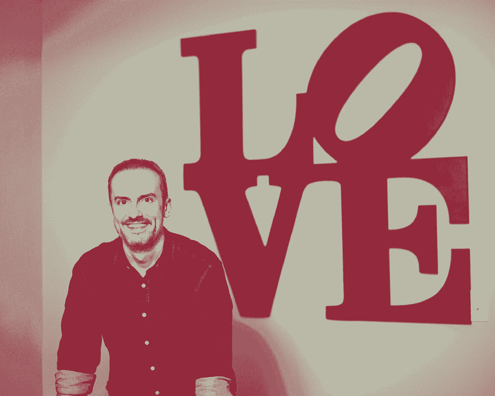

# 这位创始人在 2008 年、2016 年和 2018 年建立了初创公司。以下是他对弹性的了解

> 原文：<https://review.firstround.com/this-founder-built-startups-in-2008-2016-and-2018-heres-what-hes-learned-about-resiliency>

## 介绍

回到 2008 年 9 月的一个雨天， **[鲍勃·摩尔](https://twitter.com/robertjmoore "null")** 纵身一跃。他和他的同事[杰克·斯坦](https://www.linkedin.com/in/jakestein/ "null")辞去了日常工作，创办了一家数据分析领域的新公司 [RJMetrics](https://en.wikipedia.org/wiki/RJMetrics "null") 。虽然他们的前景似乎很光明，但他们的时机本可以更好——三天后，雷曼兄弟倒闭了。

他们的初创公司踏上了一段几乎一切都与之背道而驰的旅程:缺乏经验的首次创业者、令人崩溃的经济环境以及对行业发展方向的巨大押注。这条道路曲折而充满挑战，但到了 2016 年，两人已经积累了数百名客户，RJMetrics 被 Magento 收购。

“但就退场而言，这更像是一记安打，而不是本垒打，”摩尔说。“我们从 RJMetrics 学到的最有价值的东西是如何努力战斗的肌肉，以及从动荡的环境中幸存下来的痛苦教训——只是后来输掉了这场漫长的比赛。以我们的老竞争对手 [Looker 为例，它去年夏天被谷歌](https://techcrunch.com/2019/06/06/google-to-acquire-analytics-startup-looker-for-2-6-billion/ "null")以 26 亿美元收购。他们吃了我们的午餐，尽管我们领先了四年。”(关于他们在与 Looker 的斗争中走向何方的更多事实细节，请查看摩尔几个月前的精彩事后分析。)

摩尔发誓不会再犯这样的错误。凭借更敏锐的眼光和近十年的经验，他和斯坦利用他们在收购 RJMetrics 时保留的技术，剥离了他们的第二家公司 [Stitch](https://www.stitchdata.com/ "null") 。在短短两年内，当他们在 2018 年出售给 Talend(只有 30 名员工，没有外部资金)时，他们获得了好得多的结果。现在，摩尔开始了他的第三次冒险——他正在努力争取。他目前的初创公司 **[横梁](https://www.crossbeam.com/about/ "null")** ，是一个旨在通过数据驱动的协作帮助公司建立更有价值的合作伙伴关系的平台。在行业顺风和近 1600 万美元资金的支持下，他和他的团队似乎还有很长的路要走。

虽然第一轮投资可以追溯到横梁的早期(巧合的是，旁观者也是)，但这并不是我们急于在评论中与摩尔交谈的原因。他拥有多家初创公司，是一名经验丰富的公司创始人——在一些动荡时期，他首次成为创始人。

“在我的第一家创业公司，我们挺过了 2008 年的低迷期，实现了退出，这是当时许多创业公司无法做到的。但我太专注于这种“拼命努力”的心态，以至于当推动增长的时候，我过度关注了这种心态——我们被竞争超过了。**建立一家生存下来的公司和一家蓬勃发展的公司是有区别的，我花了太长时间才调整到该转变的时候**，”摩尔说。“现在看来，钟摆又摆回了一个[撕裂美好时光](https://www.sequoiacap.com/article/rip-good-times "null")的心态。建立一家有弹性的公司可能会重新流行起来，但这一次我不会忽视随之而来的好处。”

在这次独家采访中，摩尔讲述了他在 12 年多的创业经历中所学到的东西，从熊市和牛市中的建立，到避免“meh”退出，以及应对产品/市场适应性的变化无常。摩尔比较了他在多个创业公司的经历，总结出七条经验教训——他希望有人能在他第一次创业时与他分享这些经验。

# 1.一个强有力的长期愿景将帮助你度过间歇性的风暴。

首先，摩尔强调，再多的敏捷性也无法取代强大的公司愿景。“好的愿景意味着你有很强的首要原则。产品可以进化。团队可以改变。市场可能会跌入市中心。但如果你坚持不懈地追求一个完美的愿景，你就能经受住大多数风暴，”他说。“拥有清晰的愿景和没有清晰的愿景而得过且过的区别将会改变你公司的轨迹——我经历过这两种情况。”

RJMetrics 是后者的一个例子。“当我们开始时，我们可以看到一个充满机会的领域，但我们实际上并没有清晰的愿景，不知道我们要构建什么以及为什么会成功。我们只有一个词——数据，而我们“愿景”的其余部分可能会根据我们最近从销售线索或客户那里听到的信息而发生扭曲。强烈的愿景本可以成为我们的支柱，但我们就是没有。“这不是建立一个定义类别的公司的方法，”他说。因为我们没有一个可靠的战略，我们追求所有这些产品微优化，并让我们自己处于这样一个位置:我们创建了一家公司，为*一些*人创造*一些*价值。我们的[增长停留在当地的最大值](https://firstround.com/review/from-zero-to-ipo-how-growth-needs-to-evolve-at-every-startup-stage/ "null")。"

史迪奇是一个不同的故事。摩尔说，在他和斯坦的第二家公司(获得更好退出机会的那家)，他们从第一天起就有了愿景。“当我们开始行动时，我们的愿景已经完全实现了。我们说，是的，有一个问题空间，但更重要的是，我们对如何解决问题有一个非常具体的观点。他说:“这不仅仅是因为人们感受到了数据分散的痛苦，而是因为我们实际上有一个符合当时市场动态的解决方案，特别是像亚马逊红移、谷歌大查询和雪花这样的大规模可扩展数据仓库是如何出现的。”。

“简单明了，这是你需要确定的公式:**这是我们在这里要做的事情，这是为什么我们在做这件非常具体的事情上是最好的，这是现在做这件事情的合适时机**。我们现在在我目前的创业公司 Crossbeam 也看到了这一点。我们创办这家公司时，有一个非常具体的愿景，那就是当这个数据协作问题以尽可能最好的方式得到解决时，世界应该是什么样子，而不是像“合作是一种痛苦，让我们去解决它”这样的泛泛之谈"

我们要做什么？背后有什么我们独特的眼光？这是建立一家有弹性的风险投资公司的先决条件。即使在最好的市场有最好的团队，如果没有这些因素，你也会遇到瓶颈。

Bob Moore, CEO and co-founder of Crossbeam

# 2.产品/市场匹配并不意味着你是清白的。

快速适应产品/市场通常被视为创业公司的灵丹妙药，但摩尔已经认识到，仅仅找到它是不够的，你还必须保持它。"**闭上眼睛，抓住自己的产品/市场不放，你无法在低迷时期生存下来。他说:“市场的变化使得开车时保持警惕变得更加重要。**

这就是摩尔在 RJMetrics 遇到的陷阱。"**人们经常谈论产品/市场契合度，就好像这是一个你可以解锁的视频游戏级别，然后就一帆风顺了**。这是包括我在内的许多创始人都犯过的错误。当我们在 2008 年开始 RJMetrics 时，我想说我们走在了市场的前面。SaaS 还只是一个小东西，没有人在做我们正在做的事情。摩尔说:“我们迭代了四年，吸纳早期采用者，建立了一个不错的小型自举业务。

“然后突然之间，市场赶上了我们产品的位置。这就是我们有一个疯狂的产品/市场契合期的时候。2011 年到 2013 年，我们跟不上。引线从桌子上掉了下来。我们招聘销售代表的速度不够快。这几乎无法解释。我们在增长和规模上呈爆炸式增长，所以看起来一切都在正轨上。但在那段时间里，我们几乎没有改变产品。我们变得不灵活。市场在变化，但我们的产品却没有。所以到了 2015 年或者 2016 年，市场已经走在我们前面了，只是我们没有看到。我们继续执行——却落后了。”

产品/市场契合度不是你挂在公司墙上的文凭。这是一个你必须不断监控的移动目标。从我这里拿走吧——你能找到它，却只能眼睁睁地看着它从你的指缝中溜走。

更形象地说:“**产品/市场契合度是你打造的产品与市场在任何给定时间所处位置之间的差距。画一张图表，X 轴是时间，Y 轴是进度。你的产品和市场是两条不同的线，斜率随着时间的推移而变化。在 RJMetrics，他们在这个美丽的时刻相交，这使我们能够建立很多价值。但后来我们失去了它。如果你坚持的时间足够长，而不改变产品的斜率来跟上市场，它们只会越来越远。”**

# 3.寻找你最大的竞争威胁？跟随信号，而不是噪音。

虽然了解你的竞争格局很重要，但摩尔逐渐认识到，如果你担心自己迷失了方向，那么再次检查公司的发展道路并调整方向远没有那么重要。他说,**建立弹性的最好方法是不断对你自己的假设进行压力测试。**

这可能是一个令人惊讶的收获——毕竟，鉴于历史，你可以原谅摩尔这些天对竞争对手格外警惕。但在他看来，RJMetrics 没有被 Looker 超越，因为他们没有对自己的竞争格局给予足够的关注——他们给予了太多的关注。“当 2013 年《潜行》推出《旁观者》[时，我们甚至不认为他们是我们的竞争对手。但是六年过去了，我和我的联合创始人都在为](https://techcrunch.com/2013/03/06/looker-takes-2m-from-first-round-and-pivotnorth-to-build-a-sequel-to-sql-for-business-intelligence/ "null")[如何赢得这么大的](https://firstround.com/review/the-inside-story-of-how-this-startup-turned-a-216-word-pitch-email-into-a-2-6-billion-acquisition/ "null")而挠头，我们错过了机会，”摩尔说。

“我们花了太多时间转动轮子，观察吵闹的首席执行官和大公司。我们总是密切关注下一个威胁我们市场地位的 Y Combinator 新贵。但归根结底，我们最大的竞争来自一群谦虚、勤奋的经营者，他们的经验让他们有了更敏锐的眼光，”他说。“对于 Twitter 上所有年轻的偶像破坏者来说，有同样数量的沉默专家构成了更可信的威胁。这些创始人最终获得了我们行业的金牌，而我们只获得了铜牌，”摩尔说。

他们最终登上那个低领奖台的原因？“在 2008 年，我们在执行我们认为是好主意的事情上过于低调，以至于在接下来的八年里，我们脚下的土地发生了变化。他说:“这是一种全新的解决问题的方法。“我担心 GoodData 和 Domo 这样的公司，它们基本上在做和我们一样的事情。我们没有意识到的是，Looker 以同样的价值定位服务于同样的受众，采用了更具吸引力的产品方法。当他们忙于发明汽车时，我们制造了众所周知的‘快马’

我不担心竞争，我担心自己的眼光错了，这就给竞争创造了成功的机会。如果有什么不同的话，我认为我们花了太多的精力考虑其他人制造的噪音，而没有足够的时间考虑我们自己在真实市场中的位置。

“为了变得更有策略，我发现利用紧张的能量并将其引导到更有成效的事情上是有帮助的，”他说。“例如，后来在 RJMetrics 的时间表中，我们开始问自己一个简单的问题:**如果明天发布，最让我们害怕的新产品是什么？**我们的答案是能够将接管市场的所有这些新的云数据仓库与像 Looker 这样的新兴工具联系起来，为分析提供更好的用户体验。这种产品将是价值链中缺失的一环，它将彻底消除中介矩阵。RJMetrics 的一个小团队没有坐等它出现并完成 Looker 开始的工作，而是将其作为一个黑客马拉松项目来构建。该产品最终成为 Stitch，在 RJMetrics 被收购后，我们成功地将其分拆出来，并建立了一个独立的公司。"

有韧性的创始人不要问“我们害怕哪个竞争对手？”相反，它是“无论存在与否，哪家完全成型的公司会对我们构成生存威胁？如果它不存在，我们为什么不建造它？”

# 4.弹性始于高层——这不是创始人可以外包的。

在 RJMetrics 寻找愿景、外部条件和产品/市场匹配的艰难过程中，摩尔依靠了他认为明智的创业智慧:不要单干。他将注意力转向招聘高管，以帮助充实领导团队。

“我们花了两个销售副总裁的时间，才发现是产品问题——而不是销售毅力或走向市场的执行力——阻碍了我们的发展。因此，我们着眼于寻找完美的产品副总裁来解决我们的产品困境。他说:“经过一个月又一个月的招聘、入职和测试，结果发现产品的问题根源在于公司的愿景。“我们又回到了起点。我希望我们把所有浪费在招聘上的精力都花在我们愿景的基础上，这样那些优秀的人就能有更好的产品来生产和销售。”

委派和免除自己的责任是有区别的。不要让这位新面孔高管成为你的拐杖，导致你忽视作为创始人和首席执行官的责任。

“作为创始人或首席执行官，你不能对业务的关键方面视而不见。如果你认为有人会出现并神奇地修复你的功能问题，那你就真的处于非常非常危险的境地了。当你寄希望于某个人来解决这个问题时，你所做的就是在推卸你帮助解决这个问题的责任，并消除你作为首席执行官的所有机构知识。这是一个巨大的错误。”

例如，如果你是一个技术型创始人[并带来了你的第一个营销人员](https://firstround.com/review/so-you-think-youre-ready-to-hire-a-marketer-read-this-first/ "null")，不要因为你雇佣了有经验的人就撒手不管。“即使你不知道如何执行营销活动，你也不知道在线广告购买的所有缩写，你也不知道什么好看，你还没有摆脱困境。你仍然需要围绕他们将交付的东西、激励他们的文化以及让他们负责的可信度建立期望。摩尔说:“你不可能远距离完成所有这些工作，尤其是对于一个小团队来说。

做创始人最难的部分是不可能外包的。投资者和高级雇员不是你艰难决策的垃圾场。没人会来救你。

Bob Moore, in Crossbeam's Philly office

# 5.重新思考你的远程工作方式。

由于摩尔的[把他所有的公司都建在了硅谷之外](https://blog.crossbeam.com/vc-arbitrage "null")，你可能会认为他肯定会呆在远程工作营。但事实并非总是如此。“我的第一份工作是在金融业，在那里，facetime 就是一切。这在我的工作习惯中根深蒂固，所以在我作为创始人的早期职业生涯中，我要求每个人都在办公室，”摩尔说。“**但我也有过多年租赁一个比我们公司还久的办公空间的经历**，所以随着时间的推移，我的心态发生了巨大的变化。”

摩尔指出，2020 年的基于云的工具比他创办第一家公司时领先了好几光年。“就在五年前，人们还普遍认为，要么你远离办公室，要么你注定要失败。随着新一代协作工具和现代员工心态的转变，这种情况正在发生变化。他说:“横梁是一个‘远程友好’的混合体，既能为本地员工提供办公空间，也有大量远程员工。

摩尔说，随着像新冠肺炎爆发这样不可预测的全球事件的发生，远程友好和远程优先工作场所的趋势只会继续下去。“它增加了您公司的弹性—无论是经济低迷、办公空间问题还是紧张的旅行日程。当我们在横梁之旅的早期更换办公室时，我们要求每个人在家工作一周，并面临最小的中断。或者当我们把我们的团队派到世界各地参加会议时，我们知道工作仍然会完成，因为他们已经有了远程友好的工作习惯。物理位置不会给任何人造成效率差距，这是设计使然。”

让这项工作全年都有效的关键是全力以赴，即使你的一些团队成员回到办公室。这里有一个 Moore 的远程友好剧本，旨在扩大规模，但适用于两个人的团队:

默认情况下，每个会议都需要缩放链接，不能假设您的与会者会亲自出席，即使他们经常和您在同一个办公室。实际上，露面不需要道歉或解释。

让您的远程团队成员成为一等公民。如果一项福利、津贴或经历是为你的办公室团队成员创造的，想办法为那些不在办公室的人创造同等的机会。这意味着将办公室团队收到的物品邮寄给远程员工，或者如果你为办公室团队支付午餐费用，给远程团队发一张礼品卡或送餐津贴。

如果你的领导团队倾向于在公司办公室工作，无论如何都要让他们参加一些会议，特别是像全体会议这样的大公司活动。“为了实现这一目标，我们在不同的会议室召开会议，或者每天在家工作一段时间，”摩尔说。“这有助于他们对远程体验产生共鸣，并培养远程团队成员的融入感。”

找到肩膀轻拍和无意中听到的谈话是方便的拐杖的地方，并使它们过时。“这意味着你需要明确衡量和沟通的目标(我们使用 OKRs)，公司历史和好奇心的储存库(我们在 Slack 中使用#founder-ama 频道)，以及关键共享知识的“在你需要它的地方，当你需要它的时候”储存库(为此，我们喜欢费城公司的同事[Guru](https://www.getguru.com/ "null"))，”Moore 说。

# 6.收集你的潜在收购者的愿望清单，并尽快开始建立可靠的关系。

“这是一个创始人的比喻，说‘我们创立这家公司不仅仅是为了出售它’——我们过去经常这么说，”摩尔说。“但我们喝了太多的可乐，以至于当出售成为我们的最佳选择时，我们发现自己手忙脚乱。**我们未能从第一天起就培养与潜在买家的关系，**所以当一个高压报价到来时，我们没有时间或网络来足够快地启动竞争过程。结果，我们可能会留下一些重要的价值，”他说。

“我的联合创始人杰克·斯坦在我们的下一家公司 Stitch 中发现了这一点。从第一天起，他就与我们所有目标收购方的首席执行官和企业发展主管建立了关系。当我们发现自己的公司也处于类似的情况时，他提出了一个快速高效的流程，让我们确信我们为我们的公司和团队选择了正确的交易，”Moore 说。"现在，我在横梁再次使用杰克的剧本."

“你不会说‘嘿，有一天你可能会买下我’就开始了。”你通过真诚地寻找你所做的和其他公司所做的之间的协同作用来培养他们。这可能是产品集成，也可能是走向市场的合作伙伴关系。可能只是信息共享。但是这些关系需要一个真正的——而不是虚假的——动机来维系。他们不会在一夜之间走到一起。"

# 7.把自我关心变成从失败中反弹的力量。

令人失望的退场或一系列艰难的困境会给你的下一部戏投下长长的阴影。“当你被击败，当你的战略不起作用，当你不得不裁员，当你宣布一项适度的收购时，你很容易垂头丧气，”摩尔说。“看到你的第一次冒险悄无声息地进行到深夜，这并不令人鼓舞。在适度的 RJMetrics 结果之后，我开始怀疑我是否还能再筹集到资金。我要说什么？“嘿，我以前就是那个捶胸顿足的人，这次相信我吧，”它也变得很私人，很快。你会想，‘我是不是浪费了这些年的生命？’或者“我的企业家生涯结束了吗？”"

作为第一次创业的人，很容易相信你从创业中获得的唯一投资回报是你退出时的收益。“事实证明，体验才是真正的回报，”摩尔说。“直到我建立第二家公司时，我才意识到在第一家公司摔了这么多次跟头的好处。”

在如何度过失败的问题上，摩尔指出了 T2 自我照顾策略的重要性。(他个人开始依赖锻炼和[即兴喜剧](https://www.entrepreneur.com/article/305447 "null")。)“不要低估这方面，这确实是一件大事，”他说。有时公司的经营失败实际上是创始人屈服于决策疲劳的结果。或者变得过度偏执或者个人压力过大。或者没有精力去建立他们成功所需的支持系统。

说到从失败中恢复过来，有很多因素是你无法控制的。但是所有的创始人都能够诚实地面对自己，知道他们需要什么来充分发挥自己的能力——这包括何时(以及如何)充电。

个人保养是在你遭遇失败时保护你的安全网。不仅仅是当事情不顺利时你如何保护自己，而是当事情进展顺利时你如何集中你的超能力。

# 将所有东西绑在一起:创始人的清单

最近，这最后一课对摩尔来说尤其重要。“我试图保持清醒，意识到我现在是如何以不同的方式受到这些相同力量的影响。我脚踏实地，但我并不盲目地认为在 2020 年的动荡中建立一家公司意味着什么。他说:“商业基本面一如既往地重要，合理的产品/市场契合度仍然是让这些基本面形成规模的最重要因素。”。“我以前经历长长的阴影还在。我现在也大了一点。我有了更多的白发，我家里还有一个漂亮的女儿，她需要一个在场的、可靠的父亲，所以我没有时间和精力可以浪费，”他说。

这并不是说重复创业者不再犯错，而是你会犯完全不同的错误，包括生活在过去的风险。如果要我总结现在有了横梁有什么不同，那就是我在基础上更有信心了。十多年的肌肉记忆让我的一部分日常决策变得不那么疲劳，让我有更多的精神能量去展望未知的领域。”

为了提炼出实现这一目标所需的所有工作，这里有一份摩尔多年来总结的富有韧性的创始人经验的快速清单:

强化你特定的产品愿景，而不是解决一般的问题空间。能够回答这些问题:你的公司在这里做什么具体的事情？为什么你会是最棒的？你背后有什么顺风？

记住，达到产品/市场契合度并不意味着你就是黄金。密切关注市场的变化趋势，以及你的产品是否符合要求。

请注意，你最大的竞争对手可能来自令人惊讶的来源。关注你在市场中的位置，确保你没有为其他人创造成功的机会——问问你为什么不生产让你夜不能寐的有竞争力的产品。

在招聘高管时，了解授权和宽恕的区别。不要试图将棘手的问题和基础问题外包给新人。

当涉及到长期租赁时要谨慎，并尝试拓宽你对远程工作的思路。

在第一天就与潜在买家培养真诚的关系，以降低在时间紧迫的情况下谈判销售时 FOMO 的风险。

用一个强大的支持系统和一套自我保健策略来度过失败的风暴。最重要的是不要走开，除非是按照你自己的方式。

*摄影由* *[迈克尔品牌](https://www.linkedin.com/in/michael-brand-97b7694/ "null")* *、NSCI 集团。*