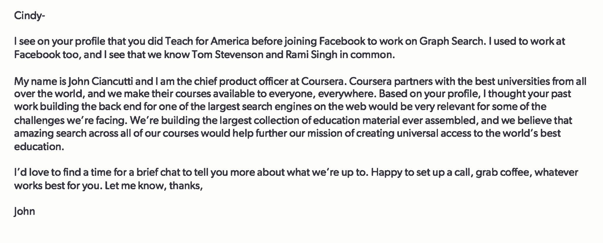

# 这就是 Coursera 与谷歌和脸书争夺最佳人才的方式

> 原文：<https://review.firstround.com/this-is-how-coursera-competes-against-google-and-facebook-for-the-best-talent>

1999 年，当约翰·钱库提 加入[网飞](netflix.com "null")时，他加入了一个由四名工程师组成的团队。几年后，他成了一名工程经理——这是一个他以前从未做过的角色，同时也增加了一项重大责任:找到更多优秀的工程师来雇佣。现在很难想象，但网飞当时还是一家不起眼的小公司。钱库提必须想办法吸引世界级的人才。到 2012 年他离开时，他还是产品工程副总裁，他已经雇佣了数百名工程师来建立一家赢得类别的公司。

从那以后，他在[脸书](www.facebook.com "null")和现在的 **[Coursera](www.coursera.com "null")** 改进了他的招聘方式，在那里他是首席产品官。在 Coursera，Ciancutti 管理工程、产品管理、设计、分析和运营。在这三家公司，他不仅进行招聘，还教了几十名工程经理如何做同样的事情。如今，他面临着与在网飞时相同的挑战，与谷歌和脸书等公司正面交锋，以赢得最佳雇员。与巨额薪酬和运转良好的招聘机器竞争并不容易。但在不到两年的时间里，钱库蒂成功地将 Coursera 的工程库从 25 个增加到 80 多个。

通过这次经历，他开发了一本招聘手册，旨在让初创公司的招聘经理获得优势。在 First Round 最近的 **CTO 峰会**上，他分享了定义一个成功招聘流程的原则和四个阶段，包括非常具体的策略来关闭最有抱负的候选人。

# 建立结束关系

在你开始之前，有一件很重要的事情:你必须从一开始，以及在你与每一位候选人交往的整个过程中，考虑如何达成交易。“作为一名招聘经理，你是候选人决策中最重要的因素，”钱库蒂说。“如果他们不认为你很棒，也不认为你会成为一名伟大的经理、合作伙伴和支持系统，那么他们对你的公司有什么看法也没关系。他们不会加入你的。”将每一位候选人都视为*候选人(直到他们不再是候选人)，这将有助于你获得良好的体验。*

很少有人这么看，但招聘过程真的应该是建立关系。“要知道候选人正在评估他们与你、你的团队和你的公司的每一次互动，”他说。“当你决定要雇用某人时，你会希望有这样一种感觉，‘我们肯定找到他了。’"

只有招聘经理能在这一刻建立关系。“你不仅需要知道你想雇用一个人，你还必须确切知道他们的动机是什么，”钱库提说。“每个候选人都在寻找不同的东西。你的工作不是销售。是为了当媒人。你知道是什么让你的公司变得伟大，以及什么样的人会在那里茁壮成长。你必须真正了解每一个候选人，才能找到最合适的人选。这肯定会帮助你做出更好的选择。这也增加了你最终成交的机会。”

过程中每个阶段的每个接触点都应该朝着那个结果前进。

# 阶段 1:采购

即使你的公司有内部或外部招聘人员，他们应该被视为补充。工程经理应该为他们团队中的角色寻找候选人。“你必须掌控自己的招聘流程，”钱库提说。“你的关系网永远不会被切断。环境因人而变。6 个月或 12 个月前可能不适合的人现在可能非常适合。此外，你带来的每一个新员工都拓展了你的人际网络。这将是你最好的人才来源。”

当你坐下来寻找资源时，瞄准那些最有意义的公司。像脸书这样的庞然大物在寻找资源时撒下了一张巨大的网。作为一家初创公司，你需要非常谨慎。“不要只是说，‘哦，谷歌有很棒的工程师，我打算从谷歌招聘。’对你想要担任的角色要更加深思熟虑。需要什么技能？有哪些公司体现了这些技能。谁是那里最好的？你很可能会得到一个与你想象的完全不同的列表。"

钱库提说，这是漏斗的顶端，的确非常困难。“大多数工程经理天生内向——我和大多数人都是如此——你必须接受这一点。这不是爱在两周内和 20 个人一起喝咖啡。这是关于你最终将与之共事的那个才华横溢的人。”你能做的第一件事就是尽可能多地发起对话。发送电子邮件。在活动中与人交谈。请你的朋友帮你联系他们的朋友。开始吧。“与你交谈的每个人都会让你更多地了解你的公司令人兴奋的地方。”

当你与人交谈时，你会很好地感受到这个角色的魅力所在。你会被问到尖锐的问题，随着时间的推移，你的回答会越来越好。但是如果你不能引起人们的注意，这一切都是不可能的。

那最初的外联应该来自于你。

“不用招聘人员做。这是你对抗大公司的一个主要方法。你在亲自联系我。你很特别。你说到重点了。你让他们知道你对他们的什么感兴趣。”

如果你在为一家初创公司招聘，你应该假设人们没有听说过它。相反，列举你和这个人的任何共同联系。这可能很简单，“嘿，辛迪，我看到你在去脸书之前确实在美国教过书。我在一家教育创业公司。你显然对教育充满热情。”也许你以前也在脸书工作过。说吧。也许你认识他们当前团队中的一些人。关键是要强调你是一个真正对他们感兴趣的人，在所有你可以与之交谈的人中。简单地说，告诉他们关于你、你的公司，以及为什么他们的背景看起来很适合。将角色与他们目前工作之外明显关心的事情联系起来是值得的。

你想马上与他们建立这种联系，你想推荐具体的行动:“这是我想采取的下一步。要不要迈出那一步？”

“说些类似‘我们谈谈吧’的话。“可以是一个电话或一杯咖啡，”钱库提建议道。“没有人会先选择咖啡。它总是从一个电话开始，没关系。关键是，只要能让你知道他们对你感兴趣，什么都行。”

**这里有一个这样的例子:**

成功就是得到回应。即使候选人说不，你也能学到东西，他们也能拓展你的人脉。他们可能会通过，因为他们对自己的工作很满意，但也愿意给你推荐信。你不想要的是沉默。你应该密切跟踪你的回复率。值得做一个电子表格。如果没有回音，您需要调整和调整，尝试不同的方法。

假设辛迪回你电话了。现在您可以开始筛选了。如果你在这一点上对一个候选人有疑问，这没关系，但是应该有一些事情让你对他们感到兴奋。保持低赌注。不要把其他人带入这个过程。应该只是你在聊天。

“你在筛选时的目标应该是理解他们的动机。他们为什么抽出时间和你聊天？”钱库提说。“记住，他们正在评估你做的每一件事，所以在你的交流中要及时，如果不合适，要让他们离开。”

他通常以简短的介绍开始这些电话:这是我，这是我的公司。你应该把音调降下来。最重要的是，它应该简短。

之后，他深入了解他们的背景。他说，注意他们如何介绍自己。“当你让别人告诉你关于他们的一般情况时，你会听到他们选择分享什么。他们倾向于什么。他们关心的信息片段是什么？你可以了解他们想要什么。”

为了更好地理解它们，可以考虑问以下问题:

你为什么花时间和我聊天？

你喜欢你现在所在的公司的什么？

你在那里的具体角色有什么了不起的地方？

“不要只注意他们说的话。也听听他们的声音，”钱库提说。“他们热情吗？激动吗？如果他们对自己的现状不满意，那是一个不好的信号。他们应该为自己的现状感到高兴。”他们不需要喜欢它的一切，但是一个人如何做出一个重要的决定，比如在哪里工作，就很能说明他们的情况。“他们选择去哪里上学？去实习？为什么？他们喜欢和不喜欢那些经历的什么？”

**当您结束筛选电话时，您应该有这些问题的答案:**

这个人目前在做什么，为什么他们对此感到兴奋？

它对公司和公司内部有什么影响？

他们为什么选择从事那个项目？

合适的候选人拥有他们工作的内容。如果他们在谈论一个当前的项目，你应该能够问他们任何相关的问题并得到答案。钱克蒂说，如果他们的回答是，“哦，有人在做那部分工作，”或者“那不是我的领域”，那就是一个巨大的危险信号。你想雇佣那些对自己的工作充满热情的人，他们知道并理解与工作相关的一切。如果你知道某人不合适，就在电话里结束。

当你对某人坦诚相待，并让自己有时间解释你的理由时，你就不需要跟进，你会为自己节省一些时间和内疚。

同样，如果这个人合适，在同一个对话中安排下一步。你必须要快。

敏捷是你超越大个子的另一大优势

“大家伙们行动缓慢，因为这是一个协调大量人员的巨大过程。在大多数情况下，速度将是你最有力的武器。如果你打了一个好电话，第二天就去喝咖啡。”

# 第二阶段:咖啡

“我总是安排一次咖啡会议作为下一步，”钱库蒂说。“我不会贸然接受采访。为什么？它创造了一个随意的谈话环境。我们更加了解彼此。”要记住的事情:要及时。准时到达那里。准备好其他能把你和这个人联系在一起的东西，比如共同的爱好，共同的朋友，兴趣。你希望他们喜欢你。

咖啡是深入了解他们个人动机和过去决定的绝佳机会。尊重他人的判断至关重要。他们是否从自己做出的每个选择中学到了东西？他们做出了更好的选择吗？你认为他们在职业生涯中的目标合理吗？他们雄心勃勃吗？

“你想要所有这些问题的答案，但你的另一个主要目标应该是激起他们的兴奋，”钱库提说。“比方说，你和某人一起喝咖啡，而他们选择不去现场面试——这是一个非常不好的迹象。你在喝咖啡的时候做了一些不太好的事情。也许你和候选人之间没有很好的化学反应，或者谈话走向了错误的方向。尽你最大的努力找到它。从喝咖啡到接受采访应该非常容易。”

同样，如果你不热情，当面立即结束这个过程并解释原因。当你做到这一点，你就完成了，你可以把时间投入到其他候选人身上。

如果你仍然感兴趣，就说:“你知道吗，我真的很喜欢这次谈话。在接下来的几天里，你有没有可能抽出几个小时来见见团队中的一些人？”用一种仍然保持低风险的方式来表达。当面试没有威胁性时，人们更有可能同意，这将保持你的动力。

# 第三阶段:面试

当有人来现场面试时，确保你是第一个见到他们的人。“不管招聘经理是谁，都应该有 50 分钟的时间。候选人可能很紧张，他们了解你。你要利用这段时间帮助他们放松下来，谈谈计划:他们要见谁，面试内容是什么。”你想让他们觉得你是站在他们一边的，他们会带着一点优势进入。

面试的结构和内容由招聘经理负责。也就是说，这是 Coursera 的典型设置。

你之后的第一次面试应该是一次编码练习，看看他们的编码水平如何。在 Coursera，他们给候选人一个编码问题和一个环境，让他们独自处理 90 分钟。然后面试官回来和他们一起走一遍，更好地理解他们的想法。

钱库提建议进行第二次关于文化的采访。“你需要一个不是你的人来评估这个人如何融入团队和公司。根据你的电话和咖啡，你显然对此有自己的想法，但事先进行直觉检查总是好的。”

在这之后，Coursera 会给候选人另一次技术面试，通常是一种算法或一项任务，适合他们声称拥有大量专业知识的领域。这一次，一些更资深的人和他们一起检查他们的工作，寻找精通。

钱克蒂说，一天中的最后一次面试也应该是关于健康的。“也许你以前寻求的是良好的判断力和个性，但这次真正关注的是领导力。我希望那些解决问题的人能把事情做好。我想听一个不是他们的责任，但他们还是解决了的问题。让他们感到沮丧的是什么，他们是如何处理的？他们对自己的决策和项目负责吗？他们表现得像主人吗？”

你现在工作的公司会因为你的存在而有什么不同？

这个环节也有利于衡量知识分子的好奇心。“你不会想要一直埋头执行代码的人。你需要那些真正想了解你业务的人。这就是你如何让一个人成长为更有能力的人。”

为了从这一系列对话中获得最大收益，你需要优秀的面试官。他们应该是你团队中最优秀的人。你已经信任他们，他们很好地代表了你。

你可以通过几种方式获得他们的反馈。要么在一天结束的时候和他们每个人进行一对一的会面(你不希望他们互相影响太大)；或者建立一个系统，让人们写下并提交他们的想法。最重要的是，每个人都在记忆犹新的当天提供反馈。“这可能是一个很大的要求，但这是理所当然的，”钱库蒂说。“你必须为你的员工设定期望值，以强调招聘的重要性。”

**也是必须的:**你需要跟踪一整天的进度。如果很明显候选人不适合这个角色——也许他们第一次编码练习就失败了——那就砍掉一些东西。我认为你不必完成计划。“前三次你这样做的时候真的很尴尬，但是你会适应的，”他说。“信不信由你，我已经切断了人们的联系，并维持着这种关系。人们尊重你不会浪费他们的时间。”

如果这个人真的坚持到了一天结束，招聘经理应该再和他们见一次面——不是面试，而是友好的交谈。它们可能已经耗尽了。他们可能对其中一次互动的进展感到紧张。他们很脆弱。利用这段时间来减轻他们的压力，让他们和你在一起更舒服。“回答他们的任何问题，慢慢来。不要硬停。钱库提说:“让他们觉得这是世界上你唯一需要做的事情。

这个时间还应该服务于另一个目的——看看候选人在他们的思维中处于什么位置。不要羞于问他们还在面试谁。如果他们说“旧金山的另一家创业公司”，问他们是谁。这里需要具体说明。询问他们对其他机会的什么感兴趣。问问他们对你的公司感觉如何。他们最兴奋的是什么？最关心的？那天的哪个采访是他们最喜欢的？

永远要问:“一年后，你在现在的雇主那里的机会有多大？”

这个问题是开放式的，你会得到一个真正真实的视角，了解他们现在是如何看待自己的工作的，这与他们之前所说的不同。当谈到你的竞争对手时，考虑问问他们，如果桌上所有的公司都给他们一个相同的报价，他们会选择哪一个。为什么这是他们的选择？

要触及的另一个关键点是他们目前的薪酬，以及他们是否处于与其他人的报价阶段。如果是，他们在看什么样的包裹？“看起来大多数人不会主动提供这些信息，但我们在 Coursera 面试的 85%以上的候选人最终都给了我们这些细节，”钱库提说。“年轻人尤其会有不告诉你的自然反应，但你可以说服他们。明确表示这些数据有助于你和公司更好地了解你的市场。人们自然倾向于乐于助人。”

这也是你可以要求的最好的市场数据来源——它是及时的，并且直接来自你知道你想雇佣的人。拥有这些数字非常有价值。你不妨试一试。

在总结谈话结束时，让候选人知道下一步是什么。类似这样的话:“我要和你今天遇到的每一个人谈谈，所以我们明天找个时间再来。”在这一点上，你可能已经见过几个面试官了，并且对你将要做的事情有了很好的认识。

为了让别人参与进来，你应该在一天结束时对他们更加兴奋。“这是一个在你现在的团队中处于上四分之一的人，”钱库蒂说。“你很挑剔，但你必须迅速行动。即使你想引进其他候选人，也要和这个人保持密切联系。让他们知道发生了什么。”

一旦你和每个见过候选人的人同步了，就该扣动扳机了。关于如何做到这一点，有很多不同的理论，但钱库蒂非常相信招聘经理会做出最终决定。

这不是一个共识应该统治的领域。

让招聘经理来做决定，并让他们对几乎所有时候的正确负责。

除此之外，如果你尽可能严格地收集招聘数据，你应该能够看到你的招聘循环中每个人的以下情况:

有多少他们喜欢的人最终变得很棒？

他们的雇员在公司呆了多长时间。

这些人的生产力有多高。

不管它们是否符合良好的文化。

你可以为所有这些人建立一个跟踪记录，并用它来建议你自己的决策。展望未来，你还可以看到你团队中的人在成为招聘经理之前需要培训的地方。

# 第四阶段:结束

如果你在面试结束时对某个候选人有了信心，你会在第二天结束面试。你去做——不是招聘人员，也不是你的老板。“如果可以的话，在面试的第二天就做，”钱库提建议道。“详细说明你为什么想要它们，为什么你认为它非常适合。解释公司的角色和使命之间的关系。谈谈他们的动机。你知道他们为什么要采取行动。”

在某些情况下，你可能在和一个不可思议的候选人说话，然后他们说了一些话，表明他们属于其他地方。不要害怕调整你的观点。最坏的情况是以不匹配而告终。“我会发现自己会说，‘你知道吗，根据你所说的，我真的认为你应该去 Snapchat。根据我所知道的一切，我认为这是正确的选择。这对我们来说太糟糕了，但让我们保持联系。"

当你真正相信你的公司是最好的选择时，不要退缩。

“你能做的最好的事情之一就是谈论你为什么会在你现在的位置，以及你为什么对公司充满热情，”钱库提说。“让他们听听你的声音。在这个阶段，建立这种联系非常重要。”

不管怎样，你都会有竞争对手。不要拒绝他们。相反，坦率地展示你的公司和他们的公司之间的差异。你要强调你的创业公司是什么样的，以及这个独特的角色。你想成为候选人的资源。他们会渴望得到更多的数据点，这有助于你与他们合作。

其中一个因素肯定是薪酬。这里倾向于含糊其辞。不要。在你和这个人谈话之前，给他们一份你的报价的电子表格，并且要准确。展示他们可以期望在公司获得多少股权。给他们看看你现在的估价。无论你的预期倍数是多少，都要列出理由。如果你认为公司在未来四年内会从 5000 万美元翻 20 倍，不要就此打住，要说为什么。

在同一个电子表格中，包括你对他们正在考虑的其他公司的信息。如果他们在看 Dropbox 或 Snapchat 或其他什么，把预期的好处放在你的旁边。在电子表格中加入公式，这样候选人就可以摆弄它们，自己计算他们认为每个地方会发生什么。

“工程师往往不愿意当场谈赔偿。这是他们看待问题的数据驱动方式，也是你梳理他们对自己选择的假设的方式。“使用你从采访过的其他人那里收集的数据，这些人主动提供了他们在其他地方看到的数据。”这表明你已经为他们做了很多跑腿的工作，你希望他们为他们做出最好的决定，而不是你。

亮出你的牌后，你还可以做其他几件事来扭转局势。让候选人遇到的每个人都通过电子邮件联系。鼓励他们一对一地喝咖啡，或者和那个人一起吃午饭。他们都应该为后续的谈话做好准备，但是不要让这个过程拖拖拉拉。把时间限制在几天或最多一周。到那时，你将会赢或不赢。

如果你没能接近一个候选人，你的首要目标应该是了解根本原因。

不要试图说服他们放弃。成熟点。并且不要忘记建立保持联系的愿望。他们可能认识非常适合这个角色的人。他们可能会在一年或一年半后再次对你的公司感兴趣。“也许 Snapchat 对辛迪来说并不是最好的地方，如果你有一个好的结局，她会回来的。”

# 反思你的结果

钱库蒂说，在招聘上犯错是正常的。“根据我的经验，优秀的招聘经理有 30%的时候会犯错。只要你能找出错误发生的地方并迅速修复，那就没问题。”

毕竟，你有几个因素需要平衡。如果你非常保守，你有可能 100%正确地判断出谁会加入，谁不会。但那会让你太慢。把标准定得很高，但是要愿意在你认为很棒的候选人身上冒一些风险，但是面试官并没有普遍的热情。“有时候你会雇错人。有时候你会让对的人离开。如果你成功地从两种情况中吸取了教训，就不要自责了。”

为了从他们的招聘渠道中挤出尽可能多的数据，Ciancutti 在 Coursera 的团队每周都开会讨论候选人并跟踪他们的过程。“我们把所有人召集在一起——所有的招聘经理和招聘人员都参与进来——我们讨论人们在哪里退出了，或者我们在哪里砍掉了一些东西。我们总是在寻找原因，这样我们就可以为未来做出改变，改变我们寻找的人的类型，等等。”

如果这次会议集中于一般性的头脑风暴(即寻找特定职位人选的最佳公司)，你就知道事情进展顺利。如果一位招聘经理推荐了三位通过了面试程序却没有被录用的候选人，你就知道事情有问题了。这是您想要双击并找出每种情况下发生了什么的地方。招聘经理在尝试什么，什么可能会出错，他们可以尝试什么？

“如果人们互相分享招聘电子邮件，并有组织地讨论什么有效，什么无效，你就有了一个健康的过程。钱库蒂说:“如果你在收集数据，你就需要帮助未来的候选人选择你。“最终，最重要的目标是随着你的成长，团队招聘越来越好。”