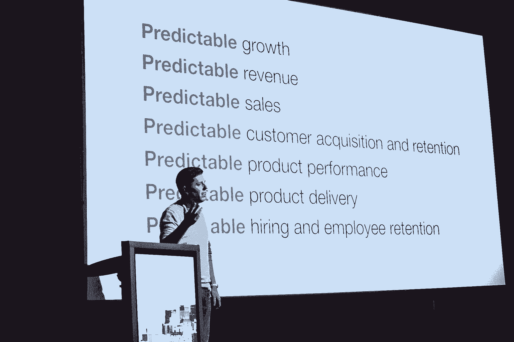

# 这就是有效的首席技术官拥抱变革的方式

> 原文：<https://review.firstround.com/this-is-how-effective-ctos-embrace-change>

高增长科技初创公司的首席技术官通常会在短短几年内从事三种完全不同的职业:

**工程师**——技术创始人的角色通常从定义和制造产品开始。你整天都在代码里。

**经理**——某天早上你醒来，发现你一整天都在开会。你发现自己管理二五十个人，被一对一埋没，不断招人。

**执行**——你终于设法带来了一个出色的工程副总裁或技术领导团队。但是现在你很困惑。你如何继续以同样的势头推动业务向前发展？

这篇文章是关于成功地过渡到最后一个阶段。

“我认为首席技术官角色的巨大变化没有得到足够的重视，”联合创始人埃文·库克说。“几乎每一位创始首席技术官一开始都身兼数职——工程师、产品经理、销售人员、客户服务——但最终你会聘用优秀的人才来担当这些角色。这就是困难的时候。现在只关注招聘和架构是赢不了的。事情变得复杂了。

也没有太多的帮助。虽然有大量的资源(书籍、讲座、研讨会)可以帮助人们成为更好的工程师或经理，但处于后期阶段的首席技术官除了彼此之外没有人可以求助。结果，他们最终严重依赖他人的经验，因为答案并不简单，也不广为人知，正确的做法取决于你的企业处于哪个阶段。

在 First Round 最近的 CTO 峰会上，Cooke 开始为技术领导者的观众解放这些知识，讲述了像他自己这样的后期 CTO 面临的独特情况，并提供了如何从该角色的最大陷阱中幸存下来的建议。

# 后期 CTO

根据他的经验，Cooke 看到了领导者在向后期 CTO 过渡时面临的许多问题:

他们没有向业务的非技术部分传达关键的技术挑战，也没有做足够的工作让整个公司在技术问题和路线图上保持一致。他们无意中把人们留在黑暗中。

虽然他们刚开始说“不”的时候可能说得不够多，但现在他们说得太多了。他们过于关注与计划不符的交付，而对适应业务需求关注不够。

他们无法过渡到一个需要长期规划和对人员配备、质量和交付有更多可预测性的环境。

他们做出糟糕的高层招聘决定。优秀产品贡献者所需要的技能不一定能转化为招聘经理和高管。

最后，他们未能有效利用自己的时间——讽刺的是，他们的时间可能比公司成长的其他阶段多得多。

“这些只是你向首席技术官转型时面临的一些挑战，”库克说。“但同时，它们实际上只是同一根源的症状。”

库克分析了两个最严重的根本原因，以及后期创业公司的技术领导者需要把握的机会。在这里，他不仅提供了度过这一艰难阶段的秘籍，还提供了一路茁壮成长的秘籍。

# 根本原因 1:你对你的同事不够了解。

“发生这种情况有几个原因。他说:“要么你很低调地运送你的产品，要么它会觉得有太多高层人士需要会见，尤其是在公司发展壮大的时候。”“这听起来很明显，但你必须积极地优先考虑这些讨论。”

在风投支持的初创公司的 A 轮和 B 轮融资之间，管理团队开始以更正式的方式走到一起。突然间，人们被提升到代表企业中不同的部门和职能，从市场营销到人力资源再到产品。“随着我们业务的增长，我面临的挑战之一是没有意识到这种变化已经发生，安排这些会议和建立这些关系为时已晚，”库克承认。

那么，你应该做些什么来充分利用与领导团队中的同事会面的机会呢？

*传达产品和工程需求*

随着公司的发展，工程和技术组织对组织的其他部分，如销售和市场营销来说，可能开始看起来像一个黑匣子。如果没有明确的努力来支持这些通信，过去在公司职能部门之间共享的公共知识经常会丢失。

作为一名技术领导者，你有一个独特的机会成为公司产品和工程团队的倡导者。像向其他领导传达产品和工程师团队如何设定目标、确定工作优先级和管理风险这样简单的事情可以带来巨大的回报——销售可以更好地通知客户，营销可以更好地管理时间表以及产品和功能单，财务团队可以更好地理解预算请求，人力资源组织可以设计更好的方法来为产品和工程员工建立招聘机制并赋予他们权力。

*了解他们需要你做什么。*

“如果我们知道团队中其他领导需要什么，我们就能更好地传达与他们相关的信息，”他说。“当有人问我们，‘嘿，这可行吗？’时，我们也可以做得更好。”而不是过早地说“不”。相反，你可以说，‘好吧，这是需要的，你觉得怎么样？’？"

库克解释说，走出自己的方式去了解他人的最有趣的副产品可能是，你自己的目标会变得更加清晰。

作为一名首席技术官，你可能会关注你能做些什么来帮助整个企业。他说:“知道你的组织中哪些关键人物需要成功，是你能对公司产生影响的最有意义的事情之一。”“例如，与 CMO 会面以主动支持即将举行的用户大会，这意味着我可以帮助寻找演讲者或安排客户参加。当我与我们的首席收入官会面时，我可以了解销售周期，并参加重要的客户和合作伙伴会议，以帮助公司实现我们的数字。在 Twilio，我找到了一个机会来支持法律团队，并帮助制定和执行知识产权战略。”

除非你建立了正确的沟通渠道，否则你不会知道公司面临的许多最关键的挑战。

*知道成为一名优秀的高管意味着什么*

Cooke 发现这方面有几个资源特别有用。其中一篇是彼得·德鲁克写的关于高效管理者的八种不同品质的文章。一般来说，担任这些角色的最佳领导者知道如何做到以下几点(五个最重要的特质):

他们找到合适的问题来解决。他们不只是浮现他们看到的一切。

他们知道如何将挑战放在企业成功的背景下，解释为什么它们是至关重要的并且需要解决方案。

他们知道如何建立一个具体可行的计划来解决这些问题。

他们知道如何与各种团队和公司沟通正在做什么以及为什么它很重要。

他们以执行为导向，将计划转化为行动。

库克说:“一个真正伟大的领导者不仅能发现潜在决策的影响，还能充分理解该决策对所有受其影响的人的影响。”。“当我回想起我在我们的业务中经历的所有不同的失败模式时，这对我来说是一件非常深刻的事情。”

完善你自己对如何成为一名优秀高管的看法，将有助于你找到沟通的最佳方式，并确定你和你的团队工作的优先顺序，但这对你公司聘用其他领导也非常有用。

“招聘高级职位非常困难，”库克说。“对优秀的高级经理或高管有一个明确的定义，会给你的公司带来巨大的变化。它将最终决定未来会发生什么。”库克建议你在与高管的面试中寻找的一些特征包括:

能够抽象复杂的问题和情况，并确定什么是真正重要和可行的。

对人际关系动态和人类心理的敏感性——这对技术领导者来说非常重要。

谦逊。他或她清楚地表明对不熟悉的话题缺乏了解，并寻求给予而不是获得荣誉。

或许最重要的是，无可置疑的正直。在咨询过程中出现的任何疑问都应认真对待。

# 根本原因二:你误解了你公司的需求。

例如，库克指出，随着公司进入成长阶段，领导团队和董事会的重心转移可能会让首席技术官感到非常困惑。过去，董事会会议通常会涉及数小时的产品和工程讨论，现在开始关注销售和营销或战略。

这让人感觉技术问题没有被优先考虑，或者你被边缘化了。现实情况是，公司面临的重要问题发生了变化。作为技术主管，您的工作就是理解并支持这种转变。

为了更好地理解自己专业领域之外的优先事项，Cooke 开发了一个框架:

当你创建一家公司时，你实际上是在创造不存在的可预测性。

他引用了“创业”的定义:“一个不知道自己的产品是什么，客户是谁，或者如何赚钱的企业或公司。”

如果你将其与一家定期发布分析和预测的大型上市公司进行比较，你会看到鲜明的对比。该业务必须提前几个季度知道它将产生多少收入和增长。

“因此，当你积极地建立一个企业时，最有帮助的思考方式之一，也是最重要的，就是要创造更多的可预测性，”库克说。“假设我们希望实现增长。这意味着我们需要锁定可预测的收入。为了获得可预测的收入，我们需要可预测的销售额。为了做到这一点，我们需要可预测的客户获取和保留。但要做到这一点，我们首先需要一种可预测的产品，它具有可预测的性能，我们可以以可预测的方式交付。但这并不止于此。为了开始这样做，你需要有预见性地雇佣和留住员工。”

Evan Cooke speaking at First Round's CTO Summit.

寻求可预测的增长成为他用来将他的工程思维与 Twilio 公司更高层次的关注联系起来的关键工具之一。“我想到，销售或营销实际上可能是为企业集中资源的正确事情，因为这可能是产生最稳定的长期回报的事情。”

*了解你的董事会*

库克强烈推荐布拉德·菲尔德和摩哂陀·拉姆辛哈尼的《创业董事会》一书，不仅是给工程高管，也是给任何渴望在成长型公司担任领导的人。

“这是对董事会职责、公司对董事会的职责以及这些关系如何随着时间的推移而演变的最好概述之一，”他说。“例如，你的董事会可能开始关注客户发现和产品开发，但随着你进入增长阶段，话题将转移到销售和营销以及公司治理。”

拥有这种对业务整体重要的全局图景，对于确定产品和工程需求的优先级非常有帮助。因此，即使你不能出席董事会会议，你也可以通过其他途径获得信息——询问在场的人，鼓励他们通过全员或内部博客帖子等方式与更广泛的公司分享这些会议的成果。

获得董事会会议的真知灼见可以让技术领导者了解他们现在面临的挑战，以及未来将要面临的挑战。这就是你如何决定你是否需要更多的人员，或者如何组织你的团队，以便你可以同时处理不断增加的工作量或多样化的产品。

*通过转换成功*

关注业务的真正需求，并与领导同事建立良好的关系，对于帮助技术领导保持高效至关重要。早期的成功意味着与公司成长阶段不同的东西。随着组织的变化，你的目标和你对自己角色的期望也必须改变。

“如果我有一个收获的话，那就是技术角色，尤其是技术领导角色会随着时间的推移而发生巨大的变化——你经常会觉得自己回到了起点，”库克说。

正如技术创始人的角色可以从代码开始，后期阶段的 CTO 可能会在代码中发现他们最大的影响。在标题为 [#define CTO](http://blog.gregbrockman.com/figuring-out-the-cto-role-at-stripe "null") 、 [Stripe CTO Greg Brockman](https://www.linkedin.com/in/thegdb "null") 的文章中，他描述了自己的角色是如何从一名工程师演变为一名经理，并在聘请了工程副总裁后又回到工程师的。对一些人来说，这是正确的道路，而对另一些人来说，这正在成为公司的公共声音，比如亚马逊的沃纳·威格尔博士。

你可能刚开始没有直接下属，有很多直接决策责任，你发现自己又回到了从前。我的信息是:这没问题，实际上是成功的标志。

正如库克总结的那样，“最重要的是考虑你如何了解什么对公司至关重要，了解那些能给你提供你需要的背景的同事，塑造你自己的角色——以及你如何相应地在那个角色中发挥作用。”