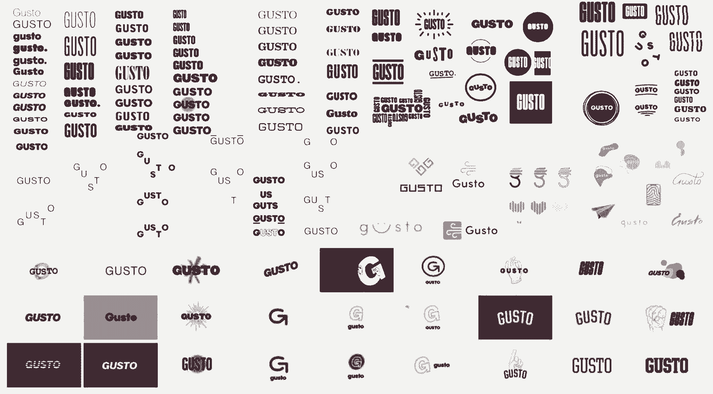

# 这就是你如何设计一个持久的品牌——深入了解 Gusto 的重塑

> 原文：<https://review.firstround.com/this-is-how-you-design-a-lasting-brand-an-inside-look-at-gustos-reinvention>

去年 9 月， [ZenPayroll](http://www.zenpayroll.com "null") 的员工早上 6 点就涌入他们在旧金山的办公室，然后，不管他们的角色是什么，都跳上电话与客户解释刚刚发生的事情:他们现在是 [Gusto](http://www.gusto.com "null") 的员工。**该公司更名为**，这一变化远远超出了名称和标识——除了为企业提供薪资软件，他们现在还将追逐竞争激烈的健康福利市场。这可能是疯狂和紧张的。但是他们的声音点亮了电话，反而是明亮的和庆祝的。

这种转变发生得很快，很顺利，并得到了媒体的广泛报道。但这远非表面上的一夜之功。事实上，自从公司在 Y Combinator 成立之初，首席执行官乔希·里维斯和他的联合创始人就一直在谋划这个支点。他们知道他们的愿望超越了工资，而且几年后他们需要彻底检查他们已经精心建立的东西——这是一个令人生畏的前景。

**重塑品牌并不容易。**正如 Reeves 欣然承认的那样，他们知道在转型过程中会失去一些潜在客户。名称更改可能会影响搜索结果。方向的改变会引起员工的警觉。但在首次亮相后的近 6 个月里，Gusto 只变得更强、更快。在这次独家采访中，里夫斯详细讲述了他们是如何处理和执行品牌重塑以获得发展势头的——为那些刚刚塑造自己形象的初创公司和那些想要改变方向的公司提供建议。

# 结构就是力量

每一个品牌化过程都会自动包含两个部分:内部的面向员工的部分，以及外部的面向公众或客户的部分。在整个规划和执行过程中，两者都需要考虑。它们是同一枚硬币的两面，虽然它们需要不同的方法，但它们会密切影响彼此的成功，这是一种微妙的平衡。

这是结构对于建立一个强大的品牌如此重要的首要原因，无论你是从零开始还是中途开始。在 Gusto 的案例中，他们已经有数百名员工投入到这项工作中，并有数千名客户参与其中。为了应对这种情况，他们将项目时间表设定为噪音中最强的信号。偏向结构造成了很大的不同。

“当我们知道我们能够在 2015 年秋季推出新的健康保险产品时，我们决定同时宣布更名，”Reeves 说。“如果可以的话，我们尽量避免发布纯粹关于我们的消息。我们希望专注于展示我们计划如何为客户提供更多帮助的故事。”(这是一个有启发性的想法，对于那些希望利用融资公告之类的东西作为新闻诱饵的初创公司来说。)

然后，他们开始创建许多人所谓的“回溯”时间表，从选定的启动日期回溯，估计项目每个阶段需要的时间，指定里程碑和截止日期。 Gusto 的创始团队规划了品牌重塑过程的各个阶段，包括更名、视觉特性设计(如徽标、网站等)。)、发布准备(新闻发布会和营销材料)以及发布后的成功衡量。在每一步，不同的人会参与决策。

“很容易陷入这个陷阱，你有太多的意见，潜在的方向，没有建设性的对话，”里维斯说。“解决这个问题的方法是设立检查站。你停下来问自己是否能如期完成最终交付日期，房间里的每个人是否真的都需要到场，或者，你是否做得很好，让其他人都了解情况。”做到这一点的唯一方法是通过严格的前期规划。

与此同时，现实是，创业生活永远不会完全可预测或准确。但是这不应该打乱计划。事实上，它强调了在你的计划中彻底和现实的需要，缓冲你的时间表足以考虑到错误的转弯，人为错误和分心。“你对自己的结果感到满意的唯一方式是，你执行一个严格的流程，不能容忍低于标准的结果。”你不希望在检查点之间浪费太多时间，但是如果工作质量很差，你也不希望坚持武断的截止日期。在前进的过程中，你必须在头脑中保持这些对立的力量。

任何一家初创公司最重要的难题就是分清主次。

坚定的优先顺序在很大程度上决定了 Gusto 作为一个组织的路线图。尽管创始人已经有了健康保险的解决方案，他们还是从工资产品开始。正如 Reeves 所说，第三次展示将在未来 18 个月内进行。同时追求所有这些产品是不可能的。因此，当他们开始重塑品牌时，他们遵循了同样严格的步骤优先顺序——尽管第一步可能会让你吃惊。

# 第一步:想象你想要的世界。

谈到它的品牌，Gusto 有点古怪。2012 年，就在 Y Combinator 展示日的前几天，里夫斯和他的联合创始人选择了之前的名字 ZenPayroll，当时的想法大致是这样的:“我们要投了。我们需要一个名字。我们正在打造一款更简单的薪资产品，让客户高枕无忧。”这个域名花了他们 7 美元。这是一个明显的赢家。但他们一直知道这是暂时的。它没有完全涵盖他们已经计划好的产品范围，但这个错误会一直拖延下去。当你需要开始工作时，最终重新做比第一次就做对要好得多。

“拥有这个真正长期的路线图有一个有趣的副产品——我们不断思考我们的业务从现在起几年后会是什么样子，这让我们专注于我们希望世界如何为我们的客户服务，”Reeves 说。这使得团队在做出改变的时候，可以考虑比公司当前价值更大的东西(尽管它们是有用的)。

听起来不错，但是预见未来也需要一些光结构。当然，你可以头脑风暴你希望你的行业如何改变，以及你认为客户在 3 年、5 年、10 年后需要什么，但必须将这些预测与你的公司联系起来，以及为什么你处于实现这些预测的最佳位置。Gusto 定义了它希望影响未来的两个领域:

**让业务变得清晰**在目睹亲密的家庭成员和朋友在自己的小企业中为薪资、税收和复杂的文书工作而苦苦挣扎后，里维斯和他的联合创始人有了创办 ZenPayroll 的动力。“我们看到有多少人用手做这些事情，以及当事情出错时会造成多大的痛苦，”Reeves 说。如果有人没有得到正确的报酬，那将对他们的生活产生巨大的影响。如果一家公司没有正确报税，他们可能会被关闭。赌注不低。哪些即插即用工具可以简化和加快这些过程？

**让工作变得更愉快**“如果你看过电影《办公室空间》，你就会知道现实并不遥远——公司经常把员工当作‘资源’而不是人，”里维斯说。“即使他们不打算这样做，这种情况也会发生，因为他们的系统就是这样设置的。他们如何跟踪他们，支付他们，登上他们，等等。这太不人性化了。”因此，Gusto 希望建立工具，将工作场所变成社区，并考虑人类的体验。“我们希望我们的软件是关于更大的事情，比如，你如何让某人在工作的第一天过得很好？你如何不仅能为新队友处理文书工作，还能庆祝他们加入你的社区？”

**为了创造一个新的、持久的品牌，你需要将你的公司规划到未来。依靠你一直拥有的相同的价值观、属性和形容词不会让你达到目的。**

如果你问 120 年前的人他们想要什么，他们可能会告诉你一匹更快的马，而实际上他们想跑得更快。

这就是你发明汽车的方式。但是你很难超越已经存在的东西，除非你鞭策自己。除了今天的工作方式，你如何帮助你的客户或用户？里夫斯说，这种头脑风暴应该是你打造品牌的第一步。

# 第二步:选择一个能推动其他事情向前发展的名字。

“选择你的名字是这个过程的主要转折点。它将推动其他一切——视觉设计，你向团队传达信息的方式，你与客户谈论它的方式。因此，如果你打算把时间和精力投入到任何事情上，那就应该是这个。”

Gusto 这个名字的出现与三年前他们将 ZenPayroll 从空中拉出来的方式有天壤之别。这其中涉及到大量的后勤工作，每一个移动的部件都扮演着重要的角色。

首先，他们将自己对未来的两种愿景与迄今为止用来描述公司的五种“价值观”放在一起:安心、平静、热情、信任、充满活力。他们立刻意识到他们必须从名字中去掉“工资单”。“它只是背负了太多的包袱，”里维斯说。“这是一件苦差事，一件麻烦事。我们希望人们感受到这些事物的反面。”

最后，他们考虑了新品牌的最终“消费者”。不是他们销售的企业，而是那些公司的实际员工，他们的生活会变好还是变坏取决于他们的产品。随着在同一个地方终身制的消亡，越来越多的员工开始问:“在我工作的地方，我会感到被欣赏吗？我觉得被重视了吗？我觉得我有影响力吗？”他说。该团队希望新名字能在情感层面上与这些问题联系起来。”我们想抓住我们对从事这项工作的人的重视。"

与此同时，他们希望这个名字能激励自己的员工突破惯性，对追求新产品感到兴奋，并让他们相信它是一家拥有 50 年或 100 年历史的公司，而不是一家“典型”的初创公司。

你的名字可能只是你如何服务顾客的一个容器。但是你要选择一个好的容器。

然后是实际问题:他们想要一些容易说、容易拼写，最重要的是容易记忆的东西。Gusto 最终因为这些原因而被淘汰，然后深深地与更抽象的优先事项联系在一起——创造快乐的愿望，对清晰的渴望，以及激发信任的需要。

兴致勃勃地，兴致勃勃地，精力充沛地做某事；热情。

“当人们热爱他们的工作并且擅长他们的工作时，那就是热情，”里维斯说。“当一个人白手起家创业或有热情帮助他人时，这就是热情。此外，作为我们员工的指路明灯，我们希望员工充满热情。我们的客户更有可能信任那些对自己的工作充满热情、忠诚且有才华的人。这会让他们安心。”

事后看来，Gusto 听起来是一个显而易见的选择。但事实并非如此。

**品牌推广建议:一波一波地建立共识。**

重塑品牌的对话始于创始人，出于年度规划的目的，创始人将对话扩大到了高管团队的其他成员。但这并没有保密太久。他们还希望在与公司其他人分享之前，锁定时间表和指导原则。

领导团队第一次公开谈论这一转变时，他们在全体会议上正式启动了这一转变——古斯特每月举行两次全体会议。“我们的目标是说，‘看，这里的每个人都是这个过程中的利益相关者。“会议紧紧围绕推动品牌重塑的新产品发布，以及他们希望新外观传达的核心价值观和理念。他们没有马上打开反馈的闸门，而是强调每个人都有机会通过一轮调查提供想法和意见。

“我们向员工甚至一些客户发出了多份调查问卷，询问一些非常轻松、有趣但也很有见地的问题，比如‘如果公司是一种动物，它会是什么？’如果公司是你在聚会上遇到的一个人，他们会是什么样的人？"

里夫斯来的准备之一就是被拒绝，他得到了。人们不同意该流程的部分内容，以及更改名称的必要性。他们怀疑花在项目上的时间的投资回报率，或者质疑为什么它现在很重要。最有效的回应是不断解释他们采取行动背后的“原因”,并承认其他人在公司中的所有权。

“我们的核心价值观之一是，每个人都应该对 Gusto 有一种主人的心态。“每个人都在建造他们共同拥有的东西，”里维斯说。当我们提醒他们新名字不仅仅是给顾客的，而是给我们所有穿 t 恤的人的，他们谈论我们的工作，并为我们的工作感到自豪。看到他们的员工成为对品牌重塑感到兴奋和充满活力的共同所有者，情况就有所不同。"

调查结果出来后，公司开始列出一些想法，进入更集中的头脑风暴模式，允许任何想参与的人自愿参加，其他人可以选择退出。

由 Steffi Wu 牵头的沟通团队举办了一系列研讨会，在这些研讨会上，他们进行了旨在引出想法的练习。他们邀请整个公司的每个人来生成描述公司和客户体验的形容词、相关名词、不同语言中的相同单词、组合成混合词等等。

“我们会带着公司的特质准备好，深入讨论为什么冷静或热情对我们很重要，以及如何谈论信任，”吴说。“充满活力意味着什么，活力是什么样的？人们把充满活力和什么联系在一起？老实说，第一次会议很像 slam 诗歌。”

在下一次会议中，他们将较大的小组分成两三人一组，问他们喜欢和不喜欢 ZenPayroll 这个名字的什么。很多人都很喜欢“禅”这个词，以及它听起来是多么的自然和有机。随后，研究小组被鼓励创造出能唤起相同自然意象的词语，如森林、海洋、平静的池塘。“人们真的很投入，”吴说。

他们以成千上万的单词结束。但是还有另一个结果——参加研讨会的每个人似乎都带着对品牌重塑过程的新的尊重离开了。

“在我们开始如此直接地让人们订婚之前，他们对我们为什么不直接取个名字感到困惑。一旦他们亲眼看到人们的感受有多深刻，他们就会理解为什么公司要投入这么多时间和精力，”吴说。

由高管和营销专家组成的一个较小的小组，将大量选项筛选出 15 个候选名单。对于一家高速增长的公司的首席执行官来说，Reeves 在每一次谈话中都很活跃，这是独一无二的，他仍然相信他的每一分钟都是值得的。

作为一个领导者，你管事的公司的未来应该是什么样子。

在接下来的全体会议上，我们展示了这份候选名单，以获得下一轮反馈。鉴于在数百人之间达成共识的危险，没有多少公司会这样做，但里维斯发现，继续让每个人参与进来实际上是一个难得的机会，可以强调他们的开放和所有权价值观。

“我从这件事情中学到的最重要的一点是，人们不会自动知道他们对一个词或一幅图像的感受。“你必须花一些时间让它适应，”里维斯说。“所以当我们得到任何负面反馈时，我们会给它一些时间。我们不会有任何反应。我们会注意到人们对事物的看法。这是我给创始人的一条很大的建议，即使是在做出重大决定的时候。让事情腌制。”

正如你可能猜到的，Gusto 在那份名单上，在与员工的一次普通研讨会上赢得了粉丝。

“这个名字是我们自己取的——我们没有请公司来替我们取，”Reeves 说。“我们可以，但这个名字必须代表那些为我们全职工作的人。”

一旦他们选择了 Gusto，他们发现网站“关于我们”和“职业”部分的大部分内容都来得很快很自然。他们能够适应在命名头脑风暴会议中出现的许多语言。作为最好的例子，主页[在发布日看起来像这样](https://gusto.com/we-believe "null"),以一个关于公司信仰的诗意陈述完成。Gusto 的联合创始人 [Tomer London](https://www.linkedin.com/in/tomerlondon "null") 能够在 15 分钟内写完，因为它直接来自于他几个月来的对话。

# **第三步:**给你的视觉效果注入意义。

确定名字也开启了这个过程的下一个阶段——找到一个同样充满情感冲击的视觉效果。里维斯和一小组利益相关者与设计公司 Nelson Cash 一起工作，经历了许多迭代，从宽泛的方向开始，然后提炼他们喜欢的方向。

Initial directional brainstorm for Gusto's logo.

“在整个过程中，标识无疑是我们最大的挑战，”Reeves 说。"有这么多的选择，每个选择都有这么多的意见."为了控制讨论，他们编写了一份他们想要传达的创意摘要。然后，当他们看到 Nelson Cash 返回的选项时，他们将每个选项与他们用来描述他们想要的单词进行比较。

“我们想要一些简单的东西，可以在不同的背景下脱颖而出，在不同的尺寸下看起来都很好，从远处和近处都容易理解，”他说。“我们也不希望它太抽象，以至于人们看不到兴趣和图像之间的联系。所有这些都是令人难忘的东西。记忆是最重要的一点。”

他们倾向于最后的选择，因为它类似于一个权力的象征，这很容易让人想起简报上的许多措辞——当有人做他们喜欢的、他们擅长的工作时，他们很有权力。代表“兴致”的“G”很容易看到，向右上方的箭头唤起了精力的增长。红色暗示了公司的热情和平易近人。

Experimenting with final color schemes.

Reeves 说，对于一个相对简单的视觉传达来说，这可能听起来有很多意义，但重要的是你的标志有一个你相信的背景故事。将这种程度的思考放入代表你和与你一起工作的每一个人的符号中，就是赋予它影响力的东西。如果你想让人们在看到某样东西时有所感触，你必须首先让它充满感情。

# **第 4 步:**整理好您的发布行动手册。

当你锁定了你的资产，是时候进入战术执行模式了。你想列出你的品牌重塑会对你的业务产生影响的所有方式。它们会比你想象的更深远。

“改变你的名字对于现在的顾客如何理解你的产品以及将来的顾客如何找到你来说是一件大事，”Reeves 说。“你会非常清楚所有的事情，因为你已经考虑了一段时间。你不知道这对其他人来说有多困惑。你当然不希望他们认为出了什么问题，或者你的服务标准变了。”

**他建议列出这三类受众的关注点:**

员工和内部利益相关者(包括您的投资者和顾问)

当前客户

潜在顾客

**你如何让你的品牌重塑成为这些类别中最好的体验？**

对于利益相关者和你的直接社区来说，他们的快乐将取决于你在新品牌诞生之前的沟通程度，你倾听他们意见的程度，以及你如何调动他们对变革的积极态度(稍后将详细介绍)。

但是当涉及到当前客户时，您希望保持稳定和熟悉。“我们的目标是不要捣乱，”里维斯说。

虽然工程和设计团队为 Gusto 网站设计了新的外观和感觉，但实际产品的唯一变化是在 ZenPayroll 徽标旁边添加了一个小丝带，表示名称已经更改，并链接到 Reeves 解释这一变化的一封信。

“除此之外，什么都没变——甚至绿色配色也没变，”他说。“我们的客户每天都在使用我们的产品，保持他们的信任始于防止混淆。在几个月的时间里，我们对产品体验的所有改变都是极其渐进的。”

**接近潜在客户的方法有两种:**

在发布前的几天里，这个团队主动联系记者，目标是那些已经熟悉这家公司，并意识到他们的野心不仅仅是薪水的人。他们的目标是与记者合作，讲述更名背后的动机和意义的完整故事，而不仅仅是事实。这样，每当潜在客户通过搜索找到他们或有目的地查找他们时，就会有一个全面的解释，这也强化了为什么 Gusto 是一个周到、值得信赖的合作伙伴。

**主页:**在发布日，该公司没有优化其主页，以促使访问者转化或采取行动。相反，他们将所有的注意力都集中在品牌重塑所代表的关键价值上([你仍然可以看到它的样子，为后代保留下来](https://gusto.com/we-believe "null"))。这样，登陆页面的潜在客户会看到公司决策中的人性和用心。

*我们相信...*

我们认为是时候停止将人视为资源了。

*我们相信人是跳动的心脏、渴望和激情。*

*我们认为员工首先是人。我们相信经理和同事都是人。*

我们认为工作、商业和生活本身都与人有关。我们肩负着改变世界运作方式的使命。

*我们致力于帮助世界上所有企业将人放在第一位。*

与此同时，[ZenPayroll.com](https://zenpayroll.com/ "null")仍在运行，任何登陆该网站的人都可以轻松找到产品，而无需理解名称的变化。

所有这些都是在发布前决定并准备好的。他们只需要扣动扳机。

# 第五步:发射能量。

这一天开始时，每个人的收件箱里都收到了里维斯发来的一封相当长的详细电子邮件，宣布更名，再次深入探讨新名称和标志如何不仅强调了公司的最佳属性，还指向了一个成功的未来。这是一个抓住几乎没有播出时间的所有要点的机会:领导层希望建立一个持久的公司。每个人都应该努力以客户为中心。在初创公司，很少有机会停下来反思这类文化标准。当你改变你的品牌时，你有能力用它来让每个人重新组合，里维斯说。

“我们非常有意识地希望每个人在那天早上早点来打客户电话，”Reeves 说。“真的很吵，真的很刺激，真的很有活力。人们穿着睡衣打电话，我们早餐吃纸杯蛋糕。这是一件有趣的事情，这一点很合适。”

电话中的每个人都配备了一个高水平的脚本，简单地转述了发生的事情，快速解释了品牌重塑的重要性，并提供了回答任何问题的机会。

“我们的目标是让它非常简洁、干净、轻快，”他说。“公司里的每个人都有机会与客户互动，这种情况并不是每天都会发生。”

这是一个借口，让每个人为了一个共同的目的走到一起，让顾客开心。

除此之外，发布日还起到了迫使人们跨职能工作的作用。它要求市场营销和沟通团队发布公告、工程团队打开新产品和网站、客户服务部门立即打电话来消除顾虑，这需要惊人的同步性。每个人都必须团结一致才能成功。

有一个指定的人负责分发通话清单，确保每个人都知道自己在做什么。结果是:团队之间的隔阂被打破了，每个人都重新感受到作为一个团队的一部分而工作的兴奋。

# **第六步:**衡量你的成功(并且永不停止)。

不管你的公司有多小，或者你只给它做过一次品牌宣传，你都想收集关于你被如何看待以及它是否可以变得更好的数据。

“为了判断品牌重塑是否有效，我们回顾了这三个方面:员工和利益相关者、现有客户和潜在客户，”Reeves 说。"我们应用不同的机制来获得他们的反馈和回应."

独特的是，Gusto 经常对自己的员工进行调查，得出基本上是员工净晋升分数。它们被称为 G-Pulse 调查，定期进行，大约每隔一个月一次，以了解人们对最近的发展和总体情况的感受。

“我们问了这样的问题:你觉得自己在品牌重塑过程中参与得够多了吗？你有信心公司正在取得正确的进展吗？”里维斯说。“例如，我们没有问他们是否喜欢 Gusto 这个名字。他们的经历是最重要的。”

他们很高兴在更名后的调查中看到全面的高分。特别是，让人们直截了当地说，他们理解为什么 Gusto 这个名字在这种文化中如此有意义，这是非常有希望的。

为了衡量客户的情绪，该公司记录了所有提醒他们注意更名的礼节性电话。通过这种方式，他们能够捕捉到包括问题在内的各种反应，这样他们就可以找出困惑或需要改进的地方。这些数据已经反馈到产品和营销团队，因此他们可以相应地 A/B 测试产品功能和信息。

Gusto 还经常向其客户提供 NPS 调查。自更名以来，这些分数一直保持在 75 分以上，相对较高。作为背景，B2B 供应商和技术公司的平均 NPS 是 60。

在许多情况下，这些调查与他们在几个月内推出的交错产品变化挂钩。例如，如果他们在应用程序中进行颜色更新，他们会看到这是否会导致满意度下降。

“我们不能把有机交通的下降解释为失败，这真的很重要，”Reeves 说。“任何一家改变名称、甚至改变描述产品的核心语言的公司都应该预料到这一点。当你积累了多年的搜索引擎优化，你不可能在一夜之间就把它转移出去。”

你能做的就是监控社交媒体情绪。大多数通过社交渠道分享、发微博和写你的人都是现有客户或潜在客户。如果你正在经历一个大的变化，这可能会是几个月来比交通更好的风向标。

目前，Gusto 仍然依赖于 ZenPayroll 登录页面的流量。当导向 Gusto 的流量开始有意义地从另一个网站转移时，他们计划将 ZenPayroll.com 直接重定向到 Gusto。“我们看到这一运动正朝着正确的方向发展，”里维斯说。“但对于当前和未来客户参与的任何事情，我们都希望非常谨慎。”

对于任何不愿意为了一个重要的品牌重塑而承受流量冲击的公司，里夫斯有一些建议:“一个强大的品牌或品牌重塑过程给你的讲述故事的机会，值得在有机发现中进行可预测的下降，”他说。

“你必须有信心，你正处于一个长期的旅程中，把你的故事公之于众将会推动这个旅程。在最初的几个月里，这种变化对我们来说痛苦吗？是的。但我们不是来优化这几个月的。我们正在为未来十年进行优化。