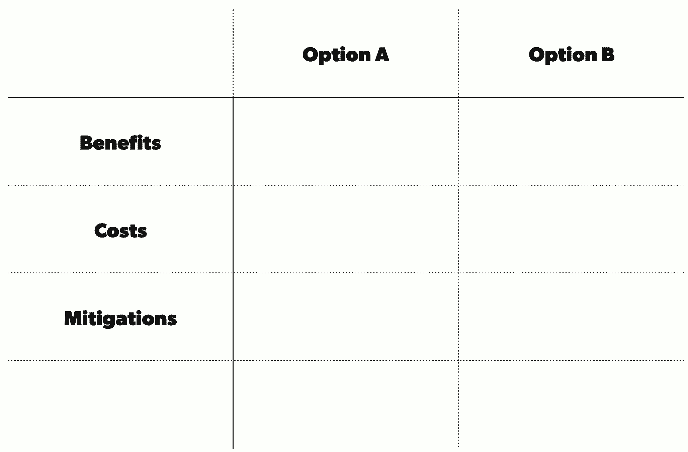

# 该矩阵帮助成长中的团队做出重大决策

> 原文：<https://review.firstround.com/this-matrix-helps-growing-teams-make-great-decisions>

Gil Shklarski 的职业生涯致力于解决极其复杂的问题。无论是让脸书变得更安全，还是为微软的地图进行基础设施建设，他总是以数学家的能力来完成工作，将庞大的任务分解成待解决的问题集。五年前，他加入[熨斗健康](http://www.flatironhealth.com "null")公司，担任技术主管，负责构建肿瘤行业首个基于云的软件平台，以管理临床护理并从每位患者的体验中学习。**听起来是一个足够大的挑战——但是迅速扩展技术团队本身就证明是一项艰巨的任务。**

当 Shklarski 加入时，该公司有四名员工在开发一家诊所使用的技术。两年后，员工人数达到 135 人，为 200 家诊所提供服务，他面临着一个可能会破坏这一切的问题。这不是技术问题，也不是医学问题。这是一个人的问题:**他的工程领导很难做出精简的决策**，无论是与产品领导谈判还是围绕内部辩论达成一致。

目前还不清楚他将如何扭转局面。但是现在的首席技术官 Shklarski 一直在使用一个框架，这个框架是他的执行教练 Marcy Swenson 介绍给他的，帮助他处理自己棘手的决定。他意识到如果在团队范围内应用，同样的工具会有多么大的帮助。在这篇独家报道中——基于他在第一轮 CTO Unconference 上的一次演讲——Shklarski 讲述了他调整的矩阵**,以使他日益独立和分散的团队能够在艰难的选择中保持快速和明智的行动。**

# Xanax 用于决策

这是 Shklarski 的框架在 Flatiron 赢得的绰号。但是在它变得有用之前，他们必须确定他们所经历的问题和焦虑的确切性质。

“随着规模的扩大，一个团队变成了许多团队，每个团队都需要独立运作，并且在没有父母监督的情况下，对在本地做出决策感到满意，”他说。如果一家公司做不到这一点，它的进步就会受到影响，它的文化也会受到侵蚀。“无法做出承诺的团队会拖累领导层的能力，让他们忙于处理本地问题，从而无法专注于战略问题。这将影响增长，打击士气，造成人员流失。”

即使这还没有发生，这也是每个成长中的公司总有一天会到达的岔路口——希望为下一步做好准备。在这种情况下，做好准备意味着让董事会中的每个人都觉得自己有能力为公司做出明智、有力的决策。很少有创业公司能够提前预测和管理这种转变。

当技术领导的角色开始变得不具吸引力时，Shklarski 意识到这种情况正在发生。人们对促进决策感到不舒服；他们不想和他们的同事谈判。他没有以 CTO 的身份介入解决个别问题，而是决定首先解决团队不愿快速决策的问题。

“谷歌做了大量的研究，为什么一些团队有效，而另一些团队无效，”他说，指的是[项目 Aristotle](https://www.nytimes.com/2016/02/28/magazine/what-google-learned-from-its-quest-to-build-the-perfect-team.html?_r=0 "null")——一项里程碑式的研究，通过剖析动力、性格特征、技能和背景，寻找创建成功团队的秘诀。"他们发现，在成功的团队中，成员在心理上有安全感."

心理安全是移情、时间管理和良好的话轮转换的结合。这种融合让人感到被倾听和欣赏。

当一个团队快速扩张时，心理安全可能是早期的牺牲品。一群新的菜鸟经理被任命处理一连串的问题。有些问题是新的，有些是老的。许多人会被重新审视，因为服务 5 个客户和服务 100 个客户是完全不同的。对于经理来说，可能感觉没有时间咨询他人或整合反馈。他们要么自己做出一堆判断，要么依赖缓慢而不稳定的团队共识。在熨斗，这导致了很多严重的、威胁文化的压力。

“最终，我们要求我们的学习和开发团队采访我们的工程主管，了解是什么导致了他们的压力，”Shklarski 说。“总会回到做决定的困难上来。每个团队的不同意见很少一致，也缺乏强有力的领导来帮助协商前进的道路。”

Shklarski 认为他的教练的框架是他的团队领导快速有效地围绕决策建立一致的工具，同时，培养一定程度的心理安全，将恐惧，自我意识和焦虑排除在过程之外。

“将它应用到我自己的决策中，帮助我从别人的角度看待事情，消除了我对别人如何判断我的行为的偏见，并帮助我保持正确的动机，而不是别人或我的老板会怎么想，”他说。我希望我的团队中的领导者可以使用这个工具。"

# 黑客帝国

理解好的决策和好的决定之间的区别是很重要的。你可以做出一个好的决定，但如果人们对这个决定不满意，这个决定仍然会在你的团队中制造混乱。这个框架是关于在减少决策*过程*中的压力的同时提高团队的一致性。

**有两种决策:**

类型 1:不可逆转的决定

第二类:可逆决策

该系统可用于这两种情况。但是 Shklarski 的目标是优化第二类决策。这些是最常出现的，也正是那种不应该上升到最高领导层的事情。“人们会期待并接受第一类决策的审查和管理费用，”他说。“简化第二类决策会让团队和团队中的人开心，让事情在没有通常压力的情况下完成。”

它从一个基本图表开始，顶部是你正在决定的两个(或更多)选项。在左栏中，您有收益、成本和独特的缓解措施。

对于独自做决定的人来说，这可能是一个快速、结构化的思考过程。但是如果一个团队正在通过一个建议一起工作，Shklarski 建议把它写在白板上或每个人都能看到的谷歌文档中。他更喜欢谷歌文档，因为它更具协作性——而不是让某人承担撰写或解释他人意思的责任。

这张图表可能看起来像一个普通的利弊清单，但是当你把它付诸实践时，真正的奇迹就会发生。特别是，它位于标记为“缓解”的行中

Shklarski 说:“练习的领导者应该更像是一个促进者，而不是把他们自己的观点和判断放在最前面。”“她应该鼓励每个人想出点子，并且**包括每个选项的社会考虑或衍生结果**——而不仅仅是工作中千篇一律的因果关系。例如，老板会因为某个决定而高兴吗？一个团队会有活力吗？在组织中值得关注的人会得到机会吗？”

主持人还需要确保没有人主导对话，每个人都可以记录他们认为的好处和顾虑。这有助于心理安全，促进会话的话轮转换。

填写每个选择的成本和收益应该非常简单。**值得注意的是，成本一栏还应该强调每个选择的相关风险。**

另一件要注意的事情是确保你在每个专栏中生成足够多的内容，并围绕**整体思考选择一条特定的路径将如何在现实中发挥作用**。谁会得到帮助？谁会不爽？长期影响是什么？短期影响？随着公司的发展，这些影响会如何变化？认真钻研，把每一个选择都投射到未来。

然后你开始缓解。Shklarski 说:“**主持人应该在这里向团队介绍如何软化、减轻或分散与每个选项相关的风险。“如果你还没有这样做，这个练习将迫使你和每个人仔细思考如果选择了这个选项会是什么样子。”**

开展缓解对话可以从更广泛的人群中获得意见和反馈，并促使团队从其他角度看待情况，包括公司内可能触及当前决策或受其影响的其他部门的观点。它还能让每个人合作，寻找可能的解决方案，消除对他人的负面影响。

以下是降低风险和生成矩阵这一行的一些最佳实践:

**问自己问题，增加一个** ***目标*** **转移视角。示例:**

什么对我们的客户最有利？

对病人来说什么是最好的？(或者最终受到影响的人。)

董事会想让我们做什么？(董事会代表了公司的客观利益。)

**问自己一些从不同角度解决风险的问题。示例:**

成本/风险的根本原因是什么，我们能减轻它吗？

我们能以其他方式解决这个技术债务/管理债务吗？

我们能通过其他方式解决潜在的焦虑吗？

我们可以做出长期/短期的权衡吗？

该练习让团队中的每个人都将自己的恐惧、希望和社会焦虑融入到决策过程中，并看到它们作为重要因素被认真对待。

有时在谈话中，你最终会增加一栏 C 或 D，因为新的选择或想法会带来不同或更少的风险。

# 实践中的矩阵

去年，Shklarski 应用这个框架帮助 Flatiron 的工程团队做出了一个有争议的决定。他们是否应该有更具描述性的职称来表示资历？在这种情况下，矩阵有助于缓和可能非常激烈的局面，并使每个人都认同这种权衡，对结果感到更舒服。下面是它如何工作的详细分析。

其中一位工程师指出，销售团队有更多的描述性头衔(经理、总监、高级经理等。)而工程团队没有(大家的头衔都是工程师)。其他人同意了。派系为任何一方游说。这正是过去可能陷入僵局的那种决定。

Shklarski 邀请他的顶级工程领导和技术人力资源领导会面并就决策达成一致，在 Google Docs 上展示了以下图表:

# 步骤:

他要求小组填写每项决策的收益和成本，并研究如何降低相关成本。

这个练习有助于相关人员看到权衡，并想象在做出决策后每个场景会是什么样子。人们的情感和社会影响得到了强调。

作为一个小组，他们再次讨论了解决这两个计划的负面影响的想法。一个决定是通过合作达成的，而不是被传下来的，其基础是什么会对最大多数人产生积极的净影响。

“当我这样做决定时，我总是说，‘好吧，这就是我们结束的地方。“这是你的‘24 小时休假窗口’，在此期间，我们可以重新考虑这个决定，”Shklarski 说。除非有人在接下来的 24 小时内说些不同的话，否则我们会继续下去。"

这是练习结束时矩阵的样子:

# **答:留平标题结构**

# **B:引入头衔，公开等级**

最后，小组决定采用头衔，因为这将带来更多的好处，而且相关费用可以降低到可以接受的水平。从本质上来说，有更多的收益，也有可能控制损失。

“没有人抱怨这个案子的最终决定，”Shklarski 说。”**这项运动产生的共鸣在结果中显而易见。**

正如他指出的那样，**决策会议期间生成的图表可以而且应该被存储起来，以备日后参考**——供了解事物发展的新员工、团队重温旧决策、人们在一段时间后提出新的建议等等。

这是另一个例子。

Flatiron 必须决定是否要重构一个只有一小部分用户使用的计费软件，另一个选择是从头开始重新构建一个类似的产品。现有的软件组件是一个大的。NET monolith 是它通过收购另一家公司而继承下来的，有一段时间，除了错误修复之外，它没有得到任何人的喜爱。Shklarski 没有参与其中——他听说了一个技术领导使用矩阵来间接解开这个选择。这已经变得多么平常了。

下面大致介绍了矩阵是如何组合在一起的(当然，每个单元格中提供的上下文要多得多):

再次，缓和行是秘密酱。它提供了一个记录所有意见的地方。它作为一种强迫功能，让人们去倾听、理解和同情他人的观点和提议的权衡。这使得协调每个人的任务成为一个有机的过程。最终，Flatiron 决定对软件进行重构和改进。

Shklarski (center) meeting with members of his team at Flatiron HQ.

# 让母体成为文化的试金石

自从采用这种矩阵来帮助团队一起制定决策以来，Flatiron 已将其用于:

决定如何在三个相邻的团队之间划分职责。

围绕团队季度计划的优先级进行权衡。

决定是否为他们的 SaaS 产品构建或购买特定的临床内容层。

决定身份管理系统的选项。

决定如何使用其中一个基础架构团队的人员预算。

决定是自己托管一个第三方软件，还是使用其云版本。

决定高管招聘委员会的结构。

我们投入了大量时间和精力来培训整个团队如何使用矩阵并从中受益。让其在熨斗有效实施有几个关键因素:

**资深赞助。**让团队中的领导者认可该框架，将其作为一种很好的决策方式。让他们以身作则，描述他们是如何运用它来为自己做出关键选择的。除非领导让它无处不在，否则它不会成为你团队的标志。如果你想说服一个资深人士在他们的团队中使用这个框架，建议他们首先在个人工作中使用它。他们可能会看到一个引人注目的变化。

**与经理面对面的培训。**召集贵公司的领导，详细讲解如何使用该框架。在熨斗，这是全天非现场培训的一部分，既允许沉浸，也表明了它的重要性。不需要很长时间，甚至一个小时也可以。

关键是展示大量矩阵在实践中发挥作用的例子。尝试将它用来解决的问题类型多样化。如果你能证明它不仅对技术挑战有用，而且对营销、设计、金融、筹款等也有用。，它更有可能成为你公司的一部分。这也让你有机会告诉经理们在他们的团队中应用它。如果它被用于每一层，从单个 scrum 团队到整个部门，每个人都会更加一致地依赖它。

**将范围扩大到科技之外。**该系统的最大优势之一是，它不仅对制定技术决策有用。这有助于理解一种行为的情感分歧，或者找出对话的正确方向。这不仅是团结队友的工具，也是改善人际关系的工具。向你的团队描述框架不仅仅是一个工具。它可以反映你公司的价值观——让每个人都感到被倾听、感同身受、透明、清晰沟通的价值观。这将使它成为一个比继续前进之前简单的实验更重要的东西。

**了解局限性。请记住，当参与者共享背景时，这一工具最有效。你需要能够以一种简单的、相互理解的方式来交流权衡。当没有共同的背景时，就应该引入组织工具，如“[责任分配矩阵](https://en.wikipedia.org/wiki/Responsibility_assignment_matrix "null")”(即 [RACI](https://www.projectsmart.co.uk/raci-matrix.php "null") )来促进收集信息和做出决策时的一致性。**

如今，Flatiron 拥有 450 名员工，其工具被整合到全国 265 家诊所中。决策的数量和速度一如既往地激烈，但围绕这些决策的文化要健康得多——这主要是因为矩阵已成为创建一致性的默认方式，同时让每个人都感到被倾听。

它现在已经被应用了很多次——在超出 Shklarski 最初想象的情况下——它已经成为 Flatiron 工程文化的基石:**一个小图表，不管公司有多大都有用。**

*照片由大卫·马兰/数字视觉/盖蒂图片社拍摄。*