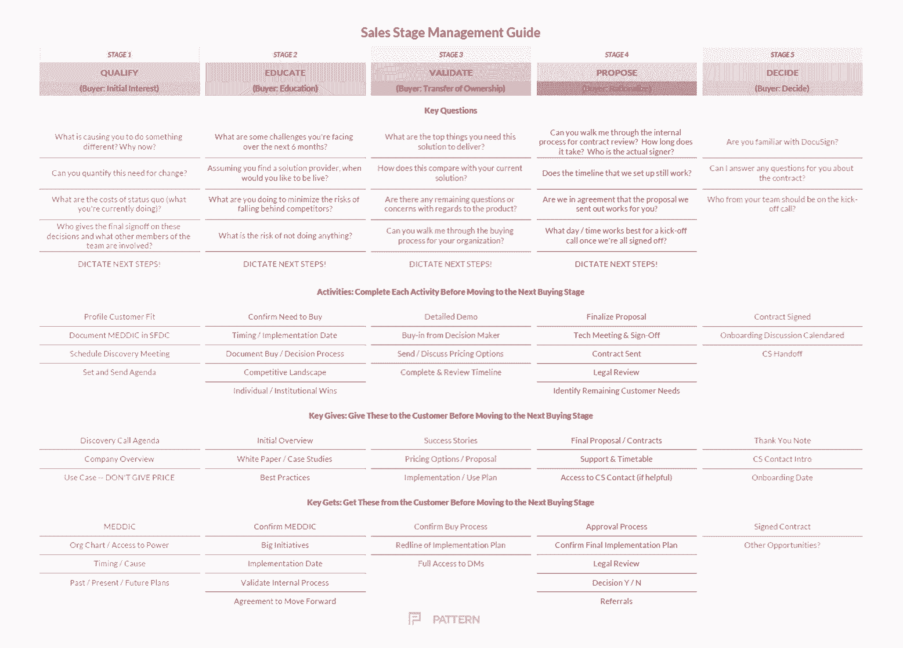

# 此销售计划推动每个成功指标

> 原文：<https://review.firstround.com/this-sales-plan-moves-the-needle-on-every-success-metric>

的联合创始人兼首席执行官德里克·德雷珀说:“建立一个销售团队就像经营一个每周必须生产 100 个巧克力蛋糕的厨房(你会发现，他很喜欢类比)。“你雇佣一名销售主管或副总裁做你的首席厨师，他们雇佣一群销售代表做你的面包师。只有在销售部门，我觉得我们经常把人们打发到他们的工作岗位，却没有食谱，甚至没有我们想要的蛋糕的图片。如果你这样经营厨房，那将是一场灾难。你最终会得到各种看起来完全不同的不可食用的蛋糕。这在销售团队中经常发生——交易失败，客户流失，目标错过— **这一切都是因为没有诀窍**。

Draper 曾是 Wildfire 的销售副总裁和 Google[x]的运营经理，管理过数百名销售代表的团队，亲眼目睹了有效销售流程的变革力量。他建议的**方法**得到了来自 [CSO Insights](https://www.csoinsights.com/ "null") 的真实世界研究的支持，表明像这样提升你的销售流程可以对关键销售指标产生重大的积极影响，包括:

销售代表对客户购买流程的了解(平均增加 24%)

销售代表关注正确客户的能力(平均+10%)

销售代表总流动率(平均-4%)

销售代表超过定额的百分比(平均+13%)

预测交易的成功率(平均+11%)

年销售收入(平均+12%)

在这次独家采访中，德雷珀与我们分享了这个多阶段计划的确切内容——天哪，它真的很细化。它甚至包括在交易的每个阶段应该问的问题。您将学习如何根据您自己的需求对其进行定制，并在您让销售代表参与进来时对他们进行培训。“在做过销售副总裁和创始人之后，我很清楚，考虑销售流程永远不会太早，”他说。随着时间的推移，事情会发生变化，但是从你雇佣第一个销售人员的那一刻起，你就希望他们知道有一个诀窍

# 为什么你需要一个新的计划

“总的来说，销售团队的沟通方式没有共同的语言或标准，”Draper 说。“你可能会将你的渠道分成不同的阶段，但如果没有明确的定义，这些阶段对不同的人来说将意味着不同的事情——这使得报告、指导和预测变得更加困难。”一个常用的销售笑话是，常见的流程往往是:

揭露

呕吐(开始谈论公司和解决方案)

演示(迫不及待地想告诉你我的产品！)

骚扰(你是要买还是怎么的？)

成交(提供折扣，以便 EOQ 达成交易)

在这种情况下，性能变得难以衡量和提高。“你抓住同样的老指标，比如人们打了多少电话，开了多少会。如果人们在努力工作，但你没有看到你想要的结果，那就不可能知道从哪里介入。你最终会给人们更多的时间来解决问题，直到为时已晚。”

新员工的销售培训通常是通过“口头传统”而不是清晰的书面说明和期望来完成的，这并没有什么帮助。在 Wildfire 的早期，培训主要包括第一天的演示和与客户经理的几次通话。这是他仍然在许多科技公司看到的，但这是一种失败的模式。

“仅仅因为某人有过去的销售经验并不意味着他们知道如何销售你的产品，”他说。“流程、故事、购买者角色、你需要提出的确认他们的问题——它们都是不同的，取决于你在做什么。

太多时候，我们期望人们潜移默化地学习，递给他们一部手机，告诉他们给我们带来一些客户。

买家比以往任何时候都更难预测。“在不久前，销售人员是客户获取大多数企业产品信息的主要渠道。“他们可以选择分享什么，”德雷珀说。如今，有了这么多唾手可得的信息，买家在与销售人员接触之前，通常对某个产品了如指掌。因此，**为了成功**，销售人员需要从信息提供者转变为增值顾问的新角色。证明你的产品可以帮助解决给定客户的关键问题是至关重要的。"

为了适应这一新的现实，许多销售代表最终会听从客户的领导，而不是自己来领导这一过程。他说:“在对业务了解不够的情况下，一旦有客户要求演示，他们就会马上开始演示。”。“应该在资格认定和发现上花更多的时间，帮助客户清楚地表达他们的问题，以便我们能够为他们制定正确的解决方案。否则，交易可能看起来非常有希望，但最终却烟消云散。”

由于上述原因，销售预测很少是准确的。管道可见性往往是不透明的，因为没有一个标准化的规则，很难确定每笔交易在流程中的位置。这种缺乏可见性的最常见症状之一是“曲棍球棒”——一些企业在季度的最后几天关闭了高达一半的收入目标。

当你是销售副总裁，而你的团队只剩下两天时间就完成了目标的 50%时，你创造杠杆的能力是有限的。这时，不太理想的销售策略占了上风——提供大量折扣或从下一季度开始提前交易。如果你幸运的话，你会达到目标，然后第二天醒来意识到你刚刚烧掉了你的管道，不得不再次经历同样的过程。

# 诊断您团队的问题

如果您对以下任何一个问题用粗体字回答“是”，您很可能会从制定更精细的销售流程中受益。

1.您的销售“流程”是否比 CRM 中的机会阶段名称更深入？对于这些阶段是什么以及销售代表在这些阶段应该做些什么，是否没有共识？“如果有人告诉你他们的交易处于第 3 阶段，这与你的第 3 阶段相同吗？你怎么知道？”

2.**你是否一直在试图弄清楚交易在哪里进行？**您是否总是催促您的销售团队去获取这些信息？“管道会议可能会变成审讯和政治迫害——有点像在军队里检查你的床铺。人们觉得他们需要在经理面前炫耀一番。他们捏造细节，提供片面的数据。很难知道从哪里开始，并提供帮助。”

3.**在一笔交易的后期，是否有很多潜在客户变得“暗淡无光”并放弃了？所有事情看起来都很有希望，但却突然内爆。当这种情况发生时，通常意味着在销售过程的早期跳过了真正重要的步骤，通常与发现相关。如果您没有很好地理解客户的痛点，您就错过了有效定位您的解决方案的大好机会。**

同样，取消资格和取得资格一样重要。如果你没有这种态度，你就会错过信号。前景黯淡。你最终在他们身上投入了大量时间，却没有得到任何真正的好处。

优秀的销售人员明白，最好的业绩和生产力来自于准确评估谁愿意或可能购买。

4.**你的销售代表是否不擅长估计某笔交易何时会成交？销售代表过于乐观，而买家通常不会考虑签订合同的所有步骤。销售代表经常接受他们从买家那里得到的过于乐观的时间表，然后交易不能“准时”完成客户内部的团体，如法律、采购等。突然冒出来，把整个过程拖得比预期的要长。**

“与买家合作，从一开始就概述整个购买流程，将有助于阐明达成成功交易所需的实际时间和步骤。德雷珀说:“作为一名销售人员，你销售产品的次数要比顾客购买的次数多得多，所以你的工作就是帮助他们了解最有效、最高效的购物方式。”

5.**销售预测的过程是不是一种很惨的体验？你的销售预测让你紧张吗？“大多数销售预测是基于真正不完整的 CRM 数据，”德雷珀说。“因此，作为销售副总裁，你需要花费巨大的精力去追踪每笔交易的每一个细节，否则你就会对现实一无所知。”两种选择都不合意。**

“我不止一次经历过这种悲惨的情况，盯着我的销售预测，不知道该相信什么，然后不得不走进董事会告诉我们的投资者，我们有信心在本季度达到我们的数字。在经历过那些时刻之后，我可以告诉你有一个更好的方法。”

# 使用此阶段管理模板提升您的流程

与顾问合作后，Draper 及其团队为 Wildfire 销售团队制作了以下销售**阶段管理指南**:

*[你可以在这里下载 PDF](https://www.slideshare.net/firstround/sales-stage-management-guide-first-round-review "null")**。*实施这一流程的效果已经得到证实，它带来了上述积极的变化。当然，这并不意味着对每个创业公司都是一个通用的解决方案。但是它是一个坚实的起点，您可以根据自己的需要进行定制。以下是德雷珀对此的逐步建议。

**1。尽可能客观全面地规划您的客户旅程。**

首先，回过头来剖析你最近做的几笔非常成功的销售。确定该过程中的里程碑和关键转折点。双方都有谁参与？时间表是什么？它们不一定是你最大的交易。你还应该描绘出快速达成的成功交易，或者让客户非常满意的交易。

德雷珀说:“挑选樱桃，所以你在寻找一个符合你希望的未来的交易组合。”“然后对重要时刻进行逆向工程:他们是怎么找到你的？他们公司有谁感兴趣？他们需要谁的批准？开了几次会？你一定要把它牵扯进来吗？那是什么时候的事？”

他说，当你看到交易之间的共性时，你可以开始进行模式匹配，并认识到你的产品可能会被购买。也许很明显免费试用有所帮助。也许在这个过程中早期的一个演示会有所不同。记下所有这些，以确定你的最佳阶段进展是什么样的。使用您确定的里程碑，概述您理想的上市时间和交易时间(包括每个阶段的目标时间)。当然它会有所不同，但这将成为你的核心食谱。

**2。定义您的流程(和您的客户)的关键里程碑。**

作为卖家，我们永远不应该忘记买家正在经历他们自己的过程，我们总是需要认识到这一点。创建理想的(可能过于复杂的)流程并开始将你的买家推向那条道路太容易了，这将导致糟糕的购买体验。

虽然为内部理解和沟通定义关键里程碑(阶段)至关重要，但将这些阶段与客户正在经历的事情联系起来也很有帮助。

例如，在 Wildfire，第一阶段在内部是合格的，但从我们客户的角度来看，这是“最初的兴趣”一个热切的销售人员兴致勃勃地关注着这个过程，他可能会急于证明一个新的潜在客户是合格的，而没有真正意识到这个潜在客户可能是一个真正伟大的客户，如果他们知道更多一点关于你的解决方案如何帮助他们的话。不要试图匆忙完成销售过程，记住你是在帮助顾客完成他们的购买之旅，而不是强迫他们完成你的过程。

根据产品的购买/销售方式，销售流程的各个阶段会有所不同，但常见的阶段与您在阶段管理模板中看到的类似。

“你的产品有一个理想的购买过程，就像有一个理想的销售过程一样。这两个过程会有所不同，但作为销售领导和销售人员，我们的工作就是尽可能地将它们协调起来。”

**3。用问题、活动、付出和收获来填写你的舞台管理指南。**

你可以在上面的图表中看到这一点。对于这一步，让更多的团队成员参与进来，集体讨论每个阶段的最佳方法是非常重要的。

“最好的流程将是你的团队相信并实际使用的流程，”Draper 说。“提出理想流程并自上而下推行的管理者总是会遇到怀疑或冷漠。您的销售代表是真正了解事情应该如何运作的一线人员。”

将销售过程中的每个阶段分配给一个由 2-4 人组成的小型工作组，由一个有成功记录的人领导。他们应该试着充实它。根据你的销售团队的规模和层次，有些人在不同的阶段会更负责或更积极。例如，销售开发代表(SDR)主要参与资格鉴定。因此，您可能希望在团队中安排一名初级 SDR、一名 SDR 经理和一名客户经理(AE)来定义该阶段。

对于刚刚开始销售的公司，让主要利益相关者参与进来，如创始人、销售副总裁/主管以及一两个一线人员(AEs、SDR )(如果你有的话)。

在这些分组讨论小组完成作业后，让大家一起按顺序评估各个阶段。你要确保这个过程看起来是连续的和平稳的，没有重叠或者过多的移交给不同的人。删除任何重复的问题或活动，并确保它包含您在步骤 1 中创建的大纲中的所有内容。

**4。让你的计划成为你文化的核心。**

作为一名经理，把这次会议的最终文件拿出来润色一下。用清晰、直观、易于参考的格式来表达。重要的是，人们要把这个计划看作是阻止匆忙和抄近路的一种方法。

“这份文件应该成为你的销售团队最重要的资源，”Draper 说。“明确说明这一点，并建议人们想办法将这一过程融入他们的每一次销售对话中。”在 Wildfire，Draper 的团队制作了层压副本，分发给每个销售人员，以供快速参考。

记住，这个任务很容易变得过于复杂。少即是多。如果你觉得你的计划变得过于庞大或混乱，考虑创建一个精简的版本，只有关键的螺母和螺栓放在人们的桌子上，一个更详细的版本放在你的 wiki 或其他中央存储库中供培训使用。例如，包括“要问的问题”，但可能不是你设计的所有“资源”。

这里的目标是有一个地图，你的卖家可以使用它来导航通过丛林，这是一个销售交易。该地图也非常有助于管理人员快速进入并评估某笔交易的进展情况，以及如何帮助保持正确的发展势头。

**总之:**

利用过去的交易进行模式匹配，绘制出你理想的时间表。

创建具有具体名称和序列的内部和外部阶段。

将你的销售团队分成小组，为每个阶段设计最佳方法；让最有才华或最成功的销售人员负责。

小组列出了在您进入下一阶段之前需要回答的所有问题。

小组列举了一个阶段中应该完成的所有行动/活动。

各小组清点他们在每个阶段都需要给予顾客和从顾客那里得到的资源。

召开会议是为了消除重复数据并理顺整个阶段序列。

经理或销售主管为整个团队润色并创建一份方便的参考文档。

领导层期望这份文件是销售你的产品的“黄金标准”,应该始终如一地遵守这份文件，以给团队带来最大的成功机会。

不用说，当你从更多的客户那里得到反馈或者从新的经验中学习时，你的计划应该是开放的。让计划的概念神圣不可侵犯，同时保持内容的灵活性。每一两个季度重新审视你的销售流程，考虑或做出改变，这并不是一个坏主意。

# 为什么这个计划有效

这一销售流程的主要优势在于，它为您的整个团队创造了一种通用语言，围绕您如何确认、管理和达成交易。当管道会议中的每个人都确切了解第 3 阶段交易时，您可以花更多的时间构思推进交易的方法，而不是花更少的时间寻找线索来确定实际发生了什么。这使得经理更容易询问交易的进度和状态，经理或更有经验的销售代表也更容易在需要时介入并提供帮助。但是还有一些其他的主要优势:

**你推行一种更具咨询性的销售文化。**

“今天，如果你想在销售方面取得成功，你必须投入时间去了解客户的问题，并找到一种方法将你的解决方案与他们的需求对应起来，”Draper 说。仅仅因为买家询问价格或想看合同而匆忙完成整个过程很少会有好结果。

正如他所说，如果销售代表不知道哪里有偷工减料的机会，他们永远不会发现自己在偷工减料。一个可靠的销售计划可以建立他们。“它设定了一种预期，即在推进交易之前，应该实现某些里程碑。销售代表喜欢走捷径或跳跃式前进，因为一般来说，他们是乐观主义者。但这意味着他们在早期阶段通常不会做彻底的工作，这意味着交易最终更有可能破裂。

销售人员相信，当有人告诉我们他们想买时，他们就会去买。一个中心过程确保我们不会跳过中间的步骤。

**培训和指导你的团队，以及评估他们的表现变得更加容易。**

有了计划，你突然有了“分阶段指导”的能力。

“如果我是管道会议的经理，我可能会说，‘嘿，布伦达，Acme 交易的情况如何？’德雷珀说:“她可以在提到《阶段管理指南》中的问题和活动时回答:‘好的，我现在处于验证阶段，这是我目前为止所做的工作。如果事情进展不顺利，原因就清楚多了。我可以请她回到探索阶段，以确保那里一切顺利。我可以问她客户是如何回答资格问题的——这给了经理更多的洞察力和空间来强化最佳实践。"

这比人们吹嘘客户已经要求演示，却不知道是什么让他们到了那里要好的多。如果事情在那之后偏离正轨，诊断这个问题就困难多了。了解每个阶段应该发生和已经发生的事情，也能让不成功的销售代表清楚自己的不足之处。

预测变得更加标准化。

德雷珀说，如果没有一个明确的标准，销售团队就会默认基于直觉的预测。

与其花时间去了解每个销售代表和经理是如何校准交易的，不如通过建立“标准”(阶段管理指南)来简化事情，并推动销售代表为交易处于特定阶段的原因进行辩护。如果他们不能证明为什么交易处于某个特定阶段，帮助他们找出哪个阶段是合适的，并相应地调整你的预测。

如果您的销售代表正确遵循您的流程，他们还应该为与客户的每笔交易制定时间表，这样他们的预测成交日期在默认情况下应该会更准确。

您流程中的鉴定阶段至关重要。当你有一份完整的、试探性的问题清单，列出你必须回答的问题，以便让潜在客户通过这一阶段时，另一方出现的交易更有可能达成。

与此同时，如果你已经计算出了每一个阶段需要多长时间(如果这些步骤被严格遵循的话),你就可以更加一致和准确地预测交易何时结束。

代表们感到被授权和支持。

“不管你有多有经验，作为销售人员加入一家公司总是令人生畏的，”德雷珀说。“从经验中学习总感觉太慢。得到这样一个过程就像在进入丛林之前得到一张地图和一把弯刀。没有那些东西你也能挺过去，但要痛苦得多。”

对于一个年轻的、经验不足的团队来说，有一个明确的计划是一个明显的优势。这给了他们信心，让他们相信他们正在学习的技能将在他们的职业生涯中使用。对于更有经验的销售人员来说，将一个过程分解成可管理的小块的练习为创新、利用现有技能和学习新技能提供了新的机会。他们也可以更信任经验不足的同事，这让他们卸下了重担。

# 训练你的团队将计划内化

在 Wildfire，销售计划之所以成为福音，很大程度上是因为围绕它设计的培训计划。

入职时，销售团队的每个新成员都会收到自己的层压副本。他们的第一周致力于在已经制定好的阶段上训练他们，以及每个阶段中的理想步骤。提供了实例并讨论了失败的教训。但这仅仅是开始。

该流程也是所有管道会议和一对一辅导会议的核心。经理们被指示使用文件上的特定语言来指导他们的团队和评估交易进度。“很明显，如果我们不这样做，人们会很快回到他们的旧习惯，”德雷珀说。“经理们无论到哪里都要带着这个计划，并在几乎每一次交易对话中使用它，这一点很重要。”

请记住，如果培训过于说教，或者如果让人们觉得他们必须完全按照你交给他们的地图去做，那么培训是不起作用的。Draper 说，事实上，很多培训应该建立在迭代和个人代理的概念上。他从两个方面看待这项工作:

让那些帮助你定义计划阶段的优秀员工在这个阶段进行培训。这样，他们会觉得有权力谈论他们为什么根据经验想出这个主意，他们提出建议的根本原因，在现实生活中如何执行这个计划，以及哪里有即兴发挥或打破脚本的空间。这也有助于让优秀的员工不断地对该计划感兴趣。

当有人进入你团队中的最佳表现者行列时，把他们拉到一边，说你需要他们的帮助，以确保现有的计划是最好的。如果他们看到了试验或新方法的空间，他们应该运用自己的判断并采纳它，只要它仍然以客户为中心并且是彻底的。当一些不同的工作，他们应该报告回来，使计划总是不断改进。

“作为一名经理，你实际上不希望你的流程每次都得到完美的遵循，”德雷珀说。“这就是你最终会失去员工的原因，因为他们的工作让人感觉乏味，这阻碍了你随着市场或客户的发展而发展。”

交易都是雪花。没有两个是相同的。你必须相信你的销售人员会根据他们对地形的熟悉程度进行调整。

作为一条经验法则，对优秀员工宽容一点，对新员工严格一点。你会惊讶地发现，每个人都会对坚实的指导心存感激，不管他们有多资深。

“这个行业的销售人员应该得到更好的工具，”德雷珀说。“他们中的许多人都有这种令人印象深刻的原始、自然的天赋，但他们受到不确定性、缺乏经验的队友、缺乏对产品或市场的了解的制约。通过努力，创业公司可以很容易地通过员工做得更好，释放他们的能力，同时获利。”

约翰·谢泼德的艺术。