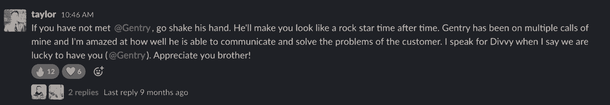
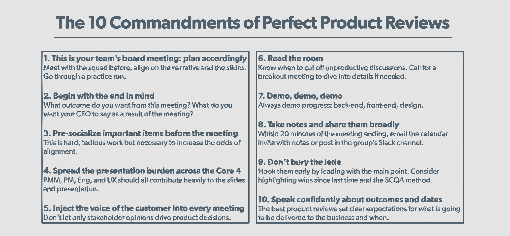

# 这位副总裁在产品部门以不同的方式做事——这是他的剧本

> 原文：<https://review.firstround.com/this-vp-is-doing-things-differently-in-the-product-org-heres-his-playbook>

去年年底， **[泰勒·霍格](https://www.linkedin.com/in/thogge/ "null")** 发了一系列吸引我们眼球的推文。在他的帖子中，霍格概述了他作为**[divy](https://getdivvy.com/ "null")**的产品和战略副总裁是如何“以稍微不同的方式做事”的。

他的哲学基础是项目经理是他们产品的总经理。现在，这在产品界并不是一个新概念。但对霍格来说，这是一个重要的起点。“产品经理的主要目标不仅仅是发布软件，而是交付业务成果。其他人可能会同意这种说法，但很少有人真正付诸实践，”他说。“我们选择做许多事情来加强这一角色的各个方面，这就是我去年分享推特的原因。**这不是一个很有争议的想法，但是我们在 Divvy 实现它的方式可能是**。

霍格是这样设计的:

项目经理拥有产品的实际收入数字——有时与收入团队一起——这意味着收入和产品团队更加紧密地结合在一起。

产品经理拥有与业务成果(如销售额、收入、增长率、边际贡献、CAC)挂钩的可变薪酬激励。

项目经理销售——他们参加销售电话会议，进行演示，并经常前往现场拜访客户。

产品和收入部门共同负责所有新公司的入职和注册，并独家负责所有 0-20 名员工的客户的注册和入职(因此销售人员可以专注于更大的交易)。项目经理对签约的新客户数量以及新客户成功加入的比率有目标。

项目经理每两周领导一次产品审查，这被视为与高管团队和其他关键利益相关者的董事会议。

这当然不是每个产品团队的运行方式——这就是为什么它会引发各种各样的“但是这实际上是如何工作的？”霍格在推特上回复的后续问题。我们希望深入了解这种方法是如何产生的，它在实践中是如何工作的，以及其他产品负责人可以考虑如何在他们自己的产品组织中利用这些相同的想法。

自 2019 年初加入 Divvy 以来，Hogge 有机会尝试让经前综合症更像 GMs，这是他长期以来一直在考虑的事情。“在加入 Divvy 之前，我在财富前线担任了三年的产品主管。在 Wealthfront，我们没有以完全相同的方式构建 PM 角色，尽管肯定有一些领域倾向于 PM-as-GM 模式。我总是想，‘伙计，我们真的可以更好地利用这个机会。’当我加入 Divvy 时，他们真的给了我机会，让我可以按照自己的方式建立产品组织。虽然有一些风险和我们正在关注的事情，但迄今为止，它似乎真的在起作用，”霍格说。

自从他加入 Divvy 以来，这个团队的规模已经扩大了两倍。霍格现在领导着一个大约 35 人的团队——包括 9 名产品经理和 7 名设计师，甚至还有一个 15 人的风险管理团队——这与他早年在科技领域的经历截然不同。“我实际上是从销售开始的。我肯定我们中的一些人，但我认为公平地说，大多数产品副总裁不是从销售经理开始他们的职业生涯的。从某些方面来说，我本质上仍然是一名销售领导者，我坚信产品人员可以从销售世界中学到很多东西，”霍格说。

在这次独家采访中，Hogge 分享了他的战术指南，介绍了产品团队如何变得更加以结果为导向，更加紧密地与销售保持一致，并在通往产品组织管理的不同方法的道路上避免一些潜在的障碍。从他对早期实现的印象，到他对这个已经实施了一年多的实验结果的观察，请继续阅读，了解为什么 Divvy 加倍使用这个方法。你也许不能把他的框架的每一部分都移植到你自己的产品组织中——但是我们确信这会让你思考。

# 从头开始建立一个注重结果的产品组织

"**无论你是否从我们的方法中吸取了其他东西，最关键的一点是，你需要将你的思维模式从项目经理扮演项目经理转变为** **[，如果你还没有转变为结果驱动型](https://firstround.com/review/mastering-the-art-of-the-outcome-how-guru-turned-customer-success-into-a-company-cornerstone/ "null")** **。**明确地重新调整您的产品团队，让他们专注于向客户和企业交付成果。其他一切都是次要的，”霍格说。

他非常清楚，这一转变需要不断尝试和犯错。霍格在 Twitter 上概述的 Divvy 当前的系统并不是他在公司的第一天就形成的——这是一个演变。正如霍格喜欢说的那样，“它是逐渐发生的，然后突然发生的”。

Divvy VP of Product and Strategy, Tyler Hogge

# 正确确定项目经理的角色:总经理、首席执行官还是 scrum master？

事实上，他们一开始就采取了完全不同的策略。“当我第一次加入 Divvy 时，我们有这样的想法，总经理将与项目经理合作，总经理代表业务，项目经理代表产品。但是我们发现它效率很低。它创造了一类独立于客户的 GMs，没有得到工程师的尊重。他们不能把他们认为应该建造的东西付诸实践，因为他们不是总理。另一方面，项目经理向总经理汇报，这削弱了项目经理作为项目经理的权力，”他说。

这里有一个霍格早期在 Divvy 的例子，说明了这种冲突:“我们推出了一种新的方式，让公司在信用卡之外支付账单。它导致了这种摩擦，因为账单支付的项目经理并没有真正考虑账单支付产品将会产生的花费或数量。他只考虑什么时候发货，交付什么——而不是附带的结果。霍格说:“突然之间，通用汽车陷入了业务成果的困境，却没有能力真正实现它们。

为了启动将结果和可交付成果联系起来的转变，Hogge 将以前分离的 GM 和 PM 角色合并为一个。“当我们过渡到 PM-as-GM 时，同一位 PM 建立了支出量和账单支付的仪表板，他开始调整他的路线图，以实现最大的支出量。他开始与我们的财务团队会面，以在模型中构建他将签约的收入。总理说，“这是我要交付的，我将拥有这个号码。”他说:“这是一个转变，让我们的项目经理能够这样思考。

交付里程碑对于任何公司的项目经理来说都是至关重要的。项目经理们应该关注的真正问题是:这个软件在取悦客户的同时，是否为企业创造了你想要的结果？

这并不是说运输是 PM 角色的一个不重要的方面— [成功的执行和可预测的交付](https://firstround.com/review/trellos-product-lead-on-the-unique-ramp-to-a-10-person-product-org/ "null")对于在保持客户满意的同时推动稳定的上升和正确的轨迹至关重要。Hogge 专注于让他的项目经理通过一套双光眼镜来观察他们的工作，其中一个镜头坚定地定位于为客户辩护，另一个镜头专注于业务成果。

“客户永远是第一和最重要的利益相关者，但也有一个重要的第二利益相关者，这就是业务。我总是引用 Flexport 首席执行官 Ryan Petersen 的一句话:“项目经理喜欢为一件事进行优化，但伟大的项目经理不会只为一件事进行优化。”如果你只是为了让顾客开心，你最终会让一切免费。如果你让所有的东西都免费，你建立价值的障碍就少了。但是，如果你退后一步，问自己，“我如何在此基础上建立一个可行的企业？”嗯，这意味着我们可能不得不向客户索取一些东西，如果我们要求为产品付款，那么我们最好打造一个令人惊叹的产品。它们相互依存，缺一不可，”霍格说。

“对我来说，这又回到了行动胜于言语的重要性。产品世界已经让“项目经理是首席执行官”成为一种口号，而没有真正将这种精神融入到他们的日常运营中。经前综合症通常没有权力这样做。霍格说:“如果你的项目经理不负责实现收入目标和他们自己的损益，称他们为产品首席执行官只不过是保险杠贴纸上的标语而已。

如果不彻底改变产品组织的运作方式，就别指望会有截然不同的结果。更进一步，问这样一个问题:作为产品领导者，你做了什么来创造条件让你的项目经理真正关注结果？

# 如何帮助项目经理选择正确的结果

虽然收入可能是优化和激励项目经理最直接的结果，但这并不意味着它是所有产品的最佳选择。“我在推特上说 Divvy 的项目经理拥有新产品的实际收入数字，他们达到了这些数字，”Hogge 说。

"**我收到了一些批评者的来信，他们说，‘嗯，并不是每个产品都与收入直接相关。’确实如此——您可以使用同样的结果驱动模型来跟踪其他指标**。我们目前有两名项目经理负责降低 CAC，三名项目经理负责提高边际贡献。他们围绕实现这些成果来调整整个路线图，”他说。你可以用几种不同的方式来应用这种风气。”我们每个月都会签下数百名新客户，但我们希望我们的客户成功专家将精力集中在大客户身上，通过增加他们在我们公司信用卡上的支出。为了解放我们的客户成功团队，我们已经要求两个产品团队专门负责 0-20 名员工的所有公司的入职培训。这意味着产品正在构建入职教程、Divvy 大学视频，甚至每周举办网络研讨会来培训小客户。"

为了进一步说明他的观点，霍格提出了这个假设:“这都是关于选择正确的结果和[最能指向成功的指标](https://firstround.com/review/im-sorry-but-those-are-vanity-metrics/ "null")。比方说，Pinterest 的 PM 希望提供非凡的钉住体验，即使没有人明确为此付费。那么商业结果是什么呢？他说:“他们可能希望增加每日活跃的 pinners 的数量。“但是，将首相的薪酬与这种行为的 X%增长联系起来，然后就此收工，可能是一个错误。深入挖掘。*为什么*你想增加每日活跃 pinners？因为这增加了用户的 LTV。因此，即使项目经理的责任似乎因收入而减弱，但如果你深究原因，你最终可以追溯到你希望向企业交付的成果，同时仍将客户体验放在心上。”

确定你追求的根本结果——不要先选择指标。以让客户满意的方式取得成果——不要忽视这一点。

霍格揭示了先从产品指标入手的危险:“继续以 Pinterest 为例，你真正想要的——你所追求的结果或愿景——是创造一个粘性很强的产品，让你长期留住用户，保持良好的体验。只有到那时，你才能选择决定结果是否达到的指标，”他说。

“从产品指标开始的问题是，有很多增加每日活跃 pinners 的方法都不会带来很好的结果。你可能会产生不利于根本结果的不正当激励。粗糙的产品选择可能会在短期内改善牵制行为，但它们不会最终改善 LTV。取而代之的是，向团队指出业务成果，让他们决定指示进展的度量标准。**如果指标移动了，但总体结果没有移动，那么你就搞砸了**。

# 维持变革

Divvy 的产品团队将这种结果驱动的思维模式贯穿于产品旅程的每个阶段，一次又一次地回到这些目标。“在我们的产品评论中，我们非常注重阐明我们希望每个产品或功能带来的结果，无论是增加收入、保留率、采用率还是 CAC。每一项倡议都与结果相关联。相对于结果，我们是否取得了进展？运输软件不是一个结果。任何人都可以出货，”他说。

# 与销售人员一起:产品，见见你的新闺蜜

但是产品不能在真空中推动结果——它需要在整个过程的每个步骤中与销售紧密配合，从构思到发现潜在客户再到达成交易，让“PMs 拥有结果”不仅仅是一句公司格言。销售永远是一项团队运动，但是霍格在 Divvy 的产品团队将这一理念推进了一步。项目经理不仅仅是帮一个特别棘手的潜在客户的忙来帮助销售——这是他们角色和职责的核心部分。

“**在 Divvy，我们的项目经理销售——这确实是整个系统的关键**。他们加入销售电话，他们做销售演示，当我们不在疫情时，他们和销售人员一起去帮助与更大的潜在客户达成交易。我们都在同一条船上，朝着同一个方向划着船，”霍格说。

这里似乎有几个绊脚石——要么是产品过度参与销售的日常角色时的地域主义风险，要么是担心项目经理会花太多时间销售，而没有足够的时间发货。从霍格的角度来看，这些担心都是没有根据的。

“我想不出一个销售人员对产品即将进入并可能踩到他们的脚趾感到任何痛苦的例子，原因是这样的:首先，作为一名销售人员，当他们开始提出产品问题或产品要求时，这总是与潜在客户进行的最棘手的对话之一。他说:“你实际上不能承诺任何事情，因为你无法确定什么时候会发货。”

“第二，即使销售人员说，‘*是的，我们会为您建造它*’，潜在客户也不太可能相信他们有能力实现它。但是当一个产品人员在房间里，他们说，'*这些是非常有趣的要求，我们知道其他客户也有这样的需求，我实际上负责产品路线图。它计划在下个月发布，我们应该一起努力让它看起来更好，这样我们做的东西会让你感到愉快*’—这改变了整个对话的动态。**我有无数的例子，销售代表说让产品经理加入这些销售电话绝对是游戏规则的改变者，**”霍格说。

An example Slack message from an appreciative Divvy sales rep. Image provided by Hogge.

很明显，销售人员受益于有产品经理在场来分担工作量和说客户的语言，从更快地达成交易到接近完成他们的配额。但是项目经理们在这笔交易中吃亏了吗？霍格坚信事实并非如此。

“产品经理面临的最大挑战之一是确定优先级。当你把一个 PM 留给他们自己的设备时，有一种过度智能化产品管理的趋势。**问题应该简单地说:** **这个卖吗？客户真的想要这个吗？是市场在把我们拉出来吗？这会带来我们想要的结果吗？**当产品与销售步调一致时，这些问题的答案会更快变得显而易见，优先顺序也会变得清晰，”Hogge 说。“它还能激发创造力。与客户的任何互动都有助于打造更好的产品。当我们的项目经理加入销售拜访时，他们会利用这一机会进行发现，他们会检验想法，同时也会开发销售机会。”

Hogge 希望他的产品团队在他们的日历上留出时间来与销售团队联系——重点关注处于最关键时刻的潜在客户。“每当我开始谈论这种模式时，有些人马上会认为项目经理把所有时间都花在了销售或打推广电话上，但事实并非如此。如果项目经理被包括在内，他们就会跳到漏斗的底部。”

# 增加薪酬:如何重新思考对项目经理的激励

将收入和产品团队与特定产品的共同目标和业务成果结合起来，并在整个构建和销售过程中支持这一承诺，可以大大消除通常将销售和产品分开的障碍。但如果你发现这种以结果为导向的方法不太管用，那可能是时候重新考虑包括可变薪酬在内的激励措施了。

霍格提醒我们，虽然这可能是大多数人认为他的计划中最引人注目的支柱，但可变薪酬结构牢牢植根于他在 Divvy 的整个产品组织中注入的同样的结果驱动的精神。“它从确定项目经理正在开发的每种产品的业务成果开始，并阐明与该成果最密切相关的指标。他说:“然后，你要建立一个激励结构，奖励达到目标的项目经理。”

“我的意见是，尽管现金部分可能会发挥作用，但它应该严重倾向于股票。许多年轻的公司忽略了真正考虑后续奖励的力量，但优秀的员工希望，如果他们在多年内表现良好，他们的股权可以翻倍(或更多)。”

伟大的 pm 是建造者，而建造者希望有机会拥有他们所建造的东西的股权。

霍格经常发现自己在塑造自己的产品组织时借鉴了销售剧本。“我们都非常熟悉销售人员的配额，但对项目经理的薪酬激励肯定不那么普遍，这可以解释为什么这么多产品负责人*说*他们注重结果，但实际上很少有人这样做，”他说。

“在 Divvy，销售正在朝着他们的配额前进，但他们与产品保持同步。产品部门正在竭尽全力帮助销售达到这个数字，因为项目经理通常都与这个数字保持一致。”

我希望我们成为世界上收入和产品最紧密结合的团队，这种结构正让我们朝着这个目标前进。

Hogge 在这里提供了一个实践中的例子:“在与 Divvy 签约后的头几个月，我们有一个专门负责客户的项目经理，以促使他们消费。他的衡量标准是处于客户周期上升阶段的客户的支出目标，实现这些目标意味着有意义的权益。

与任何不断发展的项目一样，在前进的道路上，不断完善正确的奖励结果需要一些修修补补。“作为一个公司卡和费用管理平台，在 Divvy，我们一直在寻找机会降低客户刷卡时的下降率。霍格说:“最初，我们有一个项目经理在开发软件，帮助减少被拒绝的过渡数量，如果他们达到了目标，就会增加股权。”

“我们意识到，下降指标与我们想要实现的结果并不完全一致，我们想要实现的结果是为我们的客户提供更好的体验。事实上，有些下降是好的——比如在欺诈的情况下。从那以后，我们就不再与这一特定结果保持一致。”

在 Divvy 任职期间，Hogge 看到了这种方法是如何推动 PMs 水平上升的——结果是公司发展得更快了。

“最近，我与我的一位项目经理进行了一次事后分析，他非常努力地推出了产品的第一个版本——他最终比预期提前了两个月交付了产品，因为他真的很有动力为企业创造这样的成果。我问他，“如果你没有这种可变薪酬计划，你会这么努力吗？”他说，我很想说是，但我可能不会被逼得这么急着早点把这件事弄出来。我真的很欣赏他在回答中的诚实。霍格说:“有了这种心态，我们的企业就能走得更快。”。

"**非常清楚，这并不是因为团队“更加努力了”而提前完成的有了额外的动力，项目不会变得更快。“更确切地说，这迫使他[更加仔细地研究 scope](https://firstround.com/review/The-one-cost-engineers-and-product-managers-dont-consider/ "null")，结果是确定 scope 可以被削减，第一个版本可以更快地发布，”他说在缺乏激励的情况下，我发现项目经理通常没有足够的紧迫感，或者没有参与到需要与关键利益相关者进行的关于范围界定的尴尬对话中。"**

可变的 comp 更像是一种强制功能，它将项目管理集中在范围较窄的商定结果周围。“每当产品经理发货时，他们都在试图弄清楚能让客户满意的[最低可行产品是什么](https://firstround.com/review/dont-serve-burnt-pizza-and-other-lessons-in-building-minimum-lovable-products/ "null")。但是经前综合症倾向于让完美成为好的敌人。专注于与激励一致的结果可以防止范围扩大，因此他们不会对那些值得拥有的项目和功能进行长期投资，但最终不会以有意义的方式与更大的目标联系起来。”

每天你选择做某事是一个昂贵的选择。你想让经前综合症感受到那种重力。

# 潜在的产品组织陷阱——以及如何避免它们

霍格当然认识到这种方法会招致怀疑和后续问题。我们在这里收集了其中的一些，霍格带我们浏览它们，概述一些风险和他对如何规避它们的想法。

# 项目经理的可变薪酬不会将重点从长期转移到短期吗？

“我听到的批评是，你在鼓励产品经理考虑得过于短期。他们不应该被激励立即完成交易，他们应该考虑如何在未来一两年内开发产品。为了更清楚地说明这种风险，让我们回到之前的 Pinterest 例子。你最终可能会过度设计产品来锁定行为，或者采取黑客的方式来增加日活跃用户，从而失去用户的信任。我同意这是一个合理的担忧——但有办法减轻它，”他说。

"**选择短期和长期结果**。您可以将您的 PMs 与一个近期目标相结合，以增加每日活跃用户，同时用一个更大的目标来激励他们将业务扩大 10 倍。有办法平衡这些事情，使它们不会变得过于短期。回到我之前的观点，以股权而非现金的形式向项目经理支付可变薪酬，可以帮助他们着眼于长期。”

像任何一套商业目标一样，都有短期的结果和长期的 okr。拥有一个并不否定另一个——伟大的领导者知道如何激励人们不断向两者推进。

无论你是否考虑调整项目经理的薪酬结构，每个产品副总裁都必须想出创造性的方法来让他们的团队平衡短期和长期目标。对于 Hogge 来说，这是关于推动一个全面的，创新的产品愿景，同时在这个过程中进行渐进的改变，让你更接近这些目标。“这是我从我的导师,[财富前线的首席执行官 Andy Rachleff](https://www.linkedin.com/in/rachleff/ "null") 那里借来的。[他说](https://foundr.com/product-market-fit-andy-rachleff-wealthfront "null")，“**产品团队必须双手并用——他们必须既利用又探索**。”你通过制造更好的产品来剥削。但是，如果你只专注于使现有的产品更好，你永远不会真正找到你的公司所能提供的全球最大化。因此，产品团队负责扩展现有产品，同时探索其他可能性。霍格说:“大多数产品组织在这两者中的一个方面都不出色，更不用说两者都出色了。”

# 这是否限制了谁能成为成功的项目经理？

“当你重新思考项目经理的角色时，[它实际上改变了你招聘的人](https://firstround.com/review/find-vet-and-close-the-best-product-managers-heres-how/ "null")。你必须招募更多的 GM 类型的人——像商业人士一样思考的人，同时也了解如何构建漂亮的软件体验。霍格说:“这意味着你可能不太可能只雇佣技术含量高的项目经理。

“有人回复了我在 Twitter 上的原创帖子，问道，‘这难道不是真正外向、有魅力、外向型的经前综合症的自我选择吗？’虽然这是一个合理的担忧，但我实际上不这么认为。我们团队中有很多人现在担任总经理，他们不是你所说的那种刻板、外向、活泼的类型。他们很内向，很有想法，比较安静，更喜欢听而不是说。但他们在工作中表现非凡，因为他们推动结果。他说:“有很多不同的性格类型可以做到这一点。

当谈到[招聘项目经理](https://firstround.com/review/our-6-must-reads-if-youre-hiring-a-product-manager/ "null")时，我们希望获得[面试问题](https://firstround.com/review/40-favorite-interview-questions-from-some-of-the-sharpest-folks-we-know/ "null")的内部消息，霍格利用这些问题来挖掘这种以结果为导向的方法。以下是他放在后口袋里的三个问题和后续问题:

**问题:作为产品经理，你最自豪的成就是什么？这表明他们是否是结果驱动的。霍格说:“如果他们只是谈论运输，而没有任何明确的可衡量的结果，他们就不是我们需要的那种心态。”**

**跟进:那项成就带来了什么？“有些项目经理可以采取下一步措施，然后说，‘好吧，这带来了 X 倍的收入。’这比一些答案要好，但你必须更进一步，”他说。**

**额外跟进:结果和你说的相比如何？**“这是大多数项目经理努力的地方，因为他们通常不预先定义清晰和可衡量的结果，所以他们不确定结果与预期相比如何。一个很好的答案可能是，“我们希望在年底达到 50%的采用率，而我们实际上达到了 65%。”成功和取得的成就有明确的背景。"

霍格说:“如果你不得不不断敦促候选人考虑业务成果，而不仅仅是坚持交付成果的时间表，那么他们可能很难满足你所寻找的产品经理类型的需求。”

优秀的候选人可以一口气说出他们帮助推出的每个产品的结果。

# 奖励结果会扼杀实验吗？

无论你的产品仍然处于隐形模式还是成熟模式，试验和快速失败是适应和保持敏捷的关键。“我得到的关于这种模式的最大问题之一是，它是否会使 PMs 在尝试新事物和测试新功能时更加犹豫。霍格说:“实际上，我认为情况恰恰相反。

“在风投资助的初创企业中，注重结果的文化，从定义上来说，你关注的是*大结果。如果你相信大的结果通常来自大的实验，那么注重结果的项目经理实际上更有可能做出大的变动。在某些方面，产品管理就像选择一家公司作为投资者:你更关心成功的幅度，而不是成功的概率。也就是说，你希望你的团队有时能在高收益的情况下大幅波动，即使这是有风险的。如果你是一个棒球迷，想想击球率，而不是击球率。从这个意义上说，对结果的痴迷实际上鼓励了实验。”*

继续棒球的比喻，不是每一个产品或功能都可以是全垒打——留下回旋的空间，错过解锁那些啊哈时刻。“在 Divvy，我们仍然能够测试不同的想法和实验，而不会让项目经理担心他们的薪酬，”他说。“关键是要知道什么时候是将产品与业务结果联系起来的最佳时机。你需要考虑人们被要求交付的产品有多成熟。”

但是，您如何知道一个产品何时准备好推出，以及何时与项目经理所关注的业务结果相关联，例如收入、CAC 或采用？我们很高兴地得知，霍格的解决方案依赖于另一篇评论文章的建议:超人首席执行官拉胡尔·沃赫拉的寻找产品/市场契合度的 T2 框架。如果你还没有读过，基本要素是沃赫拉的方法扩展了一个测试，该测试首先由增长大师肖恩·埃利斯提出:**当一家公司问他们的客户“如果你不能再使用该产品，你会有什么感觉？”如果 40%或更多的用户回答“非常失望”，那么这家初创公司可能有强大的吸引力。不到 40%，该公司几乎一直在努力寻求增长。**

霍格采用了这个 40%规则来确定何时将产品或功能与结果联系起来是公平的。这里有一个例子:“我们的报销产品处于测试阶段，我们对客户进行了民意调查，询问他们如果我们放弃它会有多失望。一旦我们发现 40%的客户表示他们会感到失望，我们知道我们已经准备好开始计划全面推广，包括为 PM 制定薪酬激励计划。在这种情况下，我们努力实现的结果是由报销产品推动的年度经常性收入。”

# 核心产品基础设施工作会受到影响吗？

大幅波动很重要，但可靠性也很重要。为了确保质量不会被牺牲，核心产品工作仍然处于中心位置，霍格的建议是:“产品团队需要定义他们的原则，帮助他们进行这些基础设施和技术债务的权衡。例如，在 Divvy，我们的首要产品原则是质量是我们的北极星，”他说。“我们甚至进一步将质量的一条腿定义为性能——它加载速度快。这使得权衡讨论更加容易。如果质量是固定的，我们将质量定义为必须在 500 毫秒内加载，如果有基础设施支持，我们必须优先考虑它。”

你不希望你的产品组织如此不顾一切地追求他们的数字，以至于他们获得了短期思维的名声并失去了工程师的信任。构建高质量的产品本身就是一项业务成果。

# 跨职能合作伙伴不会妨碍你吗？

销售、财务、工程、营销——产品经理确实是所有这些主要机构之间的结缔组织。如果你想给项目经理一个公平的机会来达到(并超越)他们的目标，那么巩固你与这些关键利益相关者的伙伴关系也是必要的。

“打造一款成功的产品依赖于众多因素的共同作用——仅靠项目经理的意志力是无法完成的。这就是产品审查会议发挥关键作用的地方。他说:“虽然产品评审通常旨在让所有相关方达成一致，但它经常会让项目经理处于守势，回避关于时间表延迟、客户投诉和范围蔓延的问题。

"**当产品评审转变为只报告最新交付成果的项目经理时，他们并不拥有成果，他们只是运送软件。霍格说:“在 Divvy，我们认为产品评审是小型董事会，产品经理是产品的首席执行官。**

当然，这些会议是以结果为导向的。“每个产品团队——共有九个——每两周进行一次产品评估。这些活动由项目经理领导，设计师和工程主管提供协助，邀请高管和其他主要利益相关方参加，包括我们的首席执行官、收入、客户成功和工程主管。在这些产品评论中，我们仍然高度关注每个产品或功能的预期结果，而不仅仅是交付软件的交付成果。我们向每一位领导者展示结果的进展，并在叙述、我们追求的结果或过去两周我们从客户那里了解到的新见解上保持一致。它让人们，无论是首席执行官还是我们的收入主管或其他人，都有机会指导这一结果，并提供投入。我们非常重视他们的想法，”霍格说。

产品审查也是谈判发生的会议。“产品可能会说，‘这是我知道这个产品会有销路，能够产生我们想要的结果的时候。’财务部门可能会回答，“抱歉，这还不够快。这个来回是关键。他说:“如果你想激励你的项目经理取得成果，你必须让他们与组织中对最终结果有影响的其他部门保持一致。

“如果你问我们的首席执行官，他会说这是我们实施的最有价值的事情之一，因为这只是每两周半小时的会议，但它促进了我们作为一个组织的一致性。”为了更有策略，霍格分享了他训练团队的原则——他称之为完美产品评论的 10 条戒律:

Hogge's 10 Commandments of Perfect Product Reviews

# 将所有这些联系在一起:

回到开始的那条线索——霍格方法中产生最多后续问题的部分是关于基于达成既定目标的可变薪酬的支柱。但这只是他方法的一部分。

“到目前为止，我们已经在 Divvy 采用了这个框架，并取得了一些成功。但不管你如何推出它，或者你是否做可变薪酬，每个项目管理团队都需要转变为拥有成果——毕竟这是你想要的元成果，”霍格说。

“你们的产品经理不仅仅能够让工程保持正轨。让他们有机会思考航运软件之外的事情，看着它们一飞冲天。”