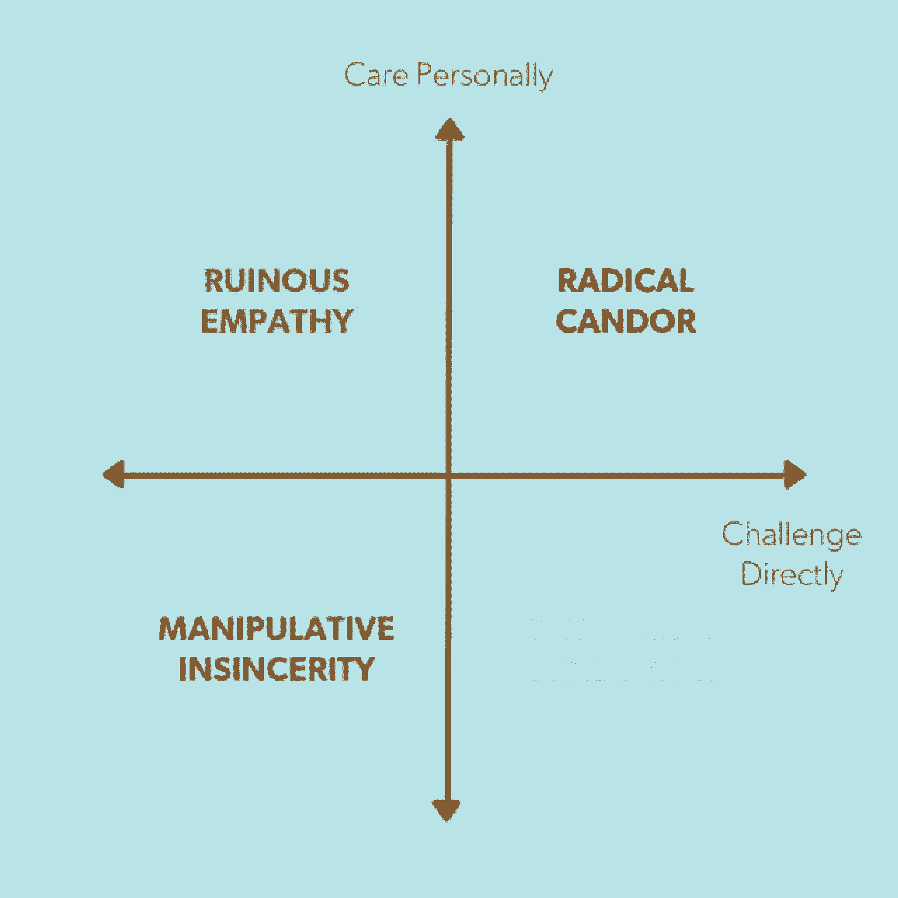

# 关于性别和激进坦诚的思考

> 原文：<https://review.firstround.com/thoughts-on-gender-and-radical-candor>

*本文作者金·斯科特(**[@金博尔斯科特](http://www.twitter.com/kimballscott "null")**)**[激进坦诚](http://www.radicalcandor.com "null")* *公司联合创始人兼首席执行官，前谷歌和苹果高管，Twitter、Dropbox、Shyp 等公司的顾问。去年秋天，她第一篇关于激进坦诚的帖子迅速走红。在这里，她从一个新的角度看待这个话题。*

为了纪念昨天的国际妇女节，我想探讨一下为什么性别问题会让男性和女性在工作中更加难以坦诚，并提出一些解决这个问题的想法。下面是简短的版本:

性别政治和对眼泪的恐惧促使男人不再像对待其他男人那样对女人坦诚相待。这对男人，对女人，对真相都不好。性别偏见使女性远离彻底的坦诚，这种方式对男性、女性和真相都不利。

在我解开这些陈述、讲几个故事并提出一些解决方案之前，我将简要解释一下'[激进的坦率](http://firstround.com/review/radical-candor-the-surprising-secret-to-being-a-good-boss/ "null")'。

# 彻底的坦白

坦诚的困难不是性别问题。每个人都很难接受它。去年 11 月，我在[第一轮 CEO 峰会](http://firstround.com/review/radical-candor-the-surprising-secret-to-being-a-good-boss/ "null") **上做了一个演讲，描述了激进的坦诚，即**以直接挑战他人的方式给出反馈的能力，同时表明你个人关心他们。**

激进的坦诚很少见，因为批评员工会让人觉得残忍，表扬员工会让人觉得高人一等。但正如风险投资家本·霍洛维茨(Ben Horowitz)曾在他的管理博客中所说的那样，赞扬和批评是“非自然的原子积木，非自然的管理技能集就建立在它的上面”给予表扬和批评只是开始。伟大的老板也必须从员工那里得到批评，尤其是批评，并且鼓励他们之间的批评。

在分析为什么表扬和批评对大多数人来说是如此“不自然的行为”时，我发现有两个特别常见的原因:

大多数人在学会说“如果你没有什么好话要说，那就不要说”的时候就已经学会了。当他们成为老板时，他们从 18 个月大就被教导不要做的事情突然变成了他们的工作。

大多数人，自从他们 18 岁左右找到第一份工作——那时他们的自我很脆弱，但他们的个性刚刚开始形成——就被告诫要“专业”通常，这是不与工作中的任何人“私交”的暗号。但是要有效地给予表扬和批评，*你必须亲自关心。[你必须关心和你说话的人。关心是你的工作。](http://firstround.com/review/My-Management-Lessons-from-Three-Failed-Startups-Google-Apple-Dropbox-Twitter-and-Square/ "null")*

这就是为什么非常坦率是困难的。让它变得更容易的最好方法之一是提醒人们当他们没有亲自关心和直接挑战时会发生什么。

讨厌的攻击性是当你挑战，但不在乎时发生的事情。根据我的经验，80%的管理错误都是毁灭性的同理心造成的。最后，最糟糕但幸运的是相对罕见的，是**操纵虚伪** — 当你既不关心也不挑战的时候。

**我把它归结为一个有四个象限的框架:**

性别如何在这些象限中发挥作用？让我们仔细看看。

# 为什么性别政治&害怕流泪让男人更难彻底坦白

我最近和一位物理学教授聊天，他的学生不知道二次方程。(高中代数我也不记得了，但我不是物理专业的。)感到震惊，不知道她是如何在知识如此匮乏的情况下走到这一步的，教授告诉她需要立即学习。她对批评感到愤怒，在他的教师评级中猛烈抨击他。

这一开始并不是一个性别问题，但后来却成了一个。最初的问题是，这个年轻人，像许多其他人一样，不习惯于批评——这一现象在《大西洋月刊》的一篇我喜欢的文章中有很好的探讨，[美国人的溺爱](http://www.theatlantic.com/magazine/archive/2015/09/the-coddling-of-the-american-mind/399356/ "null")。但是这位教授的同事，他们中的许多人都是善意的，试图对性别问题保持敏感，不知何故造成了裂痕。突然之间，告诉一个主修物理的学生她需要学习二次方程成了这所学校的教授们要做的一件冒险的事情。

这种情况对于没有学到成功所需知识的学生来说很糟糕。这对这位教授在她之后教的所有女学生都不好。可以理解的是，他比他的男学生更不愿意批评他的女学生的工作。但是为了在她们的领域里成长，这些年轻女性，像她们的男性同行一样，*需要他的批评。这种情况对教授来说也没什么意思。真正的教学——他选择这个职业的原因——变得有风险。*

这种情况表明了一种趋势，这种趋势正在高等教育领域掀起一场完美风暴，并席卷当今千禧一代工作的所有公司:

现在的趋势是不去批评，甚至不去让人们接触那些可能被认为是来自历史、文学或任何其他领域的“令人不安”的事实。再加上性别政治，学习受到了真正的打击。当前“校园谈话”(或缺乏校园谈话)的基调是否会适得其反，减少女性的指导和学习？在这篇文章中，我关注的是性别，但是在种族中也有重要的相似之处——任何时候的关系都跨越了群体的界限。

二次方程的奇怪例子是极端的，但更温和的例子每天都在发生，不仅是大学生，还有在以数据驱动为荣的公司工作的中年人。

最近，我和一位亲密的男性朋友聊起了女性在科技领域的问题，他是一位工程领域的领导者。我建议他去问问为他工作的一位女士——他多年来一直支持和培育她的事业——她的想法。他抬头看着我，非常惊讶。“我不能跟她谈这个！这太令人担忧了，”他说。

这句话出自一个人之口，他不仅没有偏见，而且对偏见非常敏感，并决心消除偏见。他能捕捉到我错过的东西。所以，如果他不能和一个他非常了解的女人就性别问题进行彻底坦诚的对话，我们就真的陷入了低谷。但问题不在于他，也不在于为他工作的那个女人。我认识他们两个，我很确定谈话会很顺利。而是围绕性别问题的漩涡让每个人都如履薄冰。

另一位男同事最近因为对工作场所的性别问题提出了一个重要且合乎逻辑的观点而引发了一场轩然大波。他使用的短语被断章取义，并在媒体和社交媒体上大肆渲染。这是另一个致力于公平对待每一个同事的人，并经常投入额外的精力来促进女同事的职业发展。但是在这次混乱之后，他决定不再公开谈论性别问题。我不能责怪他。但这是对极端坦率的又一次打击，也是对一个重要话题上的文明对话的又一次打击，在我看来，他是站在正确的一边的。

我们必须停止性别政治。

**关于害怕眼泪的一些想法**

当然，并不总是政治导致男人对女同事手下留情。同样，他担心如果他批评她，她会哭。我最近听说了一个故事，一个女人和一个以强硬著称的男人一起面试一份工作。在给她这份工作之前，他问她:“你能保证不管我对你说什么你都不哭吗？”

他如此坦率地说出自己的恐惧，值得称赞。但也许一点点分析就能帮助他克服这些困难。首先，男人也会哭。我记得有两个为我工作的人在我给他们反馈后哭了。一个是男人，另一个是女人。

第二，如果你告诉某人他们不能哭，他们几乎不可避免地会哭，而且不可能停下来。(这就像托尔斯泰的哥哥告诉他，除非他不再想一只白熊，否则他不能离开房间的角落。《白熊》占据了托尔斯泰的思想，成为我们的。)

第三，当有人哭泣时，这不是你的错。你无法控制另一个人的情绪。

第四，如果他们哭了，这不是一场灾难。你不会融化(他们也不会)。正如一位智者曾对我说的，“我从未听说过有人因哭泣而死去。”

我管理或辅导过的人经常在有人开始哭泣后心烦意乱地来找我。“我应该做些什么不同的事情？”他们问。也许他们完美地处理了这种情况。有人哭并不意味着你做错了什么。这只能说明他们不开心。你的工作不是阻止眼泪——而是在哭泣发生时做出友善的反应。

# 为什么性别偏见让女性更难彻底坦白

政治正确和对眼泪的恐惧不是唯一的问题。性别偏见是生活中的一个事实，值得看看它是如何将女性从彻底的坦诚中推开的，这既伤害了她们，也伤害了与她们一起工作的男性。

如果说性别政治让男性难以对女性彻底坦诚，那么性别偏见则让女性难以对男女双方彻底坦诚。

性别偏见很棘手，因为女性也会有偏见。我对上面提到的两个人进行了 IAT 性别偏见测试。我比他们任何一个都更有偏见。

**一种常见的偏见女性容易陷入** ***和*** **的怪圈:“磨料陷阱。”**

以下是我个人对磨料陷阱的体验。一天，我的老板把我叫进他的办公室，问我是否熟悉最近的[能力/讨人喜欢的文学作品](https://hbr.org/2013/04/for-women-leaders-likability-a/ "null")。我没有，他直截了当地解释说，一个女人越有能力，她的同事就越不喜欢她。有几个和我一起工作的人觉得我不讨人喜欢，这让我老板的日子更不好过了。他问:我能提高自己的“受欢迎程度”吗？

听说同事不喜欢我，我很痛苦，我也不是很赞同老板的做法。我认为他应该解决性别偏见，而不是告诉我通过与讨厌我能力的人友好相处来解决这个问题。但是我热爱我正在做的工作。我和坐在我左右两边办公室里的人是好朋友。而且，在我心里，我知道有时候我可能会变得非常好斗。

我不知道任何一个处于领导位置的人不是比他们想要的更经常地落入那个象限。另外，我很清楚是谁不喜欢我，以及为什么这种情况会让我的老板抓狂。所以我去和他们讲和。

当我的老板再次把我叫进他的办公室时，我非常确定我已经解决了这个问题。他说情况有所好转，但他有一个想法可以彻底解决这个问题。我洗耳恭听。他的建议？**对我来说是降级。他解释道，这样一来，我的同事们就不会那么嫉妒我的职位了。那会让我更容易变得“可爱”不到三周后，我找到了另一份更好的工作，然后辞职了。**

我很幸运。结果一切都很好。这在我的职业生涯中发生得太晚了，以至于我有很多其他选择。不过，如果事情发生得更早，我可能会接受降级以及随之而来的痛苦。或者，我可能在没有其他工作机会的情况下辞职，从而阻碍了我的职业生涯。

不久前，语言学家、 [Textio](https://textio.com/ "null") 的联合创始人基兰·斯奈德(Kieran Snyder)将语言学分析应用于绩效评估，她发现当女性直接挑战男性或女性时——她们必须这样做才能成功——她们会因为“粗鲁”而受到惩罚(这个词实际上一字不差地出现了很多次。)可以肯定的是，这个苛刻的标签是由其他女性和男性贴在女性身上的。

斯奈德为《财富》杂志写了一篇关于她的发现的文章，这引发了我所咨询的几家公司中最长、最激烈的电子邮件讨论。Snyder 研究的另一个故事是 2014 年《快速公司》第一名[领导力文章](http://www.fastcompany.com/3034895/strong-female-lead/the-one-word-men-never-see-in-their-performance-reviews "null")。为什么这篇文章会触动这样的神经？我认识的每一个职业女性都有很多很多被称为“粗鲁”的故事，或者因为过于咄咄逼人而被人讨厌的故事——以及职业付出代价的故事。

让我们来看一个抽象的案例，并展示为什么“粗鲁”的标签会阻碍女性的发展，并导致女性领导者的减少，即使是在性别比例为 50-50 的组织中。以 Snyder 的两个同事为例，他们的表现同样出色。以下是他们从报告中得到的反馈:

“杰西卡确实很有才华，但我希望她不要那么粗鲁。她太强势了。”

“史蒂夫很聪明，很容易共事。他需要学会多一点耐心，但谁不需要呢？”

这些评论将转化为绩效评级，而评级将影响晋升。让我们假设杰西卡因为她所谓的“粗鲁”而得到比史蒂夫稍低的评分在某个特定的季度，这也许不是什么大事。但是一系列的低收视率最终会让杰西卡失去升职的机会。即使评分不低，晋升和领导角色的选择也在很大程度上取决于“受欢迎程度”

当偏见在整个组织中蔓延时，对女性领导的影响是深远的。

研究人员模拟了几年来，当偏见对评级有一点点影响时，晋升会发生什么。当性别偏见仅占绩效评分差异的 **5%** 时，一个组织开始时有 **58%** 的入门级职位由女性担任，最终只有 **29%** 的领导职位由女性担任。

当然，这只是故事的一部分。让我们看看杰西卡个人在职业生涯中发生了什么，而不仅仅是她公司的领导层构成。如果她在职业生涯的早期，她可能最终会得到提升，尽管她被称为“粗暴”，但现在她比史蒂夫“落后”一年左右。再过 5 到 7 年。现在史蒂夫比杰西卡领先两级。由于每次晋升工资都会急剧增加，他的工资可能会比杰西卡高得多。如果史蒂夫和杰西卡结婚了，他们有一个孩子，猜猜谁的职业对家庭收入更重要，当孩子生病时，谁更有可能呆在家里不工作？

但对杰西卡来说，这还不是最坏的情况。让我们想象一下，她把“不友好的”反馈放在心上，不再直接质疑她的报告。她调整了自己的行为，这样她在工作中就不那么有效率了。她的反馈不是“非常坦率”，而是“毁灭性的同情”或“虚假的操纵”这使得她作为领导的效率降低。所以现在，除了性别偏见，还有真正的表现问题需要解决。在这种情况下，杰西卡永远不会成功。她感到无比沮丧，觉得自己必须在被人喜欢和成功之间做出选择，于是她决定这不值得一玩，于是退出了。

我认识的每个职业女性都经历过这种情况。我们也必须停止这种疯狂。

# 我们能做什么？

这些问题已经变得难以处理。男性——即使是真正关心解决性别偏见的男性——可以理解地认为，不值得冒险谈论任何与性别无关的事情。风险并不来自与他们一起工作的女性。它有时来自其他男人，他们试图利用性别问题来推动他们的职业发展。它有时来自过分热情的人力资源部门。它有时来自法律，而法律常常是个混蛋。它有时来自社交媒体的漩涡，或媒体的片面报道——对于寻找无脑和有趣内容的记者来说，这些故事往往是唾手可得的果实。背景很重要，性别政治和性别偏见的背景变得不可触及，这对每个人都不利。

**我们需要想办法让它冷却下来。没必要这么糟糕。我有一些想法，关于个人如何在日常工作中采取行动帮助平静下来。**

眼泪:一些简单的应对机制。

避免“出拳”。

当告诉一个女人她“太咄咄逼人”时要考虑的事情

如果你是一个被人说“你太咄咄逼人”的女人，你要考虑的事情。

每个人都慢下来，认真考虑别人对你说了什么，以及如何回应。

# 眼泪:一些简单的应对机制。

情绪可能是触及问题核心的捷径。通常，当有人对工作中的情况感到沮丧、愤怒或不安而开始哭泣时，这是你继续提问的信号，直到你明白真正的问题是什么。不要回避情感。对它做出善意的反应，但也用它来更好地理解到底发生了什么。

与此同时，所有这些情绪都会让人筋疲力尽。以下是一些让事情保持平稳的技巧:

**面巾纸:**我以前在办公室放一盒面巾纸，以防流泪。后来，我的一个同事养成了一个习惯，每周五下午都会来我办公室哭。这是一个令人筋疲力尽的周末。我向一位同事抱怨，他非常害怕流泪。他向我指出，在他的办公室里放一盒面巾纸有时会让我想哭。但是如果他看到有人开始流泪，而他手边没有纸巾，他就可以借口离开办公室去拿纸巾。这一点点喘息往往足以让哭泣者恢复镇静。第二个星期五，我尝试了这个技巧，它成功了！

**水**:我听到的另一个好建议是在手边准备几瓶未开封的水。如果你看到有人不高兴了，给他一瓶水。通常，简单的停下来拧开盖子喝一口水就足以防止眼泪从一开始就流出。(如果你是个爱哭的人，带上一瓶水！)

**走，不坐。**在计划一次艰难的谈话时，试着散散步，而不是坐着说话。**真情告白——我是个爱哭的人。当我情绪激动时，我知道我的脸会变得通红——这是无法掩饰的。真正让我流泪的部分原因是，当别人看着我试图保持镇定却失败时，我感到了羞辱。但是，当我在散步时，情绪不那么明显，因此更容易控制。此外，走路和看同一个方向通常比坐在桌子对面互相盯着对方看感觉更合作。**

掌控自己的情绪，不要试图控制他们的情绪。最后，如果你真的处理不了眼泪，原谅自己。如果实在无法忍受，你不必坐在那里看着别人哭泣。还有其他途径可以触及问题的核心。但是不要把不哭的负担放在对方身上。拥有你的情绪，但不要坚持让别人把他们的情绪装在瓶子里。如果有人开始哭，就说:“很抱歉让你难过了。我要出去一会儿，给你拿点水。我马上回来。然后，如果你愿意，我们可以继续谈或者换个话题，以后再回到这个话题上来。”

# 男人:不要对女人“手下留情”。女人:要求批评。

如果你是一个男人，担心你可能会对女员工手下留情，因为你担心性别政治或害怕她会哭，了解一下女人对你的反馈的感受会有所帮助。即使你不担心这一点，也应该更多地了解他人对你的反馈的感受。你可能甚至没有意识到你对一些人很宽容，而对另一些人则不然。

同样，如果你是一位担心你的男老板不愿意批评你的工作的女性，让他知道你想要更多的反馈会很有帮助。这里有三个建议——它们都适合你们两个人:

**用自己的话** **说话**。直男。直言不讳。不要试图蹑手蹑脚地绕过某样东西或啃咬边缘。只会让人迷惑，延长不适。

**建立共享语言:**如果你不确定如何进行对话，尝试使用上述激进坦诚框架中的语言，或其他反馈方式。共享的词汇可以让原本尴尬的对话变得快捷。这也有助于指出一些既定的事情，这样很明显，世界历史上的其他人也有这种感觉，并不得不处理它。如果你正在提供反馈，简单地说:“我正努力做到完全坦诚，我想和你确认一下，看看我的反馈对你有什么影响。”如果你想得到更多的反馈，试着说，“我能做什么或停止做什么，让你更容易对我完全坦诚。”或者，“我担心你太关心我的感受了，以至于犹豫是否给我需要改进的反馈。”或者，“我最需要你告诉我你的真实想法。”然后，暂停。在心里数到 10。拥抱不适。尽一切努力从某人口中套出一个公正的评价。

**获得反馈。**了解反馈如何有规律地出现会很有用。只是定期检查一下，看看进展如何，或者看看这个[激进坦诚量表](http://www.radicalcandor.com/gauge/ "null")。

# 当告诉一个女人她“太咄咄逼人”时要考虑的事情

在你给出这样的反馈之前，先试试这些策略，确保你不会落入能力/受欢迎程度的陷阱:

**切换性别。如果这个女人是一个做同样事情的男人，批评“你太咄咄逼人了”会变成“你真的知道如何把事情做好吗？”想象一下，你团队中的一个男人和那个女人做着完全一样的事情。现在，你会有什么反应？如果你有不同的反应，你就要掉进陷阱了。**

更具体一点:像“你太咄咄逼人了”这样的反馈太抽象了，因此容易陷入困境。如果你描述具体的例子来说明这是如何表现出来的，这将变得更加清楚，是否有一个真正的问题，或者如果这是无意识的偏见在起作用。

**语言很重要。注意你使用的词语。你会用“粗鲁的”“刺耳的”“刺耳的”或“专横的”这些很少用来形容男人的词吗？如果是这样，你可能就要掉进陷阱了。**

**永远不要只是说，“变得更可爱。”**确保你通过给人们一个更好的归因基础和更有效的方法来解决问题。性别偏见是生活中的一个事实，作为老板，你的工作不仅仅是建议女性如何应对，还要严厉打击性别偏见，创造一个更加公平的工作环境，让性别偏见不会影响女性的职业生涯。

# 如果你是一个被人说“你太咄咄逼人”的女人，你要考虑的事情。

同样，在你对别人说你太咄咄逼人/粗鲁/等等做出反应之前。，请考虑以下四条经验法则:

**永远不要停止直接挑战:**对被认为粗鲁(或更糟糕)的女性的建议往往是停止直接挑战。这永远是错误的答案。你必须那样做才能成功。

亲自关心——但要杀死“办公室天使”为了在“个人护理”方面有所提升，女性往往会花费太多精力去做“办公室家务”，或者用弗吉尼亚·伍尔夫的话来说就是“办公室天使”。自我克制从来都不是表达你关心的有效方式。

**能力/喜欢度研究还没有得出结论，你** ***没有*** **出格。**话虽如此，你可能还是一直招人讨厌。不要做办公室里的天使，但要保持开放的心态，接受你可能已经不必要地伤害了某人的可能性。

仅仅因为拍马屁和踢人是错的，并不意味着反其道而行之就是对的。我辅导过很多很多女性，她们对自己的团队非常坦诚，但对老板却咄咄逼人。我没有任何研究表明这在女性中比在男性中更普遍，但是在我的个人经历中这已经足够明显，所以我在这里提到它。

# 慢下来和别人说说话。

我给经理们的建议是，不管是男性还是女性，当给女性“你咄咄逼人/咄咄逼人”的反馈时，以及给获得这种反馈的女性的建议是，放慢脚步，换个角度看问题。借用丹尼尔·卡内曼的话，这是一个快速思考可能会让你犯错的经典案例。让你的蜥蜴脑安静下来，用你更高层次的解决问题的技巧。

蜥蜴的大脑功能强大。它有时会淹没智慧和爱。

当我告诉父亲我的老板为了避免能力/可爱陷阱而给我降级时，他问我这是什么意思。我向他描述了如今臭名昭著的哈佛商学院海蒂/霍华德·罗伊森案例*，*，在这个案例中，一位商业教授给两个不同班级的学生进行了相同的案例研究，内容是关于现实生活中企业家海蒂·罗伊森的真实行为——但改变了其中一个班级主角的性别。

当他调查学生时，他们认为海蒂和霍华德能力相当，但海蒂是个婊子，霍华德是个好人。(我的话！我父亲回答道:“是的，我知道你的意思，我和很多女人一起工作，她们比她们需要的更有侵略性。”现在，我的父亲是我见过的最聪明的人之一，他一直支持我的抱负和事业，从我 10 岁时每天晚上带我出去用望远镜看星星开始，我想成为一名宇航员。但是无论是他的智慧，他对我的爱，还是他对我成功的渴望，都不足以让那个蜥蜴脑安静下来。他仍然掉进了能力/可爱陷阱。不过，我又向他解释了一遍，我们都笑得很开心。

我肯定被指责有令人讨厌的攻击性，很难知道什么时候这是性别偏见在说话，什么时候我真的令人讨厌。如果这是性别偏见，我需要拒绝反馈，穿上我的厚皮西装，并通过权力。如果我真的有令人讨厌的攻击性，我需要改变我的行为。但是很少一开始就能明确哪种情况是哪种。区分这两者的最好方法是与人交谈——获得局外人的观点。

此外，我不得不想象，像我这样的女人的老板，尤其是如果他是一个男人，很难批评我太咄咄逼人，而不担心他刚刚踩到了地雷。同样，最好的解决方法是*放慢脚步，*将手头的情况和问题社会化，看看其他人怎么想。

**如果你没有人可以谈论如何避免能力/可爱陷阱，这里有四个想法:**

**匿名论坛:**我正在创建一个名为“[磨料匿名](http://www.radicalcandor.com/communities/topic/unjustly-accused-abrasive-anonymous/ "null")”的在线论坛你可以去那里发布一个场景，描述你给出了一些反馈，或者已经得到了一些反馈，并获得其他关心这个问题的人的反应。我将主持论坛。

小的同伴群体:另一个避免烦人的陷阱以及你在工作中可能遇到的许多其他问题的好方法是定期与一小群同伴交谈。例如， [Lean In Circles](http://leanincircles.org/ "null") 是小型的同伴团体，他们定期聚会，一起学习和成长。同伴支持是一种行之有效的改变行为的方法，而《向前一步》这本书所开发的内容和《向前一步》在圈子里的同伴支持的强大组合被证明是非常有效的——大约 85%的圈子成员将他们生活中的积极变化归功于他们的圈子，他们引用的第一个变化是“增加了信心”

**游戏和有趣的故事:**另一件很有帮助的事情是将幽默感引入其中。退一步讲，这些故事往往很搞笑。《什么对职场女性有用》一书的作者琼·威廉姆斯已经用她制作的性别偏见宾果游戏出色地做到了这一点。和你的团队一起玩，看看它是否能让谈话更有成效。

性别健康检查委员会:如果有一个团体，让男人和女人来提出荒谬、僵局的情况，并找到合理的解决方案，会怎么样？一群人不是人力资源，不是法院，甚至不是调解人，只是提供建议的人——一群人会给那些想说些什么但担心开口的男人提供建议，或者给那些觉得自己遭受了不公平的性别偏见但不想就此提起联邦诉讼的女人提供建议。

当我的老板给我降级时，如果我试图让公司的其他人参与进来，他可能已经被解雇了。我不想让他被解雇——但我确实想让他明白他处理这种情况的方式是多么错误。我也希望他能和其他女性员工相处得更好。

如果我们能和中立的第三方进行一次秘密对话，那就太好了。不是调停者，因为我不想从他那里得到任何东西，而只是一个可以帮助我们相互理解的人。我不确定这到底会是什么样子，但我很想弄清楚。有志愿者吗？如果你感兴趣，请给我发一封短信，地址是激进漫画网站 Kim。[或者访问我的网站，看看其他人是如何对待这次对话的](http://www.radicalcandor.com "null")。