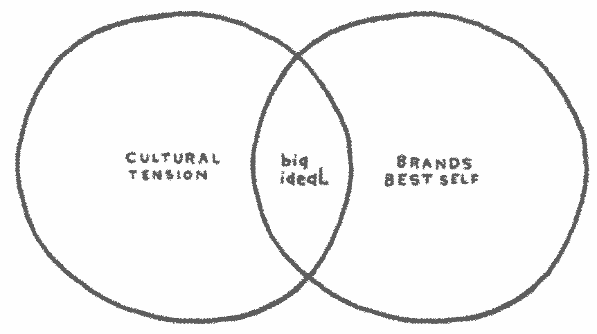
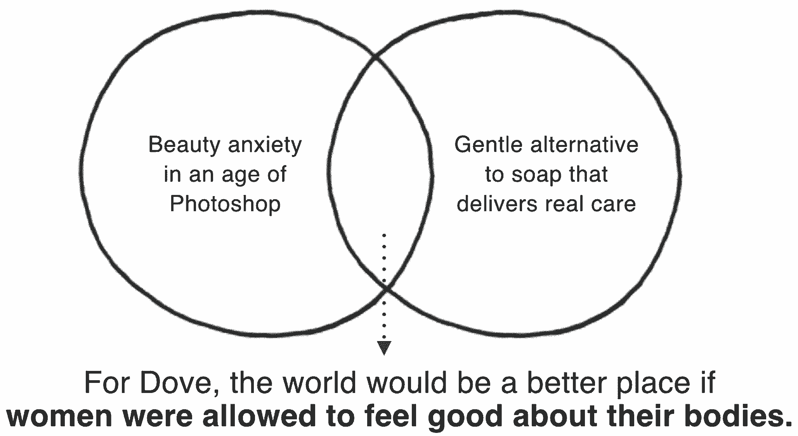
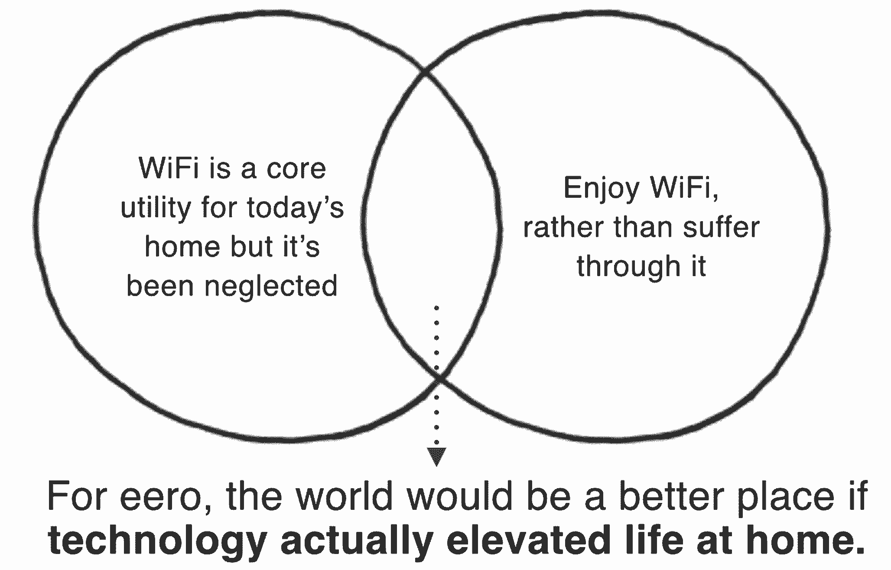
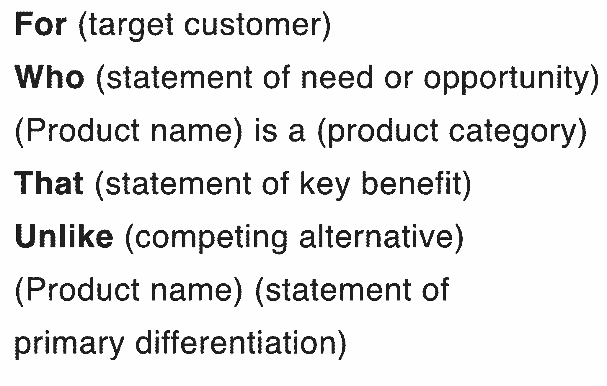
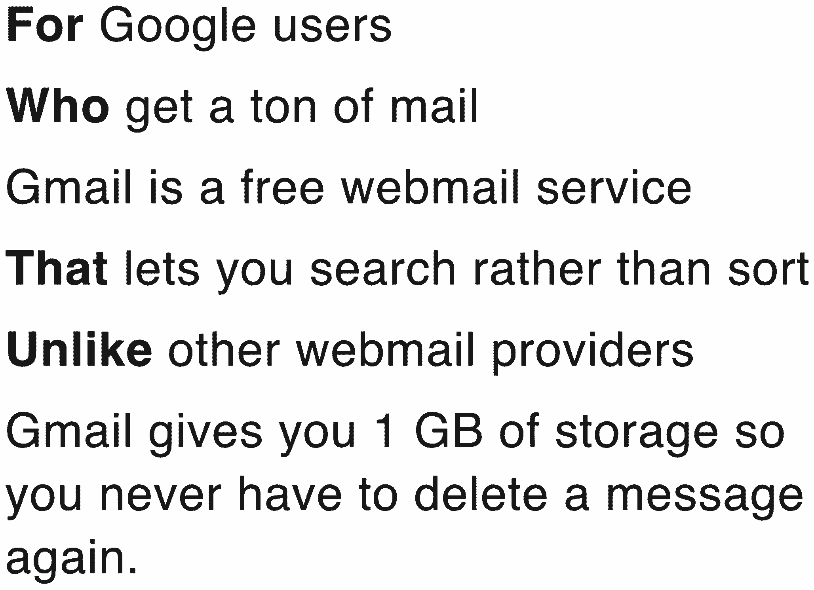
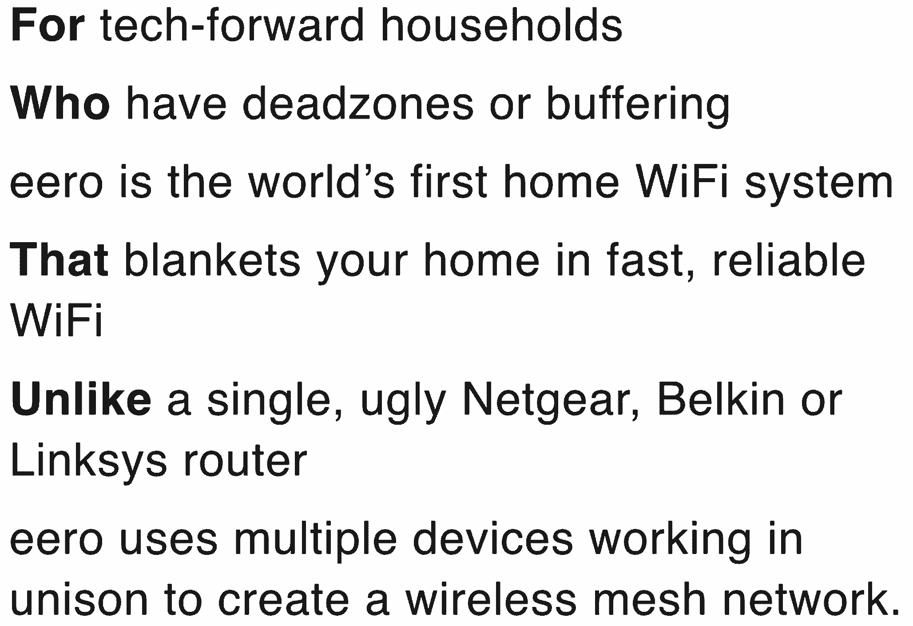
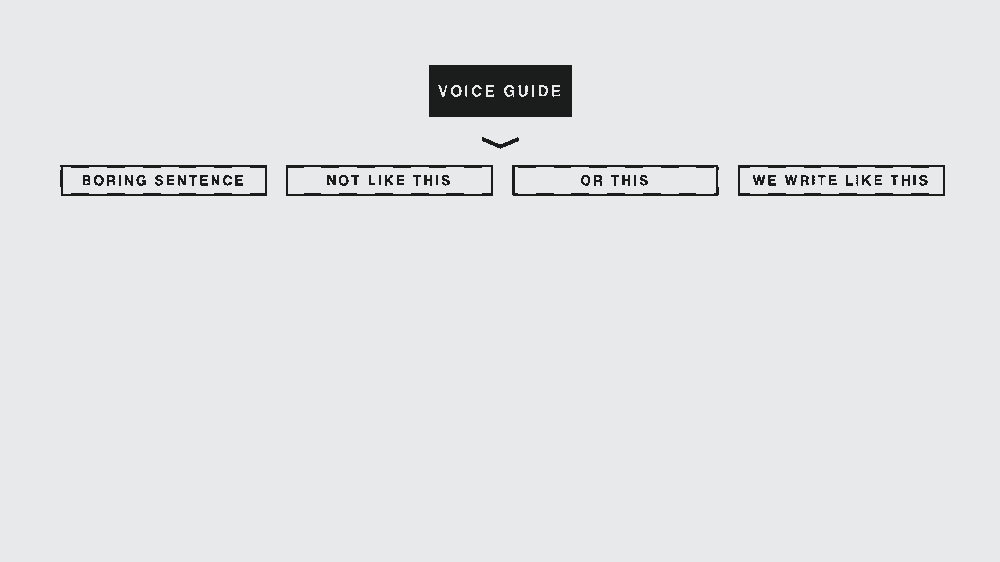
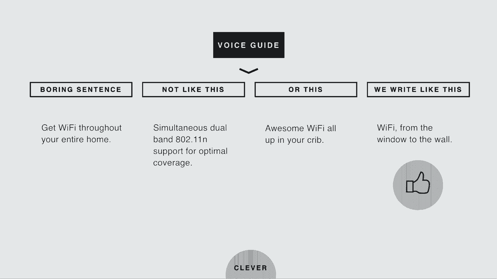

# 每个创业公司创始人必须采取的三个步骤来建立一个重要的品牌

> 原文：<https://review.firstround.com/three-moves-every-startup-founder-must-make-to-build-a-brand-that-matters>

## 介绍

当阿里埃勒·杰克森 在谷歌开始她的职业生涯时，她的一位导师教她接受这样一个事实，即营销是一项高度战术性的职能。直到今天，她还是喜欢为小事伤脑筋——主要是因为这些小事累积起来就是大事。这就是她如何通过一场成功的预购活动，帮助家庭 WiFi 初创公司 [eero](https://www.eero.com/ "null") 在两周内吸引了 250 万美元的销售额。所有的小细节——从 eero 网站内容的细节到其客户沟通的微妙之处——都加在了一起。造雨者因他们的风暴而闻名，但杰克逊关注每一滴雨。

在谷歌时，杰克逊花了近十年时间营销各种产品，包括 Gmail、Docs、Calendar 和 Voice。作为 [Square](https://squareup.com/ "null") 的零售合作和营销项目总监，她管理着分销合作关系，将产品投放到 30，000 家零售店。在 Twitter 收购这家初创公司之前，她在[封面](https://www.coverscreen.com/ "null")负责营销和沟通。自那以后，杰克逊开始独自帮助创业公司更好地掌握和传播他们的品牌。

在 First Round 最近的首席执行官峰会上，杰克逊概述了一个简单但强大的框架，她用这个框架与 30 多家初创公司一起确定了他们品牌的目的、定位和个性。在研究了这些框架之后，创始人们一直在评论它是如何帮助他们明确身份和方向的——并且他们希望他们能早点完成。在这里，杰克逊分享了那些品牌营销练习。

# 首先，让我们弄清楚一件关于品牌的事情。

这有点抽象，但对杰克逊来说，品牌本身可以被重新命名。杰克逊说:“如果我共事过的创始人的最初印象有任何暗示的话，那么有一个健康的企业家队伍，他们认为任何涉及品牌或营销的事情都是完全无聊和浪费时间的。”“我发现，这种信念往往源于一种误解:品牌等同于标志。这不是真的。品牌是人们认为你是谁。你越早掌握市场营销的基本原则，你对该品牌的控制力就越强。”

一个品牌比一个标志更深刻，它源于理想而不是创意。“拿沃尔沃来说。你们大多数人会立即想到“安全”这是因为沃尔沃在过去 70 年的大部分时间里都在试图拥有“安全”这个词。“这不仅仅是纯粹的营销，”杰克逊说。沃尔沃靠安全生存、呼吸和死亡。在 50 年代末，在汽车需要安全带之前，他们发明了三点式安全带，我们今天开车时都戴着它。他们没有申请专利，只是用来让沃尔沃汽车更安全，而是把这项技术给了别人。这就是他们对安全的痴迷。他们营销和信息安全的方式非常符合他们的产品信念和他们作为一家公司的核心原则。"

一个品牌巩固了你在消费者心目中的地位，成为你公司的内部灯塔。

如果你在一家新公司，你可能只有 7 个月的时间来创造业绩，而不是 70 年的历史或营销费用。那你是做什么的？杰克逊说:“每个初创公司都应该经历三次锻炼。“你们很多人都听说过营销的‘4p’。**今天我要讲 3 个不同的 Ps。它们是你的目标、你的立场和你的个性。**”

# 目的

停下来。在你雇佣公关公司或花一毛钱进行付费营销之前，完成这个练习，清楚地阐明你的目的。“你必须清楚明白地表达出来。你的目标是如何让世界变得更好，”杰克逊说。“好消息是，许多创始人创办公司时都抱着一个想法，即他们希望如何让世界变得更好。但是你对它的了解深入到你能背出来吗？更好的是，你的整个团队能像你一样用语言表达吗？”

杰克森发现的定义目标的最好方法是通过广告公司奥美的一个练习，这个练习被称为“T2 的伟大理想”。“这就是维恩图的工作原理。在一个圈子里，你有文化张力。这是世界上正在发生的与你相关的事情。在另一个圈子里，是你的品牌最好的自己。杰克逊说:“这是你的公司在巅峰时期提供的东西。“这两个领域的交集就是奥美所说的‘大理想’——或者说你的目标。”

首先写下所有对你的公司来说是文化冲突的因素，同时列出你的公司通过其产品和服务提供的所有方式。你的目标是为每个圈找到一个主要陈述。综上所述，它们应该有助于你完成下面的句子:

**“对你的公司来说，如果 ________，世界会变得更好。”**

回答和阐明这句话的其余部分是有区别的。“你也许可以填补空白，但是把这些词写对了，真的可以成为你的营销平台，”杰克逊说。“让我们来看几个例子。首先，鸽子。十年前，个人护理品牌奥美就做过这样的练习。他们做了一些研究，发现在 2004 年，只有 4%的女性认为自己漂亮。这种更广泛的背景帮助他们明确了自己的目标。”

多芬认识到的文化张力是，世界各地的女性都有很多美丽焦虑。到 2004 年，Photoshop 已经成为许多杂志的标准工具。这导致了对女性身体的不可实现的理想，德芙认为这导致了女性感觉不到美丽。在最好的情况下，多芬提供了一种温和的肥皂替代品，提供真正的护理，特别是对女性，其目标受众。综上所述，多芬的目标变成了:如果允许女性对自己的身体感觉良好，这个世界将会变得更加美好。

“在过去的十年里，多芬围绕着这一句话进行营销。你可能已经看过了。杰克逊说:“这是‘真正的美丽’宣传活动。“Dove 仍然以不同的形式经营它，但它总是包括不同形状、颜色和尺寸的女性，通常穿着白色服装，这意味着 Dove 制造的白色肥皂。消费者现在把对自己身材满意的多元化女性等同于多芬香皂。”

如果你不是销售肥皂的主要 CPG 品牌的营销领导，这里有一个早期技术公司的例子。“通过第一轮的介绍，我开始与 eero 合作，这是一个家庭 WiFi 系统，可以为家庭提供快速、可靠的互联网。他们用更好的东西取代过时的路由器。”

对于 eero 来说，文化上的矛盾是我们比以往任何时候都更依赖 WiFi，但它仍然是通过不合标准的技术提供的。“WiFi 已经成为当今家庭的支柱。我们不断地与我们的祖父母分享网飞或视频聊天。然而，它被忽视了，”杰克逊说。“我们使用的路由器看起来像是十年前的东西，它们不符合今天消费电子硬件的标准。WiFi 是千刀万剐的死法:缓冲、死区和需要回形针的重置方案。软件和硬件方面都有很大的改进空间。”

在最好的情况下，eero 提供了一个机会来消除 WiFi 的麻烦，并将快乐带回 WiFi。“如果你能享受 WiFi 而不是忍受它，你的生活会好得多。这是它的承诺，”杰克逊说。“所以，eero 的目的是:如果技术真的提升了家庭生活，这个世界会变得更美好。你会注意到他们不只是说“如果 WiFi 提升了家庭生活”,因为你的目标应该持续你至少十年。十年后，eero 可能不仅仅是 WiFi。带着你的目标，考虑几年，而不是几个月。”

你的目的应该持续十年。不是四个季度也不是永远。应该在望，但是在地平线上。

# 位置

没有一个企业能够仅仅停留在它的目标的崇高氛围中而生存。你实际上不得不卖肥皂或路由器替代品。“这就是定位发挥作用的地方，”杰克逊说。“定位是相对于消费者已经知道的东西，你在他们心目中的形象。它传达了是什么让你独一无二、与众不同。”

与初创公司的目标相反，它的定位应该在大约 18 个月的时间里保持不变。公司是决定目标的关键因素，而产品是建立定位的驱动力。在实践中，你的立场是一个简短的陈述，它定义了你的产品将提供什么，以及它如何是一个比现有产品更好的、不同的解决方案。 [Jackson 在](http://firstround.com/review/Positioning-Your-Startup-is-Vital-Heres-How-to-Do-It-Right/ "null")之前已经深入探讨过这方面的专业知识，所以这里有一个受 Mad Libs 启发的模板供您的公司填写:

起初，这可能看起来像一个抽象单词和括号的字母汤，所以这里有几个澄清的例子。“让我们从 Gmail 开始。这是一款非常贴近我心的产品，因为我已经为 Gmail 做了三年的营销工作，”杰克逊说。以下是 Gmail 大约在 2004 年 4 月发布时的定位:

11 年后，定位声明仍然正确，尽管分配的存储量(和其他功能)已经发生了变化。对于杰克逊来说，这是一个良好定位的标志。语句的某些部分大约每 18 个月就会发生变化，但它不应该完全波动。

在填写定位陈述时，请记住一个关键区别:关键优势和主要差异化之间的区别。“这里可能有些混乱。把你的好处想成你最好的客户会告诉另一个潜在客户的事情，如果他们说为什么他们应该注册你的产品。杰克逊说:“现在，你的与众不同之处就是你有理由相信自己的主要优势。“例如，作为一个早期的 Gmail 用户，我会用 AOL 告诉我的父亲:‘爸爸，你总是在分类。如果你有 Gmail，你可以搜索而不是排序。这是关键的好处。他会相信这一点，因为他从谷歌那里获得了“1g”的存储空间。"

继续以 eero 作为科技创业公司的一个更近的例子，下面是它的定位声明:

对 eero 练习的有益补充是创建它的背景。“当我第一次见到 eero 的创始人时，他们向我解释了他们的产品和想法，我花了一个多小时才明白。但在阅读这份声明的过程中，大多数人现在都明白了，”杰克逊说。“这就是定位陈述的力量。它不经常外用。事实上，你可能没有在主页或任何地方看到过 Gmail 的定位声明。”

另一方面，这句话对于任何需要立即和本能地理解产品的内部或签约团队来说都是无价的。“比方说，你雇佣了一个公关公司，一个工作室为你制作视频，或者一个品牌公司为你做宣传，”杰克逊说。“你雇佣的任何人——无论是永久的还是临时的——如果需要非常简洁地理解你的产品，应该首先收到这句话。这是对你是谁、你代表谁以及你与众不同的提炼。”

选择特定的词是定位的重要部分。“在 eero 的案例中，我们确实公开使用了定位声明中一些更有力的词汇和短语，”Jackson 说。“我们选择了‘用快速、可靠的 WiFi 覆盖你的家’，非常喜欢‘覆盖’听起来温暖舒适的感觉，旁边还有非常实用的好处。在 eero 的营销材料中，你会看到这句话一字不差地与‘家庭 WiFi 系统’的概念一起使用。”

相对于你的目标受众已经知道的东西，你的职位是使你独特和不同的东西。

# 个性

明确了自己的目的和定位之后，最后一步就是确定自己公司的个性。“你的个性真的很像你。这部分少*你说什么*多*你怎么*说。杰克逊说:“它嵌入在你的声音里，或者你写出来的声音里。“早期，当你们是车库或公寓里的两个人时，你的创业公司的个性通常是一个或两个创始人的直接反映。随着你的成长，它开始成为代表你写作的其他人的组合:代理商、文案、社区经理。更多的内容营销需要更多的材料，这些材料必须以正确的方式呈现。”

不要成为要求文案只是“写出来”的领导者。通常情况下，你会对结果感到失望。你如何确保你雇佣的任何人都能以你想要的方式反映你的个性和声音？你必须把你公司的角色作为项目参数的一部分传递下去。“问问你自己:‘如果你在一次聚会上遇到你的公司，你会如何描述他或她？尽可能多地列出形容词，然后选出前三个。"

埃罗和杰克逊一起研究了这个问题，它的措辞是:聪明、深思熟虑、平易近人——“完美无瑕”紧随其后。然后他们用一小段文字将 eero 拟人化，把他描述成人。“想象一下，你有一个超级聪明的建筑师朋友，他总是穿着完美，行动谨慎，同时又风趣又平易近人，”杰克逊说。“你能想象这家伙吗？我可以。他和我在布鲁克林的朋友结婚了。”

底线是，如果你把这个简短的描述给广告文案，他们会引导你的个性，如果给他们一个带有行话的使命陈述，他们会写得更好。如果你做了大量的复制，更进一步，创建一个语音向导。方法如下:“取一个无聊的句子。然后想一想你的三个形容词中的一个。写出完全没有那个属性的同一个句子。然后再做一次，只是这次把那个属性做得太过了。最后，写下这句话，如果它注入了完美的质量。”模板如下所示:

作为一个例子，让我们为 eero 填写这个语音指南，应用聪明的属性。

eero 以一个准确但枯燥且仅仅是功能性的句子开始。“如果你去掉句子中所有的小聪明，你会得到一个没有俏皮俏皮话的超级准确的陈述，如第二个方框中所列。或者，像第三个领域一样，造出一个聪明过头、努力过头的句子，”杰克逊说。“这两个人听起来都不像埃罗。事实上，第三个——“在你的婴儿床里有很棒的无线网络。”——实际上破坏了另外三个最重要的属性:平易近人。在做这个练习时，eero 的营销主管[肖恩·哈里斯](https://www.linkedin.com/in/mrseanharris "null")想出了“从窗户到墙壁的 WiFi”"

有些人可能知道这是指说唱歌手 Lil Jon 的歌。这是有意的，但不是理解声明的一部分。“刚才发生了什么事？有那么一瞬间，我打赌你觉得自己很聪明，就像和埃罗开了个玩笑。你可能会暗自发笑。那是一个美好的时刻。以及与品牌的即时联系，”杰克逊说。“这个短语的真正聪明之处在于，即使你没有得到 Lil Jon 的点头，你仍然理解它。从窗户到墙壁都是 WiFi。它几乎覆盖了你的整个家。这就是埃罗想要的聪明:如果你得到了它，感觉很棒，但如果你没有，它仍然非常有意义。”

# 外卖

一个品牌不是一个标志，不是一个色轮的色彩组合，也不是一句简洁的口号。是对贵公司的宗旨、定位、性格深思熟虑的产物。杰克逊提供了一套练习，将帮助你建立一个十年的经营视野，你在未来 18 个月的市场中的立足点，以及你在这两个时期的个性。任何创始团队都可以利用这些练习为公司内外的人传达一致的声音。

“这些简单、清晰的框架可以产生巨大的影响。我看到他们在创业成长的各个阶段都在工作。杰克逊说:“如果你接受一条建议，那就是尽早做这些事情。“如果你还有地方再吃一次外卖:定期吃。一个公司的品牌，就像它的员工一样，随着他们的发展而发展。如果你不止一次做这些练习，你就在成长。重新审视你的目标、职位和个性与你第一次表达它们一样重要。”