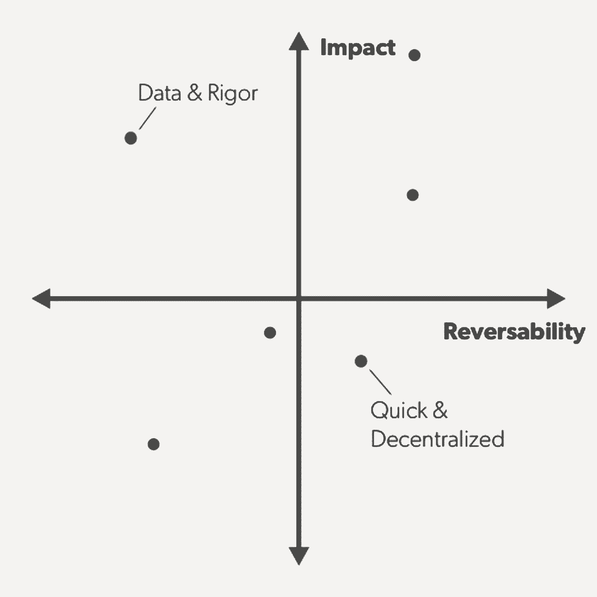

# 要想发展得更快，请点击“暂停”——并从 Stripe 的首席运营官中提出这些问题

> 原文：<https://review.firstround.com/to-grow-faster-hit-pause-and-ask-these-questions-from-stripes-coo>

**[条纹](http://www.stripe.com "null")** 正在以极快的速度增长，而且已经持续多年。2016 年初，它有 350 名员工。一年后，刚刚搬进 Dropbox 位于市场南部的旧公寓，它的价格是 750 英镑。但是根据首席运营官**克莱尔休斯约翰逊 的说法，公司面临的最大挑战是没有带来足够多的新人。它将它们整合成一个复杂的有机体，无法停止/不会停止前进。(持续地)弄清楚这一点是她的使命，在技术领域很少有人能达到她的水平。**

如今，Stripe 处于一个罕见且令人向往的位置。虽然同代的许多独角兽的增长已经趋于平稳，但它仍保持着火箭般的发展轨迹。当被问及她从这次经历中得到了什么智慧时，约翰逊给出了以下建议:**公司在走向快速增长时应该问自己一系列问题——最好是在确定产品与市场匹配后相对短暂的时刻。**

“许多公司直到进入成长阶段后才决定如何成长，”她说。“在很长一段时间里，你的行为推动着你的公司前进，然后突然之间它转变了——你现有的业务开始推动你的行为。诸如功能需求、对更多客户支持的需求、创建一个团队来做以前从未需要做的事情的需求等外部力量开始左右你的决策。”

她说，关键是要暂停足够长的时间，以便有意识地思考如何进入成长的每个阶段。

人们很容易变得过于被动，当这种情况发生时，你将不可避免地开始犯人力资源错误、执行错误、优先级错误。

所以，无论你是在成长之前，还是正在成长的路上，请按下暂停键。通读约翰逊的问题清单，确保你边走边回答。

# 1.我们是否记录了我们的运营原则？

当你达到增长时，许多前所未有的事情开始发生，你会觉得你没有做出好决定的指导方针。最重要的是，许多在公司成立时不在的新人也需要做决策。他们需要一个框架来帮助他们做到这一点。

**这就是为什么你需要记录描述你工作方式的核心原则**。一旦它们被写下来，你就需要不断地重复它们，直到每个人都理解了它们。Stripe 称它们为**操作原理**。(许多公司都有“价值观”，但 Stripe 希望将哲学信仰与应用于日常业务运营的具体原则区分开来。)按照约翰逊的描述，Stripe 的三个经营原则是:

用户至上:“我们总是从用户的需求或喜好开始，然后考虑基础设施、内部约束、合作关系、产品路线图等等。”

**严谨地思考:**“我们关心把事情做好，通常需要从基本原则出发进行推理。我们努力工作来发现公认智慧中的错误。僵硬并不意味着没有发明综合症；我们对周围的世界感兴趣，并认为其他公司、行业和学术领域有很多东西可以教给我们。但在很多情况下，进步来自于选择人迹罕至的道路。”

**信任并扩大:**“我们希望在一家由非常优秀的人组成的公司工作，他们对同事格外友好。人们应该致力于增强彼此的力量:无论是从短期还是长期来看，都要尽力互相帮助。”

[你可以在这里找到他们公开发布的完整名单](https://stripe.com/us/jobs/candidate-info-culture "null")。

你的原则应该足够清晰明了，以至于咨询这些原则的人会做出与你的公司创始人相同的决定。

还应该以承认潜在紧张关系的方式来定义它们。当两个原则看起来冲突时，上下文应该告诉你哪个原则应该优先。例如，“严谨思考”对于高影响力和不可逆转的决策至关重要，但“紧急行动”对于低影响力和潜在可调性的决策至关重要。这样，你的核心原则更像是一个行动指南，而不是一个没有牙齿的美好愿望清单。

这也使它们成为招聘新人和评估绩效的有用指标。候选人的能力或经验是否符合你的经营原则？现有员工是否以支持他们的方式履行他们的职责？你应该将自己的经营原则融入到招聘和绩效评估过程中，让它们变得有用，并时刻牢记在心。

当你对项目进行事后分析时，通过你的操作原则来评估过程和结果。“在成长过程中，人们会变得非常以结果为导向，在基本的思维过程中走捷径，”约翰逊说。“写下原则可以让你说，‘嘿，作为一家公司，我们同意按照这些原则行事。在这种情况下，我们如何才能更好地坚持这些原则？或者，我们需要改变我们的运营方式以在未来取得更好的结果吗？"

当人们开始在决策会议上逐字使用他们的语言时，你知道你的操作原则是正确的。“这是仅次于房间里有领导的最好的事情。”

从入职开始。为了强调 Stripe 运营原则的重要性，**他们向新员工展示了公司成立那年写下的第一套原则**。令人惊讶的是，它们与今天的列表如此相似——这恰恰强调了这些想法对 Stripe 的成功有多么重要。“它展示了对公司来说一直很重要的东西——真正与员工紧密相连的东西，”约翰逊说。“这也给了我们一个机会来谈论那些很少的变化是什么时候发生的以及为什么发生的。”

运营原则在培训新加入公司的经理时发挥着更大的作用。她说:“如果你不小心，经理们会带来他们在之前职位上的所有规则和行为——他们会对他们的团队产生巨大的影响。“这就是为什么我们为新领导建立了一个不同的入职计划，以确保他们真正理解 Stripe 基于我们的原则运营的不同方式。”

这是一种非常常见的失败模式:一家初创公司的创始团队使用一套他们都暗中知道并同意的不成文的信念来做出招聘决定和产品决定——但他们从来没有大声说出来或记录在核心的某个地方。

“当你在一个小团队中，总是在同一个房间里工作时，很多事情都会有机地发生，”约翰逊说。“你有很多非正式的能力来完成事情，因为你能立即理解正在做出的是什么样的决定，以及你想如何处理它。但是当你扩展的时候，你不能很容易地用一种新的方式教给别人，让他们马上理解。他们必须学会理解它。”

如果你是一家公司的领导，你知道这些潜规则是什么吗？您是否对需要做出的常见决策类型进行了分类？你是否记录了指导你如何做决定的信念？如果没有，暂停，现在就做。

# 2.什么样的结构能帮助我们实现目标？

随着增长而来的是对正式管理的需求。即使你致力于保持平淡，你也需要明确责任和升级途径。

“平坦度实际上是一种心态，”约翰逊说。“你可以让你的组织感觉扁平，同时仍然有一个良好的权力链，这样人们就不会有太多的直接下属，并且有一个明确的方式来升级问题。我们没有太多的头衔或资历标志，因为我们希望所有人都能畅所欲言，做出贡献。你是否被邀请参加会议总是取决于你对某个特定问题或难题了解多少，而不是等级制度。但每个人都清楚地知道他们的经理是谁。”

这就是 Stripe 的工作原理。但是每个公司都需要决定适合他们特定目标的结构。也许你需要更多的层次来执行非常复杂的过程，有很多移交。也许你需要的更少，因为你希望所有员工都能够立即响应客户的问题，而不必与其他人一起复核。

任何一家公司成立之初，每个人都在不惜一切代价争取成功。当你进入增长期时，那就不再起作用了。人们需要与成功指标线性关联。

**选择正确的结构至关重要的一点是创造改变和发展它的方式。你应该预料到任何一张桌子周围的人的大小、形状和数量都是会变化的。约翰逊说:“每六个月检查一次，以打破那些根深蒂固、陈旧或不再有成效的会议，这是一个好习惯。”。“你不会想当然地认为某个流程是做某件事的唯一方式，或者你需要某些人的组合来完成某件事——我可以非常肯定地说，从现在起一年后，无论是流程还是人都不会是正确的。”**

# 3.到目前为止，谁在我们公司取得了成功？

也许你已经雇佣了 20 个人或者仅仅 10 个人——这仍然足以匹配什么样的人适合为你的公司工作。

“花时间问:好吧，我们雇佣了什么样的人？他们是一个足够多样化的群体，能给公司带来不同的观点和经验吗？谁做得很好？谁在以与公司相同的速度扩展？那些人有什么特点？”约翰逊说。事实上，列出它们的属性是定义、强化或调整你的操作原则的好方法，以确保它们是一致的。

与你的公司一起发展的人是那些预见到他们现在需要学习什么，以便在六个月后超越他们的角色的人。他们有足够的好奇心去展望未来。他们不满足于仅仅做他们现在的工作。

当约翰逊第一次加入时，Stripe 的国际报道是新的。有个别国家经理作为多面手工作，让球滚动，无论他们被派驻。但是随着公司的成长，这些人需要转变成真正的团队建设者——其中一些人最终经营了自己的大型组织。其中一些国家经理适应了这些新角色。其他人没有，因为他们无法获得在产生结果的同时建立和管理不断增长的团队所需的技能。

随着公司为了进一步扩张而引进新的国家经理，他们根据与已经在这个职位上取得成功的人员类型相匹配的模式来雇用候选人。总的来说，这些员工乐于接受扩张的挑战，他们愿意花时间学习，不断寻求反馈，并坚持不懈地自学当地市场。

“看看那些喜欢为你的公司工作的人。他们喜欢什么？他们特别擅长什么？是什么技能让他们与众不同？”约翰逊说。"**你想雇佣更多符合这种类型的人，他们不仅有合适的技能，而且过得很愉快**。快乐对高绩效至关重要——快乐的人会变得好奇，想要学习。”

她偶尔会发现，在维恩图上用三个圆圈标出团队成员很有帮助:擅长自己工作的人、影响巨大的人和热爱自己工作的人。理想的员工符合这三个方面。列出所有掉进这个桶里的人。他们还有哪些共同的品质？**在招聘过程中，你可以问哪些问题来判断候选人是否具备这些品质？**

# 4.我们有五年计划吗？

约翰逊非常相信公司应该写下长期计划。但重点是:**应该不长**。这不应该是一些不朽的，耗时的考验。它应该简单到三到五段，简要描述公司希望确保在未来五年左右追求的最大的宏观目标。

对于 Stripe 来说，这份文件包括:“为各种规模的在线公司提供建立业务和在全球经济中竞争所需的基础设施。”

这是我们可以不断问自己的问题，“我们现在所做的与那个目标一致吗？”

约翰逊与共同创始人帕特里克·科利森共同起草了这份文件的初稿。整个领导团队工作了几个星期，然后向全公司发布。

“随着你的成长，你的初创公司应该得到宪法文件来指导你的行动，”约翰逊说。“一旦你确定了你想要的工作方式、公司的最佳结构、你想与之共事的员工类型— **本文档概述了你如何利用所有这些资源来完成**。”

作为制定计划的一部分，高管团队在办公室之外聚在一起，设计了一个完全专注于手头任务的一天。她说:“我发现很多人都在谈论实现个人的‘心流状态’——那种与工作融为一体的感觉，这样你就能更有创造力，产生新的想法。”。"**很少有人谈论如何作为一个群体进入心流状态。但是他们应该。**当我们做计划时，这就是我们试图达到的目标——共同的目标感，我们所有的大脑都集中在一个结果上。”她向寻求发展长期方法的公司推荐这种方法。

同样重要的是:您发布的计划应该存储在中心的某个地方，以便于参考。它应该是新员工入职的核心，以及你的运营原则。随着你对自己的业务或客户的了解，它可能会随着时间的推移而有所调整，但理想情况下，你在其中设定的目标应该是你创立公司的内在原因，不会有太大变化。

“在做出产品决策时，你希望人们参考这个计划——‘这个新想法或新功能服务于我们的总体目标吗？’或者‘即使它不符合我们的任何一个 5 年目标，我们也应该推出它吗？你的宪法文件授权人们去问和回答这些问题，这样你的公司就不会从你绝对相信你必须做的事情上分心。"

一旦你获得牵引力，突然间一切都是令人兴奋的机会。长期计划迫使你用有限的资源做出好的决定。

# 5.我们有办法衡量员工体验吗？

对于约翰逊之前提出的快乐是高绩效的核心这一观点，她认为每一家有规模的公司都需要建立机制来衡量和应对员工的满意度。例如，Stripe 每六个月对其员工进行一次调查。“对于我们这种规模的公司来说，这似乎很常见，但当你增长如此之快时，事情总是在变化。我们密切关注人们对我们方向的看法，这一点很重要。”

该调查大约有 75 个问题，大约需要 10 分钟完成。结果是匿名的，由执行团队进行滚动分析。问题包括对个人同意或不同意以下陈述的程度进行评级:

我可以看到我所做的事情与 Stripe 的总体目标和目的之间的关系。

我有足够的自主权来有效地完成我的工作。

我恰当地参与影响我工作的决策。

我每天都有机会做我最擅长的事情。

我在工作中有机会学习和成长。

我会推荐 Stripe 作为一个很好的工作场所。

对于约翰逊来说，调查中最重要的问题是:“我觉得我每天做的工作和公司的成功有直接关系吗？”

她说:“让人们真正感受到自己工作的影响力，并感觉到自己正在产生重要的商业成果，这一点非常重要。”。"这是我最喜欢的检验组织是否健康的试金石之一."

虽然 Stripe 迄今为止在这个问题上表现良好，但初创公司可以使用这个查询的结果来确定下一步该做什么。如果你对这个问题的回答是否定的，很可能是你人浮于事，以至于有些人觉得他们只是在忙着工作，或者他们只负责公司的一小部分。你可能会得到这个结果的另一个原因是，如果高层领导或人事经理不善于阐明公司愿景以及它与手头职责的关系。Johnson 建议收集这些问题的子数据，以诊断问题所在。不管怎样，修复它是至关重要的。

“我见过很多中层管理者不愿意拥有一个创始人的愿景，所以他们最终只能微弱地交流他们团队的工作如何与组织的使命相关，”她说。“最优秀的经理会把他们团队的工作与公司努力实现的大目标联系起来，这是他们最优先考虑的事情。”

如果你作为领导不相信你每天做的工作是重要的，你的团队也不会相信。这让你处于非常危险的境地。

# 6.我们正在下放决策权吗？

任何成长型公司面临的最大挑战之一是让员工掌握信息、权力和信心，让他们自己为公司做出决策。作为创始人或执行领导，你不能总是在那里打电话。你必须相信其他人也能做到这一点，这样才能不断拓展你的业务。

为了实现这一目标，约翰逊采用了与住院医师项目相同的方法:**见一个，做一个，教一个。**

当你是一名外科医生时，这是你学习的方式——也是你最终有资格在手术室里迅速做出改变人生的决定的方式。这也是你在科技公司培训员工的方法——展示你希望工作如何完成，让他们自己做，然后让他们把学到的东西教给新入职的人。尤其是教学行为，对于内化信息和使行动成为第二天性来说，具有强大的力量。

这就是 Stripe 如何让人们做出好的决定，不管他们离创始人有多少步。例如，当帕特里克和约翰·科利森创办公司时，他们对想要建立的品牌有着非常明确的看法——尤其是设计理念。他们坚信软件应该是漂亮的，这使他们在 B2B 市场中脱颖而出。随着时间的推移，这使 Stripe 成为该领域的领导者。

为了实现这一点，创始人必须将他们的设计感受传递给一个新人团队，这个团队将会像他们自己一样发扬光大。当设计团队刚刚起步时，创始人创建了一个设计评审流程，允许他们在沿途的检查点提出自己的意见和指导性问题。最终，团队中的设计领导在引入新成员时接管了这一工作——在相同的检查点问相同的问题。他们成为新一批设计师的老师，这些设计师将学习设计新东西时要考虑的标准、问题和目标。

在业务方面也建立了类似的流程:交易审查。

“交易条款的最初决策者是我们这些领导公司的人，”约翰逊说。“我们不再审查每一笔交易，如果是这样的话，我们就失败了。”

Stripe 的领导层仍会对不寻常的交易进行审查。文件对于补充这些审查会议的影响至关重要。**重要的是，你开始对团队必须做出的共同决策进行分类，这样你就可以围绕如何做出这些决策创建规则和方法。**

“例如，我们简化了如何处理类似结构的交易，”她说。“我们将能够根据一系列标准来确定交易类型，并能够以正确的合同类型做出响应。它加快了所有事情的速度，让一线员工无需总是请示经理就能轻松做出回应，并为来 Stripe 的客户提供了更好的体验。”

重要的是，当遇到新类型的交易或决策时，也有固定的程序。“当员工第一次看到一个新类型的交易时，他们确切地知道如何提升它，以及谁需要参与，而不是跑来跑去问一堆人。他们不会试图移植现有的流程来适应新的情况。他们会停下来，仔细考虑他们与交易审核小组的下一步行动。”

为了帮助每个人做出这些决定，Stripe 在内部发布了一个框架。以下是基本情况:

如果一个决定是不可逆转的，并且对公司有非常高的影响，那么这个决定应该有大量的数据和严谨性；它应该包括更多的利益相关者，也许是多个团队。把产品定价当做一个完美的例子。

如果一个决定是可逆的，并且对公司的影响相对较小，个人应该能够根据公司的经营原则和计划做出最佳判断(这就是这些文件变得重要的地方)。这可能包括 UI 更改、客户服务响应等。

你可以把它想成两个两个的形式，一个轴上是冲击，另一个轴上是反转或反弹的能力。大多数项目都可以在这张图上的某个地方画出来。根据他们降落的地方，你更知道如何进行。

对于 Stripe 来说，这减少了不确定自己能否做出决定的人数。这也最大限度地减少了他们向经理请示和获得认可的时间。总之，这为公司节省了大量的时间和资源。

使用这个框架来授权决策也是可复制和可扩展的。熟悉 it 的员工现在可以模式匹配哪种类型的决策需要哪种类型的行动，而无需提前预测每一种可能做出的决策。

“这对我们来说是非常高的杠杆，”约翰逊说。“有许多公司真正拥有决策权，比如谁可以根据资历或角色来决定什么。根据我的经验，当你需要快速移动和成长时，这是行不通的。我曾经在一些公司里，人们会说，‘和这三个人谈谈，然后你就可以继续做决定了。’这三个人不可避免地成为一个瓶颈，一群其他人觉得他们没有真正拥有自己的工作。"

为了成功成长，你需要不断提升决策能力，让最接近工作的人能够做出高质量、负责任的决定。 Stripe 优先考虑尽可能将决策本地化。

不本地化解决问题是公司的秘密杀手。

约翰逊说:“如果你不能始终如一地教会越来越多的人如何做出决策，或者找到与公司目标一致的解决方案，你就会陷入困境。”。“信任可以节省大量时间。”

几乎所有你在扩展之前应该问的问题都是关于让信任成为公司运营的核心。作为一名创始人，你能相信数百人——包括每个月都有许多新人——会按照你的方式工作吗？如果你相信他们的判断，你只能回答“是”,而相信他们判断的唯一方法就是——最重要的是——好好雇佣。除此之外，向你雇佣的人提供他们需要的信息、资源、工具和心智模型，以理解你的优先事项、意图和目标。

如果你能提供这些东西，你就能创造出一个多大脑的有机体，它足够聪明，能同时承担多项巨大的任务。你将能够推出一个大的新功能集，同时还能调整薪酬。你可以让你的招聘引擎开足马力，同时满足一个大客户的紧急需求。这种并行处理复杂行为的能力对公司来说是一个全新的层面。如果你正在快速成长，这是你从一开始就应该瞄准的目标。

*摄影:Christophe Wu。*