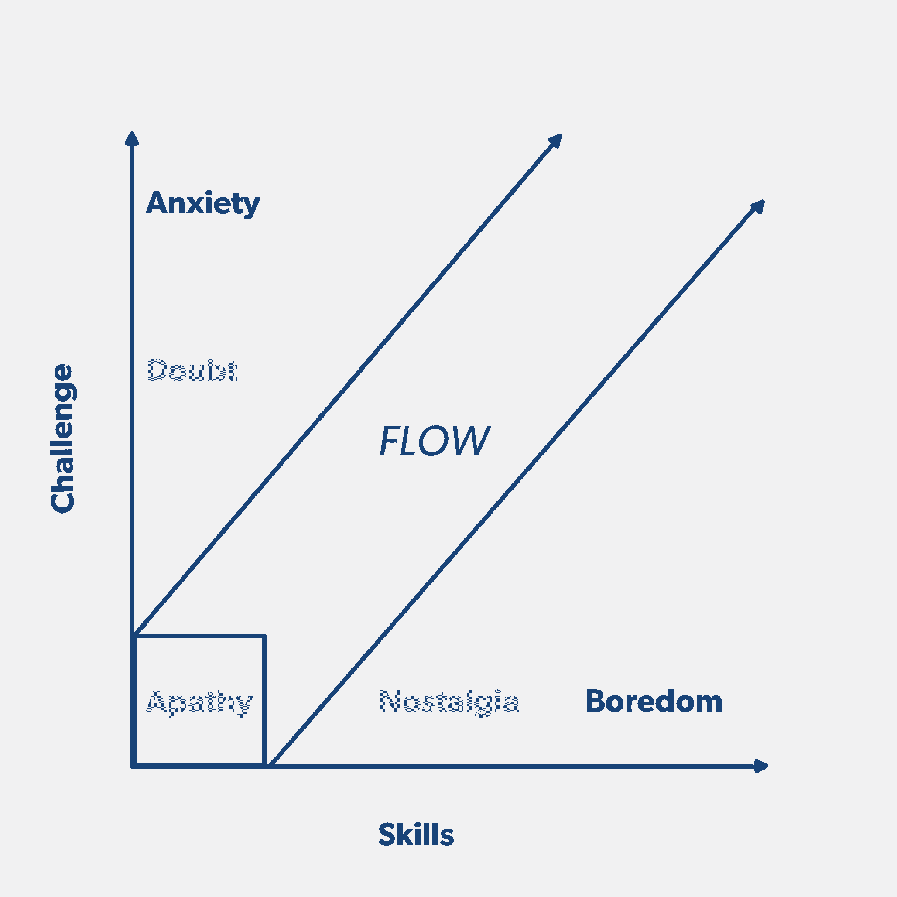
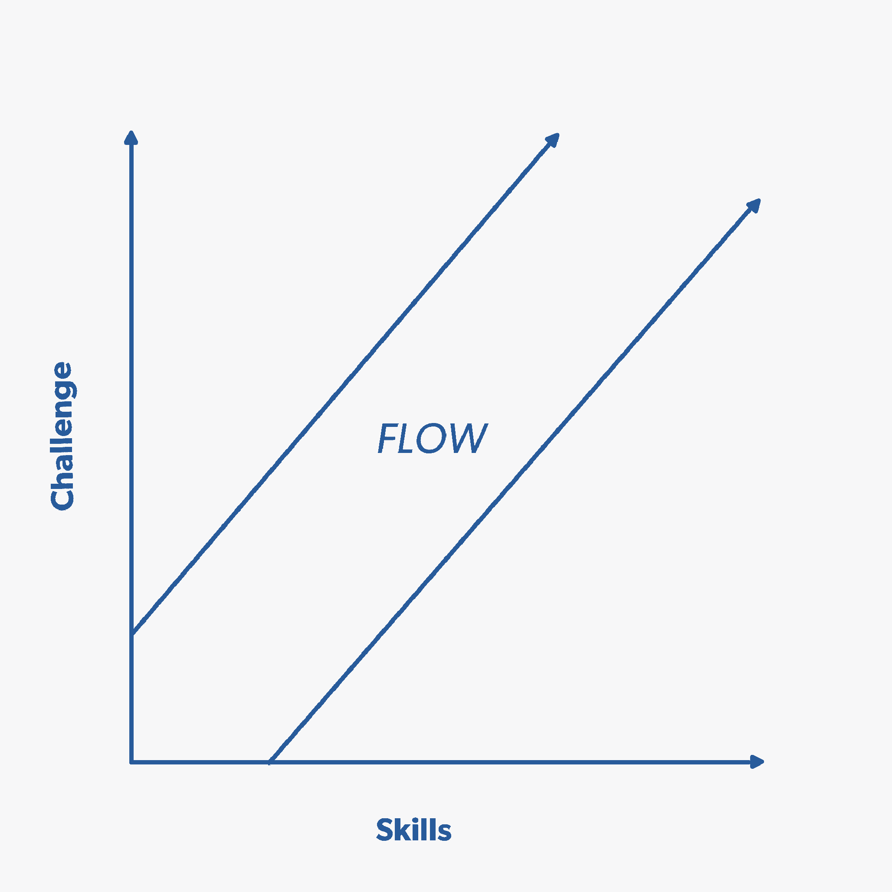

# 以这种简单的方式跟踪和促进您的工程师的流程状态

> 原文：<https://review.firstround.com/track-and-facilitate-your-engineers-flow-states-in-this-simple-way>

当你让许多商业领袖分享他们最大的错误时，他们会犹豫不决。不是 **[辛西娅](https://www.linkedin.com/in/cynthiamaxwell/ "null")** 。她总是把自己放在第一位。事实上，她把它变成了她每天使用的管理工具。

当麦克斯韦尔还是雅虎的工程总监时。，她的任务是建立一个全新的，多平台的信息产品。这是那种雄心勃勃的大型项目工程师想要全力以赴的类型——她轻而易举地从苹果公司招到了一位前同事。

然后，几个月后的一天，他告诉麦克斯韦，他将回到苹果。

这肯定是一个危险信号，所以她退一步审视更广泛的背景:她的团队正在构建一个旗舰应用程序，并仔细整合设计、工程和领导方面的利益相关者。她对滚动速度、崩溃率和内存使用等精确指标了如指掌。不过最终，她意识到问题不在于工作本身，而在于*的人对这项工作的看法。如果她能更清楚地了解他们的感受，她本可以更早、更好地做出回应，或许还能留住这位才华横溢的程序员。*

决心不再失去一个伟大的开发人员，Maxwell 将她的工程师的注意力转向了她的管理工具中的缺口。她缺少一种将情感转化为数据的方法，她在一个意想不到的模糊地方找到了它:古老的心流概念。

在这次独家采访中，曾在 Slack、苹果、雅虎 Pinterest 解释了她如何围绕心流建立了一个具体的评估框架。她分享了一个简单的图表，这个图表已经成为她管理工具包中最强大的资源之一。她还描述了焦虑和厌倦是如何蔓延到团队中的，以及管理者如何支持工程师回到理想的心流状态。

# 为什么心流是必须的，而不是必须的

随着她从一个管理角色成长到下一个角色——领导实习生和建筑师——麦克斯韦尔一直关心她的工程师对他们工作的感受。但是她不断地碰到谈话的极限。“不管你的一对一工具箱有多强大，也不是每个人都会马上敞开心扉，”她说。

我在那里的时候，已经有三家公司的规模扩大了 5 倍。在那样的速度下，信任的“慢船”不会切断它。你必须传送到那里。

她需要一种快速、坦率地评估工作满意度的方法。不过，首先，她必须找到一个更清晰地定义满意度的框架。她工作中的工具——从 NPS 到定性满意度调查——对她来说并不太适用。在寻找答案的过程中，她的思维会转移到作为瑜伽爱好者和 DJ 的业余时间，在此期间，她亲身体验了心流的力量。

事实上，这个词经常与艺术家和运动员联系在一起，人们认为他们在“最佳状态”时工作表现最好。游戏玩家也可能凭直觉理解心流；它已经应用于游戏设计很多年了，深度用户参与是成功的基准。但是作为管理者该如何引导这一点呢？

“我的目标是试图创造出定义心流的心理学家 Csikszentmihalyi(T8)所说的‘自动工作’，”马克斯韦尔说。“我在这里引用他的一句话:‘一份工作越像一场游戏——有变化、适当和灵活的挑战、明确的目标和即时的反馈——它就越令人愉快，不管员工的发展水平如何。’"

麦克斯韦在工作中也经历过心流，所以她知道这是可能的。“我记得有几次我对自己说，‘如果我明天中了彩票，我还是会去工作。’“这就是心流，”她说。事实是，这不一定是彩票。它可以是来自另一家公司的邀请，启动一家创业公司的电话，或者任何数量的专业引力。这是关于基本的保持。这就是帮助您的团队成员在工作中体验和创造流畅感的重要性。"

# 掌握流动，绘制流动图

沉浸式的、愉悦的心流状态很难描述，更不用说产生和追踪了。“作为一名经理，我想为我的团队找到重现那些时刻的方法，”Maxwell 说。大约在那个时候，她参加了基于谷歌 [Chade-Meng Tan](http://chademeng.com/about/ "null") 热门课程的[内心搜索](https://siyli.org/ "null")培训。第二天，在一次关于心流的讨论中，她看到了一个看似简单的 X-Y 图，事情开始变得明朗起来。此后，她采用、添加和迭代了它，以满足她作为经理的需求，并在 1:1 中使用她管理的团队成员:

在最基本的情况下，过程很简单:在 1:1 期间，Maxwell 要求她的报告在上面的图表上做标记，以表明他们的专业水平。她的团队看到的版本被简化为 X 轴和 Y 轴描述符以及“流束”上面包括的术语，如“冷漠”和“无聊”，仅供她参考。在谈话中使用它们会从练习中吸取一些客观的、量化的价值。

相反，她的报告看到了这张更简单的图表:

马克斯韦尔的工作是帮助引导她的团队进入那种毫不费力的高效状态，在那里技能和挑战相遇:心流。

新工具很少一开始就让人感到完全舒适(这次也不例外)，但它确实引起了她团队中工程师的共鸣。“这听起来很傻，但对轴线和坡度的熟悉很有帮助。马克斯韦尔说:“这感觉就像是一个需要解决的方程，也是一种需要描绘的情绪状态。”。她发现外向的人带着好奇心讨论，内向的人喜欢图表设定的界限。“它适合两种性格类型。将一个非常重要的问题具体化为一张无威胁的图表，这对外向者和内向者都适用。”

这对麦克斯韦来说也更好。她曾经在 1:1 中徒劳地挖掘坦诚的金块，但她突然有了定期收集的数据，这些数据让她获得了洞察力。“我意识到，了解团队的满意度不一定是一种直觉。实际上，你可以及时捕捉一个瞬间，在一段时间内跟踪它，感受一个人心流的轨迹。它帮助我在需要关注时进行校准，并调整一个人的工作方向。”

这不是绩效评价。这是一个执行评估。问题是:我怎样才能让你更投入工作，而不是让你做更多的工作？

这也意味着调整她如何管理。“这不是秘密。我告诉我的团队这是一个双向评估的工具。作为你的经理，我的目标是让你保持心流状态。这个练习向我展示了我是如何做的，”马克斯韦尔说。“这不仅关系到我的团队表现如何，还关系到我为支持他们做了些什么。我在报告中说:“我希望能够定期询问你对工作的感受，这样我就能更好地理解如何以持续的方式支持你。”"

# 是什么让这个流程图保持不变

即使是简单的工具也能从最佳实践中受益，Maxwell 开发了一些工具来帮助她从每次报告中获得最大的体验:

工具: Maxwell 使用 Google Sheets 有几个原因。由于其简单的版本控制，她可以快速浏览每个人的历史，看看他们的标记是如何移动的。当通过视频与远程员工会面时，这也有助于她模拟面对面一起使用该工具的体验。她可以实时看到他们在做什么。

**时机:**为了获得最佳结果，Maxwell 在向团队成员征求意见时喜欢随机选择。当你问的时候，间隔多长时间，多少取决于你的直觉。例如，在一个大项目结束时，或者在一次特别累人的冲刺后，你会想要。

虽然简单地把它变成每周一次的任务可能很有诱惑力，但是 Maxwell 警告说不要这样做。“假设我是一名工程师，每周都这样做，我看不到我的点在移动。我可能会开始推断一些非常消极的事情，然后想，“哦，忘了这份工作吧。”“一旦你离开流动区，可能需要一段时间才能回到流动区；通常需要转移到一个新项目，然后需要时间加速。”我不希望有人因为行动不够迅速就匆忙下结论，并开始对自己太苛刻。"

她喜欢每两周一次的节奏。对于新员工，她会等待三周时间来展示图表，给他们时间来完成入职培训，并开始加快项目进度。

流程:一旦她的报告有机会提出他们在会议上提出的任何问题，马克斯韦尔通常会把这个练习留到一对一的最后。“在最后十分钟，我会请他们填写。一旦他们做了标记，我们就开始讨论。”

她的提示通常是一个简单、高层次的问题。“通常是这样的，‘你对你现在做的工作感觉如何？’”她要求团队成员考虑自他们上次完成练习以来的时间段。她会等到他们策划出一个要点后再讨论。她会把最近几个完成的练习的数字版本放在电脑上，这样她就可以根据需要引入上下文并讨论趋势。

Cynthia Maxwell

# 如何发现和激发流动

理想情况下，马克斯韦尔希望看到她的所有报告都落在“横梁”上，即技能和挑战相匹配的对角线上。“人们应该觉得自己这个月比上个月知道的更多，所以他们一直在向右移动。与此同时，他们应该觉得你给他们的任务更大、更重要，随着向右移动的步伐越来越有挑战性。”

但实际上，实现和保持心流是一个必然的动态过程。“你想让你的团队稍微焦虑一点，并希望他们随着时间的推移重新进入状态。”很少有人能永远处于图表的正中间。“这很酷，只要你不断把他们推出他们的舒适区。”但是绝大多数的路径看起来更像一个楼梯——从“流动区”向上，再回到那里，一遍又一遍。

秘诀就是不要让人们过分陷入焦虑或无聊的状态。一点点是成长的好迹象。太多了，你可能会失去他们。

或许比认识到心流更重要的是认识到它的缺失。通常，脱离流程的工程师会陷入三种常见的困境之一:

**冷漠——低技能和低挑战性**

马克斯韦尔寻找一个大的危险信号来指出这一点:在谈话中的一贯失败。一个冷漠的团队成员不会对产品特性或团队流程提出任何建议。他们对求职者没有共同的看法，并且在被问到时尽量避免表达自己的观点。“就好像他们不希望自己被叫到一样，”她说。“他们没有受到挑战，他们也不在乎。”

特别是大公司的经理们可能需要注意一种特殊类型的冷漠员工:“Rester Vesters”或者那些在股票期权完全授予之前就打电话给公司的人。

**焦虑——低技能高挑战**

当有人被迫应对他们的技能无法适应的挑战时——或者以不可行的速度——焦虑是可以理解的结果。马克斯韦尔敦促领导们注意泄露焦虑的短语，并知道如何翻译它们。

她说，“倾听类似‘哦，这是一个投机性的解决方案’，或者‘我通常不会这样做，但是考虑到时间限制……’。“感到焦虑的人也可能开始责怪别人没有在最后期限前完成任务。或者他们可能会说，“我现在有太多事情要做了。”"

**无聊——高技能低挑战**

“通常人们会感到无聊，因为他们的技能增加了。他们向前迈出了一大步，他们学到了很多东西。也许他们只是运送了一些东西或克服了一个障碍，现在他们不觉得自己受到了挑战，”马克斯韦尔说。

一个无聊的工程师通常会一次又一次地执行相同的任务，很快完成它们，然后转动轮子等待新的任务。“无聊可能表现为对项目在团队中分配方式的不满，”Maxwell 说。也要留意那些创建不必要的项目，或过度设计简单问题，只是为了锻炼未充分利用的肌肉的人。"如果你看到越来越多新奇、最新、最棒的库进入你的代码库，你可能会有一个无聊的团队."

# 两个极端之间

当然，人类的情感——就像人类的工作场所——是复杂的，人们可能会花一些时间在不同的状态之间转换。当有人从一个方向或另一个方向脱离心流时，这些过渡时期可能是引导员工回到心流的特别有影响力的时期:

**怀疑——从心流走向焦虑**

当有人接受更大的挑战，却没有扩展自己的技能来迎接挑战时，他们开始自我怀疑是合乎逻辑的。在这种情况下，人们怀疑他们缺乏完成任务的技能。他们可能会开始对原本无害的代码评审产生反感。或者陷入分析瘫痪。他们可能会花很多时间向高级开发人员寻求建议。

如果不加以控制，危险在于怀疑会传染。处于这种状态的工程师可能不仅开始怀疑项目的价值，也开始怀疑他们的领导团队。“他们可能会开始想，‘他们做出的决策是正确的吗？他们把我们放在一个不合理的时间表中了吗？他们是在要求我们做一些不可能的事情吗？”麦克斯韦说道。

当你看到报告在图表上向这个方向发展时，鼓励他们说出他们所关心的任何问题。简单地承认那些怀疑的感觉可能是回到心流的最快方法。“一个很好的经验是把*想象成更小的*。这意味着将一项任务分成更小的部分来建立信心。或者庆祝较小的胜利，”麦克斯韦说。“如果失败了，他们可能需要一些脚手架。让人们处于结对编程的情况下，这样世界就不会觉得只靠他们了。随着这个人恢复信心，引入更多独立的工作。”

**怀旧——从心流走向无聊**

无聊的趋势通常伴随着一段时间的技能培养；工程师不再感到挑战，因为他们已经成长。在那个方向上脱离流通常带有怀旧的感觉。“他们想重现心流的感觉，但他们不知道具体怎么做，”马克斯韦尔说。

不过，这一刻还是有希望的。一个经历怀旧的人不希望无聊；他们想重新体验学习和成长的感觉。对于一个希望把工程师拉回高效状态的经理来说，这是最好的材料。“帮助他们确定他们怀念的是什么。比如是团队的规模，还是项目的野心？”趁他们还记忆犹新，和他们一起创造他们所缺少的条件。

最好的管理者会利用他们所掌握的每一种工具来了解他们团队内部正在发生的事情，当然也包括他们自己的观察。然而，尽管外表具有欺骗性是出了名的，但量化评估却更加具体。在许多情况下，给你的团队一个客观的表达不满的方式是发现重要趋势的唯一方法。

# 观察运行中的流程框架

马克斯韦尔意识到，资深经理同事可能不愿意用图表来开始关于心流的对话。毕竟，她向*她的所有*工程师和实习生认真地推广这个系统需要像下面这样的经历。但是一旦她这么做了，它就捕捉到了她错过的信号——或者更糟，被误解了。

马克斯韦尔回忆起她最近共事的一位工程师，从各种迹象来看，这位工程师似乎深深地投入到了自己的工作中。作为一家以快速发布著称的初创公司的工程师，他很少有停机时间。他的工作非常出色，随时准备更新状态。当然，他已经实现了心流。

“他实际上总是处于厌倦状态，甚至可能是冷漠，”麦克斯韦说。“事实证明，他想彻底改变职业。从外部来看，他处于心流之中。人们想，‘那家伙是上的*，他什么都知道。他就在那里。但在内心，对他所做的事情的热情正在动摇。"*

如果没有这位工程师在一对一过程中的自我报告(使用一个清晰、安全的框架来分享)，Maxwell 可能永远不会意识到她没有以正确的方式支持他。“我和他一起工作了很长一段时间，我不认为我曾经能够做到这一点，”她说。“那次谈话之后，我帮助他创建了一些项目，在典型的软件工程之外锻炼肌肉——那些专注于发布质量、用户体验指标和报告的项目。这些是他表现出天生的干劲和兴趣的领域。

这里有一些来自 Maxwell 的更令人难忘的案例——以及每一个案例教给她的关于推动她的团队回归心流的经验。

**案例研究#1:容易焦虑的新手**

马克斯韦尔从实习生那里学到了一些最重要的经验，他们的短期合约提供了流动矩阵如何发挥作用的压缩概述。在一个案例中，她雇佣了一个有着很强 iOS 背景的实习生，这个实习生想马上接手一个大项目。“他有太多的项目可供选择，最终选择了一个相当雄心勃勃的项目。这立刻让他进入了焦虑状态，因为他已经超越了他的深度。”

为了应对这种趋势，Maxwell 找到并指派了一名导师来指导——并在需要时介入处理——大量的编码工作。结果实习生整个夏天大部分时间都处于心流状态。但随着实习接近尾声，他似乎无法完成这个项目了——焦虑又回来了。”不过，他对在学年期间继续工作很感兴趣。所以我说，‘好吧，如果我们把这个项目的剩余部分减半呢？’？你现在可以完成一半，另一半在学年中完成。焦虑的减轻让他重新进入状态。他能够有效地完成上半场，没有受到压力的影响。"

麦克斯韦得到的教训是条件不是固定的。管理者可以——也应该——调整任务规模、支持、时间表等。如果它能帮助他们的报告回到流程中。

**案例研究#2:坚定的攀登者**

然而，其他时候，麦克斯韦尔看到报告展示了对如何保持心流的直观理解——而她的工作就是让他们做到这一点。

她回忆说，另一名实习生开始时很谨慎，并表示有兴趣培养自己初出茅庐的 iOS 技能。夏天交给他一个相对较小的项目，他在两周内完成了。“所以我给他分配了新项目。好吧，好吧，原型这种新的键盘体验做完了，还在流。我找不到对实习生来说有意义的足够大的事情，那会让他失去心流状态。"

或许不用说，马克斯韦尔最终给了那个实习生一份全职工作。“他的方法是稍微保守一点，结果，他在心流状态中调节自己。她说:“我永远无法把他踢出去。“在他成为全职员工时，有一些大型的、雄心勃勃的项目即将启动。通过从底层开始，他有机会体验从头到尾看到它的全部范围和责任。这让他走出了自己的舒适区，并不断成长。”

您的目标是让每个报告沿着“流动光束”向右移动大多数工程师将需要偶尔的焦虑来做到这一点，但有些人可能能够遵循一条清晰的路线。只要你按照每个人需要的方式推动他们，你就在做你的工作。

**案例研究#3:无聊的 Bug 修复者**

这实际上是一个集合，一个普通的轨迹，麦克斯韦看到经验丰富的工程师一次又一次地陷入其中。几乎每一个新雇佣的开发人员都在焦虑中开始，随着入职信息的超载，然后随着他们对项目的钻研而进入状态。然而，随着项目准备交付，开发人员感到厌倦的风险越来越大。

“这对于那些 80%的开发是‘绿地’乐趣而 20%的开发是错误修正和融合的项目来说尤其令人担忧。马克斯韦尔说:“诀窍是尽可能让最后的 20%不痛苦。“我见过很多人在离开产品发布的创意阶段，进入清理阶段时，陷入厌倦，有时是深深的厌倦，”马克斯韦尔说。"让一个人从 bug 列表中剔除太长时间是很危险的."

如果你观察到一个开发人员遵循这条特殊的道路，是时候问问他们为什么在项目的最后阶段徘徊不前了。“架构中是否有什么问题导致它漏洞百出？是否存在您需要应对的范围蔓延？”马克斯韦尔说。“把东西运出去，这样你就可以让你的工程师进入他们的下一个项目，或者那个项目的 V2，并回到流程中。”

# 这一切是如何流动的

亲自尝试这个流程框架，并与您的团队一起进行试点。请你的报告指出图表上最能引起他们对工作感受共鸣的点。考虑利用一对一的最后十分钟进行对话，并让每个团队成员对图表进行数字标记。这可以让你跟踪趋势。和你的团队一起尝试获得正确的节奏，但是从每隔几周和里程碑开始，例如启动或发布。留意“流动光束”之外的运动，进入诸如焦虑或无聊的区域——或者中间站，怀疑和怀旧。如果发生这种情况，不要惊慌。大多数员工自然地进入和退出流程。你的工作是尽可能地成为一个精确的雷达——并引导他们回到他们的心流状态。

“简而言之，flow framework 引发了我以前从未有过的对话。在我使用它的 18 个月中，它促进了职业发展，触发了晋升，促进了调动，提高了保留率，”Maxwell 说。“但这不是我最自豪的。在我上次发送的一份敬业度调查中，我的团队 100%的人都表示，他们觉得自己参与了有关工作的决策，成为了团队的一部分。对我来说，这就是一切。如果一个简单的图表有所帮助，这是显而易见的。”

*摄影由* *[邦妮雷伊米尔斯](http://www.bonnieraemillsphoto.com/ "null")* *。*