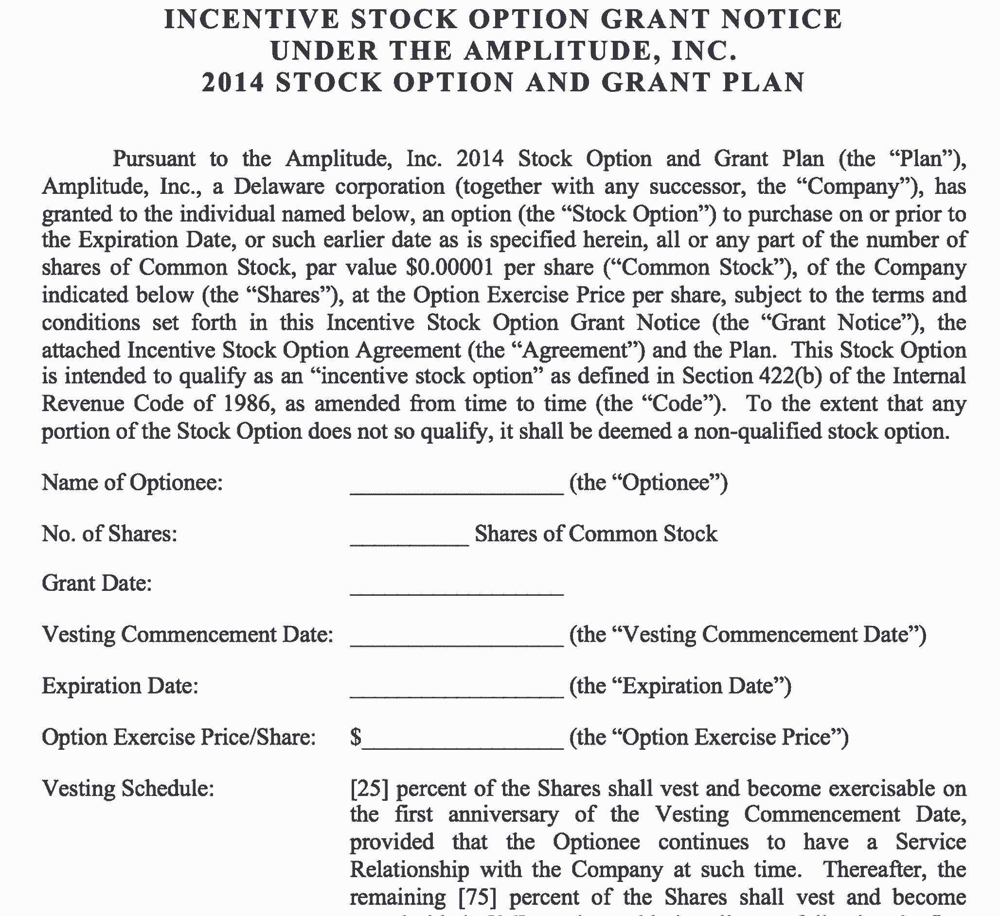
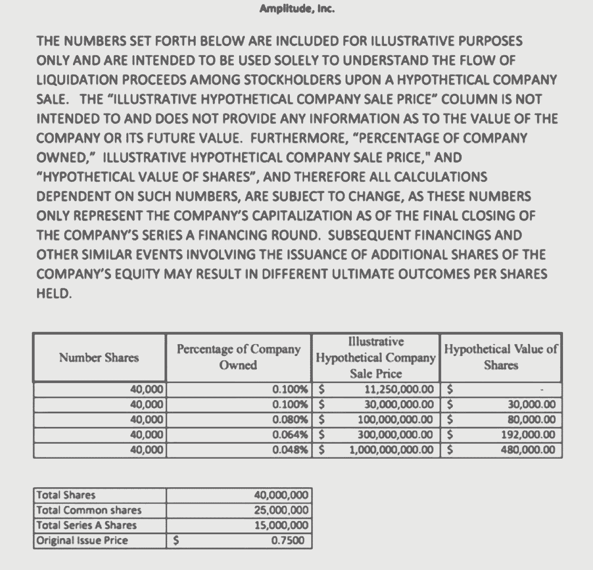

# 分两步转变员工股权薪酬-以下是如何进行的

> 原文：<https://review.firstround.com/transform-employee-equity-compensation-in-two-steps-heres-how>

很久以前，硅谷有一家科技创业公司。其稳定的增长变成了媒体的喧嚣。投资者以 3 倍的估值每 6 个月投入一次资金。它的员工很兴奋，谈论着“行使期权”、“全力以赴”和“获得良好的税收待遇”。一名员工提取了他一生的积蓄——数万美元——来行使他在这家初创公司的股票。

该公司的暴跌与其上升一样快。在引擎盖下有糟糕的经济状况，它破产了。领导层只设法在大甩卖中卖掉了公司的一部分。确信他的公司值得他花费毕生积蓄的员工却一无所有。他得到的不是一张中奖彩票，而是一张解雇通知书。

诸如此类的恐怖故事让 **[振幅](https://amplitude.com/ "null")** 联合创始人兼首席执行官 **[斯宾塞在近三年前的移动分析初创公司重新设定了股权补偿。在 Y Combinator](https://www.linkedin.com/in/spenserskates "null")时，他听说有人签署了他们不理解的合同，并在[Hacker News](https://news.ycombinator.com/ "null")上读到了员工的抱怨。他的网络告诉他，股权薪酬不是创新的领域，但 Skates 意识到它有多糟糕，并希望他的团队更好。他确信这不仅是正确的做法，也有助于 Amplitude 更好地留住和招聘人才。从那以后，其他一些公司也开始效仿。**

在这次采访中，Skates 深入探讨了为什么标准的股权薪酬条款不尽人意，以及如何调整才能更好地适合你的公司和员工。他还分享了他在 Amplitude 用来教育和更新他的团队的股票价值的指导原则。为了便于采用，Skates 提供了样本合同和图表，这样其他人可以从一开始就对他们的员工保持透明。

透明不仅仅是所有人手握会议或共享 okr。它始于你与你的员工签订的合同，并确保他们知道这意味着什么。

# 为什么你必须延长锻炼时间

根据 Skates 的说法，90 天的期权行使窗口是创业世界中最大的“陷阱”之一。“然而，当我四处询问时，许多公司——即使是那些以尝试股权分红而闻名的公司——都不愿改变它，”斯卡特斯说。“我听说这家富有的消费科技初创公司已经做到了这一点，但它的前律师向我承认，他以前从未见过它，也不推荐它。我甚至询问了与硅谷许多初创公司合作的两家主要律师事务所，但他们表示做不到。”

直到 Skates 在 Goodwin Procter 与团队会面，他才找到愿意和他合作的律师。“我了解到期权之所以存在，本质上是为了避税。如果公司直接给员工股票，他们需要为此纳税。但是，如果给他们以特定价格购买股票的选择权，在他们购买股票之前，没有什么可征税的。“现在有其他结构，如[限制性股票单位(rsu)](https://scs.fidelity.com/webxpress/help/topics/learn_rsus.shtml "null")，但据我所知，股权补偿以期权形式存在的最初原因是为了规避税收。因为如果你要从头开始设计这个系统，你很可能会直接给出股份。”

然后是 90 天的窗口期条款。“几乎所有的初创公司都会给员工 90 天的时间，一旦他们离职或被解雇，就可以行使他们的既得股票期权。如果他们不这样做，他们就会失去他们，”斯卡特说。“如果他们这样做了，他们必须支付股票的行使价以及他们的纳税义务。换句话说，普通员工必须在离开公司后的 90 天内拿出一大笔现金，可能是在他们试图寻找或开始一份新工作的时候。

对于溜冰鞋，比较股权工资真正揭示了它的缺点作为支付员工的表现和忠诚度。“如果你问起草这些条款的人，他们会告诉你，90 天窗口是公司收回股权的一种机制。但是，如果你不是真的愿意放弃，你为什么要首先授予它呢？这就像是说，让我给你这些现金，如果你离开，我们会建立一个机制来收回你的工资。“不，如果你工作了，你就有权利获得所有的报酬:金钱和股票。”

出于所有这些原因， **Amplitude 已经将所有员工的离职后期权行使窗口从标准的 90 天改为 10 年，无论他们的任期如何。**“实际上，这意味着员工即使在离职后仍拥有他们的既得股票期权，并可以在离职后十年内行使这些期权。从技术上来说，这意味着在员工离职 90 天后，我们不再收回他们过期的[激励股票期权(ISOs)](http://personal.fidelity.com/products/stockoptions/about.shtml#two-types "null") ，而是将它们转换为[非限定股票期权(NSOs)](http://personal.fidelity.com/products/stockoptions/about.shtml#two-types "null") ，这使得前员工可以拥有它们。好处是他们可以花十年时间来锻炼他们；缺点是他们没有 ISO 的税收优惠待遇。这并不完美，但这是朝着正确方向迈出的一大步。"

Skates 和 Amplitude 的团队在咨询了他们的律师后，与员工一起开源了 ISO 协议 的模板，以便其他创业公司可以使用它们。“对员工来说是不公平的——尤其是一个 22 岁的工程师在他的第一份工作中——被迫在三个多月的时间里做出可能是迄今为止最大的财务决定之一。“我们不认为这应该是对普通员工的特殊考虑。考虑到股权授予在初创公司是如此普遍，这项改革与其说是增加了一种新的福利，不如说是坚持了良好的创业文化，践行了公司的价值观。”

我们生活在创新的中心，除了补偿和把所有权给与我们一起建设的人之外，我们是如何“颠覆”一切的？

# 如何让公平教育从入职开始就持续进行

新员工的经历充满了文书工作，更不用说适应新的地方和角色的压力了。Skates 围绕股权薪酬的另一个目标是，让加入 Amplitude 的每个员工看到股权的透明性。这需要向新员工提供详细的信息，告诉他们被授予的股权意味着什么。“我们希望你像清楚自己的薪水一样清楚自己的权益。除此之外，我们不希望你从我们这里开始，就觉得在薪酬问题上，你需要自己照顾自己。“我知道消化这些信息需要多长时间，我宁愿团队专注于手头的工作，而不是花一周时间来思考如何优化他们在公司的投资决策。”

不要因为消极或中立而给员工带来更多的挑战。“公司通常会说，他们甚至不能告诉你我们有多少流通股。对不起，但那完全是废话。这不仅不真实，而且没有帮助。“最重要的是每股在公司中所占的比例，”斯卡特斯说。“公司也不愿说出一股股票的价值，因为它们被警告说，这构成了一种象征，员工可以让它们坚持到底。”

公司害怕在股权薪酬上大放异彩，所以把员工蒙在鼓里。这不是建立公司的方式。

Skates 采取的第一步是创建一个[员工股票汇总表](https://amplitude.com/blog/wp-content/uploads/2015/12/Employee-Stock-Summary-Chart.xlsx "null")，通过概述包括潜在稀释在内的假设情景来帮助他的员工进行情景规划。“我们通过一系列可能性来说明结果的范围。我也承认，如果我们以低于或等于清算价的价格出售，那么股权就一文不值。“当你和员工一起经历这些场景时，它为他们脑海中浮现的愿景提供了基础。即使这是一个方差很大的粗略估计，但有所显示总比什么都没有好。”

下面是图表中列出的五种主要情景:

**场景一**:公司一文不值。

场景二:公司在最后一轮融资时的估值是值得的。

**情景三**:公司经营良好。

**情景四**:公司做得很出色。

**情景五**:公司完全实现其长期愿景。

在 Amplitude，一旦候选人被录用，他们也会收到这份定制的股权薪酬表。“在面试过程中，我们不会提及我们对公平的立场，因为我们希望应聘者首先对公司、团队以及他们在团队中的位置感兴趣。“分享我们在公平问题上的立场应该会提升他们现有的热情，”斯卡特说。“当我们分享图表时，我们希望它能积极展示我们对透明度的承诺。尤其是如果这是他们的第一份创业工作，招聘经理或我会解释我们延长锻炼时间的过程。让他们知道我们会为我们的团队付出多少，这很重要。”

图表上有一个条款说，所有的计算都可能发生变化，并且只代表公司在最后一轮融资结束时的资本总额。“这是必要的法律术语，律师应该帮你起草。重要的是，它表明公司的估值和所有权百分比在未来会发生变化。这就是为什么我们大约每年给人们更新一次他们的排行榜，尤其是如果我们筹集到新一轮资金的话。“让他们明白我知道这些数字会改变，但不会改变它们的最终结果，这一点很重要。无论如何，我希望他们有一些背景和参考点。”

这个关于股权薪酬的新立场是关于你的领导者的。一旦决定了，就很容易实现。这是来自合适的律师的一次性费用，你已经准备好了。

# 股权薪酬的下一步是什么

Skates 在近三年前通过股权补偿实施了这些变革。虽然他注意到他的团队保留率很高，推荐率也有所上升，但(幸运的是)没有足够多的人留下来全面测试对离职员工的全面影响。“这仍然是一个实验，但我们相信，从长远来看，这项投资将像迄今为止一样值得，”Skates 说。“在 10 年窗口结束之前，我们必须通过员工是否用脚投票来衡量我们的方法。更广泛地说，如果科技采纳了这些变化。”

就目前而言，Skates 满足于通过振幅的两项变化来引领股权薪酬的发展，但也将关注其他科技公司在这一领域的任何新采用或创新。“比特币基地、 [Pinterest](https://www.pinterest.com/ "null") 和其他一些公司已经延长了员工的锻炼时间，但相对来说，很少有公司把锻炼时间延长到未来十年，”斯凯斯说。“我喜欢看到新的实验发生。Groupon 的创始人[安德鲁·梅森](https://www.linkedin.com/in/andrewmason "null")，他有一个新的创业公司[弯路](https://www.detour.com/ "null")，引领了一个有趣的模式，我可以最好地将其描述为社会主义公平。简而言之，你的股权一半是你的，一半分配给你团队的其他人。在收购的情况下，每个人都获得了股权的最低门槛。”

Skates 承认，梅森从他的 Groupon 血统中提取政治资本来进行股权补偿的大胆实验是正确的，但这不应该阻止其他人加入 bat。“触发机制有助于在发生收购时为授予的股权提供担保，是一个可以进行改革的领域。“在收购发生之前，会有创始人、投资者和顾问围着桌子，”斯卡特斯说。“我认为应该有一个积极的员工代言人。在最好的情况下，是创始人。但是，如果出现了有争议的问题，有人需要承担责任，往往是员工。人们不愿改变触发因素，因为这会降低你与买家的谈判能力。但这是以保护员工权益为代价的，他们帮助建立了你要出售的公司。”

与良好的管理相比，明晰员工权益很简单，但却是一件非常困难的事情。做一个更好的领导者，摘下低垂的果实。

作为麻省理工学院的前算法交易员和生物工程师，Skates 分析了他在复杂系统中的份额。当员工股权薪酬的泥潭困扰着他时，即使在与律师多次会面后，他也知道这对他的员工来说是一个烂摊子。具有前瞻性思维的创业公司应该从他的基础工作中受益，做出两个简单的修正。将所有员工的行权期从标准的 90 天延长至 10 年，并向每位新员工详细说明他们获得的股权在不同情况下意味着什么。Skates 为两者都提供了开源模板，所以你所需要做的就是咨询你的律师。

“不管是你的律师、投资者还是其他创始人，你都应该感到惊讶。但我更喜欢这样，而不是我的员工耷拉着肩膀。你的股权薪酬方式决定了人们如何进入和离开你的公司，以及他们是否仍然是你的品牌大使。你可以选择他们走后是为你举着蜡烛还是火炬，”斯卡特说。“我希望看到这种员工权益的方法在未来几年内发展成为标准，并标记出好的工作场所。理想情况下，创业公司采用其他方式来提高股权薪酬变得如此普遍。真正具有变革性的公司会在整个组织中创新，而不仅仅是在产品中创新。”