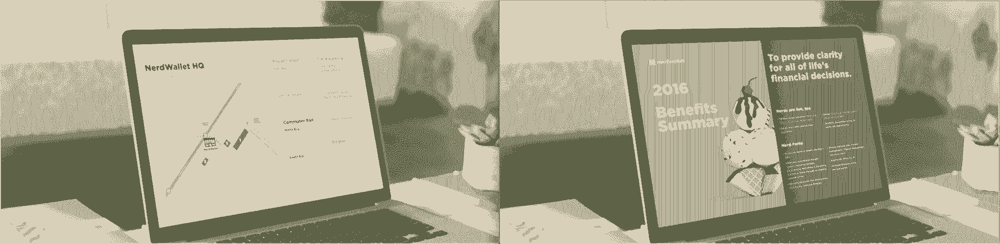

# 增强你的招聘机器——以下是如何

> 原文：<https://review.firstround.com/turbocharge-your-recruiting-machine-heres-how>

在她与 **[NerdWallet](https://www.nerdwallet.com/ "null")** ，**[flo thin](https://www.linkedin.com/in/florencethinh "null")**的采访过程接近尾声时，礼貌地接受了其首席执行官[陈永正](https://www.linkedin.com/in/tim-chen-1722b9 "null")的晚餐邀请。但是陈说，她没有和他一起吃韩国菜，而是和另一个人丹·柳一起吃。Thinh 最喜欢的食物的三小时盛宴和公司一样顶级。在宣传 NerdWallet 的同时，Yoo 询问了她的职业和兴趣。有一次，Thinh 被卖了，她说她可以看到自己在 NerdWallet 和 Yoo 一起工作，他回答说:“哦，是的，但我还没有签约。”

灯泡熄灭了。Yoo 不是 NerdWallet 的(正如她最初所想的那样),而是它的最终候选人——陈将两人配对，因此他们将结合在一起，并有望一起签约。他们做到了。当时，Thinh 引起了硅谷许多科技巨头的兴趣。这位 Zynga 的校友熟练地带领这家游戏公司实现了超高速增长，在四年时间里，公司从 40 人扩大到 3000 多人。那么，NerdWallet，她名单上唯一一家(当时)白手起家的创业公司，是如何找到这位明星硅谷人力运营主管的呢？

在首轮首席执行官峰会上，现任 NerdWallet 人力运营副总裁的 Thinh 回答了这个问题，他概述了一位出色的招聘主管的特点，以及如何设计和完善神奇的候选人体验。任何寻求吸引和留住最优秀人才的创业公司都将受益于 Thinh 从近 20 年的经验中筛选出来的来之不易的招聘经验。

# 如何招聘一流的招聘主管

当然，这不仅仅是一场晚宴。陈，当时也是招聘主管，带领她走过了一段非凡的求职之旅。“如果我能总结我的招聘经历，我会说这是非常真实的，”Thinh 说。“蒂姆全程陪同我。如果他试图关闭我，他做了一个地狱的工作。”

对于寻求相同招聘结果的初创公司，Thinh 提供了招聘人员不仅要展示，还要体现的四种品质:努力、热情、坚韧和激情。在这里，她将解构那些无形的品质，所以你可以在候选人身上发现它们:

**分辨侦探**。创始人经常问他们的招聘人员如何才能成为漏斗顶端的人。“你的招聘主管寻找世界级候选人的能力应该类似于侦探，”她说。“识别、研究和侦查是这项工作的一大部分。招聘人员通常利用三个主要渠道来发现和联系候选人:申请、推荐和来源。在你早期的谈话中，经验丰富的候选人应该强调使用技术工具，如 [A-List](https://alist.co/ "null") 、 [Gild](https://www.gild.com/ "null") 、 [Connectifier](https://www.connectifier.com/ "null") 、 [Rapportive](https://rapportive.com/ "null") 、[employed](https://hired.com/ "null")和其他人，展示对新产品的积极跟进，以改善他们的流程。

“如果你真的想加大招聘力度，在不同的工具和技术上投入大量资金来放大你的努力是很重要的。Thinh 说:“与你交谈的候选人应该对那些能为你节省时间和金钱的工具有自己的看法。“面试、评估和评价需要整个团队的高度投入。就像你的招聘主管负责对候选人进行资格审查一样，他们也会取消那些你不应该与之相处的人的资格。发现和区分足够多的人，并把他们带入管道，以找到合适的人，这种技能至关重要。”

**找评书，不卖**。尤其是当你在建立一个新品牌的时候，当你的招聘主管会见潜在雇员时，他必须是你的代理人。“他们不断参与、销售和推销。Thinh 说:“他们必须了解一个特定的角色如何符合你的目标，然后围绕这个角色为每个候选人建立一个独特的故事。“这意味着要问这样的问题:‘如果这个人在下一年超出预期，接下来会怎样？’或者“他们在我们公司的职业道路会是怎样的？”这些问题旨在揭示招聘者的努力、斗志和前瞻能力。"

故事是 Thinh 加入 NerdWallet 的驱动力，也是她才华横溢的招聘团队在招聘过程中考虑的一个因素。“对于许多初创公司来说，和你坐在一起的人可能是你公司的第四个团队成员，或者是你整个季度唯一的雇员。你最不希望招聘人员回答问题时说:‘我不确定。“让我去看看我能找到什么，”她说。“知道高绩效者寻求学习和接受挑战，最优秀的招聘人员会传达一个有抱负的愿景，并为其中的候选人展示切实的成长机会。”

把它当成一部电影。向候选人推销他们对一个宏大故事的贡献，而不是他们在剧本中的台词。

**让候选人推销他们上一家公司**。在她担任 venture 人才合伙人期间，Thinh 曾与一些公司合作，在这些公司里，每个团队成员都有不同版本的推介。当你在建立一个新品牌时，你的宣传必须连贯和紧凑。她没有让招聘人员候选人推销 NerdWallet，而是让他们推销他们目前代表的公司，这样他们就可以有正确的背景。她听的是:

引人注目的交付:他们是否列举了公司的工作清单，或者他们是否让你对他们正在解决的问题感到兴奋？

**真实的** **人际关系**:你是否感到情感投入，被邀请在他们的故事中扮演一个角色？

**渴望胜利**:他们是如何对待竞争对手的？他们拥有市场的计划是什么？

“如果他们能把这些都联系起来，你的招聘人员的推销应该——也将会——引起你的情绪反应，”Thinh 说。“这应该会激励你说好。我们总是听到“融洽、可信和信任”这样的字眼。它们不是流行语。它们真的很重要。”

请他们为你把脉。你的招聘主管是团队中每个人的得力助手。Thinh 建议创始人问以下四个问题来评估候选人理解和应对你的招聘环境的能力:

这个人将如何帮助我发展团队？

作为一家公司，我们有招聘盲点吗？他们将如何帮助我们发现并解决这些问题？

部门对团队的完善对我们有什么影响？

我们应该如何构建我们的招聘流程以保持竞争力？

“在测试这一点时，不要只是问:‘你如何能帮我导航和预测我们的招聘职责？’" Thinh 说。"让他们描述这些真正的挑战——并问你一些问题来弄清你具体的招聘障碍。**招聘人员的影响力是招聘经理的力量倍增器，会渗透到整个公司。**每个人都应该考虑组织发展的集体影响。"

生成真实的人际关系是招聘人员的首要和最后一项工作。

# 充满活力的招聘人员会彻底检查你的整个招聘流程

对任何公司来说——尤其是初创公司——招聘都是漫长而艰苦的。你的招聘主管构建一个相互关联的寻源、面试和成交流程的能力至关重要。这是 Thinh 和她的团队在 NerdWallet 的做法，也是她向同行推荐的方法。

通过细节表现奉献精神。人际关系的精准应该从你接触候选人的那一刻开始。在 NerdWallet，团队试图发现候选人 Twitter、脸书和 LinkedIn 个人资料中的细微差别，如他们最喜欢的食物或运动队，以融入他们的对外信息和未来的沟通。“我们与候选人建立共识的工作是经过深思熟虑的。Thinh 说:“我们试图找到尽可能多的接触点，在个人层面上建立联系。“尽早投资这一点，会让结束对话变得非常容易，因为你从一开始就承认某人是一个人——而不仅仅是招聘名单上的一个名字。”

关注细节也适用于求职者旅程的后勤方面。小小的举动可以产生巨大的影响。例如，NerdWallet 为候选人提供了以下材料，以使他们在公司前后的体验更好:

**面试日提纲。NerdWallet 在每位求职者到达前 48 小时发给他们一份大纲，详细描述他们在办公室的一天。它包括:他们将会见的团队成员的姓名和角色、采访时间和持续时间，以及他们全天将参加的任何活动。我们的目标是为他们提供所有他们需要的信息，让他们兴奋地来到这里，享受美好的体验。**

**交通小贴士。为了帮助人们避免在进入面试时感到疲惫，NerdWallet 提供了交通提示，比如最近的公交车站和停车点，这样求职者就可以以积极的态度开始他们的一天。**

**给亲人的文学**。在候选人收到录用通知之前，NerdWallet 分享了他们的福利摘要:这是一个有用的指南，让人们可以带回家给家人，并说:“嘿，我正在考虑这份工作。让我们一起来看看。”

被候选人信任并对其透明意味着在被要求之前给出背景。

关注细节会带来个性化的体验，这不仅体现在 NerdWallet 测试的内容上，还体现在测试的方式上。“一些候选人做现场案例研究，向团队展示他们的发现，其他人做白板演示。Thinh 说:“对于其他人，我们会把案例研究带回家，并进行一对一的评估。“关键是要有意识地组织面试过程，提高你理解候选人擅长什么的能力。这将取决于角色、职能和候选人，但关键是要找到你试图挖掘的技能，并在面试设计中灵活地展现这些技能。”

**将求职者的旅程设计成双重试镜**。填补一个职位并确定候选人是否合适的紧迫性往往会给双向评估的招聘过程蒙上阴影。Thinh 说:“很多时候，我们都在检查招聘步骤中的方框、要问的问题和要收集的候选人信息，以至于我们没有考虑候选人想要和需要从这个过程中得到什么。”“我和我的团队试图将每一段候选人关系都视为一个双向审查过程。许多招聘人员让候选人积极主动，但我们知道，表现得好像候选人也在寻找背景信息以告知他们的决定，这符合我们的最佳利益。我们试图通过问一些基于我们共同经历的问题，让候选人放心地向我们提问——比如对当天访问或面试官的反馈。”

如果每一次互动都是双重面试，那么所有员工——不仅仅是招聘人员——都需要准备好与候选人交谈。其中很大一部分是帮助他们变得真实。Thinh 说:“真实性是 NerdWallet 的一个定义性价值观，我们鼓励每个团队成员在与潜在雇员互动时做真实的自己。”“这不是为你的公司创造一个新的自我或角色。真正成为团队中的自己，并拥有它。”

NerdWallet's VP of People Operations Flo Thinh

这并不是说 NerdWallet 的团队成员凭感觉飞行。“我们指导我们的团队回答难题。如果有人有一个棘手的问题，回答它。如果他们问你面临的障碍，告诉他们。完全透明，”Thinh 说。“我们希望我们的候选人将我们视为自己。一旦你成功招募了某人，他们就不想被卖掉。他们马上就能看穿这一点。”

Thinh and NerdWallet 的招聘团队还为每个团队成员提供了关于每个候选人的大量信息。“面试占据了你的团队与候选人相处的大部分时间。你需要有很强的一致性，才能产生有凝聚力和有意义的影响。你必须利用这段时间。她说:“每次面试都是讲述 NerdWallet 故事的机会。“我们为每位面试者准备了候选人的简历，他们是如何进入面试过程的——是主动接触还是推荐，空缺职位的角色和所需技能，以及候选人目前如何评估该职位——主要是他们是兴奋还是被动。这给了团队成员很好地评估候选人的背景。NerdWallet 还依靠公司的[职业发展矩阵](http://firstround.com/review/the-total-talent-reboot-how-this-startup-overhauled-its-workforce/ "null")来了解候选人在团队当前结构中的位置。每次学习都与招聘团队分享。”

尊重你的候选人，承认他们所有的需求。坚持不懈地消除摩擦。

**永远不走寻常路**。如果 Thinh 只能给出一条关于招聘的建议，这就是她的指导。Thinh 估计，他们遇到的 40%的候选人并没有积极寻找新的角色。他们从随意的谈话开始，直到书呆子团队想出办法来进一步吸引被动的候选人。

有一次，Thinh 在寻找。她是第三个试图应对一个具有挑战性的空缺职位的招聘人员。“进展不顺利，招聘经理变得非常不耐烦。我找到了一个候选人，看了他的简历，感觉一切都很同步。我早上给他打了个电话，在他说话的时候，我一直在想，‘这个*就是*他。这是*的*候选人，*’*”她说。“我们知道下一步和时间表，但我觉得这还不够。所以我问他:‘几个小时后你打算做什么？’？“我能顺路过来和你一起吃午饭吗？”这很大胆，但这是一个不按你的方式行事的连锁反应的例子。这个人最终在那里找到了一份工作，并在公司呆了几年。"

在她 17 年的招聘生涯中，Thinh 认为，招聘领域变化最大的是在候选人面前脱颖而出以成功吸引人才变得越来越重要。“我们花了大量时间专门为候选人量身定制流程的每个部分，无论是带人出去吃午餐还是主持现场信息发布。事实上，在最近的一个季度中，NerdWallet 托管了 200 多个站点，”Thinh 说。“只是市场不同而已。除非你投资候选人的经历，否则你赢不了。它必须成为第二天性。"

在 NerdWallet，每个候选人在头 15 分钟内都会有一次参观。任期从两周到三年不等的团队成员参与到这个过程中。“我们希望这是一种身临其境的体验。Thinh 说:“每个求职者都应该感到能够感受到在这里工作的感觉，即使只是在大厅里走走，看看团队在工作。“在参观过程中，候选人会得到一个向导来解释所有会议室名称背后的含义。这让他们了解了我们的文化，对于带领参观的 NerdWallet 团队成员来说，这是一个简单的话题。团队给候选人一张便条，感谢他们前来与他们会面。如果有候选人加入，他们会在一张手写的欢迎明信片上签名。”

在速度和匆忙之间找到你的极限。在 NerdWallet，团队有一个 SLA，可在 48 小时内对推荐候选人作出回应，贯穿整个流程的每个部分。无论是安排电话面试还是联系推荐人，都要让你的候选人尽可能顺利地通过一个周期。

然而，当该关门时，至少踩一次刹车。Thinh 发现招聘人员在关闭新候选人时最常犯的错误是匆忙做出决定。对事情正式化感到兴奋是正常的，然而，她建议停下来问:“这个候选人准备好接受邀请了吗？”对候选人如何做决定做最后一次评估。确保你问了这些问题，并得到了这些问题的答案:

你评估这个决定的框架是什么？

在家里你和谁一起做决定？

你如何对你的决策的不同因素进行排序？

在 1 到 10 的范围内，你会给你现在回答“是”的能力打几分，10 分是响亮的“是”？

如果你还没有达到 10 分，是什么阻碍了你？我们能做些什么让你到达终点？

如果候选人在其他公司面试，时间尤其能说明问题。“**永远不要给出过时的提议，**”Thinh 说。“当你过早地提出报价时，它只会被搁置在那里。候选人要货比三家，比较一下。不要假装他们没有和其他公司合作。问问他们现在处于什么阶段，他们对他们的感觉如何，这样你就可以确定自己何时何地适合他们。”

**提前开始你的薪酬对话。如果你不能在过程的早期提出薪酬问题，这可能会是一个令人不舒服的话题。“你的招聘人员需要已经建立了这种融洽的关系，并直接与候选人就条款进行沟通。如果你等到所有人都认为你有一个很好的候选人，你就去拜访他们，*然后*你开始讨论一份工作，这将是一个挑战。”**

“在 NerdWallet，我们的招聘人员非常了解我们创立的薪酬理念，这有助于尽可能简化流程。一旦我们感觉到共同的兴趣，我们会与候选人分享。这不仅使我们能够在不要求他们透露任何信息的情况下主动出击，也使我们成为一家与众不同的公司。到了成交的时候，双方都知道这笔交易，并尊重对方的需求。”

对你招聘经历的试金石是你最后一次关于薪酬的谈话——它可以反映出求职者的旅程有多有意义。记住，你卖的是一个在改变世界的故事中扮演一个角色的机会，而不是一个死板的、带着重号的工作描述。“你的公司、文化、机会和技术都有非常独特的地方，”Thinh 说。“利用它。它应该有助于你的候选人回答这样的问题:“这和我的职业抱负有什么关系？”我能学到什么新的令人兴奋的东西？我将如何对这个世界产生有意义的影响？如果你从一开始就解决这些问题，薪酬就不会成为障碍。"

像对待产品一样对待你的求职之旅——坚持不懈地提炼它。就像你测量一个新版本的使用指标一样，你的每一次雇佣都是一个学习和改进你的过程的机会。一名 NerdWallet 员工是招聘新手，她在电话面试阶段注意到一个不寻常的下降。“在查看了一周又一周的落榜情况后，我们回去与那些没有继续这一过程的候选人进行了交谈。她说:“他们给了我们两条反馈:我们需要加强推销，我们的一个书呆子需要更多的面试经验。”。“主动捕捉这些信息为我们节省了大量潜在的时间损失。你不必等到雇佣了 10 个人后才开始衡量和提炼。你可以从一次招聘过程中收集到有价值的信息。”

你的招聘过程就是你的剑和盾。定期打磨。明智地运用它。

# 你的求职之旅就是你的竞争优势

Thinh 在第一轮 CEO 峰会上发言的那个月，她指出，湾区有 12，700 个软件工程师职位，外加 7，400 个产品经理职位，平均每天增加 1，500 个。当试图填补这些角色时，处于早期阶段、资金紧张的初创公司如何在苹果或脸书这样的巨头中脱颖而出？首先，遵循 Thinh 的建议，帮助找到并雇佣一个有能力的招聘主管。找一个讲故事的侦探，她可以轻而易举地用细微差别推销她的上一家公司，并提出正确的问题，让她有能力推销你的初创公司。然后找到并拉动杠杆，创造一个神奇的候选人体验:总是走出你的方式和汗水的细节。提前展开关于薪酬的对话。进行双重试镜。在速度和匆忙之间找到平衡。总是寻求改进你的过程。

“与任何业务一样，人员是公司发展过程中最困难和最具变革性的部分之一。胜利发生在边缘地带。你将如何激活那些能让你将候选人纳入麾下的小技巧和小调整？这不仅仅取决于你的招聘经理。这取决于你的整个团队，”Thinh 说。“你需要有人来做这份工作，但是，当然，招聘过程并不仅仅围绕着你的需求。类似于结婚或者买房，找新工作真的压力很大。所以，无论何时你认为你已经完成了对招聘过程的磨练，回头问问自己:我怎样才能减轻应聘者的压力，让招聘过程更加顺畅？你的团队的未来取决于此。”