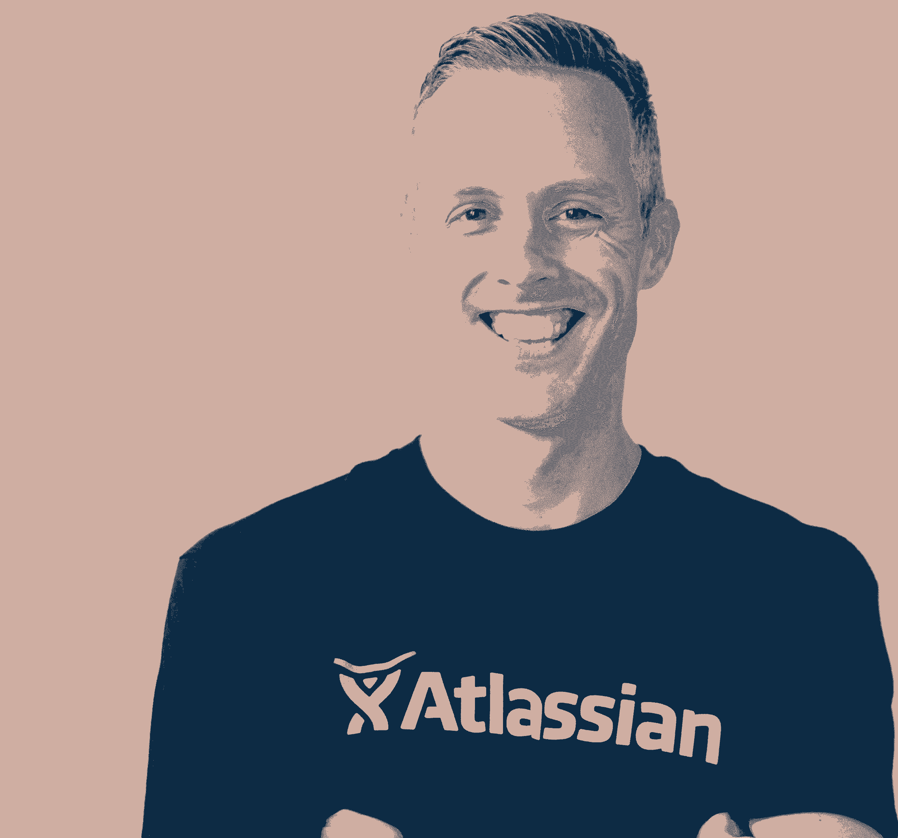

# 解开 Atlassian 最不寻常的 5 个公司建设步骤

> 原文：<https://review.firstround.com/unpacking-5-of-atlassians-most-unconventional-company-building-moves>

有很多年轻、耀眼的初创公司似乎一夜成名，它们登上舞台，成为头条新闻，并以惊人的速度增长——亚特兰大 不是其中之一。该公司已经蓬勃发展了 18 年，悄悄地改变了传统科技公司的基础。

在那段旅程的大部分时间里， **[杰伊·西蒙斯](https://www.linkedin.com/in/jaysimons/ "https://www.linkedin.com/in/jaysimons/")** 是行动的中心。他于 2008 年加入 Atlassian，在他长期担任总裁期间，该公司从 AAR 的 2000 万美元增长到今天的约 20 亿美元。现在，作为 [Bond Capital](https://www.bondcap.com/ "https://www.bondcap.com/") 的合伙人和 [Hubspot](https://www.hubspot.com/ "https://www.hubspot.com/") 和 [Zapier](https://firstround.com/review/how-zapier-pulled-off-its-one-and-done-approach-to-fundraising/ "https://firstround.com/review/how-zapier-pulled-off-its-one-and-done-approach-to-fundraising/") 的董事会成员，他有很多故事要讲，这些非常规举措使 Atlassian 成为全球领导者，拥有一套软件协作工具，如吉拉、Confluence 和 Trello。

大多数人都听说过 Atlassian 缺乏传统销售队伍的故事。但在我们与西蒙斯的交谈中，我们发现这并不是该公司故事中唯一的异数。如果你翻开任何一块石头，你可能会发现一些与趋势相反的东西。无论是该公司在澳大利亚的起源——远离硅谷的重心——还是不寻常的双首席执行官领导结构，或者仅仅在第二年就推出第二款产品——这都是一个没有得到足够关注的增长故事。

“对我们来说，只是做一些在其他地方有效的事情真的很少见。在文化上，我们总是从这样一个问题开始:“为什么要这样做？西蒙斯说:“我想先了解它，也许不仅有渐进式创新的空间，还有能给我们带来巨大变化的真正发明的空间。”。

不断地愿意重新发明轮子需要一吨屎的勇气和精力。更简单的方法是直接从剧本上撕下一页，照着剧本写。

在这篇评论中，我们是那些能够跳出框框思考并回避传统智慧的[人的忠实粉丝，而西蒙斯则是深入杂草中解开这些非典型举动的游戏。在这次独家采访中，他对 Atlassian 三管齐下的每一条腿都进行了令人难以置信的战术分析:自助服务漏斗、全球渠道合作伙伴网络和企业向上销售。他还深入探讨了为什么在有人创造这个词之前，该公司依赖于产品导向的增长，他对 HipChat 为什么输给 Slack 的理论，以及推动和加强该公司向上和正确增长的飞轮。对于走向市场和收入的领导者来说，有大量的即时建议，但对于任何公司建设者来说，也有关于设计植根于第一原则思维的产品和文化的课程。](https://firstround.com/review/what-your-startup-can-learn-from-astronauts-the-daily-show-and-the-coach-of-the-boston-celtics/ "https://firstround.com/review/what-your-startup-can-learn-from-astronauts-the-daily-show-and-the-coach-of-the-boston-celtics/")

# 非常规举措 1:建立在产品导向型增长的基础上。

在与亚特兰蒂斯内部人士的任何对话中，你可能会反复听到一个词:飞轮。“我们很早就被这个比喻所吸引，因为飞轮是一个又大又重的装置，需要大量的能量来旋转。你通常不能让它加速很快，因为需要很大的推力。但是一旦你让它运转起来，它就会以一致的速度前进，你可以添加一些小的东西来让它走得更快一点，”西蒙斯说。“相反，很难让飞轮停下来——你不能抓住它让它停下来。这符合我们一直试图构建的目标，即业务作为一个整体的持久性。”

对 Atlassian 来说，飞轮的核心成分是产品导向的增长，这种精神早于西蒙斯。“甚至在我到那里之前，公司最早的使命就是制造卓越的产品。他说:“他们真的有意使用‘卓越’这个词，因为他们认为，‘我们想要打造一款能让人们对它产生评价的产品。’”“Atlassian 相信，我们已经开发出了一款易于使用、深受人们喜爱的产品，这将有助于宣传我们是谁以及我们在做什么。”

很多公司在制造出可以自我销售的产品之前，都在担心如何销售产品。

但是一个可爱的产品不足以打入拥挤的市场。Atlassian 部署了三种策略来消除客户经常遇到的一些障碍:

自助服务

直观定价

销售选择

“产品和商业模式真的结合在一起了，这就是我们做对的，”西蒙斯说。

## 思维自助第一。

该团队坚信[客户希望自助](https://firstround.com/review/designing-your-sales-stack-so-that-customers-come-to-you/ "https://firstround.com/review/designing-your-sales-stack-so-that-customers-come-to-you/")，并围绕该自助服务模式设计了一切。“首先，你必须创造出一个伟大的产品，让人们能够自己发现，自己开始使用，自己有效地使用。他说:“如果你做不到这些，就不会有效果。

因此，Atlassian 没有将潜在客户引向传统的“联系我们”表格和销售人员的推销，而是优先考虑不需要大量解释的直观入职流程。如今，自下而上的 SaaS 得到了大量的关注，但早在 2002 年推出吉拉时，Atlassian 也受到了相当多的侧目。“我们是 AdWords 的早期采用者，希望在客户寻找解决问题的方法时与他们见面。这是 IBM 或我们的自由和开源竞争对手没有真正做的事情，”他说。

## 消除摩擦的定价。

除了吸引眼球，该公司还需要在潜在客户的道路上扫清其他几个障碍。“我们希望产品能像坐在顾客身边的人一样引导顾客。这意味着让他们更容易在线交易和购买产品。西蒙斯说:“我们需要一个不需要太多解释或说服的价位。

现在，Atlassian 有一个分层的定价结构，包括免费版、标准版、高级版和企业版。但在早期，情况并非如此。“当时，我们太专注于减少向我们走来的客户的认知负荷。如果你有四个不同价位的四个不同版本，那就很难帮助客户渡过难关，”他说。相反，Atlassian 为该产品确定了一个价格点，略高于免费。但这意味着减少分销上的开销以避免亏损。

Jay Simons, former President of Atlassian, and Partner at Bond Capital.

## 与不同类型的销售队伍一起扩大规模。

该公司没有大批销售人员，而是投资于它所谓的产品倡导者。“我们会对每一位顾客说，‘让我们知道我们能帮上什么忙。’我们的产品倡导者绝对专注于客户的成功，他们在那里消除客户可能陷入的任何困境。他说:“他们会回答一个关于产品功能、竞争对手或定价的问题，但如果答案很好，他们会让客户重新走上自助服务的道路。”。

一对多的商业引擎和对自助服务的强调意味着该公司的人力资本更具成本效益，为扩大规模留下了大量绿色空间。

“Atlassian 现在可能有近 5000 名员工，相对于大多数这种规模的企业软件公司，由于飞轮方法，它的配额运营商数量很少，”Simons 说。

该公司认为这个自助服务漏斗本身就是一个产品，并不断修补机会进行优化。“如果有人对产品进行了评估，然后说，‘不，我不打算买它’，我们就会花大量时间去了解是什么让你头疼，从而说服你去别的地方，并寻找我们可以消除的模式，”他说。

商业模式最终成为商业。这与你追求的市场和你打造的产品同等重要。

# 非常规举措#2:过早推出第二款产品，并学会何时放手。

“在 Atlassian 的第二年，我们创造了我们的第二个产品 [Confluence](https://www.atlassian.com/software/confluence "https://www.atlassian.com/software/confluence") ，这真的很不寻常——尤其是当你有了像吉拉这样发展非常好的突破性产品时。西蒙斯说:“传统的公司建设智慧会说不要这样做——在第一件产品上你仍有大量工作要做，一旦你开始做第二件事情，它就会分散你的注意力，这对一家年轻的公司来说可能是死刑。”。

Confluence 不仅成为 Atlassian 产品套件的基石，而且 Simons 还发现了许多不太明显的 uspides。“我们开始围绕你如何看待交叉销售、交叉销售和追加销售来建立这种力量。[你如何看待围绕多个事物的定价](https://firstround.com/review/its-price-before-product-period/ "https://firstround.com/review/its-price-before-product-period/")和包装？你如何进行产品规划、优先排序、预算和人员配备？”

在很小的时候，在 Atlassian，我们就开始让我们的大脑思考所有那些随着公司变大而需要做的事情。

这并不是说增加新产品的决定总是一致的。“有很多争论、规划和思考需要权衡。当你有一家自己经营的企业，有很多事情需要你为现有客户做的时候，开始一些新的事情确实会让你远离这些。这是一个零和游戏，”他说。“这一切都始于倾听市场和客户的声音，关注我们不得不为自己解决的内部问题，以及我们是否认为这些问题可以转移到成千上万的客户身上。”

每一次你创造新的东西，都会从已经存在的东西中带走同样需要更多煤的东西。

“回顾 Atlassian 推出的所有不同产品或我们完成的收购，每一项都涉及一系列不同的辩论以及同意不同意或不同意和承诺，”Simons 说。

虽然在公司相对年轻的时候推出第二款产品有自己的陷阱要避免，但随着公司的发展，还有一系列全新的挑战要应对。“随着你变得越来越大，这也变得越来越难，因为你添加的产品实际上需要变得更大。他说:“对于像 Atlassian 这样拥有数亿件产品的公司来说，你添加的新东西必须快速增长，而且必须有一个可以增长的大市场。

### 输给年轻新贵的刺痛:HipChat vs. Slack。

但 Atlassian 也在桌子的另一边，被竞争对手用单一的激光焦点击败。“HipChat 是一个成长中的产品，被许多公司使用，但当时市场仍处于萌芽状态。在市场成熟到这些技术可以做什么之前，Slack 开发了一个伟大的产品,然后把一切都做对了。”

西蒙斯说:“历史上有一些这样的例子，当我们试图同时做许多事情时，你却松懈下来，只是无情地专注于一件特定的事情，继续前进，更快地前进，不断创新。”。

Atlassian 最终在 2018 年宣布，他们将把 [HipChat 剥离给 Slack](https://slack.com/blog/news/atlassian-and-slack-partnership "https://slack.com/blog/news/atlassian-and-slack-partnership") 。“公司很难承认事情没有按照你希望的方式发展，并与市场和客户展开真正坦诚的对话。**对公司来说，继续前进，增加几个功能，然后基本上忽略它更容易些**，”他说。

Atlassian 的价值观之一就是“不要干顾客”我们认为，不诚实地表达我们的感受，从长远来看，我们无法通过 HipChat 赢得这个类别，并给予我们全部的关注，这违背了这些价值观。

西蒙斯现在称自己为 Slack 的啦啦队长，并为 Atlassian 团队做出的勇敢决定感到自豪。“不撤资是有机会成本的，这意味着不那么关注我们觉得胜算更大的机会，”他说。

# 非常规之举 3:将统治权交给渠道合作伙伴。

当谈到建立他们的企业客户群时，Atlassian 再一次抵制了从其他人的剧本中吸取经验的冲动。“当 Atlassian 非常年轻的时候，我们会遇到企业中的客户，他们会说，‘我把你比作 IBM Rational，IBM 派出了一个完整的演示团队，做了一场盛大的表演，我希望 Atlassian 做同样的事情。’“我们选择不直接投资，”西蒙斯说。相反，我们认为这是建立渠道合作伙伴生态系统的绝佳机会，因为如果我们想推动企业发展，这些大公司将需要一些支持。"

[渠道合作伙伴](https://firstround.com/review/From-Zero-to-10000-clients-in-Two-Years-Using-Channel-Partners/ "https://firstround.com/review/From-Zero-to-10000-clients-in-Two-Years-Using-Channel-Partners/")似乎是填补公司缺口的有趣解决方案。但是如果没有清晰的泳道，这种关系会很快恶化。“经常发生的情况是，直销活动可能开始蚕食渠道合作伙伴的机会，”他说。西蒙斯为我们介绍了常见的陷阱:“首先是，‘嘿，如果在韩国有一家代表我们进行转售的公司就太好了。’但当你发展到一定规模时，你已经有了自己的人，他们开始关注最大的机会。渠道被推到价值链的下方，他们从能够销售和支持最大的公司转向中型公司，最终只支持小型公司。在这一点上，他们可能会多样化，以找到更多的产品和公司来代表，他们的注意力被打破，然后渠道退化。"

另一方面，[建立自己的内部销售团队也面临许多挑战](https://firstround.com/review/Looking-to-Scale-Your-Sales-Seven-Bullets-to-Dodge/ "https://firstround.com/review/Looking-to-Scale-Your-Sales-Seven-Bullets-to-Dodge/")。“如果你考虑建立一个国际业务，很多公司会说，‘我需要我的第一双靴子踏上欧洲的土地。’但这不仅仅是实地考察，因为你不仅仅需要一名销售人员，你还必须考虑如何为这个人提供营销支持。最终，支付工资以及他们如何与当地客户进行交易都会涉及税收问题。在一个特定的国家插上一面国旗还会有很多其他的事情，而且会变得非常复杂。"

但是渠道伙伴关系很棘手——而且很少执行得很好——的原因是，放弃控制权是大多数公司领导人不太喜欢的事情。西蒙斯说:“很难将企业的核心部分——寻找、销售、转化客户并让他们成功——托付给公司以外的第三方。“我们与该频道有着真正的共生关系，因为我们没有直接与他们竞争。”

雇佣自己的销售人员并控制和培训他们更容易。被第三方代理很难，而且要求你做事与众不同。

但这是 Atlassian 愿意为长期增长做出的权衡。“我们关注的是我们可以从哪里获得杠杆来提高我们的速度和业务效率。我们没有自己的寻找最佳交易的销售团队。每当有真正大的机会时，我们就会主动介绍我们的渠道合作伙伴来处理销售业务，”他说。

它现在是该公司营销飞轮的核心部分，并创建了一个全新的生态系统，在全球拥有 400 多家 Atlassian 渠道合作伙伴，雇佣了数千人。“如果只是我们，在德国有一个 100 人的团队，我认为这种方法与德国成千上万的合作伙伴相比就相形见绌了，他们每天起床，没有来自 Atlassian 的名片，但本质上是在为 Atlassian 工作，”西蒙斯说。

# 非常规举措#4:推迟企业行动。

最初的单一价格的单一产品(吉拉)已经发展成为一个完整的产品套件和一个更传统的分层定价结构。但这种简单的自助服务仍然是 Atlassian 品牌的核心——即使是对其最大的客户。“时至今日，Atlassian 获得的大多数新客户都是通过自助服务渠道获得的，”Simons 说。“即使你是一家财富 10 强公司，你也可以从 Atlassian 开始，组建一个 10 人、20 人、50 人或 100 人的团队。在这种特殊情况下，你可能每月花费不到 1000 美元，但随着你开始成长，我们的产品内置了自然网络效应，这是我们的优势，因为它们是协作软件。你可能会从一个团队中的 10 个吉拉用户开始，随着你的团队增加第 11 或 12 个人，我们自然会从这种扩张中受益。”

在早期，Atlassian 并没有优先考虑与数千个座位签署大额合同，而是依靠低成本策略。“我们将通过营销和产品推动，重点突出客户获得产品 B、C 或 d 的途径。如果你使用 Confluence 或吉拉，我们希望为你指出另一个，通常就像你在吉拉项目中粘贴谷歌文档链接时的一个小弹出窗口或一个小提示一样简单，它说，‘看起来你正在将内容连接到你的吉拉项目。你知道有更简单的方法吗？点击这里，”西蒙斯说。“Atlassian 产品组合中的每一种产品实际上都是客户可以开始使用的产品，或者是他们可以扩展的产品。我可以从吉拉开始，扩展到合流。我可以从 Confluence 开始，扩展到 Bitbucket。我可以从 Bitbucket 开始，扩展到 Trello。”

## 把企业放在次要位置。

随着公司“土地和扩张”战略的实施，公司推迟了任何真正的企业重点，而是优先考虑一些明显不那么性感的东西。“我们有效地重新构建了我们的云，它服务于从两人团队到 10，000 人或更多团队的大量客户。西蒙斯说:“我们真的需要重建它，让它成为未来 10 年、20 年 Atlassian 的主要平台。

如果这听起来像是一种明显的权衡，那么西蒙斯当时肯定不这么认为。“回想 2011 年和 2012 年，当时企业市场的大多数客户都在使用本地产品。因此，我们可以说，‘让我们抓住这个企业机会，推迟云计算。我认为这是错误的选择，但这是一个非常战略性的选择，”他说。

Atlassian 选择用更快的短期增长和机会来换取公司的长期持久性，这是我们每天都会做的交易。

最终，随着长期云战略的实施，该公司根据客户的反馈转向了新的企业重点。“我们有很多大型企业要求我们做的事情。当我们开始投资它们时，我们认为这里有一种产品可供我们的这些大客户升级。西蒙斯说:“我们最大的客户有时会有 10，000 人在一个版本的吉拉上运行，他们想要的一些东西并不在产品中。

随着企业客户名册的扩大，这是一个合适的时机，而且底线反映了这种冲动。“在某些情况下，升级可能会使他们从每年花费数十万美元增加到每年数百万美元。在这一点上，对我们来说，对那些有实质性增长机会的大客户更主动一点是很有意义的，”他说。

## 从最小的客户到最大的客户的自助服务。

该公司在 2013 年左右增加了第一个企业倡导者角色，并开始了寻找产品/市场契合度的旅程。“我们让倡导者联系这些客户，并开始与他们谈论我们希望添加的功能以及价位。西蒙斯说:“这实际上是一份传统的销售工作。

经过几个月的交谈，并意识到他们的产品/市场确实合适，该公司再次加倍努力实现自助服务，即使是为企业量身定制的这种新的优质产品。“我们再次做的事情给了我们杠杆，就是我们说，‘太好了，我们已经发现我们实际上已经以人们愿意支付的价格点获得了产品/市场契合度。让我们把它放到网上，这样人们就可以在网上购买了。然后，让我们在产品中加入自动化工作，以推动管理员或吉拉的主要赞助商转向这一高级版本，他们可以将这一版本添加到他们的账单中，或者他们可以在每年的续订周期进行升级，如果他们不想与任何人交谈，他们可以自己进行升级，”他说。

随着高端企业产品的推出，该公司最初的单一定价结构已经演变为更传统的分层体系。“现在，如果你看看 Atlassian 今天的情况，价格结构已经变得更加复杂。它有一个非常常见的免费菜单，略高于免费，标准，然后是高级和企业，”西蒙斯说。

这似乎违反了亚特兰蒂斯的创建原则，但西蒙斯认为这种进化是唯一可能的，因为这是非传统的开始。“Atlassian 凭借其产品品牌在市场上更加稳固。因此，新客户的额外[认知超载被其市场地位和品牌所抵消。客户可能愿意花一点时间了解 Atlassian 的选择，因为他们知道 Atlassian 是谁，如果它只是一家他们以前从未听说过的公司，”他说。](https://firstround.com/review/cognitive-overhead-is-your-products-overlord-topple-it-with-these-tips/ "https://firstround.com/review/cognitive-overhead-is-your-products-overlord-topple-it-with-these-tips/")

## 接吻原则在起作用。

这一切都可以追溯到早期，当时 Atlassian 重视进入尽可能多的公司，而不仅仅是席位最多的公司。“当我们还不为人知、年轻、弱小的时候，它帮助了我们，因为它太简单了——[接吻原则](https://en.wikipedia.org/wiki/KISS_principle "https://en.wikipedia.org/wiki/KISS_principle")实际上对我们有利，你只要来到网络，它就像，哦，吉拉的一个价格。我只需要考虑用户数量，不需要考虑‘包括这个吗？它是否提供单点登录和安全功能？不，这在企业产品包中。那东西值两倍的价钱吗？所有这些问题都让客户陷入思考，这就是摩擦，”他说。

摩擦在正确的情境下用正确的方法可以没事，但在我们的特殊情况下，我们选择不引入它。我们只是想让事情变得简单。我们将寻求高速度的大规模客户获取，我们将保留未来与这些客户进行扩展对话的机会。

随着 Atlassian 足迹的增长，层级开始到位。“当我们决定考虑扩展我们的产品层级时，你猜怎么着？他们已经上钩了。他们已经很投入了。他们喜欢这个产品，成千上万的用户都在使用它。现在，他们只是想要一些额外的安全功能，如果我们想向他们收费，这可能更容易，”西蒙斯说。

“我并不是建议每家公司都遵循这个剧本，但我确实认为‘保持简单’的策略让我们投资的许多其他东西受益匪浅。这真的给了我们建立一个系统的自由，我们能够随着时间的推移建立和改进这个系统，”他说。

# 非常规之举 5:重视基本原则文化。

也许没有什么能证明 Atlassian 像 S-1 文件一样以自己的方式做事的承诺。“我们的 IPO 申请文件的封面照片上有一张苏斯博士角色的照片，并引用了他的一句话，‘要成为第一名，你必须是个怪人。’西蒙斯说:“我们想表明我们与众不同，不落俗套，这些东西对我们努力实现的目标是有益的。

在公司的早期，领导层专注于三个主要领域的创新:业务、产品和文化。“这些是我们在第一原理思维上投资最大的地方，也是我们正在建设的比我们更长久的业务的最基本要素。因此，我们花时间去思考这些问题，而不只是照本宣科，这真的很重要，”西蒙斯说。

从非常规的绩效评估方法到简单到可怕的季度员工调查，领导层都在寻找杠杆来尝试调整。"**并非所有的方法都奏效，但重要的是我们尝试用不同的方式做事。当它们起作用时，这些差异非常重要。**当它们不起作用时，你总是可以回到 90%的公司进行绩效评估的方式，”他说。“我感到自豪的是，我们对此并不武断。我们只是对如何让不同的东西发挥作用非常好奇和深思熟虑。”

更准确地说，在 Atlassian 的旅程早期，团队决定拒绝任何定价或条款和条件谈判。“如果有客户说，‘听着，我需要协商我的保修或赔偿条款或付款条件，’**我们基本上只是说不——而且很难对想给你钱的人说不**。但我们基本上是说‘我们不会付钱让人们和你一起做这件事，因为我们对你的产品要价很低。我们把不用律师或销售人员为你谈判折扣而省下的钱留给你，给你更便宜的软件。如果谈判赔偿条款对你来说真的很重要，我们的竞争对手可能会这么做，但他们会向你收取 10 倍的费用。“最终，该公司在没有一辆经过改装的 ULA 的情况下，抓住了第一批 5 万名客户，在雇佣第一名律师之前，这家公司已经有 8 年的历史了。

我总是提醒人们，没有什么生意是你能获得 100%的顾客的。你会因为各种原因失去一些。我们很容易在早期失去那些想要不同于我们所能提供的东西的顾客。

一些公司创始人可能会听到这个故事并畏缩不前，但西蒙斯非常乐意继续走这条人迹罕至的路。“有一种观点认为，‘想想你留在桌子上的钱’，而离开的顾客可能是大客户，”他说。“但从长远来看，当你考虑到现在业务运营的效率和速度时，我认为 Atlassian 会更好。”

当我们在 2000 万美元时，人们会看着我们说，“你们这样做很可爱，但如果不做你们之前所有公司都做过的事情，你不可能达到 5000 万美元。”然后基准变成 1 亿美元，然后 5 亿美元，最后 10 亿美元。

这篇文章是杰伊·西蒙斯在我们的新播客“深入”中的关键内容的编辑摘要如果你还没有听过我们的节目，一定要看看这里的*。*

*封面图片由盖蒂图片社/纸船创意制作。*