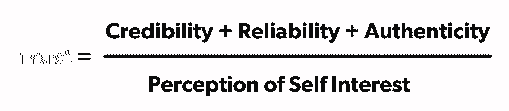

# 使用此等式来确定、诊断和修复信任

> 原文：<https://review.firstround.com/use-this-equation-to-determine-diagnose-and-repair-trust>

**[安妮·莱蒙迪](https://www.linkedin.com/in/anneraimondi/ "null")** 被难住了。她管理的两个人相处不好，这确实影响了进度。在她与他们每个人的私下谈话中，他们有着相同的目标和相同的需求。但是在房间里，他们会在所有事情上有分歧。他们会在最小的事情上吹毛求疵，避免花时间在一起，并对彼此做出最坏的假设，即使他们最终在同一个团队。

莱蒙迪如今拥有全明星的履历，包括易贝的产品总监、SurveyMonkey 的营销副总裁、TaskRabbit 的 CRO、Zendesk 的 SVP 运营部以及 Earnin 的首席运营官。她不知道该怎么办，所以她问了她的高管教练，教练简单地陈述了问题:**他们不信任彼此。**

“我立刻想到，‘哦，是的，当然，绝对是这样。’她说:“这让一切都清晰起来。为了找到解决办法，她回忆起几年前发现的一本书，书名为《信任方程式》，作者是史蒂文·德罗兹德克和林恩·费希尔，书中提供了以下方程式，说明人类如何决定信任谁以及信任多少:

从本质上说，你对某人的信任度是你相信他们在某个问题上有多可信、他们已经证明自己有多可靠、你认为他们作为一个人有多可信的总和，除以你认为他们在多大程度上符合自己的利益。从这个角度看她的同事之间的关系，莱蒙迪帮助他们诊断信任何时以及如何被侵蚀，并最终与他们一起努力弥合裂痕。

从那以后，她想了很多关于将信任等式应用于特别是科技初创公司的问题，在这些公司里，信任是不可选择的。不仅联合创始人之间的不信任可能是致命的，而且创业公司的环境变化很快，人们会进入新的角色和挑战，到了一定程度就会有新人涌入。没有时间去怀疑或被怀疑——这个等式可以帮助你。在这里，莱蒙迪——她现在是斯坦福大学商学院的正式讲师——分享了她是如何应用它来解决大问题的。

# 变量

想想你在工作中的主要关系，考虑这个等式的每个变量。你认识的人如何符合这些类别？

# 可靠性

如果某人看起来拥有知识、经验和熟悉度，能够很好地扮演某个特定的角色，你会发现他是可信的。过去的角色、学到的经验、他们提供的见解和使用的术语是最好的证明。

公信力是人们在特定角色、特定场合、特定时间所拥有的东西。

**在创业的时候哪里破:**

当人们在一个组织中进入新的角色或者继承了一个需要管理的团队时。

每当有人在做他们以前从未做过的事情，或者想出前所未有的东西。

当一个伟大的工程师、设计师、营销人员等。突然被提升来管理人员，这需要在领导和处理人员问题方面的才能。当人们不信任他们的经理时，这尤其会导致很多问题。

“人们试图和他们的公司一样快速扩张，如果他们不注意，就会损害他们的信誉，”莱蒙迪说。“如果你在这条轨道上，你需要在沿途的每一站都主动重建你的信誉。如果你发现自己怀疑领导力，考虑一下是否存在信任差距。他们能做些什么来向你证明他们的可信度？”

**怎么办:**

不要让可信度的问题挥之不去。如果你真的不擅长做某件事，要有耐心。同时，努力依靠你的可靠性和真实性。“信守承诺，赶上最后期限，不要隐藏你不知道如何做的事情或假装自信，”她说。"**此外，让人们看到你在做什么来赢得信任**，无论是阅读相关主题，找一个教练，还是应用你得到的反馈。向人们展示你正在积极地拉近与三角洲的距离。”

其中很大一部分是要求你周围的人了解什么对他们重要，他们想如何与你合作，他们对你有什么期望，以及他们想实现什么。**如果你继承了一个团队**，询问他们希望过去有什么不同。存在哪些差距？他们希望看到什么变化？问开放式的问题可以将人们对你能力的怀疑转化为对你将要做的新事物的兴奋。

“召集所有与你交谈过的人开会，并说，‘我已经得到了你们所有人的意见，所以很清楚我们想要保留什么，以及你们都希望看到改变的两三件事，下面是我如何将它作为优先事项……’”莱蒙迪说如果你被任命负责一个团队，是因为领导层想要向一个新的方向发展，那么就要对这一点以及变化是如何发生的保持透明。不要让人自己编故事。提前做好准备，比如说:“我是被请来的，所以我们可以用不同的方法达到 X 里程碑，我有 X 专业知识，他们认为这些会有帮助。”"

相反，**如果缺乏可信度是你怀疑某人的原因**，在一对一的谈话中温和地提出这个话题:“你是如何做决定的？你在这种情况下应用了什么经验？这方面的学习怎么样？”别忘了问，“我能为你做些什么？”通常，你会发现人们比你根据他们的背景假设的更可信。

# 可靠性

如果他们说到做到，你会找到一个可靠的人。你会觉得你分配给他们的任何事情都已经完成了。当事情进展顺利或出错时，他们会对自己负责。他们从错误中学习并改正错误。他们在行为、反应和工作质量方面保持一致。

有些人可能非常聪明，知识渊博，给周围的人带来欢乐，但如果他们不能按时或按预期的标准完成工作，他们就会很快失去信任。

**它在创业时的断裂点:**

领导没有时间复查工作，所以每个人都需要能够独立完成任务并做出正确的决定。这并不总是发生。

错过最后期限对创业成功与否有重大影响。在大公司，可靠性往往是缓冲的。当你跌倒时，更多的人在你身边接住你，期限和目标可以移动。小团队就不是这样了。

许多早期员工不像创始人那样被接受，或者认为在初创公司工作与另一份工作没有什么不同，所以当需要他们的时候，他们不在。

许多早期团队成员都是他们工作职能的单点故障。如果他们不在那里，这就不会发生，所以他们不会错过。

**怎么办:**

当可靠性崩溃时，立即解决它是很重要的。不要让两个以上的项目在没有对话的情况下错过。在这次谈话中，你要 **1)** 确立你的期望在开始时是一致的， **2)** 解释对团队/目标的影响(不仅仅是对你的)，并且 **3)** 与他们一起思考下次如何以不同的方式做事。不要使用指责性的“你”语言。

**这里有一个例子:**“嘿，我想谈谈我们是如何比预期的时间晚一点发货的。你也期望它会在 3 月 15 日发行吗？我想聊天，因为错过那个日期意味着一些工程师不得不在周末工作，我想我们可以想一想如何纠正并确保这种情况不会在未来发生。”

在这些对话的过程中，你可能会发现有一个更大的阻碍或系统问题导致错过了最后期限——也许这根本不是其他人的错，而你只是发现了一些更重要的问题需要解决。不要让责备蒙蔽了你对这些可能性的认识。莱蒙迪说:“最终，大多数人与人之间的可靠性问题都可以归结为沟通不畅，这很容易解决。

“出于所有这些原因，尽可能地了解你面试的每一位求职者的可靠性是至关重要的，”她说。“这很难，因为可靠性是面试过程中最难衡量的品质——它通常需要时间来证明。”

根据莱蒙迪的说法，以下是在招聘前检查可靠性的一些最好(尽管不完美)的方法:

询问关于过去经历的基于行为的问题，以了解某人如何行动，而不是他们认为他们会如何行动。例如，“告诉我你错过最后期限的一次经历。你是如何处理这种情况的？”

布置一个包含多项可交付成果的家庭作业(例如，对一项建议的书面分析，然后是一个简短的现场陈述)。如果有人对这个角色很认真，并展示了他们最好的一面，你会从他们的表现中看出来。

检查推荐信，尤其是候选人没有给你的。太多人在招聘时跳过这一步。过去的同事和经理可以经常谈论某人有多可靠，等等。让你与之交谈的推荐人把你介绍给那些与候选人在项目上有过密切合作的同事。

一旦有人进门，就把可靠性作为一种文化价值来加强。让他们在第一天发货。可能是代码吧。也许是在网站上添加内容或者发布推文——这取决于工作职能。**让这成为他们第一周每天的常态**。要求他们在某个时间之前上交或交出一些东西。观察他们对行动的偏好以及他们达到目标的速度。如果你以这种节奏和期望开始做事，它更有可能继续下去。这缩短了人们建立可靠性的周期。

如果你是刚加入的新员工，你可以做的更多。**找到切入点，以一种有用的方式产生影响**。现有员工想要完成但没有时间自己完成的简单、几乎是单调的工作任务是什么？问，“**你最想做但最后一件事是什么**？”每个人都有这样的东西。把它从他们的盘子里拿走，快点完成。这既增强了可靠性，又最大限度地减少了对自身利益的感知。

“当我以营销副总裁的身份加入 SurveyMonkey 时，我的第一天就是我们更名发布的同一天，”莱蒙迪说。“这是一个小团队，他们都在甲板上的手。他们最不想做的事情就是培训或圈入一个新的管理人员。我问自己，“我能做什么简单的事情来提供帮助，在那里没有人需要照看我，这将有助于团队的成功？”"

自然，该公司正在进行一项调查，以收集用户对品牌重塑的反馈——他们一按开关，反馈就开始涌入。莱蒙迪立即自告奋勇去检查所有这些数据，并对其进行分类和分析。这解放了其他人，让他们可以继续修复漏洞，也让莱蒙迪自己对产品有了惊人的洞察力——这也提高了她的可信度。

这个东西对每个人来说都会不一样。关键的一点是:当你是新人时，总是寻找机会把工作转得又快又好，以建立你的可靠性。

# 真实性

这仍然是一个模糊的术语，而且经常被过度思考。实际上真正的意思是:**了解一个人有多容易？是否清楚他们关心什么，对他们来说什么是重要的，他们的动机是什么？正宗的人不需要总是被打磨，或者知道答案，或者完美无缺。他们说到做到。**

**它在创业公司的哪里破裂:**

失败在初创公司中非常普遍，但人们不想承认他们失败了或犯了错误，因为这会损害他们的信誉。

创始人对他们的公司有一个理想化的看法，并且如此擅长讲述公司的故事，以至于他们给人的印象是照本宣科的、做作的、不真实的。筹款和招聘都会发生这种情况，这是需要注意的。

更多的人试图表现出自信，即使他们没有经验，这会导致不信任。

公司文化不允许真实表达愤怒、不快或悲伤——这将愤怒、不快或悲伤推向了更具腐蚀性的地下。

**怎么办:**

真的想想你的同事了解你有多容易。这并不意味着让他们了解你的全部个人生活，也不意味着你必须告诉他们关于你的一切。**相反，你的回应方式是否符合你真实的想法和感受？**你在职场上的反应和你在外面的反应相符吗？你是否与同事充分分享了对你来说重要的事情以及激励你的因素？如果没有，为什么？在工作中可能有更真实的空间，这样人们就不会猜测或假设你的感受，你的想法，你会做什么。

如果你觉得有人对你不真实，你应该说出来。你不必直接指责他们，而是说:“【to】我没想到你会做或说 X 或 y。你能告诉我更多关于你为什么这么做的原因吗？“愿意和他们坦诚相待，分享你对公司的兴奋和担忧。作为回报，请他们也这样做。对某人抱有错误的期望有时会让他们看起来不真实，所以先检查一下你自己的假设。它们真的有效吗？

**也许保持真实的最好方法是:保持一致、积极的沟通。**(这也有助于提高可靠性和可信度。)最典型的例子是，一位创始人希望维持董事会和投资者的信任。坚持每周发送公司更新和材料(在会议之前)和摘要(在会议之后)的时间表会增强你作为领导者的真实性。你的利益相关者会知道你最关心的是什么，以及为什么会这样，他们会相信你在掌控一切。同样的道理也适用于你的员工——多沟通，让他们和你在一起。

不要等着分享坏消息或寻求帮助。不要突然做出决定或遇到问题，让人们大吃一惊。

这不仅会让他们在那一刻降低对你的评价——他们也不会继续信任你，因为谁知道你可能隐藏了什么，或者到底发生了什么。“我经历了惨痛的教训，”莱蒙迪说。“我没有公开我所担心的事情，而是认为我可以自己解决所有问题，然后分享我的解决方案。最终结果是，对我来说很重要的人感觉被排除在外，毫无防备。”

莱蒙迪举例说，一个好办法是，她认识的一位首席执行官像时钟一样每周向董事会发送更新信息。即使它们很小，它们也在它们和公司之间提供了备受赞赏的结缔组织。他还利用这个机会分享他和他的团队的一些个人更新，并祝贺董事会成员的重要个人发展，如周年纪念日、生日等。这有助于他们承认并感觉到，作为普通人，而不仅仅是同事，他们彼此更加了解。它更全面地描绘了对办公室内外的所有人都重要的事情。

为工作中的社交聚会提供时间和空间至关重要。当人们觉得他们真正了解对方时，他们会更加信任对方。举办团队午餐，庆祝婴儿洗礼，让人们分享他们在个人生活中所珍视的东西，这些都会带来显著的不同。莱蒙迪钦佩的一位领导者在团队会议开始时会发布个人声明，并配以员工最近旅行的照片或婴儿迈出第一步的照片。所有这些听起来似乎都很不错，但是它有一个重要的功能。

当涉及到**客服**时，真实性对创业公司来说尤其重要。你选择的与客户沟通的方式可以建立持久的信任，也可以永远失去信任——很大程度上取决于他们是否觉得与你有真正的联系。

莱蒙迪提供了一个生动的例子:去年，她从一家小公司给儿子买了一份圣诞礼物。很快，她就收到了来自他们客户服务渠道的通知:“我们很高兴你从我们这里订购，但不幸的是，这份礼物似乎要在圣诞节后才能到达！我们对此感到非常抱歉——我们重视给每个人一周的假期，而且我们的员工很少。我们希望你能理解，同时我们会给你的礼物打折。”

“他们花时间解释给我留下了深刻的印象，实际上，我离开时对这家公司有了更温暖的想法，因为他们提供了一个了解他们如何对待员工的小窗口，”她说。“这感觉很私人，它来自一个真实的人，而不是一个匿名的品牌，我可以想象另一端的人。”

在设计客户服务模板时，请记住这一点。不要只是被动反应，要预见问题。让信息听起来像人类。让他们来自指定的人。出问题的时候要透明。给人们一个更好地了解你的机会。

# 自我兴趣的感知

是不是有人看起来只是在为自己演戏？也许是为了获得荣誉或赶上最后期限，为了看起来更好或赚更多的钱，或完成一笔交易，或得到更多的人数。注意，这个变量更多的是关于光学。**即使你没有表现得自私，在别人看来你还是自私的，所以你需要有意识地表达你的想法。**

对自我利益的感知越大，人与人之间的信任度就越低。或者，某人看起来越是为团队、最终用户或更高的目标而工作，就越容易信任他们。

**它在创业时的断裂点:**

对于创始人来说，他们的公司就是他们的宝贝。他们最终获得了最大份额的荣誉，尽管早期的员工通常也同样努力工作。对他们来说，消除对自身利益的认知尤为重要。

初创公司往往跑得太快，以至于他们忘记了传递荣誉和沿途承认每个人的胜利的重要性。

当销售被添加到你的组织中时，这将不可避免地出现。任何靠佣金赚钱的人都假定了自己的利益。

你的团队越大，人们越经常有自己的议程，他们就越会为了知名度、晋升和重要项目而故作姿态。高管们争权夺利，政治浮出水面。公司应该预见到这一点，以实现健康增长。

“政治对公司的损害比其他任何事情都大，”莱蒙迪说。“当人们表现出为自己着想时，没有什么比这更能催生政治了——邀功、争取高管的关注、争取更多的金钱和地位。当这种态度出现时，人们会越来越不愿意帮助他们的同事，会怀疑人们的优先顺序，甚至对他们提供的帮助持怀疑态度。如果不及早发现，这是不可逆的。”

**怎么办:**

为了预测和防止这些裂缝的形成，任何可能被这样看待的人都应该首先意识到这一点，然后积极主动地慷慨地给予他人荣誉(以真诚的方式)，使用“我们”、“我们”和“我们的”等集体语言来表明他们为团队着想，并重复对共同目标和优先事项的承诺:如最终用户做得更好，达到公司范围的指标等。

创业者尤其需要牢记这些策略。鉴于对企业家的大量报道和荣耀，他们的员工可能会感到被落在后面，除非他们超越自我，突出他人，四处传播信用，并放弃聚光灯——包括邀请他人参加董事会会议，介绍他们的专业领域，并在会议上和媒体上发言。

**销售人员可以做很多事情来改变人们的看法**，包括在赢得交易时发送电子邮件，列出所有促成交易的人的名字，强调整个团队最终能够为最终用户提供什么，以及积极帮助同事完成他们的配额。

另外，你可以通过在面试中剔除自我兴趣来防止它过早扎根。当你问候选人过去的成就时，一定要注意他们是用“我”还是“我们”他们会抓住机会谈论他们如何成为一个更大的团队的一员，或者他们会把许多人的工作归功于个人吗？问他们还有谁参与了过去的大型项目，听听他们是如何谈论这些人的——他们会说些热情洋溢的话还是尽量减少其他人的参与？他们会赠送大量的信用卡吗？这是个好兆头。

**创业公司捕捉和传播自我兴趣的其他方式:**

对于与董事会成员交谈的创始人，总是要强调这项工作对客户/最终用户的影响。将荣誉给予团队中的其他成员。

随着公司变得越来越大，部落主义开始生根发芽，各职能部门可能会开始互相不信任，例如“营销部门不允许我们这么做”或“我们必须为法律部门的人做所有这些工作。”通过巩固在一起工作的部门领导之间的信任，将这种情况扼杀在萌芽状态——他们将为其他人效仿的行为树立榜样。如果出现裂痕，用这个等式来帮助他们解决。

每当信任因为自身利益而开始消退时，立即进行确定共同目标的练习。什么对你很重要，对其他人也很重要？你们俩都在朝着什么方向努力？将日常工作和决策与这些事情联系起来，让事情回到正轨。

# 当信任失败时

为了修复信任，你必须尽早发现信任正在瓦解的迹象和症状。如果你觉得你和同事之间，你和你的经理之间，或者你和一个报告员之间有什么不对劲，停下你正在做的事情。坐下来，设身处地地为他人着想，花时间想想上面描述的每一个变量。哪里的差距会削弱信任？

**信任受损的迹象:**

避免花时间在一起，尽量减少接触(这对生产力有破坏性的后果)。

尽管有分歧，还是保持沉默。

不参加会议，普遍缺乏热情。

闭门谈话变成了对另一个人的发泄。

玩政治的人。(例如，突然之间，他们在电子邮件中抄送给你的老板，等等。)

对已经给出的指示执行缓慢。

一段原本亲密的关系开始偏离正轨。

立即对对方为什么说或做某事做出最坏的结论。

很多时候，人们会以非常具体的方式抱怨同事——他们做错了 X、Y 或 Z。或者因为这些原因它们很糟糕。他们没有意识到信任是更大的问题。

**每当你发现自己处于这种情况时，将问题定义为违反信任会有所帮助。以这种方式重新组织可以激励解决方案——因为对公司不信任的后果是巨大的。你可以用更直接的方式来修复它，而不是屈服于普遍的厌恶和退缩。信任方程式可以帮助你决定下一步做什么。**

# 修复破碎的信任

莱蒙迪的建议很明确:不要等着谈论它。今天就开始对话。

她说:“当你意识到某些事情阻碍了你与他人的良好合作时，第一步就是要认识到这段关系对你有多重要。”“列出所有你们能够积极合作以完成更多工作的方法。想象一下和这个人一起工作 5-10 年。哪些时间和精力可能会被浪费？这将确保你带着正确的优先事项和观点参加会谈。然后确定你想围绕等式中的哪一个变量来限制它的范围。”

要求谈话可能是一件微妙的事情。你不想对每一个小小的潜在的怀疑或轻视采取行动。确保裂痕足够明显，以至于你真的觉得你的工作会因此受到影响。当面说比较理想。不要发送一封冗长、令人担忧的电子邮件。如果可能的话，走出办公室到中立的地方换换环境。散步总是让事情变得随意(这样你们就不会互相盯着对方看)。

最重要的是，**不要通过与老板或同事交谈来避开这个人**。任何优秀的经理都会告诉你先尝试直接解决问题。所以要温和，只从你的角度来说，假设他们是善意的，把你的关注局限在一个具体的例子上，这样就不只是一种抽象的感觉了。

**这里有一个例子:**“你好，我想和你聊聊，因为最近我感觉到了我们之间的动态变化。比如 X 发生的时候，对我产生了 Y 的影响。我们的关系对我来说非常重要，所以我很想了解你的经历，并了解未来应该做些什么，因为我认为我们可以一起完成令人惊叹的事情。”

莱蒙迪说，如果你是愤怒或受伤的一方，告诉对方你重视他们和他们的关系就更加重要。“我见过太多经理对员工越来越失望，却什么都没说。她说:“突然之间，似乎唯一的解决办法就是解雇他们，而他们本可以进行一次[直接而坦诚的对话](http://firstround.com/review/radical-candor-the-surprising-secret-to-being-a-good-boss/ "null")。通常，表现不佳是因为员工感觉不被经理重视或喜欢。”

如果你不和你不信任的人说话，你们的感情只会变得更加根深蒂固。“这就是你如何在你的团队中结束那些非常愚蠢的敌对关系的，”她说。“我总是听到人们说，‘哦，那个人只是渴望权力’，或者‘我的部门现在有一个人在抢地盘’，或者‘我讨厌那些顺从的人——他们让我们的生活变成了一场噩梦。’他们丑化他们的同事，花费所有的精力，而不是专注于公司的目标。"

如果你听到有人(或你自己)说这些话，用信任方程作为诊断，找出真正发生了什么，并冷却负面情绪。以下是实现这一点的一些关键提示:

**实际上量化是有帮助的。**给方程中的变量赋值。假设你在 1 到 10 的范围内对这个人的可信度、可靠性、真实性和自我兴趣进行评级。看看你在哪里净出(当然也不要告诉别人)。这可以帮助你理清思路，消除一些激烈的情绪。通过打分，你还必须认识到某人做得好的地方，而不仅仅是他们做得差的地方。

为这个人和你一起做的每个项目运行单独的方程也是有价值的。也许他们在一个可交付物上是 100%可靠的，但是在其他几个上只有 60%可靠。那些项目有什么共同点？你能从那个人的工作方式中学到什么，从而帮助他们变得更好？

“例如，假设某人在三个项目上只有 40%的可靠度，并且这三个项目都有很多模糊的时间表和很多移动的目标，”莱蒙迪说。“如果你是那个人的同事或经理，你可以通过在未来制定更具体的最后期限来帮助解决这个问题。如果有人在几个项目上的可信度很低，想想为什么会这样。也许他们需要更多你能帮忙提供的背景。”

人类有一种概括的倾向:“这个人总是迟到。他们从来不交干净的副本。”一个项目一个项目地给人打分，这样你就能识别出细微差别，而不会不必要地忽略它们。

当你把这些工具放在一起时，你可以像这样开始建设性的对话:“你好，我只是想快速聊一聊我一直在想的事情。对于最近的两个项目，我注意到你在全体会议上居功。你绝对值得这些赞誉，但我觉得我也做出了有意义的贡献，因为我们的关系对我来说非常重要——我认为我们一起完成了这么多——我想提一下，听听你的经历，以及是否有任何我应该知道的事情。我相信你会告诉我。”

这是你能做的最重要的事情之一，莱蒙迪说，“**总是明确地说:我信任你。**“即使只是说说，也会在你们解决问题的过程中产生更多的信任。

# 用这个等式来构建你的职业生涯

对于那些仍处于职业生涯早期的人来说——刚刚走出学校或爬上阶梯——这个等式可以成为做出良好决策和建立健康网络的有力工具。

快速建立信任，然后多年培养信任的能力是成功的一个重要因素，但却常常被忽视。

“任何从事职业 10-20 年的人都知道，最好的机会来自他们信任的人。莱蒙迪说:“从某种意义上来说，他们的整个职业生涯都是由这些关系塑造的。”。“因此，如果你不主动思考如何灌输和保持这种信任，你就错过了。”

**以下是她建议如何应用这个等式来确保一个好的轨迹:**

**1。每当你开始一个新的角色时，考虑你的可信度、可靠性和真实性。**你的目标应该是尽快在所有这些因素上获得高分。积极思考如何证明你知道什么，你会做你说过的事，你就是你所说的那个人。

**2。参考等式来解决冲突。不要轻易接受与同事的不和，否则你将永远无法达成一致，或者如果有人对你的工作评价不高也没关系。你不需要努力让每个人都喜欢你，但你需要培养信任来建立良好的工作关系。确定信任是否是冲突的罪魁祸首，并通过上面的练习来治愈。**

**3。对未来的雇主进行尽职调查。你可能真的对一份可能的工作感到兴奋，但重要的是你要相信你的经理和同事。问一些问题，这些问题会指出这些人是否可信——他们是否知道足够多的知识来做好他们正在做的事情——可靠(他们可靠地回应你吗？他们在过去的项目中是如何可靠地交付的？)和真实的(他们是否脆弱地分享了工作中的困难或不太乐观的积极方面？).管理者谈论的是团队的成就还是他们自己的成就？**

**4。当你丢球时，向弱变量倾斜。每个人都会犯错，没有人是完美的。当你在工作中犯了错误时，要做好准备去挽回一些信任。也不要试图强迫它快速发生。耐心点，接受恢复别人的观点需要时间。这没关系。这个等式可以作为如何系统地做这件事的指南。想想你犯错误的时候违反了方程的哪个变量。过度强调证明该变量可以更快地解决问题。**

**5。在谈判中淡化自身利益。是的，在金钱和晋升的谈判中，自我利益是必要的，但是有办法让你的论点更有说服力。例如，当要求更多的公平时，强调你是如何获得集体成功的:“我想长期工作，做些大事。”**

“我见过人们在这些对话中犯错误，说他们需要加薪，因为他们有抵押贷款或个人支出有变化，”莱蒙迪说。“这并不是说老板们不理解这一点，但更好的理由是与团队和企业的利益相关联的。”

对她来说，更有说服力的加薪对话是这样的:“我想承担更多的责任——以下是我认为团队在未来 6 或 12 个月可以做的事情，以及我可以做出的贡献。”她说，从你想为整个公司做出的贡献开始。然后说，“如果我能完成所有这些，我希望能涨到 x 美元，”不马上要求加薪，你会推迟自己的兴趣，让这成为一个对每个人都更舒适的谈话，如果你做得好，显然有理由加薪。

“你想让你的经理因为支持你而看起来不错，”莱蒙迪说。“当你打算做些什么来证明加薪的合理性时，想想你将如何帮助她实现自己的目标。你心里既有她也有你的兴趣。你在强调，你们已经在这条路上了。”然后，你可以提供可信度和可靠性，让你在你的时间表。

# 概括起来

在每一个职业生涯中，不管你有多有才华，多敬业，多聪明，都会有不确定和关系混乱的时候。不要对发生的事情妄下结论，也不要马上觉得自己处于防御状态，而是要参考信任方程式。很有可能你现在的感觉与某种程度上被削弱或怀疑的信任有关。这个框架可以给你一个开始谈论或修复情况的地方。

信任是所有关系的基础。最重要的是，它决定了你是否会喜欢某个人，或者是否能和他们一起做有成效的工作。然而，很少有文章或建议讨论如何建立人际关系网并在职业生涯中获得成功。上面分享的智慧是如何使它成为你职业生涯中行动的焦点和积极触发点的入门书——这样你就能保持在你想要的轨迹上。

莱蒙迪说:“信任是一个非常基本的问题，以至于经常被忽视。”。“如果你能看到它在每一次互动中有多重要，那将是一大优势。”