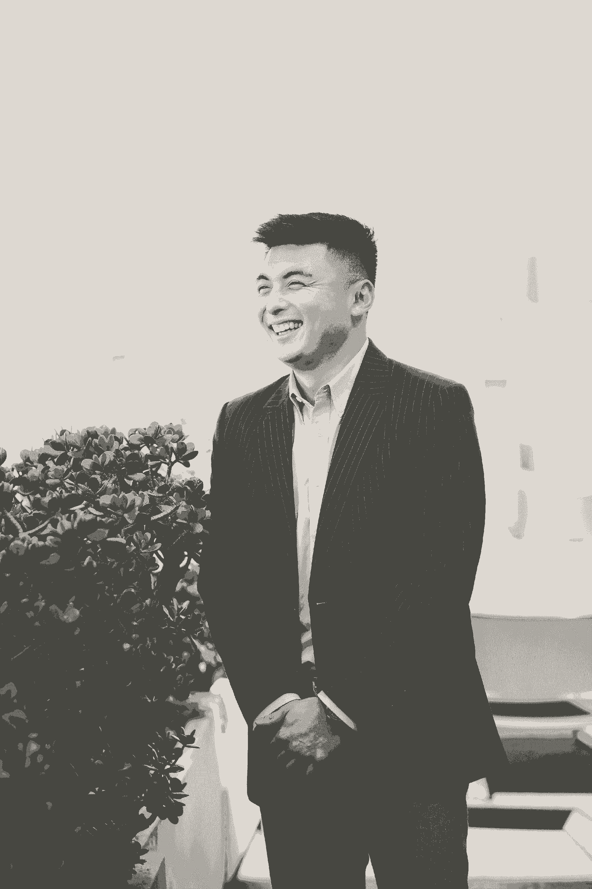
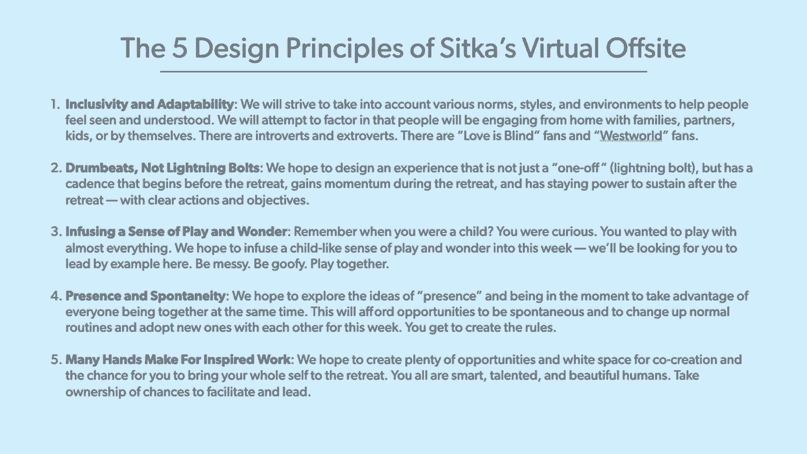
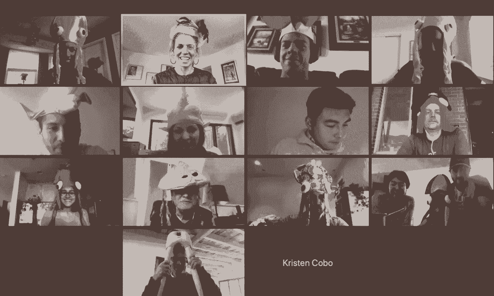
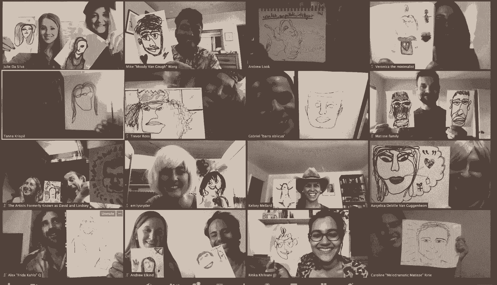

# 使用这家创业公司的剧本运行有影响力的虚拟场外

> 原文：<https://review.firstround.com/use-this-startups-playbook-for-running-impactful-virtual-offsites>

## 介绍

多年来，在第一轮中，我们已经举办了 CEO 沙龙，这是我们支持的公司的创始人以小组形式聚集在一起的机会。晚餐、讨论、来自走相似道路的人的建议——希望有更强的社区意识，可以穿透公司建筑的隔离迷雾。

2020 年 2 月， **[西特卡](https://www.trustsitka.com/ "null")** 首席执行官 **[凯尔西·梅勒德](https://www.linkedin.com/in/kelsey-mellard/ "null")** 走进我们旧金山办公室的门，这是我们在就地安置避难所成立之前最后一次面对面的沙龙。作为一家快速增长的种子期医疗保健通信初创公司的创始人，梅勒德的工作非常繁忙。“除了开发新客户和壮大团队之外，我还在忙着计划我们每年 4 月的务虚会，”她说。“我们一直都是分散的，所以每年我们都会投票决定在哪个城市开会，然后让所有人坐飞机去工作、交流和制定战略。前几年，我只是早早地飞过去，去好市多买些小吃，通常自己管理所有的后勤工作，但考虑到我们团队现在的规模，我们需要发展壮大——坦白地说，我是贪多嚼不烂。”

输入。拥有教育和设计背景的王目前在[亚利桑那州立大学](https://www.asu.edu/ "null")担任战略主管，从[密涅瓦学校](https://www.minerva.kgi.edu/ "null")转型而来，在那里他从零开始建立了一所新的混合在线和基于场所的大学，担任学生体验全球总监。但当梅勒德见到王时，他正忙着为 2 月份的首轮 CEO 晚宴做体验设计师。“快到情人节了，所以迈克策划了这个令人惊叹的议程，安排了一场有八道菜的互动盛宴，还配有饮料和轻松的对话，”梅勒德说。“他在促进和组织活动方面做得非常出色，带来了意想不到的创造性形式，我知道我必须让他帮我设计 Sitka 的静修。”

两人开始工作。经过三周的计划，所有的元素都在一起了——奥斯汀令人难以置信的 Airbnb，清晰的学习成果和目标，精心设计的体验。但是随着三月的开始和新冠肺炎的恐惧增加，撤退不能按计划继续变得太明显了。“作为一家医疗保健公司的创始人，我不可能要求任何人坐飞机。“我们考虑过取消或推迟，”梅勒德说。“但对我们团队来说，这是一个非常重要的时刻。尽管我们已经分散在不同的地方，但这是世界上一个非常奇怪的时刻——我们聚在一起，甚至感觉很重要。”

如果你在争论今年是否要让你的团队离开，那就把它列入日历吧。尽管我们不能像往常一样召开会议，但这只是意味着我们需要重新思考它看起来像什么——而不是完全跳过它。

随之而来的是一连串的活动。王和梅勒德重新组织了整个静修活动，将它转变为一系列虚拟体验，并在如何让它变得同样迷人方面发挥了创造力，所有这些都只剩下几周的时间了。“当我们进行虚拟化时，范围迅速开始扩大，”Mellard 说。“我依靠迈克帮助我重新思考整个经历。在 Zoom 上玩八个小时听起来很痛苦，所以我想让它变得有趣和协作。**最重要的是，我不想让它感觉像是在工作，当现在只有一种工作模式时，这真的很难做到**。所以我们策划并计划了一次为期四天的网上静修，不知何故赢得了我们团队的好评。”

我们喜欢这个故事有几个原因。这是一个适应意外的故事。但这也是一个关于如何执行有效的异地(虚拟或其他)的案例研究，这是一个我们在评论中尚未深入讨论的话题。异地和团队静修通常处于两个极端中的一个:[以牺牲关系为代价专注于战略](https://firstround.com/review/what-i-learned-about-management-and-culture-from-growing-ubers-asia-business-from-zero-to-billions/ "null")，或者充斥着近乎俗气的强制结合活动。虚拟场外也是如此，再加上马拉松式的额外缺点——整天的变焦会议，每个人都粘在显示器上，坐在椅子上——所有这些都是在他们试图兼顾个人生活的时候，无论是来自孩子、宠物还是家里的室友的干扰。

在这次独家采访中，Mellard 和王一起分享了使他们成功实现虚拟异地的策略、目的驱动的议程和幕后过程。不要期待破冰问题或更吸引人的幻灯片技巧的清单，而是深入了解如何避免走过场、一次性的团队会议。这两人作为他们的指导，带领一个深思熟虑、精心设计的会议，在接下来的几个月里引发重要的讨论和持续的变化。

从高层次的计划和制定时间表，到实际的执行技巧和后续建议，这是任何初创公司创始人或负责虚拟团队建设的领导者的必备文件。

# 规划:设定意图的框架

随着我们适应在家工作的新常态(或者像有些人所说的那样，在工作中生活)，所有创业公司的常规里程碑现在都需要远程进行:产品发布、绩效评估、战略规划会议、董事会会议等等。异地办公最初可能会被暂停或推迟，但随着许多初创公司采纳远程优先的政策，并计划至少在今年剩余时间(甚至到 2021 年)离开办公室，没有理由再推迟了。

团队静修提供了一个讨论重要话题、集思广益新策略和加深关系的场所——在不断变化的世界中，这些活动比以往任何时候都更重要。

对于梅勒德和王来说，第一步是深入思考球队应该经历什么。“我有这些想法，我知道我想从异地得到什么，但我不知道如何让人们体验这种体验。这就是迈克的用武之地，”梅勒德说。“由于他在课程开发和体验式学习设计方面的背景，他认为这是一个为期四天的 Sitka 课程，这是我不会做的。”

Kelsey Mellard, CEO at Sitka

## 写章节，而不是书

王将梅勒德的愿景转化为 CEO 的方法可以追溯到几年前——灵感来自一个不太可能的来源。他说:“我在乔治敦大学读本科，耶稣会对照顾整个人的理念的关注对我的成长影响很大。这启发了我在密涅瓦大学期间的想法，当时我们正在从零开始建设一所新大学，并重新思考整个学生体验。"

这需要回归基本原则。“在密涅瓦，我们最终禁止了讲座。这是一种很好的教学方式，但却是一种很糟糕的学习方式。对产品制造商来说是好事，但对最终用户来说却是坏事。事件也是如此，”他说。**大型务虚会是召集大型团体的一种简单方式，但却不是促进联系的好方法。**

如果你采用第一原则的方法来设计你的团队，你会有什么不同的做法？如果你把你的静修想成一门 3 学分的大学课程，你的员工结果会是什么？先修课程和高级课程可能是什么？

这就是王在策划 Sitka 的异地项目时所运用的思维模式，并将其转化为一个创业背景。“当考虑人才发展时，为‘全体员工’进行整体设计是至关重要的，因为每个组成部分——从技能到身体健康到社会情感健康——都在一个集成的系统中联系在一起。王说:“与其把注意力放在日程表上那些狭隘的、分散的异地工作上，不如退一步想想更广泛的员工体验。

“借用这里的耶稣会士的话，**你的团队作为一个完整的人成长需要什么？你如何整体考虑他们的职业发展、心理健康和归属感，以及组织的战略、目标和文化？**

他给其他想把这种心态带到下一个异地的创业公司的第一个建议是什么？“从大局出发。看看“事件”这个词本身。它通常带有非常战术性或操作性的内涵。但是如果你回到实际的定义，它是关于一些重大的，值得注意的，重要的事情。他说:“这不应该让人觉得是死记硬背或敷衍了事。“静修通常看起来像是你必须要做的事情，是你年度清单上的一个勾。以下是我喜欢为创业者重新定义的方式:

如果你一年举行两次球队越位，想象一下未来 3 年。与其写 6 本独立的书，你怎么能写一本有 6 个章节的书呢？

## 使用这个体验设计框架:

考虑到这种更广泛的理念，王警告说，不要直接进入哪一个会议将在哪里举行的实质性问题。他说:“在你开始钻研整合实际时间表的细节之前，先浏览一个列出你的**目标和结果**、**设计原则**和**项目主题**的框架。”。

虽然这看起来像是一笔大的前期投资，过程繁重，但这是值得做的。“这是不同的，‘*我们希望这一点被理解，这是我们将如何实现它的方式*，‘对’*让我们在这里做一个小组讨论*。”**异地和静修往往最终让内容掌控和推动议程**，王说领导们想要分享这些幻灯片或听到这些更新，然后突然意识到，“哦，妈的，我们谈了三个小时，让我们在这里休息一下吧。”。这最终变成了领导团队费力解决的问题，但所有与会者都在想，“让我离开这里”，并偷偷滚动他们的手机。"

如果你的异地团队连续几天都在演示幻灯片，中间还穿插一些休息时间，那么一定是出了什么问题。

下面概述的框架步骤构建了一个广泛的目标框架，然后您可以将其映射到特定的会话。“这一点也不新鲜——这是体验设计的 OKR 化。**但是跳过这个过程的太多了。他们希望将注意力集中在让尽可能多的人在房间里，或者用一个拥挤的议程覆盖尽可能多的范围。王说:“可以说，这些指标已经过时了。**

Mike Wang, Senior Director of Strategy at ASU

### 步骤 1:规划目标和结果

“公司为其业务运营实施目标设定和 OKR 流程，为什么不将这种方法应用到员工体验和宝贵的休息时间的设计中呢？通过采取基于结果的方法，创始人可以避免默认一套传统的原型撤退经验，并以他们的团队需要和想要的为中心。扪心自问:我们希望人们感受到什么？我们想让他们知道什么？我们如何将它映射到我们在异地尝试做的事情上？我们想让他们带着什么离开？”他说。

对于 Sitka 的虚拟异地，王将这项工作分成以任务和团队为中心的成果，在个人、团队和公司层面进行分配。

*以任务为中心:*

与使命保持一致并接受使命

共同定义公司的身份和价值观

与 2020 年公司目标和战略保持一致

围绕部门优先事项、挑战和问题陈述领域促进相互理解

认可组织的成功并反思吸取的教训

“以任务为中心的部分是我们希望员工离开务虚会时了解、定义或明确的部分。这种类型的会议往往依赖于事先的异步准备，因此，提供了一个利用‘翻转课堂’式学习的机会，为现场讨论和建设性辩论创造了空间，”王说。

*团队聚焦:*

帮助员工在个人层面上感受到被关注和理解

为员工创造一个空间，让他们感受到自己的力量，并能够通过发挥自己的全部能力做出贡献

在公司和创造的空间中感到舒适(培养对规范和行为的相互理解和解释)

促进游戏和奇迹

“务虚会以团队为中心的部分更侧重于我们希望员工离开务虚会时的感受。王说:“这些结果往往与情绪或情感有关，无论是关于自己还是关于他人。

### 第二步:锚定设计原则

为了进一步充实团队的这些目标，梅勒德和王合作提炼了一套设计原则，以告知务虚会的设计方法。

在这里，王解释了原因:“学术界有两个花哨、吓人的词:【课程】和**【教育学】**。”课程是你教什么(内容)，教育学是你如何教它(方法)。“这两个因素显然在一种迭代的‘先有鸡还是先有蛋’的框架中相互通知，”王说虽然我们大多数人倾向于关注静修的内容，但同时定义你的方法也很重要，即**设计原则、**或你的“教学法”这些将告知你如何构建体验的决策过程，为你可能说不的事情、你可能做出的权衡以及要坚持的优先事项设置护栏。"

查看以下 Sitka 场外设计原则的完整列表:

### 第三步:定义主题

“我们选择了“[再生](https://www.merriam-webster.com/dictionary/regeneration "null")”作为场外活动的主题，并将它贯穿于我们所做的一切，”梅勒德说。这是我们最有影响力的决定之一。王解释了为什么会这样:“主题类似于一门叫做“[组块](https://bokcenter.harvard.edu/how-memory-works "null")”的学习概念科学他说:“例如，如果你试图记住 231776202013 这个数字，可能很难一下子掌握，但如果你看到这些数字，并想到迈克尔·乔丹(#23)、美国革命(1776)、当前年份(2020)、阿波罗飞船(13)，你就能更容易地掌握这个数字。”

“这同样适用于体验设计。当建立一组不同的经历时，可能很难理解其中的含义，但如果你用主题将它们编织在一起——无论是为了更广泛的静修还是每天——它会帮助员工内化并建立对意义和意图的亲和力。”

团队越位可以经常下放在一个随机的抓包里的刘宇和发言者。勾画出连接日程表上每个条目的主线，这样信息就不会混乱。

# 制定时间表:

下一步是将这些成果、原则和总体主题转化为活动本身的细节，并进行会议设计。“沿途设立检查站，”王说。“当你整理时间表时，问问自己，‘嘿，我们是想在这里表示认可。这有用吗？那不起作用吗？是否让人有被包容的感觉？我们是在一次性地做它吗？"

这里有一个例子，问这些问题帮助梅拉德和王意识到他们偏离了方向:“我们正在设计晚上的体验，自然希望每晚都有令人惊叹的独特时刻。我们到了这样一个地步，每晚都是某种形式的集体聚餐或活动。我们检查了自己，并询问我们是否包容了团队所处的实际环境——需要照顾孩子的父母、与不认识其他员工的爱人在一起的合作伙伴，等等。因此，我们将“大体验”减少了 50%，只住两晚，而不是四晚。“越多越好”的冲动很有诱惑力，但我们适应并包含团队需求的原则让我们保持在正确的轨道上。”

有时候你需要决定多木少箭的投入。缩减时间表是非常有效的。

以下是 Sitka 团队如何整合实际日程的:“我们在周一开始，在周四结束。周三下午和晚上更开放。我们参加了集体聚餐和烹饪比赛。王说:“我们进行了自我反思练习、小组演示、首席执行官讲话、非会议——各种不同的形式。如果你想让人们的注意力保持在变焦上，你真的不能日复一日地坚持同样的模式。

如果你是一名创始人，只有一天的时间可以离开公司，王建议选择几个更小的小组会议，以及一个迷你黑客马拉松或无会议形式，团队可以一起工作，无论是关于公司目标还是团队沟通策略。

# 如果你有几天的时间，**看看这个** **[的场外议程草案](https://drive.google.com/file/d/1RIgi5ucj11mMzsUZos-Vfl_px2SRqf-4/view?usp=sharing "null")** **Sitka 用过的**。

我们将深入下面的一些关键部分(以及是什么使它们具有影响力)，仔细研究 Mellard 和 Wang 如何在多个会议中将目标和设计原则结合起来:

## 玩耍和惊奇

“惊喜和快乐现在对我来说是绝对重要的，”梅勒德说。“我们的日子是单调的，一切都既紧张又混杂在一起。插入一些瞬间来打破这种模式，让它变得特别，并加入一些轻浮的元素，这似乎是必不可少的。”

以下是他们如何将玩耍和惊奇融入 Sitka 的异地日程的示例:

**送互动惊喜。**“我们在活动开始前给每个人寄去了“再生套装”,上面有不要提前打开的说明。“我们包括了从小熊软糖和康普茶初学者工具包，到一袋咖啡和写字黑板的所有东西，”梅勒德说。“在这里，不要觉得你必须倾家荡产——我们每人花了大约 50 美元。作为此次活动的高潮，我们还发送了一个包裹，将于本周末送达。其中包括一条印有 Sitka 品牌的大手帕——它现在可以兼做遮脸用——以及一套印有品牌的信封和卡片。”王补充说:“康普茶是一个大热门，它比静修本身还要持久。人们一直在分享他们的康普茶饮料和创造，所以这是一直在给予的礼物。对于黑板，我们让团队中的每个人都写下他们的意图和本周的个人目标，作为一个可见的提醒——我们从 ESPN 的《在街角》的伍迪·佩奇那里偷来了这张

**穿上戏服**。“我们的一名员工正在与一种可怕的状况作斗争，并且病得很重，所以我问她是否打算举办一场派对，主题会是什么？她说“在海底”“这就是我们所做的，”梅勒德说。我送给每个人这些疯狂的“海底”主题帽子，我们都戴着它们出现在 Zoom 上给她一个惊喜。即使在这种特殊的情况下，加入一个主题也能帮助人们在一整天的计划后打破束缚，放松下来。我们不能改变在家工作的环境，但是小小的改变可以让它不那么陈腐。"

一起创造一些东西。“有一天晚上，我们举行了一次烹饪挑战。我们分成三个小组，在 Zoom 上创建分组讨论室，这样每个小组都可以一起现场烹饪，”Mellard 说。“创造力喜欢约束。每个人都必须用相同的材料烹饪，但没有食谱可循——唯一的要求是三道菜的饭菜必须“让他们想起家”迈克和他的一个朋友，他也是一名厨师，来到每一个小组分享技巧。然后，每个人都展示了他们的作品，我们在一起吃饭前举行了一次团队投票，评判创意和展示。"

**安排自由空间和游戏时间。**“在为期四天的活动中，我们举行了两次‘空白’欢乐时光，没有任何正式议程。这使得每个人都可以做出贡献并采取主动。梅勒德说:“人们给我们上了关于[围棋](https://en.wikipedia.org/wiki/Go_(game) "null")的入门课，还带领我们玩了[狼人的 Zoom](https://anjuansimmons.com/blog/how-to-play-werewolf-over-zoom/ "null") 游戏，玩得很开心。“这是一个我们以前作为一个团队亲自玩过的游戏，但现在有很多其他的选择和想法，从琐事到虚拟密室。”

## 纳入家庭:

“融入家庭对我来说是头等大事，”梅勒德说。“现在，孩子们看到他们的父母以不同的方式近距离工作。我希望 Sitka 员工的孩子与他们工作的父母有一个良好的关系，工作对他们的父母来说很酷，而不仅仅是一种必需品。所以我想寻找有意识地让家庭成员参与进来的方法，因为我们都在家里。”

看起来是这样的:“烹饪挑战之夜对家庭成员开放。有一天晚上，我们还举办了一场公共晚宴，每个人都从当地一家餐馆点了外卖，然后跳上 Zoom，一家人一起加入。我们有一个魔术师作为惊喜加入，孩子们喜欢它。坦率地说，成年人也是如此，”梅勒德笑着说。“然后我们把最后一个晚上的私人用餐时间和你正在躲避的人隔开了，公司付了账。我想在了解彼此的家庭和创造私人时间之间取得平衡。”

## 改善与其他团队的沟通和共鸣:

当然，另一个目标是确保团队在这个不断变化的环境中继续团结。“建立跨部门的同理心并提高我们的沟通技巧是我想要实现的目标的支柱。“在异地时，我们正处于一个涌入点，我们平台上的提供商数量增长了 600%，”Mellard 说。

“这伴随着兴奋，但也伴随着许多摩擦、紧张和不确定性。当你不能去办公室并真正看到其他人在做什么时，这种情况会加剧。人们很容易对其他人或不同的团队做出糟糕的描述，只是因为你不知道他们来自哪里，也不知道他们在做什么。”

异地是改正和建立健康的团队习惯的关键机会——这些习惯将防止腐蚀行为生根发芽。

以下是这一点在日程表中的具体体现:

**欢迎热身。**“我们从双人组开始，这是一种快速的一对一对话，旨在建立信任并发展一种玩耍的规范。问题从“如果你是一种动物，你会是什么?”？“你怎么知道你不是松鼠，”“如果明天世界末日，你会后悔没有分享什么？””王说。

**了解你:**“建立同理心和有效沟通是[根植于自我意识](https://firstround.com/review/hit-the-emotional-gym-the-founders-framework-for-emotional-fitness/#text_edfbe2e613e94971ad06151ddac33c67 "null")和情商，”梅勒德说。“我们使用了[的“真彩色”或色彩沟通评估](https://truecolorsintl.com/what-is-true-colors/ "null")，但那里有太多的选项，从 [SDI](https://totalsdi.com/assessments/overview/ "null") 和[strength finder](https://www.gallup.com/cliftonstrengths/en/strengthsfinder.aspx "null")到 [Enneagram](https://tests.enneagraminstitute.com/orders/create "null") 。这些并不意味着是性格的水晶球投影，而是有助于开发一种共同语言并引发关于风格和偏好的讨论的框架。它们创造了一种共享的语言，以及我们如何工作、处理和相互联系的不同视角——当你在虚拟环境中工作时，这是很难理解的。”

**自述:**“我们还有一次会议，团队成员分享了他们的[用户指南](https://firstround.com/review/the-indispensable-document-for-the-modern-manager/ "null")。我们有默读时间，你可以阅读团队中每个人的文章，然后可以讨论或提出澄清性问题。在异地之后，我们创建了会议和空间(包括在我们的新入职流程中)，供人们在公司范围内跟进和阅读这些文档，并继续更新它们，”Wang 说。

**“生活中的一天”**:“一天下午，我们召开了一个' [Unconference](https://en.wikipedia.org/wiki/Unconference#:~:text=An%20unconference%20is%20a%20participant,presentations%20and%20top%2Ddown%20organization. "null") ，'问题定义和设计冲刺会议，帮助各部门分享他们在 2020 年要解决的重点领域。目标是征求想法并促进对团队优先事项和挑战的共鸣。每位领导与他们的团队合作，讲述他们部门的故事——Sitka 工程师的一天是怎样的，例如，讲述他们会议的节奏，他们遇到的问题，他们认为最大的挑战和机遇是什么，以及其他团队可以如何提供帮助。”

## 在场和感激:

“另一个目标是检查我们现有的惯例，一起创造新的仪式。我想拥有一个空间，让我们能够活在当下，思考并感激彼此。这是 Mike 作为主持人和体验设计师的技能大放异彩的领域，”Mellard 说。

“作为人类，我们都渴望联系——感受被看到、被听到和被理解——但往往没有鼓励这些行为的有意空间，”王说。“在工作场所，我们依靠静修来创造新的环境，这可能会在我们常规的操作节奏之外培养习惯和行为。”

为了实现这一目标，在 Sitka 的场外议程的闭幕会议部分有一行字:*为彼此的感谢和赞赏创造空间*。虽然这看起来很简单，但对团队来说却非常强大。

“周五早上，我们都打开 Zoom，放一些背景音乐，然后花 90 分钟做一个练习:**写一行关于公司其他人的内容，以及我们喜欢和他们一起工作的原因**。然后，Mike 收集了所有这些笔记，并通过电子邮件发给每个人。因此，每个人都可以打开一封电子邮件，里面有来自同事的一系列令人惊叹的感谢之词。它让人们热泪盈眶，”梅勒德说。“老实说，我真的不知道事情会如何发展。”

王对此表示赞同。“我很担心，但对这一点充满希望。它取决于试图让人们以一种他们甚至可能不会在正常的专业环境中出现的方式出现，更不用说在 Zoom 上了。但是因为我们是在快速射击中完成的——你只有大约一分钟的时间为每个人写东西——这感觉像是一项你可以完成并成功完成的任务。在我们后来得到的反馈中，许多人说这是他们在异地的持久收获，他们想更好地表达对他人的感谢。这是一个令人难以置信的高潮。”

*编者按:第一轮运营团队在最近的团队会议上尝试了这种练习的轻量级版本，我们*强烈*推荐它。我们是这样运行的。在会议还剩 15 分钟的时候，我们向我们的 15 人团队发送了一个打印链接，并带有以下提示:对于每个队友，请花一分钟时间写一两行回答以下问题:你钦佩这个人的什么地方？这个人最近做了什么让你欣赏的事？为什么要感激把这个人算作队友？当你碰到自己的名字时，请用这一分钟来思考你个人感激的事情。答案匿名。所有人都到场后，会议负责人会收集每个人的发言，并在私人电子邮件中分享。*

这是 Sitka 团队计划继续进行的一项实践。Mellard 说:“作为我们发给每个团队成员的惊喜包的一部分，我们在每个盒子里都放了日志，以防个人想在日常生活中编织感激和反思。”“我们还附上了三张空白卡片和贴有邮票的信封，这样团队成员就可以在接下来的几个月里互相发送蜗牛邮件，无论是一封问好的短信，还是一封对他们参与的项目或他们实现的公司价值表示感谢的短信。”

用不同的工具来武装你的团队，表达对彼此的感激之情——这会带来巨大的不同。

## 共同创造和自发性:

“我们希望摆脱‘志愿者’的概念，激发参与和领导活动的真正激情，”Mellard 说。“例如，在我们的一天结束时，我们为 Sitka 的任何人留出可选时间来组织‘技能分享’或领导一项活动。其目的是让课程基于灵感而弹出，任何人都可以加入，如果他们感到有灵感的话。例子包括玩棋盘游戏、一对一的咖啡或茶会、主持烹饪课、一起看节目、一起散步、演奏乐器、放大卡拉 ok。

At one of the team happy hours, an artist taught the Sitka team how to create one-line drawings as self portraits.

王指向另一个议程项目。“我们每天早上还会进行一个可选的晨间仪式。上午 8:30，没有正式议程。他说:“在一天开始之前，团队成员自愿成为领导者，并促进一项活动，以使团队集中精力，无论是冥想、反思练习、例行拉伸还是有趣的联络活动。

对领导者来说也有好处。“有一个常见的[格言是‘与...一起构建，而不是为了](https://firstround.com/review/from-instant-pot-to-instagram-critical-lessons-in-startup-community-building/ "null")’当最终产品由你的用户——在这里是你的团队——共同创造和拥有时，它总是更好。这可以部分归因于[宜家效应](https://www.hbs.edu/faculty/Publication%20Files/11-091.pdf "null")，但最终，你的员工最清楚他们的同事和公司文化可能需要什么。如果他们被激励去投资，并被给予机会和资源去发展，他们会比你做得更好来满足这些需求。"

创造机会让别人拿起缰绳，承担起事情。这不一定是一个人的表演——让你的团队行动起来。

# 执行:实用技巧

以下是梅勒德和王在 Sitka 的虚拟异地会议期间发现的最具影响力的花絮:

## 促进事项。想想游轮导演，而不是列车长。

承担异地管理团队任务的创始人和领导者应该考虑引入外部主持人。“除了帮助完成所有的后勤和规划工作之外，Mike 和我还分担了协调工作，这一点至关重要。好几天一天都要促成这么多工作和精力。团队也不希望总是收到同一个人的来信。让他成为我的犯罪伙伴让我的生活轻松了很多，”梅勒德说。"这是我花得最值的一笔钱。"

以下是王对这一过程的看法:“作为一个外来者，你试图把那些还没有完全信任你的人的真实和脆弱的时刻表现出来。起初有些紧张——他们会看着我，认为我是本周的游轮主管吗？**但我认为人们实际上想要一个游轮导演。他们重视教练——欣赏人际关系的微妙之处并能培养经验的人。**这似乎是一个非常具有战术性的角色，我们对此轻描淡写或视而不见，”他说。

即使有了最好的目标和策略，你仍然需要精神和便利来保持它的吸引力。王谈到了教育的试金石:“想想你遇到过的最好的教授。他们不会一直指着一组幻灯片喋喋不休。他说:“他们调节房间的能量，召集合适的人群，[让每个人都有机会被听到](https://firstround.com/review/the-managers-guide-to-inclusive-leadership-small-habits-that-make-a-big-impact/ "null")，并巧妙地阻止那些试图主宰电波的枪手。”。“当你说‘有人有问题吗？’房间里声音最大的人会大声说话。相反，直接问个人:‘你上次说了这件事，它确实很有影响力，但我有一段时间没有听到你的消息了。你有什么感觉？"

说到越位，不能光跑火车。你必须做好准备，既要为意外收获留有余地，又要愿意投身其中，从人们身上挖掘出一些东西。

## 欢迎留白，习惯安静

“如果你看看 Sitka 的异地日程，你会发现有大量的空白。我们是有意这样做的，并试图在会议中贯彻这一点。尤其是在变焦镜头上，有很多尴尬的停顿，出于某种原因，这在虚拟世界中似乎更严重，”梅勒德说。“虽然目前不太舒服，但结果是我们的公司现在变得更好了。我们更愿意让他们发挥出来，而不是跳进来。”

王进一步解释道:“通常你会听到，‘*好吧，我们现在做这个，然后下一个。有人有问题吗？没有问题吗？很好，让我们继续进行*我们都经历过那些事件。它们运行良好，经过打磨。“但还有另一条路可以走，”他说。*‘好了，有人有问题吗？[难以置信的长时间停顿。]* 人们坐立不安，清嗓子。突然，参与者们在想，“这难道不是一个运行良好的活动吗？”但是接下来，似乎不知道从哪里冒出来一个问题。一直在咀嚼东西或通常对自己有点不确定的人会说出来。"

死寂的空气有时只是人们在处理并鼓起勇气说些什么——最好的主持人会努力去填补它。

## 打乱用餐时间。

在一个典型的异地，一起吃饭是一个关键的焦点，午餐、晚餐和欢乐时光注入了急需的休息和融入日程的机会。虚拟场外必然需要一点重新想象。

“这里最重要的是多样性，”梅勒德说。“有些日子我们自己做午餐，给每个人更多的时间自己做。另一天我们有“开放式午餐桌”，在那里你可以选择与谁虚拟地共进午餐，而另一天我们有预先分配的午餐放大分组讨论室，以促进有重点的谈话。我们作为一个团队，邀请家庭参加公共晚宴，我们还赞助每个人与家人共进私人晚餐，组织了一个上门送货或报销系统。”

## 确保(虚拟)演出顺利进行。

Mellard 说:“需要进行更多的虚拟协调，这不仅仅是将议程张贴在白板上让会议室中的每个人都能看到那么简单。”。首先，她建议规划一个虚拟的异地活动，就像一个重要的现场活动一样。“准备一份走秀文件，精确到每一分钟。更有策略的是，我们为每一次会议都制作了日历邀请，甚至在喝咖啡或查看电子邮件的间隙也是如此。一切都有自己的时间和自己的缩放会议 ID，”她说。“如果我们进行分组讨论，我们会事先组织好，这样我们就可以参加主会议，然后无缝地分散到我们各自的房间。”

# 后续:保持鼓点

“随着活动的成形，我们不断重复我们的设计原则之一:**鼓点，而不是闪电。**鼓声是你不断回归的东西，而震撼人心的运动是你把所有人聚集在一起，一瞬间就结束了。王说:“连贯性比一流的作品更重要。

在描绘员工的经历时，选择鼓点胜过闪电。鼓声是关于连续性的，持续地击打同一个节拍。闪电只是昙花一现，通常不会产生持久的影响。

Sitka 团队在保持节奏方面投入了大量资金。“这是大多数团队项目失败的地方。王说:“即使你有一个最重要、最令人振奋的长达一周的静修，如果你不想办法坚持下去，一切都可能会溜走。”。“这不像跑马拉松，当你穿过终点线时你就完成了——在另一边还有所有的空间可以行进。”

从战术上来说，Sitka 团队是如何接过接力棒的:“我们有四个不同的领导负责我们四月份异地的主要外卖工作。他们是分散在各个部门的领导者，这很重要。“课外活动”的负担需要平均分担。梅勒德说:“不要把一切都推给员工团队。“也一定要削减你的清单。你不希望有太多的优先事项和新计划，以至于你对它们的执行都很糟糕。”

如果你不回顾你的工作成果，或者直到下一次静修时才恢复精力，你就浪费了你投入的资本。

这里有一个到目前为止如何工作的快速纲要:

**周一的晨间仪式**:“异地晨间仪式的弹性空间确实引起了共鸣，所以我们努力将其融入我们的常规节奏。现在每周一，我们都有一个小时的晨间仪式。是可选的，现在更程序化了。梅勒德说:“有 15 分钟的安静日志时间，有问题提示和感恩练习。“这是一个意外收获的例子。**如果五年前你告诉我，在我经营的公司里，我们会有“写日记时间”，我肯定会大笑不止，还会开玩笑说“这就是加州”**但我无法告诉你我对这段时间有多感激，团队看起来有多感激。"王后退一步. "在这种向远程工作的转变中，每个公司都需要重新审视他们已经建立的空间。例如，全体会议是每个人开会的一种方式。但是这个新的周一早晨仪式的基石是开始一周的不同接触点。领导这项计划的人需要大约半个小时的预先计划，你们可以轮流承担责任。"

**持续融入家庭:**“我们非常感激能够看到并融入每个人的家庭，因此我们创建了 Sitka Littles 计划，为员工的孩子组织活动。就连没有孩子的团队成员也觉得这很有趣，”梅勒德说。“我们寻找小的方法来保持下去。例如，我们给每个孩子发了一个 Sitka 夏季系列礼包，里面有玩具和礼物，比如与探索和建筑相关的乐高玩具。”

**入职:**另一个大障碍是新队友没有这种相同的、共享的基础。“如果有人两周后加入，你如何让他们跟上你的团队刚刚形成的语言、目标和同理心？离开后，我们开始彻底改革我们的整个入职流程，纳入完全不同的材料和活动。”他们坚持的一个习惯？“我们总是安排每个新员工与公司的每个人进行 30 分钟的一对一会谈。这是一项巨大的投资，但我希望尽可能长久地维持下去，这对建立这些关系非常重要，”梅拉德说。

# 将所有这些联系在一起:

王给我们留下了一个烹饪的比喻:“如果你做了所有你应该做的，烹饪就是最简单的部分。这就是为什么烹饪节目中的厨师似乎能够在 10 分钟内做出食谱。他们没有展示之前三个小时的剪辑和准备。**场外也是如此。你需要做很多准备来设定期望，建立背景，并提供一些约束。你不能只是把你的团队丢进厨房，然后期望他们聚在一起。**

继续烹饪的比喻，王强调，最好的厨师对偏离食谱感到舒服。“每个公司都不一样。看看你创业公司的构成和 DNA。你的团队更害羞吗？大家是不是真的很主动，很渴望跳进去？他说:“深入挖掘迄今为止形成这种文化的因素，并尝试在人们所在的地方与他们见面。

“如果你从未有过接近脆弱领域的对话，也许以感恩日志开始会太激进。**我们从 Sitka 的虚拟异地获得的模板和流程很有帮助，但仅仅复制它将是一个错误**。调整它，使它与你的创业公司现在所处的时间和地点相关。如果你处于早期阶段，会有更多的基础文化和价值观的讨论。如果你处于后期阶段，也许重要的是集中讨论跨职能部门的协作或孤岛是如何开始出现的。”

最重要的是，给你的团队留些空间，让他们给你惊喜。“实际上，我最不确定的事情之一是，人们将如何从他们的家庭生活过渡到我们试图创造的团队氛围中，”Mellard 说。“但每个人都准备好并愿意参与进来。当我们做早间仪式时，人们把他们的笔记本电脑搬到地板上，然后加入到集体木板中。她说:“当我们带着傻乎乎的帽子举办一场疯狂的海底派对时，人们带来了他们最活跃的自我。

“最终，人们现在渴望联系，但我们的身份和日常生活中有太多都被工作占据了。作为领导者，我们是否竭尽全力在工作场所创造归属感和联系空间，即使是虚拟的？如果你已经推迟了今年异地团队的计划，那就重新考虑一下——这是一个非常宝贵的公司惯例，我认为我们现在比以往任何时候都更需要它。”

*图片来自 Getty Images / Westend61。照片由 Sitka 提供。*