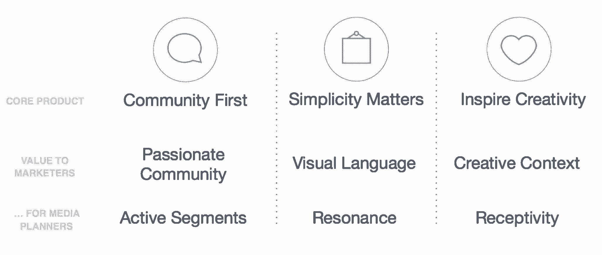
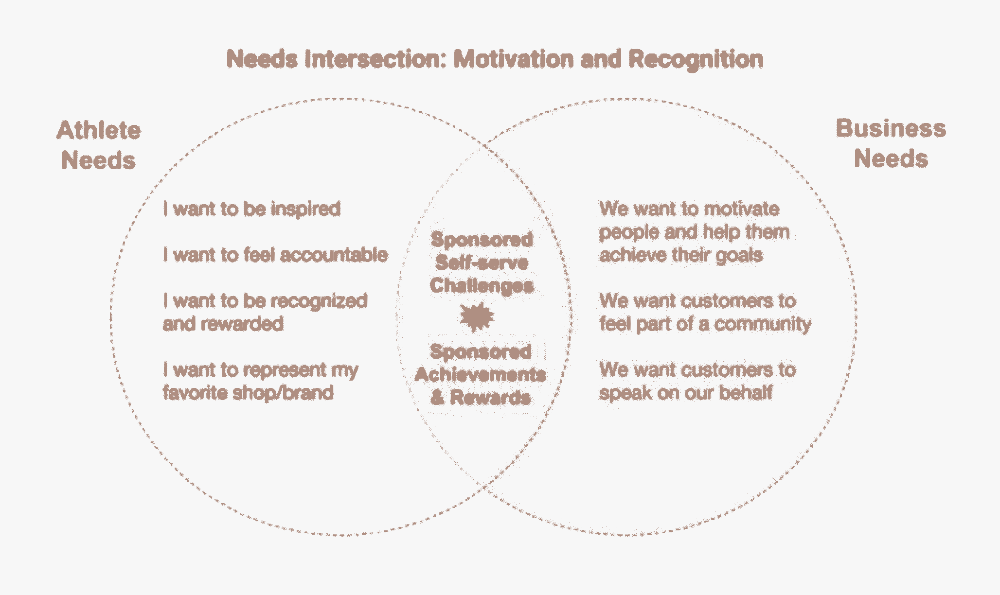

# 用户至上的货币化 Instagram 和 Strava 的经验

> 原文：<https://review.firstround.com/user-first-monetization-lessons-from-instagram-and-strava>

去年， **[詹姆斯·夸尔斯](https://www.linkedin.com/in/jamesquarles/ "null")** 与孩子小学的一位父亲进行了一次意想不到的互动。他去参加一个晚上的家长活动时迟到了，迎接他的是另一位父亲，他知道夸尔斯在 [Instagram](http://www.instagram.com "null") 工作。“伙计，你就……抓住我了，”那人说。夸尔斯没跟上。“你做的广告太可笑了——你完全知道我喜欢什么，我对什么感兴趣——所有的一切。”夸尔斯笑了笑，“那么，我想我的工作完成了。”当时，他领导的团队开发了 Instagram 的 feed 广告——旨在与用户的需求和愿望密切相关，从而为他们的生活带来真正的价值。这里有更多的证据表明它确实在这样做。

在很短的时间内，Quarles 领导了脸书和 Instagram 的联合团队，为公司建立了数十亿美元的业务，积累了如何将心爱的产品与真实有效的货币化联系起来的专业知识。这是许多初创公司在成长过程中遇到的问题，也是他们必须克服的最大挑战之一。

他解释道:“面向消费者的公司要想很好地赚钱，有几大障碍。最常见的有:

他们被鼓励等待。许多初创公司过于专注于产品的增长，他们担心货币化会阻碍增长，所以他们降低了产品的优先级。一旦他们把注意力转向这个方向，他们通常会受到风投和董事会的压力。找到适合货币化的产品市场可能需要与核心体验一样长的时间。战略和实验的捷径可能会导致灾难。

**轻松赚钱往往会损害品牌或用户体验。有许多“快速致富”的计划，从插入低质量的程序性广告到向第三方出售背景数据或电子邮件地址。但这样做可能会破坏用户信任，带来监管挑战，并明显降低核心体验。**

**赢家通吃** — **太频繁了。创业公司变得迷恋其他公司的商业模式，并相信他们的产品适合同样的剧本。但货币化模式正慢慢成为赢家通吃的命题。数字广告和移动商务就属于这一类。如果你不在你所在领域的前 5 名公司中，几乎不可能获得关注。**

这一现实让许多创业公司开始寻找一种能快速见效的商业模式，当他们失败时，这种失败是代价高昂的。Quarles 一次又一次地见证了这一点，并希望提供另一种周到而真实的赚钱方式。

他也有背景来支持他的建议。他加入了 Instagram 的联合创始人，帮助他们以一种有分寸的方式将广告引入他们的 feed 和故事。今天，他是健身巨头 [Strava](http://www.strava.com "null") 的首席执行官，追求不同的商业模式——但应用相似的原则。在他的管理下，他们增加了他们的订阅和见解业务线，创始人以一种旨在使社区更强大的方式建立了这些业务线。

**在这次独家采访中，Quarles 分享了他在创建与他们所依赖的技术产品无缝连接的商业模式方面的经验**。他希望他在 Instagram 和 Strava 学到的东西可以帮助其他创业公司找到最适合他们的赚钱方式。

# 太常见的错误

有什么比为什么大多数创业公司不能很好地赚钱更好的地方开始这个对话呢？除了上面提到的趋势之外，以下是公司可以控制的导致他们错失目标的主要错误:

恐慌会导致糟糕的决策。初创公司创始人在投资者的压力下计算收入时做出的决定很少是好的。当董事会告诉他们需要赚钱或进入下一轮融资时，他们会抓住机会赚钱。这种草率的实现是低质量的——短期思维的产物——损害了用户的信任和体验，并导致了巨大的流失。

相比之下，Strava 的创始人在 2009 年应用测试期开始后的六个月内就推出了他们的订阅业务，名为 Premium。他们从最早的时候就传达了这样做的意图，并且多年来一直在改进产品。随着时间的推移，了解人们喜欢的功能组合，他们建立了一个高保留率的业务，以及快速增长的全球社区。**他们没有在增长和盈利之间做出选择，而是将两者结合起来。**

**货币化与产品不相融合。**最好的商业模式是深度、真实地融入产品体验，并发挥其优势。许多初创公司雇佣了一名销售主管，他拥有特定领域的专业知识，因此限制了对产品支持收入的所有不同方式的探索。公司应该首先审视内部，抵制“复制粘贴”的心态。

伟大的企业就是伟大的产品，反之亦然。Instagram 能够为企业找到一个直接建立在对社区成员承诺之上的建议:

Instagram 的三个基本公司价值观为潜在的广告客户创造了一个非常自然和与众不同的主张。品牌和小企业正在寻求与人们的热情保持一致，如旅行、运动、时尚和美食，并可以通过 Instagram 非常个性化的 feed 中相关和引人注目的视觉效果来实现这一点。

启动货币化计划的最佳方式是与你的整个领导层坐下来，确定你的产品目前的超级力量。你在哪些方面比几乎所有人都做得好？你有哪些不公平的优势？

例如，当 Strava 运行这个练习时，他们列出了它的超级大国:

**无处不在**:它与所有主要设备制造商(想想 Garmin、Fitbit、Apple Watch)建立了合作伙伴关系，拥有超过 30，000 个 API 合作伙伴，使其平台成为一个重要的核心动力。

**权威**在有影响力的运动员中，他们是社区中的活跃成员，希望将自己与品牌联系在一起。人们喜欢说“如果它不在斯特拉发，它就不会发生。”

**聚合:**使收集的数据有意义并激励人们的能力。

**员工**积极主动，优先考虑应用程序的运动用户。

正如您将在下面看到的，Strava 在其历史上已经将所有这四种能力应用到创收机会中。Quarles 建议，所有的创业公司都应该花时间来总结他们独特的优势，以此作为可持续发展的基础。

**另一个错误是，他们不现实地看待用户的行为或企业的决策。**这有几种表现方式。

许多公司的“wishcast”(用夸尔斯的话说)——他们预测和设计现实生活中用户不会表现出来的行为。虽然许多公司正在为消费者定义和培训新的行为，但还有太多的公司依赖于人们做事或购物意愿的阶跃变化函数。

例如，Quarles 在某些应用程序上看到了 6000 美元的手表、2000 美元的自行车和 800 美元的床垫的广告。很少有人会在手机上购买这么多东西。更有可能的是，这些广告将播下一颗种子，当人们接近购买时间时，他们会进一步研究。因此，该应用的体验不应推动“立即购买”——更有效的做法是捕捉到一个人的兴趣，并邀请他们进入下一阶段的探索(无论是在商店还是通过在线评论)。

要想成功赚钱，你必须对人们将要采取的行动持现实态度。

**如果一家公司决定广告是他们的主要收入来源，他们需要让广告公司更容易与他们合作——但许多公司选择定制或非典型的广告形式**。这可以归结为像纵横比或地理过滤器这样的技术问题，需要一个完全不同的创意机构。大多数广告商如何编排他们的创意？找出并使用这种格式。不要试图变得聪明或可爱。不要无意中用怪异和不必要的规格来缩小你的领域，否则你将永远处于公司预算中可怕的“实验”类别。

同样重要的是，要确保你所支持的业务部门与你的产品以及他们的预算工作方式之间的一致性。在社交和消息应用的早期，许多公司建立了高效的客户服务主张，以比那些企业的其他联系渠道(电话或电子邮件)更快地回应问题。想想所有针对 Twitter 手柄和信使机器人的问题。这些社交网站然后试图说服客户服务部门购买广告，以支持应用程序的商业模式，这与那些支持团队的预算和支付方式完全不一致(传统上是按座位许可软件或支付顾问费用)。不足为奇的是，双方都对缺乏产品-预算匹配感到极度沮丧。

最后，公司通常会不恰当地确定最佳机会的大小和优先顺序。这里也有很多一厢情愿的想法。他们希望以某种方式赚钱，因此对他们最喜欢的道路的财务假设过于乐观，而不是始终如一地评估所有选项。更好的做法是为每一种选择建立保守和更乐观的范围，然后确定在每一种情况下你必须相信什么，统一使用怀疑态度。这是很好的准备，因为这正是你的下一轮投资者将如何评估你的新业务线。

既然你知道了企业家最容易陷入的陷阱，你就可以主动避免它们。但这只是等式的一半。现在你需要遵循为大多数面向消费者的公司创造成功商业模式的 4 个步骤。

# 取而代之做什么

# 1.找到商业和社区价值的交集。

对于任何想赚钱的初创公司来说，这都是一项至关重要的工作。首先，与最终用户和超级用户谈论你的产品所提供的价值。它如何融入他们的生活？为了实现他们的目标，他们通常会尝试做些什么？你的产品对他们有什么帮助(如果有的话)？

第二，与你平台上的企业或有兴趣帮助你赚钱的企业交谈。他们的需求是什么？他们想展示什么样的形象？他们需要什么来吸引更多的人？

你需要分析两种受众的动机，以找到他们在工作和生活中成功所需的根本。Quarles 说,“5 个为什么”将会派上用场。在你得到这些问题的每一个回答后，问“为什么？”至少 5 次，以确定他们的核心动机。

**在这些访谈中接近客户时，记住他们希望通过产品得到培养、帮助或改进的 10 个方面:**

附属品

表示

身份

有责任

灵感

承认

探测

独立性ˌ自立性

精通

信心

**你用你的产品创造的体验如何增强或延伸这些感觉？**这些新闻中哪一个最接近你的普通用户的动机？哪一个在他们的生活中最能激励他们前进或者对他们最重要？认识到这一点，你就有了创建商业模式的起点。

如果你正与广告商或合作伙伴合作以获得收入，对你打算与用户建立联系的企业进行类似的练习。**企业渴望和需要:**

真实性

关联

吸气

效率

支持

如果你的平台把用户和企业作为广告客户联系起来，或者以其他方式，你也需要把他们当作客户，解决他们最迫切的需求。这意味着你想采访那些在你的平台上表现良好的企业。弄清楚他们想在潜在客户身上激发什么。

Quarles 说:“对于 Strava，我们采访了有兴趣在我们的平台上互动的企业。“他们对我们感兴趣，因为他们想帮助人们实现健身目标。他们希望我们的会员将他们视为健身旅程中真正的伙伴。他们希望通过运动员而不是他们自己来表达他们品牌的价值。”

**如今，做广告的企业正在以新的方式挣扎。**无论传统广告如何重新包装，消费者通常都不会理睬它们。他们给人的印象并不真实，千禧一代的观众尤其不喜欢在他们使用的网站和应用上被强行推销。

为了给这些消费者创造一个真正不同的产品，你需要在用户需求和商业伙伴需求的交叉点上有所创新。对可能满足他们两个需求的各种想法保持开放的态度。**召集公司成员参加即兴表演/设计会议，找出新的方式与用户交流对他们至关重要的业务，真正改善他们的生活。**

**首先，在采访用户和潜在的业务合作伙伴后，通过练习来缩小思路。他们的优先级之间实际上有什么重叠？有哪些需求是一样的？专注于这几个领域和想法。Quarles 在 Instagram 和 Strava 上都进行了采访，然后敦促他的团队缩小和提炼，直到他们有几个需要关注的行动领域。**

在上面的例子中，你可以看到 Strava 如何有机会同时支持他们的社区的兴趣，以激励和挑战一个体育品牌成为实现其目标的人的一部分的愿望。在这个交叉点的中心是公司将在未来几个月测试的几个产品创意，在他们的体验中创造更多的成就和回报的机会。

Strava 的 Metro 产品是一个收入模式的重要例子，它同时满足了企业和消费者的核心需求。Strava|Metro 由公司创始人于 2014 年推出，是一个洞察平台，它聚合了每年超过 3 亿次乘车和跑步的会员记录数据，以突出路线使用情况，并帮助确定基础设施投资的最佳位置。Strava 将该数据集授权给世界各地的城市规划部门。在短短四年内，Metro 已经成为 130 多个政府机构和组织的首选工具，这些机构和组织希望展示自行车道、跑步路线和其他新基础设施的影响。通过这样做，它帮助 Strava 实现其使命，为其成员提供更好的骑行和通勤服务，同时发展 insights 业务线。

Quarles 说:“当我们进行识别 Strava 超能力的练习时，我们看到真实性、我们的活动图和数据汇总名列榜首。”“因此，我们的下一个任务是确定如何将这些能力结合起来，为我们的最终用户提供更好的体验，同时支持能够为我们带来收入的业务。”

# 2.把你的商业模式放在用户体验的中心，而不是边缘。

从问自己这些问题开始:

你的产品在哪里参与度最高？对于 Instagram 来说，这是主页。

你的原子单位是什么？人们最常采取的行动是什么？在斯特拉瓦，它是一种活动，一个人的跑步、骑行或游泳。

在你产品的这一部分，什么样的商业模式会为用户创造更好的体验？在 Instagram，这有助于发现新产品和小企业。对斯特拉发来说，这可能是发现其他成员所做的活动。

最成功的商业模式将存在于产品的这一部分，使用相同的机制，并且随着好处变得明显，可以促进更多的使用。

大多数企业在核心体验之外开始他们的收入测试，担心会减缓如此有效的方式。Quarles 说:“常见的谬误是，无论你做什么，货币化都会降低用户体验。“通过将他们赚钱的方式推到一边，他们希望这些测试不那么引人注目或具有侵犯性。”更常见的情况是，它们没有获得足够的吸引力，因此没有意义，结果也无法传递到更高流量的位置。

相反，如果你从产品的中心体验开始，随着时间的推移，结果将更具伸缩性。它会帮助你学得更快，因为你会有更多的观众来测试——它最终会推动你找到最好的、最持久的产品创意，因为你的门槛更高了。

在 Strava，原子单元正在上传健身活动——这是用户最常做的事情。每天有数百万的活动被上传。它的订阅收入模式非常符合这一点——随着会员扩展他们的健身目标，他们上传更多的活动，并在付费版本的服务中寻找额外的分析和安全功能。

Quarles 说:“你的商业模式和你产品的使用应该是一致的。”“订阅、内容、商业、广告、见解——每一种模式都最适合你的产品对人们有用的不同方式。”

随着 Strava 探索新的业务线，它采取了同样的策略，即确定什么对用户最重要。Strava 进行了大量的用户访谈，以了解他们的社区成员的动机，不仅仅是使用该产品，而是他们的健身目标和日常生活的同心圆。

“我们一次又一次地听到，人们希望受到鼓舞，他们希望有责任感，他们希望在与他们有密切关系的社区中得到认可，”他说。“特别是，他们希望向与他们有共同兴趣和喜爱品牌的其他运动员学习。他们想要可靠的消息来源。随着这成为他们使用 Strava 的核心原因，这为我们向他们介绍增强他们对跑步、滑雪或游泳的热爱的产品和服务提供了新的机会。”

# 3.优先考虑那些可以扩展到成百上千的消费者和商业伙伴的想法。

这条建议与消费者和小型企业最为相关，对他们的成功至关重要。尽可能早地确定你的想法有这种规模的潜力。

如果你需要花时间去尝试一些不可扩展的东西，这没关系——但是它仍然应该是你的北极星。例如，当 Instagram 首次将广告整合到 feed 中时，他们发现需要对市场进行一些调整，以依赖视觉传达他们的信息，而不是简单地移植为其他数字环境设计的大量文本横幅广告。联合创始人兼首席执行官[凯文·斯特罗姆](https://www.linkedin.com/in/kevinsystrom/ "null")会和负责团队一起审查每一个广告，主要是为了促使他们对 Instagram 广告的内容更有意识。但支撑这一学科的想法是，最终客观的最佳实践将出现，使大规模成为可能。

Quarles 说，值得注意的是，规模不仅仅是因为它能带来更高的收入。更确切地说，规模是一种工具，可以持续地从根本上改善用户对产品的体验质量。如果你从这个角度看待它，你会更有动力去实现它，并在你实现它时看到它的优势。

扩大你合作的企业数量可以创造丰富的多样性，这可以最大限度地提高你的建议的相关性，从而创造更高质量的体验。

可以这样想:Instagram 扩大了其消费者基础和对广告感兴趣的企业数量。显示给每个用户的广告位的数量没有增加，但是他们可以选择显示给用户的广告的数量和多样性增加了。这使得该公司能够向个人用户展示越来越多(现在非常挑剔)量身定制的相关广告。不可避免的是，这导致了一个随机的父亲接近 Quarles，谈论 Instagram 如何改变了他的生活。如果你做对了，你会达到一个全新的质量水平。

Quarles 已经看到太多的企业以错误的方式处理规模，因为他们没有考虑这种进展，并相应地设计他们的体验。Google AdWords 破解了同样的难题，允许数百万小企业一天 24 小时主动花钱，最终为数百万用户提供了一个伟大的付费加免费搜索体验。确保规模从一开始就在计划中，并且它是为服务质量而设置的。

# 4.挖掘可重复的预算，随着价值的实现而增长。

Quarles 说，当与广告商和其他收入伙伴合作时，要警惕“实验性预算”。当你开创自己的商业模式时，这将不可避免地出现。你会被诱惑与提供大量预算的合作伙伴一起工作，在非常实验的基础上做令人敬畏的事情。一个明显的迹象是，他们有多在乎新闻价值，或者仅仅是第一个做某事。

问题是，他们不常重复。喜欢进行实验性活动的合作伙伴通常都是“一劳永逸”他们尝试一些东西，然后转移到下一个闪亮的物体上。他们不衡量投资的影响或投资回报率，因为这对他们来说是可有可无的。他们不会回来了。将时间分配给这些类型的项目将不会利用经常性收入的深井。

**相反，在开发收入流时，你的目标应该是确保最终用户参与的价值是*****明确衡量的，并随着时间的推移而增加** —这将使他们不断回来，并使收入可重复。不只是从早期客户那里拿钱需要很强的纪律性。重要的是要确认你的会员重视增加的体验，企业能够直接比较他们在你的服务上的花费与其他选择如何产生价值。*

*“尤其是游戏公司已经真正抓住了这一点，”Quarles 说。“许多游戏给玩家付费的机会，以加速游戏的各个阶段，使体验更加有趣和有益。他们不必等一天才能轮到自己，而是可以支付少量费用，立即继续玩下去。”这就是为什么允许人们在游戏中购买物品来增加他们的乐趣是一个巨大的赚钱机会。热门游戏《部落冲突》的开发商 Supercell 就采用了这种模式，其市值超过了 Evernote、Eventbrite 和 Buzzfeed 的总和。*

*效果广告也随着它提供的结果而扩大。“所有企业都在寻找经济高效的方法来寻找新客户或为新产品创造商机。如果你能清楚地证明你正在引起他们的新兴趣，即使这不会直接导致销售，这些企业也会将越来越多的营销预算分配给你。”*

*你的公司怎么能把这种魔力装瓶呢？Quarles 建议对您的最终用户进行调查，以 **a)** 确保他们感觉到，随着他们参与度的增加，他们获得的价值也在增加(即，您是否觉得您使用我们的产品越多，您的体验就越好？);并且 **b)** 确定当他们花更多时间使用你的产品或服务时，他们希望看到什么价值——这是产生未来想法的好方法。*

*“在 Strava，我们看到对这两个问题的积极回应是非常重要的。Quarles 说:“我们的主要收入渠道是订阅，所以这项服务需要随着更多的使用和更多的投资而变得更有价值。”“我们必须为付费用户推出足够多的新功能和机会，不仅让他们觉得物有所值，而且让服务更好地适应他们的目标和培训重点。”*

# *概括起来*

*所有这些都需要记住——成功的模式会因公司而异，取决于行业、消费者与企业以及成长阶段。**不管这些细微差别，一个收入模式是否成功很大程度上取决于用户的动机**。从那里开始。做研究和采访来理解这一点。然后，如果你和广告商或商业伙伴一起工作，也问问他们的动机和需求。找到重叠部分，让它为你的创造力提供一个有益的约束。*

*如果你只能从 Quarles 课程中记住一些其他的东西，那就让它们成为这样:**最好的模型是可重复的、可测量的，并且总是为你的用户增加价值的。最重要的是，抵制诱惑，不要让你的商业模式成为次要或次要的问题。让它成为你产品跳动的心脏，就在核心处——这样你才能生存下去，并最终茁壮成长。***