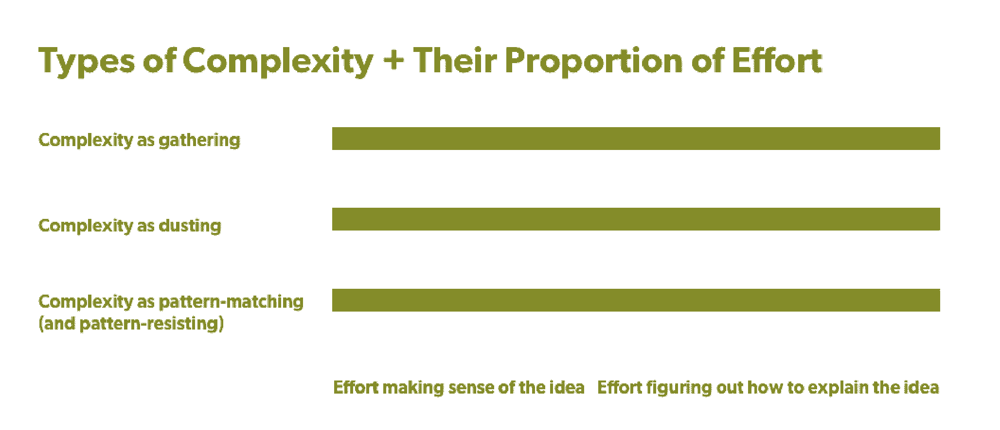
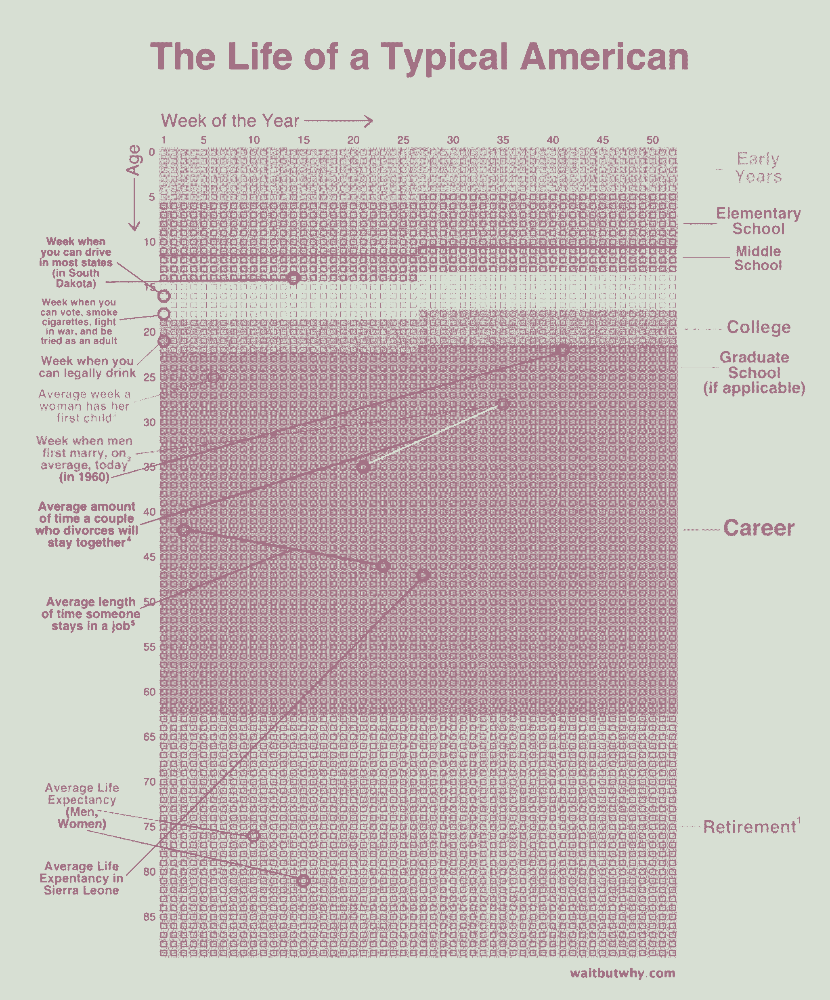
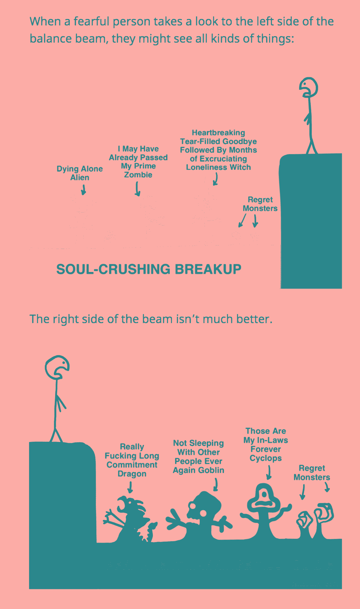

# 等等，为什么蒂姆·厄本在分析和传递复杂的想法

> 原文：<https://review.firstround.com/wait-but-whys-tim-urban-on-parsing-and-transmitting-complex-ideas>

在李小龙的[最后一部电影](https://en.wikipedia.org/wiki/Game_of_Death "null") *，*中，他的角色一路战斗到一座宝塔的顶端，在每一层击败不同战斗风格的敌人。随着他的上升，他发现对手比上一个更具挑战性。在顶楼，他面对的是身高 7 英尺 2 英寸的卡里姆·阿卜杜尔·贾巴尔，他的武术风格和实力与他不相上下。李的任务是找回一些神圣的东西，尽管它从未被命名。

在内容的世界里， **[迪姆厄](https://waitbutwhy.com/wait-but-who "null")** 就是长篇的李小龙。他以无与伦比的风格处理最神秘、最纠结的话题，从[人工智能](https://waitbutwhy.com/2015/01/artificial-intelligence-revolution-1.html "null")到[拖延症](https://waitbutwhy.com/2013/10/why-procrastinators-procrastinate.html "null")，从[人体冷冻](https://waitbutwhy.com/2016/03/cryonics.html "null")到[选择生活伴侣](https://waitbutwhy.com/2014/02/pick-life-partner.html "null")。 **[等等，但是为什么](https://waitbutwhy.com/ "null")** 的博主现在正在和他的顶级挑战者战斗:宪政民主和政治文化。神圣的东西每天都岌岌可危？为好奇者简化复杂——现在有 60 万订户和 100 万每月独立访客。

在这次独家采访中，Urban 分享了他如何提炼和展示复杂的想法，以便这些想法丰富多彩并引起他人的共鸣:这是每个创业领导者和团队都必须反复掌握的行为。他讨论了三种常见类型的复杂想法——以及为什么这些区别对你如何解开它们至关重要。然后，Urban 分享了他如何向他人解释困难的概念，以及 1-10 分的评分如何有所帮助。最后，他提供了一些关于如何表达概念的建议，以便这些概念对他人有吸引力和有用。从《两个编辑团队》到《两个编辑团队》,《评论》深刻地阐释了《何以堪等》。任何拥有同样精干团队的创业公司都可以从 Urban 和他的方法中学到很多东西。

我们的大脑想要 1 和 0。但现实世界是模拟的，灰色地带和光谱。

# 复杂本身就是复杂的

在每一个转折点，初创公司的创始人都需要学习并向投资者、他们的团队、客户和公众传达关于他们公司或行业的复杂想法，而不失去他们——或想法的细微差别。这不是一件容易的事。甚至 [tech 最受尊敬的创始人](http://stateofstartups.firstround.com/2016/#highlights-leaders "null")、Elon Musk[也求助于 Urban 来帮助解释](https://waitbutwhy.com/2017/03/elon-musk-post-series.html "null")他正在开发的技术、他的想法以及下一步的计划。

**第一步是确定** ***你试图解开的*** **是什么类型的复杂性**。Urban 观察到了几类主要的复杂性，每一类都是由解开它所需要的行动组合来定义的。姑且称之为:**作为聚集的复杂性，作为除尘的复杂性**和**作为模式匹配(或抗模式)的复杂性**。对于每一个，都有不同的努力和时间分配来解开一个困难的概念。

# **复杂如拢**

第一类复杂性需要研究者的心态。消除这种复杂性的主要方法是收集:收集所有的材料并加以理解的能力。以 Urban 在 Elon Musk 的脑机接口开发公司 Neuralink 上的[帖子为例。虽然写这篇文章需要时间，但厄本把大部分时间都花在了寻找材料和学习上。一旦他收集了理解公司和技术所需的信息，就可以相对简单地创建一个结构化的、更易于他人理解的叙述。](https://waitbutwhy.com/2017/04/neuralink.html "null")

“我确信[Neuralink]在工程事业的大胆性和使命的宏伟性方面设法超越了特斯拉和 SpaceX。另外两家公司旨在重新定义未来人类将会做什么——neural ink 希望重新定义未来人类将会是什么样子，”厄本说。“Neuralink 的任务之大，令人难以置信，再加上人类大脑的复杂程度，让我觉得这是迄今为止最难完全理解的一套概念，但也让我感到最兴奋的是，在花了足够多的时间放大两端后，终于明白了。”

当复杂性是关于收集足够的信息以便能够消化并向他人解释时，它是一个前置的过程。大部分时间花在组装和排序组件上。“要解释 Neuralink，需要教的东西实在太多了。我花了至少 50%的时间去寻找、收集和学习这些信息。这是典型的复杂性，有些东西需要花一段时间才能解释清楚，”厄本说。“与两分钟就能解释清楚的事情不同，这需要花上几个小时认真倾听。有太多的教育需要进行。目标是把一个结构化的包放入某人的大脑，这样它就以一种有组织的方式生活。否则，两周之后，事情会变得一团糟，他们无法解释这个想法。”

# 复杂性如除尘

第二类复杂性要求戴上考古学家的帽子；它强调侦探工作和寻找被埋没但古老的东西的决心:一个较少被学习而更多被揭示的想法。一个主要的例子来自*等等，但是为什么*是 Urban 的[厨师对厨师的概念](https://waitbutwhy.com/2015/11/the-cook-and-the-chef-musks-secret-sauce.html "null")。简而言之，厨师和厨师似乎是同义词，但他们不是。厨师*发明*食谱；厨师*遵循*的食谱。这个想法在应用上很复杂，因为一旦它被理解，这个概念就像一个原则一样。例如，它可以帮助解释创造和创新之间的区别。

厄本用这个比喻的方式非常像除尘。当他在研究不同的主题时，他看到了“厨师和厨师”的概念。而且，一旦他找到了，他问自己:这个概念在别处哪里？然后他看到到处都是。这种类型的复杂性是后加载的。解释的时间少了，根深蒂固的时间多了。它本身很简单，但如何开启其他复杂的想法却很复杂。

“‘厨师和厨师’是一个难以置信的简单概念，我可以在两分钟内向某人解释，他们就能理解。所以复杂的不是这个。“复杂的部分是你如何知道‘厨师和厨师’是首要原则，”厄本说。“如果你开始寻找它，你会发现厨师/厨师的事情到处都在发生。音乐、艺术、技术、建筑、写作、商业、喜剧、营销、应用程序开发、足球教练、教学和军事战略领域都有厨师和厨师。”

这种复杂性的挑战在于如何解释这个想法，让人们不仅能理解它，还能应用它。“如果你能向某人解释清楚，他们不知道该怎么办。他们可以把它内化，但是第二天就忘记了。如果你已经解释清楚了，你就已经完成了 20 步中的第一步，”厄本说。“接下来的 19 个步骤是最难的部分，那就是让人们以生活中不同的方式将这个概念深深地内化——他们有可以赋予它的文字和视觉效果，这样他们就可以真正地想象这个概念。对我来说，这是让这个概念深入到一个人的心灵——不仅仅是他们的理解，而是他们的直觉。”

解析复杂性就像找到一块化石，意识到它是骨架的一部分，一个可以支撑生命的框架。

# 作为模式匹配(和抗模式)的复杂性

然后是混合了前两者的复杂性:它不是前装或后装的，而是贯穿始终的。信息的收集发生在整个学习和解释过程中。你在为一个简单而丰富的想法除尘，而这个想法不可避免地是一系列复杂想法中的一部分。具有挑战性的工作是将每一个新的信息分配给一个模式，然后——也只有在那时——决定是否应该包含或拒绝该模式。

这方面最好的例子来自厄本的作品，可能是一个即将到来的例子:一个他正在写的关于民主、暴政和政治文化的例子。“对于像社会这样的东西，它将花费我永远的时间，因为它将是我试图在模拟复杂性和独特性的整个混乱中找到模式——诚实的模式。很难做到不鲁莽，因为你可以不小心找到模式，而且已经有一堆由政治规则和部落设定的预设模式，”厄本说。“如果你真的仔细观察，你会发现一些不那么明显的模式，但这些模式非常重要，值得注意。”

但是，即使你最终在像社会这样复杂的概念中找到了这些模式，决定如何分享这些观察结果也是很复杂的。“如果我在解释人工智能，我会让一群人带着谦卑的眼光阅读，说‘是的，我不明白，我想让它变得更好。’但是如果你试图解释政治中的一些事情，人们不会更好地理解它，但是他们认为他们理解。“每个人都立即穿上他们的‘制服’，不管是政治、宗教还是某种意识形态，”厄本说。在那个世界里，没有谦逊，也没有对自己专业知识的真实错觉。"

# 三个复杂因素概括起来

对于那些寻求向他人传达复杂想法的人来说，首先要确定*如何*更有效地向他人简化概念是复杂的。Urban 观察到，他经常花同样多的时间来理清一个困难的想法。不同的是破案所需的*类型和努力比例*——知道这个比例可以帮助你更好地处理复杂的想法。

许多话题都非常复杂。他们需要一段时间来弄清楚。落入这些不同复杂类别的想法通常花费我同样多的时间。但是你的目标——尤其是当你作为一个创始人或初创公司时间紧张的时候——是让它不要花太多时间。这三种复杂性中的任何一种都需要持续的努力才能弄清楚。但是努力的组成和平衡才是关键。

# 世卫组织，你是为了什么而穿越复杂性？

复杂性分类法对于定义如何处理一个想法非常有用——但是一旦你对它的类别有了概念，你就必须清楚如何向别人解释它。

以下是要问的问题:

作为这个想法的学习者或解释者，你的目标是什么？Urban 说:“如果我在教授一门博士课程，我需要达到一个超越专家所知的水平——一个超高的水平——这样我就可以让那些已经有了先进理解的人在特定的科学领域做原创性的工作。”“用等可是为什么，那不是我的目标。我的目标是让读者对一个复杂的想法*有一个清晰的理解，他们不需要成为*方面的专家，但他们可以有足够的知识来谈论它，提出问题，并对它有独立的想法——无论它是政治，技术还是心理学。”

那么，这对试图向投资者解释自己技术的创始人来说意味着什么呢？或者招聘经理向候选人传达公司的新兴技术？

**在 1-10 分的范围内，指出你的解释的接收者属于哪个等级:**

10 -是这个想法的世界领先专家。

**9** -能够提出专家问题，并就想法生成新的信息/数据。

**8**——能够回答专家的问题，调和关于想法的矛盾想法。

**7**——能够回答任何外行人的问题，并对想法形成独立的思考。

**6**——能够回答任何外行人的问题，并对想法形成明智的意见。

**5**——了解想法，并能辨别关于想法的不准确陈述。

**4**——了解想法，能用自己的话解释所学内容。

**3**——听说过这个想法，并背诵别人对它的评论。

听说过这个想法，但对此一无所知。

从未听说过这个主意。

首先，在挖掘一个复杂的想法之前，先在秤上找到自己。受 Urban 如何对理解水平进行数字排名的启发，尝试使用该量表来评估您对特定主题的理解程度。“当我进入主题时，我可能会从两三个开始，我的目标是至少达到六个——可能是七个，但可能是六个。在这里，我可以回答任何外行人的问题，我有明智的意见，但也可能感到谦卑，”Urban 说。“当专家说出与我的想法相矛盾的话时，我会认真倾听，并表示反对。我不会自动相信它，但我会考虑它，也许会修改我自己的结论。我发现拥有六级理解力是如此有趣。突然，你看的关于题目的东西都有意思了。你可以坚持你已经建立基础。”

第二个在天平上绘图的人是想法的接受者。对 Urban 来说，那是他等待但为什么的读者，但对你来说，那可能是你的顾客。“我看到了六级理解的价值和乐趣，所以我的目标也是向读者传达这一点。“我想让他们加入这个派对，和我或彼此一起独立思考一个话题，”厄本说，他在那里迎合其他人的“时间”“蒂姆”是一种特定类型的人:他真的喜欢做“6”，但又不想做“8”。听着，我不是那种独特的人。我很好奇。我不是这方面的专家。如果事情变得太技术性，我会感到厌烦，但如果对某件事情有了基本的了解，我会非常兴奋。对我来说，我永远不会离开这些人。"

**然后，比较作为一个学习者和作为一个解释者所需要的提升。**在 Urban 的例子中，他的目标是将他的等待传递给读者，但为什么读者与他到达的水平相同，只是更快(稍后将解释)。厄本认识到，他的情况很罕见，因为一般来说，他的读者和他走的距离是一样的。并非所有企业都是如此，但对市场机会的评估是一样的。

“如果我开始把它变得简单一点，并试图让人们得到 4 分，我会赢得一群不会读这么长文章的新人。那些真正想要我想要的东西的人会失望，所以我为什么要这么做？”厄本问道。“有很多解释者网站试图让你从 1 到 3，但在我看来，想达到 6 的人是服务不足的观众。我知道这一点，因为我就是其中之一。”

底线是:使用量表将你的购买者当前的理解水平与他们购买所需的知识类型对应起来。你的目标是找到他们采取你想要引发的行动所需的最低限度的可行理解，无论是购买产品还是对未来的愿景。“带上伊隆。他想激发大众对一些他知道只要他们理解就会关心的事情的热情。这就是他的目标与内容。不是特斯拉的规格有多酷。但是为什么能源、多星球殖民和人工智能安全很重要。他想让他们的头脑比其他人早 20 年进入正确的位置，”厄本说。“对于其他试图销售一种新营养品的人来说，他们的目标可能是教育特定的目标受众，他们知道这些人关心营养，但他们不明白他们有误解。我们的目标是澄清这一点。总之，从以下问题开始:我想接触的受众是谁？在 1-10 的范围内，他们从哪里开始？”

Wait But Why's Tim Urban

# 向他人展示复杂的想法

Urban 平均要花 160 个小时来学习他需要学习的关于一个主题的所有知识，才能写一篇文章。但是他知道没有人会像他花在学习上的时间一样多花在阅读上。厄本知道，如果读者愿意花两个小时阅读他的帖子，他就是幸运的，所以他的挑战是以一种读者可以比他快 80 倍的速度学习的方式呈现复杂的主题。

他更喜欢通过类比来描述从学习到教学的过程。“对我来说，学习过程就是蒙住眼睛。我四处摸索，试图找出树在哪里。随着我开始了解更多，眼罩开始摘下，最终我可以看到大致的区域，”Urban 说。“然后我上了直升机，开始上升，最终我可以看到整个画面。最终，我在一架飞机上，我可以看到整个画面并非常好地理解它，我不仅可以看到这些树是什么，还可以看到它们周围的环境以及它们为什么重要。”

那么，你如何从蒙眼导航到大气呢？根据 Urban 的经验，这里有一些方法可以帮助你更好地表达复杂的想法。

# 拉伸滑索。

穿过任何风景的最短距离通常是直线距离。在厄本的直升机上，如何最快地从 A 点到达 b 点变得更加清晰。他在人体冷冻上的[帖子——死后冷冻自己——就是一个很好的例子。“当我开始的时候，我一点概念都没有。我读了所有关于延长寿命、细胞和血液以及当前医疗技术的书。“一切都很混乱，”厄本说。“但是当我完成的时候，我意识到这里有一条清晰的主线，那就是:*死亡的定义并不是你想象的那样*。我们对死亡的定义是:当今天的医学技术无法拯救你的时候。当那发生时，我们称你为死亡。但是人类死亡的实际定义——如果你认为人类是他们的大脑、个性、记忆、才能和智力以及所有其他使他们成为他们的东西——只是你头脑中的硬盘驱动器。这只是基于组成你大脑的原子的排列。在我看来，你就是这样安排的。”](https://waitbutwhy.com/2016/03/cryonics.html "null")

一旦厄本明白了这一点，他就知道他必须做什么。“我需要改变人们对死亡意味着什么的观念，以及延长寿命背后的核心价值观。我必须证明，这不是虚荣和自恋，就像与癌症作斗争一样。很勇敢。是热爱生命的精神让你想要寿命延长。我必须摆脱这种耻辱，”厄本说。“第二，我不得不为死亡的重新定义提出一个理由。我不得不把它定义为当你大脑中的物理原子已经退化到这种程度，排列不再不仅不存在，而且不再能被未来最有想象力的科学家恢复。现在你走了，没有什么能让你回来。*那真的远远超过了我们认为某人已经死亡的程度。那个人，在我对死亡的定义里，是活着的。它们就在那里，它们的原子在大脑中的排列就在那里，任何人都可以弄清楚——它就在那里，但我们让它恶化成不可恢复的东西。”*

# 为你曾经是门外汉的人写作(尤其是如果你现在是专家的话)。

为了在帖子中提出这些观点，Urban 需要将他的思路从一个可能没有考虑或同意人体冷冻的读者延伸到一个已经考虑或同意人体冷冻的读者。当他建立了这个轨迹，它就变成了事实的排序:从人体冷冻背后的科学到死亡意味着什么，到你的身体会发生什么，到死亡在未来可能意味着什么。“所以我要按时间顺序来解释这些事情——所以我当时学到的 80%的东西都被删掉了，因为它们不相关。所有关于老年痴呆症或中风的论文研究。它帮助我理解了一些东西，但这并不重要。所以经过四周的研究，我把它包装成一个紧凑的东西。我基本上可以用自己的后见之明说，这花了 150 个小时，但如果我能在两个小时内完成，这就是我需要学习的。”

当然你是个门外汉。你有多聪明并不重要。世界上的每个人在大多数事情上都是门外汉。

当 Urban 写他的帖子时，他似乎处于一种特殊的困境:**既想理解任何外行人的问题，同时又保留了作为一个外行人的记忆**。这不仅是谦逊的关键，也是能够在复杂的话题中引导任何读者的关键。“对于像人工智能这样的东西，许多文章都是从一个假设开始的，即我已经知道人工智能是什么——而我实际上并不知道。当我阅读的时候，我总是觉得我的大脑的一部分马上关闭了。厄本说:“我从来都没有方向感。“对于人体冷冻，我马上就知道了。我感到怀疑。这看起来既不可能又有点可笑。所以对于人工智能，我想开始并建立人工智能的最初定义——并将它与机器人以及电影让我们认为的人工智能区分开来。”

如果你读《等待但为什么》,你会发现当他不知道某件事时，他向读者发出信号——微妙地或公开地。他试图立即解释，并解决任何其他早期的困惑点。这让读者放松了警惕，所以他们信任他的取向。你的目标是通过怀疑的墙——相信这篇文章不是为他们写的。

# 发自内心地表达观点——不仅仅是视觉上的。

他们说一张照片胜过千言万语。但是 Urban 既使用了图像，也使用了雄心勃勃的字数，所以他的视觉效果需要达到更多的东西。以下是他选择插图类型的原因——以及如何使用图形达到最佳效果的技巧。

将烟火碾碎。视觉简约对 Urban 至关重要。“很多时候，我看到一个画面，里面有一些看起来很漂亮的计算机图形，但其中缺少实际信息。Urban 说:“如果你去掉所有的图形，把实际信息放在一个简单的 Excel 表格中，你会发现实际上并没有那么多信息。“当你把所有这些空白的图形打扮成一幅漂亮的信息图时，那是错误的关注点。”

作为一个实验，从一个图形中取出所有的数字，放入一个电子表格中。现在，将这个奇特的图形与图表进行比较，并问自己:

是措辞得体还是有点多余？

它是数据的优雅捕获，还是呈现或屏蔽部分数据？

它是正确地分类还是错误地合并要点？

这些问题可以帮助你了解一个图形是否增强了一个复杂的想法。一个很好的例子就是 Urban 的[时间段帖子](https://waitbutwhy.com/2016/10/100-blocks-day.html "null")。在这种情况下，数据的可视化布局只是一堆块，但它们之间的距离真正说明了问题。对于大多数人来说，一个段落很难理解这个想法的重要性。

The Life of a Typical American

通常，一个简单的手绘箭头看起来就像是教室里的老师在教你一些东西，而不是闪光的营销材料。“我不想假装做花哨的、制作精良的视觉效果。我这样做就像如果我在餐馆里有一张餐巾纸，我会教一个朋友。好的导师不是带着一堆营销的东西进来的；他们在白板上用不同的颜色和简单的线条画画，”Urban 说。“所以我试着这样解释。很多时候，你试图捕捉一个复杂的心理概念或无论它是什么，这种情况下，我会创作有趣的图画。我要创造简笔画的人或简笔画的动物，因为对我来说，如果你能让人们高兴一点，如果他们看着这些东西时微笑或大笑，那会更好。事实就是如此。”

**撑破肚皮。**你不需要成为数据的戴夫·夏佩尔，但要在你的故事中找到幽默的边缘。这通常是你可以加速解释或引起共鸣的地方。“想想你十年没看过的最喜欢的搞笑电视剧。你大概能背出其中的 20 行，告诉我所有不同的情节。当某件事让你开心时，那是因为悬念或幽默。你的大脑锁定是因为它很高兴，它会一次又一次地重放有趣或引人入胜的时刻。如果你的大脑感觉像是在工作，它就不会记得了。我相信有些人在看到一个愚蠢的图表时会检查出来，这没什么。这并不适合所有人，但对我来说，我会通过这种方式更好地学习和记忆。”

The Marriage Decision

# 选择能让你坚持到最后的主角。

对于 Urban 来说，最困难的部分可能是选择一个将他的观点贯彻到底的角色——在严肃性和欢乐性之间取得恰当的平衡。有时这是一个匿名的简笔画。其他时候是他。但是选择一个信使来传递故事通常是最困难的部分。以下是一些可以帮助您找到讲述者的问题:

谁在牵着读者的手？

是我还是一个讲故事的角色？

叙述者在幕后吗？

他们可以/应该从哪里开始？

你在玩什么游戏？

你用的是什么声音？哪些情绪？

他们的工作是展示还是讲述？

答案不止一个 Urban 承认，提出一个复杂的想法是一个挑战。“老实说，我不擅长这个。这就是为什么我要花很长时间。这不是我突然想到的，”厄本说。“我坐在那里，有时会苦干几个星期，试图找到一个合适的结构。我不希望它只是功能性的。我希望它能以结构化的方式传递所有信息。”

为了展示不同的主题，Urban 并列了他的[拖延](https://waitbutwhy.com/2013/10/why-procrastinators-procrastinate.html "null")、[人体冷冻](https://waitbutwhy.com/2016/03/cryonics.html "null")和 [SpaceX](https://waitbutwhy.com/2015/08/how-and-why-spacex-will-colonize-mars.html "null") 帖子。“所以有了拖延症，我的脑子里就有了相互对抗的核心力量。因此，与其描述他们的心理和大脑结构，不如让我们来描述他们的真实情况:非常难忘和有趣的角色，这比仅仅解释某些事情的心理要好得多——读起来更有趣，也更令人难忘。有即时满足的猴子或恐慌的怪物。它们的名字是描述性的，而且画得很幽默，所以读者会记住它们，”厄本说。“但是人体冷冻，没有角色。我本可以说，‘这是乔。乔想活这么久。但是这种可爱会妨碍工作:死亡的概念。你不需要乔；他是一个分心，我只需要看着读者的眼睛，和他们说话，并解释一些狗屎。关于 SpaceX，有很多东西可以谈论，所以我需要在一开始就让人们接受，给他们一个我们要去哪里的暗示，因为有些人会因为太长而放弃。但是，如果人们理解了故事的脉络，他们就会开始着迷——而且故事的结尾会非常有趣。"

伟大的叙述者都是综合符号。记住它们就是回忆起整个概念。但是如果它们不能代表完整的概念，讲述者就失去了部分概念。然后你会失去一部分观众。

# 把这一切联系在一起

当想到一个难以理解的想法时，人们很容易以一种独特的方式来思考复杂性。相反，考虑它的三种不同形式:作为收集的复杂性，作为除尘的复杂性，以及作为模式匹配(和模式抵抗)的复杂性。每种类型的复杂性都是由最需要解开它的行为来定义的。接下来，在从健忘(1)到领先专家(10)的范围内，为你的听众和你自己绘制出你想要的起点和终点。你很少会把一个人从 1 带到 10，但是知道并拥有你带你的读者的那段旅程会对你有好处。最后，当提出一个复杂的话题时，遵循一些经验法则:传递铃声和哨声，通过轻佻来愉悦，选择一个像赛马一样的主角:一个能让你坚持到最后的主角。

“试图解释、包装和展示复杂想法的人需要事先投入工作。他们需要学习足够多的知识，才能达到能够独立思考的水平，才能真正用自己的头脑思考问题，然后才能成为一名有效的解释者，”厄本说。“我认为这些早期过程应该发生在任何文字被书写或图画被绘制之前。把你自己的大脑包裹在它周围，然后构思如何呈现它，这是 80%的工作。人们可能只花 10%的时间做这两件事，而大部分时间他们坐在那里执行。这样做是不对的。”

*图纸由* *[的迪姆厄绘制但为什么要等](https://waitbutwhy.com/ "null")* *。*